# OpenDSA TDDI16F25 数据结构与算法（数据结构和算法设计）

*本文件由 https://www.ida.liu.se/opendsa/Books/TDDI16F25/html/ 的网页转换而来；公式为 KaTeX 格式，代码优先采用 Java (Generic)。每个章节也有独立的 Markdown 文件，见本目录。*


---

# Chapter 0   Preface


<a id="how-to-use-this-system"></a>
# 0.1. How to Use this System

**Welcome to OpenDSA!**
OpenDSA is an open source project whose goal is to provide online
course materials for a wide range of Computer Science courses.

**Learning Management Systems and OpenDSA Book Instances**
OpenDSA materials are most often presented in the form of a
“textbook instance” as content within some Learning Management System
(LMS), such as Canvas or Moodle.
Your OpenDSA “textbook” is made up of a series of modules.
Each module corresponds to roughly one section in a regular textbook,
or what might get presented in part of a one-hour lecture.
OpenDSA content combines text and images with algorithm visualizations
for all of the algorithms, along with lots of interactive assessment
exercises.
The goal of the exercisees is to let you know if you really understand
what you have been reading.

**Registration and Accounts:**
This is an open source project, and in keeping with the spirit of our
commitment to openness, our materials are free for use.
We maintain versions of our materials that are publicly accessible.
However, in order to receive credits for completed exercises, you
need to sign in. This is done using the “register” or “login” buttons
at the top of the page.

**Overview of major elements:**
An OpenDSA module contains a number of interactive components
intended to help you learn the material, in addition to regular text
and graphics.
Most modules include short slideshows that help explain steps of an
algorithm.
OpenDSA also includes full Algorithm Visualizations that go through a
complete example of the algorithm (these will usually let you set the
input data if you like).
There are many “proficiency exercises” where you show the steps
taken by an algorithm.
There are also many sets of multiple choice, fill-in-the-blanks, and
True/False questions.
There are also various calculators, simulations, and other types of
interactive exercises.

**Getting credit:**
You can get “completion” for doing the various activities.
When any of the following activities are completed, the interface
should give you some type of feedback such as showing a green
checkmark or shading an associated line in the gradebook. Furthermore,
you can always check your progress by clicking on your name in the top
right of the page to access the gradebook.
Depending on how your book is configured, completing an activity might
or might not give assignment points, as shown in the gradebook.

**Seeing your credit and seeing your current score:**
Usually an exercise or slideshow will give you visual confirmation
when you have completed it.
If you complete all exercises and slideshows for a module, the title
line should show “Module Complete” in green.

**Slideshows:**
Slideshows are controlled by the buttons at the top of the slideshow.
“&lt;” and “&gt;” buttons will back up or advance by one slide, while “&lt;&lt;”
and “&gt;&gt;” will take you to the beginning or end of the slideshow.
You get “completion” for a slideshow just for progressing to the end
(one step at a time).
A green checkmark should show up on the right when you complete it.
Depending on how your book instance is configured, completing a
slideshow might give you points or it might not.

**Algorithm Visualizations:**
Slideshows demonstrate a part of an algorithm on a fixed input.
The Algorithm Visualizations let you run the whole algorithm,
typically on input that you can choose.
The Algorithm visualizations will have some parameters that you can
set (such as number of elements in an input array,
and the values of the array elements).
The “Run” button will start (or restart) the Algorithm Visualization.
It will also begin the visualization with new, randomly selected
data values if you did not specify your own input.
“Reset” will typically clear all of the input fields and restart the
visualization.
Many visualizations have a “Help” button to give detailed information
about that particular visualization.

**Question Sets:**
Most modules finish with a collection of multiple
choice, True/False, or type-a-number questions.
To get credit for a question set, you will have to
answer some number of the questions correctly (the exact number
required can be different for each question set).
Once you have credit, the interface should indicate this.
You can still get more questions at that point if you would like more
practice.
Above the question on the right-hand side is a counter to indicate
your current number of questions correct out of the total number
needed to complete the exercise.
If you answer a question wrong, your progress toward the completion
threshold will go backwards by one point.
(And you will still have to answer that question before you can
continue!)
Note that once you have been given completion credit for the question
set, you cannot lose that credit by answering more questions, even if
you then get some wrong.

The question sets work by randomly selecting from the questions
available to that set.
Typically, once you correctly answer a question, you will not see it
again (or at least not with the same inputs).
But if you answer it incorrectly (and then clear it with the correct
answer), it might appear again.

The questions will have “hints” that you can use to help you
figure out the answer.
If you take a hint, you will not get credit for that question toward
completing the exercise.
However, you will not lose a point on that question, either.

**Interactive Questions:**
Some of the question are interactive, in that that you will click on
an array, tree node, or other visual element to answer the question.
They work the same way as the multiple choice questions,
in that there is a required number that you must get right to complete
the exercise successfully.

**Proficiency Exercises:**
Proficiency exercises are graded on a point system.
Each (logical) step that you do correctly in the proficiency exercise
gives you a point.
You need to get a set fraction of the total possible points to
complete the exercise (typically 90% of the possible points).
Generally, if you make a mistake on a proficiency exercise, it will
tell you that you did the step wrong and correct it for you so that
you can continue on.
You will not get credit for that particular step
when you do it wrong, but you can still get credit for the remaining
steps.
Once you get completion credit for a proficiency exercise, the LMS
interface should give some indication of this.

Note that the “points” as counted by the proficiency exercise is
different from the credit assigned by the LMS for completion of the
exercise.
For example, to complete the proficiency exercise for a particular
sorting algorithm, you might need to complete 18 of 20 steps in the
exercise correctly.
Once you have done this, the LMS might award you (for example) 2
points of completion credit.
You can always practice an exercise as many times as you like, whether
you already have completion credit or not.

**Settings Button:**
The visualizations, slideshows, and proficiency exercises usually have
a button in the upper right corner with a gear icon on it.
That will let you change some of the default settings,
such as the animation speed (usually used for things like the swap
steps in the sorting algorithm visualizations), or whether the arrays
show values or height bars.

**Enlarging Equations:**
Math is rendered using the MathJAX library,
which gives you a lot of options on how you can see things.
Most importantly, if you right click on any math equation, you will
get a context menu that includes “Math Settings”.
This in turn has a sub-menu named “Zoom Trigger”.
With that, you can set zoom to “hover” or “click”.
From then on, hovering or clicking (if you had selected one) on any
equation will make it larger.
This can really help with reading some of the equations.


---

# Chapter 1   Introduction


<a id="data-structures-and-algorithms"></a>
# 1.1. Data Structures and Algorithms

<a id="introduction"></a>
## 1.1.1. Introduction

How many cities with more than 250,000 people lie within 500 miles of
Dallas, Texas?
How many people in my company make over \$100,000 per year?
Can we connect all of our telephone customers with less than 1,000
miles of cable?
To answer questions like these, it is not enough to have the
necessary information.
We must organize that information in a way that allows us to find the
answers in time to satisfy our needs.

Representing information is fundamental to computer science.
The primary purpose of most computer programs is not to
perform calculations, but to store and retrieve information—usually as fast as possible.
For this reason, the study of data structures and the algorithms that
manipulate them is at the heart of computer science.
And that is what this book is about—helping you to understand
how to structure information to support efficient processing.

Any course on Data Structures and Algorithms will try to teach you
about three things:

1. It will present a collection of commonly used data structures and
algorithms.
These form a programmer’s basic “toolkit”.
For many problems, some data structure or algorithm in the toolkit
will provide a good solution.
We focus on data structures and algorithms that have proven over
time to be most useful.
1. It will introduce the idea of tradeoffs, and reinforce the concept
that there are costs and benefits associated with every data
structure or algorithm.
This is done by describing, for each data structure,
the amount of space and time required for typical operations.
For each algorithm, we examine the time required for key input
types.
1. It will teach you how to measure the effectiveness of a data
structure or algorithm.
Only through such measurement can you determine which data
structure in your toolkit is most appropriate for a new problem.
The techniques presented also allow you to judge the merits of
new data structures that you or others might invent.

There are often many approaches to solving a problem.
How do we choose between them?
At the heart of computer program design are two (sometimes conflicting)
goals:

1. To design an algorithm that is easy to understand, code, and debug.
1. To design an algorithm that makes efficient use of the computer’s
resources.

Ideally, the resulting program is true to both of these goals.
We might say that such a program is “elegant.”
While the algorithms and program code examples presented here
attempt to be elegant in this sense, it is not the purpose of this
book to explicitly treat issues related to goal (1).
These are primarily concerns for the discipline of
Software Engineering.
Rather, we mostly focus on issues relating to goal (2).

How do we measure efficiency?
Our method for evaluating the efficiency of an algorithm or computer
program is called [asymptotic analysis](Glossary.md#term-asymptotic-analysis).
Asymptotic analysis also gives a way to define the inherent difficulty
of a problem.
Throughout the book we use asymptotic analysis techniques to
estimate the time cost for every algorithm presented.
This allows you to see how each algorithm compares to other
algorithms for solving the same problem in terms of its
efficiency.

<a id="a-philosophy-of-data-structures"></a>
## 1.1.2. A Philosophy of Data Structures

You might think that with ever more powerful computers,
program efficiency is becoming less important.
After all, processor speed and memory size still continue to improve.
Won’t today’s efficiency problem be solved by tomorrow’s hardware?

As we develop more powerful computers,
our history so far has always been to use that additional computing
power to tackle more complex problems, be it in the form of more
sophisticated user interfaces, bigger problem sizes, or new problems
previously deemed computationally infeasible.
More complex problems demand more computation, making the need for
efficient programs even greater.
Unfortunately, as tasks become more complex, they become less like
our everyday experience.
So today’s computer scientists must be trained to have a thorough
understanding of the principles behind efficient program design,
because their ordinary life experiences often do not apply when
designing computer programs.

In the most general sense, a [data structure](Glossary.md#term-data-structure) is any data
representation and its associated operations.
Even an integer or floating point number stored on the computer can be
viewed as a simple data structure.
More commonly, people use the term “data structure” to mean
an organization or structuring for a collection of data items.
A sorted list of integers stored in an array is an
example of such a structuring.
These ideas are explored further in a discussion of
[Abstract Data Types](ADT.md#adt).

Given sufficient space to store a collection of
[data items](Glossary.md#term-data-item),
it is always possible to search for specified items within the
collection, print or otherwise process the data items in any desired
order, or modify the value of any particular data item.
The most obvious example is an unsorted array containing all of the
data items.
It is possible to perform all necessary operations on an unsorted
array.
However, using the proper data structure can make the difference
between a program running in a few seconds and one requiring many
days.
For example, searching for a given record in a [hash table](Glossary.md#term-hash-table) is
much faster than searching for it in an unsorted array.

A solution is said to be [efficient](Glossary.md#term-efficient)
if it solves the problem within the required
[resource constraints](Glossary.md#term-resource-constraints).
Examples of resource constraints include the total space available to
store the data—possibly divided into separate main memory and disk
space constraints—and the time allowed to perform each subtask.
A solution is sometimes said to be
efficient if it requires fewer resources than known alternatives,
regardless of whether it meets any particular requirements.
The [cost](Glossary.md#term-cost) of a solution is the
amount of resources that the solution consumes.
Most often, cost is measured in terms of one key resource such as
time, with the implied assumption that the solution meets the other
resource constraints.

<a id="selecting-a-data-structure"></a>
## 1.1.3. Selecting a Data Structure

It should go without saying that people write programs to
solve problems.
However, sometimes programmers forget this.
So it is crucial to keep this truism in mind when selecting a
[data structure](Glossary.md#term-data-structure) to solve a particular [problem](Glossary.md#term-problem).
Only by first analyzing the problem to determine the performance
goals that must be achieved can there be any hope of selecting the
right data structure for the job.
Poor program designers ignore this analysis step
and apply a data structure that they are familiar with but which is
inappropriate to the problem.
The result is typically a slow program.
Conversely, there is no sense in adopting a complex representation to
“improve” a program that can meet its performance goals when
implemented using a simpler design.

When selecting a data structure to solve a problem, you should follow
these steps.

1. Analyze your problem to determine the
[basic operations](Glossary.md#term-basic-operation) that
must be supported.
Examples of basic operations include inserting a data
item into the data structure, deleting a data item from the
data structure, and finding a specified data item.
1. Quantify the resource constraints for each operation.
1. Select the data structure that best meets these requirements.

This three-step approach to selecting a data structure operationalizes
a data-centered view of the design process.
The first concern is for the data and the operations to be performed
on them, the next concern is the representation for those data, and
the final concern is the implementation of that representation.

Resource constraints on certain key operations, such as search,
inserting data records, and deleting data records, normally drive
the data structure selection process.
Many issues relating to the relative importance of these operations
are addressed by the following three questions, which you should ask
yourself whenever you must choose a data structure.

1. Are all data items inserted into the data structure at
the beginning, or are insertions interspersed with other operations?
Static applications (where the data are loaded at the beginning and
never change) typically get by with simpler data structures to get an
efficient implementation, while dynamic applications often require
something more complicated.
1. Can data items be deleted?
If so, this will probably make the implementation more complicated.
1. Are all data items processed in some well-defined order,
or is search for specific data items allowed?
“Random access” search generally requires more complex data
structures.

Each data structure has associated costs and benefits.
In practice, it is hardly ever true that one data structure is
better than another for use in all situations.
If one data structure or algorithm is superior to another in all
respects, the inferior one will usually have long been forgotten.
For nearly every data structure and algorithm presented in this
book, you will see examples of where it is the best choice.
Some of the examples might surprise you.

A data structure requires a certain amount of
space for each data item it stores,
a certain amount of time to perform a single basic
operation, and a certain amount of programming effort.
Each problem has constraints on available space and time.
Each solution to a problem makes use of the basic operations in some
relative proportion, and the data structure selection process
must account for this.
Only after a careful analysis of your problem’s characteristics can
you determine the best data structure for the task.

**Example 1.1.1**

A bank must support many types of transactions with its customers, but
we will examine a simple model where customers wish to open accounts,
close accounts, and add money or withdraw money from accounts.
We can consider this problem at two distinct levels:
(1) the requirements for the physical infrastructure and workflow
process that the bank uses in its interactions with its customers,
and (2) the requirements for the database system that manages the
accounts.

The typical customer opens and closes accounts far less often than
accessing the account.
Customers are willing to spend many minutes during the process of
opening or closing the account, but are typically not willing to
wait more than a brief time for individual account transactions
such as a deposit or withdrawal.
These observations can be considered as informal specifications for
the time constraints on the problem.

It is common practice for banks to provide two tiers of service.
Human tellers or automated teller machines (ATMs) support customer
access to account balances and updates such as deposits and
withdrawals.
Special service representatives are typically provided (during
restricted hours) to handle opening and closing accounts.
Teller and ATM transactions are expected to take little time.
Opening or closing an account can take much longer (perhaps up to an
hour from the customer’s perspective).

From a database perspective, we see that
ATM transactions do not modify the database significantly.
For simplicity, assume that if money is added or removed, this
transaction simply changes the value stored in an account record.
Adding a new account to the database is allowed to take several
minutes.
Deleting an account need have no time constraint, because from the
customer’s point of view all that matters is that all the money be
returned (equivalent to a withdrawal).
From the bank’s point of view, the account record might be removed
from the database system after business hours, or at the end of the
monthly account cycle.

When considering the choice of data structure to use in the database
system that manages customer accounts, we see that
a data structure that has little concern for the cost of deletion,
but is highly efficient for search and moderately efficient for
insertion, should meet the resource constraints imposed by this
problem.
Records are accessible by unique account number (sometimes called
an [exact-match query](Glossary.md#term-exact-match-query)).
One data structure that meets these requirements is the
[hash table](HashIntro.md#hashintro).
Hash tables allow for extremely fast exact-match search.
A record can be modified quickly when the modification does not
affect its space requirements.
Hash tables also support efficient insertion of new records.
While deletions can also be supported efficiently, too many deletions
lead to some degradation in performance for the remaining operations.
However, the hash table can be reorganized periodically to restore
the system to peak efficiency.
Such reorganization can occur offline so as not to affect ATM
transactions.

**Example 1.1.2**

A company is developing a database system containing information
about cities and towns in the United States.
There are many thousands of cities and towns, and the database
program should allow users to find information about a particular
place by name (another example of an exact-match query).
Users should also be able to find all places that match a
particular value or range of values for attributes such as location
or population size.
This is known as a [range query](Glossary.md#term-range-query).

A reasonable database system must answer queries quickly enough to
satisfy the patience of a typical user.
For an exact-match query, a few seconds is satisfactory.
If the database is meant to support range queries that can return many
cities that match the query specification,
the user might tolerate the entire operation to take longer,
perhaps on the order of a minute.
To meet this requirement, it will be necessary to support operations
that process range queries efficiently by processing all cities in the
range as a batch, rather than as a series of operations on individual
cities.

The hash table suggested in the previous example is inappropriate
for implementing our city database, because it cannot perform
efficient range queries.
The [B$^+$-tree](BTree.md#btree) supports large databases,
insertion and deletion of data records, and range queries.
However, a simple
[linear index](LinearIndexing.md#linearindexing) would be
more appropriate if the database is created once, and then never
changed, such as an atlas distributed on a CD or accessed from a
website.

<a id="introduction-summary-questions"></a>
## 1.1.4. Introduction Summary Questions


---

# Chapter 2   Mathematical Background


<a id="chapter-introduction"></a>
# 2.1. Chapter Introduction

This chapter presents mathematical notation,
background, and techniques used throughout the modules.
This material is provided primarily for review and reference.
You might wish to return to the relevant sections when you encounter
unfamiliar notation or mathematical techniques in later chapters.

The concept of [estimation](Estimation.md#estimation) might be
unfamiliar to many readers.
Estimation is not a mathematical technique, but rather a general
engineering skill.
It is enormously useful to computer scientists doing design work,
because any proposed solution whose estimated resource requirements
fall well outside the problem’s resource constraints can be
discarded immediately, allowing time for greater analysis of more
promising solutions.


<a id="sets-and-relations"></a>
# 2.2. Sets and Relations

<a id="set-notation"></a>
## 2.2.1. Set Notation

The concept of a set in the mathematical sense has wide
application in computer science.
The notations and techniques of set theory are commonly used
when describing and implementing algorithms because the abstractions
associated with sets often help to clarify and simplify algorithm
design.

A [set](Glossary.md#term-set) is a collection of distinguishable
[members](Glossary.md#term-member) or [elements](Glossary.md#term-element).
The members are typically drawn from some larger population known as
the [base type](Glossary.md#term-base-type).
Each member of a set is either a [primitive element](Glossary.md#term-primitive-element) of the
base type or is a set itself.
There is no concept of duplication in a set.
Each value from the base type is either in the set or not in the set.
For example, a set named $\mathbf{P}$ might consist of the three
integers 7, 11, and 42.
In this case, $\mathbf{P}$’s members are 7, 11, and 42, and the
base type is integer.

The following table shows the symbols commonly used to express sets
and their relationships.

**Table 2.2.1**

<a id="equation-setdef-0"></a>
$$
\begin{aligned}\begin{array}{l|l}
\{1, 4\}& \text{A set composed of the members 1 and 4}\\
\{\mathsf{x}\, |\, \mathsf{x}\ \text{is a positive integer}\}&
   \text{A set definition using a set former}\\
&\qquad \text{Example: the set of all positive integers}\\
\mathsf{x} \in \mathbf{P}&\mathsf{x}\ \text{is a member of set}\ \mathbf{P}\\
\mathsf{x} \notin \mathbf{P}&\mathsf{x}\ \text{is not a member of set}\ \mathbf{P}\\
\emptyset&\text{The null or empty set}\\
|\mathbf{P}|& \text{Cardinality: size of set}\ \mathbf{P}
           \text{or number of members for set}\ \mathbf{P}\\
\mathbf{P}\,\subseteq\,\mathbf{Q},
  \mathbf{Q}\,\supseteq\,\mathbf{P}&
  \text{Set}\ \mathbf{P}\ \text{is included in set}\ \mathbf{Q},\\
&\qquad \text{set}\ \mathbf{P}\ \text{is a subset of set}\ \mathbf{Q},\\
&\qquad \text{set}\ \mathbf{Q}\ \text{is a superset of set}\ \mathbf{P}\\
\mathbf{P}\,\cup\,\mathbf{Q}      &
  \text{Set Union: all elements appearing in}
  \ \mathbf{P}\ \text{OR}\ \mathbf{Q}\\
\mathbf{P}\,\cap\,\mathbf{Q}      &
  \text{Set Intersection: all elements appearing in}\ \text{P}
  \ \text{AND}\ \mathbf{Q}\\
\mathbf{P}\,-\,\mathbf{Q} &
  \text{Set difference: all elements of set}
  \ \mathbf{P}\ \text{NOT in set}\ \mathbf{Q}\\
\mathbf{P}\,\times\,\mathbf{Q} &
  \text{Set (Cartesian) Product: yields a set of ordered pairs}\\\end{array}\end{aligned}
$$

Here are some examples of this notation in use.
First define two sets, $\mathbf{P}$ and $\mathbf{Q}$.

<a id="equation-setdef-1"></a>
$$
\mathbf{P} = \{2, 3, 5\}, \qquad \mathbf{Q} = \{5, 10\}.
$$

$|\mathbf{P}| = 3$  (because $\mathbf{P}$ has three
members) and $|\mathbf{Q}| = 2$
(because $\mathbf{Q}$ has two members).
The union of $\mathbf{P}$ and $\mathbf{Q}$, written
$\mathbf{P} \cup \mathbf{Q}$, is the set of elements in either
$\mathbf{P}$ or $\mathbf{Q}$, which is {2, 3, 5, 10}.
The intersection of $\mathbf{P}$ and $\mathbf{Q}$,
written $\mathbf{P} \cap \mathbf{Q}$, is the set of elements that
appear in both $\mathbf{P}$ and $\mathbf{Q}$, which is {5}.
The set difference of $\mathbf{P}$ and $\mathbf{Q}$,
written $\mathbf{P} - \mathbf{Q}$,
is the set of elements that occur in $\mathbf{P}$ but not in
$\mathbf{Q}$, which is {2, 3}.
Note that
$\mathbf{P} \cup \mathbf{Q} = \mathbf{Q} \cup \mathbf{P}$
and that
$\mathbf{P} \cap \mathbf{Q} = \mathbf{Q} \cap \mathbf{P}$,
but in general
$\mathbf{P} - \mathbf{Q} \neq \mathbf{Q} - \mathbf{P}$.
In this example,
$\mathbf{Q} - \mathbf{P}  = \{10\}$.
Finally, the set {5, 3, 2} is indistinguishable from set
$\mathbf{P}$, because sets have no concept of order.
Likewise, set {2, 3, 2, 5} is also indistinguishable from
$\mathbf{P}$, because sets have no concept of duplicate elements.

The [set product](Glossary.md#term-set-product) or [Cartesian product](Glossary.md#term-cartesian-product) of two sets
$\mathbf{Q} \times \mathbf{P}$ is a set of ordered pairs.
For our example sets, the set product would be

<a id="equation-setdef-2"></a>
$$
\{(2, 5),\ (2, 10),\ (3, 5),\ (3, 10),\ (5, 5),\ (5, 10)\}.
$$

The [powerset](Glossary.md#term-powerset) of a set $\mathbf{S}$ (denoted $2^S$)
is the set of all possible subsets for $\mathbf{S}$.
Consider the set $\mathbf{S} = \{ a, b, c \}$.
The powerset of $\mathbf{S}$ is

<a id="equation-setdef-3"></a>
$$
\{ \emptyset,\ \{a\},\ \{b\},\ \{c\},\ \{a, b\},
\ \{a, c\},\ \{b, c\},\ \{a, b, c\}\}.
$$

A collection of elements with no order (like a set), but with
duplicate-valued elements is called a
[bag](Glossary.md#term-bag) [^1].
To distinguish bags from sets, we will use square brackets [] around
a bag’s elements.
For example, bag [3, 4, 5, 4] is distinct from bag [3, 4, 5],
while set {3, 4, 5, 4} is indistinguishable from set
{3, 4, 5}.
However, bag [3, 4, 5, 4] is indistinguishable from bag
[3, 4, 4, 5].

A [sequence](Glossary.md#term-sequence) is a collection of elements with an order, and
which may contain duplicate-valued elements.
A sequence is also sometimes called a [tuple](Glossary.md#term-tuple) or a
[vector](Glossary.md#term-vector).
In a sequence, there is a 0th element, a 1st element, 2nd element, and
so on.
We will use angle brackets $\langle\rangle$ to enclose the
elements of a sequence.
For example, $\langle3, 4, 5, 4\rangle$ is a sequence.
Note that sequence $\langle3, 5, 4, 4\rangle$ is distinct from
sequence $\langle3, 4, 5, 4\rangle$, and both are distinct from
sequence $\langle3, 4, 5\rangle$.

<a id="relations"></a>
### 2.2.1.1. Relations

A [relation](Glossary.md#term-relation) $R$ over set $\mathbf{S}$ is a set of
ordered pairs from $\mathbf{S}$.
As an example of a relation, if $\mathbf{S}$ is
$\{a, b, c\}$, then

<a id="equation-setdef-4"></a>
$$
\{ \langle a, c\rangle, \langle b, c\rangle, \langle c, b\rangle \}
$$

is a relation, and

<a id="equation-setdef-5"></a>
$$
\{ \langle a, a\rangle, \langle a, c\rangle, \langle b, b\rangle,
\langle b, c\rangle, \langle c, c\rangle \}
$$

is a different relation.
If tuple $\langle x, y\rangle$ is in relation $R$, we may
use the infix notation $xRy$.
We often use relations such as the less than operator ($<$) on
the natural numbers, which includes ordered pairs such as
$\langle1, 3\rangle$ and
$\langle2, 23\rangle$, but not $\langle3, 2\rangle$ or
$\langle2, 2\rangle$.
Rather than writing the relationship in terms of ordered pairs, we
typically use an infix notation for such relations, writing $1<3$.

Define the properties of relations as follows, with $R$ a
binary relation over set $\mathbf{S}$.

- $R$ is [reflexive](Glossary.md#term-reflexive) if $aRa$
for all $a \in \mathbf{S}$.
- $R$ is [irreflexive](Glossary.md#term-irreflexive) if $aRa$ is not true
for all $a \in \mathbf{S}$.
- $R$ is [symmetric](Glossary.md#term-symmetric) if whenever $aRb$,
then $bRa$, for all $a, b \in \mathbf{S}$.
- $R$ is [antisymmetric](Glossary.md#term-antisymmetric) if whenever $aRb$
and $bRa$, then $a = b$, for all
$a, b \in \mathbf{S}$.
- $R$ is [transitive](Glossary.md#term-transitive) if whenever $aRb$ and
$bRc$, then $aRc$, for all
$a, b, c \in \mathbf{S}$.

As examples, for the natural numbers, $<$ is
irreflexive (because :math`aRa` is never true),
antisymmetric (because there is no case where $aRb$ and
$bRa$), and transitive.
Relation $\leq$ is reflexive, antisymmetric, and transitive.
Relation $=$ is reflexive, symmetric (and antisymmetric!),
and transitive.
For people, the relation “is a sibling of” is symmetric and
transitive.
If we define a person to be a sibling of themself, then it is
reflexive; if we define a person not to be a sibling of themself, then
it is not reflexive.

<a id="equivalence-relations"></a>
## 2.2.2. Equivalence Relations

$R$ is an [equivalence relation](Glossary.md#term-equivalence-relation) on set $\mathbf{S}$
if it is reflexive, symmetric, and transitive.
An equivalence relation can be used to partition a set into
[equivalence classes](Glossary.md#term-equivalence-class).
If two elements $a$ and $b$ are equivalent to each other,
we write $a \equiv b$.
A [partition](Glossary.md#term-partition) of a set $\mathbf{S}$ is a collection of
subsets that are [disjoint](Glossary.md#term-disjoint) from each other and whose union is
$\mathbf{S}$.
An [equivalence relation](Glossary.md#term-equivalence-relation) on set $\mathbf{S}$ partitions
the set into disjoint subsets whose elements are equivalent.
The [UNION/FIND](UnionFind.md#unionfind) algorithm efficiently
maintains equivalence classes on a set.
One application for such [disjoint sets](Glossary.md#term-disjoint-sets)
computing a [minimal cost spanning tree](MCST.md#mcst).

**Example 2.2.1**

For the integers, $=$ is an equivalence relation that
partitions each element into a distinct subset.
In other words, for any integer $a$, three things are true.

1. $a = a$,
1. if $a = b$ then $b = a$, and
1. if $a = b$ and $b = c$, then $a = c$.

Of course, for distinct integers $a$, $b$, and $c$
there are never cases where $a = b$, $b = a$, or
$b = c$.
So the requirements for symmetry and transitivity are never
violated, and therefore the relation is symmetric and transitive.

**Example 2.2.2**

If we clarify the definition of sibling to mean that a person is
a sibling of themself, then the sibling relation is an
equivalence relation that partitions the set of people.

**Example 2.2.3**

We can use the [modulus](MiscMath.md#miscmath) function
to define an equivalence relation.
For the set of integers, use the modulus function
to define a binary relation such that two numbers
$x$ and $y$ are in the relation if and only if
$x \bmod m = y \bmod m$.
Thus, for $m = 4$, $\langle1, 5\rangle$ is in the
relation because $1 \bmod 4 = 5 \bmod 4$.
We see that modulus used in this way defines an equivalence
relation on the integers, and this relation can be used to
partition the integers into $m$ equivalence classes.
This relation is an equivalence relation because

1. $x \bmod m = x \bmod m$ for all $x$;
1. if $x \bmod m = y \bmod m$,
then $y \bmod m = x \bmod m$; and
1. if $x \bmod m = y \bmod m$ and
$y \bmod m = z \bmod m$, then
$x \bmod m = z \bmod m$.

<a id="partial-orders"></a>
## 2.2.3. Partial Orders

A binary relation is called a
[partial order](Glossary.md#term-partial-order) if it is antisymmetric and transitive.
If the relation is reflexive, it is called a
[non-strict partial order](Glossary.md#term-non-strict-partial-order).
If the relation is [irreflexive](Glossary.md#term-irreflexive), it is called a
[strict partial order](Glossary.md#term-strict-partial-order).
The set on which the partial order is defined is called a
[partially ordered set](Glossary.md#term-partially-ordered-set) or a [poset](Glossary.md#term-poset).
Elements $x$ and $y$ of a set are [comparable](Glossary.md#term-comparable) under
a given relation $R$ if either $xRy$ or $yRx$.
If every pair of distinct elements in a partial order are comparable,
then the order is called a [total order](Glossary.md#term-total-order) or [linear order](Glossary.md#term-linear-order).

**Example 2.2.4**

For the integers, relations $<$ and $\leq$ define
partial orders.
Operation $<$ is a total order because, for every pair of
integers $x$ and $y$ such that $x \neq y$,
either $x < y$ or $y < x$.
Likewise, $\leq$ is a total order because,
for every pair of integers $x$ and $y$ such that
$x \neq y$, either $x \leq y$ or $y \leq x$.

**Example 2.2.5**

For the powerset of the integers, the subset
operator defines a partial order (because it is antisymmetric and
transitive).
For example, $\{1, 2\}\subseteq\{1, 2, 3\}$.
However, sets {1, 2} and {1, 3} are not comparable by the
subset operator, because neither is a subset of the other.
Therefore, the subset operator does not define a total order on the
powerset of the integers.

[^1]: The object referred to here as a
bag is sometimes called a
[multilist](Glossary.md#term-multilist).
But, the term multilist also refers to a list that may contain
sublists.


<a id="miscellaneous-notation"></a>
# 2.3. Miscellaneous Notation

This module collects together definitions for a number of mathematical
terms and concepts, as a place for reference when needed.

**Units of measure:**
OpenDSA modules use the following notation for units of measure.
“B” will be used as an abbreviation for bytes, “b” for bits,
“KB” for kilobytes $(2^{10} = 1024$ bytes),
“MB” for megabytes $(2^{20}$ bytes)
“GB” for gigabytes $(2^{30}$ bytes)
and “ms” for milliseconds
(a millisecond is 1/1000 of a second).
Spaces are not placed between the number and the unit abbreviation
when a power of two is intended.
Thus a disk drive of size 25 gigabytes (where a gigabyte is intended
as $2^{30}$ bytes) will be written as “25GB”.
Spaces are used when a decimal value is intended.
An amount of 2000 bits would therefore be written “2 Kb” while
“2Kb” represents 2048 bits.
2000 milliseconds is written as 2000 ms.
Note that in this book large amounts of storage are nearly always
measured in powers of two and times in powers of
ten.

**Factorial function:**
The [factorial](Glossary.md#term-factorial) function, written $n!$ for $n$ an
integer greater than 0, is the product of
the integers between 1 and $n$, inclusive.
Thus, $5! = 1 \cdot 2 \cdot 3 \cdot 4 \cdot 5 = 120$.
As a special case, $0! = 1$.
The factorial function grows quickly as $n$ becomes larger.
Because computing the factorial function directly is a time-consuming
process, it can be useful to have an equation that provides a
good approximation.
Stirling’s approximation states that
$n! \approx \sqrt{2\pi n}(\frac{n}{e})^n$,
where $e \approx 2.71828$
($e$ is the base for the system of natural logarithms) [^1].
Thus we see that while $n!$ grows
slower than $n^n$ (because $\sqrt{2\pi n}/e^n < 1$),
it grows faster than $c^n$ for any positive integer constant
$c$.

**Permutations:**
A [permutation](Glossary.md#term-permutation) of a sequence $\mathbf{S}$
is simply the members of $\mathbf{S}$ arranged in some order.
For example, a permutation of the integers 1 through $n$ would
be those values arranged in some order.
If the sequence contains $n$ distinct members, then there are
$n!$ different permutations for the sequence.
This is because there are $n$ choices for the first member in
the permutation; for each choice of first member there are $n-1$
choices for the second member, and so on.
Sometimes one would like to obtain a [random permutation](Glossary.md#term-random-permutation) for a
sequence, that is, one of the $n!$ possible permutations is
selected in such a way that each permutation has equal probability of
being selected.
A simple function for generating a random permutation is as
follows.
Here, the $n$ values of the sequence are stored in
positions 0 through $n-1$ of array `A`,
function `swap(A, i, j)`
exchanges elements `i` and `j` in array `A`,
and `Random(n)` returns an integer value in the range 0 to
$n-1$.

```java
// Randomly permute the values in array A
static <T> void permute(T[] A) {
  for (int i = A.length; i > 0; i--) // for each i
    swap(A, i-1, random(i));         //   swap A[i-1] with a random
}                                    //   position in the range 0 to i-1.
```

**Boolean variables:**
A [Boolean variable](Glossary.md#term-boolean-variable)
is a variable that takes on one of the two values `True` and
`False`.
These two values are often associated with the values 1 and 0,
respectively, although there is no reason why this needs to be the
case.
It is poor programming practice to rely on the
correspondence between 0 and False, because these are logically
distinct objects of different types.

**Logic Notation:**
We will occasionally make use of the notation of symbolic or Boolean
logic.
$A \Rightarrow B$ means “$A$ implies $B$” or
“If $A$ then $B$”.
$A \Leftrightarrow B$ means “$A$ if and only if $B$”
or “$A$ is equivalent to $B$”.
$A \vee B$ means “$A$ or $B$”
(useful both in the context of symbolic
logic or when performing a Boolean operation).
$A \wedge B$ means “$A$ and $B$”.
$\sim\!A$ and $\overline{A}$ both mean “not $A$” or
the negation of $A$ where $A$ is a Boolean variable.

**Floor and ceiling:**
The [floor](Glossary.md#term-floor) of $x$ (written $\lfloor x \rfloor$)
takes real value $x$ and returns the greatest
integer $\leq x$.
For example, $\lfloor 3.4 \rfloor = 3$,
as does $\lfloor 3.0 \rfloor$,
while $\lfloor -3.4 \rfloor = -4$ and
$\lfloor -3.0 \rfloor = -3$.
The [ceiling](Glossary.md#term-ceiling) of $x$ (written
$\lceil x \rceil$) takes real value $x$ and returns the
least integer $\geq x$.
For example, $\lceil 3.4 \rceil = 4$, as does
$\lceil 4.0 \rceil$,
while $\lceil -3.4 \rceil = \lceil -3.0 \rceil = -3$.

**Modulus function:**
The [modulus](Glossary.md#term-modulus) (or [mod](Glossary.md#term-mod)) function returns the remainder of
an integer division.
Sometimes written $n \bmod m$ in mathematical expressions,
the syntax in many programming languages is `n % m`.
From the definition of remainder, $n \bmod m$ is the integer
$r$ such that $n = qm + r$ for $q$ an integer,
and $|r| < |m|$.
Therefore, the result of $n \bmod m$ must be between 0 and
$m-1$ when $n$ and $m$ are positive integers.
For example, $5 \bmod 3 = 2$; $25 \bmod 3 = 1$,
$5 \bmod 7 = 5$, and $5 \bmod 5 = 0$.

There is more than one way to assign values to $q$
and $r$, depending on how integer division is interpreted.
The most common mathematical definition computes the mod function as
$n \bmod m = n - m\lfloor n/m\rfloor$.
In this case, $-3 \bmod 5 = 2$.
However, Java and C++ compilers typically use the underlying
processor’s machine instruction for computing integer arithmetic.
On many computers this is done by truncating the resulting fraction,
meaning $n \bmod m = n - m (\mathrm{trunc}(n/m))$.
Under this definition, $-3 \bmod 5 = -3$.
Another language might do something different.

Unfortunately, for many applications this is not what the user wants
or expects.
For example, many [hash systems](HashFunc.md#hashfunc)
will perform some computation on a record’s [key](Glossary.md#term-key) value and then
take the result modulo the hash table size.
The expectation here would be that the result is a legal index into
the hash table, not a negative number.
Implementers of hash functions must either insure that the
result of the computation is always positive, or else add the hash
table size to the result of the modulo function when that result is
negative.

[^1]: The symbol “$\approx$” means “approximately equal.”


<a id="id1"></a>
# 2.4. Logarithms

<a id="id2"></a>
## 2.4.1. Logarithms

The [logarithm](Glossary.md#term-logarithm) of base $b$ for value $y$ is the
power to which $b$ is raised to get $y$.
Normally, this is written as $\log_b y = x$.
Thus, if $\log_b y = x$ then $b^x = y$,
and $b^{log_b y} = y$.

Logarithms are used frequently by programmers.
Here are two typical uses.

**Example 2.4.1**

Many programs require an encoding for a collection of objects.
What is the minimum number of bits needed to represent $n$
distinct code values?
The answer is $\lceil \log_2 n \rceil$ bits.
For example, if you have 1000 codes to store, you will require at
least $\lceil \log_2 1000 \rceil = 10$ bits to have 1000
different codes (10 bits provide 1024 distinct code values).

**Example 2.4.2**

Consider the [binary search](AnalProgram.md#analprogram)
algorithm for finding a given value within an array sorted by value
from lowest to highest.
Binary search first looks at the middle element
and determines if the value being searched for is in the upper half
or the lower half of the array.
The algorithm then continues splitting the appropriate
subarray in half until the desired value is found.
How many times can an array of size (n) be split in half until
only one element remains in the final subarray?
The answer is $\lceil \log_2 n \rceil$ times.

In OpenDSA, nearly all logarithms used have a base of two.
This is because data structures and algorithms most often divide
things in half, or store codes with binary bits.
Whenever you see the notation $\log n$ in OpenDSA,
either $\log_2 n$ is meant or else the term is being used
asymptotically and so the actual base does not matter.
For logarithms using any base other than two, we will show the base
explicitly.

Logarithms have the following properties, for any positive values of
$m$, $n$, and $r$, and any positive integers
$a$ and $b$.

1. $\log (nm) = \log n + \log m$.
1. $\log (n/m) = \log n - \log m$.
1. $\log (n^r) = r \log n$.
1. $\log_a n = \log_b n / \log_b a$.

The first two properties state that the logarithm
of two numbers multiplied (or divided) can be found by adding
(or subtracting) the logarithms of the two numbers. [^1]
Property (3) is simply an extension of property (1).
Property (4) tells us that, for variable $n$ and any two integer
constants $a$ and $b$, $\log_a n$ and
$\log_b n$ differ by the constant factor $\log_b a$,
regardless of the value of $n$.
Most runtime analyses we use are of a type that ignores
constant factors in costs.
Property (4) says that such analyses need not be concerned with the
base of the logarithm, because this can change the total cost only by
a constant factor.

A useful identity to know is:

<a id="equation-logarithms-0"></a>
$$
2^{\log n} = n
$$

To give some intuition for why this is true:
What does it mean to take the log (base 2) of $n$?
If $\log_2 n = x$, then $x$ is the power to which you need
to raise 2 to get back to $n$.
So of course, $2^{\log n} = n$ when the base of the log is 2.

When discussing logarithms, exponents often lead to confusion.
Property (3) tells us that $\log n^2 = 2 \log n$.
How do we indicate the square of the logarithm (as opposed to the
logarithm of $n^2$)?
This could be written as $(\log n)^2$, but it is traditional to
use $\log^2 n$.
On the other hand, we might want to take the logarithm of the
logarithm of $n$.
This is written $\log \log n$.

A special notation is used in the rare case when we need to know how
many times we must take the log of a number before we reach a
value $\leq 1$.
This quantity is written $\log^* n$.
For example, $\log^* 1024 = 4$ because
$\log 1024 = 10$, $\log 10 \approx 3.33$,
$\log 3.33 \approx 1.74$,
and $\log 1.74 < 1$, which is a total of 4 log operations.

Here is some practice with manipulating logarithms.

[^1]: These properties are the idea behind the slide rule.
Adding two numbers can be viewed as joining two lengths
together and measuring their combined length.
Multiplication is not so easily done.
However, if the numbers are first converted to the lengths of
their logarithms, then those lengths can be added and the
inverse logarithm of the resulting length gives the answer for
the multiplication (this is simply logarithm property (1)).
A slide rule measures the length of the logarithm for the
numbers, lets you slide bars representing these lengths to add
up the total length, and finally converts this total length to
the correct numeric answer by taking the inverse of the
logarithm for the result.


<a id="id1"></a>
# 2.5. Summations

<a id="id2"></a>
## 2.5.1. Summations

Most programs contain loop constructs.
When analyzing running time costs for programs with loops, we
need to add up the costs for each time the loop is executed.
This is an example of a [summation](Glossary.md#term-summation).
Summations are simply the sum of costs for some function applied to a
range of parameter values.
Summations are typically written with the following “Sigma”
notation:

<a id="equation-summations-0"></a>
$$
\sum_{i=1}^{n} f(i).
$$

This notation indicates that we are summing the value of
$f(i)$ over some range of (integer) values.
The parameter to the expression and its initial value are indicated
below the $\sum$ symbol.
Here, the notation $i=1$ indicates that the parameter is
$i$ and that it begins with the value 1.
At the top of the $\sum$ symbol is the expression $n$.
This indicates the maximum value for the parameter $i$.
Thus, this notation means to sum the values of $f(i)$ as
$i$ ranges across the integers from 1 through $n$.
This can also be written
$f(1) + f(2) + \cdots + f(n-1) + f(n)$.
Within a sentence, Sigma notation is typeset as
$\sum_{i=1}^{n} f(i)$.

Given a summation, you often wish to replace it with an algebraic
equation with the same value as the summation.
This is known as a [closed-form solution](Glossary.md#term-closed-form-solution),
and the process of replacing the summation with its closed-form
solution is known as solving the summation.
For example, the summation
$\sum_{i=1}^{n} 1$
is simply the expression “1” summed $n$ times
(remember that $i$ ranges from 1 to $n$).
Because the sum of $n$ 1s is $n$,
the closed-form solution is $n$.

Here is an explanation about the closed form solution of one summation
that you will see many times in this book.
Since this appears so often, it will help you later if you can get
comfortable with it.

Here is a list of useful summations, along with their closed-form solutions.

<a id="equation-summations-1"></a>
$$
\begin{aligned}\sum_{i = 1}^{n} i &=  \frac{n (n+1)}{2}.\end{aligned}
$$

<a id="equation-summations-2"></a>
$$
\begin{aligned}\sum_{i = 1}^{n} i^2 &=  \frac{2 n^3 + 3 n^2 + n}{6} =
\frac{n(2n + 1)(n + 1)}{6}.\end{aligned}
$$

<a id="equation-summations-3"></a>
$$
\begin{aligned}\sum_{i = 1}^{\log n} n &=  n \log n.\end{aligned}
$$

<a id="equation-summations-4"></a>
$$
\begin{aligned}\sum_{i = 0}^\infty a^i &=  \frac{1}{1-a}\ \text{for}
\ 0 < a < 1.\end{aligned}
$$

<a id="equation-summations-5"></a>
$$
\begin{aligned}\sum_{i=0}^{n} a^i &=  \frac{a^{n+1} - 1}{a - 1}\ \text{for}
\ a \neq 1.\end{aligned}
$$

As special cases to this last summation, we have the following two:

<a id="equation-sum7"></a>
$$
\begin{aligned}\sum_{i = 1}^{n} \frac{1}{2^i} &=  1 - \frac{1}{2^n},\end{aligned}
$$

<a id="equation-summations-6"></a>
$$
\begin{aligned}\sum_{i = 0}^{n} 2^i &=  2^{n+1} - 1.\end{aligned}
$$

As a corollary to [(7)](#equation-sum7),

<a id="equation-summations-7"></a>
$$
\begin{aligned}\sum_{i = 0}^{\log n} 2^i &=  2^{\log n + 1} - 1 = 2n - 1.\end{aligned}
$$

Finally,

<a id="equation-summations-8"></a>
$$
\begin{aligned}\sum_{i=1}^{n} \frac{i}{2^i} &=  2 - \frac{n+2}{2^n}.\end{aligned}
$$

The sum of reciprocals from 1 to $n$, called the
[Harmonic Series](Glossary.md#term-harmonic-series) and written ${\cal H}_n$, has a value
between $\log_e n$ and $\log_e n + 1$.
To be more precise, as $n$ grows,
the summation grows closer to

<a id="equation-summations-9"></a>
$$
{\cal H}_n \approx \log_e n + \gamma + \frac{1}{2n},
$$

where $\gamma$ is Euler’s constant and has the value 0.5772…

Most of these equalities can be proved easily by a
[proof by induction](Proofs.md#proofs).
Unfortunately, induction does not help us derive a closed-form
solution.
Induction only confirms when a proposed closed-form solution is
correct.


<a id="recurrence-relations"></a>
# 2.6. Recurrence Relations

<a id="id1"></a>
## 2.6.1. Recurrence Relations

The running time for a recursive algorithm is most easily expressed by
a recursive expression because the total time for the recursive
algorithm includes the time to run the recursive
call(s).
A [recurrence relation](Glossary.md#term-recurrence-relation) defines a function by means of an
expression that includes one or more (smaller) instances of itself.
A classic example is the recursive definition for the
factorial function:

<a id="equation-recurrenceintro-0"></a>
$$
\begin{aligned}n! = (n-1)! \cdot n\ \text{for}\ n>1; \quad 1! = 0! = 1.\end{aligned}
$$

Another standard example of a recurrence is the Fibonacci
sequence:

<a id="equation-recurrenceintro-1"></a>
$$
\begin{aligned}\text{Fib}(n) = \text{Fib}(n-1) + \text{Fib}(n-2)\ \text{for}\ n>2;
\quad\text{Fib}(1) = \text{Fib}(2) = 1.\end{aligned}
$$

From this definition, the first seven numbers of the
Fibonacci sequence are

<a id="equation-recurrenceintro-2"></a>
$$
1, 1, 2, 3, 5, 8,\ \text{and}\ 13.
$$

Notice that this definition contains two parts: the general
definition for $\text{Fib}(n)$ and the base cases for
$\text{Fib}(1)$ and $\text{Fib}(2)$.
Likewise, the definition for factorial contains a recursive part and
base cases.

Recurrence relations are often used to model the cost of recursive
functions.
For example, the number of multiplications required by a recursive
version of the factorial function for an input of size
$n$ will be zero when $n = 0$ or $n = 1$ (the base
cases), and it will be one plus the cost of calling `fact` on a
value of $n-1$.
This can be defined using the following recurrence:

<a id="equation-recurrenceintro-3"></a>
$$
\begin{aligned}\mathbf{T}(n) = \mathbf{T}(n-1) + 1\ \text{for}\ n>1;
\quad \mathbf{T}(0) = \mathbf{T}(1) = 0.\end{aligned}
$$

As with summations, we typically wish to replace the recurrence
relation with a closed-form solution.
One approach is to expand the recurrence by replacing any
occurrences of $\mathbf{T}$ on the right-hand side with its
definition.

A slightly more complicated recurrence is

<a id="equation-recurrenceintro-4"></a>
$$
\mathbf{T}(n) = \mathbf{T}(n-1) + n; \quad \mathbf{T}(1) = 1.
$$

Again, we will use expansion to help us find a closed form solution.


<a id="mathematical-proof-techniques"></a>
# 2.7. Mathematical Proof Techniques

<a id="id1"></a>
## 2.7.1. Mathematical Proof Techniques

Solving any problem has two distinct parts:
the investigation and the argument.
Students are too used to seeing only the argument in their textbooks
and lectures.
But to be successful in school (and in life after school),
one needs to be good at both, and to understand the differences
between these two phases of the process.
To solve the problem, you must investigate successfully.
That means engaging the problem, and working through until you find a
solution.
Then, to give the answer to your client (whether that “client” be
your instructor when writing answers on a homework assignment or exam,
or a written report to your boss),
you need to be able to make the argument in a way
that gets the solution across clearly and succinctly.
The argument phase involves good technical writing skills—the ability to make a clear, logical argument.

Being conversant with standard proof techniques can help you in this
process.
Knowing how to write a good proof helps in many ways.
First, it clarifies your thought process, which in turn clarifies your
explanations.
Second, if you use one of the standard proof structures such as proof
by contradiction or an induction proof, then both you and your reader
are working from a shared understanding of that structure.
That makes for less complexity to your reader to understand your
proof, because the reader need not decode the structure of your
argument from scratch.

This section briefly introduces three commonly used proof techniques:

1. deduction, or direct proof;
1. proof by contradiction and
1. proof by mathematical induction.

In general, a [direct proof](Glossary.md#term-direct-proof) is just a “logical explanation”.
A direct proof is sometimes referred to as an argument by deduction.
This is simply an argument in terms of logic.

<a id="direct-proof"></a>
### 2.7.1.1. Direct Proof

**Example 2.7.1**

Here is a direct proof that $\sum_{i=1}^n i = (n+1)n/2$.
If we take the first and last terms of the series, since they are 1
and $n$, of course they sum to $n+1$.
If we take the second term and next-to-last term, since they are 2
and $n-1$, they also sum to $n+1$.
Likewise for the third term and third-from-the-end term.
We can go on and pair up terms like this, such that there are
$n/2$ pairs that each sum to $n+1$, for a total sum of
$(n+1)n/2$.
You can check for yourself that this is true even if $n$ is
odd (and so the middle value of the series has no partner).

Many direct proofs are written in English with words such as
“if … then”.
In this case logic notation such as $P \Rightarrow Q$ can often
help express the proof.
Even if we don’t wish to use symbolic logic notation, we can still
take advantage of fundamental theorems of logic to structure our
arguments.
For example, if we want to prove that $P$ and $Q$ are
equivalent, we can first prove $P \Rightarrow Q$ and then prove
$Q \Rightarrow P$.

In some domains, proofs are essentially a series of state changes from
a start state to an end state.
Formal predicate logic can be viewed in this way, with the various
“rules of logic” being used to make the changes from one formula or
combining a couple of formulas to make a new formula
on the route to the destination.
Symbolic manipulations to solve integration problems in introductory
calculus classes are similar in spirit, as are high school geometry
proofs.

<a id="proof-by-contradiction"></a>
### 2.7.1.2. Proof by Contradiction

The simplest way to *disprove* a theorem or statement is to find
a counter-example to the theorem.
Unfortunately, no number of examples supporting a theorem is
sufficient to prove that the theorem is correct.
However, there is an approach that is vaguely similar to disproving by
counter-example, called [proof by contradiction](Glossary.md#term-proof-by-contradiction).
To prove a theorem by contradiction, we first *assume* that the
theorem is *false*.
We then find a logical contradiction stemming from this assumption.
If the logic used to find the contradiction is correct, then the only
way to resolve the contradiction is to recognize that the assumption
that the theorem is false must be incorrect.
That is, we conclude that the theorem must be true.

**Example 2.7.2**

Here is a simple proof by contradiction.

**Theorem:** There is no largest integer.

**Proof by contradiction:**

**Step 1. Contrary assumption:** Assume that there *is* a
largest integer.
Call it $B$ (for “biggest”).

**Step 2. Show this assumption leads to a contradiction:**
Consider $C = B + 1$.
$C$ is an integer because it is the sum of two integers.
Also, $C > B$, which means that $B$ is not the
largest integer after all.
Thus, we have reached a contradiction.
The only flaw in our reasoning is the initial assumption that
the theorem is false.
Thus, we conclude that the theorem is correct.

A related proof technique is [proving the contrapositive](Glossary.md#term-proving-the-contrapositive).
We can prove that $P \Rightarrow Q$ by proving
$(\mathrm{not}\ Q) \Rightarrow (\mathrm{not}\ P)$.
This technique works because the [truth table](Glossary.md#term-truth-table) for the two
logical statements are the same.

<a id="proof-by-mathematical-induction"></a>
### 2.7.1.3. Proof by Mathematical Induction

Mathematical induction can be used to prove a wide variety of
theorems.
Induction also provides a useful way to think about algorithm design,
because it encourages you to think about solving a problem by building
up from simple subproblems.
Induction can help to prove that a recursive function produces the
correct result.
Understanding recursion is a big step toward understanding induction,
and vice versa, since they work by essentially the same process.

Within the context of algorithm analysis, one of the most important
uses for mathematical induction is as a method to test a hypothesis.
When [seeking a closed-form solution](Glossary.md#term-closed-form-solution)
for a [summation](Glossary.md#term-summation) or [recurrence](Glossary.md#term-recurrence-relation),
we might first guess or otherwise acquire evidence that a particular
formula is the correct solution.
If the formula is indeed correct, it is often an easy matter to prove
that fact with an induction proof.

Let **Thrm** be a theorem to prove, and express **Thrm** in
terms of a positive integer parameter $n$.
Mathematical induction states that **Thrm** is true for any value
of parameter $n$ (for $n \geq c$, where *c* is some
constant) if the following two conditions are true:

1. [Base Case](Glossary.md#term-base-case): **Thrm** holds for $n = c$, and
1. [Induction Step](Glossary.md#term-induction-step):
If **Thrm** holds for $n - 1$, then **Thrm** holds for $n$.

Proving the base case is usually easy, typically requiring that some
small value such as 1 be substituted for $n$ in the theorem and
applying simple algebra or logic as necessary to verify the theorem.
Proving the induction step is sometimes easy, and sometimes difficult.
An alternative formulation of the induction step is known as
[strong induction](Glossary.md#term-strong-induction).
The induction step for strong induction is:

**2a. **Induction Step:****
:   If **Thrm** holds for all $k, c \leq k < n$, then
    **Thrm** holds for $n$.

Proving either variant of the induction step (in
conjunction with verifying the base case) yields a satisfactory proof
by mathematical induction.

The two conditions that make up the induction proof combine to
demonstrate that **Thrm** holds for $n=2$ as an extension of the
fact that **Thrm** holds for $n=1$.
This fact, combined again with condition (2) or (2a), indicates
that **Thrm** also holds for $n=3$, and so on.
Thus, **Thrm** holds for all values of $n$ (larger than the
base cases) once the two conditions have been proved.

What makes mathematical induction so powerful (and so mystifying to
most people at first) is that we can take advantage of the
*assumption* that **Thrm** holds for all values less
than $n$ as a tool to help us prove that **Thrm** holds
for $n$.
This is known as the [induction hypothesis](Glossary.md#term-induction-hypothesis).
Having this assumption to work with makes the induction step
easier to prove than tackling the original theorem itself.
Being able to rely on the induction hypothesis provides extra
information that we can bring to bear on the problem.

Recursion and induction have many similarities.
Both are anchored on one or more base cases.
A recursive function relies on the ability to call itself to get the
answer for smaller instances of the problem.
Likewise, induction proofs rely on the truth of the induction
hypothesis to prove the theorem.
The induction hypothesis does not come out of thin air.
It is true if and only if the theorem itself is true, and
therefore is reliable within the proof context.
Using the induction hypothesis it do work is exactly the same as using
a recursive call to do work.

**Example 2.7.3**

Here is a sample proof by mathematical induction.
Call the sum of the first $n$ positive integers $\mathbf{S}(n)$.

**Theorem:** $\mathbf{S}(n) = n(n+1)/2$.

**Proof:**
The proof is by mathematical induction.

1. **Check the base case.**
    For $n = 1$, verify that $\mathbf{S}(1) = 1(1+1)/2$.
    $\mathbf{S}(1)$ is simply the sum of the first positive
    number, which is 1.
    Because $1(1+1)/2 = 1$, the formula is correct for the base
    case.
1. **State the induction hypothesis.**
    The induction hypothesis is
  <a id="equation-proofs-0"></a>
    $$
    \mathbf{S}(n-1) = \sum_{i=1}^{n-1} i =
    \frac{(n-1)((n-1)+1)}{2} = \frac{(n-1)(n)}{2}.
    $$
1. **Use the assumption from the induction hypothesis for**
    $n-1$ **to show that the result is true for** $n$.
    The induction hypothesis states that
    $\mathbf{S}(n-1) =  (n-1)(n)/2$,
    and because $\mathbf{S}(n) = \mathbf{S}(n-1) + n$,
    we can substitute for $\mathbf{S}(n-1)$ to get
  <a id="equation-proofs-1"></a>
    $$
    \begin{aligned}\sum_{i=1}^n i &=  \left(\sum_{i=1}^{n-1} i\right) + n
                       = \frac{(n-1)(n)}{2} + n\\
                   &= \frac{n^2 - n + 2n}{2} = \frac{n(n+1)}{2}.\end{aligned}
    $$
  Thus, by mathematical induction,
  <a id="equation-proofs-2"></a>
    $$
    \mathbf{S}(n) = \sum_{i=1}^n i = n(n+1)/2.
    $$

Note carefully what took place in this example.
First we cast $\mathbf{S}(n)$ in terms of a smaller occurrence
of the problem: $\mathbf{S}(n) = \mathbf{S}(n-1) + n$.
This is important because once $\mathbf{S}(n-1)$ comes into the
picture, we can  use the induction hypothesis to replace
$\mathbf{S}(n-1)$ with $(n-1)(n)/2$.
From here, it is simple algebra to prove that
$\mathbf{S}(n-1) + n$ equals the
right-hand side of the original theorem.

We can compare the induction proof of Example [2.7.3](Proofs.md#sumiex)
with the direct proof in Example [2.7.1](Proofs.md#sumdirect).
Different people might think one is easier to understand than the
other, but certainly the writer of the direct proof version had
to discover an insight unique to that problem that might
not be helpful or relevant when proving other summations.

**Example 2.7.4**

Here is another simple proof by induction that illustrates
choosing the proper variable for induction.
We wish to prove by induction that the sum of the first $n$
positive odd numbers is $n^2$.
First we need a way to describe the $n$’th odd number, which is
simply $2n - 1$.
This also allows us to cast the theorem as a summation.

**Theorem:**
$\sum_{i=1}^n (2i - 1) = n^2$.

**Proof:**
The base case of $n = 1$ yields $1 = 1^2$, which is
true.
The induction hypothesis is

<a id="equation-proofs-3"></a>
$$
\sum_{i=1}^{n-1} (2i - 1) = (n-1)^2.
$$

We now use the induction hypothesis to show that the theorem
holds true for $n$.
The sum of the first $n$ odd numbers is simply the sum of the
first $n-1$ odd numbers plus the $n$’th odd number.
In the second line below, we will use the induction hypothesis to
replace the partial summation (shown in brackets in the first line)
with its closed-form solution.
After that, algebra takes care of the rest.

<a id="equation-proofs-4"></a>
$$
\begin{aligned}\sum_{i=1}^n (2i - 1) &=  \left[ \sum_{i=1}^{n-1} (2i - 1) \right] + 2n - 1\\
                      &=  [(n-1)^2] + 2n - 1\\
                      &=  n^2 - 2n + 1 + 2n - 1\\
                      &=  n^2.\end{aligned}
$$

Thus, by mathematical induction,

<a id="equation-proofs-5"></a>
$$
\sum_{i=1}^n (2i - 1) = n^2.
$$

**Example 2.7.5**

This example shows how we can use induction to prove that a proposed
closed-form solution for a recurrence relation is correct.

**Theorem:**
The recurrence relation
$\mathbf{T}(n) = \mathbf{T}(n-1) + 1; \quad \mathbf{T}(1) = 0$
has closed-form solution $\mathbf{T}(n) = n - 1$.

**Proof:**
To prove the base case, we observe from the definition that
$\mathbf{T}(2) = \mathbf{T}(1) + 1 = 0 + 1 = 1$.
From the proposed closed-form solution we get
$\mathbf{T}(2) = 2 - 1 = 1$, which matches the definition.

The induction hypothesis is that $\mathbf{T}(n-1) = n-2$.
Combining the definition of the recurrence with the induction
hypothesis, we see immediately that

<a id="equation-proofs-6"></a>
$$
\mathbf{T}(n) = \mathbf{T}(n-1) + 1 = n-2 + 1 = n-1
$$

for $n > 1$.
Thus, we have proved the theorem correct by mathematical induction.

**Example 2.7.6**

This example uses induction without involving summations or other
equations.
It also illustrates a more flexible use of base cases.

**Theorem:**
2 cent and 5 cent stamps can be used to form any value
(for values $\geq 4$).

**Proof:**
The theorem defines the problem for values $\geq 4$
because it does not hold for the values 1 and 3.
Using 4 as the base case, a value of 4 cents can be made from two
2 cent stamps.
The induction hypothesis is that a value of $n-1$ can be
made from some combination of 2 cent and 5 cent stamps.
We now use the induction hypothesis to show how to get the value
$n$ from 2 cent and 5 cent stamps.
Either the makeup for value $n-1$ includes a 5 cent stamp,
or it does not.
If so, then replace a 5 cent stamp with three 2 cent stamps.
If not, then the makeup must have included at least two 2 cent
stamps (because it is at least of size 4 and contains only 2 cent
stamps).
In this case, replace two of the 2 cent stamps with a single
5 cent stamp.
In either case, we now have a value of n made up of
2 cent and 5 cent stamps.
Thus, by mathematical induction, the theorem is correct.

**Example 2.7.7**

Here is an example using strong induction.

**Theorem:**
For $n > 1, n$ is divisible by some prime number.

**Proof:**
For the base case, choose $n = 2$.
2 is divisible by the prime number 2.
The induction hypothesis is that *any* value $a, 2 \leq a < n$,
is divisible by some prime number.
There are now two cases to consider when proving the theorem for
$n$.
If $n$ is a prime number, then $n$ is divisible by itself.
If $n$ is not a prime number, then $n = a \times b$
for $a$ and $b$, both integers less than $n$ but
greater than 1.
The induction hypothesis tells us that $a$ is divisible by some
prime number.
That same prime number must also divide $n$.
Thus, by mathematical induction, the theorem is correct.

Our next example of mathematical induction proves a theorem from
geometry.
It also illustrates a standard technique of induction proof where we
take $n$ objects and remove some object to use the
induction hypothesis.

**Example 2.7.8**

Define a [two-coloring](Glossary.md#term-two-coloring) for a
set of regions as a way of assigning one of two colors to each region
such that no two regions sharing a side have the same color.
For example, a chessboard is two-colored.
Figure [2.7.1](Proofs.md#twocolor) shows a two-coloring for the plane
with three lines.
We will assume that the two colors to be used are black and white.

**Theorem:**
The set of regions formed by $n$ infinite lines in the plane
can be two-colored.

**Proof:**

Compare the proof in Example [2.7.8](Proofs.md#thmregion) with that in
Example [2.7.6](Proofs.md#thmstamps).
For Example [2.7.6](Proofs.md#thmstamps), we took a collection of stamps of
size $n-1$ (which, by the induction hypothesis, must have the
desired property) and from that “built” a collection of size $n$
that has the desired property.
We therefore proved the existence of *some* collection of stamps
of size $n$ with the desired property.

For Example [2.7.8](Proofs.md#thmregion) we must prove that *any*
collection of $n$ lines has the desired property.
Thus, our strategy is to take an *arbitrary* collection of
$n$ lines, and “reduce” it so that we have a set of lines that
must have the desired property because it matches the induction
hypothesis.
From there, we merely need to show that reversing the original
reduction process preserves the desired property.

In contrast, consider what is required if we attempt to
“build” from a set of lines of size $n-1$ to one of size
$n$.
We would have great difficulty justifying that *all* possible
collections of $n$ lines are covered by our building process.
By reducing from an arbitrary collection of $n$ lines to
something less, we avoid this problem.

Another advantage to thinking in terms of “reducing from $n$”
rather than “building up from $n-1$” is that reducing is more
like what we do when we write a recursive function.
In recursion, we would naturally compute some
function of $n$ by calling the function (recursively) on
$n-1$ and then using the result to compute the value for
$n$.

This section’s final example shows how induction can be used to
prove that a recursive function produces the correct result.

**Example 2.7.9**

We would like to prove that function `fact` does indeed compute
the factorial function.
There are two distinct steps to such a proof.
The first is to prove that the function always terminates.
The second is to prove that the function returns the correct value.

**Theorem:**
Function `fact` will terminate for any value of $n$.

**Proof:**
For the base case, we observe that `fact` will terminate directly
whenever $n \leq 0$.
The induction hypothesis is that `fact` will terminate for
$n-1$.
For $n$, we have two possibilities.
One possibility is that $n \geq 12$.
In that case, `fact` will terminate directly because it will
fail its assertion test.
Otherwise, `fact` will make a recursive call to `fact(n-1)`.
By the induction hypothesis, `fact(n-1)` must terminate.

**Theorem:**
Function `fact` does compute the factorial function for any value
in the range 0 to 12.

**Proof:**
To prove the base case, observe that when $n=0$ or
$n=1$, *fact(n)* returns the correct value of 1.
The induction hypothesis is that `fact(n-1)` returns the correct
value of *(n-1)!*.
For any value *n* within the legal range, `fact(n)` returns
$n *$ `fact(n-1)`.
By the induction hypothesis, `fact(n-1)` $= (n-1)!$,
and because $n * (n-1)! = n!$, we have proved that `fact(n)`
produces the correct result.

We can use a similar process to prove many recursive programs correct.
The general form is to show that the base cases perform correctly, and
then to use the induction hypothesis to show that the recursive step
also produces the correct result.
Prior to this, we must prove that the function always terminates,
which might also be done using an induction proof.


<a id="index-0"></a>
# 2.8. Estimation

One of the most useful life skills that you can gain from your
computer science training is the ability to perform quick estimates.
This is sometimes known as “back of the napkin” or
“back of the envelope” calculation.
Both nicknames suggest that only a rough estimate is produced.
[Estimation](Glossary.md#term-estimation) techniques are a standard part of engineering
curricula but are often neglected in computer science.
Estimation is no substitute for rigorous, detailed analysis
of a problem, but it can help to decide when a rigorous
analysis is warranted:
If the initial estimate indicates that the solution
is unworkable, then further analysis is probably unnecessary.

Estimation can be formalized by the following three-step process:

1. Determine the major parameters that affect the problem.
1. Derive an equation that relates the parameters to the problem.
1. Select values for the parameters, and apply the equation to yield an
estimated solution.

When doing estimations, a good way to reassure yourself that the
estimate is reasonable is to do it in two different ways.
In general, if you want to know what comes out of a system, you can
either try to estimate that directly, or you can estimate what goes
into the system (assuming that what goes in must later come out).
If both approaches (independently) give similar answers, then this
should build confidence in the estimate.

When calculating, be sure that your units match.
For example, do not add feet and pounds.
Verify that the result is in the correct units.
Always keep in mind that the output of a calculation is only
as good as its input.
The more uncertain your valuation for the input parameters in Step 3,
the more uncertain the output value.
However, back of the envelope calculations are often meant only to get
an answer within an order of magnitude, or perhaps within a factor of
two.
Before doing an estimate, you should decide on acceptable error
bounds, such as within 25%, within a factor of two, and so forth.
Once you are confident that an estimate falls within your error
bounds, leave it alone!
Do not try to get a more precise estimate than necessary for your
purpose.

**Example 2.8.1**

How many library bookcases does it take to store books containing one
million pages?
I estimate that a 500-page book requires one inch on the
library shelf (it will help to look at the size of any handy book),
yielding about 200 feet of shelf space for one million pages.
If a shelf is 4 feet wide, then 50 shelves are required.
If a bookcase contains 5 shelves, this yields about 10 library
bookcases.
To reach this conclusion, I estimated the number of pages per
inch, the width of a shelf, and the number of shelves in a
bookcase.
None of my estimates are likely to be precise, but I feel confident
that my answer is correct to within a factor of two.
(After writing this, I went to Virginia Tech’s library and looked at
some real bookcases.
They were only about 3 feet wide, but typically had 7 shelves for a
total of 21 shelf-feet.
So I was correct to within 10% on bookcase capacity, far better than
I expected or needed.
One of my selected values was too high, and the other too low, which
canceled out the errors.)

**Example 2.8.2**

Is it more economical
to buy a car that gets 20 miles per gallon, or one that gets 30 miles
per gallon but costs \$3000 more?
The typical car is driven about 12,000 miles per year.
If gasoline costs \$3/gallon, then the yearly gas bill is
\$1800 for the less efficient car and \$1200 for the more
efficient car.
If we ignore issues such as the payback that would be received if we
invested \$3000 in a bank, it would take 5 years to make up the
difference in price.
At this point, the buyer must decide if price is the only criterion and
if a 5-year payback time is acceptable.
Naturally, a person who drives more will make up the difference more
quickly, and changes in gasoline prices will also greatly affect the
outcome.

**Example 2.8.3**

When at the supermarket doing the week’s shopping, can you estimate
about how much you will have to pay at the checkout?
One simple way is to round the price of each item to the nearest
dollar, and add this value to a mental running total as you put the
item in your shopping cart.
This will likely give an answer within a couple of dollars of the true
total.


<a id="chapter-summary-questions"></a>
# 2.9. Chapter Summary Questions

<a id="id1"></a>
## 2.9.1. Chapter Summary Questions

Here are some practice questions for the modules in this chapter.


---

# Chapter 3   Algorithm Analysis


<a id="chapter-introduction"></a>
# 3.1. Chapter Introduction

How long will it take to process the company payroll once we complete
our planned merger?
Should I buy a new payroll program from vendor X or vendor Y?
If a particular program is slow, is it badly implemented or is it
solving a hard problem?
Questions like these ask us to consider the difficulty of a problem,
or the relative efficiency of two or more approaches to solving a
problem.

This chapter introduces the motivation, basic notation, and
fundamental techniques of algorithm analysis.
We focus on a methodology known as
[asymptotic algorithm analysis](Glossary.md#term-asymptotic-algorithm-analysis), or simply
[asymptotic analysis](Glossary.md#term-asymptotic-analysis).
Asymptotic analysis attempts to estimate the resource
consumption of an algorithm.
It allows us to compare the relative costs of two or more
algorithms for solving the same problem.
Asymptotic analysis also gives algorithm designers a tool for
estimating whether a proposed solution is likely to meet the resource
constraints for a problem before they implement an actual
program.
After reading this chapter, you should understand

- the concept of a [growth rate](Glossary.md#term-growth-rate),
the rate at which the cost of an algorithm grows
as the size of its input grows;
- the concept of an [upper bound](Glossary.md#term-upper-bound) and [lower bound](Glossary.md#term-lower-bound) for a
growth rate, and how to estimate these bounds for a simple program,
algorithm, or problem; and
- the difference between the cost of an [algorithm](Glossary.md#term-algorithm)
(or program) and the cost of a [problem](Glossary.md#term-problem).

The chapter concludes with a brief discussion of the
practical difficulties encountered when empirically measuring the cost
of a program, and some principles for code tuning
to improve program efficiency.


<a id="problems-algorithms-and-programs"></a>
# 3.2. Problems, Algorithms, and Programs

<a id="id1"></a>
## 3.2.1. Problems, Algorithms, and Programs

<a id="problems"></a>
### 3.2.1.1. Problems

Programmers commonly deal with problems, algorithms, and
computer programs.
These are three distinct concepts.

As your intuition would suggest, a [problem](Glossary.md#term-problem) is
a task to be performed.
It is best thought of in terms of inputs and matching outputs.
A problem definition should not include any constraints on
*how* the problem is to be solved.
The solution method should be developed only after the problem is
precisely defined and thoroughly understood.
However, a problem definition should include constraints on the
resources that may be consumed by any acceptable
solution.
For any problem to be solved by a computer, there are always such
constraints, whether stated or implied.
For example, any computer program may use only the main memory
and disk space available, and it must run in a “reasonable” amount
of time.

Problems can be viewed as functions in the mathematical sense.
A [function](Glossary.md#term-function) is a matching
between inputs (the [domain](Glossary.md#term-domain)) and outputs (the [range](Glossary.md#term-range)).
An input to a function might be a single value or a
collection of information.
The values making up an input are called the
[parameters](Glossary.md#term-parameter) of the function.
A specific selection of values for the parameters is called an
[instance](Glossary.md#term-problem-instance) of the problem.
For example, the input parameter to a sorting function might be an
array of integers.
A particular array of integers, with a given size and specific values
for each position in the array, would be an instance of the sorting
problem.
Different instances might generate the same output.
However, any problem instance must always result in the same output
every time the function is computed using that particular input.

This concept of all problems behaving like mathematical functions
might not match your intuition for the behavior of computer programs.
You might know of programs to which you can give the same input value
on two separate occasions, and two different outputs will result.
For example, if you type `date` to a typical Linux command
line prompt, you will get the current date.
Naturally the date will be different on different days, even though
the same command is given.
However, there is obviously more to the input for the date program
than the command that you type to run the program.
The date program computes a function.
In other words, on any particular day there can only be a single
answer returned by a properly running date program on a completely
specified input.
For all computer programs, the output is completely determined by the
program’s full set of inputs.
Even a “random number generator” is completely determined by its
inputs (although some random number generating systems appear to get
around this by accepting a random input from a physical
process beyond the user’s control).
The limits to what functions can be implemented by programs is part of
the domain of [Computability](Glossary.md#term-computability).

<a id="algorithms"></a>
### 3.2.1.2. Algorithms

An [algorithm](Glossary.md#term-algorithm) is a method or a process followed to
solve a problem.
If the problem is viewed as a function, then an algorithm is an
implementation for the function
that transforms an input to the corresponding output.
A problem can be solved by many different algorithms.
A given algorithm solves only one
problem (i.e., computes a particular function).
OpenDSA modules cover many problems, and for several of these
problems we will see more than one algorithm.
For the important problem of sorting there are over a dozen commonly
known algorithms!

The advantage of knowing several solutions to a problem is that
solution $\mathbf{A}$ might be more efficient than solution
$\mathbf{B}$ for a specific variation of the problem, or for a
specific class of inputs to the problem, while solution
$\mathbf{B}$ might be more efficient than
$\mathbf{A}$ for another variation or class of inputs.
For example, one sorting algorithm might be the best
for sorting a small collection of integers (which is important if you
need to do this many times).
Another might be the best for sorting a large collection of integers.
A third might be the best for sorting a collection of variable-length
strings.

By definition, something can only be called an algorithm if it has all
of the following properties.

1. It must be *correct*.
In other words, it must compute the desired function, converting
each input to the correct output.
Note that every algorithm implements some function,
because every algorithm maps every input to some output (even if
that output is a program crash).
At issue here is whether a given algorithm implements the
*intended* function.
1. It is composed of a series of *concrete steps*.
Concrete means that the action described by that step is
completely understood — and doable — by the person or machine
that must perform the algorithm.
Each step must also be doable in a finite amount of time.
Thus, the algorithm gives us a “recipe” for solving the problem by
performing a series of steps, where each such step is within our
capacity to perform.
The ability to perform a step can depend on who or what is intended
to execute the recipe.
For example, the steps of a cookie recipe in a cookbook might be
considered sufficiently concrete for instructing a human cook,
but not for programming an automated cookie-making factory.
1. There can be *no ambiguity* as to which step will be performed
next.
Often it is the next step of the algorithm description.
Selection (e.g., the `if` statement)
is normally a part of any language for describing algorithms.
Selection allows a choice for which step will be
performed next, but the selection process is unambiguous at the
time when the choice is made.
1. It must be composed of a *finite* number of steps.
If the description for the algorithm were made up of an infinite
number of steps, we could never hope to write it down, nor
implement it as a computer program.
Most languages for describing algorithms (including English
and “pseudocode”) provide some way to perform
repeated actions, known as iteration.
Examples of iteration in programming languages include the
`while` and `for` loop constructs.
Iteration allows for short descriptions, with the number of
steps actually performed controlled by the input.
1. It must *terminate*.
In other words, it may not go into an infinite loop.

<a id="programs"></a>
### 3.2.1.3. Programs

We often think of a computer [program](Glossary.md#term-program) as an
instance, or concrete representation, of an algorithm in some
programming language.
Algorithms are usually presented in terms of programs,
or parts of programs.
Naturally, there are many programs that are instances of the same
algorithm, because any modern computer programming language can be
used to implement the same collection of algorithms (although some
programming languages can make life easier for the programmer).
To simplify presentation,
people often use the terms “algorithm” and “program” interchangeably,
despite the fact that they are really separate concepts.
By definition, an algorithm must provide sufficient
detail that it can be converted into a program when needed.

The requirement that an algorithm must terminate means that not all
computer programs meet the technical definition of an algorithm.
Your operating system is one such program.
However, you can think of the various tasks for an operating system
(each with associated inputs and outputs) as individual problems,
each solved by specific algorithms implemented by a part of the
operating system program, and each one of which terminates once its
output is produced.

<a id="summary"></a>
### 3.2.1.4. Summary

To summarize:
A [problem](Glossary.md#term-problem) is a function or a mapping of
inputs to outputs.
An [algorithm](Glossary.md#term-algorithm) is a recipe for
solving a problem whose steps are concrete and unambiguous.
Algorithms must be correct, of finite length, and must terminate
for all inputs.
A [program](Glossary.md#term-program) is an instantiation of an algorithm
in a programming language.
The following slideshow should help you to visualize the differences.

<a id="summary-questions"></a>
### 3.2.1.5. Summary Questions


<a id="comparing-algorithms"></a>
# 3.3. Comparing Algorithms

<a id="id1"></a>
## 3.3.1. Comparing Algorithms

<a id="introduction"></a>
### 3.3.1.1. Introduction

How do you compare two algorithms for solving some problem in terms
of efficiency?
We could implement both algorithms as computer programs and then
run them on a suitable range of inputs, measuring how much of the
resources in question each program uses.
This approach is often unsatisfactory for four reasons.
First, there is the effort involved in programming and testing two
algorithms when at best you want to keep only one.
Second, when empirically comparing two algorithms there
is always the chance that one of the programs was “better written”
than the other, and therefore the relative qualities of the underlying
algorithms are not truly represented by their implementations.
This can easily occur when the programmer has a bias
regarding the algorithms.
Third, the choice of empirical test cases might unfairly favor one
algorithm.
Fourth, you could find that even the better of the two algorithms does
not fall within your resource budget.
In that case you must begin the entire process again with yet another
program implementing a new algorithm.
But, how would you know if any algorithm can meet the resource budget?
Perhaps the problem is simply too difficult for any implementation to
be within budget.

These problems can often be avoided by using
asymptotic analysis.
Asymptotic analysis measures the efficiency of an algorithm, or its
implementation as a program, as the input size becomes large.
It is actually an estimating technique
and does not tell us anything about the relative merits of two
programs where one is always “slightly faster” than the other.
However, asymptotic analysis has proved useful
to computer scientists who must determine if a particular algorithm
is worth considering for implementation.

The critical resource for a program is most often its running
time.
However, you cannot pay attention to running time alone.
You must also be concerned with other factors such as the space
required to run the program (both main memory and disk space).
Typically you will analyze the *time* required for an
*algorithm* (or the instantiation of an algorithm in the form
of a program), and the *space* required for a
*data structure*.

Many factors affect the running time of a program.
Some relate to the environment in which the program
is compiled and run.
Such factors include the speed of the computer’s CPU, bus, and
peripheral hardware.
Competition with other users for the computer’s (or the network’s)
resources can make a program slow to a crawl.
The programming language and the quality of code generated by a
particular compiler can have a significant
effect.
The “coding efficiency” of the programmer who converts the algorithm
to a program can have a tremendous impact as well.

If you need to get a program working within time and space
constraints on a particular computer, all of these factors can be
relevant.
Yet, none of these factors address the differences between
two algorithms or data structures.
To be fair, if you want to compare two programs derived from two
algorithms for solving the same problem, they should both be compiled
with the same compiler and run on the same computer under the same
conditions.
As much as possible, the same amount of care should be taken in
the programming effort devoted to each program to make the
implementations “equally efficient”.
In this sense, all of the factors mentioned above should cancel
out of the comparison because they apply to both algorithms equally.

If you truly wish to understand the running time of an algorithm,
there are other factors that are more appropriate to consider than
machine speed, programming language, compiler, and so forth.
Ideally we would measure the running time of the algorithm under
standard benchmark conditions.
However, we have no way to calculate the running time reliably other
than to run an implementation of the algorithm on some computer.
The only alternative is to use some other measure as a surrogate for
running time.

<a id="basic-operations-and-input-size"></a>
### 3.3.1.2. Basic Operations and Input Size

Of primary consideration when estimating an algorithm’s performance
is the number of [basic operations](Glossary.md#term-basic-operation) required by
the algorithm to process an input of a certain size.
The terms “basic operations” and “size” are both
rather vague and depend on the algorithm being analyzed.
Size is often the number of inputs processed.
For example, when comparing sorting algorithms
the size of the problem is typically measured by the number of
records to be sorted.
A basic operation must have the property that its time to
complete does not depend on the particular values of its operands.
Adding or comparing two integer variables are examples of basic
operations in most programming languages.
Summing the contents of an array containing $n$ integers is not,
because the cost depends on the value of $n$
(i.e., the size of the input).

**Example 3.3.1**

Consider a simple algorithm to solve the problem of finding the
largest value in an array of $n$ integers.
The algorithm looks at each integer in turn, saving the position of
the largest value seen so far.
This algorithm is called the *largest-value sequential search*
and is illustrated by the following function:

```java
// Return position of largest value in integer array A
static int largest(int[] A) {
  int currlarge = 0;             // Position of largest element seen
  for (int i=1; i<A.length; i++) // For each element
    if (A[currlarge] < A[i])     //   if A[i] is larger
       currlarge = i;            //     remember its position
  return currlarge;              // Return largest position
}
```

Here, the size of the problem is `A.length`,
the number of integers stored in array `A`.
The basic operation is to compare an integer’s value to that
of the largest value seen so far.
It is reasonable to assume that it takes a fixed amount of time to
do one such comparison, regardless of the value of the two
integers or their positions in the array.

Because the most important factor affecting running time is
normally size of the input, for a given input size $n$ we
often express the time $\mathbf{T}$ to  run the algorithm as
a function of $n$, written as $\mathbf{T}(n)$.
We will always assume $\mathbf{T}(n)$ is a non-negative
value.

Let us call $c$ the amount of time required to compare two
integers in function `largest`.
We do not care right now what the precise value of $c$ might
be.
Nor are we concerned with the time required to increment
variable $i$ because this must be done for each value in the
array, or the time for the actual assignment when a larger value is
found, or the little bit of extra time taken to initialize
`currlarge`.
We just want a reasonable approximation for the time taken to
execute the algorithm.
The total time to run `largest` is therefore approximately
$cn$, because we must make $n$ comparisons,
with each comparison costing $c$ time.
We say that function `largest`
(and by extension, the largest-value sequential search algorithm for
any typical implementation) has a running time expressed
by the equation

<a id="equation-analintro-0"></a>
$$
\mathbf{T}(n) = cn.
$$

This equation describes the growth rate for the running time of the
largest-value sequential search algorithm.

**Example 3.3.2**

The running time of a statement that assigns the first value of an
integer array to a variable is simply the time required to copy the
value of the first array value.
We can assume this assignment takes a constant amount of time
regardless of the value.
Let us call $c_1$ the amount of time necessary to copy an
integer.
No matter how large the array on a typical computer
(given reasonable conditions for memory and array size), the time
to copy the value from the first position of the array is always
$c_1$.
Thus, the equation for this algorithm is simply

<a id="equation-analintro-1"></a>
$$
\mathbf{T}(n) = c_1,
$$

indicating that the size of the input $n$ has no effect on
the running time.
This is called a [constant running time](Glossary.md#term-constant-running-time).

**Example 3.3.3**

Consider the following code:

```java
sum = 0;
for (i=1; i<=n; i++)
  for (j=1; j<=n; j++)
    sum++;
```

What is the running time for this code fragment?
Clearly it takes longer to run when $n$ is larger.
The basic operation in this example is the
increment operation for variable `sum`.
We can assume that incrementing takes constant time;
call this time $c_2$.
(We can ignore the time required to initialize `sum`,
and to increment the loop counters `i` and `j`.
In practice, these costs can safely be bundled into time
$c_2$.)
The total number of increment operations is $n^2$.
Thus, we say that the running time is
$\mathbf{T}(n) = c_2 n^2$.

<a id="growth-rates"></a>
### 3.3.1.3. Growth Rates

The [growth rate](Glossary.md#term-growth-rate) for an algorithm is the rate at which the cost
of the algorithm grows as the size of its input grows.
The following figure shows a graph for six equations,
each meant to describe the running time for a particular program or
algorithm.
A variety of growth rates that are representative of typical
algorithms are shown.

The two equations labeled $10n$ and $20n$ are graphed by
straight lines.
A growth rate of $cn$ (for $c$ any positive constant) is
often referred to as a [linear growth rate](Glossary.md#term-linear-growth-rate) or running time.
This means that as the value of $n$ grows, the running time of
the algorithm grows in the same proportion.
Doubling the value of $n$ roughly doubles the running time.
An algorithm whose running-time equation has a highest-order term
containing a factor of $n^2$ is said to have a
[quadratic growth rate](Glossary.md#term-quadratic-growth-rate).
In the figure, the line labeled $2n^2$
represents a quadratic growth rate.
The line labeled $2^n$ represents an
[exponential growth rate](Glossary.md#term-exponential-growth-rate).
This name comes from the fact that $n$ appears in the exponent.
The line labeled $n!$ also grows exponentially.

As you can see from the figure,
the difference between an algorithm whose running time has cost
$\mathbf{T}(n) = 10n$ and another with cost
$\mathbf{T}(n) = 2n^2$ becomes tremendous as $n$ grows.
For $n > 5$, the algorithm with running time
$\mathbf{T}(n) = 2n^2$ is already much slower.
This is despite the fact that $10n$ has a greater constant
factor than $2n^2$.
Comparing the two curves marked $20n$ and $2n^2$ shows
that changing the constant factor for one of the equations only shifts
the point at which the two curves cross.
For $n>10$, the algorithm with cost $\mathbf{T}(n) = 2n^2$
is slower than the algorithm with cost $\mathbf{T}(n) = 20n$.
This graph also shows that the equation
$\mathbf{T}(n) = 5 n \log n$
grows somewhat more quickly than both $\mathbf{T}(n) = 10 n$ and
$\mathbf{T}(n) = 20 n$, but not nearly so quickly as the
equation $\mathbf{T}(n) = 2n^2$.
For constants $a, b > 1, n^a$ grows faster than either
$\log^b n$ or $\log n^b$.
Finally, algorithms with cost $\mathbf{T}(n) = 2^n$ or
$\mathbf{T}(n) = n!$ are prohibitively expensive for even modest
values of $n$.
Note that for constants $a, b \geq 1, a^n$ grows faster than
$n^b$.

We can get some further insight into relative growth rates for various
algorithms from the following table.
Most of the growth rates that appear in typical algorithms are shown,
along with some representative input sizes.
Once again, we see that the growth rate has a tremendous effect on the
resources consumed by an algorithm.

**Table 3.3.1**

Costs for representative growth rates.

<a id="equation-analintro-2"></a>
$$
\begin{aligned}\begin{array}{c|c|c|c|c|c|c|c}
\mathsf{n} & \mathsf{\log \log n} & \mathsf{\log n} & \mathsf{n} &
\mathsf{n \log n} & \mathsf{n^2} & \mathsf{n^3} & \mathsf{2^n}\\
\hline
\mathsf{16} & \mathsf{2} & \mathsf{4} & \mathsf{2^{4}} &
\mathsf{4 \cdot 2^{4} = 2^{6}} &
\mathsf{2^{8}} & \mathsf{2^{12}} & \mathsf{2^{16}}\\
\mathsf{256} & \mathsf{3} & \mathsf{8} & \mathsf{2^{8}} &
\mathsf{8 \cdot 2^{8} = 2^{11}} &
\mathsf{2^{16}} & \mathsf{2^{24}} & \mathsf{2^{256}}\\
\mathsf{1024} & \mathsf{\approx 3.3} & \mathsf{10} & \mathsf{2^{10}} &
\mathsf{10 \cdot 2^{10} \approx 2^{13}} &
\mathsf{2^{20}} & \mathsf{2^{30}} & \mathsf{2^{1024}}\\
\mathsf{64 {\rm K}} & \mathsf{4} & \mathsf{16} & \mathsf{2^{16}} &
\mathsf{16 \cdot 2^{16} = 2^{20}} &
\mathsf{2^{32}} & \mathsf{2^{48}} & \mathsf{2^{64 {\rm K}}}\\
\mathsf{1 {\rm M}} & \mathsf{\approx 4.3} & \mathsf{20} & \mathsf{2^{20}} &
\mathsf{20 \cdot 2^{20} \approx 2^{24}} &
\mathsf{2^{40}} & \mathsf{2^{60}} & \mathsf{2^{1 {\rm M}}}\\
\mathsf{1 {\rm G}} & \mathsf{\approx 4.9} & \mathsf{30} & \mathsf{2^{30}} &
\mathsf{30 \cdot 2^{30} \approx 2^{35}} &
\mathsf{2^{60}} & \mathsf{2^{90}} & \mathsf{2^{1 {\rm G}}}\\\end{array}\end{aligned}
$$

<a id="growth-rates-ordering-exercise"></a>
## 3.3.2. Growth Rates Ordering Exercise


<a id="best-worst-and-average-cases"></a>
# 3.4. Best, Worst, and Average Cases

<a id="id1"></a>
## 3.4.1. Best, Worst, and Average Cases

When analyzing an algorithm, should we study the best, worst, or
average case?
Normally we are not interested in the best case, because this might
happen only rarely and generally is too optimistic for a fair
characterization of the algorithm’s running time.
In other words, analysis based on the best case is not likely to be
representative of the behavior of the algorithm.
However, there are rare instances where a best-case analysis is
useful—in particular, when the best case has high probability of
occurring.
The [Shellsort](Shellsort.md#shellsort) and
[Quicksort](Quicksort.md#quicksort)
algorithms both can take advantage of the best-case running time
of [Insertion Sort](InsertionSort.md#insertionsort)
to become more efficient.

How about the worst case?
The advantage to analyzing the worst case is that you know for
certain that the algorithm must perform at least that well.
This is especially important for real-time applications,
such as for the computers that monitor an air traffic control system.
Here, it would not be acceptable to use an algorithm that can handle
$n$ airplanes quickly enough *most of the time*, but which
fails to perform quickly enough when all $n$ airplanes are coming
from the same direction.

For other applications—particularly when we wish to aggregate
the cost of running the program many times on many different inputs—worst-case analysis might not be a representative measure of the
algorithm’s performance.
Often we prefer to know the average-case running time.
This means that we would like to know the *typical* behavior of
the algorithm on inputs of size $n$.
Unfortunately, average-case analysis is not always possible.
Average-case analysis first requires that we understand how the actual
inputs to the program (and their costs) are distributed with respect
to the set of all possible inputs to the program.
For example, it was stated previously that the sequential search
algorithm on average examines half of the array values.
This is only true if the element with value $K$ is
equally likely to appear in any position in the array.
If this assumption is not correct, then the algorithm does *not*
necessarily examine half of the array values in the average case.

The characteristics of a data distribution have a significant effect
on many search algorithms, such as those based on
[hashing](HashIntro.md#hashintro) and search trees such as the
[BST](BST.md#bst).
Incorrect assumptions about data distribution can have disastrous
consequences on a program’s space or time performance.
Unusual data distributions can also be used to advantage,
such as is done by
[self-organizing lists](SelfOrg.md#selforg).

In summary, for real-time applications
we are likely to prefer a worst-case analysis of an algorithm.
Otherwise, we often desire an average-case analysis if we know enough
about the distribution of our input to compute the average case.
If not, then we must resort to worst-case analysis.


<a id="faster-computer-or-faster-algorithm"></a>
# 3.5. Faster Computer, or Faster Algorithm?

<a id="id1"></a>
## 3.5.1. Faster Computer, or Faster Algorithm?

Imagine that you have a problem to solve, and you know of an algorithm
whose running time is proportional to $n^2$ where $n$ is a
measure of the input size.
Unfortunately, the resulting program takes ten times too long to run.
If you replace your current computer with a new one that is ten times
faster, will the $n^2$ algorithm become acceptable?
If the problem size remains the same, then perhaps
the faster computer will allow you to get your work done quickly
enough even with an algorithm having a high growth rate.
But a funny thing happens to most people who get a faster computer.
They don’t run the same problem faster.
They run a bigger problem!
Say that on your old computer you were content to sort
10,000 records because that could be done by the computer during your
lunch break.
On your new computer you might hope to sort 100,000
records in the same time.
You won’t be back from lunch any sooner, so you are better off solving
a larger problem.
And because the new machine is ten times faster, you would like to
sort ten times as many records.

If your algorithm’s growth rate is linear (i.e., if the equation that
describes the running time on input size $n$ is
$\mathbf{T}(n) = cn$ for some constant $c$),
then 100,000 records on the new machine will be sorted in the same
time as 10,000 records on the old machine.
If the algorithm’s growth rate is greater than $cn$,
such as $c_1n^2$, then you will *not* be able to do a
problem ten times the size in the same amount of time on a machine
that is ten times faster.

How much larger a problem can be solved
in a given amount of time by a faster computer?
Assume that the new machine is ten times faster than the old.
Say that the old machine could solve a problem of size $n$ in an
hour.
What is the largest problem that the new machine can solve in one
hour?
The following table shows how large a problem can be solved
on the two machines for five running-time functions.

**Table 3.5.1**

The increase in problem size that can be run
in a fixed period of time on a computer that is ten times faster.
The first column lists the right-hand sides for five growth rate
equations.
For the purpose of this example, arbitrarily assume that the old
machine can run 10,000 basic operations in one hour.
The second column shows the maximum value for $n$ that can be
run in 10,000 basic operations on the old machine.
The third column shows the value for $n'$, the new maximum
size for the problem that can be run in the same time on the new
machine that is ten times faster.
Variable $n'$ is the greatest size for the problem that can
run in 100,000 basic operations.
The fourth column shows how the size of $n$ changed to become
$n'$ on the new machine.
The fifth column shows the increase in the problem size as the
ratio of $n'$ to $n$.

<a id="equation-analcompvsalg-0"></a>
$$
\begin{aligned}\begin{array} {l|r|r|l|r}
\mathbf{f(n)} &
\mathbf{n} &
\mathbf{n'} &
\mathbf{Change} &
\mathbf{n'/n}\\
\hline
10n         & 1000 & 10,000 & n' = 10n               & 10\\
20n         & 500  & 5000   & n' = 10n               & 10\\
5 n \log n  & 250  & 1842   & \sqrt{10} n < n' < 10n & 7.37\\
2 n^2       & 70   & 223    & n' = \sqrt{10} n       & 3.16\\
2^n         & 13   & 16     & n' = n + 3             & --\\
\end{array}\end{aligned}
$$

This table illustrates many important points.
The first two equations are both linear; only the value of the
constant factor has changed.
In both cases, the machine that is ten times faster gives an increase
in problem size by a factor of ten.
In other words, while the value of the constant
does affect the absolute size of the problem that can be solved in a
fixed amount of time, it does not affect the *improvement* in
problem size (as a proportion to the original size) gained by a faster
computer.
This relationship holds true regardless of the algorithm’s growth
rate:
Constant factors never affect the relative improvement gained
by a faster computer.

An algorithm with time equation $\mathbf{T}(n) = 2n^2$ does not
receive nearly as great an improvement from the faster machine as an
algorithm with linear growth rate.
Instead of an improvement by a factor of ten, the improvement
is only the square root of that: $\sqrt{10} \approx 3.16$.
Thus, the algorithm with higher growth rate not only solves a smaller
problem in a given time in the first place, it *also*
receives less of a speedup from a faster computer.
As computers get ever faster, the disparity in problem sizes becomes
ever greater.

The algorithm with growth rate $\mathbf{T}(n) = 5 n \log n$
improves by a greater amount than the one with quadratic growth rate,
but not by as great an amount as the algorithms with linear growth
rates.

Note that something special happens in the case of the
algorithm whose running time grows exponentially.
If you look at its plot on a graph, the curve for the algorithm
whose time is proportional to $2^n$ goes up very quickly as
$n$ grows.
The increase in problem size on the machine ten times as fast is
about $n + 3$
(to be precise, it is $n + \log_2 10$).
The increase in problem size for an algorithm with exponential growth
rate is by a constant addition, not by a multiplicative factor.
Because the old value of $n$ was 13, the new problem size is
16.
If next year you buy another computer ten times faster yet, then the
new computer (100 times faster than the original computer) will only
run a problem of size 19.
If you had a second program whose growth rate is $2^n$ and for
which the original computer could run a problem of size 1000 in an hour,
than a machine ten times faster can run a problem only of size 1003 in
an hour!
Thus, an exponential growth rate is radically different than the
other growth rates shown in the table.
The significance of this difference is an important topic in
[computational complexity theory](Glossary.md#term-computational-complexity-theory).

Instead of buying a faster computer,
consider what happens if you replace an algorithm whose
running time is proportional to $n^2$ with a new
algorithm whose running time is proportional to $n \log n$.
In a graph relating growth rate functions to input size,
a fixed amount of time would appear as a horizontal line.
If the line for the amount of time available to solve your problem
is above the point at which the curves for the two growth rates in
question meet, then the algorithm whose running time grows less
quickly is faster.
An algorithm with running time $\mathbf{T}n=n^2$ requires
$1024 \times 1024 = 1,048,576$ time steps for an input of size
$n=1024$.
An algorithm with running time $\mathbf{T}(n) = n \log n$
requires $1024 \times 10 = 10,240$ time steps for an input of
size $n = 1024$, which is an improvement of much more than a
factor of ten when compared to the algorithm with running time
$\mathbf{T}(n) = n^2$.
Because $n^2 > 10 n \log n$ whenever $n > 58$,
if the typical problem size is larger than 58 for this example,
then you would be much better off changing algorithms instead of
buying a computer ten times faster.
Furthermore, when you do buy a faster computer, an algorithm with a
slower growth rate provides a greater benefit in terms of larger
problem size that can run in a certain time on the new computer.


<a id="asymptotic-analysis-and-upper-bounds"></a>
# 3.6. Asymptotic Analysis and Upper Bounds

<a id="id1"></a>
## 3.6.1. Asymptotic Analysis and Upper Bounds

Despite the larger constant for the curve labeled $10 n$ in
the figure above, $2 n^2$ crosses it at the
relatively small value of $n = 5$.
What if we double the value of the constant in front of the linear
equation?
As shown in the graph, $20 n$ is surpassed by $2 n^2$
once $n = 10$.
The additional factor of two for the linear [growth rate](Glossary.md#term-growth-rate) does
not much matter.
It only doubles the $x$-coordinate for the intersection point.
In general, changes to a constant factor in either equation only
shift *where* the two curves cross, not *whether*
the two curves cross.

When you buy a faster computer or a faster compiler,
the new problem size that can be run in a given amount of time for a
given growth rate is
larger by the same factor, regardless of the constant on the
running-time equation.
The time curves for two algorithms with different growth rates
still cross, regardless of their running-time equation constants.
For these reasons, we usually ignore the constants when we want an
estimate of the growth rate for the running time or other resource
requirements of an algorithm.
This simplifies the analysis and keeps us thinking about the most
important aspect: the growth rate.
This is called [asymptotic algorithm analysis](Glossary.md#term-asymptotic-algorithm-analysis).
To be precise, asymptotic analysis refers to the study of an
algorithm as the input size “gets big” or reaches
a limit (in the calculus sense).
However, it has proved to be so useful to ignore all constant factors
that asymptotic analysis is used for most algorithm comparisons.

In rare situations, it is not reasonable to ignore the constants.
When comparing algorithms meant to run on small values of $n$,
the constant can have a large effect.
For example, if the problem requires you to sort many collections of
exactly five records, then a sorting algorithm designed for sorting
thousands of records is probably not appropriate, even if its
asymptotic analysis indicates good performance.
There are rare cases where the constants for two algorithms under
comparison can differ by a factor of 1000 or more, making the one
with lower growth rate impractical for typical problem sizes due to
its large constant.
Asymptotic analysis is a form of “back of the envelope”
[estimation](Estimation.md#estimation) for algorithm resource
consumption.
It provides a simplified model of the running time or
other resource needs of an algorithm.
This simplification usually helps you understand the behavior of your
algorithms.
Just be aware of the limitations to asymptotic analysis in the
rare situation where the constant is important.

<a id="upper-bounds"></a>
### 3.6.1.1. Upper Bounds

Several terms are used to describe the running-time equation for an
algorithm.
These terms—and their associated symbols—indicate
precisely what aspect of the algorithm’s behavior is being described.
One is the [upper bound](Glossary.md#term-upper-bound) for the growth of the algorithm’s
running time.
It indicates the upper or highest growth rate that
the algorithm can have.

Because the phrase
“has an upper bound to its growth rate of $f(n)$”
is long and often used when discussing algorithms, we adopt a
special notation, called [big-Oh notation](Glossary.md#term-big-oh-notation).
If the upper bound for an algorithm’s growth rate (for, say, the
worst case) is (f(n)), then we would write that this algorithm is
“in the set $O(f(n))$ in the worst case”
(or just “in $O(f(n))$ in the worst case”).
For example, if $n^2$ grows as fast as $\mathbf{T}(n)$
(the running time of our algorithm) for the worst-case input,
we would say the algorithm is “in $O(n^2)$ in the worst case”.

The following is a precise definition for an upper bound.
$\mathbf{T}(n)$ represents the true running time of the
algorithm.
$f(n)$ is some expression for the upper bound.

For $\mathbf{T}(n)$ a non-negatively valued function,
$\mathbf{T}(n)$ is in set $O(f(n))$ if there exist two
positive constants $c$ and $n_0$ such that
$\mathbf{T}(n) \leq cf(n)$ for all $n > n_0$.

Constant $n_0$ is the smallest value of $n$ for which the
claim of an upper bound holds true.
Usually $n_0$ is small, such as 1, but does not need to be.
You must also be able to pick some constant $c$,
but it is irrelevant what the value for $c$ actually is.
In other words, the definition says that for *all* inputs of the
type in question (such as the worst case for all inputs of size
$n$) that are large enough (i.e., $n > n_0$),
the algorithm *always* executes in less than or equal to $cf(n)$
steps for some constant $c$.

**Example 3.6.1**

Consider the sequential search algorithm for finding a specified
value in an array of integers.
If visiting and examining one value in the array requires
$c_s$ steps where $c_s$ is a positive number,
and if the value we search for has equal probability of appearing
in any position in the array,
then in the average case $\mathbf{T}(n) = c_s n/2$.
For all values of $n > 1$, $c_s n/2 \leq c_s n$.
Therefore, by the definition, $\mathbf{T}(n)$ is in
$O(n)$ for $n_0 = 1$ and $c = c_s$.

**Example 3.6.2**

For a particular algorithm, $\mathbf{T}(n) = c_1 n^2 + c_2 n$
in the average case where $c_1$ and $c_2$ are positive
numbers.
Then,

<a id="equation-analasymptotic-0"></a>
$$
c_1 n^2 + c_2 n \leq c_1 n^2 + c_2 n^2 \leq (c_1 + c_2)n^2
$$

for all $n > 1$.
So, $\mathbf{T}(n) \leq c n^2$ for $c = c_1 + c_2$,
and $n_0 = 1$.
Therefore, $\mathbf{T}(n)$ is in $O(n^2)$ by the second
definition.

**Example 3.6.3**

Assigning the value from the first position of an array to a
variable takes constant time regardless of the size of the
array.
Thus, $\mathbf{T}(n) = c$ (for the best, worst, and average
cases).
We could say in this case that $\mathbf{T}(n)$ is in
$O(c)$.
However, it is traditional to say that an algorithm whose running
time has a constant upper bound is in $O(1)$.

If someone asked you out of the blue “Who is the best?” your natural
reaction should be to reply “Best at what?”
In the same way, if you are asked “What is the growth rate of this
algorithm”, you would need to ask “When? Best case? Average case? Or
worst case?”
Some algorithms have the same behavior no matter which input instance
of a given size that they receive.
An example is finding the maximum in an array of integers.
But for many algorithms, it makes a big difference which particular
input of a given size is involved, such as when
searching an unsorted array for a particular value.
So any statement about the upper bound of an algorithm
must be in the context of some specific class of inputs of size
$n$.
We measure this upper bound nearly always on the best-case,
average-case, or worst-case inputs.
Thus, we cannot say, “this algorithm has an upper bound to its growth
rate of $n^2$” because that is an incomplete statement.
We must say something like, “this algorithm has an upper bound to its
growth rate of $n^2$ *in the average case*”.

Knowing that something is in $O(f(n))$ says only how bad things
can be.
Perhaps things are not nearly so bad.
Because sequential search is in $O(n)$ in the worst case,
it is also true to say that sequential search is in $O(n^2)$.
But sequential search is practical for large $n$ in a way that
is not true for some other algorithms in $O(n^2)$.
We always seek to define the running time of an algorithm
with the tightest (lowest) possible upper bound.
Thus, we prefer to say that sequential search is in $O(n)$.
This also explains why the phrase “is in $O(f(n))$” or the
notation “$\in O(f(n))$” is used instead of “is $O(f(n))$”
or “$= O(f(n))$”.
There is no strict equality to the use of big-Oh notation.
$O(n)$ is in $O(n^2)$, but $O(n^2)$ is not in
$O(n)$.

<a id="simplifying-rules"></a>
### 3.6.1.2. Simplifying Rules

Once you determine the running-time equation for an algorithm,
it really is a simple matter to derive the big-Oh
expressions from the equation.
You do not need to resort to the formal definitions of asymptotic
analysis.
Instead, you can use the following rules to
determine the simplest form.

1. If $f(n)$ is in $O(g(n))$ and $g(n)$ is in
$O(h(n))$, then $f(n)$ is in $O(h(n))$.
1. If $f(n)$ is in $O(k g(n))$ for any constant
$k > 0$, then $f(n)$ is in $O(g(n))$.
1. If $f_1(n)$ is in $O(g_1(n))$ and $f_2(n)$ is in
$O(g_2(n))$, then $f_1(n) + f_2(n)$ is in
$O(\max(g_1(n), g_2(n)))$.
1. If $f_1(n)$ is in $O(g_1(n))$ and $f_2(n)$ is in
$O(g_2(n))$, then $f_1(n) f_2(n)$ is in
$O(g_1(n) g_2(n))$.

The first rule says that if some function $g(n)$ is an upper
bound for your cost function, then any upper bound for $g(n)$
is also an upper bound for your cost function.

The significance of rule (2) is that you can ignore any multiplicative
constants in your equations when using big-Oh notation.

Rule (3) says that given two parts of a program run in sequence
(whether two statements or two sections of code),
you need consider only the more expensive part.

Rule (4) is used to analyze simple loops in programs.
If some action is repeated some number of times,
and each repetition has the same cost, then the total cost
is the cost of the action multiplied by the number of times that the
action takes place.

Taking the first three rules collectively, you can ignore all
constants and all lower-order terms to determine the asymptotic growth
rate for any cost function.
The advantages and dangers of ignoring constants were discussed near
the beginning of this section.
Ignoring lower-order terms is reasonable when performing an
asymptotic analysis.
The higher-order terms soon swamp the lower-order terms in their
contribution to the total cost as (n) becomes larger.
Thus, if $\mathbf{T}(n) = 3 n^4 + 5 n^2$, then
$\mathbf{T}(n)$ is in $O(n^4)$.
The $n^2$ term contributes relatively little to the total cost
for large $n$.

From now on, we will use these simplifying
rules when discussing the cost for a program or algorithm.

<a id="summary"></a>
### 3.6.1.4. Summary

<a id="practice-questions"></a>
### 3.6.1.5. Practice Questions


<a id="lower-bounds-and-theta-notation"></a>
# 3.7. Lower Bounds and $\Theta$ Notation

<a id="id1"></a>
## 3.7.1. Lower Bounds and Theta Notation

<a id="lower-bounds"></a>
### 3.7.1.1. Lower Bounds

[Big-Oh notation](Glossary.md#term-big-oh-notation) describes an upper bound.
In other words, big-Oh notation states a claim about the greatest
amount of some resource (usually time) that is required by an
algorithm for some class of inputs of size $n$ (typically
the worst such input, the average of all possible inputs, or the best
such input).

Similar notation is used to describe the least amount of a resource
that an algorithm needs for some class of input.
Like big-Oh notation, this is a measure of the algorithm’s
growth rate.
Like big-Oh notation, it works for any resource, but
we most often measure the least amount of time required.
And again, like big-Oh notation, we are measuring the resource
required for some particular class of inputs: the worst-, average-,
or best-case input of size $n$.

The [lower bound](Glossary.md#term-lower-bound) for an algorithm
(or a problem, as explained later)
is denoted by the symbol $\Omega$, pronounced “big-Omega” or
just “Omega”.
The following definition for $\Omega$ is symmetric with the
definition of big-Oh.

For $\mathbf{T}(n)$ a non-negatively valued function,
$\mathbf{T}(n)$ is in set $\Omega(g(n))$ if there exist
two positive constants $c$ and $n_0$ such that
$\mathbf{T}(n) \geq c g(n)$ for all $n > n_0$. [^1]

**Example 3.7.1**

Assume $\mathbf{T}(n) = c_1 n^2 + c_2 n$ for $c_1$ and
$c_2 > 0$.
Then,

<a id="equation-anallower-0"></a>
$$
c_1 n^2 + c_2 n \geq c_1 n^2
$$

for all $n > 1$.
So, $\mathbf{T}(n) \geq c n^2$ for $c = c_1$ and
$n_0 = 1$.
Therefore, $\mathbf{T}(n)$ is in $\Omega(n^2)$ by the
definition.

It is also true that the equation of the example above
is in $\Omega(n)$.
However, as with big-Oh notation, we wish to get the “tightest”
(for $\Omega$ notation, the largest) bound possible.
Thus, we prefer to say that this running time is in $\Omega(n^2)$.

Recall the sequential search algorithm to find a value $K$
within an array of integers.
In the average and worst cases this algorithm is in $\Omega(n)$,
because in both the average and worst cases we must examine
*at least* $cn$ values (where $c$ is 1/2 in the average
case and 1 in the worst case).

<a id="theta-notation"></a>
### 3.7.1.2. Theta Notation

The definitions for big-Oh and $\Omega$ give us ways to
describe the upper bound for an algorithm (if we can find an equation
for the maximum cost of a particular class of inputs of size
$n$) and the lower bound for an algorithm
(if we can find an equation for the minimum cost for
a particular class of inputs of size $n$).
When the upper and lower bounds are the same within a constant factor,
we indicate this by using $\Theta$ (big-Theta) notation.
An algorithm is said to be $\Theta(h(n))$ if it is in
$O(h(n))$ *and* it is in $\Omega(h(n))$.
Note that we drop the word “in” for $\Theta$ notation,
because there is a strict equality for two equations with the
same $\Theta$.
In other words, if $f(n)$ is $\Theta(g(n))$, then
$g(n)$ is $\Theta(f(n))$.

Because the sequential search algorithm is both in $O(n)$ and in
$\Omega(n)$ in the average case, we say it is $\Theta(n)$
in the average case.

Given an algebraic equation describing the time requirement for
an algorithm, the upper and lower bounds always meet.
That is because in some sense we have a perfect analysis for the
algorithm, embodied by the running-time equation.
For many algorithms (or their instantiations as programs), it is easy
to come up with the equation that defines their runtime behavior.
The analysis for most commonly used algorithms is well understood and
we can almost always give a $\Theta$ analysis for them.
However, the class of [NP-Complete](Glossary.md#term-np-complete)
problems all have no definitive $\Theta$ analysis, just some
unsatisfying big-Oh and $\Omega$ analyses.
Even some “simple” programs are hard to analyze.
Nobody currently knows the true upper or lower bounds for the
following code fragment.

```java
while (n > 1)
  if (ODD(n))
    n = 3 * n + 1;
   else
     n = n / 2;
```

While some textbooks and programmers will casually say that an
algorithm is “order of” or “big-Oh” of some cost function,
it is generally better to use $\Theta$ notation rather than
big-Oh notation whenever we have sufficient knowledge about an
algorithm to be sure that the upper and lower bounds indeed match.
OpenDSA modules use $\Theta$ notation in preference to
big-Oh notation whenever our state of knowledge makes that possible.
Limitations on our ability to analyze certain algorithms may require
use of big-Oh or $\Omega$ notations.
In rare occasions when the discussion is explicitly about the upper or
lower bound of a problem or algorithm, the corresponding notation will
be used in preference to $\Theta$ notation.

<a id="classifying-functions"></a>
### 3.7.1.3. Classifying Functions

Given functions $f(n)$ and $g(n)$ whose growth rates are
expressed as algebraic equations, we might like to determine if one
grows faster than the other.
The best way to do this is to take the limit of the two
functions as $n$ grows towards infinity,

<a id="equation-anallower-2"></a>
$$
\lim_{n \rightarrow \infty} \frac{f(n)}{g(n)}.
$$

If the limit goes to $\infty$, then $f(n)$ is in
$\Omega(g(n))$ because $f(n)$ grows faster.
If the limit goes to zero, then $f(n)$ is in $O(g(n))$
because $g(n)$ grows faster.
If the limit goes to some constant other than zero, then
$f(n) = \Theta(g(n))$ because both grow at the same rate.

**Example 3.7.2**

If $f(n) = n^2$ and $g(n) = 2n\log n$, is $f(n)$ in
$O(g(n))$, $\Omega(g(n))$, or $\Theta(g(n))$?
Since

<a id="equation-anallower-3"></a>
$$
\frac{n^2}{2n\log n} = \frac{n}{2\log n},
$$

we easily see that

<a id="equation-anallower-4"></a>
$$
\lim_{n \rightarrow \infty} \frac{n^2}{2n\log n} = \lim_{n \rightarrow \infty} \frac{n}{2\log n} = \infty
$$

because $n$ grows faster than $2\log n$.
Thus, $n^2$ is in $\Omega(2n\log n)$.

<a id="summary-exercise"></a>
### 3.7.1.4. Summary Exercise

[^1]: An alternate (non-equivalent) definition for $\Omega$ is

$\mathbf{T}(n)$ is in the set $\Omega(g(n))$ if
there exists a positive constant $c$ such that
$\mathbf{T}(n) \geq c g(n)$ for an infinite number of
values for $n$.
This definition says that for an “interesting” number of
cases, the algorithm takes at least $c g(n)$ time.
Note that this definition is *not* symmetric with the
definition of big-Oh.
For $g(n)$ to be a lower bound,
this definition *does not* require that
$\mathbf{T}(n) \geq c g(n)$ for
all values of $n$ greater than some constant.
It only requires that this happen often enough, in particular
that it happen for an infinite number of values for $n$.
Motivation for this alternate definition can be found in the
following example.
Assume a particular algorithm has the following behavior:


<a id="equation-anallower-1"></a>
$$
\begin{aligned}\mathbf{T}(n) = \left\{ \begin{array}{ll}
n  & \text{for all odd}\ n \geq 1\\
n^2/100 & \text{for all even}\ n \geq 0\end{array}
\right.\end{aligned}
$$


From this definition, $n^2/100 \geq \frac{1}{100} n^2$
for all even $n \geq 0$.
So, $\mathbf{T}(n) \geq c n^2$ for an infinite number of
values of $n$ (i.e., for all even $n$)
for $c = 1/100$.
Therefore, $\mathbf{T}(n)$ is in $\Omega(n^2)$ by
the definition.
For this equation for $\mathbf{T}(n)$, it is true that
all inputs of size $n$ take at least $cn$ time.
But an infinite number of inputs of size $n$ take
$cn^2$ time, so we would like to say that the algorithm
is in $\Omega(n^2)$.
Unfortunately, using our first definition will
yield a lower bound of $\Omega(n)$ because it is not
possible to pick constants $c$ and $n_0$ such that
$\mathbf{T}(n) \geq c n^2$ for all $n>n_0$.
The alternative definition does result in a lower
bound of $\Omega(n^2)$ for this algorithm, which seems to
fit common sense more closely.
Fortunately, few real algorithms or computer programs display
the pathological behavior of this example.
Our first definition for $\Omega$ generally yields the
expected result.
As you can see from this discussion, asymptotic bounds notation
is not a law of nature.
It is merely a powerful modeling tool used to describe the
behavior of algorithms.


<a id="calculating-program-running-time"></a>
# 3.8. Calculating Program Running Time

<a id="id1"></a>
## 3.8.1. Calculating Program Running Time

This modules discusses the analysis for several simple code
fragments.
We will make use of the algorithm analysis simplifying rules:

1. If $f(n)$ is in $O(g(n))$ and $g(n)$ is in
$O(h(n))$, then $f(n)$ is in $O(h(n))$.
1. If $f(n)$ is in $O(k g(n))$ for any constant
$k > 0$, then $f(n)$ is in $O(g(n))$.
1. If $f_1(n)$ is in $O(g_1(n))$ and $f_2(n)$ is in
$O(g_2(n))$, then $f_1(n) + f_2(n)$ is in
$O(\max(g_1(n), g_2(n)))$.
1. If $f_1(n)$ is in $O(g_1(n))$ and $f_2(n)$ is in
$O(g_2(n))$, then $f_1(n) f_2(n)$ is in
$O(g_1(n) g_2(n))$.

**Example 3.8.1**

We begin with an analysis of a simple assignment to an integer
variable.

```java
a = b;
```

Because the assignment statement takes constant time, it is
$\Theta(1)$.

**Example 3.8.2**

Consider a simple `for` loop.

```java
sum = 0;
for (i=1; i<=n; i++)
   sum += n;
```

The first line is $\Theta(1)$.
The `for` loop is repeated $n$ times.
The third line takes constant time so, by simplifying rule (4),
the total cost for executing
the two lines making up the `for` loop is $\Theta(n)$.
By rule (3), the cost of the entire code fragment is also
$\Theta(n)$.

**Example 3.8.3**

We now analyze a code fragment with several `for`
loops, some of which are nested.

```java
sum = 0;
for (j=1; j<=n; j++)     // First for loop
   for (i=1; i<=j; i++)  //   is a double loop
      sum++;
for (k=0; k<n; k++)      // Second for loop
   A[k] = k;
```

This code fragment has three separate statements: the
first assignment statement and the two `for` loops.
Again the assignment statement takes constant time;
call it $c_1$.
The second `for` loop is just like the one in
Example [3.8.2](AnalProgram.md#flanal) and takes $c_2 n = \Theta(n)$ time.

The first `for` loop is a double loop and requires a special
technique.
We work from the inside of the loop outward.
The expression `sum++` requires constant time; call it
$c_3$.
Because the inner `for` loop is executed $j$ times,
by simplifying rule (4) it has cost $c_3j$.
The outer `for` loop is executed $n$ times, but each time
the cost of the inner loop is different because it costs
$c_3j$ with $j$ changing each time.
You should see that for the first execution of the outer loop,
$j$ is 1.
For the second execution of the outer loop, $j$ is 2.
Each time through the outer loop, $j$ becomes one greater,
until the last time through the loop when $j = n$.
Thus, the total cost of the loop is $c_3$ times the sum of
the integers 1 through $n$.
We know that

<a id="equation-analprogram-0"></a>
$$
\sum_{i = 1}^{n} i = \frac{n (n+1)}{2},
$$

which is $\Theta(n^2)$.
By simplifying rule (3), $\Theta(c_1 + c_2 n + c_3 n^2)$ is
simply $\Theta(n^2)$.

**Example 3.8.4**

Compare the asymptotic analysis for the following two code
fragments.

```java
sum1 = 0;
for (i=1; i<=n; i++)     // First double loop
   for (j=1; j<=n; j++)  //   do n times
      sum1++;

sum2 = 0;
for (i=1; i<=n; i++)     // Second double loop
   for (j=1; j<=i; j++)  //   do i times
      sum2++;
```

In the first double loop, the inner `for` loop always executes
$n$ times.
Because the outer loop executes $n$ times, it should be
obvious that the statement `sum1++` is executed precisely
$n^2$ times.
The second loop is similar to the one analyzed in the previous
example, with cost $\sum_{j = 1}^{n} j$.
This is approximately $\frac{1}{2} n^2$.
Thus, both double loops cost $\Theta(n^2)$, though the second
requires about half the time of the first.

**Example 3.8.5**

Not all doubly nested `for` loops are $\Theta(n^2)$.
The following pair of nested loops illustrates this fact.

```java
sum1 = 0;
for (k=1; k<=n; k*=2)    // Do log n times
   for (j=1; j<=n; j++)  // Do n times
      sum1++;

sum2 = 0;
for (k=1; k<=n; k*=2)    // Do log n times
   for (j=1; j<=k; j++)  // Do k times
      sum2++;
```

When analyzing these two code fragments, we will assume that
$n$ is a power of two.
The first code fragment has its outer `for` loop executed
$\log n+1$ times because on each iteration $k$ is
multiplied by two until it reaches $n$.
Because the inner loop always executes $n$ times,
the total cost for the first code fragment can be expressed as

<a id="equation-analprogram-1"></a>
$$
\sum_{i=0}^{\log n} n = n \log n.
$$

So the cost of this first double loop is $\Theta(n \log n)$.
Note that a variable substitution takes place here to create the
summation, with $k = 2^i$.

In the second code fragment, the outer loop is also executed
$\log n+1$ times.
The inner loop has cost $k$, which doubles each time.
The summation can be expressed as

<a id="equation-analprogram-2"></a>
$$
\sum_{i=0}^{\log n} 2^i = \Theta(n)
$$

where $n$ is assumed to be a power of two and again
$k = 2^i$.

What about other control statements?
`While` loops are analyzed in a manner similar to `for`
loops.
The cost of an `if` statement in the worst case is the greater of
the costs for the `then` and `else` clauses.
This is also true for the average case, assuming that
the size of $n$ does not affect the probability of executing one
of the clauses (which is usually, but not necessarily, true).
For `switch` statements, the worst-case cost is that of the most
expensive branch.
For subroutine calls, simply add the cost of executing the subroutine.

There are rare situations in which the probability for executing the
various branches of an `if` or `switch` statement are
functions of the input size.
For example, for input of size $n$, the `then` clause of an
`if` statement might be executed with probability $1/n$.
An example would be an `if` statement that executes the
`then` clause only for the smallest of $n$ values.
To perform an average-case analysis for such programs,
we cannot simply count the cost of the `if`
statement as being the cost of the more expensive branch.
In such situations, the technique of
[amortized analysis](AmortAnal.md#amortanal) can come to
the rescue.

Determining the execution time of a recursive
subroutine can be difficult.
The running time for a recursive subroutine is
typically best expressed by a recurrence relation.
For example, the recursive factorial function
calls itself with a value one less than its input value.
The result of this recursive call is then multiplied by the input
value, which takes constant time.
Thus, the cost of the factorial function, if we wish to measure cost
in terms of the number of multiplication operations,
is one more than the number of multiplications made by the recursive
call on the smaller input.
Because the base case does no multiplications, its cost is zero.
Thus, the running time for this function can be expressed as

<a id="equation-analprogram-3"></a>
$$
\begin{aligned}T(n) = T(n-1) + 1 \ \text{for}\ n>1;\ \ T(1) = 0.\end{aligned}
$$

The closed-form solution for this
recurrence relation is $\Theta(n)$.

<a id="case-study-two-search-algorithms"></a>
### 3.8.1.1. Case Study: Two Search Algorithms

The final example of algorithm analysis for this section will compare
two algorithms for performing search in an array.
Earlier, we determined that the running time for sequential search on
an array where the search value $K$ is equally likely to appear
in any location is $\Theta(n)$ in both the average and worst
cases.
We would like to compare this running time to that required to perform
a [binary search](Glossary.md#term-binary-search) on an array whose values are stored in order
from lowest to highest.
Here is a visualization of the binary search method.

<a id="binary-search-practice-exercise"></a>
### 3.8.1.2. Binary Search Practice Exercise

<a id="analyzing-binary-search"></a>
### 3.8.1.3. Analyzing Binary Search

Function `binarySearch` is designed to find the (single) occurrence of
$K$ and return its position.
A special value is returned if $K$ does not appear in the array.
This algorithm can be modified to implement variations
such as returning the position of the first
occurrence of $K$ in the array if multiple occurrences are
allowed, and returning the position of the greatest value less than
$K$ when $K$ is not in the array.

Comparing sequential search to binary search, we see that as $n$
grows, the $\Theta(n)$ running time for sequential search in the
average and worst cases quickly becomes much greater than the
$\Theta(\log n)$ running time for binary search.
Taken in isolation, binary search appears to be much more
efficient than sequential search.
This is despite the fact that the constant factor for binary search is
greater than that for sequential search, because the calculation for
the next search position in binary search is more expensive than just
incrementing the current position, as sequential search does.

Note however that the running time for sequential search will be
roughly the same regardless of whether or not the array values are
stored in order.
In contrast, binary search requires that the array values be ordered
from lowest to highest.
Depending on the context in which binary search is to be used, this
requirement for a sorted array could be detrimental to the running
time of a complete program, because  maintaining the values in sorted
order requires a greater cost when inserting new elements into the
array.
This is an example of a tradeoff between the
advantage of binary search during search and the disadvantage related
to maintaining a sorted array.
Only in the context of the complete problem to be solved can we know
whether the advantage outweighs the disadvantage.

<a id="summary-exercise"></a>
## 3.8.2. Summary Exercise


<a id="analyzing-problems"></a>
# 3.9. Analyzing Problems

<a id="id1"></a>
## 3.9.1. Analyzing Problems

You most often use the techniques of “algorithm” analysis to analyze
an [algorithm](Glossary.md#term-algorithm), or the instantiation of an algorithm as a
[program](Glossary.md#term-program).
You can also use these same techniques to analyze the cost of a
[problem](Glossary.md#term-problem).
The key question that we want to ask is: How hard is a problem?
Certainly we should expect that in some sense, the problem of sorting a
list of records is harder than the problem of searching a list of
records for a given key value.
Certainly the algorithms that we know for sorting some records seem to
be more expensive than the algorithms that we know for searching those
same records.

What we need are useful definitions for the [upper bound](Glossary.md#term-upper-bound) and
[lower bound](Glossary.md#term-lower-bound) of a problem.

One might start by thinking that the upper bound for a problem is how
hard any algorithm can be for the problem.
But we can make algorithms as bad as we want, so that is not useful.
Instead, what is useful is to say that a problem is only as hard as
what we CAN do.
In other words, we should define the upper bound for a problem to be
the **best** algorithm that we know for the problem.
Of course, whenever we talk about bounds, we have to say when they
apply.
We we really should say something like the best algorithm that we know
in the worst case, or the best algorithm that we know in the average
case.

But what does it mean to give a lower bound for a problem?
Lower bound refers to the minimum that any algorithm MUST cost.
For example, when searching an unsorted list, we MUST look at every
record.
When sorting a list, we MUST look at every record (to even know if it
is sorted).

It is much easier to show that an algorithm (or program) is in
$\Omega(f(n))$ than it is to show that a problem is in
$\Omega(f(n))$.
For a problem to be in $\Omega(f(n))$ means that *every*
algorithm that solves the problem is in $\Omega(f(n))$,
even algorithms that we have not thought of!
In other words, EVERY algorithm MUST have at least this cost.
So, to prove a lower bound, we need an argument that is true, even for
algorithms that we don’t know.

So far all of our examples of algorithm analysis
give “obvious” results, with big-Oh always matching $\Omega$.
To understand how big-Oh, $\Omega$, and $\Theta$ notations
are properly used to describe our understanding of a problem or an
algorithm, it is best to consider an example where you do not already
know a lot about the problem.

Let us look ahead to analyzing the problem of sorting to see
how this process works.
What is the least possible cost for any sorting algorithm
in the worst case?
The algorithm must at least look at every element in the input, just
to determine that the input is truly sorted.
Thus, any sorting algorithm must take at least $cn$ time.
For many problems, this observation that each of the $n$ inputs
must be looked at leads to an easy $\Omega(n)$ lower bound.

In your previous study of computer science, you have probably
seen an example of a sorting algorithm whose running time is in
$O(n^2)$ in the worst case.
The simple Bubble Sort and Insertion Sort algorithms
typically given as examples in a first year programming course have
worst case running times in $O(n^2)$.
Thus, the problem of sorting can be said to have an upper bound
in $O(n^2)$.
How do we close the gap between $\Omega(n)$ and $O(n^2)$?
Can there be a better sorting algorithm?
If you can think of no algorithm whose worst-case growth rate is
better than $O(n^2)$, and if you have discovered no
analysis technique to show that the least cost for the problem of
sorting in the worst case is greater than $\Omega(n)$,
then you cannot know for sure whether or not there is a better
algorithm.

Many good sorting algorithms have running time that is
in $O(n \log n)$ in the worst case.
This greatly narrows the gap.
With this new knowledge, we now have a lower bound in
$\Omega(n)$ and an upper bound in $O(n \log n)$.
Should we search for a faster algorithm?
Many have tried, without success.
Fortunately (or perhaps unfortunately?),
[we can prove that](SortingLowerBound.md#sortinglowerbound)
any sorting algorithm must have running
time in $\Omega(n \log n)$ in the worst case. [^1]
This proof is one of the most important results in
the field of algorithm analysis, and it means that no sorting
algorithm can possibly run faster than $c n \log n$ for the
worst-case input of size $n$.
Thus, we can conclude that the problem of sorting is
$\Theta(n \log n)$ in the worst case, because the upper and
lower bounds have met.

Knowing the lower bound for a problem does not give you a good
algorithm.
But it does help you to know when to stop looking.
If the lower bound for the problem matches the upper bound for the
algorithm (within a constant factor), then we know that we can find an
algorithm that is better only by a constant factor.

So, to summarize:
The upper bound for a problem is the best that you CAN do,
while the lower bound for a problem is the least work that you MUST
do.
If those two are the same, then we say that we really understand our
problem.

[^1]: While it is fortunate to know the truth, it is unfortunate that
sorting is $\Theta(n \log n)$ rather than $\Theta(n)$.


<a id="common-misunderstandings"></a>
# 3.10. Common Misunderstandings

<a id="id1"></a>
## 3.10.1. Common Misunderstandings

[Asymptotic analysis](Glossary.md#term-asymptotic-analysis) is one of the most
intellectually difficult topics that undergraduate computer science
majors are confronted with.
Most people find [growth rates](Glossary.md#term-growth-rate) and asymptotic
analysis confusing and so develop misconceptions about either the
concepts or the terminology.
It helps to know what the standard points of confusion are,
in hopes of avoiding them.

One problem with differentiating the concepts of
[upper](Glossary.md#term-upper-bound) and [lower bounds](Glossary.md#term-lower-bound) is
that, for most algorithms that you will encounter, it is
easy to recognize the true growth rate for that algorithm.
Given complete knowledge about a cost function, the upper and lower
bound for that cost function are always the same.
Thus, the distinction between an upper and a lower bound is only
worthwhile when you have incomplete knowledge about the thing being
measured.
If this distinction is still not clear,
then you should [read about analyzing problems](AnalProblem.md#analproblem).
We use $\Theta$-notation to indicate that there is no meaningful
difference between what we know about the growth rates of the upper
and lower bound (which is usually the case for simple algorithms).

It is a common mistake to confuse the concepts of upper bound or
lower bound on the one hand, and [worst case](Glossary.md#term-worst-case) or
[best case](Glossary.md#term-best-case) on the other.
The best, worst, or [average cases](Glossary.md#term-average-case) each
**define a cost** for a specific input instance
(or specific set of instances for the average case).
In contrast, upper and lower bounds describe our understanding of the
**growth rate** for that cost measure.
So to define the growth rate for an algorithm or problem, we need to
determine what we are measuring (the best, worst, or average case) and
also our description for what we know about the growth rate of that
cost measure (big-Oh, $\Omega$, or $\Theta$).

The upper bound for an algorithm is not the same as the worst case for
that algorithm for a given input of size $n$.
What is being bounded is not the actual cost (which you can
determine for a given value of $n$), but rather the
**growth rate** for the cost.
There cannot be a growth rate for a single point, such as a particular
value of $n$.
The growth **rate** applies to the **change** in cost as a
**change** in input size occurs.
Likewise, the lower bound is not the same as the best case for a given
size $n$.

Another common misconception is thinking that the best case for an
algorithm occurs when the input size is as small as possible, or that
the worst case occurs when the input size is as large as possible.
What is correct is that best- and worse-case instances exist for
each possible size of input.
That is, for all inputs of a given size, say $i$,
one (or more) of the inputs of size $i$ is the best and one
(or more) of the inputs of size $i$ is the worst.
Often (but not always!), we can characterize the best input case for
an arbitrary size, and we can characterize the worst input case for an
arbitrary size.
Ideally, we can determine the growth rate for the characterized best,
worst, and average cases as the input size grows.

**Example 3.10.1**

What is the growth rate of the best case for sequential search?
For any array of size $n$, the best case occurs when the
value we are looking for appears in the first position of the
array.
This is true regardless of the size of the array.
Thus, the best case (for arbitrary size $n$) occurs when the
desired value is in the first of $n$ positions, and its cost
is 1.
It is *not* correct to say that the best case occurs when
$n=1$.


<a id="amortized-analysis"></a>
# 3.11. Amortized Analysis

This module presents the concept of [amortized analysis](Glossary.md#term-amortized-analysis),
which is the analysis for a series of operations taken as a whole.
In particular, amortized analysis allows us to deal with the
situation where the worst-case cost for $n$ operations is less
than $n$ times the worst-case cost of any one operation.
Rather than focusing on the individual cost of each operation
independently and summing them, amortized analysis looks at the
cost of the entire series and “charges” each individual operation
with a share of the total cost.

We can apply the technique of amortized analysis in the case of
a series of sequential searches in an unsorted array.
For $n$ random searches, the average-case cost for each search
is $n/2$, and so the *expected* total cost for the series is
$n^2/2$.
Unfortunately, in the worst case all of the searches would
be to the last item in the array.
In this case, each search costs $n$ for a total worst-case cost
of $n^2$.
Compare this to the cost for a series of $n$ searches such that
each item in the array is searched for precisely once.
In this situation, some of the searches *must* be expensive, but
also some searches *must* be cheap.
The total number of searches, in the best, average, and worst case,
for this problem must be
$\sum_{i=i}^n i \approx n^2/2$.
This is a factor of two better than the more pessimistic analysis that
charges each operation in the series with its worst-case cost.

As another example of amortized analysis, consider the process of
incrementing a binary counter.
The algorithm is to move from the lower-order (rightmost) bit toward
the high-order (leftmost) bit, changing 1s to 0s until the first 0
is encountered.
This 0 is changed to a 1, and the increment operation is done.
Below is an implementation for the increment operation,
assuming that a binary number of length $n$ is stored in array
*A* of length $n$.

```java
for (i=0; ((i<A.length) && (A[i] == 1)); i++)
  A[i] = 0;
if (i < A.length)
  A[i] = 1;
```

If we count from 0 through $2^n - 1$, (requiring a counter with
at least $n$ bits), what is the average cost for an increment
operation in terms of the number of bits processed?
Naive worst-case analysis says that if all $n$ bits are 1
(except for the high-order bit), then $n$ bits need to be
processed.
Thus, if there are $2^n$ increments, then the cost is
$n 2^n$.
However, this is much too high, because it is rare for so many bits to
be processed.
In fact, half of the time the low-order bit is 0, and so only that
bit is processed.
One quarter of the time, the low-order two bits are 01, and so
only the low-order two bits are processed.
Another way to view this is that the low-order bit is always flipped,
the bit to its left is flipped half the time,
the next bit one quarter of the time, and so on.
We can capture this with the summation (charging costs to bits going
from right to left)

<a id="equation-amortanal-0"></a>
$$
\begin{aligned}\sum_{i=0}^{n-1} \frac{1}{2^i} < 2.\end{aligned}
$$

In other words, the average number of bits flipped on each
increment is 2, leading to a total cost of only $2 \cdot 2^n$
for a series of $2^n$ increments.

A useful concept for amortized analysis is illustrated by a simple
variation on the stack data structure, where the *pop* function
is slightly modified to take a second parameter $k$ indicating
that $k$ pop operations are to be performed.

The “local” worst-case analysis for *multipop* is $\Theta(n)$
for $n$ elements in the stack.
Thus, if there are $m_1$ calls to *push* and $m_2$ calls
to *multipop*, then the naive worst-case cost for the series of
operation is $m_1 + m_2\cdot n = m_1 + m_2 \cdot m_1$.
This analysis is unreasonably pessimistic.
Clearly it is not really possible to pop $m_1$ elements each
time *multipop* is called.
Analysis that focuses on single operations cannot deal with this
global limit, and so we turn to amortized analysis to model the
entire series of operations.

The key to an amortized analysis of this problem lies in the concept
of [potential](Glossary.md#term-potential).
At any given time, a certain number of items may be on the stack.
The cost for *multipop* can be no more than this number of items.
Each call to *push* places another item on the stack, which can
be removed by only a single *multipop* operation.
Thus, each call to *push* raises the potential of the stack by
one item.
The sum of costs for all calls to *multipop* can never be more
than the total potential of the stack (aside from a constant time cost
associated with each call to *multipop* itself).

The amortized cost for any series of *push* and *multipop*
operations is the sum of three costs.
First, each of the *push* operations takes constant time.
Second, each *multipop* operation takes a constant time in
overhead, regardless of the number of items popped on that call.
Finally, we count the sum of the potentials expended by all
*multipop* operations, which is at most $m_1$, the number of
*push* operations.
This total cost can therefore be expressed as

<a id="equation-amortanal-1"></a>
$$
m_1 + (m_2 + m_1) = \Theta(m_1 + m_2).
$$

A similar argument was used in our analysis for the partition function
in the [Quicksort](Quicksort.md#quicksort) algorithm.
While on any given pass through the while loop the left or right
pointers might move all the way through the remainder of the
partition, doing so would reduce the number of times that the while
loop can be further executed.

Our final example uses amortized analysis to prove a relationship
between the cost of the
[move-to-front](SelfOrg.md#selforg) self-organizing list
heuristic and the cost for the optimal static ordering of the list.

Recall that, for a series of search operations, the minimum cost for a
static list results when the list is sorted by
frequency of access to its records.
This is the optimal ordering for the records if we never allow the
positions of records to change, because the most-frequently accessed
record is first (and thus has least cost), followed by the next most
frequently accessed record, and so on.

**Theorem 3.11.1**

**Theorem:**
The total number of comparisons required by any series
$S$ of $n$ or more searches on a self-organizing list
of length $n$ using the  move-to-front heuristic is never
more than twice the total number of comparisons required when
series $S$ is applied to the list stored in its optimal
static order.

**Proof:**
Each comparison of the search key with a record in the list is
either successful or unsuccessful.
For $m$ searches, there must be exactly $m$ successful
comparisons for both the self-organizing list and the static list.
The total number of unsuccessful comparisons in the self-organizing
list is the sum, over all pairs of distinct keys, of the number of
unsuccessful comparisons made between that pair.

Consider a particular pair of keys: $A$ and $B$.
For any sequence of searches $S$, the total number of
(unsuccessful) comparisons between $A$ and $B$ is
identical to the number of comparisons between $A$ and
$B$ required for the subsequence of $S$ made up only of
searches for $A$ or $B$.
Call this subsequence $S_{AB}$.
In other words, including searches for other keys does not
affect the relative position of $A$ and $B$ and so does
not affect the relative contribution to the total cost of the
unsuccessful comparisons between $A$ and $B$.

The number of unsuccessful comparisons between $A$ and
$B$ made by the move-to-front heuristic on subsequence
$S_{AB}$ is at most twice the number of unsuccessful
comparisons between $A$ and $B$ required
when $S_{AB}$ is applied to the optimal static
ordering for the list.
To see this, assume that $S_{AB}$ contains
$i$ $A$ s and $j$ $B$ s,
with $i \leq j$.
Under the optimal static ordering, $i$ unsuccessful
comparisons are required because $B$ must appear before
$A$ in the list (because its access frequency is higher).
Move-to-front will yield an unsuccessful comparison whenever the
request sequence changes from $A$ to $B$ or from
$B$ to $A$.
The total number of such changes possible is $2i$ because
each change involves an $A$ and each $A$ can be part of
at most two changes.

Because the total number of unsuccessful comparisons required by
move-to-front for any given pair of keys is at most twice that
required by the optimal static ordering, the total number of
unsuccessful comparisons required by move-to-front for all pairs of
keys is also at most twice as high.
Because the number of successful comparisons is the same for both
methods, the total number of comparisons required by move-to-front is
less than twice the number of comparisons required by the optimal
static ordering.


<a id="multiple-parameters"></a>
# 3.12. Multiple Parameters

Sometimes the proper analysis for an algorithm requires
multiple parameters to describe the cost.
To illustrate the concept, consider an algorithm to compute
the rank ordering for counts of all pixel values in a picture.
Pictures are often represented by a two-dimensional array, and a
pixel is one cell in the array.
The value of a pixel is either the code value for the color, or a
value for the intensity of the picture at that pixel.
Assume that each pixel can take any integer value in the range 0
to $C - 1$.
The problem is to find the number of pixels of each color
value and then sort the color values with respect to the number
of times each value appears in the picture.
Assume that the picture is a rectangle with $P$ pixels.
A pseudocode algorithm to solve the problem follows.

```java
  for (i=0; i<C; i++)   // Initialize count
     count[i] = 0;
  for (i=0; i<P; i++)   // Look at all of the pixels
     count[value(i)]++; // Increment a pixel value count
  sort(count);          // Sort pixel value counts
```

In this example, `count` is an array of size `C` that
stores the number of pixels for each color value.
Function `value(i)` returns the color value for pixel $i$.

The time for the first `for` loop (which initializes
`count`) is based on the number of colors, $C$.
The time for the second loop (which determines the number of pixels
with each color) is $\Theta(P)$.
The time for the final line, the call to `sort`, depends on the
cost of the sorting algorithm used.
We will assume that the sorting algorithm has cost
$\Theta(P \log P)$ if $P$ items are sorted,
thus yielding $\Theta(P \log P)$ as the total algorithm cost.

Is this a good representation for the cost of this algorithm?
What is actually being sorted?
It is not the pixels, but rather the colors.
What if $C$ is much smaller than $P$?
Then the estimate of $\Theta(P \log P)$ is pessimistic,
because much fewer than $P$ items are being sorted.
Instead, we should use $P$ as our analysis variable for steps
that look at each pixel, and $C$ as our analysis variable for
steps that look at colors.
Then we get $\Theta(C)$ for the initialization loop,
$\Theta(P)$ for the pixel count loop,
and $\Theta(C \log C)$ for the sorting operation.
This yields a total cost of $\Theta(P + C \log C)$.

Why can we not simply use the value of $C$ for input size and
say that the cost of the algorithm is $\Theta(C \log C)$?
Because, $C$ is typically much less than $P$.
For example, a picture might have 1000 $\times$ 1000 pixels and
a range of 256 possible colors.
So, $P$ is one million, which is much larger than $C \log C$.
But, if $P$ is smaller, or $C$ larger (even if it is still
less than $P$), then $C \log C$ can become the larger
quantity.
Thus, neither variable should be ignored.


<a id="space-bounds"></a>
# 3.13. Space Bounds

Besides time, space is the other computing resource that is commonly
of concern to programmers.
Just as computers have become much faster over the years, they have
also received greater allotments of memory.
Even so, the amount of available disk space or main memory can
be significant constraints for algorithm designers.

The analysis techniques used to measure space requirements are
similar to those used to measure time requirements.
However, while time requirements are normally measured for an
algorithm that manipulates a particular data structure,
space requirements are normally determined for the data structure
itself.
The concepts of asymptotic analysis for growth rates
on input size apply completely to measuring space requirements.

**Example 3.13.1**

What are the space requirements for an array of $n$ integers?
If each integer requires $c$ bytes, then the array requires
$cn$ bytes, which is $\Theta(n)$.

**Example 3.13.2**

Imagine that we want to keep track of friendships between $n$
people.
We can do this with an array of size $n \times n$.
Each row of the array represents the friends of an individual, with
the columns indicating who has that individual as a friend.
For example, if person $j$ is a friend of person $i$,
then we place a mark in column $j$ of row $i$ in the
array.
Likewise, we should also place a mark in column $i$ of row
$j$ if we assume that friendship works both ways.
For $n$ people, the total size of the array is
$\Theta(n^2)$.

A data structure’s primary purpose is to store data in a way that
allows efficient access to those data.
To provide efficient access, it may be necessary to store
additional information about where the data are within the data
structure.
For example, each node of a linked list must store a pointer to the
next value on the list.
All such information stored in addition to the actual data values is
referred to as [overhead](Glossary.md#term-overhead).
Ideally, overhead should be kept to a minimum while allowing maximum
access.
The need to maintain a balance between these opposing goals is what
makes the study of data structures so interesting.

One important aspect of algorithm design is referred to as
the [space/time tradeoff](Glossary.md#term-space-time-tradeoff) principle.
The space/time tradeoff principle says that one can often achieve a
reduction in time if one is willing to sacrifice space or
vice versa.
Many programs can be modified to reduce storage requirements by
“packing” or encoding information.
“Unpacking” or decoding the information requires additional
time.
Thus, the resulting program uses less space but runs slower.
Conversely, many programs can be modified to pre-store results or
reorganize information to allow faster running time at the expense of
greater storage requirements.
Typically, such changes in time and space are both by a constant
factor.

A classic example of a space/time tradeoff is the
[lookup table](Glossary.md#term-lookup-table).
A lookup table pre-stores the value of a function that would
otherwise be computed each time it is needed.
For example, 12! is the greatest value for the factorial function that
can be stored in a 32-bit `int` variable.
If you are writing a program that often computes factorials,
it is likely to be much more time efficient to simply pre-compute
and store the 12 values in a table.
Whenever the program needs the value of $n!$ it can
simply check the lookup table.
(If $n > 12$, the value is too large to store as an `int`
variable anyway.)
Compared to the time required to compute factorials, it may be well
worth the small amount of additional space needed to store the
lookup table.

Lookup tables can also store approximations
for an expensive function such as sine or cosine.
If you compute this function only for exact degrees or are
willing to approximate the answer with the value for the nearest
degree, then a lookup table storing the computation for exact degrees
can be used instead of repeatedly computing the sine function.
Note that initially building the lookup table requires a certain
amount of time.
Your application must use the lookup table often
enough to make this initialization worthwhile.

Another example of the space/time tradeoff is typical of what a
programmer might encounter when trying to optimize space.
Here is a simple code fragment for sorting an array of integers.
We assume that this is a special case where there are $n$
integers whose values are a permutation
of the integers from 0 to $n-1$.
This is an example of a [binsort](BinSort.md#binsort).
Binsort assigns each value to an array position corresponding to its
value.

```java
  for (i=0; i<A.length; i++)
    B[A[i]] = A[i];
```

This is efficient and requires $\Theta(n)$ time.
However, it also requires two arrays of size $n$.
Next is a code fragment that places the permutation in order but does
so within the same array (thus it is an example of an “in place”
sort).

```java
for (i=0; i<A.length; i++)
  while (A[i] != i) // Swap element A[i] with A[A[i]]
    swap(A, i, A[i]);
```

Function `swap(A, i, j)` exchanges elements `i`
and `j` in array `A`.
It may not be obvious that the second code fragment
actually sorts the array.
To see that this does work, notice that each pass through the
`for` loop will at least move the integer with value $i$
to its correct position in the array, and that during this iteration,
the value of `A[i]` must be greater than or equal to $i$.
A total of at most $n$ `swap` operations take place, because
an integer cannot be moved out of its correct position once it has
been placed there, and each swap operation places at least one integer
in its correct position.
Thus, this code fragment has cost $\Theta(n)$.
However, it requires more time to run than the first code fragment.
On my computer the second version takes nearly twice as long to run
as the first, but it only requires half the space.

A second principle for the relationship between a program’s space and
time requirements applies to programs that process
information [stored on disk](Glossary.md#term-file-processing).
Strangely enough, the disk-based space/time tradeoff principle is
almost the reverse of the space/time tradeoff principle for programs
using main memory.

The [disk-based space/time tradeoff](Glossary.md#term-disk-based-space-time-tradeoff) principle states that the
smaller you can make your disk storage requirements, the faster your
program will run.
This is because the time to read information from disk is enormous
compared to computation time, so almost any amount of additional
computation needed to unpack the data is going to be less than the
disk-reading time saved by reducing the storage requirements.
Naturally this principle does not hold true in all cases,
but it is good to keep in mind when designing programs that process
information stored on disk.


<a id="code-tuning-and-empirical-analysis"></a>
# 3.14. Code Tuning and Empirical Analysis

<a id="id1"></a>
## 3.14.1. Code Tuning and Empirical Analysis

In practice, there is not such a big difference in running time
between an algorithm with growth rate $\Theta(n)$ and another
with growth rate $\Theta(n \log n)$.
There is, however, an enormous difference in running time between
algorithms with growth rates of $\Theta(n \log n)$ and
$\Theta(n^2)$.
As you shall see during the course of your study of common data
structures and algorithms, there are many problems
whose obvious solution requires $\Theta(n^2)$ time,
but that also have a solution requiring $\Theta(n \log n)$
time.
Examples include sorting and searching, two of the most important
computer problems.

While not nearly so important as changing an algorithm to reduce
its growth rate, “code tuning” can also lead to dramatic
improvements in running time.
Code tuning is the art of hand-optimizing a program to run faster
or require less storage.
For many programs, code tuning can reduce running time or cut the
storage requirements by a factor of two or more.
Even speedups by a factor of five to ten are not uncommon.
Occasionally, you can get an even bigger speedup
by converting from a symbolic representation of the data
to a numeric coding scheme on which you can do direct computation.

Here are some suggestions for ways to speed up your
programs by code tuning.
The most important thing to realize is that most statements in a
program do not have much effect on the running time of that program.
There are normally just a few key subroutines, possibly even key
lines of code within the key subroutines, that account for most of
the running time.
There is little point to cutting in half the running time of a
subroutine that accounts for only 1% of the total running time.
Focus your attention on those parts of the program that have the most
impact.

When tuning code, it is important to gather good timing statistics.
Many compilers and
operating systems
include profilers and other special tools to help gather information
on both time and space use.
These are invaluable when trying to make a program more efficient,
because they can tell you where to invest your effort.

A lot of code tuning is based on the principle of avoiding work rather
than speeding up work.
A common situation occurs when we can test for a condition that lets
us skip some work.
However, such a test is never completely free.
Care must be taken that the cost of the test does not exceed the
amount of work saved.
While one test might be cheaper than the work potentially saved, the
test must always be made and the work can be avoided only some
fraction of the time.

**Example 3.14.1**

A common operation in computer graphics applications is to find
which among a set of complex objects contains a given point in
space.
Many useful data structures and algorithms have been developed to
deal with variations of this problem.
Most such implementations involve the following tuning step.
Directly testing whether a given complex object contains the point
in question is relatively expensive.
Instead, we can screen for whether the point is contained within a
[bounding box](Glossary.md#term-bounding-box) for the object.
The bounding box is simply the smallest rectangle (usually defined
to have sides perpendicular to the $x$ and $y$ axes)
that contains the object.
If the point is not in the bounding box, then it cannot be in the
object.
If the point is in the bounding box, only then would we conduct the
full comparison of the object versus the point.
Note that if the point is outside the bounding box, we saved time
because the bounding box test is cheaper than the comparison of the
full object versus the point.
But if the point is inside the bounding box, then that test is
redundant because we still have to compare the point against the
object.
Typically the amount of work avoided by making this test is greater
than the cost of making the test on every object.

Be careful not to use tricks that make the program unreadable.
Most code tuning is simply cleaning up a carelessly written program,
not taking a clear program and adding tricks.
In particular, you should develop an appreciation for the
capabilities of modern compilers to make extremely good optimizations
of expressions.
“Optimization of expressions” here means a rearrangement of
arithmetic or logical expressions to run more efficiently.
Be careful not to damage the compiler’s ability to do such
optimizations for you in an effort to optimize the expression
yourself.
Always check that your “optimizations” really do improve the
program by running the program before and after the change on a
suitable benchmark set of input.
Many times I have been wrong about the positive effects of code
tuning in my own programs.
Most often I am wrong when I try to optimize an expression.
It is hard to do better than the compiler.

The greatest time and space improvements come from a better
data structure or algorithm.
The most important rule of code tuning is:

**First tune the algorithm, then tune the code.**

<a id="empirical-analysis"></a>
### 3.14.1.1. Empirical Analysis

[Asymptotic algorithm analysis](Glossary.md#term-algorithm-analysis)
is an analytic tool, whereby we model the key aspects of an
algorithm to determine the growth rate of the algorithm as the input
size grows.
It has proved hugely practical, guiding developers to use more
efficient algorithms.
But it is really an [estimation](Glossary.md#term-estimation) technique, and it has its
limitations.
These include the effects at small problem size, determining the finer
distinctions between algorithms with the same growth rate, and
the inherent difficulty of doing mathematical modeling for more
complex problems.

An alternative to analytical approaches are empirical ones.
The most obvious empirical approach is simply to run two competitors
and see which performs better.
In this way we might overcome the deficiencies of analytical
approaches.

Be warned that comparative timing of programs is a difficult
business, often subject to experimental errors arising from
uncontrolled factors (system load, the language or compiler used,
etc.).
The most important concern is that you might be biased in favor of one
of the programs.
If you are biased, this is certain to be reflected in the timings.
One look at competing software or hardware vendors’ advertisements
should convince you of this.
The most common pitfall when writing two programs to compare
their performance is that one receives more code-tuning effort than
the other, since code tuning can often reduce running time by a
factor of five to ten.
If the running times for two programs differ by a constant factor
regardless of input size (i.e., their growth rates are
the same), then differences in code tuning might account for any
difference in running time.
Be suspicious of empirical comparisons in this situation.

Another approach to analytical analysis is simulation.
The idea of simulation is to model the problem with a computer program
and then run it to get a result.
In the context of algorithm analysis, simulation
is distinct from empirical comparison of two competitors because the
purpose of the simulation is to perform analysis that
might otherwise be too difficult.
A good example of this appears in the following figure.

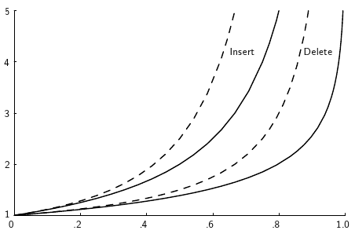

This figure shows the cost for inserting or deleting a record from a
[hash table](HashIntro.md#hashintro) under two different
assumptions for the policy used to find a free slot in the table.
The $y$ axes is the cost in number of hash table slots
evaluated, and the $x$ axes is the percentage of slots in the
table that are full.
The mathematical equations for these curves can be determined,
but this is not so easy.
A reasonable alternative is to write simple variations on hashing.
By timing the cost of the program for various loading conditions, it
is not difficult to construct a plot similar to this one.
The purpose of this analysis was not to determine which approach to
hashing is most efficient, so we are not doing empirical comparison of
hashing alternatives.
Instead, the purpose was to analyze the proper loading factor that
would be used in an efficient hashing system to balance time cost
versus hash table size (space cost).


<a id="algorithm-analysis-summary-exercises"></a>
# 3.15. Algorithm Analysis Summary Exercises

<a id="summary-exercise-cs2"></a>
## 3.15.1. Summary Exercise: CS2


<a id="algorithm-analysis-summary-exercises"></a>
# 3.16. Algorithm Analysis Summary Exercises

<a id="summary-exercise-cs3"></a>
## 3.16.1. Summary Exercise: CS3


---

# Chapter 4   Linear Structures


<a id="abstract-data-types"></a>
# 4.1. Abstract Data Types

<a id="id1"></a>
## 4.1.1. Abstract Data Types

This module presents terminology and definitions related to techniques
for managing the tremendous complexity of computer programs.
It also presents working definitions for the fundamental but somewhat
slippery terms “[data item](Glossary.md#term-data-item)” and “[data structure](Glossary.md#term-data-structure)”.
We begin with the basic elements on which data structures are built.

A [type](Glossary.md#term-type) is a collection of values.
For example, the Boolean type consists of the values `true` and
`false`.
The integers also form a type.
An integer is a [simple type](Glossary.md#term-simple-type)
because its values contain no subparts.
A bank account record will typically contain several pieces of
information such as name, address, account number, and account
balance.
Such a record is an example of an [aggregate type](Glossary.md#term-aggregate-type) or
[composite type](Glossary.md#term-composite-type).
A [data item](Glossary.md#term-data-item) is a piece of information
or a record whose value is drawn from a type.
A data item is said to be a [member](Glossary.md#term-member) of a type.

A [data type](Glossary.md#term-data-type) is a type together with a collection of operations
to manipulate the type.
For example, an integer variable is a member of the integer data
type.
Addition is an example of an operation on the integer data type.

A distinction should be made between the
logical concept of a data type and its physical implementation in a
computer program.
For example, there are two traditional implementations
for the list data type:
the linked list and the array-based list.
The list data type can therefore be implemented using a linked list or
an array.
But we don’t need to know how the list is implemented when we wish to
use a list to help in a more complex design.
For example, a list might be used to help implement a
[graph data structure](GraphImpl.md#graphimpl).

As another example, the term “array” could refer either
to a data type or an implementation.
“Array” is commonly used in computer programming to mean a
contiguous block of memory locations,
where each memory location stores one fixed-length data item.
By this meaning, an array is a physical data structure.
However, array can also mean a logical data type composed of a
(typically homogeneous) collection of data items, with each data item
identified by an index number.
It is possible to implement arrays in many different ways besides as a
block of contiguous memory locations.
The [sparse matrix](Glossary.md#term-sparse-matrix)
refers to a large, two-dimensional array
that stores only a relatively few non-zero values.
This is often implemented with a linked structure, or possibly using a
[hash table](HashIntro.md#hashintro).
But it could be implemented with an interface that uses traditional
row and column indices, thus appearing to the user in the same way
that it would if it had been implemented as a block of contiguous
memory locations.

An [abstract data type](Glossary.md#term-abstract-data-type) (ADT) is the specification of a data type
within some language, independent of an implementation.
The interface for the ADT is defined in terms of a type and a set of
operations on that type.
The behavior of each operation is determined by its inputs and outputs.
An ADT does not specify *how* the data type is implemented.
These implementation details are hidden from the user of the ADT and
protected from outside access, a concept referred to as
[encapsulation](Glossary.md#term-encapsulation).

A [data structure](Glossary.md#term-data-structure) is the implementation for an ADT.
In an object-oriented language,
an ADT and its implementation together make up a [class](Glossary.md#term-class).
Each operation associated with the ADT is implemented by a
[member function](Glossary.md#term-member-function) or [method](Glossary.md#term-method).
The variables that define the space required by a data item are
referred to as [data members](Glossary.md#term-data-member).
An [object](Glossary.md#term-object) is an instance of a class, that is, something that
is created and takes up storage during the execution of a
computer program.

The term [data structure](Glossary.md#term-data-structure) often refers to data
stored in a computer’s main memory.
The related term  [file structure](Glossary.md#term-file-structure)
often refers to the organization of data on peripheral storage, such
as a disk drive or CD.

**Example 4.1.1**

The mathematical concept of an integer, along with operations
that manipulate integers, form a data type.
The `int` variable type is a physical representation of
the abstract integer.
The `int` variable type, along with the operations that act on an
`int` variable, form an ADT.
Unfortunately, the `int` implementation is not
completely true to the abstract integer, as there are limitations on
the range of values an `int` variable can store.
If these limitations prove unacceptable, then some other
representation for the ADT “integer” must be devised, and a new
implementation must be used for the associated operations.

**Example 4.1.2**

An ADT for a list of integers might specify the following operations:

1. Insert a new integer at a particular position in the list.
1. Return `True` if the list is empty.
1. Reinitialize the list.
1. Return the number of integers currently in the list.
1. Retrieve the integer at a particular position in the list.
1. Delete the integer at a particular position in the list.

From this description, the input and output of each operation should
be clear, but the implementation for lists has not been
specified.

One application that makes use of some ADT might use particular
member functions of that ADT more than a second application, or the
two applications might have different time requirements for the
various operations.
These differences in the requirements of applications are the reason
why a given ADT might be supported by more than one implementation.

**Example 4.1.3**

Two popular implementations for large disk-based
database applications are [hashing](HashIntro.md#hashintro)
and the [B-tree](BTree.md#btree).
Both support efficient insertion and deletion of records, and both
support exact-match queries.
However, hashing is more efficient than the B-tree for
exact-match queries.
On the other hand, the B-tree can perform range queries
efficiently, while hashing is hopelessly inefficient for
range queries.
Thus, if the database application limits searches to exact-match
queries, hashing is preferred.
On the other hand, if the application requires support for range
queries, the B-tree is preferred.
Despite these performance issues, both implementations solve
versions of the same problem: updating and searching a large
collection of records.

The concept of an ADT can help us to focus on key issues even in
non-computing applications.

**Example 4.1.4**

When operating a car, the primary activities are steering,
accelerating, and braking.
On nearly all passenger cars, you steer by turning the steering
wheel, accelerate by pushing the gas pedal, and brake by pushing
the brake pedal.
This design for cars can be viewed as an ADT with operations
“steer”, “accelerate”, and “brake”.
Two cars might implement these operations in radically different
ways, say with different types of engine, or front- versus
rear-wheel drive.
Yet, most drivers can operate many different cars because the ADT
presents a uniform method of operation that does not require the
driver to understand the specifics of any particular engine or
drive design.
These differences are deliberately hidden.

The concept of an ADT is one instance of an
important principle that must be understood by any successful
computer scientist: managing complexity through
abstraction.
A central theme of computer science is complexity and
techniques for handling it.
Humans deal with complexity by assigning a label to an assembly of
objects or concepts and then manipulating the label in place of the
assembly.
Cognitive psychologists call such a label a
[metaphor](Glossary.md#term-metaphor).
A particular label might be related to other pieces of information or
other labels.
This collection can in turn be given a label,
forming a hierarchy of concepts and labels.
This hierarchy of labels allows us to focus on
important issues while ignoring unnecessary details.

**Example 4.1.5**

We apply the label “hard drive” to a collection of
hardware that manipulates data on a particular type of
storage device, and we apply the label “CPU” to the hardware that
controls execution of computer instructions.
These and other labels are gathered together under the label
“computer”.
Because even the smallest home computers today have millions of
components, some form of abstraction is necessary to comprehend how
a computer operates.

Consider how you might go about the process of designing a complex
computer program that implements and manipulates an ADT.
The ADT is implemented in one part
of the program by a particular data structure.
While designing those parts of the program that use the ADT,
you can think in terms of operations on the data type without
concern for the data structure’s implementation.
Without this ability to simplify your thinking about a complex
program, you would have no hope of understanding or implementing it.

**Example 4.1.6**

Consider the design for a relatively simple database system stored
on disk.
Typically, records on disk in such a program are accessed through a
[buffer pool](Glossary.md#term-buffer-pool) rather than directly.
Variable length records might use a
[memory manager](Glossary.md#term-memory-manager) to find an
appropriate location within the disk file to place the record.
Multiple [index structures](IndexIntro.md#indexintro)
will typically be used to support access to a collection of records
using multiple [search keys](Glossary.md#term-search-key).
Thus, we have a chain of classes, each with its own responsibilities
and access privileges.
A database query from a user is implemented by searching an index
structure.
This index requests access to the record by means of a request to
the buffer pool.
If a record is being inserted or deleted, such a request goes
through the memory manager, which in turn interacts with the buffer
pool to gain access to the disk file.
A program such as this is far too complex for nearly any human
programmer to keep all of the details in their head at once.
The only way to design and implement such a program is through
proper use of abstraction and metaphors.
In object-oriented programming,
such abstraction is handled using classes.

Data types have both a [logical form](Glossary.md#term-logical-form) and a [physical form](Glossary.md#term-physical-form).
The definition of the data type in terms of an ADT is its logical
form.
The implementation of the data type as a data structure
is its physical form.
Sometimes you might see the term *concrete implementation*,
but the word concrete is redundant.
The figure below illustrates this relationship between logical
and physical forms for data types.
When you implement an ADT, you are dealing with the physical form of
the associated data type.
When you use an ADT elsewhere in your program, you are concerned with
the associated data type’s logical form.
Some sections of this book focus on physical
implementations for a given data structure.
Other sections use the logical ADT for the data structure in the
context of a higher-level task.

The ADT defines the logical form of the data type.
The data structure implements the physical form of the data type.
Users of an ADT are typically programmers working in the same language
as the implementer of the ADT.
Typically, these programmers want to use the ADT as a component
in another application.
The interface to an ADT is also commonly referred to as the
Application Programmer Interface, or API, for the ADT.
The interface becomes a form of communication between the two programmers.

**Example 4.1.7**

A particular programming environment might provide a library that
includes a [list](Glossary.md#term-list) class.
The logical form of the list is defined by the public
functions, their inputs, and their outputs that define the class.
This might be all that you know about the list class implementation,
and this should be all you need to know.
Within the class, a variety of physical implementations for lists
is possible.


<a id="chapter-introduction-lists"></a>
# 4.2. Chapter Introduction: Lists

If your program needs to store a few things—numbers,
payroll records, or job descriptions for example—the simplest
and most effective approach might be to put them in a list.
Only when you have to organize and search through a large number of
things do more sophisticated data structures like
[search trees](Glossary.md#term-search-tree)
become necessary.
Many applications don’t require any form of search,
and they do not require that an ordering be placed on the objects
being stored.
Some applications require that actions be performed in a strict
chronological order,
processing objects in the order that they arrived,
or perhaps processing objects in the reverse of the order that they
arrived.
For all these situations, a simple list structure is appropriate.

This chapter describes representations both for lists and for
two important list-like structures called the [stack](Glossary.md#term-stack) and the
[queue](Glossary.md#term-queue).
Along with presenting these fundamental data structures, the other
goals of the chapter are to:

1. Give examples that show the separation of a logical representation
in the form of an ADT from a physical implementation as a data
structure.
1. Illustrate the use of asymptotic analysis in the context of
simple operations that you might already be familiar with.
In this way you can begin to see how asymptotic
analysis works, without the complications that arise when analyzing
more sophisticated algorithms and data structures.

We begin by defining an [ADT for lists](ListADT.md#listadt).
Two implementations for the list ADT—the
[array-based list](ListArray.md#listarray) and the
[linked list](ListLinked.md#listlinked)—are covered in
detail and their relative merits discussed.
The chapter finishes with implementations for
[stacks](Glossary.md#term-stack) and
[queues](Queue.md#queue).


<a id="the-list-adt"></a>
# 4.3. The List ADT

<a id="id1"></a>
## 4.3.1. The List ADT

We all have an intuitive understanding of what we mean by a “list”.
We want to turn this intuitive understanding into a concrete data
structure with implementations for its operations.
The most important concept related to lists is that of
[position](Glossary.md#term-position).
In other words, we perceive that there is a first element in the list,
a second element, and so on.
So, define a [list](Glossary.md#term-list) to be a finite, ordered
sequence of data items known as [elements](Glossary.md#term-element).
This is close to the mathematical concept of
a [sequence](Glossary.md#term-sequence).

“Ordered” in this definition means that each element has a
position in the list.
So the term “ordered” in this context does **not** mean that the list
elements are sorted by value.
(Of course, we can always choose to sort the elements on the list if
we want; it’s just that keeping the elements sorted is not an inherent
property of being a list.)

Each list element must have some data type.
In the simple list implementations discussed in this chapter, all
elements of the list are usually assumed to have the same data type,
although there is no conceptual objection to lists whose elements have
differing data types if the application requires it.
The operations defined as part of the list [ADT](Glossary.md#term-adt) do not
depend on the elemental [data type](Glossary.md#term-data-type).
For example, the list ADT can be used for lists of integers, lists of
characters, lists of payroll records, even lists of lists.

A list is said to be [empty](Glossary.md#term-empty) when it contains no elements.
The number of elements currently stored is called the
[length](Glossary.md#term-length) of the list.
The beginning of the list is called the [head](Glossary.md#term-head),
the end of the list is called the [tail](Glossary.md#term-tail).

We need some notation to show the contents of a list,
so we will use the same angle bracket notation that is normally used
to represent [sequences](Glossary.md#term-sequence).
To be consistent with standard array indexing, the first position
on the list is denoted as 0.
Thus, if there are $n$ elements in the list, they are given
positions 0 through $n-1$ as
$\langle\ a_0,\ a_1,\ ...,\ a_{n-1}\ \rangle$.
The subscript indicates an element’s position within the list.
Using this notation, the empty list would appear as
$\langle\ \rangle$.

<a id="defining-the-adt"></a>
### 4.3.1.1. Defining the ADT

What basic operations do we want our lists to support?
Our common intuition about lists tells us that a list should be able
to grow and shrink in size as we insert and remove elements.
We should be able to insert and remove elements from anywhere in
the list.
We should be able to gain access to any element’s value,
either to read it or to change it.
We must be able to create and clear (or reinitialize)
lists.
It is also convenient to access the next or previous
element from the “current” one.

Now we can define the ADT for a list object in terms of a set
of operations on that object.
We will use an interface to formally define the list ADT.
`List` defines the member functions that any list
implementation inheriting from it must support, along with their
parameters and return types.

True to the notion of an ADT, an interface
does not specify how operations are implemented.
Two complete implementations are presented later in later modules,
both of which use the same list ADT to define their operations.
But they are  considerably different in approaches and in their
space/time tradeoffs.

The code below presents our list ADT.
Any implementation for a [container class](Glossary.md#term-container-class) such as a list should
be able to support different data types for the elements.
One way to do this in Java is to store data values of type
`Object`.
Languages that support generics (Java) or templates (C++) give more
control over the element types.

The comments given with each member function describe what it is
intended to do.
However, an explanation of the basic design should help make this
clearer.
Given that we wish to support the concept of a sequence, with access
to any position in the list, the need for many of the member
functions such as `insert` and `moveToPos` is clear.
The key design decision embodied in this ADT is support for the
concept of a [current position](Glossary.md#term-current-position).
For example, member `moveToStart` sets
the current position to be the first element on the list, while
methods `next` and `prev` move the current position
to the next and previous elements, respectively.
The intention is that any implementation for this ADT support the
concept of a current position.
The current position is where any action such as insertion or deletion
will take place.
An alternative design is to factor out position as a separate position
object, sometimes referred to as an [iterator](Glossary.md#term-iterator).

```java
// List class ADT. Generalize the element type using Java Generics.
public interface List<E> { // List class ADT
  // Remove all contents from the list, so it is once again empty
  public void clear();

  // Insert "it" at the current location
  // The client must ensure that the list's capacity is not exceeded
  public boolean insert(E it);

  // Append "it" at the end of the list
  // The client must ensure that the list's capacity is not exceeded
  public boolean append(E it);

  // Remove and return the current element
  public E remove();

  // Set the current position to the start of the list
  public void moveToStart();

  // Set the current position to the end of the list
  public void moveToEnd();

  // Move the current position one step left, no change if already at beginning
  public void prev();

  // Move the current position one step right, no change if already at end
  public void next();

  // Return the number of elements in the list
  public int length();

  // Return the position of the current element
  public int currPos();

  // Set the current position to "pos"
  public boolean moveToPos(int pos);

  // Return true if current position is at end of the list
  public boolean isAtEnd();

  // Return the current element
  public E getValue();
  
  // Tell if the list is empty or not
  public boolean isEmpty();
}
```

The `List` member functions allow you to build a list with elements
in any desired order, and to access any desired position in the list.
You might notice that the `clear` method is a “convenience” method,
since it could be implemented by means of the other
member functions in the same asymptotic time.

A list can be iterated through as follows:

```java
for (L.moveToStart(); !L.isAtEnd(); L.next()) {
  it = L.getValue();
  doSomething(it);
}
```

In this example, each element of the list in turn is stored
in `it`, and passed to the `doSomething` function.
The loop terminates when the current position reaches the end of the
list.

The list class declaration presented here is just one of
many possible interpretations for lists.
Our list interface provides most of the operations that one
naturally expects to perform on lists and serves to illustrate the
issues relevant to implementing the list data structure.
As an example of using the list ADT, here is a function to
return `true` if there is an occurrence of a given integer in the
list, and `false` otherwise.
The `find` method needs no knowledge about the specific list
implementation, just the list ADT.

```java
// Return true if k is in list L, false otherwise
static boolean find(List<Integer> L, int k) {
  for (L.moveToStart(); !L.isAtEnd(); L.next())
    if (k == L.getValue()) return true; // Found k
  return false;                         // k not found
}
```

In languages that support it, this implementation for `find` could
be rewritten as a generic or template with respect to the element
type.
While making it more flexible, even generic types still
are limited in their ability to handle different data types stored on
the list.
In particular, for the `find` function generic types would only work
when the description for the object being searched for (`k` in the
function) is of the same type as the objects themselves.
They also have to be comparable when using the `==` operator.
A more realistic situation is that we are searching for a record that
contains a [key](Glossary.md#term-key) field whose value matches `k`.
Similar functions to find and return a [composite type](Glossary.md#term-composite-type) based
on a key value can be created using the list implementation, but to do
so requires some agreement between the list ADT and the `find`
function on the concept of a key, and on
[how keys may be compared](Comparison.md#comparison).

There are two standard approaches to implementing lists, the
[array-based list](ListArray.md#listarray), and the
[linked list](ListLinked.md#listlinked).


<a id="array-based-list-implementation"></a>
# 4.4. Array-Based List Implementation

<a id="id1"></a>
## 4.4.1. Array-Based List Implementation

Here is an implementation for the array-based list, named `AList`.
`AList` inherits from the [List ADT](ListADT.md#listadt),and so must implement all of the member functions of `List`.

```java
// Array-based list implementation
class AList<E> implements List<E> {
  private E listArray[];                  // Array holding list elements
  private static final int DEFAULT_SIZE = 10; // Default size
  private int maxSize;                    // Maximum size of list
  private int listSize;                   // Current # of list items
  private int curr;                       // Position of current element

  // Constructors
  // Create a new list object with maximum size "size"
  @SuppressWarnings("unchecked") // Generic array allocation
  AList(int size) {
    maxSize = size;
    listSize = curr = 0;
    listArray = (E[])new Object[size];         // Create listArray
  }
  // Create a list with the default capacity
  AList() { this(DEFAULT_SIZE); }          // Just call the other constructor

  public void clear()                     // Reinitialize the list
    { listSize = curr = 0; }              // Simply reinitialize values

  // Insert "it" at current position
  public boolean insert(E it) {
    if (listSize >= maxSize) return false;
    for (int i=listSize; i>curr; i--)  // Shift elements up
      listArray[i] = listArray[i-1];   //   to make room
    listArray[curr] = it;
    listSize++;                        // Increment list size
    return true;
  }

  // Append "it" to list
  public boolean append(E it) {
    if (listSize >= maxSize) return false;
    listArray[listSize++] = it;
    return true;
  }

  // Remove and return the current element
  public E remove() {
    if ((curr<0) || (curr>=listSize))  // No current element
      return null;
    E it = listArray[curr];            // Copy the element
    for(int i=curr; i<listSize-1; i++) // Shift them down
      listArray[i] = listArray[i+1];
    listSize--;                        // Decrement size
    return it;
  }

  public void moveToStart() { curr = 0; }       // Set to front
  public void moveToEnd() { curr = listSize; }  // Set at end
  public void prev() { if (curr != 0) curr--; } // Move left
  public void next() { if (curr < listSize) curr++; } // Move right
  public int length() { return listSize; }      // Return list size
  public int currPos() { return curr; }         // Return current position

  // Set current list position to "pos"
  public boolean moveToPos(int pos) {
    if ((pos < 0) || (pos > listSize)) return false;
    curr = pos;
    return true;
  }

  // Return true if current position is at end of the list
  public boolean isAtEnd() { return curr == listSize; }

  // Return the current element
  public E getValue() {
    if ((curr < 0) || (curr >= listSize)) // No current element
      return null;
    return listArray[curr];
  }
  
  public String toString() {
	StringBuffer out = new StringBuffer((listSize + 1) * 4);

	out.append("< ");
	for (int i = 0; i < curr; i++) {
		out.append(listArray[i]);
		out.append(" ");
	}
	out.append("| ");
	for (int i = curr; i < listSize; i++) {
		out.append(listArray[i]);
		out.append(" ");
	}
	out.append(">");
	return out.toString();
  }
  
  //Tell if the list is empty or not
  public boolean isEmpty() {
	  return listSize == 0;
  }
}
```

<a id="insert"></a>
### 4.4.1.1. Insert

Because the array-based list implementation is defined to store list
elements in contiguous cells of the array, the `insert`, `append`,
and `remove` methods must maintain this property.

<a id="insert-practice-exericse"></a>
### 4.4.1.2. Insert Practice Exericse

<a id="append-and-remove"></a>
## 4.4.2. Append and Remove

Removing an element from the head of the list is
similar to insert in that all remaining elements  must shift toward
the head by one position to fill in the gap.
If we want to remove the element at position $i$, then
$n - i - 1$ elements must shift toward the head, as shown in the
following slideshow.

In the average case, insertion or removal each requires moving half
of the elements, which is $\Theta(n)$.

<a id="remove-practice-exericise"></a>
### 4.4.2.1. Remove Practice Exericise

Aside from `insert` and `remove`, the only other operations that
might require more than constant time are the constructor and
`clear`.
The other methods for Class `AList` simply
access the current list element or move the current position.
They all require $\Theta(1)$ time.

<a id="array-based-list-practice-questions"></a>
## 4.4.3. Array-based List Practice Questions


<a id="linked-lists"></a>
# 4.5. Linked Lists

<a id="id1"></a>
## 4.5.1. Linked Lists

In this module we present one of the two traditional implementations
for lists, usually called a [linked list](Glossary.md#term-linked-list).
The linked list uses [dynamic memory allocation](Glossary.md#term-dynamic-memory-allocation),
that is, it allocates memory for new list elements as needed.
The following diagram illustrates the linked list concept.
Here there are three [nodes](Glossary.md#term-node) that
are “linked” together.
Each node has two boxes.
The box on the right holds a link to the next node in the list.
Notice that the rightmost node has a diagonal slash through its link
box, signifying that there is no link coming out of this box.

Because a list node is a distinct object (as opposed to simply a cell
in an array), it is good practice to make a separate list node class.
(We can also re-use the list node class to implement linked
implementations for the [stack](Glossary.md#term-stack) and
[queue](Queue.md#queue) data structures.
Here is an implementation for list nodes, called the `Link` class.
Objects in the `Link` class contain an `element` field to
store the element value, and a `next` field to store a pointer to
the next node on the list.
The list built from such nodes is called a [singly linked list](Glossary.md#term-singly-linked-list),
or a [one-way list](Glossary.md#term-one-way-list), because each list node
has a single pointer to the next node on the list.

```java
class Link<E> {         // Singly linked list node class
  private E e;          // Value for this node
  private Link<E> n;    // Point to next node in list

  // Constructors
  Link(E it, Link<E> inn) { e = it; n = inn; }
  Link(Link<E> inn) { e = null; n = inn; }

  E element() { return e; }                        // Return the value
  E setElement(E it) { return e = it; }            // Set element value
  Link<E> next() { return n; }                     // Return next link
  Link<E> setNext(Link<E> inn) { return n = inn; } // Set next link
}
```

The `Link` class is quite simple.
There are two forms for its constructor, one with
an initial element value and one without.
Member functions allow the link user to get or set the `element`
and `link` fields.

<a id="why-this-has-problems"></a>
### 4.5.1.1. Why This Has Problems

There are a number of problems with the representation just
described.
First, there are lots of special cases to code for.
For example, when the list is empty we have
no element for `head`, `tail`, and `curr` to point to.
Implementing special cases for `insert` and `remove`
increases code complexity, making it harder to understand,
and thus increases the chance of introducing bugs.

<a id="a-better-solution"></a>
### 4.5.1.2. A Better Solution

Fortunately, there is a fairly easy way to deal with all of the
special cases, as well as the problem with deleting the last node.
Many special cases can be eliminated by implementing
linked lists with an additional [header node](Glossary.md#term-header-node)
as the first node of the list.
This header node is a link node like any other, but its value is
ignored and it is not considered to be an actual element of the list.
The header node saves coding effort because we no longer need to
consider special cases for empty lists or when the current position is
at one end of the list.
The cost of this simplification is the space for the header node.
However, there are space savings due to smaller code size,
because statements to handle the special cases are omitted.
We get rid of the remaining special cases related to being at the end
of the list by adding a “trailer” node that also never stores a
value.

The following diagram shows initial conditions for a linked list
with header and trailer nodes.

Here is what a list with some elements looks like with the header and
trailer nodes added.

Adding the trailer node also solves our problem with deleting the last
node on the list, as we will see when we take a closer look at the
remove method’s implementation.

<a id="linked-list-implementation"></a>
### 4.5.1.3. Linked List Implementation

Here is the implementation for the linked list class,
named `LList`.

```java
// Linked list implementation
class LList implements List {
  private Link head;         // Pointer to list header
  private Link tail;         // Pointer to last element
  private Link curr;         // Access to current element
  private int listSize;      // Size of list

  // Constructors
  LList(int size) { this(); }     // Constructor -- Ignore size
  LList() { clear(); }

  // Remove all elements
  public void clear() {
    curr = tail = new Link(null); // Create trailer
    head = new Link(tail);        // Create header
    listSize = 0;
  }
  
  // Insert "it" at current position
  public boolean insert(Object it) {
    curr.setNext(new Link(curr.element(), curr.next()));
    curr.setElement(it);
    if (tail == curr) tail = curr.next();  // New tail
    listSize++;
    return true;
  }
  
  // Append "it" to list
  public boolean append(Object it) {
    tail.setNext(new Link(null));
    tail.setElement(it);
    tail = tail.next();
    listSize++;
    return true;
  }

  // Remove and return current element
  public Object remove () {
    if (curr == tail) return null;          // Nothing to remove
    Object it = curr.element();             // Remember value
    curr.setElement(curr.next().element()); // Pull forward the next element
    if (curr.next() == tail) tail = curr;   // Removed last, move tail
    curr.setNext(curr.next().next());       // Point around unneeded link
    listSize--;                             // Decrement element count
    return it;                              // Return value
  }

  public void moveToStart() { curr = head.next(); } // Set curr at list start
  public void moveToEnd() { curr = tail; }          // Set curr at list end

  // Move curr one step left; no change if now at front
  public void prev() {
    if (head.next() == curr) return; // No previous element
    Link temp = head;
    // March down list until we find the previous element
    while (temp.next() != curr) temp = temp.next();
    curr = temp;
  }

  // Move curr one step right; no change if now at end
  public void next() { if (curr != tail) curr = curr.next(); }

  public int length() { return listSize; } // Return list length


  // Return the position of the current element
  public int currPos() {
    Link temp = head.next();
    int i;
    for (i=0; curr != temp; i++)
      temp = temp.next();
    return i;
  }
  
  // Move down list to "pos" position
  public boolean moveToPos(int pos) {
    if ((pos < 0) || (pos > listSize)) return false;
    curr = head.next();
    for(int i=0; i<pos; i++) curr = curr.next();
    return true;
  }

  // Return
```


<a id="comparison-of-list-implementations"></a>
# 4.6. Comparison of List Implementations

<a id="space-comparison"></a>
## 4.6.1. Space Comparison

Now that you have seen two substantially different implementations for
lists, it is natural to ask which is better.
In particular, if you must implement a list for some task,
which implementation should you choose?

Given a collection of elements to store, they take up some amount of
space whether they are simple integers or large objects with many
fields.
Any container data structure like a list then requires some additional
space to organize the elements being stored.
This additional space is called [overhead](Glossary.md#term-overhead).

[Array-based lists](Glossary.md#term-array-based-list) have the disadvantage
that their size must be predetermined before the array can be
allocated.
Array-based lists cannot grow beyond their predetermined size.
Whenever the list contains only a few elements, a
substantial amount of space might be tied up in a largely empty array.
This empty space is the overhead required by the array-based list.
[Linked lists](Glossary.md#term-linked-list) have the advantage that they only
need space for the objects actually on the list.
There is no limit to the number of elements on a linked list,
as long as there is [free store](Glossary.md#term-free-store) memory available.
The amount of space required by a linked list is $\Theta(n)$,
while the space required by the array-based list implementation is
$\Omega(n)$, but can be greater.

Array-based lists have the advantage that there is no wasted
space for an individual element.
Linked lists require that an extra pointer for the `next` field be
added to every list node.
So the linked list has these `next` pointers as overhead.
If the element size is small, then the overhead for
links can be a significant fraction of the total storage.
When the array for the array-based list is completely filled, there
is no wasted space, and so no overhead.
The array-based list will then be more space efficient, by a
constant factor, than the linked implementation.

A simple formula can be used to determine whether the array-based list
or the linked list implementation will be more space efficient in a
particular situation.
Call $n$ the number of elements currently in the list,
$P$ the size of a pointer in storage units
(typically four bytes), $E$ the size of a data element in
storage units (this could be anything, from one bit for a Boolean
variable on up to thousands of bytes or more for complex records),
and $D$ the maximum number of list elements that can be stored
in the array.
The amount of space required for the array-based list is $DE$,
regardless of the number of elements actually stored in the list at
any given time.
The amount of space required for the linked list is $n(P + E)$.
The smaller of these expressions for a given value $n$
determines the more space-efficient implementation for $n$
elements.
In general, the linked implementation requires less space than the
array-based implementation when relatively few elements are in the
list.
Conversely, the array-based implementation becomes more space
efficient when the array is close to full.
Using the equation, we can solve for $n$ to determine the
[break-even point](Glossary.md#term-break-even-point) beyond which the array-based implementation
is more space efficient in any particular situation.
This occurs when

<a id="equation-listanalysis-0"></a>
$$
\begin{aligned}n > DE/(P + E).\end{aligned}
$$

If $P = E$, then the break-even point is at $D/2$.
This would happen if the element field is either a four-byte
`int` value or a pointer, and the `next` field is a typical
four-byte pointer.
That is, the array-based implementation would be more efficient (if
the link field and the element field are the same size) whenever the
array is more than half full.

As a rule of thumb, linked lists are more space efficient when
implementing lists whose number of elements varies widely or is
unknown.
Array-based lists are generally more space efficient when
the user knows in advance approximately how large the list will
become, and can be confident that the list will never grow beyond a
certain limit.

<a id="time-comparison"></a>
## 4.6.2. Time Comparison

Array-based lists are faster for access by position.
Positions can easily be adjusted forwards or backwards by
the `next` and `prev` methods.
These operations always take $\Theta(1)$ time.
In contrast, singly linked lists have no explicit access to the
previous element, and access by position requires that we march
down the list from the front (or the current position) to the
specified position.
Both of these operations require $\Theta(n)$ time in the average
and worst cases, if we assume that each position on the list is
equally likely to be accessed on any call to `prev` or
`moveToPos`.

Given a pointer to a suitable location in the list,
the `insert` and `remove` methods for linked lists
require only $\Theta(1)$ time.
Array-based lists must shift the remainder of the list up or down
within the array.
This requires $\Theta(n)$ time in the average and worst cases.
For many applications, the time to insert and delete elements
dominates all other operations.
For this reason, linked lists are often preferred to array-based
lists.

When implementing the array-based list, an implementor could
allow the size of the array to grow and shrink depending on the number
of elements that are actually stored.
This data structure is known as a [dynamic array](Glossary.md#term-dynamic-array).
For example, both the Java and C++/STL `Vector` classes implement a
dynamic array,
and JavaScript arrays are always dynamic.
Dynamic arrays allow the programmer to get around the limitation on
the traditional array that its size cannot be changed once the array
has been created.
This also means that space need not be allocated to the dynamic array
until it is to be used.
The disadvantage of this approach is that it takes time to deal
with space adjustments on the array.
Each time the array grows in size, its contents must be copied.
A good implementation of the dynamic array will grow and shrink
the array in such a way as to keep the overall cost for a series of
insert/delete operations relatively inexpensive, even though an
occasional insert/delete operation might be expensive.
A simple rule of thumb is to double the size of the array when it
becomes full, and to cut the array size in half when it becomes one
quarter full.
To analyze the overall cost of dynamic array operations over time,
we need to use a technique known as
[amortized analysis](AmortAnal.md#amortanal).

<a id="practice-questions"></a>
### 4.6.2.1. Practice Questions


<a id="doubly-linked-lists"></a>
# 4.7. Doubly Linked Lists

<a id="id1"></a>
## 4.7.1. Doubly Linked Lists

The [singly linked list](ListLinked.md#listlinked) allows
for direct access from a list node only to the next node in the list.
A [doubly linked list](Glossary.md#term-doubly-linked-list) allows convenient access from a list node
to the next node and also to the preceding node on the list.
The doubly linked list node accomplishes this in the obvious way by
storing two pointers: one to the node following it (as in the singly
linked list), and a second pointer to the node preceding it.

The most common reason to use a doubly linked list is
because it is easier to implement than a singly linked list.
While the code for the doubly linked implementation is a little longer
than for the singly linked version, it tends to be a bit more
“obvious” in its intention, and so easier to implement and debug.
Whether a list implementation is doubly or singly linked should
be hidden from the `List` class user.

Like our singly linked list implementation, the doubly linked list
implementation makes use of a [header node](Glossary.md#term-header-node).
We also add a tailer node to the end of the list.
The tailer is similar to the header, in that it is a node that
contains no value, and it always exists.
When the doubly linked list is initialized, the header and tailer
nodes are created.
Data member `head` points to the header node, and `tail`
points to the tailer node.
The purpose of these nodes is to simplify the `insert`,
`append`, and `remove` methods by eliminating all need for
special-case code when the list is empty, or when we insert at the
head or tail of the list.

In our implementation, `curr` will point to the
[current position](Glossary.md#term-current-position) (or to the [trailer node](Glossary.md#term-trailer-node) if the
current position is at the end of the list).

Here is the complete implementation for a
`Link` class to be used with doubly linked lists.
This code is a little longer than that for the singly linked list node
implementation since
the doubly linked list nodes have an extra data member.

```java
class Link<E> {         // Doubly linked list node
  private E e;          // Value for this node
  private Link<E> n;    // Pointer to next node in list
  private Link<E> p;    // Pointer to previous node

  // Constructors
  Link(E it, Link<E> inp, Link<E> inn) { e = it;  p = inp; n = inn; }
  Link(Link<E> inp, Link<E> inn) { p = inp; n = inn; }

  // Get and set methods for the data members
  public E element() { return e; }                                // Return the value
  public E setElement(E it) { return e = it; }                    // Set element value
  public Link<E> next() { return n; }                             // Return next link
  public Link<E> setNext(Link<E> nextval) { return n = nextval; } // Set next link
  public Link<E> prev() { return p; }                             // Return prev link
  public Link<E> setPrev(Link<E> prevval) { return p = prevval; } // Set prev link
}
```

<a id="insert"></a>
### 4.7.1.1. Insert

The following slideshows illustrate the `insert` and `append`
doubly linked list methods.
The class declaration and the remaining member functions for the
doubly linked list class are nearly identical to the singly linked
list version.
While the code for these methods might be a little longer than their
singly linked list counterparts (since there is an extra pointer in
each node to deal with), they tend to be easier to understand.

<a id="append"></a>
### 4.7.1.2. Append

<a id="remove"></a>
### 4.7.1.3. Remove

<a id="prev"></a>
### 4.7.1.4. Prev

The only disadvantage of the doubly linked list as compared to the
singly linked list is the additional space used.
The doubly linked list requires two pointers per node, and so in the
implementation presented it requires twice as much overhead as
the singly linked list.

<a id="mangling-pointers"></a>
### 4.7.1.5. Mangling Pointers

There is a space-saving technique that can be employed to eliminate
the additional space requirement, though it will complicate the
implementation and be somewhat slower.
Thus, this is an example of a
space/time tradeoff.
It is based on observing that, if we store the sum of two values,
then we can get either value back by subtracting the other.
That is, if we store $a + b$ in variable $c$, then
$b = c - a$ and $a = c - b$.
Of course, to recover one of the values out of the stored summation,
the other value must be supplied.
A pointer to the first node in the list, along with the value of one
of its two link fields, will allow access to all of the remaining
nodes of the list in order.
This is because the pointer to the node must be the same as the value
of the following node’s `prev` pointer, as well as the previous
node’s `next` pointer.
It is possible to move down the list breaking apart the
summed link fields as though you were opening a zipper.

The principle behind this technique is worth remembering, as it
has many applications.
The following code fragment will
swap the contents of two variables without using a temporary variable
(at the cost of three arithmetic operations).

```java
a = a + b;
b = a - b; // Now b contains original value of a
a = a - b; // Now a contains original value of b
```

A similar effect can be had by using the exclusive-or operator.
This fact is widely used in computer graphics.
A region of the computer screen can be highlighted by
XORing the outline of a box around it.
XORing the box outline a second time restores the original
contents of the screen.


<a id="list-element-implementations"></a>
# 4.8. List Element Implementations

<a id="id1"></a>
## 4.8.1. List Element Implementations

When designing any [container class](Glossary.md#term-container-class), there are a number of
design choices to be made regarding the data elements.

What to do if something can appear multiple times on a list?
One option is to use a reference to [elements](Glossary.md#term-element).
Another is to store separate copies.
In general, the larger the elements and the more that they are
duplicated, the more likely that pointers to shared elements is the
better approach.

<a id="homogeneity"></a>
### 4.8.1.1. Homogeneity

The next issue to consider is whether to enforce [homogeneity](Glossary.md#term-homogeneity)
in the list elements.
That is, should lists be restricted so that all data elements stored
are of the same object type?
Or should it be possible to store different types?

If you want to enforce homogeneity, the most rigid way is to simply
define the elements to be of a fixed type.
But that does not help if you want one list to store integers while
another stores strings.
A much more flexible approach is to use Java generics or C++
templates.
In this way, the compiler will enforce that a given list will only
store a single data type, while still allowing different lists to have
different data types.
Another approach is to store an object of the appropriate type in the
header node of the list (perhaps an object of the appropriate type is
supplied as a parameter to the list constructor), and then check that
all insert operations on that list use the same element type.
This approach is useful in a language like JavaScript that does not
use strong typing, but does allow a program to test the type of an
object.

In some applications, the designer would like to allow a given list
store elements with different types.
In Java, declaring the element to be of type `Object` will stop the
compiler from enforcing any type restrictions.
In C++, a similar effect can be achieved by using `void*` pointers.

<a id="element-deletion"></a>
### 4.8.1.2. Element Deletion

Our last design issue is what to do to the list elements when the list
itself is deleted?
This is a serious concern in a language like C++ that does not support
automatic garbage collection.

<a id="practice-questions"></a>
### 4.8.1.3. Practice Questions


<a id="stacks"></a>
# 4.9. Stacks

<a id="stack-terminology-and-implementation"></a>
## 4.9.1. Stack Terminology and Implementation

The [stack](Glossary.md#term-stack) is a list-like structure
in which elements may be inserted or removed from only one end.
While this restriction makes stacks less flexible than lists,
it also makes stacks both efficient (for those operations they can do)
and easy to implement.
Many applications require only the limited form of
insert and remove operations that stacks provide.
In such cases, it is more efficient to use the simpler stack data
structure rather than the generic list.
For example, the [freelist](Glossary.md#term-freelist) is really a
stack.

Despite their restrictions, stacks have many uses.
Thus, a special vocabulary for stacks has developed.
Accountants used stacks long before the invention of the computer.
They called the stack a “[LIFO](Glossary.md#term-lifo)” list,
which stands for “Last-In, First-Out.”
Note that one implication of the LIFO policy is that stacks
remove elements in reverse order of their arrival.

The accessible element of the stack is called the `top` element.
Elements are not said to be inserted, they are [pushed](Glossary.md#term-push)
onto the stack.
When removed, an element is said to be [popped](Glossary.md#term-pop) from the
stack.
Here is a simple stack [ADT](Glossary.md#term-adt).

```java
public interface Stack<E> { // Stack class ADT
  // Reinitialize the stack.
  public void clear();

  // Push "it" onto the top of the stack
  public boolean push(E it);

  // Remove and return the element at the top of the stack
  public E pop();

  // Return a copy of the top element
  public E topValue();

  // Return the number of elements in the stack
  public int length();
  
  // Tell if the stack is empty or not
  public boolean isEmpty();
}
```

As with lists, there are many variations on stack implementation.
The two approaches presented here are the [array-based stack](Glossary.md#term-array-based-stack)
and the [linked stack](StackLinked.md#stacklinked),
which are analogous to array-based and linked lists, respectively.

<a id="array-based-stacks"></a>
### 4.9.1.1. Array-Based Stacks

Here is a complete implementation for
the array-based stack class.

```java
class AStack<E> implements Stack<E> {
  private E stackArray[];         // Array holding stack
  private static final int DEFAULT_SIZE = 10;
  private int maxSize;            // Maximum size of stack
  private int top;                // First free position at top

  // Constructors
  @SuppressWarnings("unchecked") // Generic array allocation
  AStack(int size) {
    maxSize = size;
    top = 0;
    stackArray = (E[])new Object[size]; // Create stackArray
  }
  AStack() { this(DEFAULT_SIZE); }

  public void clear() { top = 0; }    // Reinitialize stack

// Push "it" onto stack
  public boolean push(E it) {
    if (top >= maxSize) return false;
    stackArray[top++] = it;
    return true;
  }

// Remove and return top element
  public E pop() {
    if (top == 0) return null;
    return stackArray[--top];
  }

  public E topValue() {          // Return top element
    if (top == 0) return null;
    return stackArray[top-1];
  }

  public int length() { return top; } // Return stack size

  public boolean isEmpty() { return top == 0; }	// Tell if the stack is empty
}
```

The array-based stack implementation is essentially
a simplified version of the array-based list.
The only important design decision to be made is which end of the
array should represent the top of the stack.

<a id="pop"></a>
## 4.9.2. Pop


<a id="linked-stacks"></a>
# 4.10. Linked Stacks

<a id="linked-stack-implementation"></a>
## 4.10.1. Linked Stack Implementation

The linked stack implementation is quite simple.
Elements are inserted and removed only from the head of the list.
A header node is not used because no special-case code is required
for lists of zero or one elements.
Here is the complete linked stack implementation.

```java
// Linked stack implementation
class LStack<E> implements Stack<E> {
  private Link<E> top;            // Pointer to first element
  private int size;               // Number of elements

  // Constructors
  LStack() { top = null; size = 0; }
  LStack(int size) { top = null; size = 0; }

  // Reinitialize stack
  public void clear() { top = null; size = 0; }

// Put "it" on stack
  public boolean push(E it) {  
    top = new Link<E>(it, top);
    size++;
    return true;
  }

// Remove "it" from stack
  public E pop() {           
    if (top == null) return null;
    E it = top.element();
    top = top.next();
    size--;
    return it;
  }

  public E topValue() {      // Return top value
    if (top == null) return null;
    return top.element();
  }

  // Return stack length
  public int length() { return size; }
  
  // Tell if the stack is empty
  public boolean isEmpty() { return size == 0; }
}
```

Here is a visual representation for the linked stack.

<a id="linked-stack-push"></a>
### 4.10.1.1. Linked Stack Push

<a id="linked-stack-pop"></a>
## 4.10.2. Linked Stack Pop

<a id="comparison-of-array-based-and-linked-stacks"></a>
### 4.10.2.1. Comparison of Array-Based and Linked Stacks

All operations for the array-based and linked stack implementations
take constant time, so from a time efficiency perspective,
neither has a significant advantage.
Another basis for comparison is the total space
required.
The analysis is similar to that done for list implementations.
The array-based stack must declare a fixed-size array initially, and
some of that space is wasted whenever the stack is not full.
The linked stack can shrink and grow but requires the overhead of a
link field for every element.

When implementing multiple stacks, sometimes you can take advantage of
the one-way growth of the array-based stack
by using a single array to store two stacks.
One stack grows inward from each end as illustrated by the figure
below, hopefully leading to less wasted space.
However, this only works well when the space requirements of the two
stacks are inversely correlated.
In other words, ideally when one stack grows, the other will shrink.
This is particularly effective when elements are taken from
one stack and given to the other.
If instead both stacks grow at the same time, then the free space
in the middle of the array will be exhausted quickly.


<a id="implementing-recursion"></a>
# 4.11. Implementing Recursion

WARNING! You should not read this section unless you are already
comfortable with implementing [recursive](Glossary.md#term-recursion)
functions.
One of the biggest hang-ups for students learning recursion is too
much focus on the recursive “process”.
The right way to think about recursion is to just think about the
return value that the recursive call gives back.
Thinking about *how* that answer is computed just gets in the way of
understanding.
There are good reasons to understand how recursion is implemented,
but helping you to write recursive functions is not one of them.

Perhaps the most common computer application that uses
[stacks](StackArray.md#stackarray) is not even visible to its users.
This is the implementation of subroutine calls in most programming
language [runtime environments](Glossary.md#term-runtime-environment).
A subroutine call is normally implemented by [pushing](Glossary.md#term-push)
necessary information about the subroutine (including the return
address, parameters, and local variables) onto a stack.
This information is called an [activation record](Glossary.md#term-activation-record).
Further subroutine calls add to the stack.
Each return from a subroutine [pops](Glossary.md#term-pop) the top activation
record off the stack.
As an example, here is a recursive implementation for the factorial
function.

```java
// Recursively compute and return n!
long rfact(int n) {
  // fact(20) is the largest value that fits in a long
  if ((n < 0) || (n > 20)) return -1;
  if (n <= 1)  return 1;  // Base case: return base solution
  return n * rfact(n-1);   // Recursive call for n > 1
}
```

Here is an illustration for how the internal processing works.

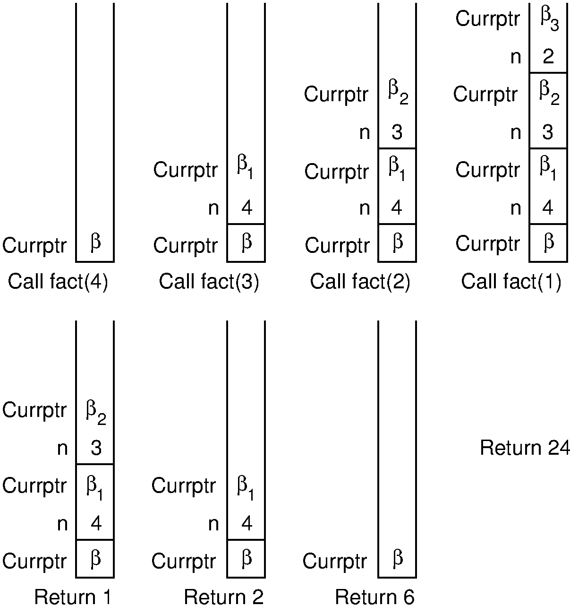

$\beta$ values indicate the address of the program instruction
to return to after completing the current function call.
On each recursive function call to `fact`, both the return
address and the current value of `n` must be saved.
Each return from `fact` pops the top activation record off the
stack.

Consider what happens when we call `fact` with the value 4.
We use $\beta$ to indicate the address of the program
instruction where the call to `fact` is made.
Thus, the stack must first store the address $\beta$, and the
value 4 is passed to `fact`.
Next, a recursive call to `fact` is made, this time with value 3.
We will name the program address from which the call is
made $\beta_1$.
The address $\beta_1$, along with the current value for
$n$ (which is 4), is saved on the stack.
Function `fact` is invoked with input parameter 3.

In similar manner, another recursive call is made with input
parameter 2, requiring that the address from which the call is made
(say $\beta_2$) and the current value for $n$ (which is 3)
are stored on the stack.
A final recursive call with input parameter 1 is made, requiring that
the stack store the calling address (say $\beta_3$) and current
value (which is 2).

At this point, we have reached the base case for `fact`, and so
the recursion begins to unwind.
Each return from `fact` involves popping the stored value for
$n$ from the stack, along with the return address from the
function call.
The return value for `fact` is multiplied by the restored value
for $n$, and the result is returned.

Because an activation record must be created and placed onto the stack
for each subroutine call, making subroutine calls is a relatively
expensive operation.
While recursion is often used to make implementation easy and clear,
sometimes you might want to eliminate the overhead imposed by the
recursive function calls.
In some cases, such as the factorial function above,
recursion can easily be replaced by iteration.

**Example 4.11.1**

As a simple example of replacing recursion with a stack, consider
the following non-recursive version of the factorial function.

```java
// Return n!
long sfact(int n) {
  // fact(20) is the largest value that fits in a long
  if ((n < 0) || (n > 20)) return -1;
  // Make a stack just big enough
  Stack S = new AStack(n);
  while (n > 1) S.push(n--);
  long result = 1;
  while (S.length() > 0)
    result = result * (Integer)S.pop();
  return result;
}
```

Here, we simply push successively smaller values of $n$ onto
the stack until the base case is reached, then repeatedly pop off
the stored values and multiply them into the result.

An iterative form of the factorial function is both
simpler and faster than the version shown in the example.
But it is not always possible to replace recursion with iteration.
Recursion, or some imitation of it, is necessary when implementing
algorithms that require multiple branching such as in the Towers of
Hanoi algorithm, or when
[traversing a binary tree](BinaryTreeTraversal.md#binarytreetraversal).
The [Mergesort](Mergesort.md#mergesort) and
[Quicksort](Quicksort.md#quicksort) sorting algorithms
also require recursion.
Fortunately, it is always possible to imitate recursion with a stack.
Let us now turn to a non-recursive version of the Towers of
Hanoi function, which cannot be done iteratively.

**Example 4.11.2**

Here is a recursive implementation for Towers of Hanoi.

```java
// Compute the moves to solve a Tower of Hanoi puzzle.
// Function move does (or prints) the actual move of a disk
// from one pole to another.
// n: The number of disks
// start: The start pole
// goal: The goal pole
// temp: The other pole
static void TOH(int n, Pole start, Pole goal, Pole temp) {
  if (n == 0) return;          // Base case
  TOH(n-1, start, temp, goal); // Recursive call: n-1 rings
  move(start, goal);            // Move bottom disk to goal
  TOH(n-1, temp, goal, start); // Recursive call: n-1 rings
}
```

`TOH` makes two recursive calls:
one to move $n-1$ rings off the bottom ring, and another to
move these $n-1$ rings back to the goal pole.
We can eliminate the recursion by using a stack to store a
representation of the three operations that `TOH` must perform:
two recursive calls and a move operation.
To do so, we must first come up with a representation of the
various operations, implemented as a class whose objects will be
stored on the stack.

```java
class TOHobj {
  int op;
  int num;
  Pole start, goal, temp;

  // Recursive call operation
  TOHobj(int o, int n, Pole s, Pole g, Pole t)
  { op = o; num = n; start = s; goal = g; temp = t; }

  // MOVE operation
  TOHobj(int o, Pole s, Pole g)
  { op = o; start = s; goal = g; }
}

void TOHs(int n, Pole start, Pole goal, Pole temp) {
  // Make a stack just big enough
  Stack S = new AStack(2*n+1);
  S.push(new TOHobj(TOH, n, start, goal, temp));
  while (S.length() > 0) {
    TOHobj it = (TOHobj)S.pop();   // Get next task
    if (it.op == MOVE) // Do a move
      move(it.start, it.goal);
    else if (it.num > 0) { // Imitate TOH recursive solution (in reverse)
      S.push(new TOHobj(TOH, it.num-1, it.temp, it.goal, it.start));
      S.push(new TOHobj(MOVE, it.start, it.goal));  // A move to do
      S.push(new TOHobj(TOH, it.num-1, it.start, it.temp, it.goal));
    }
  }
}
```

We first enumerate the possible operations MOVE and TOH, to
indicate calls to the `move` function
and recursive calls to `TOH`, respectively.
Class `TOHobj` stores five values: an operation value
(indicating either a MOVE or a new TOH operation), the number of
rings, and the three poles.
Note that the move operation actually needs only to store
information about two poles.
Thus, there are two constructors: one to store the state when
imitating a recursive call, and one to store the state for a move
operation.

An array-based stack is used because we know that the stack
will need to store exactly $2n+1$ elements.
The new version of `TOH` begins by placing on the stack a
description of the initial problem for $n$ rings.
The rest of the function is simply a `while` loop that pops the
stack and executes the appropriate operation.
In the case of a `TOH` operation (for $n>0$), we store on
the stack representations for the three operations executed by the
recursive version.
However, these operations must be placed on the stack in reverse
order, so that they will be popped off in the correct order.

Recursive algorithms lend themselves to efficient implementation with
a stack when the amount of information needed to describe a
sub-problem is small.
For example, [Quicksort](Quicksort.md#quicksort) can effectively
use a stack to replace its recursion since only bounds information for
the subarray to be processed needs to be saved.


<a id="queues"></a>
# 4.12. Queues

<a id="queue-terminology-and-implementation"></a>
## 4.12.1. Queue Terminology and Implementation

Like the stack, the [queue](Glossary.md#term-queue) is a list-like structure that
provides restricted access to its elements.
Queue elements may only be inserted at the back (called an
[enqueue](Glossary.md#term-enqueue) operation) and removed from the
front (called a [dequeue](Glossary.md#term-dequeue) operation).
Queues operate like standing in line at a movie theater ticket
counter.
If nobody cheats, then newcomers go to the back of the line.
The person at the front of the line is the next to be served.
Thus, queues release their elements in order of arrival.
In Britain, a line of people is called a “queue”,
and getting into line to wait for service is called “queuing up”.
Accountants have used queues since long before the
existence of computers.
They call a queue a “FIFO” list, which stands for
“First-In, First-Out”.
Here is a sample queue ADT.
This section presents two implementations for queues:
the array-based queue and the linked queue.

```java
public interface Queue<E> { // Queue class ADT
  // Reinitialize queue
  public void clear();

  // Put element on rear
  public boolean enqueue(E it);

  // Remove and return element from front
  public E dequeue();

  // Return front element
  public E frontValue();

  // Return queue size
  public int length();
  
  //Tell if the queue is empty or not
  public boolean isEmpty();
}
```

<a id="array-based-queues"></a>
### 4.12.1.1. Array-Based Queues

The array-based queue is somewhat tricky to implement effectively.
A simple conversion of the array-based list implementation is not
efficient.

<a id="the-circular-queue"></a>
### 4.12.1.2. The Circular Queue

If the value of `front` is fixed, then $n+1$ different
values for `rear` are needed to distinguish among the $n+1$
states.
However, there are only $n$ possible values for `rear` unless
we invent a special case for, say, empty queues.
This is an example of the [Pigeonhole Principle](Glossary.md#term-pigeonhole-principle).
The Pigeonhole Principle states that, given $n$ pigeonholes
and $n+1$ pigeons, when all of the pigeons go into the holes we
can be sure that at least one hole contains more than one pigeon.
In similar manner, we can be sure that two of the $n+1$ states
are indistinguishable by the $n$ relative values of `front`
and `rear`.
We must seek some other way to distinguish full from empty queues.

One obvious solution is to keep an explicit count of the number of
elements in the queue, or at least a Boolean variable that indicates
whether the queue is empty or not.
Another solution is to make the array be of size $n+1$,
and only allow $n$ elements to be stored.
Which of these solutions to adopt is purely a matter of the
implementor’s taste in such affairs.
Our choice here is to use an array of size $n+1$.

Here is an array-based queue implementation.

```java
class AQueue<E> implements Queue<E> {
  private E queueArray[];      // Array holding queue elements
  private static final int DEFAULT_SIZE = 10;
  private int maxSize;         // Maximum size of queue
  private int front;           // Index of front element
  private int rear;            // Index of rear element

  // Constructors
  @SuppressWarnings("unchecked") // Generic array allocation
  AQueue(int size) {
    maxSize = size+1;          // One extra space is allocated
    rear = 0; front = 1;
    queueArray = (E[])new Object[maxSize];  // Create queueArray
  }
  AQueue() { this(DEFAULT_SIZE); }

  // Reinitialize
  public void clear() { rear = 0; front = 1; }

  // Put "it" in queue
  public boolean enqueue(E it) {
    if (((rear+2) % maxSize) == front) return false;  // Full
    rear = (rear+1) % maxSize; // Circular increment
    queueArray[rear] = it;
    return true;
  }

  // Remove and return front value
  public E dequeue() {
    if(length() == 0) return null;
    E it = queueArray[front];
    front = (front+1) % maxSize; // Circular increment
    return it;
  }

  // Return front value
  public E frontValue() {
    if (length() == 0) return null;
    return queueArray[front];
  }

  // Return queue size
  public int length() { return ((rear+maxSize) - front + 1) % maxSize; }
  
  //Tell if the queue is empty or not
  public boolean isEmpty() { return front - rear == 1; }
}
```

<a id="array-based-queue-implementation"></a>
### 4.12.1.3. Array-based Queue Implementation

In this implementation, the front of the queue is defined to be toward
the lower numbered positions in the array (in the counter-clockwise
direction in the circular array), and the rear is
defined to be toward the higher-numbered positions.
Thus, `enqueue` increments the rear pointer (modulus `maxSize`),
and `dequeue` increments the front pointer.
Implementation of all member functions is straightforward.

<a id="array-based-dequeue-practice"></a>
## 4.12.2. Array-based Dequeue Practice


<a id="linked-queues"></a>
# 4.13. Linked Queues

<a id="id1"></a>
## 4.13.1. Linked Queues

The linked queue implementation is a straightforward adaptation
of the linked list.
Here is the linked queue class declaration.

```java
// Linked queue implementation
class LQueue<E> implements Queue<E> {
  private Link<E> front; // Pointer to front queue node
  private Link<E> rear;  // Pointer to rear queue node
  private int size;      // Number of elements in queue

  // Constructors
  LQueue() { init(); }
  LQueue(int size) { init(); } // Ignore size

  // Initialize queue
  void init() {
    front = rear = new Link<E>(null);
    size = 0;
  }

  // Put element on rear
  public boolean enqueue(E it) {
    rear.setNext(new Link<E>(it, null));
    rear = rear.next();
    size++;
    return true;
  }

  // Remove and return element from front
  public E dequeue() {
    if (size == 0) return null;
    E it = front.next().element(); // Store the value
    front.setNext(front.next().next()); // Advance front
    if (front.next() == null) rear = front; // Last element
    size--;
    return it; // Return element
  }

  // Return front element
  public E frontValue() {
    if (size == 0) return null;
    return front.next().element();
  }

  // Return queue size
  public int length() { return size; }
  
  //Tell if the queue is empty or not
  public boolean isEmpty() { return size == 0; }
}
```

<a id="linked-dequeue"></a>
## 4.13.2. Linked Dequeue

<a id="comparison-of-array-based-and-linked-queues"></a>
## 4.13.3. Comparison of Array-Based and Linked Queues

All member functions for both the array-based and linked queue
implementations require constant time.
The space comparison issues are the same as for the equivalent stack
implementations.
Unlike the array-based stack implementation, there is no convenient
way to store two queues in the same array,
unless items are always transferred directly from one queue to the other.

<a id="stack-and-queue-summary-questions"></a>
### 4.13.3.1. Stack and Queue Summary Questions


<a id="linear-structure-summary-exercises"></a>
# 4.14. Linear Structure Summary Exercises

<a id="practice-questions"></a>
## 4.14.1. Practice Questions

Here are some general practice questions about various data structures
in this chapter.

<a id="chapter-review-questions"></a>
## 4.14.2. Chapter Review Questions

Here is a summary exercise with questions from everything in this chapter.


---

# Chapter 5   Design


<a id="alternative-list-adt-designs"></a>
# 5.1. Alternative List ADT Designs

The [list ADT](ListADT.md#listadt) specifies that a List
comprises not only a collection of objects in linear order,
but also “the current position”.
While this is a simple way to present the main concepts embodied by a
list, it complicates any algorithm that relies on having two or more
distinct “current positions” in the same list, such as any algorithm
that steps from both ends towards the middle.

An alternative design is to separate the “current position” as a
separate object.
In the following ADT, we will call this a `ListIndex`.
This is a simple form of a concept that is sometimes called an
[iterator](Glossary.md#term-iterator).
The `ListIndex` interface abstracts the notion of a position in a
list.

```java
interface ListIndex {
  void prev();
  void next();
}
```

```java
interface List {
  void clear();
  void insert(Object it, ListIndex where);
  void append(Object it);
  Object remove(ListIndex where);
  ListIndex getStart();
  ListIndex getEnd();
  ListIndex pointToPos(int where);
  int length();
  Object getValue(ListIndex where);
}
```

There is the issue in an implementation of how the two classes will
communicate.
For the array-based list, the `ListIndex` merely needs to store an
integer for the position.
For the linked list class, the `ListIndex` would store a pointer to
a linked list node.
This means that the `List` class needs to be able to set and get
this pointer, but nobody outside should need to know about it.
Some languages like Java and C++ have mechanisms that allow a specific
class to have access to non-public members of another class.
Oher languages like Processing have no such concept.

One general solution is to make the interface for `ListIndex`
public, but make the implementation a private inner class of the List
implementation.
This approach is used in the following implmentation for the
Array-based list.

```java
// Array-based list implementation
class AList implements List {
  private class AListIndex implements ListIndex {
    int pos;

    AListIndex(int posit) { pos = posit; }
    void prev() { if (pos != 0) pos--; }
    void next() { if (pos < listSize) pos++; }
  }

  private static final int defaultSize = 10; // Default size
  private int maxSize;                    // Maximum size of list
  private int listSize;                   // Current # of list items
  private Object listArray[];             // Array holding list elements

  // Constructors
  // Create a new list object with maximum size "size"
  AList(int size) { 
    maxSize = size;
    listSize = 0;
    listArray = new Object[size];         // Create listArray
  }
  // Create a list with the default capacity
  AList() { this(defaultSize); }          // Just call the other constructor

  void clear()                     // Reinitialize the list
    { listSize = 0; }              // Simply reinitialize values

  // Insert "it" at current position
  void insert(Object it, ListIndex where) {
    if (listSize >= maxSize) {
      println("List capacity exceeded, nothing inserted");
      return;
    }
    int pos = ((AListIndex)where).pos;
    for (int i=listSize; i>pos; i--)     // Shift elements up
      listArray[i] = listArray[i-1];      //   to make room
    listArray[pos] = it;
    listSize++;                           // Increment list size
  }

  // Append "it" to list
  void append(Object it) {
    if (listSize >= maxSize) {
      println("List capacity exceeded, nothing inserted");
      return;
    }
    listArray[listSize++] = it;
  }

  // Remove and return the current element
  Object remove(ListIndex where) {
    int pos = ((AListIndex)where).pos;
    if ((pos<0) || (pos>=listSize))     // No current element
      return null;
    Object it = listArray[pos];          // Copy the element
    for(int i=pos; i<listSize-1; i++)    // Shift them down
      listArray[i] = listArray[i+1];
    listSize--;                           // Decrement size
    return it;
  }

  // Return list size
  int length() { return listSize; }

  // Return a ListIndex to the beginning of the list
  ListIndex getStart() {
    return new AListIndex(0);
  }
  
  // Return a ListIndex past the end of the list
  ListIndex getEnd() {
    return new AListIndex(listSize);
  }
  
  ListIndex pointToPos(int pos) {
    return new AListIndex(pos);
  }

  // Return the current element
  Object getValue(ListIndex where) {
    int pos = ((AListIndex)where).pos;
    if ((pos < 0) || (pos >= listSize)) // No current element
      return null;
    return listArray[pos];
  }
}
```


<a id="comparing-records"></a>
# 5.2. Comparing Records

<a id="id1"></a>
## 5.2.1. Comparing Records

If we want to sort some things, we have to be able to compare them, to
decide which one is bigger.
How do we compare two things?
If all that we wanted to sort or search for was simple integer values,
this would not be an interesting question.
We can just use standard comparison operators like “&lt;” or “&gt;”.
Even if we wanted to store strings, most programming languages give us
built-in functions for comparing strings alphabetically.
But we do not usually want to store just integers or strings in a data
structure.
Usually we want to store records, where a record is made up of
multiple values, such as a name, an address, and a phone number.
In that case, how can we “compare” records to decide which one is
“smaller”?
We cannot just use “&lt;” to compare the records!
Nearly always in this situation, we actually are interested in sorting
the records based on the values of one particular field used to
represent the record,
which itself is something simple like an integer.
This field is referred to as the [key](Glossary.md#term-key) for the record.

Likewise, if we want to search for a given record in a database, how
should we describe what we are looking for?
A database record could simply be a number, or it could be quite
complicated, such as a payroll record with many fields of varying
types.
We do not want to describe what we are looking for by detailing and
matching the entire contents of the record.
If we knew everything about the record already, we probably would not
need to look for it.
Instead, we typically define what record we want in terms of a
key value.
For example, if searching for payroll records, we might wish to
search for the record that matches a particular ID number.
In this example the ID number is the [search key](Glossary.md#term-search-key).

To implement sorting or searching, we require that keys be [comparable](Glossary.md#term-comparable).
At a minimum, we must be able to take two keys and reliably determine
whether they are equal or not.
That is enough to enable a sequential search through a database of
records and find one that matches a given key.
However, we typically would like for the keys to define a
[total order](SetDef.md#setdef),
which means that we can always tell which of two keys is greater than
the other.
Using key types with total orderings gives the database
implementor the opportunity to organize a collection of records in
a way that makes searching more efficient.
An example is storing the records in sorted order in an array, which
permits a binary search.
Fortunately, in practice most fields of most records consist of
simple data types with natural total orders.
For example, integers, floats, doubles, and character strings all are
totally ordered.

But if we want to write a general purpose sorting or searching
function, we need a general way to get the key for the record.
We could insist that every record have a particular method called
`.key()`.
That seems like a good name for it!

Some languages like Java and C++ have special infrastructure for
supporting this (such as the `Comparable` interface in Java,
which has the `.compareTo()` method for defining the exact process
by which two objects are compared).
But many languages like Processing and JavaScript do not.

But what if the programmer had already used that method name for
another purpose?
An even bigger problem is, what if the programmer wants to sort the
record now using one field as the key, and later using another field?
Or search sometimes on one key, and at other times on another?
The problem is that the “keyness” of a given field is not an inherent
property within the record, but rather depends on the context.
So, you cannot always count on being able to use your favorite method
name (or even the comparable interface) to extract the desired key
value.

Another, more general approach is to supply a function or
class—called a [comparator](Glossary.md#term-comparator)—whose job is to extract the key from the record.
A comparator function can be passed in as a parameter, such as in a
call to a sorting function.
In this case, the comparator function would be invoked on two records
whenever they need to be compared.
In this way, different comparator functions can be passed in to handle
different record types or different fields within a record.
In Java (with generics) or C++ (with templates), a comparator class
can be a parameter for another class definition.
For example, a BST could take a comparator class as a generics
parameter in Java.
This comparator class would be responsible for dealing with the
comparison of two records.

Unfortunately, while flexible and able to handle nearly all
situations, there are a few situations for which it is not possible to
write a key extraction method.
In that case, a comparator will not work. [^1]

One good general-purpose solution is to explicitly store
[key-value pairs](Glossary.md#term-key-value-pair) in the data structure.
For example, if we want to sort a bunch of records, we can store them
in an array where every array entry contains both a key value for the
record and a pointer to the record itself.
This might seem like a lot of extra space required, but remember that
we can then store pointers to the records in another array with
another field as the key for another purpose.
The records themselves do not need to be duplicated.
A simple class for representing key-value pairs is shown here.

```java
// KVPair class definition
public class KVPair<K extends Comparable<K>, E> implements Comparable<KVPair<K, E>> {
  K theKey;
  E theVal;

  KVPair(K k, E v) {
    theKey = k;
    theVal = v;
  }

  // Compare KVPairs
  public int compareTo(KVPair<K,E> it) {
    return theKey.compareTo(it.key());
  }

  // Compare against a key
  public int compareTo(K it) {
    return theKey.compareTo(it);
  }

  public K key() {
    return theKey;
  }

  public E value() {
    return theVal;
  }


  public String toString() {
    String s = "(";
    if (theKey != null) { s += theKey.toString(); }
    else { s += "null"; }
    s += ", ";
    if (theVal != null) { s += theVal.toString(); }
    else { s += "null"; }
    s += ")";
    return s;
  }
}
```

The main places where we will need to be concerned with comparing
records and extracting keys is for various [dictionary](Glossary.md#term-dictionary)
implementations and sorting algorithms.
To keep them clear and simple, visualizations for sorting algorithms
will usually show them as operating on integer values stored in an
array.
But almost never do people really want to sort an array of integers.
But to be useful, a real sorting algorithm typically has to
deal with the fact that it is sorting a collection of records.
A general-purpose sorting routine meant to operate on multiple record
types would have to be written in a way to deal with the generic
comparison problem.
To illustrate, here is an example of
[Insertion Sort](InsertionSort.md#insertionsort) implemented to
work on an array that stores records that support the `Comparable`
interface.
Note that since `KVPair` is implemented to implement the
`Comparable` interface, an array of `KVPair` could be used by this
sort function.

```java
static <T extends Comparable<T>> void inssort(T[] A) {
  for (int i=1; i<A.length; i++) // Insert i'th record
    for (int j=i; (j>0) && (A[j].compareTo(A[j-1]) < 0); j--)
      swap(A, j, j-1);
}
```

Here are some review questions to test your knowledge from this module.

[^1]: One example of a situation where it is not possible to write a
function that extracts a key from a record is when we have a
collection of records that describe books in a library.
One of the fields for such a record might be a list of subject
keywords, where the typical record stores a few keywords.
Our dictionary might be implemented as a list of records sorted
by keyword.
If a book contains three keywords, it would appear three times
on the list, once for each associated keyword.
However, given the record, there is no simple way to determine
which keyword on the keyword list triggered this appearance of
the record.
Thus, we cannot write a function that extracts the key from
such a record.


<a id="the-dictionary-adt"></a>
# 5.3. The Dictionary ADT

<a id="id1"></a>
## 5.3.1. The Dictionary ADT

The most common objective of computer programs is to store and
retrieve data.
Much of this book is about efficient ways to organize collections of
data records so that they can be stored and retrieved quickly.
In this section we describe a simple interface for such a collection,
called a [dictionary](Glossary.md#term-dictionary).
The dictionary ADT provides operations for storing records, finding
records, and removing records from the collection.
This ADT gives us a standard basis for comparing various data
structures.
Loosly speaking, we can say that any data structure that supports
insert, search, and deletion is a “dictionary”.

Dictionaries depend on the concepts of a [search key](Glossary.md#term-search-key) and
[comparable](Comparison.md#comparison) objects.
To implement the dictionary’s search function, we will require that
keys be [totally ordered](Glossary.md#term-total-order).
Ordering fields that are naturally multi-dimensional, such as a point
in two or three dimensions, present special opportunities if we wish
to take advantage of their multidimensional nature.
This problem is addressed by
[spatial data structures](Glossary.md#term-spatial-data-structure).

Here is code to define a simple abstract dictionary class.

```java
/** The Dictionary abstract class. */
public interface Dictionary<K, E> {

  /** Reinitialize dictionary */
  public void clear();

  /** Insert a record
      @param k The key for the record being inserted.
      @param e The record being inserted. */
  public void insert(K key, E elem);

  /** Remove and return a record.
      @param k The key of the record to be removed.
      @return A maching record. If multiple records match
      "k", remove an arbitrary one. Return null if no record
      with key "k" exists. */
  public E remove(K key);

  /** Remove and return an arbitrary record from dictionary.
      @return the record removed, or null if none exists. */
  public E removeAny();

  /** @return A record matching "k" (null if none exists).
      If multiple records match, return an arbitrary one.
      @param k The key of the record to find */
  public E find(K key);

  /** @return The number of records in the dictionary. */
  public int size();
}
```

The methods `insert` and `find` are the heart of the class.
Method `insert` takes a record and inserts it into the dictionary.
Method `find` takes a key value and returns some record from
the dictionary whose key matches the one provided.
If there are multiple records in the dictionary with that key value,
there is no requirement as to which one is returned.

Method `clear` simply re-initializes the dictionary.
The `remove` method is similar to `find`, except that it
also deletes the record returned from the dictionary.
Once again, if there are multiple records in the dictionary that match
the desired key, there is no requirement as to which one actually is
removed and returned.
Method `size` returns the number of elements in the
dictionary.

The remaining Method is `removeAny`.
This is similar to `remove`, except that it does not take a key
value.
Instead, it removes an arbitrary record from the dictionary, if one
exists.
The purpose of this method is to allow a user the ability to iterate
over all elements in the dictionary (of course, the dictionary will
become empty in the process).
Without the `removeAny` method, dictionary users could not get
at a record of the dictionary that they didn’t already know the key
value for.
With the `removeAny` method, the user can process all records
in the dictionary as shown in the following code fragment.

```java
while (dict.size() > 0) {
  Object it = dict.removeAny();
  doSomething(it);
}
```

There are other approaches that might seem more natural for iterating
though a dictionary, such as using a “first” and a “next” function.
But not all data structures that we want to use to implement a
dictionary are able to do “first” efficiently.
For example, a hash table implementation cannot efficiently locate the
record in the table with the smallest key value.
By using `RemoveAny`, we have a mechanism that provides generic
access.

Given a database storing records of a particular type,
we might want to search for records in multiple ways.
For example, we might want to store payroll records in one dictionary
that allows us to search by ID,
and also store those same records in a second dictionary that
allows us to search by name.

Here is an implementation for a payroll record.

```java
/** A simple payroll entry with ID, name, address fields */
class Payroll {

  private Integer ID;
  private String name;
  private String address;

  /** Constructor */
  Payroll(int inID, String inname, String inaddr) {
    ID = inID;
    name = inname;
    address = inaddr;
  }

  /** Data member access functions */
  Integer getID() { return ID; }
  String getname() { return name; }
  String getaddr() { return address; }
}
```

Class `Payroll` has multiple fields, each of which might be
used as a search key.
Simply by varying the type for the key, and using the appropriate
field in each record as the key value,
we can define a dictionary whose search key is the ID field,
another whose search key is the name field, and a third whose search
key is the address field.
Here is an example where `Payroll`
objects are stored in two separate dictionaries, one using the
ID field as the key and the other using the name field as the key.

```java
// IDdict organizes Payroll records by ID
Dictionary IDdict = new UALdictionary();

// namedict organizes Payroll records by name
Dictionary namedict = new UALdictionary();

Payroll foo1 = new Payroll(5, "Joe", "Anytown");
Payroll foo2 = new Payroll(10, "John", "Mytown");

IDdict.insert(foo1.getID(), foo1);
IDdict.insert(foo2.getID(), foo2);
namedict.insert(foo1.getname(), foo1);
namedict.insert(foo2.getname(), foo2);

Payroll findfoo1 = (Payroll)IDdict.find(5);
Payroll findfoo2 = (Payroll)namedict.find("John");
```

One problem with the example as it is written is that the dictionary
relies on the programmer to be reasonable about being consistent with
the keys.
These dictionaries are intended to have
[homogeneous](ListElement.md#listelement) elements.
But nothing stops the programmer from inserting an integer key into
the names dictionary, or searching with an integer search key.
This problem can be handled by using C++ templates or Java generics.

The fundamental operation for a dictionary is finding a record that
matches a given key.
This raises the issue of how to
[extract the key](Comparison.md#comparison) from a record.
We will usually assume that dictionary implementations store a
[key-value pair](Glossary.md#term-key-value-pair) so as to be able to extract the key
associated with a record for this particular dictionary.

The `insert` method of the dictionary class supports the
key-value pair implementation because it takes two parameters,
a record and its associated key for that dictionary.

Now that we have defined the dictionary ADT and settled on the design
approach of storing key-value pairs for our dictionary entries, we are
ready to consider ways to implement it.
Two possibilities would be to use an array-based or linked list.
Here is an implementation for the dictionary using
an (unsorted) array-based list.

```java
// Dictionary implemented by unsorted array-based list.
class UALdictionary implements Dictionary {
  private static final int defaultSize = 10; // Default size
  private AList list;                        // To store dictionary

  // Constructors
  UALdictionary() { this(defaultSize); }
  UALdictionary(int sz) { list = new AList(sz); }

  // Reinitialize
  void clear() { list.clear(); }

  // Insert an element: append to list
  void insert(Comparable k, Object e) {
    KVPair temp = new KVPair(k, e);
    list.append(temp);
  }

  // Use sequential search to find the element to remove
  Object remove(Comparable k) {
    Object temp = find(k);
    if (temp != null) list.remove();
    return temp;
  }

  // Remove the last element
  Object removeAny() {
    if (size() != 0) {
      list.moveToEnd();
      list.prev();
      KVPair e = (KVPair)list.remove();
      return e.value();
    }
    else return null;
  }

  // Find k using sequential search
  // Return the record with key value k
  Object find(Comparable k) {
    for(list.moveToStart(); list.currPos() < list.length();
        list.next()) {
      KVPair temp = (KVPair)list.getValue();
      if (k.compareTo(temp.key()))
        return temp.value();
    }
    return null; // "k" does not appear in dictionary
  }

  // Return list size
  int size() { return list.length(); }
}
```

Examining class `UALdict` (UAL stands for “unsorted array-based
list”), we can easily see that `insert`
is a constant-time operation, because it simply inserts the new record
at the end of the list.
However, `find`, and `remove` both require $\Theta(n)$ time
in the average and worst cases, because we need to do a sequential
search.
Method `remove` in particular must touch every record in the
list, because once the desired record is found, the remaining records
must be shifted down in the list to fill the gap.
Method `removeAny` removes the last record from the list, so
this is a constant-time operation.

As an alternative, we could implement the dictionary using a linked
list.
The implementation would be quite similar to that for
`UALDictionary`, and the cost of the functions should be the same
asymptotically.

Another alternative would be to implement the dictionary with a sorted
list.
The advantage of this approach would be that we might be able to speed
up the `find` operation by using a binary search.
To do so, first we must define a variation on the `List` ADT to
support sorted lists.
A sorted list is somewhat different from an unsorted list in that it
cannot permit the user to control where elements get inserted.
Thus, the `insert` method must be quite different in a sorted
list than in an unsorted list.
Likewise, the user cannot be permitted to append elements onto the
list.
For these reasons, a sorted list cannot be implemented with
straightforward inheritance from the `List` ADT.

The cost for `find` in a sorted list is $\Theta(\log n)$ for a
list of length $n$.
This is a great improvement over the cost of `find` in an
unsorted list.
Unfortunately, the cost of `insert` changes from constant time in
the unsorted list to $\Theta(n)$ time in the sorted list.
Whether the sorted list implementation for the dictionary ADT is more
or less efficient than the unsorted list implementation depends on the
relative number of
`insert` and `find` operations to be performed.
If many more `find` operations than `insert` operations are
used, then it might be worth using a sorted list to implement the
dictionary.
In both cases, `remove` requires $\Theta(n)$ time in the worst
and average cases.
Even if we used binary search to cut down on the time to find the
record prior to removal, we would still need to shift down the
remaining records in the list to fill the gap left by the
`remove` operation.

[Search trees](BST.md#bst) are search
structures that can perform all three key operations of insert,
search, and delete in $\Theta(\log n)$ time.


---

# Chapter 6   Binary Trees


<a id="binary-trees-chapter-introduction"></a>
# 6.1. Binary Trees Chapter Introduction

[Tree](Glossary.md#term-tree) structures enable efficient access and efficient
update to large collections of data.
[Binary trees](Glossary.md#term-binary-tree) in particular are widely used and
relatively easy to implement.
But binary trees are useful for many things besides searching.
Just a few examples of applications that trees can speed up include
[prioritizing jobs](Heaps.md#heaps),
[describing mathematical expressions](BinaryTreeImpl.md#binarytreeimpl)
and the syntactic elements of computer programs,
or organizing the information needed to drive
[data compression algorithms](Huffman.md#huffman).

This chapter covers terminology used for discussing binary trees,
[tree traversals](Glossary.md#term-tree-traversal), approaches to implementing
tree [nodes](Glossary.md#term-node), and various examples of binary trees.


<a id="binary-trees"></a>
# 6.2. Binary Trees

<a id="definitions-and-properties"></a>
## 6.2.1. Definitions and Properties

A [binary tree](Glossary.md#term-binary-tree) is made up of a finite set of elements
called [nodes](Glossary.md#term-node).
This set either is empty or consists of a node called the
[root](Glossary.md#term-root) together with two binary trees, called the left and
right
[subtrees](Glossary.md#term-subtree), which are disjoint from each other and
from the root.
(Disjoint means that they have no nodes in common.)
The roots of these subtrees are
[children](Glossary.md#term-child) of the root.
There is an [edge](Glossary.md#term-edge) from a node to each of its children,
and a node is said to be the [parent](Glossary.md#term-parent) of its children.

If $n_1, n_2, ..., n_k$
is a sequence of nodes in the tree such
that $n_i$ is the parent of
$n_i+1$ for $1 \leq i < k$,
then this sequence is called a [path](Glossary.md#term-path) from
$n_1$ to $n_k$.
The [length](Glossary.md#term-length) of the path is $k-1$.
If there is a path from node $R$ to node $M$,
then $R$ is an [ancestor](Glossary.md#term-ancestor) of $M$, and
$M$ is a [descendant](Glossary.md#term-descendant) of $R$.
Thus, all nodes in the tree are descendants of the root of the tree,
while the root is the ancestor of all nodes.
The [depth](Glossary.md#term-depth) of a node $M$ in the tree is the length
of the path from the root of the tree to $M$.
The [height](Glossary.md#term-height) of a tree is the depth of the
deepest node in the tree.
All nodes of depth $d$ are at
[level](Glossary.md#term-level) $d$ in the tree.
The root is the only node at level 0, and its depth is 0.
A [leaf node](Glossary.md#term-leaf-node) is any node that has two empty children.
An [internal node](Glossary.md#term-internal-node) is
any node that has at least one non-empty child.

Figure [6.2.1](BinaryTree.md#binexample) illustrates the various terms used to
identify parts of a binary tree.
Figure [6.2.2](BinaryTree.md#bindiff) illustrates an important point regarding
the structure of binary trees.
Because *all* binary tree nodes have two children
(one or both of which might be empty), the two binary
trees of Figure [6.2.2](BinaryTree.md#bindiff) are *not* the same.

Two restricted forms of binary tree are sufficiently
important to warrant special names.
Each node in a [full binary tree](Glossary.md#term-full-tree)
is either (1) an internal node with exactly two non-empty children or
(2) a leaf.
A [complete binary tree](Glossary.md#term-complete-binary-tree) has a restricted shape obtained by
starting at the root and filling the tree by levels from left to
right.
In the complete binary tree of height $d$, all levels
except possibly level $d$ are completely full.
The bottom level has its nodes filled in from the left side.

Figure [6.2.3](BinaryTree.md#fullcomplete) illustrates the differences between
full and complete binary trees. [^1]
There is no particular relationship between these two tree shapes;
that is, the tree of Figure [6.2.3](BinaryTree.md#fullcomplete) (a) is full
but not complete while the tree of Figure [6.2.3](BinaryTree.md#fullcomplete)
(b) is
complete but not full.
The [heap](Heaps.md#heaps) data structure is an example
of a complete binary tree.
The [Huffman coding tree](Huffman.md#huffman)
is an example of a full binary tree.

<a id="practice-questions"></a>
## 6.2.2. Practice Questions

[^1]: While these definitions for full and complete binary tree are
the ones most commonly used, they are not universal.
Because the common meaning of the words “full” and “complete”
are quite similar, there is little that you can do to
distinguish between them other than to memorize the
definitions.
Here is a memory aid that you might find useful:
“Complete” is a wider word than “full”, and complete binary
trees tend to be wider than full binary trees because each
level of a complete binary tree is as wide as possible.


<a id="binary-tree-as-a-recursive-data-structure"></a>
# 6.3. Binary Tree as a Recursive Data Structure

<a id="id1"></a>
## 6.3.1. Binary Tree as a Recursive Data Structure

A [recursive data structure](Glossary.md#term-recursive-data-structure) is a data structure that is partially
composed of smaller or simpler instances of the same data structure.
For example, [linked lists](Glossary.md#term-linked-list) and
[binary trees](Glossary.md#term-binary-tree) can be viewed as recursive
data structures.
A list is a recursive data structure because a list can be defined as
either (1) an empty list or (2) a node followed by a list.
A binary tree is typically defined as
(1) an empty tree or
(2) a node pointing to two binary trees, one its left child and the
other one its right child.

The recursive relationships used to define a structure provide a
natural model for any recursive algorithm on the structure.


<a id="the-full-binary-tree-theorem"></a>
# 6.4. The Full Binary Tree Theorem

Some binary tree implementations store data only at the
[leaf nodes](Glossary.md#term-leaf-node),
using the [internal nodes](Glossary.md#term-internal-node) to provide structure
to the tree.
By definition, a leaf node does not need to store pointers to its
(empty) [children](Glossary.md#term-child).
More generally, binary tree implementations might require some amount
of space for internal nodes, and a different amount for leaf nodes.
Thus, to compute the space required by such implementations, it is
useful to know the minimum and maximum fraction of the nodes that are
leaves in a tree containing $n$ internal nodes.

Unfortunately, this fraction is not fixed.
A binary tree of $n$ internal nodes might have only one leaf.
This occurs when the internal nodes are arranged in a chain ending
in a single leaf as shown in Figure [6.4.1](BinaryTreeFullThm.md#oneleaf).
In this example, the number of leaves is low because each
internal node has only one non-empty child.
To find an upper bound on the number of leaves for a tree of $n$
internal nodes, first note that the upper bound will occur when each
internal node has two non-empty children, that is, when the tree is
full.
However, this observation does not tell what shape of tree will yield
the highest percentage of non-empty leaves.
It turns out not to matter, because all full binary trees with
$n$ internal nodes have the same number of leaves.
This fact allows us to compute the space requirements for a full
binary tree implementation whose leaves require a different amount of
space from its internal nodes.

**Theorem 6.4.1**

**Full Binary Tree Theorem:**
The number of leaves in a non-empty full binary tree is one
more than the number of internal nodes.

**Proof:**
The proof is by [mathematical induction](Glossary.md#term-proof-by-induction)
on $n$, the number of internal nodes.
This is an example of the style of induction proof
where we reduce from an arbitrary instance of size $n$ to an
instance of size $n-1$ that meets the induction hypothesis.

1. **Base Cases:** The non-empty tree with zero internal nodes has
one leaf node.
A full binary tree with one internal node has two leaf nodes.
Thus, the base cases for $n = 0$ and $n = 1$ conform
to the theorem.
1. **Induction Hypothesis:** Assume that any full binary
tree $\mathbf{T}$ containing $n-1$ internal nodes
has $n$ leaves.
1. **Induction Step:**
Given tree $\mathbf{T}$ with $n$ internal nodes,
select an internal node $I$ whose children are both leaf
nodes.
Remove both of $I$’s children, making $I$ a leaf
node.
Call the new tree $\mathbf{T}'$.
$\mathbf{T}'$ has $n-1$ internal nodes.
From the induction hypothesis, $\mathbf{T}'$ has
$n$ leaves.
Now, restore $I$’s two children.
We once again have tree $\mathbf{T}$ with $n$
internal nodes.
How many leaves does $\mathbf{T}$ have?
Because $\mathbf{T}'$ has $n$ leaves, adding the two
children yields $n+2$.
However, node $I$ counted as one of the leaves in
$\mathbf{T}'$ and has now become an internal node.
Thus, tree $\mathbf{T}$ has $n+1$ leaf nodes and
$n$ internal nodes.

By mathematical induction the theorem holds for all values of
$n > 0$.

When analyzing the space requirements for a binary tree
implementation,
it is useful to know how many empty subtrees a tree contains.
A simple extension of the Full Binary Tree Theorem tells us exactly
how many empty subtrees there are in *any* binary tree, whether
full or not.
Here are two approaches to proving the following theorem, and
each suggests a useful way of thinking about binary trees.

**Theorem 6.4.2**

The number of empty subtrees in a non-empty binary tree is one
more than the number of nodes in the tree.

**Proof 1:**
Take an arbitrary binary tree $\mathbf{T}$ and replace
every empty subtree with a leaf node.
Call the new tree $\mathbf{T}'$.
All nodes originally in $\mathbf{T}$ will be internal
nodes in $\mathbf{T}'$ (because even the leaf nodes of
$\mathbf{T}$ have children in $\mathbf{T}'$).
$\mathbf{T}'$ is a full binary tree, because every
internal node of $\mathbf{T}$ now must have two children
in $\mathbf{T}'$, and each leaf node
in $\mathbf{T}$ must have two children in
$\mathbf{T}'$ (the leaves just added).
The Full Binary Tree Theorem tells us that the number of leaves
in a full binary tree is one more than the number of internal
nodes.
Thus, the number of new leaves that were added to create
$\mathbf{T}'$ is one more than the number of nodes in
$\mathbf{T}$.
Each leaf node in $\mathbf{T}'$ corresponds to an
empty subtree in $\mathbf{T}$.
Thus, the number of empty subtrees in $\mathbf{T}$ is one
more than the number of nodes in $\mathbf{T}$.

**Proof 2:**
By definition, every node in binary tree $\mathbf{T}$ has
two children, for a total of $2n$ children in a tree of
$n$ nodes.
Every node except the root node has one parent, for a total of
$n-1$ nodes with parents.
In other words, there are $n-1$ non-empty children.
Because the total number of children is $2n$, the remaining
$n+1$ children must be empty.


<a id="binary-tree-traversals"></a>
# 6.5. Binary Tree Traversals

<a id="id1"></a>
## 6.5.1. Binary Tree Traversals

Often we wish to process a binary tree by “visiting” each of its
nodes, each time performing a specific action such as printing the
contents of the node.
Any process for visiting all of the nodes in some order is
called a [traversal](Glossary.md#term-traversal).
Any traversal that lists every node in the tree exactly once is
called an [enumeration](Glossary.md#term-enumeration) of the tree’s nodes.
Some applications do not require that the nodes be visited in any
particular order as long as each node is visited precisely once.
For other applications, nodes must be visited in an order that
preserves some relationship.

<a id="preorder-traversal"></a>
### 6.5.1.1. Preorder Traversal

For example, we might wish to make sure that we visit any given node
*before* we visit its children.
This is called a [preorder traversal](Glossary.md#term-preorder-traversal).

**Example 6.5.1**

The preorder enumeration for the tree of
Figure [6.5.1](BinaryTreeTraversal.md#bintravexample) is
**A B D C E G F H I**.

The first node printed is the root.
Then all nodes of the left subtree are printed (in preorder) before
any node of the right subtree.

<a id="postorder-traversal"></a>
### 6.5.1.2. Postorder Traversal

Alternatively, we might wish to visit each node only
*after* we visit its children (and their subtrees).
For example, this would be necessary if we wish to return all nodes
in the tree to free store.
We would like to delete the children of a node before deleting the
node itself.
But to do that requires that the children’s children be deleted
first, and so on.
This is called a [postorder traversal](Glossary.md#term-postorder-traversal).

**Example 6.5.2**

The postorder enumeration for the tree of
Figure [6.5.1](BinaryTreeTraversal.md#bintravexample) is
**D B G E H I F C A**.

<a id="inorder-traversal"></a>
### 6.5.1.3. Inorder Traversal

An [inorder traversal](Glossary.md#term-inorder-traversal) first visits the left child
(including its entire subtree), then visits the node, and finally
visits the right child (including its entire
subtree).
The [binary search tree](BST.md#bst) makes use of
this traversal to print all nodes in ascending order of value.

**Example 6.5.3**

The inorder enumeration for the tree of
Figure [6.5.1](BinaryTreeTraversal.md#bintravexample) is
**B D A G E C H F I**.

<a id="implementation"></a>
### 6.5.1.4. Implementation

Now we will discuss some implementations for the traversals, but we
need to define a node ADT to work with.
Just as a linked list is composed of a collection of link objects, a
tree is composed of a collection of node objects.
Here is an ADT for binary tree nodes, called `BinNode`.
This class will be used by some of the binary tree structures
presented later.
Member functions are provided that set or return the element value,
return a pointer to the left child,
return a pointer to the right child,
or indicate whether the node is a leaf.

```java
interface BinNode<E> { // Binary tree node ADT
  // Get and set the element value
  public E value();
  public void setValue(E v);

  // return the children
  public BinNode<E> left();
  public BinNode<E> right();

  // return TRUE if a leaf node, FALSE otherwise
  public boolean isLeaf();
}
```

A traversal routine is naturally written as a recursive
function.
Its input parameter is a pointer to a node which we will call
`rt` because each node can be viewed as the root of a some
subtree.
The initial call to the traversal function passes in a pointer to the
root node of the tree.
The traversal function visits `rt` and its children (if any)
in the desired order.
For example, a preorder traversal specifies that `rt` be
visited before its children.
This can easily be implemented as follows.

```java
static <E> void preorder(BinNode<E> rt) {
  if (rt == null) return; // Empty subtree - do nothing
  visit(rt);              // Process root node
  preorder(rt.left());    // Process all nodes in left
  preorder(rt.right());   // Process all nodes in right
}
```

Function `preorder` first checks that the tree is not
empty (if it is, then the traversal is done and `preorder`
simply returns).
Otherwise, `preorder` makes  a call to `visit`,
which processes the root node (i.e., prints the value or performs
whatever computation as required by the application).
Function `preorder` is then called recursively on the left
subtree, which will visit all nodes in that subtree.
Finally, `preorder` is called on the right subtree,
visiting all nodes in the right subtree.
Postorder and inorder traversals are similar.
They simply change the order in which the node and its children are
visited, as appropriate.

<a id="postorder-traversal-practice"></a>
## 6.5.2. Postorder Traversal Practice

<a id="inorder-traversal-practice"></a>
## 6.5.3. Inorder Traversal Practice

<a id="summary-questions"></a>
## 6.5.4. Summary Questions


<a id="implementing-tree-traversals"></a>
# 6.6. Implementing Tree Traversals

<a id="id1"></a>
## 6.6.1. Implementing Tree Traversals

Recall that any recursive function requires the following:

1. The base case and its action.
1. The recursive case and its action.

In this module, we will talk about some details related to correctly
and clearly implementing recursive tree traversals.

<a id="base-case"></a>
### 6.6.1.1. Base Case

In binary tree traversals, most often the base case is to check if we
have an empty tree.
A common mistake is to check the child pointers of the current node,
and only make the recursive call for a non-null child.

Recall the basic preorder traversal function.

```java
static <E> void preorder(BinNode<E> rt) {
  if (rt == null) return; // Empty subtree - do nothing
  visit(rt);              // Process root node
  preorder(rt.left());    // Process all nodes in left
  preorder(rt.right());   // Process all nodes in right
}
```

Here is an alternate design for the preorder traversal, in which the
left and right pointers of the current node are checked so that the
recursive call is made only on non-empty children.

```java
// This is a bad idea
static <E> void preorder2(BinNode<E> rt) {
  visit(rt);
  if (rt.left() != null) preorder2(rt.left());
  if (rt.right() != null) preorder2(rt.right());
}
```

At first it might appear that `preorder2` is more efficient
than `preorder`, because it makes only half as many recursive
calls (since it won’t try to call on a null pointer).
On the other hand, `preorder2` must access the left and right
child pointers twice as often.
The net result is that there is no performance improvement.

Perhaps the writer of `preorder2` wants to protect against the case
where the root is `null`.
But `preorder2` has an error.
While `preorder2` insures that no recursive
calls will be made on empty subtrees, it will fail if the orignal call
from outside passes in a null pointer.
This would occur if the original tree is empty.
Since an empty tree is a legitimate input to the initial call on the
function, there is no safe way to avoid this case.
So it is necessary that the first thing you do on a binary tree
traversal is to check that the root is not `null`.
If we try to fix `preorder2` by adding this test, then making the
tests on the children is completely redundant because the pointer will
be checked again in the recursive call.

The design of `preorder2` is inferior to
that of `preorder` for a deeper reason as well.
Looking at the children to see if they are `null` means that we are
worrying too much about something that can be dealt with just as well
by the children.
This makes the function more complex, which can become a real problem
for more complex tree structures.
Even in the relatively simple `preorder2` function, we had to write
two tests for `null` rather than the one needed by `preorder`.
This makes it more complicated than the original version.
The key issue is that it is much easier to write a recursive function
on a tree when we only think about the needs of the current node.
Whenever we can, we want to let the children take care of themselves.
In this case, we care that the current node is not `null`, and we care
about how to invoke the recursion on the children, but we do **not**
have to care about how or when that is done.

<a id="the-recursive-call"></a>
### 6.6.1.2. The Recursive Call

The secret to success when writing a recursive function is to not
worry about how the recursive call works.
Just accept that it will work correctly.
One aspect of this principle is not to worry about checking your
children when you don’t need to.
You should only look at the values of your children if you need to
know those values in order to compute some property of the current
node.
Child values should not be used to decide whether to call them
recursviely.
Make the call, and let their own base case handle it.

**Example 6.6.1**

Consider the problem of incrementing the value for each node in a
binary tree.
The following solution has an error, since it does redundant
manipulation to left and the right children of each node.

```java
static void ineff_BTinc(BinNode root) {
  if (root != null) {
    root.setValue((root.value()) + 1);
    if (root.left() != null) {
      root.left().setValue((root.left().value()) + 1);
      ineff_BTinc(root.left().left());
    }
    if (root.right() != null) {
      root.right().setValue((root.right().value()) + 1);
      ineff_BTinc(root.right().right());
    }
  }
}
```

The efficient solution should not explicitly set the children
values that way.
Changing the value of a node does not depend on the child values.
So the function should simply increment the root value, and make
recursive calls on the children.

In rare problems, you might need to explicitly check if the children
are null or access the children values for each node.
For example, you might need to check if all nodes in a tree satisfy
the property that each node stores the sum of its left and right
children.
In this situation you must look at the values of the children to
decide something about the current node.
You do **not** look at the children to decide whether to make a recursive
call.


<a id="binary-tree-node-implementations"></a>
# 6.7. Binary Tree Node Implementations

<a id="id1"></a>
## 6.7.1. Binary Tree Node Implementations

In this module we examine various ways to implement binary tree
nodes.
By definition, all binary tree nodes have two children,
though one or both children can be empty.
Binary tree nodes typically contain a value field,
with the type of the field depending on the application.
The most common node implementation includes a value field and
pointers to the two children.

Here is a simple implementation for the
`BinNode` interface, which we will name `BSTNode`.
Its element type is an Object.
When we need to support search structures such as the
[Binary Search Tree](BST.md#bst),
the node will typically store a
[key-value pair](Dictionary.md#dictionary).
Every `BSTNode` object also has two pointers,
one to its left child and another to its right child.

```java
// Binary tree node implementation: supports comparable objects
class BSTNode<E extends Comparable<? super E>> implements BinNode<E> {
  private E element;           // Element for this node
  private BSTNode<E> left;     // Pointer to left child
  private BSTNode<E> right;    // Pointer to right child

  // Constructors
  BSTNode() {left = right = null; }
  BSTNode(E val) { left = right = null; element = val; }
  BSTNode(E val, BSTNode<E> l, BSTNode<E> r)
    { left = l; right = r; element = val; }

  // Get and set the element value
  public E value() { return element; }
  public void setValue(E v) { element = v; }

  // Get and set the left child
  public BSTNode<E> left() { return left; }
  public void setLeft(BSTNode<E> p) { left = p; }

  // Get and set the right child
  public BSTNode<E> right() { return right; }
  public void setRight(BSTNode<E> p) { right = p; }

  // return TRUE if a leaf node, FALSE otherwise
  public boolean isLeaf() { return (left == null) && (right == null); }
}
```

Some programmers find it convenient to add a pointer to the
node’s parent, allowing easy upward movement in the
tree.
Using a parent pointer is somewhat analogous to adding a link to the
previous node in a doubly linked list.
In practice, the parent pointer is almost always unnecessary
and adds to the space overhead for the tree implementation.
It is not just a problem that parent pointers take space.
More importantly, many uses of the parent pointer are driven by
improper understanding of recursion and so indicate poor programming.
If you are inclined toward using a parent pointer, consider if there
is a more efficient implementation possible.

An important decision in the design of a pointer-based node
implementation is whether the same class definition will be used for
[leaves](Glossary.md#term-leaf-node) and
[internal nodes](Glossary.md#term-internal-node).
Using the same class for both will simplify the implementation, but
might be an inefficient use of space.
Some applications require data values only for the leaves.
Other applications require one type of value for the leaves and
another for the internal nodes.
Examples include the [binary trie](Glossary.md#term-binary-trie), the [PR Quadtree](Glossary.md#term-pr-quadtree),
the [Huffman coding tree](Glossary.md#term-huffman-coding-tree), and the [expression tree](Glossary.md#term-expression-tree)
illustrated by Figure [6.7.2](BinaryTreeImpl.md#diffnodes).
By definition, only internal nodes have non-empty children.
If we use the same node implementation for both internal and leaf
nodes, then both must store the child pointers.
But it seems wasteful to store child pointers in the leaf nodes.
Thus, there are many reasons why it can save space to have separate
implementations for internal and leaf nodes.

As an example of a tree that stores different information at the leaf
and internal nodes, consider the expression tree illustrated by
Figure [6.7.2](BinaryTreeImpl.md#diffnodes).
The expression tree represents an algebraic expression
composed of binary operators such as addition, subtraction,
multiplication, and division.
Internal nodes store operators, while the leaves store operands.
The tree of Figure [6.7.2](BinaryTreeImpl.md#diffnodes) represents the expression
$4x(2x + a) - c$.
The storage requirements for a leaf in an expression tree are quite
different from those of an internal node.
Internal nodes store one of a small set of operators,
so internal nodes could store a small code identifying the
operator such as a single byte for the operator’s character symbol.
In contrast, leaves store variable names or numbers,
which is considerably larger in order
to handle the wider range of possible values.
At the same time, leaf nodes need not store child pointers.

[Object-oriented languages](Glossary.md#term-object-oriented-programming-paradigm)
allow us to differentiate leaf from
internal nodes through the use of a [class hierarchy](Glossary.md#term-class-hierarchy).
A [base class](Glossary.md#term-base-class) provides a general definition for an
object,
and a [subclass](Glossary.md#term-subclass) modifies a base class to add more detail.
A base class can be declared for binary tree nodes in general,
with subclasses defined for the internal and leaf nodes.
The base class in the following code is named
`VarBinNode`.
It includes a virtual member function named
`isLeaf`, which indicates the node type.
Subclasses for the internal and leaf node types each implement
`isLeaf`.
Internal nodes store child pointers of the base class type;
they do not distinguish their children’s actual subclass.
Whenever a node is examined, its version of `isLeaf` indicates
the node’s subclass.

```java
// Base class for expression tree nodes
interface VarBinNode {
  boolean isLeaf(); // All subclasses must implement
}

/** Leaf node */
class VarLeafNode implements VarBinNode {
  private String operand;                 // Operand value

  VarLeafNode(String val) { operand = val; }
  boolean isLeaf() { return true; }
  String value() { return operand; }
}

/** Internal node */
class VarIntlNode implements VarBinNode {
  private VarBinNode left;                // Left child
  private VarBinNode right;               // Right child
  private Character operator;             // Operator value

  VarIntlNode(Character op, VarBinNode l, VarBinNode r)
    { operator = op; left = l; right = r; }
  boolean isLeaf() { return false; }
  VarBinNode leftchild() { return left; }
  VarBinNode rightchild() { return right; }
  Character value() { return operator; }
}

/** Preorder traversal */
static void traverse(VarBinNode rt) {
  if (rt == null) return;          // Nothing to visit
  if (rt.isLeaf())                 // Process leaf node
    Visit.VisitLeafNode(((VarLeafNode)rt).value());
  else {                           // Process internal node
    Visit.VisitInternalNode(((VarIntlNode)rt).value());
    traverse(((VarIntlNode)rt).leftchild());
    traverse(((VarIntlNode)rt).rightchild());
  }
}
```

The Expression Tree implementation includes two subclasses derived
from class `VarBinNode`, named `LeafNode` and
`IntlNode`.
Class `IntlNode` can access its children through
pointers of type `VarBinNode`.
Function `traverse` illustrates the use of these classes.
When `traverse` calls method `isLeaf`,
the language’s runtime environment
determines which subclass this particular instance of `rt`
happens to be and calls that subclass’s version of `isLeaf`.
Method `isLeaf` then provides the actual node type to its
caller.
The other member functions for the derived subclasses are accessed by
type-casting the base class pointer as appropriate, as shown in
function `traverse`.


<a id="composite-based-expression-tree"></a>
# 6.8. Composite-based Expression Tree

<a id="id1"></a>
## 6.8.1. Composite-based Expression Tree

There is another approach that we can take to represent separate leaf
and internal nodes, also using a virtual base class and separate node
classes for the two types.
This is to implement nodes using the [Composite design pattern](Glossary.md#term-composite-design-pattern).
This approach is noticeably different from the
[procedural approach](BinaryTreeImpl.md#binarytreeimpl) in that the
node classes themselves implement the functionality of `traverse`.
Here is the implementation.
Base class `VarBinNode` declares a member function
`traverse` that each subclass must implement.
Each subclass then implements its own appropriate behavior for its
role in a traversal.
The whole traversal process is called by invoking `traverse`
on the root node, which in turn invokes `traverse` on its
children.

```java
   /** Base class: Composite */
   interface VarBinNode {
     boolean isLeaf();
     void traverse();
   }

   /** Leaf node: Composite */
   class VarLeafNode implements VarBinNode {
     private String operand;                 // Operand value

     VarLeafNode(String val) { operand = val; }
     boolean isLeaf() { return true; }
     String value() { return operand; }

     void traverse() {
       Visit.VisitLeafNode(operand);
     }
   }

   /** Internal node: Composite */
   class VarIntlNode implements VarBinNode { // Internal node
     private VarBinNode left;                // Left child
     private VarBinNode right;               // Right child
     private Character operator;             // Operator value

     VarIntlNode(Character op,
                        VarBinNode l, VarBinNode r)
       { operator = op; left = l; right = r; }
     boolean isLeaf() { return false; }
     VarBinNode leftchild() { return left; }
     VarBinNode rightchild() { return right; }
     Character value() { return operator; }

     void traverse() {
       Visit.VisitInternalNode(operator);
       if (left != null) left.traverse();
       if (right != null) right.traverse();
     }
   }

   /** Preorder traversal */
   static void traverse(VarBinNode rt) {
     if (rt != null) rt.traverse();
   }
```

When comparing the composite implementation to
the [procedural approach](BinaryTreeImpl.md#binarytreeimpl),
each has advantages and disadvantages.
The non-composite approach does not require that the node classes know
about the `traverse` function.
With this approach, it is easy to add new methods to the tree class
that do other traversals or other operations on nodes of the tree.
However, we see that `traverse` in
the non-composite approach does
need to be familiar with each node subclass.
Adding a new node subclass would therefore require modifications to
the `traverse` function.
In contrast, the composite approach requires that any new operation on
the tree that requires a traversal also be implemented in the node
subclasses.
On the other hand, the composite approach
avoids the need for the `traverse` function to know
anything about the distinct abilities of the node subclasses.
Those subclasses handle the responsibility of performing a traversal
on themselves.
A secondary benefit is that there is no need for `traverse` to
explicitly enumerate all of the different node subclasses,
directing appropriate action for each.
With only two node classes this is a minor point.
But if there were many such subclasses, this could become a bigger
problem.
A disadvantage is that the traversal operation must not be called on a
NULL pointer, because there is no object to catch the call.
This problem could be avoided by using a
[Flyweight](Glossary.md#term-flyweight)
to implement empty nodes.

Typically, the non-composite version would be
preferred in this example if `traverse` is a member function of
the tree class, and if the node subclasses are hidden from users of
that tree class.
On the other hand, if the nodes are objects that have meaning
to users of the tree separate from their existence as nodes in the
tree, then the composite version might be preferred because hiding the
internal behavior of the nodes becomes more important.

Another advantage of the composite design is that implementing each
node type’s functionality might be easier.
This is because you can focus solely on the information passing and
other behavior needed by this node type to do its job.
This breaks down the complexity that many programmers feel overwhelmed
by when dealing with complex information flows related to recursive
processing.


<a id="binary-tree-space-requirements"></a>
# 6.9. Binary Tree Space Requirements

<a id="id1"></a>
## 6.9.1. Binary Tree Space Requirements

This module presents techniques for calculating the amount of
[overhead](Glossary.md#term-overhead) required by a [binary tree](Glossary.md#term-binary-tree),
based on its node implementation.
Recall that overhead is the amount of space necessary to maintain the
data structure.
In other words, it is any space not used to store data records.
The amount of overhead depends on several factors including which
nodes store data values (all nodes, or just the leaves),
whether the leaves store child pointers, and whether the tree is a
[full binary tree](Glossary.md#term-full-tree).

In a simple
[pointer-based implementation for binary tree nodes](BinaryTreeImpl.md#binarytreeimpl),
every node has two pointers to its children (even when the children
are NULL).
This implementation requires total space amounting to
$n(2P + D)$ for a tree of $n$ nodes.
Here, $P$ stands for the amount of space required by a pointer,
and $D$ stands for the amount of space required by a data value.
The total overhead space will be $2Pn$ for the entire tree.
Thus, the overhead fraction will be $2P/(2P + D)$.
The actual value for this expression depends on the relative size of
pointers versus data fields.
If we arbitrarily assume that $P = D$, then a binary tree
has about two thirds of its total space taken up in overhead.
Worse yet, the Full Binary Tree Theorem tells us that about half of
the pointers are “wasted” NULL values that serve only to indicate tree
structure, but which do not provide access to new data.

In many languages (such as Java or JavaScript), the most typical
implementation is not to store any actual
data in a node, but rather a pointer to the data record.
In this case, each node will typically store three pointers, all of
which are overhead, resulting in an overhead fraction of
$3P/(3P + D)$.

If only leaves store data values, then the fraction of total space
devoted to overhead depends on whether the tree is
full.
If the tree is not full, then conceivably there might only be one leaf
node at the end of a series of internal nodes.
Thus, the overhead can be an arbitrarily high percentage for non-full
binary trees.
The overhead fraction drops as the tree becomes closer to full,
being lowest when the tree is truly full.
In this case, about one half of the nodes are internal.

Great savings can be had by eliminating the pointers from leaf
nodes in full binary trees.
Again assume the tree stores a pointer to the data field.
Because about half of the nodes are leaves and half internal nodes,
and because only internal nodes now have child pointers, the
overhead fraction in this case will be approximately

<a id="equation-binarytreenodespace-0"></a>
$$
\frac{\frac{n}{2} (2P)}{\frac{n}{2} (2P) + Dn} =
\frac{P}{P + D}
$$

If $P = D$, the overhead drops to about one half of the
total space.
However, if only leaf nodes store useful information, the overhead
fraction for this implementation is actually three quarters of the
total space, because half of the “data” space is unused.

If a full binary tree needs to store data only
at the leaf nodes, a better implementation would have
the internal nodes store two pointers and no data
field while the leaf nodes store only a pointer to the data field.
This implementation requires

<a id="equation-binarytreenodespace-1"></a>
$$
\frac{n}{2}2P + \frac{n}{2}(P+D)
$$

units of space.
If $P = D$, then the overhead is
$3P/(3P + D) = 3/4$.
It might seem counter-intuitive that the overhead ratio has gone up
while the total amount of space has gone down.
The reason is because we have changed our definition of “data” to
refer only to what is stored in the leaf nodes,
so while the overhead fraction is higher, it is from a
total storage requirement that is lower.

There is one serious flaw with this analysis.
When using separate implementations for internal and leaf nodes,
there must be a way to distinguish between the node types.
When separate node types are implemented via Java subclasses,
the runtime environment stores information with
each object allowing it to determine, for example, the correct
subclass to use when the `isLeaf` virtual function
is called.
Thus, each node requires additional space.
Only one bit is truly necessary to distinguish the two possibilities.
In rare applications where space is a critical resource,
implementors can often find a spare bit within the node’s value field
in which to store the node type indicator.
An alternative is to use a spare bit within a node pointer to
indicate node type.
For example, this is often possible when the compiler requires that
structures and objects start on word boundaries, leaving the last bit
of a pointer value always zero.
Thus, this bit can be used to store the node-type flag and is reset to
zero before the pointer is dereferenced.
Another alternative when the leaf value field is smaller than a
pointer is to replace the pointer to a leaf with that leaf’s value.
When space is limited, such techniques can make the difference between
success and failure.
In any other situation, such “bit packing” tricks should be
avoided because they are difficult to debug and understand at
best, and are often machine dependent at worst.


<a id="binary-search-trees"></a>
# 6.10. Binary Search Trees

<a id="binary-search-tree-definition"></a>
## 6.10.1. Binary Search Tree Definition

A [binary search tree](Glossary.md#term-binary-search-tree) ([BST](Glossary.md#term-bst))
is a [binary tree](Glossary.md#term-binary-tree) that conforms to the
following condition, known
as the [binary search tree property](Glossary.md#term-binary-search-tree-property).
All [nodes](Glossary.md#term-node) stored in the left subtree of a node whose
[key](Glossary.md#term-key) value is $K$ have key values
less than or equal to $K$.
All nodes stored in the right subtree of a node whose key value
is $K$ have key values greater than $K$.
Figure [6.10.1](BST.md#bstshape) shows two BSTs for a collection of
values.
One consequence of the binary search tree property is that if the BST
nodes are printed using an
[inorder traversal](BinaryTreeTraversal.md#binarytreetraversal),
then the resulting enumeration will be in
sorted order from lowest to highest.

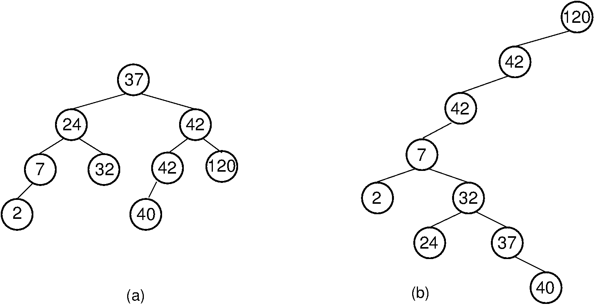

*Figure 6.10.1: Two Binary Search Trees for a collection of values.
Tree (a) results if values are inserted
in the order 37, 24, 42, 7, 2, 40, 42, 32, 120.
Tree (b) results if the same values are inserted in the
order 120, 42, 42, 7, 2, 32, 37, 24, 40.*

Here is a class declaration for the BST.
Recall that there are various ways to deal with
[keys](Glossary.md#term-key) and
[comparing records](Comparison.md#comparison)
Three typical approaches are [key-value pairs](Glossary.md#term-key-value-pair),
a special comparison method such as using the `Comparator` class,
and passing in a [comparator function](Glossary.md#term-comparator).
Our BST implementation will require that records implement the
`Comparable` interface.

```java
// Binary Search Tree implementation
class BST<E extends Comparable<E>> {
  private BSTNode<E> root; // Root of the BST
  private int nodecount; // Number of nodes in the BST

  // constructor
  BST() { root = null; nodecount = 0; }

  // Reinitialize tree
  public void clear() { root = null; nodecount = 0; }

  // Insert a record into the tree.
  // Records can be anything, but they must be Comparable
  // e: The record to insert.
  public void insert(E e) {
    root = inserthelp(root, e);
    nodecount++;
  }

  // Remove a record from the tree
  // key: The key value of record to remove
  // Returns the record removed, null if there is none.
  public E remove(E key) {
    E temp = findhelp(root, key); // First find it
    if (temp != null) {
      root = removehelp(root, key); // Now remove it
      nodecount--;
    }
    return temp;
  }

  // Return the record with key value k, null if none exists
  // key: The key value to find
  public E find(E key) { return findhelp(root, key); }

  // Return the number of records in the dictionary
  public int size() { return nodecount; }
```

<a id="bst-search"></a>
### 6.10.1.1. BST Search

The first operation that we will look at in detail will find the
record that matches a given key.
Notice that in the BST class, public member function
`find` calls private member function `findhelp`.
Method `find` takes the search key as an explicit parameter
and its BST as an implicit parameter, and returns the record that
matches the key.
However, the find operation is most easily implemented as a
recursive function whose parameters are the root of a
subtree and the search key.
Member `findhelp` has the desired form for this recursive
subroutine and is implemented as follows.

<a id="bst-insert"></a>
## 6.10.2. BST Insert

Now we look at how to insert a new node into the BST.

Note that, except for the last node in the path, `inserthelp`
will not actually change the child pointer for any of the nodes that
are visited.
In that sense, many of the assignments seem redundant.
However, the cost of these additional assignments is worth paying to
keep the insertion process simple.
The alternative is to check if a given assignment is necessary, which
is probably more expensive than the assignment!

We have to decide what to do when the node that we want to
insert has a key value equal to the key of some node already in
the tree.
If during insert we find a node that duplicates the key value to be
inserted, then we have two options.
If the application does not allow nodes with equal keys, then this
insertion should be treated as an error (or ignored).
If duplicate keys are allowed, our convention will be to insert the
duplicate in the left subtree.

The shape of a BST depends on the order in which elements are inserted.
A new element is added to the BST as a new leaf node,
potentially increasing the depth of the tree.
Figure [6.10.1](BST.md#bstshape) illustrates two BSTs for a collection
of values.
It is possible for the BST containing $n$ nodes to be a chain of
nodes with height $n$.
This would happen if, for example, all elements were inserted in
sorted order.
In general, it is preferable for a BST to be as shallow as
possible.
This keeps the average cost of a BST operation low.

<a id="bst-remove"></a>
## 6.10.3. BST Remove

Removing a node from a BST is a bit trickier than inserting a node,
but it is not complicated if all of the possible cases are considered
individually.
Before tackling the general node removal process, we will first see
how to remove from a given subtree the node with the largest key
value.
This routine will be used later by the general node removal function.

The return value of the `deletemax` method is the subtree of
the current node with the maximum-valued node in the subtree removed.
Similar to the `inserthelp` method, each node on the path back to
the root has its right child pointer reassigned to the subtree
resulting from its call to the `deletemax` method.

A useful companion method is `getmax` which returns a
pointer to the node containing the maximum value in the subtree.

```java
  // Get the maximum valued element in a subtree
  private BSTNode<E> getmax(BSTNode<E> rt) {
    if (rt.right() == null) return rt;
    return getmax(rt.right());
  }
```

Now we are ready for the `removehelp` method.
Removing a node with given key value $R$ from the BST
requires that we first find $R$ and then remove it from the
tree.
So, the first part of the remove operation is a search to find
$R$.
Once $R$ is found, there are several possibilities.
If $R$ has no children, then $R$’s parent has its
pointer set to NULL.
If $R$ has one child, then $R$’s parent has
its pointer set to $R$’s child (similar to `deletemax`).
The problem comes if $R$ has two children.
One simple approach, though expensive, is to set $R$’s parent to
point to one of $R$’s subtrees, and then reinsert the remaining
subtree’s nodes one at a time.
A better alternative is to find a value in one of the
subtrees that can replace the value in $R$.

Thus, the question becomes:
Which value can substitute for the one being removed?
It cannot be any arbitrary value, because we must preserve the BST
property without making major changes to the structure of the tree.
Which value is most like the one being removed?
The answer is the least key value greater than the one
being removed, or else the greatest key value less than (or equal to)
the one being removed.
If either of these values replace the one being removed,
then the BST property is maintained.

When duplicate node values do not appear in the tree, it makes no
difference whether the replacement is the greatest value from the
left subtree or the least value from the right subtree.
If duplicates are stored in the left subtree, then we must select
the replacement from the *left* subtree. [^1]
To see why, call the least value in the right subtree $L$.
If multiple nodes in the right subtree have value $L$,
selecting $L$ as the replacement value for the root of the
subtree will result in a tree with equal values to the right of the
node now containing $L$.
Selecting the greatest value from the left subtree does not
have a similar problem, because it does not violate the Binary Search
Tree Property if equal values appear in the left subtree.

<a id="bst-analysis"></a>
## 6.10.4. BST Analysis

The cost for `findhelp` and `inserthelp` is the depth of
the node found or inserted.
The cost for `removehelp` is the depth of the node being
removed, or in the case when this node has two children,
the depth of the node with smallest value in its right subtree.
Thus, in the worst case, the cost for any one of these operations is
the depth of the deepest node in the tree.
This is why it is desirable to keep BSTs
[balanced](Glossary.md#term-balanced-tree), that is, with least possible
height.
If a binary tree is balanced, then the height for a tree of $n$
nodes is approximately $\log n$.
However, if the tree is completely unbalanced, for example in the
shape of a linked list, then the height for a tree with $n$
nodes can be as great as $n$.
Thus, a balanced BST will in the average case have operations costing
$\Theta(\log n)$, while a badly unbalanced BST can have
operations in the worst case costing $\Theta(n)$.
Consider the situation where we construct a BST of $n$ nodes
by inserting records one at a time.
If we are fortunate to have them arrive in an order that results in a
balanced tree (a “random” order is likely to be good
enough for this purpose), then each insertion will cost on average
$\Theta(\log n)$, for a total cost of
$\Theta(n \log n)$.
However, if the records are inserted in order of increasing value,
then the resulting tree will be a chain of height $n$.
The cost of insertion in this case will be
$\sum_{i=1}^{n} i = \Theta(n^2)$.

Traversing a BST costs $\Theta(n)$ regardless of the shape of
the tree.
Each node is visited exactly once, and each child pointer
is followed exactly once.

Below is an example traversal, named `printhelp`.
It performs an inorder traversal on the BST to print the node values
in ascending order.

```java
  private void printhelp(BSTNode<E> rt) {
    if (rt == null) return;
    printhelp(rt.left());
    printVisit(rt.value());
    printhelp(rt.right());
  }
```

While the BST is simple to implement and efficient when the tree is
balanced, the possibility of its being unbalanced is a serious
liability.
There are techniques for organizing a BST to guarantee good performance.
Two examples are the
[AVL tree](AVL.md#avl) and the
[splay tree](Splay.md#splay).
There also exist other types of search trees that are guaranteed to
remain balanced, such as the [2-3 Tree](TwoThreeTree.md#twothreetree).

[^1]: Alternatively, if we prefer to store duplicate values in the
right subtree, then we must replace a deleted node with the
least value from its right subtree.


<a id="dictionary-implementation-using-a-bst"></a>
# 6.11. Dictionary Implementation Using a BST

A simple implementation for the
[Dictionary](Dictionary.md#dictionary) ADT can be
based on [sorted](Glossary.md#term-sorted-list) or
[unsorted lists](Glossary.md#term-unsorted-list).
When implementing the dictionary with an unsorted list,
inserting a new record into the dictionary can be performed quickly by
putting it at the end of the list.
However, searching an unsorted list for a particular record
requires $\Theta(n)$ time in the average case.
For a large database, this is probably much too slow.
Alternatively, the records can be stored in a sorted list.
If the list is implemented using a
[linked list](ListLinked.md#listlinked), then no speedup to the
search operation will result from storing the records in sorted order.
On the other hand, if we use a sorted
[array-based list](Glossary.md#term-array-based-list) to implement
the dictionary, then
[binary search](AnalProgram.md#analprogram)
can be used to find a record in only $\Theta(\log n)$ time.
However, insertion will now require $\Theta(n)$ time on average
because, once the proper location for the new record in the sorted
list has been found, many records might be shifted to make room for
the new record.

Is there some way to organize a collection of records so
that inserting records and searching for records can both be done
quickly?
We can do this with a [binary search tree](Glossary.md#term-binary-search-tree) ([BST](Glossary.md#term-bst)).
The advantage of using the BST is that all major operations (insert,
search, and remove) are $\Theta(\log n)$ in the average case.
Of course, if the tree is badly balanced, then the cost can be as bad
as $\Theta(n)$.

Here is an implementation for the Dictionary interface, using a BST to
store the records.

```java
// Dictionary implementation using BST
// This uses KVPair to manage the key/value pairs
class BSTDict implements Dictionary {
  private BST theBST; // The BST that stores the records

  // constructor
  BSTDict() { theBST = new BST(); }

  // Reinitialize dictionary
  public void clear() { theBST = new BST(); }

  // Insert a record
  // k: the key for the record being inserted.
  // e: the record being inserted.
  void insert(Comparable k, Object e) {
    theBST.insert(new KVPair(k, e));
  }

  // Remove and return a record.
  // k: the key of the record to be removed.
  // Return a maching record. If multiple records match "k", remove
  // an arbitrary one. Return null if no record with key "k" exists.
  Object remove(Comparable k) {
    Object temp = theBST.remove(k);
    if (temp == null) return temp;
    else return ((KVPair)temp).value();
  }

  // Remove and return an arbitrary record from dictionary.
  // Return the record removed, or null if none exists.
  Object removeAny() {
    if (theBST.size() == 0) return null;
    Object temp = theBST.remove(((KVPair)(theBST.root.element)).key());
    return ((KVPair)temp).value();
  }

  // Return a record matching "k" (null if none exists).
  // If multiple records match, return an arbitrary one.
  // k: the key of the record to find
  Object find(Comparable k) {
    Object temp = theBST.find(k);
    if (temp == null) return temp;
    else return ((KVPair)temp).value();
  }

  // Return the number of records in the dictionary.
  int size() {
    return theBST.size();
  }
}
```


<a id="array-implementation-for-complete-binary-trees"></a>
# 6.12. Array Implementation for Complete Binary Trees

<a id="id1"></a>
## 6.12.1. Array Implementation for Complete Binary Trees

From the [full binary tree theorem](BinaryTreeFullThm.md#binarytreefullthm), we know
that a large fraction of the space in a typical binary tree node
implementation is devoted to structural [overhead](Glossary.md#term-overhead), not to
storing data.
This module presents a simple, compact implementation
for [complete binary trees](Glossary.md#term-complete-binary-tree).
Recall that complete binary trees have all levels except the bottom
filled out completely, and the bottom level has all of its nodes filled
in from left to right.
Thus, a complete binary tree of $n$ nodes has only one possible
shape.
You might think that a complete binary tree is such an unusual
occurrence that there is no reason to develop a special
implementation for it.
However, the complete binary tree has practical uses, the most
important being the [heap](Glossary.md#term-heap) data structure.
Heaps are often used to implement
[priority queues](Glossary.md#term-priority-queue) and for
[external sorting algorithms](Glossary.md#term-external-sort).

We begin by assigning numbers to the node positions in the complete
binary tree, level by level, from left to right as shown in
Figure [6.12.1](CompleteTree.md#binarray).
An array can store the tree’s data values efficiently, placing
each data value in the array position corresponding to that node’s
position within the tree.
The table lists the array indices for the
children, parent, and siblings of each node in
Figure [6.12.1](CompleteTree.md#binarray).

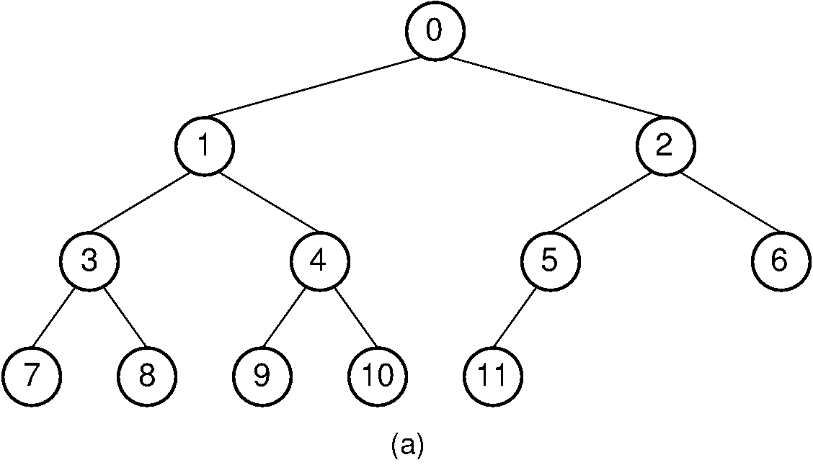

*Figure 6.12.1: A complete binary tree of 12 nodes, numbered starting from 0.*

Here is a table that lists, for each node position, the positions of
the parent, sibling, and children of the node.

<a id="equation-completetree-0"></a>
$$
\begin{aligned}\begin{array}{|c|c|c|c|c|c|c|c|c|c|c|c|c|}
\hline
\textrm{Position} & 0  & 1 & 2 & 3 &  4 &  5 & 6 & 7 & 8 &  9 & 10 & 11\\
\hline
\hline
\textrm{Parent} & \,--\, & 0 & 0 & 1 &  1 &  2 &  2 & 3 & 3 & 4 & 4 & 5\\
\hline
\textrm{Left Child} & 1  & 3 & 5 & 7 &  9 & 11 & \,--\, & \,--\, & \,--\, &
\,--\, & \,--\, &  \,--\,\\
\hline
\textrm{Right Child} & 2  & 4 & 6 & 8 & 10 & \,--\, & \,--\, & \,--\, &
\,--\, & \,--\, & \,--\, &  \,--\,\\
\hline
\textrm{Left Sibling} & \,--\, & \,--\, & 1 & \,--\, &  3 & \,--\, & 5 &
\,--\, & 7 & \,--\, &  9 &  \,--\,\\
\hline
\textrm{Right Sibling} & \,--\, & 2 & \,--\, & 4 & \,--\, &  6 & \,--\, & 8 &
\,--\, & 10 & \,--\, & \,--\,\\
\hline&&&&&&&&&&&&\end{array}\end{aligned}
$$

Looking at the table, you should see a pattern
regarding the positions of a node’s relatives within the array.
Simple formulas can be derived for calculating the array index
for each relative of a node $R$ from $R$’s index.
No explicit pointers are necessary to reach a node’s left or
right child.
This means there is no overhead to the array implementation if the
array is selected to be of size $n$ for a tree of $n$
nodes.

The formulae for calculating the array indices of the various
relatives of a node are as follows.
The total number of nodes in the tree is $n$.
The index of the node in question is $r$,
which must fall in the range 0 to $n-1$.

- Parent($r$) $= \lfloor(r - 1)/2\rfloor$
if $r \neq 0$.
- Left child($r$) $= 2r + 1$ if $2r + 1 < n$.
- Right child($r$) $= 2r + 2$ if $2r + 2 < n$.
- Left sibling($r$) $= r - 1$ if $r$ is even and
$r \neq 0$.
- Right sibling($r$) $= r + 1$ if $r$
is odd and $r + 1 < n$.


<a id="heaps-and-priority-queues"></a>
# 6.13. Heaps and Priority Queues

<a id="id1"></a>
## 6.13.1. Heaps and Priority Queues

There are many situations, both in real life and in computing
applications, where we wish to choose the next “most important”
from a collection of people, tasks, or objects.
For example, doctors in a hospital emergency room often choose to see
next the “most critical” patient rather than the one who arrived
first.
When scheduling programs for execution in a multitasking
operating system, at any given moment there might be several programs
(usually called [jobs](Glossary.md#term-job)) ready to run.
The next job selected is the one with the highest
[priority](Glossary.md#term-priority).
Priority is indicated by a particular value associated with the job
(and might change while the job remains in the wait list).

When a collection of objects is organized by importance or priority,
we call this a [priority queue](Glossary.md#term-priority-queue).
A normal queue data structure will not implement a priority queue
efficiently because search for the element with highest priority will
take $\Theta(n)$ time.
A list, whether sorted or not, will also require $\Theta(n)$
time for either insertion or removal.
A BST that organizes records by priority could be used, with the total
of $n$ inserts and $n$ remove operations
requiring $\Theta(n \log n)$ time in the average case.
However, there is always the possibility that the BST will become
unbalanced, leading to bad performance.
Instead, we would like to find a data structure that is guaranteed to
have good performance for this special application.

This section presents the [heap](Glossary.md#term-heap) [^1] data structure.
A heap is defined by two properties.
First, it is a complete binary tree,
so heaps are nearly always implemented using the
[array representation for complete binary trees](CompleteTree.md#completetree).
Second, the values stored in a heap are
[partially ordered](Glossary.md#term-partial-order).
This means that there is a relationship between the value stored at
any node and the values of its children.
There are two variants of the heap, depending on the definition of
this relationship.

A [max heap](Glossary.md#term-max-heap) has the property that every node stores a
value that is *greater* than or equal to the value of either of
its children.
Because the root has a value greater than or equal to its children,
which in turn have values greater than or equal to their children, the
root stores the maximum of all values in the tree.

A [min heap](Glossary.md#term-min-heap) has the property that every node stores a
value that is *less* than or equal to that of its children.
Because the root has a value less than or equal to its children, which
in turn have values less than or equal to their children, the root
stores the minimum of all values in the tree.

Note that there is no necessary relationship between the value of a
node and that of its sibling in either the min heap or the max heap.
For example, it is possible that the values for all nodes in the left
subtree of the root are greater than the values for every node of the
right subtree.
We can contrast BSTs and heaps by the strength of their ordering
relationships.
A BST defines a [total order](Glossary.md#term-total-order) on its nodes in that,
given the positions for any two nodes in the tree, the one to the
“left” (equivalently, the one appearing earlier in an inorder
traversal) has a smaller key value than the one to the “right”.
In contrast, a heap implements a partial order.
Given their positions, we can determine the relative order for the
key values of two nodes in the heap *only* if one is a
descendant of the other.

Min heaps and max heaps both have their uses.
For example, the Heapsort uses the max heap,
while the Replacement Selection algorithm used for external sorting
uses a min heap.
The examples in the rest of this section will use a max heap.

Be sure not to confuse the logical representation of a heap
with its physical implementation by means of the array-based complete
binary tree.
The two are not synonymous because the logical view of the heap is
actually a tree structure, while the typical physical implementation
uses an array.

Here is an implementation for max heaps.
The class uses records that support the Comparable interface to
provide flexibility.

```java
// Max-heap implementation
class MaxHeap {
  private Comparable[] Heap; // Pointer to the heap array
  private int size;          // Maximum size of the heap
  private int n;             // Number of things now in heap

  // Constructor supporting preloading of heap contents
  MaxHeap(Comparable[] h, int num, int max)
  { Heap = h;  n = num;  size = max;  buildheap(); }

  // Return current size of the heap
  int heapsize() { return n; }

  // Return true if pos a leaf position, false otherwise
  boolean isLeaf(int pos)
  { return (pos >= n/2) && (pos < n); }

  // Return position for left child of pos
  int leftchild(int pos) {
    if (pos >= n/2) return -1;
    return 2*pos + 1;
  }

  // Return position for right child of pos
  int rightchild(int pos) {
    if (pos >= (n-1)/2) return -1;
    return 2*pos + 2;
  }

  // Return position for parent
  int parent(int pos) {
    if (pos <= 0) return -1;
    return (pos-1)/2;
  }

  // Insert val into heap
  void insert(int key) {
    if (n >= size) {
      println("Heap is full");
      return;
    }
    int curr = n++;
    Heap[curr] = key;  // Start at end of heap
    // Now sift up until curr's parent's key > curr's key
    while ((curr != 0) && (Heap[curr].compareTo(Heap[parent(curr)]) > 0)) {
      swap(Heap, curr, parent(curr));
      curr = parent(curr);
    }
  }

  // Heapify contents of Heap
  void buildheap()
    { for (int i=n/2-1; i>=0; i--) siftdown(i); }

  // Put element in its correct place
  void siftdown(int pos) {
    if ((pos < 0) || (pos >= n)) return; // Illegal position
    while (!isLeaf(pos)) {
      int j = leftchild(pos);
      if ((j<(n-1)) && (Heap[j].compareTo(Heap[j+1]) < 0))
        j++; // j is now index of child with greater value
      if (Heap[pos].compareTo(Heap[j]) >= 0) return;
      swap(Heap, pos, j);
      pos = j;  // Move down
    }
  }

  // Remove and return maximum value
  Comparable removemax() {
    if (n == 0) return -1;  // Removing from empty heap
    swap(Heap, 0, --n); // Swap maximum with last value
    if (n != 0)      // Not on last element
      siftdown(0);   // Put new heap root val in correct place
    return Heap[n];
  }

  // Remove and return element at specified position
  Comparable remove(int pos) {
    if ((pos < 0) || (pos >= n)) return -1; // Illegal heap position
    if (pos == (n-1)) n--; // Last element, no work to be done
    else {
      swap(Heap, pos, --n); // Swap with last value
      update(pos);
    }
  }

  // Modify the value at the given position
  void modify(int pos, Comparable newVal) {
    if ((pos < 0) || (pos >= n)) return; // Illegal heap position
    Heap[pos] = newVal();
    update(pos);
  }

  // The value at pos has been changed, restore the heap property
  void update(pos) {
    // If it is a big value, push it up
    while ((pos > 0) && (Heap[pos].compareTo(Heap[parent(pos)]) > 0)) {
      swap(Heap, pos, parent(pos));
      pos = parent(pos);
    }
    if (n != 0) siftdown(pos); // If it is little, push down
  }
}
```

This class definition makes two concessions to the fact that an
array-based implementation is used.
First, heap nodes are indicated by their logical position within the
heap rather than by a pointer to the node.
In practice, the logical heap position corresponds to the identically
numbered physical position in the array.
Second, the constructor takes as input a pointer to the array to be
used.
This approach provides the greatest flexibility for using the heap
because all data values can be loaded into the array directly
by the client.
The advantage of this comes during the heap construction phase,
as explained below.
The constructor also takes an integer parameter indicating the initial
size of the heap (based on the number of elements initially loaded
into the array) and a second integer parameter indicating the maximum
size allowed for the heap (the size of the array).

Method `heapsize` returns the current size of the heap.
`H.isLeaf(pos)` returns TRUE if position
`pos` is a leaf in heap `H`, and FALSE otherwise.
Members `leftchild`, `rightchild`,
and `parent` return the position (actually, the array index)
for the left child, right child, and parent of the position passed,
respectively.

One way to build a heap is to insert the elements one at a time.
Method `insert` will insert a new element $V$ into
the heap.

You might expect the heap insertion process to be similar to the
insert function for a BST, starting at the root and working down
through the heap.
However, this approach is not likely to work because the heap must
maintain the shape of a complete binary tree.
Equivalently, if the heap takes up the first
$n$ positions of its array prior to the call to
`insert`,
it must take up the first $n+1$ positions after.
To accomplish this, `insert` first places $V$ at
position $n$ of the array.
Of course, $V$ is unlikely to be in the correct position.
To move $V$ to the right place, it is compared to its
parent’s value.
If the value of $V$ is less than or equal to the value of its
parent, then it is in the correct place and the insert routine is
finished.
If the value of $V$ is greater than that of its parent, then
the two elements swap positions.
From here, the process of comparing $V$ to its (current)
parent continues until $V$ reaches its correct position.

Since the heap is a complete binary tree, its height is guaranteed to
be the minimum possible.
In particular, a heap containing $n$ nodes will have a height of
$\Theta(\log n)$.
Intuitively, we can see that this must be true because each level that
we add will slightly more than double the number of nodes in the tree
(the $i$ th level has $2^i$ nodes,
and the sum of the first $i$ levels is $2^{i+1}-1$).
Starting at 1, we can double only $\log n$ times to reach a
value of $n$.
To be precise, the height of a heap with $n$ nodes is
$\lceil \log n + 1 \rceil$.

Each call to `insert` takes $\Theta(\log n)$ time in the
worst case, because the value being inserted can move at most the
distance from the bottom of the tree to the top of the tree.
Thus, to insert $n$ values into the heap, if we insert them
one at a time, will take $\Theta(n \log n)$ time in the
worst case.

<a id="building-a-heap"></a>
## 6.13.2. Building a Heap

If all $n$ values are available at the beginning of the
building process, we can build the heap faster than just
inserting the values into the heap one by one.
Consider this example, with two possible ways to heapify an initial
set of values in an array.

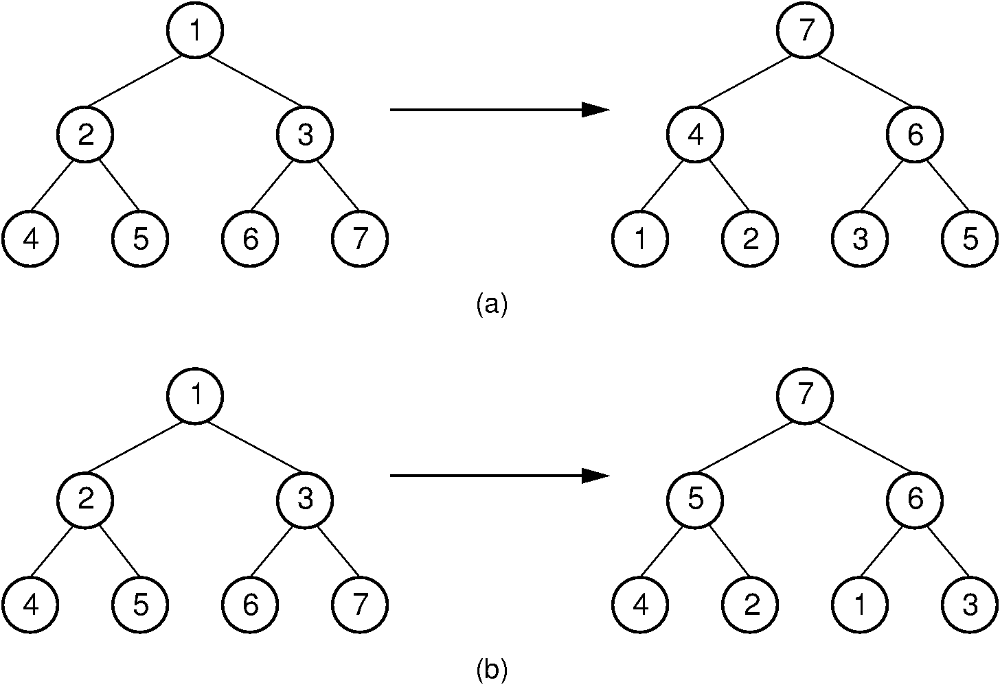

*Figure 6.13.1: Two series of exchanges to build a max heap.
(a) This heap is built by a series of nine exchanges in the order
(4-2), (4-1), (2-1), (5-2), (5-4), (6-3), (6-5), (7-5), (7-6).
(b) This heap is built by a series of four exchanges in the order
(5-2), (7-3), (7-1), (6-1).*

From this example, it is clear that the heap for any given
set of numbers is not unique, and we see that some rearrangements of
the input values require fewer exchanges than others to build the
heap.
So, how do we pick the best rearrangement?

One good algorithm stems from induction.
Suppose that the left and right subtrees of the root are already
heaps, and $R$ is the name of the element at the root.
This situation is illustrated by this figure:

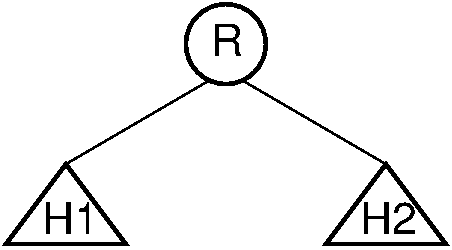

*Figure 6.13.2: Final stage in the heap-building algorithm.
Both subtrees of node $R$ are heaps.
All that remains is to push $R$ down to its proper level in
the heap.*

In this case there are two possibilities.

1. $R$ has a value greater than or equal to its two
children. In this case, construction is complete.
1. $R$ has a value less than one or both of its children.

$R$ should be exchanged with the child that has
greater value.
The result will be a heap, except that $R$
might still be less than one or both of its (new) children.
In this case, we simply continue the process of “pushing down”
$R$ until it reaches a level where it is greater than its
children, or is a leaf node.
This process is implemented by the private method
`siftdown`.

This approach assumes that the subtrees are already heaps,
suggesting that a complete algorithm can be obtained by visiting
the nodes in some order such that the children of a node are
visited *before* the node itself.
One simple way to do this is simply to work from the high index of
the array to the low index.
Actually, the build process need not visit the leaf nodes
(they can never move down because they are already at the bottom), so
the building algorithm can start in the middle of the array, with the
first internal node.

Here is a visualization of the heap build process.

Method `buildHeap` implements the building algorithm.

What is the cost of `buildHeap`?
Clearly it is the sum of the costs for the calls to `siftdown`.
Each `siftdown` operation can cost at most the number of
levels it takes for the node being sifted to reach the bottom of the
tree.
In any complete tree, approximately half of the nodes are leaves
and so cannot be moved downward at all.
One quarter of the nodes are one level above the leaves, and so their
elements can move down at most one level.
At each step up the tree we get half the number of nodes as were at
the previous level, and an additional height of one.
The maximum sum of total distances that elements can go is
therefore

<a id="equation-heaps-0"></a>
$$
\sum_{i=1}^{\log n} (i-1)\frac{n}{2^i}
= \frac{n}{2}\sum_{i=1}^{\log n} \frac{i-1}{2^{i-1}}.
$$

The summation on the right [is known](Summations.md#summations)
to have a closed-form solution of approximately 2,
so this algorithm takes $\Theta(n)$ time in the worst case.
This is far better than building the heap one element at a time,
which would cost $\Theta(n \log n)$ in the worst case.
It is also faster than the $\Theta(n \log n)$ average-case
time and $\Theta(n^2)$ worst-case time required to build the
BST.

<a id="removing-from-the-heap-or-updating-an-object-s-priority"></a>
## 6.13.3. Removing from the heap or updating an object’s priority

Because the heap is $\log n$ levels deep, the cost of deleting
the maximum element is $\Theta(\log n)$ in the average and worst
cases.

For some applications, objects might get their priority modified.
One solution in this case is to remove the object and reinsert it.
To do this, the application needs to know the position of the object
in the heap.
Another option is to change the priority value of the object, and then
update its position in the heap.
Note that a remove operation implicitly has to do this anyway, since
when the last element in the heap is swapped with the one being
removed, that value might be either too small or too big for its new
position.
So we use a utility method called `update` in both the `remove`
and `modify` methods to handle this process.

<a id="priority-queues"></a>
## 6.13.4. Priority Queues

The heap is a natural implementation for the priority queue discussed
at the beginning of this section.
Jobs can be added to the heap (using their priority value as the
ordering key) when needed.
Method `removemax` can be called whenever a new job is to be
executed.

Some applications of priority queues require the ability to change the
priority of an object already stored in the queue.
This might require that the object’s position in the heap representation
be updated.
Unfortunately, a max heap is not efficient when searching for an
arbitrary value; it is only good for finding the maximum value.
However, if we already know the index for an object within the heap,
it is a simple matter to update its priority (including changing its
position to maintain the heap property) or remove it.
The `remove` method takes as input the position of the
node to be removed from the heap.
A typical implementation for priority queues requiring updating of
priorities will need to use an auxiliary data structure that supports
efficient search for objects (such as a BST).
Records in the auxiliary data structure will store
the object’s heap index, so that the object’s priority can be updated.
Priority queues can be helpful for solving graph problems such as
[single-source shortest paths](GraphShortest.md#graphshortest)
and
[minimal-cost spanning tree](MCST.md#mcst).

For a story about Priority Queues and dragons, see [Computational Fairy Tales: Stacks, Queues, Priority Queues, and the Prince's Complaint Line](http://computationaltales.blogspot.com/2011/04/stacks-queues-priority-queues-and.html).

[^1]: Note that the term “heap” is also sometimes used to refer to
[free store](Glossary.md#term-free-store).


<a id="huffman-coding-trees"></a>
# 6.14. Huffman Coding Trees

<a id="id1"></a>
## 6.14.1. Huffman Coding Trees

One can often gain an improvement in space requirements in exchange
for a penalty in running time.
There are many situations where this is a desirable tradeoff.
A typical example is storing files on disk.
If the files are not actively used, the owner might wish to compress
them to save space. Later, they can be uncompressed for use, which
costs some time, but only once.

We often represent a set of items in a computer program by assigning a
unique code to each item.
For example, the standard [ASCII coding](Glossary.md#term-ascii-character-coding)
scheme assigns a unique eight-bit value to each character.
It takes a certain minimum number of bits to provide enough unique
codes so that we have a different one for each character.
For example, it takes $\left\lceil log\ 128\right\rceil$
or seven bits to provide the 128 unique codes needed
to represent the 128 symbols of the ASCII character set. [^1]

The requirement for $\left \lceil log\ n \right\rceil$ bits to
represent $n$ unique code values assumes that all codes will be
the same length, as are ASCII codes.
These are called [fixed-length codes](Glossary.md#term-fixed-length-coding).
If all characters were used equally often, then a fixed-length coding
scheme is the most space efficient method.
However, you are probably aware that not all characters are used
equally often in many applications.
For example, the various letters in an English language document have
greatly different frequencies of use.

Table [6.14.1](Huffman.md#freq) shows the relative frequencies of the
letters of the alphabet. From this table we can see that the letter
‘E’ appears about 60 times more often than the letter ‘Z’. In normal
ASCII, the words “DEED” and “MUCK” require the same amount of space
(four bytes). It would seem that words such as “DEED”, which are
composed of relatively common letters, should be storable in less
space than words such as “MUCK”, which are composed of relatively
uncommon letters.

**Table 6.14.1**

Relative frequencies for the 26 letters of the
alphabet as they appear in a selected set of English
documents. “Frequency” represents the expected frequency of occurrence
per 1000 letters, ignoring case.

<a id="equation-huffman-0"></a>
$$
\begin{aligned}\begin{array}{c|c|c|c}
\textbf{Letter}&\textbf{Frequency}&\textbf{Letter}&\textbf{Frequency}\\
\textrm A & 77 & N & 67\\
\textrm B & 17 & O & 67\\
\textrm C & 32 & P & 20\\
\textrm D & 42 & Q &  5\\
\textrm E &120 & R & 59\\
\textrm F & 24 & S & 67\\
\textrm G & 17 & T & 85\\
\textrm H & 50 & U & 37\\
\textrm I & 76 & V & 12\\
\textrm J &  4 & W & 22\\
\textrm K &  7 & X &  4\\
\textrm L & 42 & Y & 22\\
\textrm M & 24 & Z &  2\\\end{array}\end{aligned}
$$

If some characters are used more frequently than others, is it
possible to take advantage of this fact and somehow assign them
shorter codes?
The price could be that other characters require longer codes, but
this might be worthwhile if such characters appear rarely enough.
This concept is at the heart of file compression techniques in
common use today.
The next section presents one such approach to assigning
[variable-length codes](Glossary.md#term-variable-length-coding),
called [Huffman coding](Glossary.md#term-huffman-codes).
While it is not commonly used in its simplest form for file
compression (there are better methods), Huffman coding gives the
flavor of such coding schemes.
One motivation for studying Huffman coding is because it provides our
first opportunity to see a type of tree structure referred to as a
[search trie](Glossary.md#term-search-trie).

<a id="building-huffman-coding-trees"></a>
### 6.14.1.1. Building Huffman Coding Trees

Huffman coding assigns codes to characters such that the length of the
code depends on the relative frequency or [weight](Glossary.md#term-weight) of the
corresponding character.
Thus, it is a variable-length code.
If the estimated frequencies for letters match the actual frequency
found in an encoded message, then the length of that message will
typically be less than if a fixed-length code had been used.
The Huffman code for each letter is derived from a full binary tree
called the [Huffman coding tree](Glossary.md#term-huffman-coding-tree), or simply the
[Huffman tree](Glossary.md#term-huffman-tree).
Each leaf of the Huffman tree corresponds to a letter, and we
define the weight of the leaf node to be the weight (frequency) of its
associated letter.
The goal is to build a tree with the
[minimum external path weight](Glossary.md#term-minimum-external-path-weight).
Define the [weighted path length](Glossary.md#term-weighted-path-length) of a leaf to be its weight
times its depth.
The binary tree with minimum external path weight is the one with the
minimum sum of weighted path lengths for the given set of leaves.
A letter with high weight should have low depth, so that it will count
the least against the total path length.
As a result, another letter might be pushed deeper in the tree if it
has less weight.

The process of building the Huffman tree for $n$ letters is
quite simple.
First, create a collection of $n$ initial Huffman trees,
each of which is a single leaf node containing one of the letters.
Put the $n$ partial trees onto a priority queue
organized by weight (frequency).
Next, remove the first two trees (the ones with lowest weight) from
the priority queue.
Join these two trees together to create a new tree whose root has the
two trees as children, and whose weight is the sum of the weights of
the two trees.
Put this new tree back into the priority queue.
This process is repeated until all of the partial Huffman trees have
been combined into one.

**Table 6.14.2**

The relative frequencies for eight selected letters.

<a id="equation-huffman-1"></a>
$$
\begin{aligned}\begin{array}{|c|cccccccc|}
\hline
\textrm Letter & C & D & E & K & L & M & U & Z\\
\textrm Frequency & 32 & 42 & 120 & 7 & 42 & 24 & 37 & 2\\
\hline&&&&&&&&\end{array}\end{aligned}
$$

The following slideshow illustrates the Huffman tree
construction process for the eight letters of
Table [6.14.2](Huffman.md#freqexamp). [^2]

Here is the implementation for Huffman tree nodes.

```java
/** Huffman tree node implementation: Base class */
interface HuffBaseNode {
  boolean isLeaf(); 
  int weight();
}


/** Huffman tree node: Leaf class */
class HuffLeafNode implements HuffBaseNode {
  private char element;      // Element for this node
  private int weight;        // Weight for this node

  /** Constructor */
  HuffLeafNode(char el, int wt)
    { element = el; weight = wt; }

  /** @return The element value */
  char value() { return element; }

  /** @return The weight */
  int weight() { return weight; }

  /** Return true */
  boolean isLeaf() { return true; }
}


/** Huffman tree node: Internal class */
class HuffInternalNode implements HuffBaseNode {
  private int weight;            
  private HuffBaseNode left;  
  private HuffBaseNode right; 

  /** Constructor */
  HuffInternalNode(HuffBaseNode l,
                          HuffBaseNode r, int wt)
    { left = l; right = r; weight = wt; }

  /** @return The left child */
  HuffBaseNode left() { return left; }

  /** @return The right child */
  HuffBaseNode right() { return right; }

  /** @return The weight */
  int weight() { return weight; }

  /** Return false */
  boolean isLeaf() { return false; }
}
```

This implementation is similar to
a typical [class hierarchy](BinaryTreeImpl.md#binarytreeimpl)
for implementing full binary trees.
There is an abstract [base class](Glossary.md#term-base-class), named `HuffNode`, and two
[subclasses](Glossary.md#term-subclass), named `LeafNode` and `IntlNode`.
This implementation reflects the fact that leaf and
internal nodes contain distinctly different information.

Here is the implementation for the Huffman Tree class.

```java
/** A Huffman coding tree */
class HuffTree implements Comparable {
  private HuffBaseNode root;  

  /** Constructors */
  HuffTree(char el, int wt)
    { root = new HuffLeafNode(el, wt); }
  HuffTree(HuffBaseNode l, HuffBaseNode r, int wt)
    { root = new HuffInternalNode(l, r, wt); }

  HuffBaseNode root() { return root; }
  int weight() // Weight of tree is weight of root
    { return root.weight(); }
  int compareTo(Object t) {
    HuffTree that = (HuffTree)t;
    if (root.weight() < that.weight()) return -1;
    else if (root.weight() == that.weight()) return 0;
    else return 1;
  }
}
```

Here is the implementation for the tree-building process.

```java
static HuffTree buildTree() {
  HuffTree tmp1, tmp2, tmp3 = null;

  while (Hheap.heapsize() > 1) { // While two items left
    tmp1 = Hheap.removemin();
    tmp2 = Hheap.removemin();
    tmp3 = new HuffTree(tmp1.root(), tmp2.root(),
                             tmp1.weight() + tmp2.weight());
    Hheap.insert(tmp3);   // Return new tree to heap
  }
  return tmp3;            // Return the tree
}
```

`buildHuff` takes as input `fl`, the min-heap of partial
Huffman trees, which initially are single leaf nodes as shown in Step
1 of the slideshow above.
The body of function `buildTree` consists mainly of a `for`
loop. On each iteration of the `for` loop, the first two partial
trees are taken off the heap and placed in variables `temp1` and
`temp2`.
A tree is created (`temp3`) such that the left and right subtrees
are `temp1` and `temp2`, respectively.
Finally, `temp3` is returned to `fl`.

Assigning and Using Huffman Codes

Once the Huffman tree has been constructed, it is an easy matter to
assign codes to individual letters.
Beginning at the root, we assign either a ‘0’ or a ‘1’ to each edge in
the tree. ‘0’ is assigned to edges connecting a node with its left
child, and ‘1’ to edges connecting a node with its right child.
This process is illustrated by the following slideshow.

Now that we see how the edges associate with bits in the code, it is a
simple matter to generate the codes for each letter (since each letter
corresponds to a leaf node in the tree).

Now that we have a code for each letter,
encoding a text message is done by replacing each letter of the
message with its binary code.
A lookup table can be used for this purpose.

<a id="decoding"></a>
### 6.14.1.2. Decoding

A set of codes is said to meet the [prefix property](Glossary.md#term-prefix-property) if no
code in the set is the prefix of another.
The prefix property guarantees that there will be no ambiguity in how
a bit string is decoded.
In other words, once we reach the last bit of a code during
the decoding process, we know which letter it is the code for.
Huffman codes certainly have the prefix property because any prefix
for a code would correspond to an internal node, while all codes
correspond to leaf nodes.

When we decode a character using the Huffman coding tree, we follow a
path through the tree dictated by the bits in the code string.
Each ‘0’ bit indicates a left branch while each ‘1’ bit indicates a
right branch.
The following slideshow shows an example for how to decode a message
by traversing the tree appropriately.

<a id="how-efficient-is-huffman-coding"></a>
### 6.14.1.3. How efficient is Huffman coding?

In theory, Huffman coding is an optimal coding method whenever the
true frequencies are known, and the frequency of a letter is
independent of the context of that letter in the message.
In practice, the frequencies of letters in an English text document do
change depending on context.
For example, while E is the most commonly used letter of the alphabet
in English documents, T is more common as the first letter of a
word.
This is why most commercial compression utilities do not use Huffman
coding as their primary coding method, but instead use techniques that
take advantage of the context for the letters.

Another factor that affects the compression efficiency of Huffman
coding is the relative frequencies of the letters.
Some frequency patterns will save no space as compared to fixed-length
codes; others can result in great compression.
In general, Huffman coding does better when there is large variation
in the frequencies of letters.

**Example 6.14.1**

In the particular case of the frequencies shown in
Table [6.14.1](Huffman.md#freq), we can determine the expected savings from
Huffman coding if the actual frequencies of a coded message match the
expected frequencies.
Because the sum of the frequencies is 306 and E has frequency 120,
we expect it to appear 120 times in a message containing 306
letters.
An actual message might or might not meet this expectation.
Letters D, L, and U have code lengths of three,
and together are expected to appear 121 times in 306 letters.
Letter C has a code length of four, and is expected to appear 32
times in 306 letters.
Letter M has a code length of five, and is expected to appear
24 times in 306 letters.
Finally, letters K and Z have code lengths of six,
and together are expected to appear only 9 times in 306 letters.
The average expected cost per character is simply the sum of
the cost for each character ($c_i$) times the probability of
its occurring ($p_i$), or
$c_1 p_1 + c_2 p_2 + \cdots + c_n p_n.$
This can be reorganized as
$\frac{c_1 f_1 + c_2 f_2 + \cdots + c_n f_n}{f_T}$,
where $f_i$ is the (relative) frequency of letter
$i$ and $f_T$ is the total for all letter frequencies.
For this set of frequencies, the expected cost per letter is
$[(1 \times 120) + (3 \times 121) + (4 \times 32) + (5 \times 24) + (6 \times 9)]/306 = 785/306 \approx 2.57.$

A fixed-length code for these eight characters would require
$\log 8 = 3$ bits per letter as opposed to about 2.57 bits
per letter for Huffman coding.
Thus, Huffman coding is expected to save about 14% for this set of
letters.

Huffman coding for all ASCII symbols should do better than this
example.
The letters of Table [6.14.1](Huffman.md#freq) are atypical in that there
are too many common letters compared to the number of rare letters.
Huffman coding for all 26 letters would yield an expected
cost of 4.29 bits per letter.
The equivalent fixed-length code would require about five bits.
This is somewhat unfair to fixed-length coding because there is
actually room for 32 codes in five bits, but only 26 letters.
More generally, Huffman coding of a typical text file
will save around 40% over ASCII coding if we charge ASCII coding at
eight bits per character.
Huffman coding for a binary file (such as a compiled executable) would
have a very different set of distribution frequencies and so would
have a different space savings.
Most commercial compression programs use two or three coding schemes
to adjust to different types of files.

In decoding example, “DEED” was coded in 8 bits, a saving of 33%
over the twelve bits required from a fixed-length coding.
However, “MUCK” would require 18 bits, more space than required by the
corresponding fixed-length coding.
The problem is that “MUCK” is composed of letters that are not
expected to occur often.
If the message does not match the expected frequencies of the letters,
than the length of the encoding will not be as expected either.

[^1]: To keep things simple, these examples for building Huffman
trees uses a [sorted list](Glossary.md#term-sorted-list) to keep the partial Huffman trees
ordered by frequency.
But a real implementation would use a [heap](Glossary.md#term-heap) to implement a
[priority queue](Glossary.md#term-priority-queue) keyed by the frequencies.
[^2]: ASCII coding actually uses 8 bits per character.
Seven bits are used to represent the 128 codes of the ASCII
character set.
The eigth bit as a [parity](Glossary.md#term-parity) bit, that can be used to
check if there is a transmission error for the character.


<a id="trees-versus-tries"></a>
# 6.15. Trees versus Tries

<a id="id1"></a>
## 6.15.1. Trees versus Tries

We see that all letters with codes beginning with
‘0’ are stored in the left branch, while all letters with codes
beginning with ‘1’ are stored in the right branch.
Contrast this with storing records in a BST.
There, all records with key value less than the root value are stored
in the left branch, while all records with key values greater than the
root are stored in the right branch.

Recall that the Huffman coding tree stored in the left branch all
letters whose codes start with 0, and in the right branch all letters
whose codes start with 1.
We can use this same concept to store records in a search tree that is
slightly different from the behavior of a BST.
We can view all keys stored as appearing on a numberline.
The BST splits the numberline based on the positions of key values as
it receives them.
In contrast, we could split key values based on their binary
reprsentation similar to what the Huffman coding tree does.
The following slideshows present this in more detail.


<a id="proof-of-optimality-for-huffman-coding"></a>
# 6.16. Proof of Optimality for Huffman Coding

<a id="id1"></a>
## 6.16.1. Proof of Optimality for Huffman Coding

Huffman tree building is an example of a
[greedy algorithm](Glossary.md#term-greedy-algorithm).
At each step, the algorithm makes a “greedy” decision to merge
the two subtrees with least weight.
This makes the algorithm simple, but does it give the desired result?
This section concludes with a proof that the Huffman tree
indeed gives the most efficient arrangement for the set of letters.
The proof requires the following lemma.

**Lemma:**
For any Huffman tree built by function `buildHuff` containing at
least two letters, the two letters with least frequency are stored
in sibling nodes whose depth is at least as deep as any other leaf
nodes in the tree.

**Proof:**
Call the two letters with least frequency $l_1$
and $l_2$.
They must be siblings because `buildHuff`
selects them in the first step of the construction process.
Assume that $l_1$ and $l_2$ are
not the deepest nodes in the tree.
In this case, the Huffman tree must either look as shown in
Figure [6.16.1](HuffProof.md#hproof), or effectively symmetrical to
this.
For this situation to occur, the parent of $l_1$
and $l_2$,
labeled $V$, must have greater weight than the node
labeled $X$.
Otherwise, function `buildHuff` would have selected node
$V$ in place of node $X$ as the child of node
$U$.
However, this is impossible because $l_1$ and
$l_2$ are the letters with least frequency.

Here is the proof.

**Theorem:**
Function `buildHuff` builds the Huffman tree with the minimum
external path weight for the given set of letters.

**Proof:**
The proof is by induction on $n$, the number of letters.

- **Base Case:** For $n = 2$, the Huffman tree must have the
minimum external path weight because there are only two possible
trees, each with identical weighted path lengths for the two
leaves.
- **Induction Hypothesis:** Assume that any tree created by
`buildHuff` that contains $n-1$ leaves has minimum
external path length.
- **Induction Step:** Given a Huffman tree $\mathbf{T}$
built by `buildHuff` with $n$ leaves,
$n \geq 2$, suppose that
$w_1 \leq w_2 \leq ... \leq w_n$ where
$w_1$ to $w_n$ are the weights of the letters.
Call $V$ the parent of the letters with frequencies
$w_1$ and $w_2$.
From the lemma, we know that the leaf nodes containing the
letters with frequencies $w_1$ and $w_2$ are as
deep as any nodes in $\mathbf{T}$.
If any other leaf nodes in the tree were deeper, we could reduce
their weighted path length by swapping them with $w_1$ or
$w_2$.
But the lemma tells us that no such deeper nodes exist.
Call $\mathbf{T}'$ the Huffman tree that is
identical to $\mathbf{T}$ except that node $V$ is
replaced with a leaf node $V'$ whose weight is
$w_1 + w_2$.
By the induction hypothesis, $\mathbf{T}'$ has minimum
external path length.
Returning the children to $V'$ restores tree
$\mathbf{T}$, which must also have minimum external path
length.

Thus by mathematical induction, function `buildHuff` creates
the Huffman tree with minimum external path length.


<a id="binary-tree-chapter-summary"></a>
# 6.17. Binary Tree Chapter Summary

<a id="summary-questions"></a>
## 6.17.1. Summary Questions


---

# Chapter 7   Balanced Trees


<a id="balanced-trees"></a>
# 7.1. Balanced Trees

The [Binary Search Tree](BST.md#bst) has a serious deficiency for
practical use as a search structure.
That is the fact that it can easily become unbalanced, so that some
nodes are deep in the tree.
In fact, it is possible for a BST with $n$ nodes to have a depth
of $n$, making it no faster to search in the worst case than a
linked list.
If we could keep the tree balanced in some way, then search cost would
only be $\Theta(\log n)$, a huge improvement.

One solution to this problem is to adopt another search
tree structure instead of using a BST at all.
An example of such an alternative tree structure is the
[2-3 Tree](TwoThreeTree.md#twothreetree)
or the [B-Tree](BTree.md#btree).
But another alternative would be to modify the BST access functions in
some way to guarantee that the tree performs well.
This is an appealing concept, and the concept works well for heaps,
whose access functions maintain the heap in the shape of a complete
binary tree.
Unfortunately, the heap keeps its balanced shape at the cost of weaker
restrictions on the relative values of a node and its children, making
it a bad search structure.
And requiring that the BST always be in the shape of a
complete binary tree requires excessive modification to the tree
during update, as we see in this example.

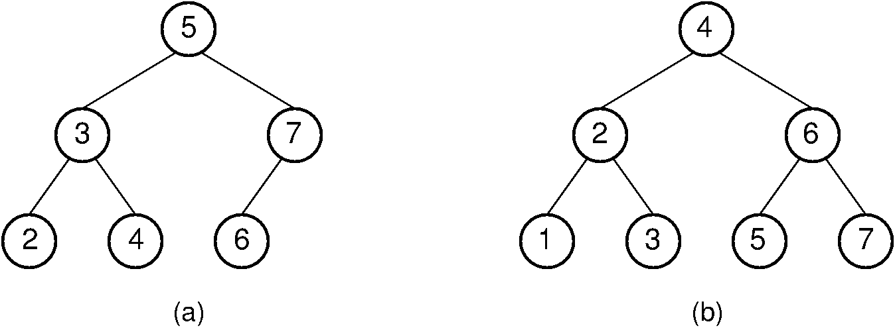

*Figure 7.1.1: An attempt to re-balance a BST after insertion can be expensive.
(a) A BST with six nodes in the shape of a complete binary tree.
(b) A node with value 1 is inserted into the BST of (a).
To maintain both the complete binary tree shape and the BST property,
a major reorganization of the tree is required.*

If we are willing to weaken the balance requirements, we can come up
with alternative update routines that perform well both in terms of
cost for the update and in balance for the resulting tree structure.
The [AVL tree](AVL.md#avl)
works in this way, using insertion and deletion routines
altered from those of the BST to ensure that, for every node, the
depths of the left and right subtrees differ by at most one.

A different approach to improving the performance of the BST is to
not require that the tree always be balanced, but rather to expend
some effort toward making the BST more balanced every time it
is accessed.
This is a little like the idea of path compression used by the
[UNION/FIND algorithm](UnionFind.md#unionfind).
One example of such a compromise is called the
[splay tree](Splay.md#splay).

The [Red-Black Tree](Glossary.md#term-red-black-tree) is also a binary
tree, but it uses a different balancing mechanism.


<a id="the-avl-tree"></a>
# 7.2. The AVL Tree

The AVL tree (named for its inventors Adelson-Velskii and Landis)
should be viewed as a BST with the following additional property:
For every node, the heights of its left and right subtrees differ by
at most 1.
As long as the tree maintains this property, if the tree contains
$n$ nodes, then it has a depth of at most $O(\log n)$.
As a result, search for any node will cost $O(\log n)$,
and if the updates can be done in time proportional to the depth of
the node inserted or deleted, then updates will also cost
$O(\log n)$, even in the worst case.

The key to making the AVL tree work is to alter the insert and delete
routines so as to maintain the balance property.
Of course, to be practical, we must be able to implement the revised
update routines in $\Theta(\log n)$ time.

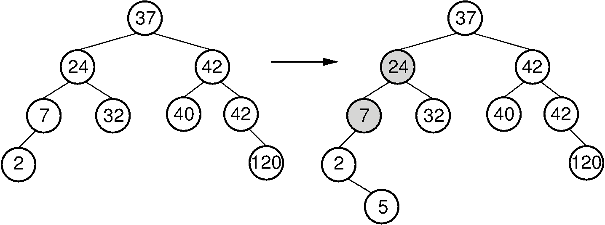

*Figure 7.2.1: Example of an insert operation that violates the AVL tree balance
property.
Prior to the insert operation, all nodes of the tree are balanced
(i.e., the depths of the left and right subtrees for every node
differ by at most one).
After inserting the node with value 5, the nodes with values 7 and
24 are no longer balanced.*

Consider what happens when we insert a node with key value 5,
as shown in Figure [7.2.1](AVL.md#avlinsert).
The tree on the left meets the AVL tree balance requirements.
After the insertion, two nodes no longer meet the requirements.
Because the original tree met the balance requirement, nodes in the
new tree can only be unbalanced by a difference of at most 2 in the
subtrees.
For the bottommost unbalanced node, call it $S$, there are 4
cases:

1. The extra node is in the left child of the left child of
$S$.
1. The extra node is in the right child of the left child of
$S$.
1. The extra node is in the left child of the right child of
$S$.
1. The extra node is in the right child of the right child of
$S$.

Cases 1 and 4 are symmetrical, as are cases 2 and 3.
Note also that the unbalanced nodes must be on the path from
the root to the newly inserted node.

Our problem now is how to balance the tree in $O(\log n)$ time.
It turns out that we can do this using a series of local operations
known as [rotations](Glossary.md#term-rotation).
Cases 1 and 4 can be fixed using a [single rotation](Glossary.md#term-single-rotation),
as shown in Figure [7.2.2](AVL.md#avlsingle).
Cases 2 and 3 can be fixed using a [double rotation](Glossary.md#term-double-rotation), as shown
in Figure [7.2.3](AVL.md#avldouble).

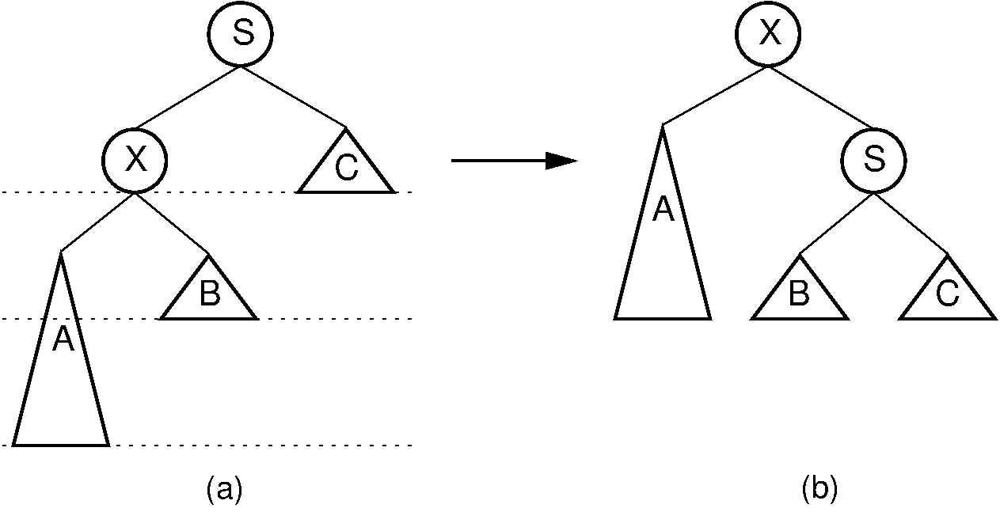

*Figure 7.2.2: A single rotation in an AVL tree.
This operation occurs when the excess node (in subtree $A$)
is in the left child of the left child of the unbalanced node
labeled $S$.
By rearranging the nodes as shown, we preserve the BST property, as
well as re-balance the tree to preserve the AVL tree balance
property.
The case where the excess node is in the right child of the
right child of the unbalanced node is handled in the same
way.*

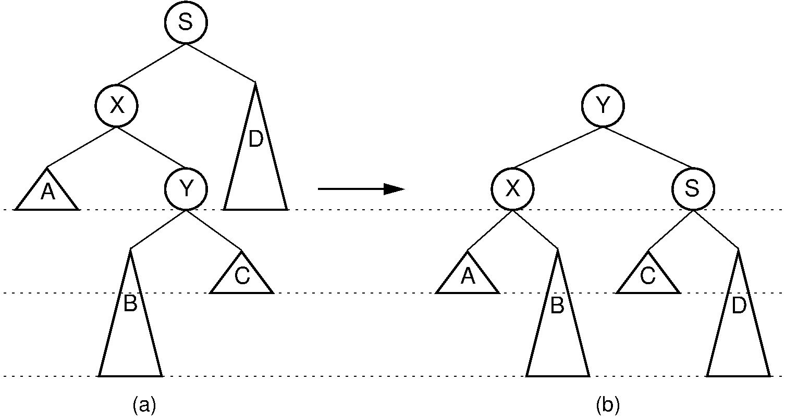

*Figure 7.2.3: A double rotation in an AVL tree.
This operation occurs when the excess node (in subtree $B$)
is in the right child of the left child of the unbalanced node
labeled $S$.
By rearranging the nodes as shown, we preserve the BST property, as
well as re-balance the tree to preserve the AVL tree balance
property.
The case where the excess node is in the left child of the
right child of $S$ is handled in the same way.*

The AVL tree insert algorithm begins with a normal BST insert.
Then as the recursion unwinds up the tree, we perform the appropriate
rotation on any node that is found to be unbalanced.
Deletion is similar; however, consideration for unbalanced nodes must
begin at the level of the *deletemin* operation.

**Example 7.2.1**

In Figure [7.2.1](AVL.md#avlinsert) (b), the bottom-most unbalanced
node has value 7.
The excess node (with value 5) is in the right subtree of the left
child of 7, so we have an example of Case 2.
This requires a double rotation to fix.
After the rotation, 5 becomes the left child of 24, 2 becomes the
left child of 5, and 7 becomes the right child of 5.


<a id="the-splay-tree"></a>
# 7.3. The Splay Tree

Like the AVL tree, the splay tree is not actually a distinct data
structure, but rather reimplements the BST insert, delete, and search
methods to improve the performance of a BST.
The goal of these revised methods is to provide guarantees on the time
required by a series of operations, thereby avoiding the worst-case
linear time behavior of standard BST operations.
No single operation in the splay tree is guaranteed to be efficient.
Instead, the splay tree access rules guarantee that a series of
$m$ operations will take $O(m log n)$ time for a tree of
$n$ nodes whenever $m \geq n$.
Thus, a single insert or search operation could take $O(n)$
time.
However, $m$ such operations are guaranteed to require a total
of $O(m \log n)$ time, for an average cost of
$O(\log n)$ per access operation.
This is a desirable performance guarantee for any search-tree
structure.

Unlike the AVL tree, the splay
tree is not guaranteed to be height balanced.
What is guaranteed is that the total cost of the entire series of
accesses will be cheap.
Ultimately, it is the cost of the series of operations that matters,
not whether the tree is balanced.
Maintaining balance is really done only for the sake of reaching this
time efficiency goal.

The splay tree access functions operate in a manner reminiscent of
the [move-to-front](Glossary.md#term-move-to-front) rule for
[self-organizing lists](SelfOrg.md#selforg),
and of the path compression technique for managing
a series of
[Union/Find](UnionFind.md#unionfind) operations.
These access functions tend to make the tree more balanced, but an
individual access will not necessarily result in a more balanced
tree.

Whenever a node $S$ is accessed (e.g., when $S$ is
inserted, deleted, or is the goal of a search), the splay tree
performs a process called [splaying](Glossary.md#term-splaying).
Splaying moves $S$ to the root of the BST.
When $S$ is being deleted, splaying
moves the parent of $S$ to the root.
As in the AVL tree, a splay of node $S$
consists of a series of [rotations](Glossary.md#term-rotation).
A rotation moves $S$ higher in the tree by adjusting its
position with respect to its parent and grandparent.
A side effect of the rotations is a tendency to balance the tree.
There are three types of rotation.

A [single rotation](Glossary.md#term-single-rotation) is performed only if $S$
is a child of the root node.
The single rotation is illustrated by Figure [7.3.1](Splay.md#singprom).
It basically switches $S$ with its parent in a way that
retains the BST property.
While Figure [7.3.1](Splay.md#singprom) is slightly different from
Figure [7.2.2](AVL.md#avlsingle), in fact the splay tree single
rotation is identical to the AVL tree single rotation.

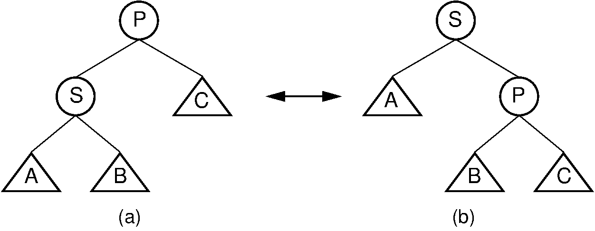

*Figure 7.3.1: Splay tree single rotation.
This rotation takes place only when the node being splayed is a
child of the root.
Here, node $S$ is promoted to the root, rotating with
node $P$.
Because the value of $S$ is less than the value of $P$,
$P$ must become $S$ ‘s right child.
The positions of subtrees $A$, $B$, and ;math:*C* are
altered as appropriate to maintain the BST property, but the
contents of these subtrees remains unchanged.
(a) The original tree with $P$ as the parent.
(b) The tree after a rotation takes place.
Performing a single rotation a second time will return the tree to
its original shape.
Equivalently, if (b) is the initial configuration of the tree
(i.e., $S$ is at the root and $P$ is its right child),
then (a) shows the result of a single rotation to splay $P$ to
the root.*

Unlike the AVL tree, the splay tree requires two types of
double rotation.
Double rotations involve $S$, its parent (call it $P$),
and $S$ ‘s grandparent (call it $G$).
The effect of a double rotation is to move $S$ up two levels in
the tree.

The first double rotation is called a $zigzag rotation$.
It takes place when either of the following two conditions are met:

1. $S$ is the left child of $P$, and $P$ is the
right child of $G$.
1. $S$ is the right child of $P$, and $P$ is the
left child of $G$.

In other words, a zigzag rotation is used when $G$,
$P$, and $S$ form a zigzag.
The zigzag rotation is illustrated by Figure [7.3.2](Splay.md#zigzag).

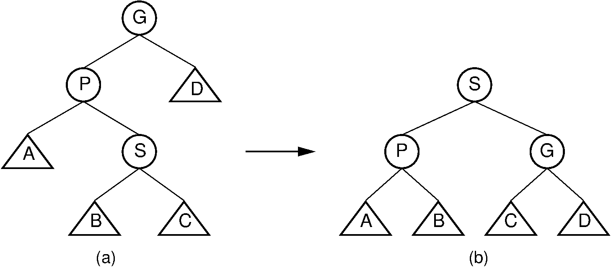

*Figure 7.3.2: Splay tree zigzag rotation.
(a) The original tree with $S$, $P$, and $G$ in
zigzag formation.
(b) The tree after the rotation takes place.
The positions of subtrees $A$, $B$, $C$, and
$D$ are altered as appropriate to maintain the BST
property.*

The other double rotation is known as a [zigzig](Glossary.md#term-zigzig) rotation.
A zigzig rotation takes place when either of the following two
conditions are met:

1. $S$ is the left child of $P$, which is in turn the
left child of $G$.
1. $S$ is the right child of $P$, which is in turn the
right child of $G$.

Thus, a zigzig rotation takes place in those
situations where a zigzag rotation is not appropriate.
The zigzig rotation is illustrated by Figure [7.3.3](Splay.md#zigzig).
While Figure [7.3.3](Splay.md#zigzig) appears somewhat different from
Figure [7.2.3](AVL.md#avldouble), in fact the zigzig rotation is
identical to the AVL tree double rotation.

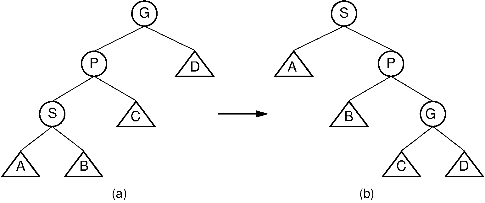

*Figure 7.3.3: Splay tree zigzig rotation.
(a) The original tree with $S$, $P$, and $G$ in
zigzig formation.
(b) The tree after the rotation takes place.
The positions of subtrees $A$, $B$, $C$, and
$D$ are altered as appropriate to maintain the BST
property.*

Note that zigzag rotations tend to make the tree more balanced,
because they bring subtrees $B$  and $C$ up one level
while moving subtree $D$ down one level.
The result is often a reduction of the tree’s height by one.
Zigzig promotions and single rotations do not typically reduce the
height of the tree; they merely bring the newly accessed record toward
the root.

Splaying node $S$ involves a series of double rotations until
$S$ reaches either the root or the child of the root.
Then, if necessary, a single rotation makes $S$ the root.
This process tends to re-balance the tree.
Regardless of balance, splaying will make frequently accessed nodes
stay near the top of the tree, resulting in reduced access cost.
Proof that the splay tree meets the guarantee of
$O(m \log n)$ is beyond the scope of our study.

**Example 7.3.1**

Consider a search for value 89 in the splay tree of
Figure [7.3.4](Splay.md#splayex) (a).
The splay tree’s search operation is identical to searching in
a BST.
However, once the value has been found, it is splayed to the root.
Three rotations are required in this example.
The first is a zigzig rotation, whose result is shown in
Figure [7.3.4](Splay.md#splayex) (b).
The second is a zigzag rotation, whose result is shown in
Figure [7.3.4](Splay.md#splayex) (c).
The final step is a single rotation resulting in the tree of
Figure [7.3.4](Splay.md#splayex) (d).
Notice that the splaying process has made the tree shallower.

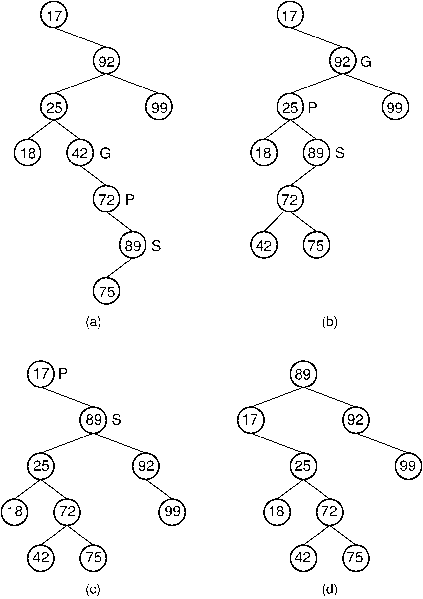

*Figure 7.3.4: Example of splaying after performing a search in a splay tree.
After finding the node with key value 89, that node is splayed to
the root by performing three rotations.
(a) The original splay tree.
(b) The result of performing a zigzig rotation on the node with
key value 89 in the tree of (a).
(c) The result of performing a zigzag rotation on the node with
key value 89 in the tree of (b).
(d) The result of performing a single rotation on the node with
key value 89 in the tree of (c).
If the search had been for 91, the search would have been
unsuccessful with the node storing key value 89 being that last one
visited.
In that case, the same splay operations would take place.*


---

# Chapter 8   General Trees


<a id="general-trees"></a>
# 8.1. General Trees

<a id="id1"></a>
## 8.1.1. General Trees

Many organizations are hierarchical in nature, such as the military
and most businesses.
Consider a company with a president and some number of vice presidents
who report to the president.
Each vice president has some number of direct subordinates, and so on.
If we wanted to model this company with a data structure,
it would be natural to think of the president
in the root node of a tree, the vice presidents at level 1, and their
subordinates at lower levels in the tree as we go
down the organizational hierarchy.

Because the number of vice presidents is likely to be more than two,
this company’s organization cannot easily be represented by a
binary tree.
We need instead to use a tree whose nodes have an arbitrary
number of children.
Unfortunately, when we permit trees to have nodes with an arbitrary
number of children, they become much harder to implement than binary
trees.
We consider such trees in this chapter.
To distinguish them from binary trees,
we use the term [general tree](Glossary.md#term-general-tree).

In this module we will examine general tree terminology and define a
basic ADT for general trees.

<a id="general-tree-definitions-and-terminology"></a>
### 8.1.1.1. General Tree Definitions and Terminology

A [tree](Glossary.md#term-tree) $\mathbf{T}$ is a finite set of one or more nodes
such that there is one designated node $R$, called the root
of $\mathbf{T}$.
If the set $(\mathbf{T} -\{R\})$ is not empty, these nodes are
partitioned into $n > 0$ disjoint sets $\mathbf{T}_0$,
$\mathbf{T}_1$, …, $\mathbf{T}_{n-1}$, each of which is
a tree, and whose roots $R_1, R_2, ..., R_n$,
respectively, are children of $R$.
The subsets $\mathbf{T}_i (0 \leq i < n)$ are said to be
[subtrees](Glossary.md#term-subtree) of $\mathbf{T}$.
These subtrees are ordered in that $\mathbf{T}_i$ is said to
come before $\mathbf{T}_j$ if $i < j$.
By convention, the subtrees are arranged from left to right with
subtree $\mathbf{T}_0$ called the leftmost child of $R$.
A node’s [out degree](Glossary.md#term-out-degree) is the number of children for that node.
A [forest](Glossary.md#term-forest) is a collection of one or more trees.
Figure [8.1.1](GenTreeIntro.md#gentreefig) presents further tree notation
generalized from the notation for binary trees.

Each node in a tree has precisely one parent, except for the root,
which has no parent.
From this observation, it immediately follows that a tree with
$n$ nodes must have $n-1$ edges because each node, aside
from the root, has one edge connecting that node to its parent.

<a id="an-adt-for-general-tree-nodes"></a>
### 8.1.1.2. An ADT for General Tree Nodes

Before discussing general tree implementations, we should first make
precise what operations such implementations must support.
Any implementation must be able to initialize a tree.
Given a tree, we need access to the root of that tree.
There must be some way to access the children of a node.
In the case of the ADT for binary tree nodes, this was done by
providing member functions that give explicit access to the left and
right child pointers.
Unfortunately, because we do not know in advance how many children a
given node will have in the general tree, we cannot give explicit
functions to access each child.
An alternative must be found that works for an unknown number of
children.

One choice would be to provide a function that takes as its parameter
the index for the desired child.
That combined with a function that returns the number of children for
a given node would support the ability to access any node or process
all children of a node.
Unfortunately, this view of access tends to bias the
choice for node implementations in favor of an array-based approach,
because these functions favor random access to a list of children.
In practice, an implementation based on a linked list is often
preferred.

An alternative is to provide access to the first (or leftmost) child
of a node, and to provide access to the next (or right) sibling of a
node.
Here are the class declarations for general trees and
their nodes.
Based on these two access functions, the children of a node can be
traversed like a list.
Trying to find the next sibling of the rightmost sibling would return
`null`.

```java
// General tree node ADT
interface GTNode {
  Object value();
  boolean isLeaf();
  GTNode parent();
  GTNode leftmostChild();
  GTNode rightSibling();
  void setValue(Object value);
  void setParent(GTNode par);
  void insertFirst(GTNode n);
  void insertNext(GTNode n);
  void removeFirst();
  void removeNext();
}

// General tree ADT
interface GenTree {
  void clear();      // Clear the tree
  GTNode root();     // Return the root
  // Make the tree have a new root, give first child and sib
  void newroot(Object value, GTNode first, GTNode sib);
  void newleftchild(E value); // Add left child
}
```

<a id="general-tree-traversals"></a>
### 8.1.1.3. General Tree Traversals

There are three traditional
[tree traversals](BinaryTreeTraversal.md#binarytreetraversal)
for [binary trees](Glossary.md#term-binary-tree):
[preorder](Glossary.md#term-preorder-traversal),
[postorder](Glossary.md#term-postorder-traversal),
and [inorder](Glossary.md#term-inorder-traversal).
For general trees, preorder and postorder traversals are defined with
meanings similar to their binary tree
counterparts.
Preorder traversal of a general tree first visits the root of the
tree, then performs a preorder traversal of each subtree from left to
right.
A postorder traversal of a general tree performs a postorder traversal
of the root’s subtrees from left to right, then visits the root.
Inorder traversal does not have a natural definition for the
general tree, because there is no particular number of children for an
internal node.
An arbitrary definition—such as visit the leftmost subtree in
inorder, then the root, then visit the remaining subtrees in inorder—can be invented.
However, inorder traversals are generally not useful with
general trees.

To perform a preorder traversal, it is necessary to visit each of the
children for a given node (say $R$) from left to right.
This is accomplished by starting at R’s leftmost child
(call it $T$).
From $T$, we can move to $T$’s right sibling, and then
to that node’s right sibling, and so on.

To perform a postorder traversal, it is necessary to visit the
children for a given node (say $R$) from left to right, but
contrary to the preorder traversal, all children are processed before
the parent.

Using the General Tree ADT show above, here is an
implementation to print the nodes of a general tree in
preorder.
Note the *while* loop at the end, which processes the list of
children by beginning with the leftmost child, then repeatedly moving
to the next child until calling `next` returns `null`.

```java
// Preorder traversal for general trees
static void preorder(GTNode rt) {
  PrintNode(rt);
  if (!rt.isLeaf()) {
    GTNode temp = rt.leftmostChild();
    while (temp != null) {
      preorder(temp);
      temp = temp.rightSibling();
    }
  }
}
```


<a id="union-find-and-the-parent-pointer-implementation"></a>
# 8.2. Union/Find and the Parent Pointer Implementation

<a id="the-union-find-problem"></a>
## 8.2.1. The Union/Find Problem

[General trees](Glossary.md#term-general-tree) are trees whose
[internal nodes](Glossary.md#term-internal-node) have no fixed number of
[children](Glossary.md#term-child).
Compared to general trees, [binary trees](Glossary.md#term-binary-tree) are
relatively easy to implement because each internal node of a binary
tree can just store two pointers to reach its (potential) children.
In a general tree, we have to deal with the fact that a given node
might have no children or few children or many children.

Even in a general tree, each node can have only one [parent](Glossary.md#term-parent).
If we didn’t need to go from a node to its children, but instead only
needed to go from a node to its parent, then implementing a node would
be easy.
A simple way to represent such a general tree would be to store for
each node only a pointer to that node’s parent.
We will call this the [parent pointer representation](Glossary.md#term-parent-pointer-representation) for
general trees.
Clearly this implementation is not general purpose, because it is
inadequate for such important operations as finding
the leftmost child or the right sibling for a node.
Thus, it may seem to be a poor idea to implement a general
tree in this way.
However, the parent pointer implementation stores precisely the
information required to answer the following, useful question:
**Given two nodes, are they in the same tree?**
To answer this question, we need only follow the series of parent
pointers from each node to its respective root.
If both nodes reach the same root, then they must be in the same tree.
If the roots are different, then the two nodes are not in the same
tree.
The process of finding the ultimate root for a given node we will call
[FIND](Glossary.md#term-find).

<a id="parent-pointer-trees"></a>
### 8.2.1.1. Parent Pointer Trees

The parent pointer representation is most often used to maintain a
collection of [disjoint sets](Glossary.md#term-disjoint-sets).
Two disjoint sets share no members in common (their intersection is
empty).
A collection of disjoint sets partitions some objects
such that every object is in exactly one of the disjoint sets.
There are two basic operations that we wish to support:

1. Determine if two objects are in the same set (the FIND operation), and
1. Merge two sets together.

Because two merged sets are united, the merging operation is
called [UNION](Glossary.md#term-union) and the whole process of determining if two
objects are in the same set and then merging the sets goes by the name
[UNION/FIND](Glossary.md#term-union-find).

To implement UNION/FIND, we represent each disjoint set with a
separate general tree.
Two objects are in the same disjoint set if they are in the same tree.
Every node of the tree (except for the root) has precisely one parent.
Thus, each node requires the same space to represent it.
The collection of objects is typically stored in an array, where each
element of the array corresponds to one object, and each element
stores the object’s value (or a pointer to the object).
The objects also correspond to nodes in the various disjoint trees
(one tree for each disjoint set), so we also store the parent value
with each object in the array.
Those nodes that are the roots of their respective trees store an
appropriate indicator.
Note that this representation means that a single array is being used
to implement a collection of trees.
This makes it easy to merge trees together with UNION operations.

Here is an implementation for parent pointer trees and the UNION/FIND
process.

```java
// General Tree implementation for UNION/FIND
class ParPtrTree {
  private int[] array;     // Node array

  ParPtrTree(int size) {
    array = new int[size]; // Create node array
    for (int i=0; i<size; i++)
      array[i] = -1;       // Each node is its own root to start
  }

  // Merge two subtrees if they are different
  void UNION(int a, int b) {
    int root1 = FIND(a);     // Find root of node a
    int root2 = FIND(b);     // Find root of node b
    if (root1 != root2)          // Merge two trees
      array[root1] = root2;
  }

  // Return the root of curr's tree
  int FIND(int curr) {
    while (array[curr] != -1)
      curr = array[curr];
    return curr; // Now at root
  }
}
```

The `ParPtrTree` class has an array where each array position
corresponds to one object in some collection.
Each array element stores the array index for its parent.
There are two main methods to implement.
Method `UNION` merges two sets together, where each set corresponds
to a tree.
Method `FIND` is used to find the ultimate root for a node.

An application using the UNION/FIND operations
should store a set of $n$ objects, where each object is assigned
a unique index in the range 0 to $n-1$.
The indices refer to the corresponding parent pointers in the array.
Class `ParPtrTree` creates and initializes the
UNION/FIND array, and methods `UNION` and
`FIND` take array indices as inputs.

<a id="equivalence-classes"></a>
### 8.2.1.2. Equivalence Classes

Consider the problem of assigning the members of a set to
disjoint subsets called
[equivalence classes](Glossary.md#term-equivalence-class).
Recall that an
[equivalence relation](SetDef.md#setdef) is
[reflexive](Glossary.md#term-reflexive), [symmetric](Glossary.md#term-symmetric), and [transitive](Glossary.md#term-transitive).
Thus, if objects $A$ and $B$ are equivalent, and objects
$B$ and $C$ are equivalent, then we must be able to recognize
that objects $A$ and $C$ are also equivalent.
In this representation, since $A$ and $B$ are equivalent,
they must be in the same tree.
Likewise for $B$ and $C$.
We can recognize that $A$ and $C$ are equivalent because
they must also be in the same tree.

There are many practical uses for disjoint sets and representing
equivalences.
For example, consider this graph of ten nodes labeled $A$ through
$J$.

Notice that for nodes $A$ through $I$, there is some
series of edges that connects any pair of these nodes, but node
$J$ is disconnected from the rest of the nodes.
Such a graph might be used to represent connections such as wires
between components on a circuit board, or roads between cities.
We can consider two nodes of the graph to be equivalent if there is a
path between them.
Thus, nodes $A$, $H$, and $E$ would
be considered as equivalent, but $J$ is not
equivalent to any other.
A subset of equivalent (connected) edges in a graph is called a
[connected component](Glossary.md#term-connected-component).
The goal is to quickly classify the objects
into disjoint sets that correspond to the connected components.

Another use for UNION/FIND occurs in [Kruskal’s algorithm](Glossary.md#term-kruskal-s-algorithm) for
computing the
[minimal-cost spanning tree](MCST.md#mcst)
for a [graph](Glossary.md#term-graph).
That algorithm seeks to select the cheapest subset of the edges that
still connects all of the nodes in the graph.
It does so by processing all edges of the graph from shortest to
longest, only adding an edge to the connecting subset if it does not
connect two nodes that already have some series of edges connecting
them.

The input to the UNION/FIND algorithm is typically  a series of
equivalence pairs.
In the case of the connected components example, the equivalence pairs
would simply be the set of edges in the graph.
An equivalence pair might say that object $C$ is equivalent to
object $A$.
If so, $C$ and $A$ are placed in the same subset.
If a later equivalence relates $A$ and $B$, then
by implication $C$ is also equivalent to $B$.
Thus, an equivalence pair may cause two subsets to merge, each of
which contains several objects.

Equivalence classes can be managed efficiently with the UNION/FIND
algorithm.
Initially, each object is at the root of its own tree.
An equivalence pair is processed by checking to see if both objects
of the pair are in the same tree by calling  `FIND` on each of them.
If their roots are the same, then no change need be made because the
objects are already in the same equivalence class.
Otherwise, the two equivalence classes should be merged by the
`UNION` method.

The parent pointer representation places no limit on the number of
nodes that can share a parent.
To make equivalence processing as efficient as possible,
the distance from each node to the root of its respective tree should
be as small as possible.
Thus, we would like to keep the height of the trees small when merging
two equivalence classes together.
Ideally, each tree would have all nodes pointing directly to the root.
Achieving this goal all the time would require too much additional
processing to be worth the effort, so we must settle for getting as
close as possible.

<a id="weighted-union"></a>
### 8.2.1.3. Weighted Union

A low-cost approach to reducing the height is to be smart about how
two trees are joined together.
One simple technique, called the
[weighted union rule](Glossary.md#term-weighted-union-rule),
joins the tree with fewer nodes to the tree with more nodes by making
the smaller tree’s root point to the root of the bigger tree.
This will limit the total depth of the tree to $O(\log n)$,
because the depth of nodes only in the smaller tree will now increase
by one, and the depth of the deepest node in the combined tree can
only be at most one deeper than the deepest node before the trees were
combined.
The total number of nodes in the combined tree is therefore at least
twice the number in the smaller subtree.
Thus, the depth of any node can be increased at most $\log n$
times when $n$ equivalences are processed
(since each addition to the depth must be accompanied by at least
doubling the size of the tree).

Here is an implementation for the UNION method when using weighted
union.

```java
  void UNION(int a, int b) {
    int root1 = FIND(a);     // Find root of node a
    int root2 = FIND(b);     // Find root of node b
    if (root1 != root2)          // Merge with weighted union
      if (weights[root2] > weights[root1]) {
        array[root1] = root2;
        weights[root2] += weights[root1];
      } else {
        array[root2] = root1;
        weights[root1] += weights[root2];
      }
  }
```

The following slideshow illustrates a series of UNION operations with
weighted union.

<a id="path-compression"></a>
### 8.2.1.4. Path Compression

The weighted union rule helps to minimize the depth of the tree, but
we can do better than this.
[Path compression](Glossary.md#term-path-compression) is a method that tends to
create extremely shallow trees.
Path compression takes place while finding the root
for a given node $X$.
Call this root $R$.
Path compression resets the parent of every node on the path from
$X$ to $R$ to point directly to $R$.
This can be implemented by first finding $R$.
A second pass is then made along the path from $X$ to $R$,
assigning the parent field of each node encountered to $R$.
Alternatively, a recursive algorithm can be implemented as follows.
This version of `FIND` not only returns the root of the
current node, but also makes all ancestors of the current node point
to the root.

```java
  // Return the root of curr's tree with path compression
  int FIND(int curr) {
    if (array[curr] == -1) return curr; // At root
    array[curr] = FIND(array[curr]);
    return array[curr];
  }
```

The following slide show illustrates path compression using the last
step in the previous example.

Path compression keeps the cost of each FIND operation very
close to constant.

To be more precise about what is meant by “very close to constant”,
the cost of path compression for $n$ FIND operations on
$n$ nodes (when combined with the weighted union rule for
joining sets) is approximately
$\Theta(n \log^* n)$.
The notation $\log^* n$ means the number of times that
the log of $n$ must be taken before $n \leq 1$.
For example, $\log^* 65536$ is 4 because
$\log 65536 = 16, \log 16 = 4, \log 4 = 2$, and finally
$\log 2 = 1$.
Thus, $\log^* n$ grows *very* slowly, so the cost for a series
of $n$ FIND operations is very close to $n$.

Note that this does not mean that the tree resulting from
processing $n$ equivalence pairs necessarily has depth
$\Theta(\log^* n)$.
One can devise a series of equivalence operations that yields
$\Theta(\log n)$ depth for the resulting tree.
However, many of the equivalences in such a series will look only at
the roots of the trees being merged, requiring little processing time.
The *total* amount of processing time required for $n$
operations will be $\Theta(n \log^* n)$,
yielding nearly constant time for each equivalence operation.
This is an example of
[amortized analysis](AmortAnal.md#amortanal).

The expression $\log^* n$ is closely related to the inverse of
Ackermann’s function.
For more information about Ackermann’s function and the cost of path
compression for UNION/FIND, see [Tarjan75].
The survey article by Galil &amp; Italiano [GalilItaliano91]
covers many aspects of the equivalence class problem.


<a id="sequential-tree-representations"></a>
# 8.3. Sequential Tree Representations

<a id="id1"></a>
## 8.3.1. Sequential Tree Representations

Next we consider a fundamentally different approach to implementing
trees.
The goal is to store a series of node values with the minimum
information needed to reconstruct the tree structure.
This approach, known as a [sequential tree representation](Glossary.md#term-sequential-tree-representation), has
the advantage of saving space because no pointers are stored.
It has the disadvantage that accessing any node in the tree requires
sequentially processing all nodes that appear before
it in the node list.
In other words, node access must start at the beginning of the node
list, processing nodes sequentially in whatever order they are stored
until the desired node is reached.
Thus, one primary virtue of the other implementations discussed in
this section is lost: efficient access
(typically $\Theta(\log n)$ time) to arbitrary nodes in the
tree.
Sequential tree implementations are ideal for archiving trees on disk
for later use because they save space, and the tree structure can
be reconstructed as needed for later processing.

Sequential tree implementations can be used to
[serialize](Glossary.md#term-serialization) a tree structure.
Serialization is the process of storing an object as a series of
bytes, typically so that the data structure can be transmitted between
computers.
This capability is important when using data structures in a
distributed processing environment.

A sequential tree implementation typically stores the node values as
they would be enumerated by a preorder
traversal, along with sufficient information to describe the tree’s
shape.
If the tree has restricted form, for example if it is a full binary
tree, then less information about structure typically needs to be
stored.
A general tree, because it has the most flexible shape, tends to require
the most additional shape information.
There are many possible sequential tree implementation schemes.
We will begin by describing methods appropriate to binary trees,
then generalize to an implementation appropriate to a general tree
structure.

Because every node of a binary tree is either a leaf or has two
(possibly empty) children, we can take advantage of this fact to
implicitly represent the tree’s structure.
The most straightforward sequential tree implementation lists every
node value as it would be enumerated by a preorder traversal.
Unfortunately, the node values alone do not provide enough information
to recover the shape of the tree.
In particular, as we read the series of node values, we do not
know when a leaf node has been reached.
However, we can treat all non-empty nodes as internal nodes with two
(possibly empty) children.
Only NULL values will be interpreted as leaf nodes, and these can be
listed explicitly.
Such an augmented node list provides enough information to recover
the tree structure.

<a id="alternative-sequential-representation"></a>
## 8.3.2. Alternative Sequential Representation

To illustrate the difficulty involved in using the sequential tree
representation for processing, consider searching for the right child
of the root node.
We must first move sequentially through the node list of the left
subtree.
Only at this point do we reach the value of the root’s right child.
Clearly the sequential representation is space efficient, but not time
efficient for descending through the tree along some arbitrary path.

Assume that each node value takes a constant amount of space.
An example would be if the node value is a positive integer and
`null` is indicated by the value zero.
From the
[Full Binary Tree Theorem](BinaryTreeFullThm.md#binarytreefullthm),
we know that the size of the node list will be about twice the number
of nodes (i.e., the overhead fraction is 1/2).
The extra space is required by the `null` pointers.
We should be able to store the node list more compactly.
However, any sequential implementation must recognize when a leaf node
has been reached, that is, a leaf node indicates the end of a subtree.
One way to do this is to explicitly list with each node whether it is
an internal node or a leaf.
If a node $X$ is an internal node, then we know that its two
children (which may be subtrees) immediately follow $X$ in the
node list.
If $X$ is a leaf node, then the next node in the list is the
right child of some ancestor of $X$, not the right child
of $X$.
In particular, the next node will be the child of $X$ ‘s most
recent ancestor that has not yet seen its right child.
However, this assumes that each internal node does in fact have two
children, in other words, that the tree is
full.
Empty children must be indicated in the node list explicitly.
Assume that internal nodes are marked with a prime (’) and that
leaf nodes show no mark.
Empty children of internal nodes are indicated by “/”, but the (empty)
children of leaf nodes are not represented at all.
Note that a full binary tree stores no `null` values with this
implementation, and so requires less overhead.

Storing $n$ extra bits can be a considerable savings over
storing $n$ `null` values.
In the example above, each node was shown with a
mark if it is internal, or no mark if it is a leaf.
This requires that each node value has space to store the mark bit.
This might be true if, for example, the node value were stored as a
4-byte integer but the range of the values sored was small enough so
that not all bits are used.
An example would be if all node values must be positive.
Then the high-order (sign) bit of the integer value could be used as
the mark bit.

<a id="bit-vector-representation"></a>
## 8.3.3. Bit Vector Representation

Another approach is to store a separate bit vector to represent the
status of each node.
In this case, each node of the tree corresponds to one bit in the bit
vector.
A value of “1” could indicate an internal node, and “0” could indicate
a leaf node.

<a id="general-tree-sequential-representation"></a>
## 8.3.4. General Tree Sequential Representation

Storing general trees by means of a sequential implementation requires
that more explicit structural information be included with the node
list.
Not only must the general tree implementation indicate whether a node
is leaf or internal, it must also indicate how many children the
node has.
Alternatively, the implementation can indicate when a node’s child
list has come to an end.
The next example dispenses with marks for internal or leaf nodes.
Instead it includes a special mark (we will use the “)” symbol) to
indicate the end of a child list.
All leaf nodes are followed by a “)” symbol because they have no
children.
A leaf node that is also the last child for its parent would indicate
this by two or more successive “)” symbols.

Note that this representation for serializing general trees cannot be
used for binary trees.
This is because a binary tree is not merely a restricted form of
general tree with at most two children.
Every binary tree node has a left and a right child, though either or
both might be empty.
So this representation cannot let us distinguish whether node
$D$ in Figure [8.3.1](SequentialRep.md#binexampb) is the left or right
child of node $B$.


---

# Chapter 9   Indexing


<a id="indexing-chapter-introduction"></a>
# 9.1. Indexing Chapter Introduction

Many large-scale computing applications are centered around data sets
that are too large to fit into main memory.
The classic example is a large database of records with multiple
search keys, requiring the ability to insert, delete, and search for
records.
Hashing provides outstanding performance for such
situations, but only in the limited case in which all searches are of
the form “find the record with key value $K$”.
Many applications require more general search capabilities.
One example is a range query
search for all records whose key lies within some range.
Other queries might involve visiting all records in order of their key
value, or finding the record with the greatest key value.
Hash tables are not organized to support any of these queries
efficiently.

This chapter introduces file structures used to organize a large
collection of records stored on disk.
Such file structures support efficient insertion,
deletion, and search operations, for exact-match queries, range
queries, and largest/smallest key value searches.

Before discussing such file structures, we must become familiar
with some basic file-processing terminology.
An [entry-sequenced file](Glossary.md#term-entry-sequenced-file)
stores records in the order that they were added to the file.
Entry-sequenced files are the disk-based equivalent to an unsorted
list and so do not support efficient search.
The natural solution is to sort the records by order of the search key.
However, a typical database, such as a collection of employee or
customer records maintained by a business, might contain multiple
search keys.
To answer a question about a particular customer might require a
search on the name of the customer.
Businesses often wish to sort and output the records by
zip code order for a bulk mailing.
Government paperwork might require the ability to search by
Social Security number.
Thus, there might not be a single “correct” order in which to store
the records.

[Indexing](Glossary.md#term-indexing) is the process of associating a key with the location
of a corresponding data record.
An [external sort](Glossary.md#term-external-sort) typically uses
the concept of a key sort, in which an [index file](Glossary.md#term-index-file) is created whose
records consist of key/pointer pairs.
Here, each key is associated with a pointer to a complete record in
the main database file.
The index file could be sorted or organized using a tree structure,
thereby imposing a logical order on the records without
physically rearranging them.
One database might have several associated index files,
each supporting efficient access through a different key field.

Each record of a database normally has a unique identifier,
called the [primary key](Glossary.md#term-primary-key).
For example, the primary key for a set of personnel records might be
the Social Security number or ID number for the individual.
Unfortunately, the ID number is generally an inconvenient value on
which to perform a search because the searcher is unlikely to know it.
Instead, the searcher might know the desired employee’s name.
Alternatively, the searcher might be interested in finding all
employees whose salary is in a certain range.
If these are typical search requests to the database, then the name
and salary fields deserve separate indices.
However, key values in the name and salary indices are not likely to
be unique.

A key field such as salary, where a particular key value might be
duplicated in multiple records, is called a
[secondary key](Glossary.md#term-secondary-key).
Most searches are performed using a secondary key.
The [secondary key index](Glossary.md#term-secondary-key-index) (or more simply, [secondary index](Glossary.md#term-secondary-index))
will associate a secondary key value with the primary key of each
record having that secondary key value.
At this point, the full database might be searched directly for the
record with that primary key, or there might be a [primary key index](Glossary.md#term-primary-key-index)
(or [primary index](Glossary.md#term-primary-index))
that relates each primary key value with a pointer to the
actual record on disk.
In the latter case, only the primary index provides the
location of the actual record on disk, while the secondary indices
refer to the primary index.

Indexing is an important technique for organizing large databases,
and many indexing methods have been developed.
Direct access through hashing is discussed in
Chapter [Hashing](HashIntro.md).
A simple list sorted by key
value can also serve as an index to the record file.
Indexing disk files by sorted lists are discussed in the following
section.
Unfortunately, a sorted list does not perform well for insert
and delete operations.

A third approach to indexing is the tree index.
Trees are typically used to organize large databases that must support
record insertion, deletion, and
key range searches.
[ISAM](ISAM.md#isam) was a
a tentative step toward solving the problem of storing a large
database that must support insertion and deletion of records.
Its shortcomings help to illustrate the value of tree indexing
techniques.
Module [TreeIndexing](TreeIndexing.md#treeindexing)
introduces the basic issues related to tree indexing.
Module [2-3 tree](TwoThreeTree.md#twothreetree) introduces the 2-3
tree, a balanced tree structure that is a simple form of the
[B-tree](BTree.md#btree).
B-trees are the most widely used indexing method for large disk-based
databases, and for implementing file systems.


<a id="linear-indexing"></a>
# 9.2. Linear Indexing

<a id="id1"></a>
## 9.2.1. Linear Indexing

A [linear index](Glossary.md#term-linear-index) is an [index file](Glossary.md#term-index-file) organized as a
sequence of [key-value pairs](Glossary.md#term-key-value-pair) where the
[keys](Glossary.md#term-key) are in sorted order and the pointers either
(1) point to the position of the complete record on disk,
(2) point to the position of the [primary key](Glossary.md#term-primary-key) in the primary
index, or
(3) are actually the value of the primary key.
Depending on its size, a linear index might be stored in main
memory or on disk.
A linear index provides a number of advantages.
It provides convenient access to variable-length database records,
because each entry in the index file contains a fixed-length key field
and a fixed-length pointer to the beginning of a (variable-length)
record as shown in the following slideshow
A linear index also allows for efficient search and random access to
database records, because it is amenable to
[binary search](Glossary.md#term-binary-search).

If the database contains enough records, the linear index might
be too large to store in [main memory](Glossary.md#term-main-memory).
This makes binary search of the index more expensive because many
[disk accesses](Glossary.md#term-disk-access) would typically be required by the
search process.
One solution to this problem is to store a second-level linear index
in main memory that indicates which disk block in the index file
stores a desired key.
For example, the linear index on disk might reside in a series of
1024-byte blocks.
If each key/pointer pair in the linear index requires 8~bytes
(a 4-byte key and a 4-byte pointer), then
128 key/pointer pairs are stored per block.
The second-level index, stored in main memory, consists of a simple
table storing the value of the key in the first position of each block
in the linear index file.
This arrangement is shown in the next slideshow.
If the linear index requires 1024 disk blocks (1MB), the second-level
index contains only 1024 entries, one per disk block.

To find which disk block contains a desired search key value,
first search through the 1024-entry table to
find the greatest value less than or equal to the search key.
This directs the search to the proper block in the index file, which
is then read into memory.
At this point, a binary search within this block
will produce a pointer to the actual record in the database.
Because the second-level index is stored in main memory,
accessing a record by this method requires two disk reads:
one from the index file and one from the database file for the actual
record.

A simple two-level linear index.
The linear index is stored on disk.
The smaller, second-level index is stored in main memory.
Each element in the second-level index stores the first key value in
the corresponding disk block of the index file.
In this example, the first disk block of the linear index stores keys
in the range 1 to 2001, and the second disk block stores keys in the
range 2003 to 5688.
Thus, the first entry of the second-level index is key value 1
(the first key in the first block of the linear index), while the
second entry of the second-level index is key value 2003.

Every time a record is inserted to or deleted from the database,
all associated secondary indices must be updated.
Updates to a linear index are expensive, because the
entire contents of the array might be shifted.
Another problem is that multiple records with
the same secondary key each duplicate that key value within the
index.
When the secondary key field has many duplicates, such as when it has
a limited range (e.g., a field to indicate job category from among a
small number of possible job categories),
this duplication might waste considerable space.

One improvement on the simple sorted array is a two-dimensional
array where each row corresponds to a secondary key value.
A row contains the primary keys whose records have the indicated
secondary key value.
Figure [9.2.1](LinearIndexing.md#twodarray) illustrates this approach.
Now there is no duplication of secondary key values,
possibly yielding a considerable space savings.
The cost of insertion and deletion is reduced, because only one row
of the table need be adjusted.
Note that a new row is added to the array when a new secondary key
value is added.
This might lead to moving many records, but this will happen
infrequently in applications suited to using this arrangement.

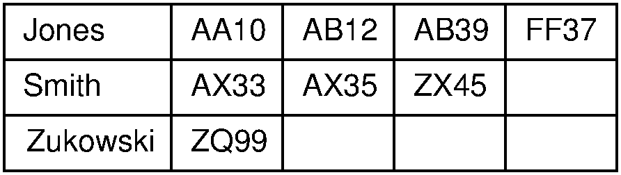

*Figure 9.2.1: A two-dimensional linear index.
Each row lists the primary keys associated with a particular
secondary key value.
In this example, the secondary key is a name.
The primary key is a unique four-character code.*

A drawback to this approach is that the array must be of fixed
size, which imposes an upper limit on the number of primary keys
that might be associated with a particular secondary key.
Furthermore, those secondary keys with fewer records than the width
of the array will waste the remainder of their row.
A better approach is to have a one-dimensional array of secondary key
values, where each secondary key is associated with a linked
list.
This works well if the index is stored in main memory, but not so
well when it is stored on disk because the linked list for a given key
might be scattered across several disk blocks.

Consider a large database of employee records.
If the primary key is the employee’s ID number and the secondary key
is the employee’s name, then each record in the name index associates a
name with one or more ID numbers.
The ID number index in turn associates an ID number with a unique
pointer to the full record on disk.
The secondary key index in such an organization is also known as an
[inverted list](Glossary.md#term-inverted-list) or [inverted file](Glossary.md#term-inverted-file).
It is inverted in that searches work backwards from the
secondary key to the primary key to the actual data record.
It is called a list because each secondary key value
has (conceptually) a list of primary keys associated with it.
Figure [9.2.2](LinearIndexing.md#inverted) illustrates this arrangement.
Here, we have last names as the secondary key.
The primary key is a four-character unique identifier.

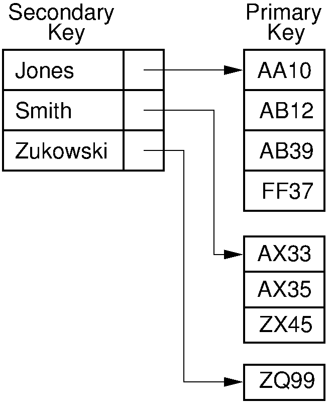

*Figure 9.2.2: Illustration of an inverted list.
Each secondary key value is stored in the secondary key list.
Each secondary key value on the list has a pointer to a list of the
primary keys whose associated records have that secondary key
value.*

Figure [9.2.3](LinearIndexing.md#invlist) shows a better approach to storing inverted
lists.
An array of secondary key values is shown as before.
Associated with each secondary key is a pointer to an array of primary
keys.
The primary key array uses a linked-list implementation.
This approach combines the storage for all of the secondary key lists
into a single array, probably saving space.
Each record in this array consists of a primary key value and a
pointer to the next element on the list.
It is easy to insert and delete secondary keys from this array, making
this a good implementation for disk-based inverted files.

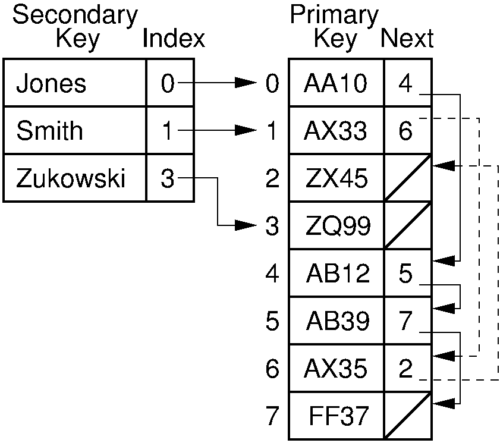

*Figure 9.2.3: An inverted list implemented as an array of secondary keys and
combined lists of primary keys.
Each record in the secondary key array contains a pointer to a record
in the primary key array.
The `next` field of the primary key array indicates the next
record with that secondary key value.*


<a id="id1"></a>
# 9.3. ISAM

How do we handle large databases that require frequent update?
The main problem with the linear index is that it is a single, large
array that does not adjust well to updates because a single update can
require changing the position of every key in the index.
Inverted lists reduce this problem, but they are only suitable for
secondary key indices with many fewer secondary key values than records.
The linear index would perform well as a primary key index if it could
somehow be broken into pieces such that individual updates affect only
a part of the index.
This concept will be pursued throughout the rest of this chapter,
eventually culminating in the
$\mathrm{B}^+$ Tree
the most widely used indexing method today.
But first, we begin by studying ISAM, an early attempt to solve the
problem of large databases requiring frequent update.
Its weaknesses help to illustrate why the $\mathrm{B}^+$ Tree
works so well.

Before the invention of effective tree indexing
schemes, a variety of disk-based indexing methods were in use.
All were rather cumbersome, largely because no adequate method for
handling updates was known.
Typically, updates would cause the index to degrade in performance.
ISAM is one example of such an index and was
widely used by IBM prior to adoption of the B-tree.

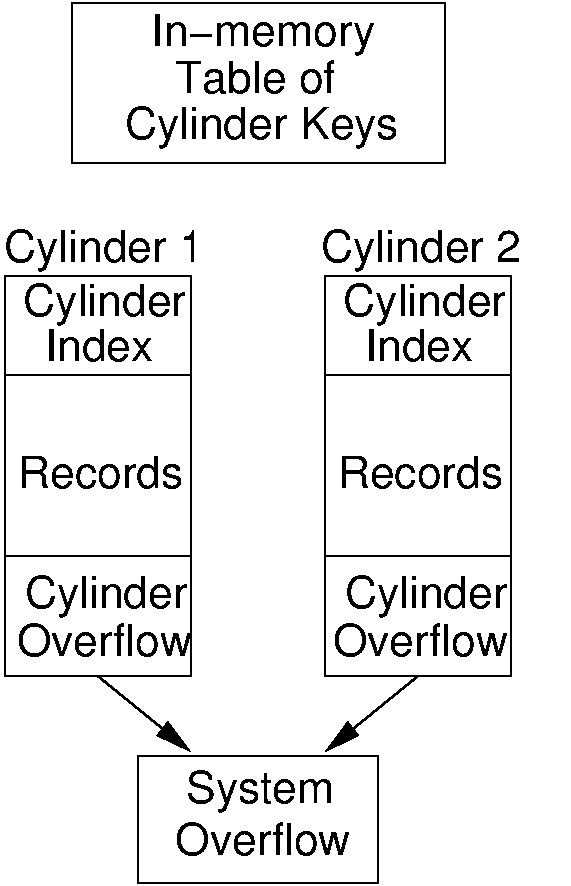

*Figure 9.3.1: Illustration of the ISAM indexing system.*

ISAM is based on a modified form of the [linear index](Glossary.md#term-linear-index), as
illustrated by Figure [9.3.1](ISAM.md#isamfig).
Records are stored in sorted order by primary key.
The disk file is divided among a number of
[cylinders](Glossary.md#term-cylinder) on disk.
Each cylinder holds a section of the list in sorted order.
Initially, each cylinder is not filled to capacity, and the extra
space is set aside in the [cylinder overflow](Glossary.md#term-cylinder-overflow).
In memory is a table listing the lowest key value stored in each
cylinder of the file.
Each cylinder contains a table listing the lowest key value for
each block in that cylinder, called the [cylinder index](Glossary.md#term-cylinder-index).
When new records are inserted, they are placed in the correct
cylinder’s overflow area (in effect, a cylinder acts as a bucket).
If a cylinder’s overflow area fills completely, then a system-wide
overflow area is used.
Search proceeds by determining the proper cylinder from the
system-wide table kept in main memory.
The cylinder’s block table is brought in from disk and
consulted to determine the correct block.
If the record is found in that block, then the search is complete.
Otherwise, the cylinder’s overflow area is searched.
If that is full, and the record is not found, then the system-wide
overflow is searched.

After initial construction of the database,
so long as no new records are inserted or deleted, access is
efficient because it requires only two disk fetches.
The first disk fetch recovers the block table for the desired
cylinder.
The second disk fetch recovers the block that, under good conditions,
contains the record.
After many inserts, the overflow list becomes too long, resulting in
significant search time as the cylinder overflow area fills up.
Under extreme conditions, many searches might eventually lead to the
system overflow area.
The “solution” to this problem is to periodically reorganize the
entire database.
This means re-balancing the records among the cylinders, sorting
the records within each cylinder, and updating both the system
index table and the within-cylinder block table.
Such reorganization was typical of database systems during the 1960s
and would normally be done each night or weekly.


<a id="tree-based-indexing"></a>
# 9.4. Tree-based Indexing

<a id="id1"></a>
## 9.4.1. Tree-based Indexing

Linear indexing is efficient when the database is static,
that is, when records are inserted and deleted rarely or never.
ISAM is adequate for a limited number of updates, but not for frequent
changes.
Because it has essentially two levels of indexing, ISAM will also break
down for a truly large database where the number of cylinders is too
great for the top-level index to fit in main memory.

In their most general form, database applications have the following
characteristics:

1. Large sets of records that are frequently updated.
1. Search is by one or a combination of several keys.
1. Key range queries or min/max queries are used.

For such databases, a better organization must be found.
One approach would be to use the binary search tree (BST) to store
primary and secondary key indices.
BSTs can store duplicate key values, they provide efficient insertion
and deletion as well as efficient search, and they can perform
efficient range queries.
When there is enough main memory, the BST is a viable
option for implementing both primary and secondary key indices.

Unfortunately, the BST can become unbalanced.
Even under relatively good conditions, the depth of leaf nodes
can easily vary by a factor of two.
This might not be a significant concern when the tree is stored in
main memory because the time required is still $\Theta(\log n)$
for search and update.
When the tree is stored on disk, however, the depth of nodes in the
tree becomes crucial.
Every time a BST node $B$ is visited, it is necessary to visit
all nodes along the path from the root to $B$.
Each node on this path must be retrieved from disk.
Each disk access returns a block of information.
If a node is on the same block as its parent, then the cost to find
that node is trivial once its parent is in main memory.
Thus, it is desirable to keep subtrees together on the same
block.
Unfortunately, many times a node is not on the same block as its
parent.
Thus, each access to a BST node could potentially require that another
block to be read from disk.
Using a buffer pool to store multiple blocks in
memory can mitigate disk access problems if BST accesses display good
locality of reference.
But a buffer pool cannot eliminate disk I/O entirely.
The problem becomes greater if the BST is unbalanced, because nodes deep
in the tree have the potential of causing many disk blocks to be read.
Thus, there are two significant issues that must be addressed
to have efficient search from a disk-based BST.
The first is how to keep the tree balanced.
The second is how to arrange the nodes on blocks so as to keep the
number of blocks encountered on any path from the root to the leaves at
a minimum.

We could select a scheme for balancing the BST and allocating BST
nodes to blocks in a way that minimizes disk I/O, as illustrated by
the first slideshow.
However, maintaining such a scheme in the face of insertions and
deletions is difficult.
In particular, the tree should remain balanced when an update takes
place, but doing so might require much reorganization.
Each update should affect only a few blocks, or its cost will be
too high.

As you can see from this slideshow,
adopting a rule such as requiring the BST to be complete can cause a
great deal of rearranging of data within the tree.

We can solve these problems by selecting another tree structure that
automatically remains balanced after updates, and which is amenable
to storing in blocks.
There are a number of balanced tree data structures, and
there are also techniques for keeping BSTs balanced.
Examples are the AVL and splay trees.
As an alternative,
the [2-3 Tree](TwoThreeTree.md#twothreetree) has the property that its leaves
are always at the same level.
The main reason for discussing the 2-3 Tree here in preference to the
other balanced search trees is that it naturally
leads to the [B-tree](BTree.md#btree), which is by far the
most widely used indexing method today.


<a id="trees"></a>
# 9.5. 2-3 Trees

<a id="id1"></a>
## 9.5.1. 2-3 Trees

This section presents a data structure called the 2-3 tree.
The 2-3 tree is not a binary tree, but instead its shape
obeys the following definition:

1. A node contains one or two keys.
1. Every internal node has either two children (if it contains one key)
or three children (if it contains two keys).  Hence the name.
1. All leaves are at the same level in the tree, so
the tree is always height balanced.

In addition to these shape properties, the 2-3 tree has a search tree
property analogous to that of a BST.
For every node, the values of all descendants in the left subtree are
less than the value of the first key, while values in the center
subtree are greater than or equal to the value of the first key.
If there is a right subtree (equivalently, if the node stores two
keys), then the values of all descendants in the center subtree are
less than the value of the second key, while values in the right
subtree are greater than or equal to the value of the second key.
To maintain these shape and search properties requires that special
action be taken when nodes are inserted and deleted.
The 2-3 tree has the advantage over the BST in that the 2-3 tree can
be kept height balanced at relatively low cost.
Here is an example 2-3 tree.

Nodes are shown as rectangular boxes with two key fields.
(These nodes actually would contain complete records or pointers to
complete records, but the figures will show only the keys.)
Internal nodes with only two children have an empty right key field.
Leaf nodes might contain either one or two keys.
Here is an implementation for the 2-3 tree node class.

```java
// 2-3 tree node implementation
class TTNode<Key extends Comparable<? super Key>,E> {
  private E lval;        // The left record
  private Key lkey;        // The node's left key
  private E rval;        // The right record
  private Key rkey;        // The node's right key
  private TTNode<Key,E> left;   // Pointer to left child
  private TTNode<Key,E> center; // Pointer to middle child
  private TTNode<Key,E> right;  // Pointer to right child

  public TTNode() { center = left = right = null; }
  public TTNode(Key lk, E lv, Key rk, E rv,
                TTNode<Key,E> p1, TTNode<Key,E> p2,
                TTNode<Key,E> p3) {
    lkey = lk; rkey = rk;
    lval = lv; rval = rv;
    left = p1; center = p2; right = p3;
  }

  public boolean isLeaf() { return left == null; }
  public TTNode<Key,E> lchild() { return left; }
  public TTNode<Key,E> rchild() { return right; }
  public TTNode<Key,E> cchild() { return center; }
  public Key lkey() { return lkey; }  // Left key
  public E lval() { return lval; }  // Left value
  public Key rkey() { return rkey; }  // Right key
  public E rval() { return rval; }  // Right value
  public void setLeft(Key k, E e) { lkey = k; lval = e; }
  public void setRight(Key k, E e) { rkey = k; rval = e; }
  public void setLeftChild(TTNode<Key,E> it) { left = it; }
  public void setCenterChild(TTNode<Key,E> it)
    { center = it; }
  public void setRightChild(TTNode<Key,E> it)
    { right = it; }
}
```

Note that this sample declaration does not distinguish
between leaf and internal nodes and so is space inefficient, because
leaf nodes store three pointers each.
We can use a [class hierarcy](BinaryTreeImpl.md#binarytreeimpl)
to implement separate internal and leaf node types.

From the defining rules for 2-3 trees we can derive relationships
between the number of nodes in the tree and the depth of the tree.
A 2-3 tree of height $k$ has at least $2^{k-1}$ leaves,
because if every internal node has two children it degenerates to the
shape of a complete binary tree.
A 2-3 tree of height $k$ has at most $3^{k-1}$ leaves,
because each internal node can have at most three children.

Searching for a value in a 2-3 tree is similar to searching in a BST.
Search begins at the root.
If the root does not contain the search key $K$, then the search
progresses to the only subtree that can possibly contain $K$.
The value(s) stored in the root node determine which is the correct
subtree.
For example, if searching for the value 30 in the tree of
Figure [9.5.1](TwoThreeTree.md#ttexamp), we begin with the root node.
Because 30 is between 18 and 33, it can only be in the middle
subtree.
Searching the middle child of the root node yields the desired
record.
If searching for 15, then the first step is again to search the root
node.
Because 15 is less than 18, the first (left) branch is taken.
At the next level, we take the second branch to the leaf node
containing 15.
If the search key were 16, then upon encountering the leaf
containing 15 we would find that the search key is not in the tree.
Here is an implementation for the 2-3 tree search method.

```java
private E findhelp(TTNode<Key,E> root, Key k) {
  if (root == null) return null;          // val not found
  if (k.compareTo(root.lkey()) == 0) return root.lval();
  if ((root.rkey() != null) && (k.compareTo(root.rkey())
       == 0))
    return root.rval();
  if (k.compareTo(root.lkey()) < 0)       // Search left
    return findhelp(root.lchild(), k);
  else if (root.rkey() == null)           // Search center
    return findhelp(root.cchild(), k);
  else if (k.compareTo(root.rkey()) < 0)  // Search center
    return findhelp(root.cchild(), k);
  else return findhelp(root.rchild(), k); // Search right
}
```

Insertion into a 2-3 tree is similar to insertion into a BST to the
extent that the new record is placed in the appropriate leaf node.
Unlike BST insertion, a new child is not created to hold the record
being inserted, that is, the 2-3 tree does not grow downward.
The first step is to find the leaf node that would contain the record
if it were in the tree.
If this leaf node contains only one value, then the new record can be
added to that node with no further modification to the tree, as
illustrated in the following visualization.

If we insert the new record into a leaf node $L$ that already
contains two records, then more space must be created.
Consider the two records of node $L$ and the record to be
inserted without further concern for which two
were already in $L$ and which is the new record.
The first step is to split $L$ into two nodes.
Thus, a new node—call it $L'$—must be created from
free store.
$L$ receives the record with the least of the three key values.
$L'$ receives the greatest of the three.
The record with the middle of the three key value is passed up to the
parent node along with a pointer to $L'$.
This is called a [promotion](Glossary.md#term-promotion).
The promoted key is then inserted into the parent.
If the parent currently contains only one record (and thus has only
two children), then the promoted record and the pointer to
$L'$ are simply added to the parent node.
If the parent is full, then the split-and-promote process is repeated.
Here is an example of a a simple promotion.

Here is an illustration for what happens when promotions
require the root to split, adding a new level to the tree.
Note that all leaf nodes continue to have equal depth.

Here is an implementation for the insertion process.

```java
private TTNode<Key,E> inserthelp(TTNode<Key,E> rt, Key k, E e) {
  TTNode<Key,E> retval;
  if (rt == null) // Empty tree: create a leaf node for root
    return new TTNode<Key,E>(k, e, null, null, null, null, null);
  if (rt.isLeaf()) // At leaf node: insert here
    return rt.add(new TTNode<Key,E>(k, e, null, null, null, null, null));
  // Add to internal node
  if (k.compareTo(rt.lkey()) < 0) { // Insert left
    retval = inserthelp(rt.lchild(), k, e);
    if (retval == rt.lchild()) return rt;
    else return rt.add(retval);
  }
  else if((rt.rkey() == null) || (k.compareTo(rt.rkey()) < 0)) {
    retval = inserthelp(rt.cchild(), k, e);
    if (retval == rt.cchild()) return rt;
    else return rt.add(retval);
  }
  else { // Insert right
    retval = inserthelp(rt.rchild(), k, e);
    if (retval == rt.rchild()) return rt;
    else return rt.add(retval);
  }
}

// Add a new key/value pair to the node. There might be a subtree
// associated with the record being added. This information comes
// in the form of a 2-3 tree node with one key and a (possibly null)
// subtree through the center pointer field.
public TTNode<Key,E> add(TTNode<Key,E> it) {
  if (rkey == null) { // Only one key, add here
    if (lkey.compareTo(it.lkey()) < 0) {
      rkey = it.lkey(); rval = it.lval();
      center = it.lchild(); right = it.cchild();
    }
    else {
      rkey = lkey; rval = lval; right = center;
      lkey = it.lkey(); lval = it.lval();
      center = it.cchild();
    }
    return this;
  }
  else if (lkey.compareTo(it.lkey()) >= 0) { // Add left
    TTNode<Key,E> N1 = new TTNode<Key,E>(lkey, lval, null, null, it, this, null);
    it.setLeftChild(left);
    left = center; center = right; right = null;
    lkey = rkey; lval = rval; rkey = null; rval = null;
    return N1;
  }
  else if (rkey.compareTo(it.lkey()) >= 0) { // Add center
    it.setCenterChild(new TTNode<Key,E>(rkey, rval, null, null, it.cchild(), right, null));
    it.setLeftChild(this);
    rkey = null; rval = null; right = null;
    return it;
  }
  else { // Add right
    TTNode<Key,E> N1 = new TTNode<Key,E>(rkey, rval, null, null, this, it, null);
    it.setLeftChild(right);
    right = null; rkey = null; rval = null;
    return N1;
  }
}
```

Note that `inserthelp` takes three parameters.
The first is a pointer to the root of the current subtree, named
`rt`.
The second is the key for the record to be
inserted, and the third is the record itself.
The return value for `inserthelp` is a pointer to a 2-3 tree node.
If `rt` is unchanged, then a pointer to `rt` is returned.
If `rt` is changed (due to the insertion causing the node to
split), then a pointer to the new subtree root is returned, with the
key value and record value in the leftmost fields, and a pointer to
the (single) subtree in the center pointer field.
This revised node will then be added to the parent as illustrated by
the splitting visualization above.

When deleting a record from the 2-3 tree, there are three cases to
consider.
The simplest occurs when the record is to be removed from a leaf node
containing two records.
In this case, the record is simply removed, and no other nodes are
affected.
The second case occurs when the only record in a leaf node is to be
removed.
The third case occurs when a record is to be removed from an internal
node.
In both the second and the third cases, the deleted record is replaced
with another that can take its place while maintaining the correct
order, similar to removing a node from a BST.
If the tree is sparse enough, there is no such record available that
will allow all nodes to still maintain at least one record.
In this situation, sibling nodes are merged together.
The delete operation for the 2-3 tree is excessively complex and
will not be described further.
Instead, a complete discussion of deletion will be postponed until the
next section, where it can be generalized for a particular variant of
the B-tree.

The 2-3 tree insert and delete routines do not add new nodes at the
bottom of the tree.
Instead they cause leaf nodes to split or merge, possibly causing a
ripple effect moving up the tree to the root.
If necessary the root will split, causing a new root node to be
created and making the tree one level deeper.
On deletion, if the last two children of the root merge,
then the root node is removed and the tree will lose a level.
In either case, all leaf nodes are always at the same level.
When all leaf nodes are at the same level, we say that a tree is
[height balanced](Glossary.md#term-height-balanced).
Because the 2-3 tree is height balanced, and every internal node has
at least two children, we know that the maximum depth of the tree
is $\log n$.
Thus, all 2-3 tree insert, find, and delete operations require
$\Theta(\log n)$ time.

[Click here](http://www.cs.usfca.edu/~galles/visualization/BTree.html) for another visualization that will let you construct
and interact with a 2-3 tree.
Actually, this visualization is for a data structure that is more general
than just a 2-3 tree.
To see how a 2-3 would behave, be sure to use the “Max Degree = 3”
setting.
This visualization was written by David Galles of the University of
San Francisco as part of his [Data Structure Visualizations](http://www.cs.usfca.edu/~galles/visualization/Algorithms.html) package.


<a id="b-trees"></a>
# 9.6. B-Trees

<a id="id1"></a>
## 9.6.1. B-Trees

This section presents the B-tree.
B-trees are usually attributed to R. Bayer and E. McCreight
who described the B-tree in a 1972 paper.
By 1979, B-trees had replaced virtually all large-file access
methods other than hashing.
B-trees, or some variant of B-trees, are *the* standard file
organization for applications requiring insertion, deletion, and key
range searches.
They are used to implement most modern file systems.
B-trees address effectively all of the major problems encountered
when implementing disk-based search trees:

1. The B-tree is shallow, in part because the tree is always height
balanced (all leaf nodes are at the same level), and in part
because the branching factor is quite high.
So only a small number of disk blocks are accessed to reach a given
record.
1. Update and search operations affect only those disk blocks on the
path from the root to the leaf node containing the query record.
The fewer the number of disk blocks affected, the less disk I/O is
required.
1. B-trees keep related records (that is, records with similar key
values) on the same disk block, which helps to minimize disk I/O on
range searches.
1. B-trees  guarantee that every node in the tree will be
full at least to a certain minimum percentage.
This improves space efficiency while reducing the typical number of
disk fetches necessary during a search or update operation.

A B-tree of order $m$ is defined to have
the following shape properties:

- The root is either a leaf or has at least two children.
- Each internal node, except for the root, has between
$\lceil m/2 \rceil$ and $m$ children.
- All leaves are at the same level in the tree, so the tree is always
height balanced.

The B-tree  is a generalization of the 2-3 tree.
Put another way, a 2-3 tree is a B-tree of order three.
Normally, the size of a node in the B-tree is chosen to fill a disk
block.
A B-tree node implementation typically allows 100 or more children.
Thus, a B-tree node is equivalent to a disk block, and a “pointer”
value stored in the tree is actually the number of the block
containing the child node (usually interpreted as an offset from the
beginning of the corresponding disk file).
In a typical application, the B-tree’s access to the disk file will be
managed using a [buffer pool](Glossary.md#term-buffer-pool)
and a block-replacement scheme such as [LRU](Glossary.md#term-lru).

Figure [9.6.1](BTree.md#btexamp) shows a B-tree of order four.
Each node contains up to three keys, and
internal nodes have up to four children.

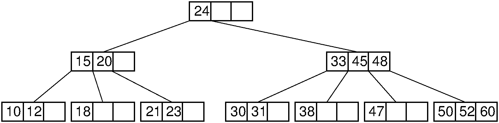

*Figure 9.6.1: A B-tree of order four.*

Search in a B-tree is a generalization of search in a 2-3 tree.
It is an alternating two-step process, beginning with the root node of
the B-tree.

1. Perform a binary search on the records in the
current node.
If a record with the search key is found, then return that record.
If the current node is a leaf node and the key is not found,
then report an unsuccessful search.
1. Otherwise, follow the proper branch and repeat the process.

For example, consider a search for the record with key value 47 in the
tree of Figure [9.6.1](BTree.md#btexamp).
The root node is examined and the second (right) branch taken.
After examining the node at level 1, the third branch is taken to the
next level to arrive at the leaf node containing a record with key
value 47.

B-tree insertion is a generalization of 2-3 tree insertion.
The first step is to find the leaf node that should contain the
key to be inserted, space permitting.
If there is room in this node, then insert the key.
If there is not, then split the node into two and promote the middle
key to the parent.
If the parent becomes full, then it is split in turn, and its middle
key promoted.

Note that this insertion process is guaranteed to keep all nodes at
least half full.
For example, when we attempt to insert into a full internal node of a
B-tree  of order four, there will now be five children that must be
dealt with.
The node is split into two nodes containing two keys each, thus
retaining the B-tree property.
The middle of the five children is promoted to its parent.

<a id="id2"></a>
### 9.6.1.1. B+ Trees

The previous section mentioned that B-trees are universally used
to implement large-scale disk-based systems.
Actually, the B-tree as described in the previous section is almost
never implemented.
What is most commonly implemented is a variant of the B-tree,
called the $\mathrm{B}^+$ tree.
When greater efficiency is required, a more complicated
variant known as the $\mathrm{B}^*$ tree is used.

Consider again the [linear index](Glossary.md#term-linear-index).
When the collection of records will not change, a linear index
provides an extremely efficient way to search.
The problem is how to handle those pesky inserts and deletes.
We could try to keep the core idea of storing a sorted array-based
list, but make it more flexible by breaking the list into manageable
chunks that are more easily updated.
How might we do that?
First, we need to decide how big the chunks should be.
Since the data are on disk, it seems reasonable to store a chunk that
is the size of a disk block, or a small multiple of the disk block
size.
If the next record to be inserted belongs to a chunk that hasn’t
filled its block then we can just insert it there.
The fact that this might cause other records in that chunk to move a
little bit in the array is not important, since this does not cause
any extra disk accesses so long as we move data within that chunk.
But what if the chunk fills up the entire block that contains it?
We could just split it in half.
What if we want to delete a record?
We could just take the deleted record out of the chunk, but we might
not want a lot of near-empty chunks.
So we could put adjacent chunks together if they have only a small
amount of data between them.
Or we could shuffle data between adjacent chunks that together contain
more data.
The big problem would be how to find the desired chunk when processing
a record with a given key.
Perhaps some sort of tree-like structure could be used to locate the
appropriate chunk.
These ideas are exactly what motivate the $\mathrm{B}^+$ tree.
The $\mathrm{B}^+$ tree is essentially a mechanism for managing a sorted
array-based list, where the list is broken into chunks.

The most significant difference between the $\mathrm{B}^+$ tree
and the BST or the standard B-tree is that
the $\mathrm{B}^+$ tree  stores records only at the leaf nodes.
Internal nodes store key values, but these
are used solely as placeholders to guide the search.
This means that internal nodes are significantly different in
structure from leaf nodes.
Internal nodes store keys to guide the search, associating each key
with a pointer to a child $\mathrm{B}^+$ tree node.
Leaf nodes store actual records, or else keys and pointers to actual
records in a separate disk file if the $\mathrm{B}^+$ tree is
being used purely as an index.
Depending on the size of a record as compared to the size of a key,
a leaf node in a $\mathrm{B}^+$ tree of order $m$ might
have enough room to store more or less than $m$ records.
The requirement is simply that the leaf nodes store enough records to
remain at least half full.
The leaf nodes of a $\mathrm{B}^+$ tree are normally
linked together to form a doubly linked list.
Thus, the entire collection of records can be traversed in sorted
order by visiting all the leaf nodes on the linked list.
Here is a Java-like pseudocode representation for the
$\mathrm{B}^+$ tree node interface.
Leaf node and internal node subclasses would implement this interface.

```java
/** Interface for B+ Tree nodes */
public interface BPNode<Key,E> {
  public boolean isLeaf();
  public int numrecs();
  public Key[] keys();
}
```

An important implementation detail to note is that while
Figure [9.6.1](BTree.md#btexamp) shows internal nodes containing three
keys and four pointers, class `BPNode` is slightly different in that
it stores key/pointer pairs.
Figure [9.6.1](BTree.md#btexamp) shows the $\mathrm{B}^+$ tree as
it is traditionally drawn.
To simplify implementation in practice, nodes really do
associate a key with each pointer.
Each internal node should be assumed to hold in the leftmost position
an additional key that is less than or equal to any possible key value
in the node’s leftmost subtree.
$\mathrm{B}^+$ tree implementations typically store an
additional dummy record in the leftmost leaf node whose key value is
less than any legal key value.

$\mathrm{B}^+$ trees are exceptionally good for range queries.
Once the first record in the range has been found, the rest of the
records with keys in the range can be accessed by sequential
processing of the remaining records in the first node, and then
continuing down the linked list of leaf nodes as far as necessary.
Figure [9.6.2](BTree.md#bpexamp) illustrates the $\mathrm{B}^+$
tree.


*Figure 9.6.2: Example of a $\mathrm{B}^+$ tree of order four.
Internal nodes must store between two and four children.
For this example, the record size is assumed to be such that
leaf nodes store between three and five records.*

Search in a $\mathrm{B}^+$ tree is nearly identical to search in
a regular B-tree, except that the search must always continue to the
proper leaf node.
Even if the search-key value is found in an internal node, this is
only a placeholder and does not provide access to the actual record.
To find a record with key value 33 in the $\mathrm{B}^+$ tree of
Figure [9.6.2](BTree.md#bpexamp), search begins at the root.
The value 33 stored in the root merely serves as a placeholder,
indicating that keys with values greater than or equal to 33 are found
in the second subtree.
From the second child of the root, the first branch is taken to reach
the leaf node containing the actual record (or a pointer to the actual
record) with key value 33.
Here is a pseudocode sketch of the $\mathrm{B}^+$ tree search
algorithm.

```java
private E findhelp(BPNode<Key,E> rt, Key k) {
  int currec = binaryle(rt.keys(), rt.numrecs(), k);
  if (rt.isLeaf())
    if ((((BPLeaf<Key,E>)rt).keys())[currec] == k)
      return ((BPLeaf<Key,E>)rt).recs(currec);
    else return null;
  else
    return findhelp(((BPInternal<Key,E>)rt).pointers(currec), k);
}
```

$\mathrm{B}^+$ tree insertion is similar to B-tree insertion.
First, the leaf $L$ that should contain the record is found.
If $L$ is not full, then the new record is added, and no
other $\mathrm{B}^+$ tree nodes are affected.
If $L$ is already full, split it in two (dividing the records
evenly among the two nodes) and promote a copy of the
least-valued key in the newly formed right node.
As with the 2-3 tree, promotion might cause
the parent to split in turn, perhaps eventually leading to splitting
the root and causing the $\mathrm{B}^+$ tree to gain a new
level.
$\mathrm{B}^+$ tree insertion keeps all leaf nodes at equal
depth.
Figure [9.6.3](BTree.md#bpins) illustrates the insertion process through
several examples.


*Figure 9.6.3: Examples of $\mathrm{B}^+$ tree insertion.
(a) B-$\mathrm{B}^+$ tree containing five records.
(b) The result of inserting a record with key value 50 into the tree
of (a).
The leaf node splits, causing creation of the first internal node.
(c) The $\mathrm{B}^+$ tree of (b) after further insertions.
(d) The result of inserting a record with key value 30 into the tree
of (c).
The second leaf node splits, which causes the internal node to split
in turn, creating a new root.*

Here is a a Java-like pseudocode sketch of the $\mathrm{B}^+$
tree insert algorithm.

```java
private BPNode<Key,E> inserthelp(BPNode<Key,E> rt,
                                 Key k, E e) {
  BPNode<Key,E> retval;
  if (rt.isLeaf()) // At leaf node: insert here
    return ((BPLeaf<Key,E>)rt).add(k, e);
  // Add to internal node
  int currec = binaryle(rt.keys(), rt.numrecs(), k);
  BPNode<Key,E> temp = inserthelp(
         ((BPInternal<Key,E>)root).pointers(currec), k, e);
  if (temp != ((BPInternal<Key,E>)rt).pointers(currec))
    return ((BPInternal<Key,E>)rt).
               add((BPInternal<Key,E>)temp);
  else
    return rt;
}
```

Here is an exercise to see if you get the basic idea of
$\mathrm{B}^+$ tree insertion.

To delete record $R$ from the $\mathrm{B}^+$ tree,
first locate the leaf $L$ that contains $R$.
If $L$ is more than half full, then we need only remove $R$,
leaving $L$ still at least half full.
This is demonstrated by Figure [9.6.4](BTree.md#bpdelsimp).


*Figure 9.6.4: Simple deletion from a $\mathrm{B}^+$ tree.
The record with key value 18 is removed from the tree of
Figure [9.6.2](BTree.md#bpexamp).
Note that even though 18 is also a placeholder used to direct search
in the parent node, that value need not be removed from internal nodes
even if no record in the tree has key value 18.
Thus, the leftmost node at level one in this example retains the key
with value 18 after the record with key value 18 has been removed
from the second leaf node.*

If deleting a record reduces the number of records in the node below
the minimum threshold (called an [underflow](Glossary.md#term-underflow)), then we must do
something to keep the node sufficiently full.
The first choice is to look at the node’s adjacent siblings to
determine if they have a spare record that can be used to fill the
gap.
If so, then enough records are transferred from the
sibling so that both nodes have about the same number of records.
This is done so as to delay as long as possible the next time when a
delete causes this node to underflow again.
This process might require that the parent node has its placeholder
key value revised to reflect the true first key value in each node.
Figure [9.6.5](BTree.md#bpborrow) illustrates the process.


*Figure 9.6.5: Deletion from the $\mathrm{B}^+$ tree of Figure
[9.6.2](BTree.md#bpexamp) via borrowing from a sibling.
The key with value 12 is deleted from the leftmost leaf, causing the
record with key value 18 to shift to the leftmost leaf to take its
place.
Note that the parent must be updated to properly indicate the key
range within the subtrees.
In this example, the parent node has its leftmost key value changed
to 19.*

If neither sibling can lend a record to the under-full node
(call it $N$),
then $N$ must give its records to a sibling and be removed
from the tree.
There is certainly room to do this, because the sibling is at most
half full (remember that it had no records to contribute to the
current node), and $N$ has become less than half full because it
is under-flowing.
This merge process combines two subtrees of the parent, which might
cause it to underflow in turn.
If the last two children of the root merge together, then the tree
loses a level.
Figure [9.6.6](BTree.md#bpmerge) illustrates the node-merge deletion
process.


*Figure 9.6.6: Deleting the record with key value 33 from the $\mathrm{B}^+$
tree of Figure [9.6.2](BTree.md#bpexamp) via collapsing siblings.
(a) The two leftmost leaf nodes merge together to form a single leaf.
Unfortunately, the parent node now has only one child.
(b) Because the left subtree has a spare leaf node, that node is passed
to the right subtree.
The placeholder values of the root and the right internal node are
updated to reflect the changes.
Value 23 moves to the root, and old root value 33 moves to the
rightmost internal node.*

Here is a Java-like pseudocode for the $\mathrm{B}^+$ tree
delete algorithm.

```java
/** Delete a record with the given key value, and 
    return true if the root underflows */
private boolean removehelp(BPNode<Key,E> rt, Key k) {
  int currec = binaryle(rt.keys(), rt.numrecs(), k);
  if (rt.isLeaf())
    if (((BPLeaf<Key,E>)rt).keys()[currec] == k)
      return ((BPLeaf<Key,E>)rt).delete(currec);
    else return false;
  else // Process internal node
    if (removehelp(((BPInternal<Key,E>)rt).pointers(currec),
        k))
      // Child will merge if necessary
      return ((BPInternal<Key,E>)rt).underflow(currec);
    else return false;
}
```

The $\mathrm{B}^+$ tree requires that all nodes be at least half
full (except for the root).
Thus, the storage utilization must be at least 50%.
This is satisfactory for many implementations, but note that keeping
nodes fuller will result both in
less space required (because there is less empty space in the disk file)
and in more efficient processing (fewer blocks on average will be read
into memory because the amount of information in each block is greater).
Because B-trees have become so popular, many algorithm designers have
tried to improve B-tree performance.
One method for doing so is to use the $\mathrm{B}^+$ tree
variant known as the $\mathrm{B}^*$ tree.
The $\mathrm{B}^*$ tree is identical to the $\mathrm{B}^+$
tree, except for the rules used to split and merge nodes.
Instead of splitting a node in half when it overflows, the
$\mathrm{B}^*$ tree
gives some records to its neighboring sibling, if possible.
If the sibling is also full, then these two nodes split into three.
Similarly, when a node underflows, it is combined with its two
siblings, and the total reduced to two nodes.
Thus, the nodes are always at least two thirds full. [^1]

[Click here](http://www.cs.usfca.edu/~galles/visualization/BPlusTree.html) for a visualization that will let you construct and
interact with a $\mathrm{B}^+$ tree.
This visualization was written by David Galles of the University of
San Francisco as part of his [Data Structure Visualizations](http://www.cs.usfca.edu/~galles/visualization/Algorithms.html) package.

<a id="b-tree-analysis"></a>
### 9.6.1.2. B-Tree Analysis

The asymptotic cost of search, insertion, and deletion of
records from B-trees, $\mathrm{B}^+$ trees, and
$\mathrm{B}^*$ trees is $\Theta(\log n)$
where $n$ is the total number of records in the tree.
However, the base of the log is the (average) branching factor of the
tree.
Typical database applications use extremely high branching factors,
perhaps 100 or more.
Thus, in practice the B-tree and its variants are extremely shallow.

As an illustration, consider a $\mathrm{B}^+$ tree of order 100
and leaf nodes that contain up to 100 records.
A B-$\mathrm{B}^+$ tree with height one (that is, just a single
leaf node) can have at most 100 records.
A $\mathrm{B}^+$ tree with height two (a root internal node
whose children are leaves) must have at least 100 records
(2 leaves with 50 records each).
It has at most 10,000 records (100 leaves with 100 records each).
A $\mathrm{B}^+$ tree with height three must have at least 5000
records (two second-level nodes with 50 children containing 50 records
each) and at most one million records (100 second-level nodes with 100
full children each).
A $\mathrm{B}^+$ tree with height four must have at least
250,000 records and at most 100 million records.
Thus, it would require an *extremely* large database to generate
a $\mathrm{B}^+$ tree of more than height four.

The $\mathrm{B}^+$ tree split and insert rules guarantee that
every node (except perhaps the root) is at least half full.
So they are on average about 3/4 full.
But the internal nodes are purely overhead, since the keys stored
there are used only by the tree to direct search, rather than store
actual data.
Does this overhead amount to a significant use of space?
No, because once again the high fan-out rate of the tree structure
means that the vast majority of nodes are leaf nodes.
A [K-ary tree](Glossary.md#term-k-ary-tree) has
approximately $1/K$ of its nodes as internal nodes.
This means that while half of a full binary tree’s nodes are internal
nodes, in a $\mathrm{B}^+$ tree of order 100 probably only about
$1/75$ of its nodes are internal nodes.
This means that the overhead associated with internal nodes is very
low.

We can reduce the number of disk fetches required for the B-tree
even more by using the following methods.
First, the upper levels of the tree can be stored in main memory at all
times.
Because the tree branches so quickly, the top two levels
(levels 0 and 1) require relatively little space.
If the B-tree is only height four, then at most two disk fetches
(internal nodes at level two and leaves at level three) are required
to reach the pointer to any given record.

A buffer pool could be used to manage nodes of the B-tree.
Several nodes of the tree would typically be in main memory at one
time.
The most straightforward approach is to use a standard method such as
LRU to do node replacement.
However, sometimes it might be desirable to “lock” certain nodes
such as the root into the buffer pool.
In general, if the buffer pool is even of modest size (say at least
twice the depth of the tree), no special techniques for node
replacement will be required because the upper-level nodes will
naturally be accessed frequently.

[^1]: This concept can be extended further if higher space
utilization is required.
However, the update routines become much more complicated.
I once worked on a project where we implemented 3-for-4 node
split and merge routines.
This gave better performance than the 2-for-3 node split and
merge routines of the $\mathrm{B}^*$ tree.
However, the spitting and merging routines were so complicated
that even their author could no longer understand them
once they were completed!


<a id="indexing-summary-exercises"></a>
# 9.7. Indexing Summary Exercises

<a id="indexing-summary"></a>
## 9.7.1. Indexing Summary

Here are some review questions.


---

# Chapter 10   Hashing


<a id="introduction"></a>
# 10.1. Introduction

<a id="id1"></a>
## 10.1.1. Introduction

Hashing is a method for storing and retrieving records from a database.
It lets you insert, delete, and search for records based on a search
key value.
When properly implemented, these operations can be performed
in constant time.
In fact, a properly tuned hash system typically looks at only
one or two records for each search, insert, or delete operation.
This is far better than the $O(\log n)$ average cost required
to do a binary search on a sorted array of $n$ records,
or the $O(\log n)$ average cost required to do an operation
on a binary search tree.
However, even though hashing is based on a very simple idea,
it is surprisingly difficult to implement properly.
Designers need to pay careful attention to all of the details
involved with implementing a hash system.

A hash system stores records in an array called a [hash table](Glossary.md#term-hash-table),
which we will call `HT`.
Hashing works by performing a computation on a search key
`K` in a way that is intended to identify the position in
`HT` that contains the record with key `K`.
The function that does this calculation is called the
[hash function](HashFuncExamp.md#hashfuncexamp),
and will be denoted by the letter **h**.
Since hashing schemes place records in the table in whatever order
satisfies the needs of the address calculation, records are
not ordered by value.
A position in the hash table is also known as a [slot](Glossary.md#term-slot).
The number of slots in hash table `HT` will be denoted by the
variable $M$ with slots numbered from 0 to $M-1$.

The goal for a hashing system is to arrange things such that,
for any key value `K` and some hash function $h$,
$i = \mathbf{h}(K)$ is a slot in the table such that
$0 <= i < M$,
and we have the key of the record stored at
`HT[i]` equal to `K`.

Hashing is not good for applications where multiple
records with the same key value are permitted.
Hashing is not a good method for answering range searches.
In other words, we cannot easily find all records (if any) whose key
values fall within a certain range.
Nor can we easily find the record with the minimum or maximum key
value, or visit the records in key order.
Hashing is most appropriate for answering the question, ‘What record,
if any, has key value `K`?’
**For applications where all search is done by exact-match queries,
hashing is the search method of choice because it is extremely
efficient when implemented correctly.**
As this tutorial shows, however, there are many approaches
to hashing and it is easy to devise an inefficient implementation.
Hashing is suitable for both in-memory and disk-based searching and
is one of the two most widely used methods for organizing large
databases stored on disk (the other is the B-tree).

As a simple (though unrealistic) example of hashing,
consider storing $n$ records, each with a unique key value in
the range 0 to $n-1$.
A record with key `k` can be stored in
`HT[k]`, and so the hash function is
$\mathbf{h}(k) = k$.
To find the record with key value `k`, look in
`HT[k]`.

In most applications, there are many more values in the key range
than there are slots in the hash table.
For a more realistic example, suppose the key can take any value in
the range 0 to 65,535 (i.e., the key is a two-byte unsigned integer),
and that we expect to store approximately 1000 records at any given time.
It is impractical in this situation to use a hash table with
65,536 slots, because then the vast majority of the slots would be
left empty.
Instead, we must devise a hash function that allows us to store the
records in a much smaller table.
Because the key range is larger than the size of the table,
at least some of the slots must be mapped to from multiple key values.
Given a hash function **h** and two keys $k_1$ and
$k_2$, if
$\mathbf{h}(k_1) = \beta = \mathbf{h}(k_2)$
where $\beta$ is a slot in
the table, then we say that $k_1$ and $k_2$ have a
[collision](Glossary.md#term-collision) at slot $\beta$ under hash function **h**.

Finding a record with key value `K` in a database organized by hashing
follows a two-step procedure:

1. Compute the table location $\mathbf{h}(K)$.
1. Starting with slot $\mathbf{h}(K)$, locate the record
containing key `K` using (if necessary) a
[collision resolution](HashCSimple.md#hashcsimple)
policy .


<a id="hash-function-principles"></a>
# 10.2. Hash Function Principles

<a id="id1"></a>
## 10.2.1. Hash Function Principles

Hashing generally takes records whose key values come from a
large range and stores those records in a table
with a relatively small number of slots.
Collisions occur when two records hash to the same slot in the
table.
If we are careful—or lucky—when selecting a hash function,
then the actual number of collisions will be few.
Unfortunately, even under the best of circumstances, collisions are
nearly unavoidable.
To illustrate, consider a classroom full of students.
What is the probability that some pair of students
shares the same birthday (i.e., the same day of the year, not
necessarily the same year)?
If there are 23 students, then the odds are about even that two will
share a birthday.
This is despite the fact that there are 365 days in which students
can have birthdays (ignoring leap years).
On most days, no student in the class has a birthday.
With more students, the probability of a shared birthday increases.
The mapping of students to days based on their birthday is similar to
assigning records to slots in a table (of size 365) using the
birthday as a hash function.
Note that this observation tells us nothing about *which*
students share a birthday, or on *which* days of the year shared
birthdays fall.

Try it for yourself.
You can use the calculator to see the probability of a collision.
The default values are set to show the number of people in a room such
that the chance of a duplicate is just over 50%.
But you can set any table size and any number of records to determine
the probability of a collision under those conditions.

Use the calculator to answer the following questions.

To be practical, a database organized by hashing must store records in a
hash table that is not so large that it wastes space.
To balance time and space efficiency, this means that the hash table
should be [around half full](HashAnal.md#hashanal).
Because collisions are extremely likely to occur under these conditions
(by chance, any record inserted into a table that is half full should
have a collision half of the time),
does this mean that we need not worry about how well a hash function
does at avoiding collisions?
Absolutely not.
The difference between using a good hash function and a bad hash function
makes a big difference in practice in the number of records that must be
examined when searching or inserting to the table.
Technically, any function that maps all possible key values to a
slot in the hash table is a hash function.
In the extreme case, even a function that maps all records to the same
slot in the array is a hash function, but it does nothing to help us
find records during a search operation.

We would like to pick a hash function that maps keys
to slots in a way that makes each slot in the hash table have equal
probablility of being filled for the actual set keys being used.
Unfortunately, we normally have no control over the distribution of
key values for the actual records in a given database or collection.
So how well any particular hash function does
depends on the actual distribution of the keys used within the
allowable key range.
In some cases, incoming data are well distributed across their key
range.
For example, if the input is a set of random numbers selected
uniformly from the key range,
any hash function that assigns the key range so that each slot in the
hash table receives an equal share of the range will likely also
distribute the input records uniformly within the table.
However, in many applications the incoming records are highly
clustered or otherwise poorly distributed.
When input records are not well distributed throughout the key range
it can be difficult to devise a hash function that does a good job of
distributing the records throughout the table, especially if the
input distribution is not known in advance.

There are many reasons why data values might be poorly distributed.

1. Natural frequency distributions tend to follow a common pattern where
a few of the entities occur frequently while most entities occur
relatively rarely.
For example, consider the populations of the 100 largest cities in
the United States.
If you plot these populations on a numberline, most of them
will be clustered toward the low side, with a few
outliers on the high side.
This is an example of a Zipf distribution.
Viewed the other way, the home town for a given person is far more
likely to be a particular large city than a particular small town.
1. Collected data are likely to be skewed in some way.
Field samples might be rounded to, say, the
nearest 5 (i.e., all numbers end in 5 or 0).
1. If the input is a collection of common English words, the beginning
letter will be poorly distributed.

Note that for items 2 and 3 on this list,
either high- or low-order bits of the key are poorly distributed.

When designing hash functions, we are generally faced with one of two
situations:

1. We know nothing about the distribution of the incoming keys.
In this case, we wish to select a hash function that evenly
distributes the key range across the hash table,
while avoiding obvious opportunities for clustering such as hash
functions that are sensitive to the high- or low-order bits of the key
value.
1. We know something about the distribution of the incoming keys.
In this case, we should use a distribution-dependent hash function
that avoids assigning clusters of related key values to the same hash
table slot.
For example, if hashing English words, we should *not* hash on
the value of the first character because this is likely to be unevenly
distributed.

In the next module, you will see several examples of hash functions
that illustrate these points.


<a id="sample-hash-functions"></a>
# 10.3. Sample Hash Functions

<a id="id1"></a>
## 10.3.1. Sample Hash Functions

<a id="simple-mod-function"></a>
### 10.3.1.1. Simple Mod Function

Consider the following hash function used to hash integers to a table
of sixteen slots:

```
int h(int x) {
  return x % 16;
}
```

Here “%” is the symbol for the mod function.

Recall that the values 0 to 15 can be represented with four bits
(i.e., 0000 to 1111).
The value returned by this hash function depends solely on
the least significant four bits of the key.
Because these bits are likely to be poorly distributed
(as an example, a high percentage of the keys might be even numbers,
which means that the low order bit is zero),
the result will also be poorly distributed.
This example shows that the size of the table $M$
can have a big effect on the performance of a hash system because the table size
is typically used as the modulus to ensure that the hash
function produces a number in the range 0 to $M-1$.

<a id="binning"></a>
### 10.3.1.2. Binning

Say we are given keys in the range 0 to 999, and have a hash table of
size 10.
In this case, a possible hash function might simply divide the key
value by 100.
Thus, all keys in the range 0 to 99 would hash to slot 0, keys 100 to
199 would hash to slot 1, and so on.
In other words, this hash function “bins” the first 100 keys to the
first slot, the next 100 keys to the second slot, and so on.

[Binning](Glossary.md#term-binning) in this way has the problem that it will cluster
together keys if the distribution does not divide evenly on the
high-order bits.
In the above example, if more records have keys in the range 900-999
(first digit 9) than have keys in the range 100-199
(first digit 1),  more records will hash to slot 9 than to slot 1.
Likewise, if we pick too big a value for the key range and the actual
key values are all relatively small, then most records will hash to
slot 0.
A similar, analogous problem arises if we were instead hashing strings based
on the first letter in the string.

In general with binning we store the record with key value $i$
at array position $i/X$ for some value $X$
(using integer division).
A problem with Binning is that we have to know the key range so that
we can figure out what value to use for $X$.
Let’s assume that the keys are all in the range 0 to 999.
Then we want to divide key values by 100 so that the result is in the
range 0 to 9.
There is no particular limit on the key range that binning could
handle, so long as we know the maximum possible value in advance so
that we can figure out what to divide the key value by.
Alternatively, we could also take the result of any binning
computation and then mod by the table size to be safe.
So if we have keys that are bigger than 999 when dividing by 100, we
can still make sure that the result is in the range 0 to 9 with a mod
by 10 step at the end.

Binning looks at the opposite part of the key value from the mod
function.
The mod function, for a power of two, looks at the low-order bits,
while binning looks at the high-order bits.
Or if you want to think in base 10 instead of base 2, modding by 10 or
100 looks at the low-order digits, while binning into an array of size
10 or 100 looks at the high-order digits.

As another example, consider hashing a collection of keys whose values
follow a normal distribution, as illustrated by
Figure [10.3.1](HashFuncExamp.md#hashnormal).
Keys near the mean of the normal distribution are far more likely
to occur than keys near the tails of the distribution.
For a given slot, think of where the keys come from within the distribution.
Binning would be taking thick slices out of the distribution and assign
those slices to hash table slots.
If we use a hash table of size 8, we would divide the key range into 8
equal-width slices and assign each slice to a slot in the table.
Since a normal distribution is more likely to generate keys from
the middle slice, the middle slot of the table is most likely to be used.
In contrast, if we use the mod function, then we are assigning to any given
slot in the table a series of thin slices in steps of 8.
In the normal distribution, some of these slices associated with any given
slot are near the tails, and some are near the center.
Thus, each table slot is equally likely (roughly) to get a key value.

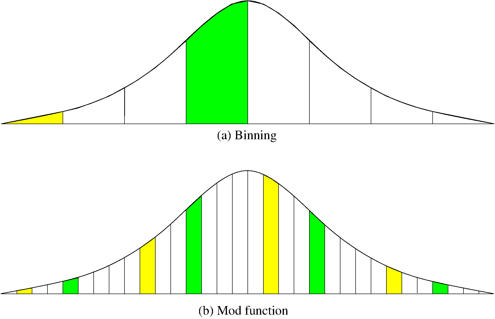

*Figure 10.3.1: A comparison of binning vs. modulus as a hash function.*

<a id="the-mid-square-method"></a>
### 10.3.1.3. The Mid-Square Method

A good hash function to use with integer key values is the
[mid-square method](Glossary.md#term-mid-square-method).
The mid-square method squares the key value, and then takes out the middle
$r$ bits of the result, giving a value in the range
0 to $2^{r}-1$.
This works well because most or all bits of the key value contribute to
the result.
For example, consider records whose keys are 4-digit numbers in base
10, as shown in Figure [10.3.2](HashFuncExamp.md#midsquarefig).
The goal is to hash these key values to a table of size 100
(i.e., a range of 0 to 99).
This range is equivalent to two digits in base 10.
That is, $r = 2$.
If the input is the number 4567, squaring yields an 8-digit number,
20857489.
The middle two digits of this result are 57.
All digits of the original key value
(equivalently, all bits when the number is viewed in binary)
contribute to the middle two digits of the squared value.
Thus, the result is not dominated by the distribution of the bottom
digit or the top digit of the original key value.
Of course, if the key values all tend to be small numbers,
then their squares will only affect the low-order digits of the hash value.

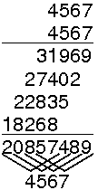

*Figure 10.3.2: An example of the mid-square method. This image shows the
traditional gradeschool long multiplication process. The value
being squared is 4567. The result of squaring is 20857489.
At the bottom, of the image, the value 4567 is show again, with
each digit at the bottom of a “V”. The associated “V” is showing
the digits from the result that are being affected by each digit of
the input. That is, “4” affects the output digits 2, 0, 8, 5,
an 7. But it has no affect on the last 3 digits. The key point is
that the middle two digits of the result (5 and 7) are affected by
every digit of the input.*

Here is a little calculator for you to see how this works.
Start with ‘4567’ as an example.

<a id="a-simple-hash-function-for-strings"></a>
## 10.3.2. A Simple Hash Function for Strings

Now we will examine some hash functions suitable for storing strings
of characters.
We start with a simple summation function:

```
int sascii(String x, int M) {
  char ch[];
  ch = x.toCharArray();
  int xlength = x.length();

  int i, sum;
  for (sum=0, i=0; i < x.length(); i++)
    sum += ch[i];
  return sum % M;
}
```

This function sums the ASCII values of the letters in a string.
If the hash table size $M$ is small compared to the
resulting summations, then this hash function should do a
good job of distributing strings evenly among the hash table slots,
because it gives equal weight to all characters in the string.
This is an example of the [folding method](Glossary.md#term-folding-method) to designing a hash
function.
Note that the order of the characters in the string has no effect on
the result.
A similar method for integers would add the digits of the key
value, assuming that there are enough digits to

1. keep any one or two digits with bad distribution from skewing the
results of the process and
1. generate a sum much larger than $M$.

As with many other hash functions, the final step is to apply the
modulus operator to the result, using table size $M$ to generate
a value within the table range.
If the sum is not sufficiently large, then the modulus operator will
yield a poor distribution.
For example, because the ASCII value for ‘A’ is 65 and ‘Z’ is 90,
`sum` will always be in the range 650 to 900 for a string of ten
upper case letters.
For a hash table of size 100 or less, a reasonable  distribution
results.
For a hash table of size 1000, the distribution is terrible because
only slots 650 to 900 can possibly be the home slot for some key
value, and the values are not evenly distributed even within those
slots.

Now you can try it out with this calculator.

<a id="string-folding"></a>
## 10.3.3. String Folding

Here is a much better hash function for strings.

```java
// Use folding on a string, summed 4 bytes at a time
int sfold(String s, int M) {
  long sum = 0, mul = 1;
  for (int i = 0; i < s.length(); i++) {
    mul = (i % 4 == 0) ? 1 : mul * 256;
    sum += s.charAt(i) * mul;
  }
  return (int)(Math.abs(sum) % M);
}
```

This function takes a string as input.
It processes the string four bytes at a time, and interprets each of
the four-byte chunks as a single long integer value.
The integer values for the four-byte chunks are added together.
In the end, the resulting sum is converted to the range 0 to
$M-1$ using the modulus operator.

For example, if the string “aaaabbbb” is passed to `sfold`,
then the first four bytes (“aaaa”) will be interpreted as the
integer value 1,633,771,873,
and the next four bytes (“bbbb”) will be
interpreted as the integer value 1,650,614,882.
Their sum is 3,284,386,755 (when treated as an unsigned integer).
If the table size is 101 then the modulus function will cause this key
to hash to slot 75 in the table.

Now you can try it out with this calculator.

For any sufficiently long string, the sum for the integer
quantities will typically cause a 32-bit integer to overflow
(thus losing some of the high-order bits) because the resulting
values are so large.
But this causes no problems when the goal is to compute a hash function.

The reason that hashing by summing the integer representation of four
letters at a time is superior to summing one letter at a time is because
the resulting values being summed have a bigger range.
This still only works well for strings long enough
(say at least 7-12 letters), but the original method would not work
well for short strings either.
There is nothing special about using four characters at a time.
Other choices could be made.
Another alternative would be to fold two characters at a time.

<a id="hash-function-practice"></a>
## 10.3.4. Hash Function Practice

Now here is an exercise to let you practice these various hash
functions.
You should use the calculators above for the more complicated hash
functions.

<a id="hash-function-review-questions"></a>
## 10.3.5. Hash Function Review Questions

Here are some review questions.


<a id="open-hashing"></a>
# 10.4. Open Hashing

<a id="id1"></a>
## 10.4.1. Open Hashing

While the goal of a hash function is to minimize collisions,
some collisions are unavoidable in practice.
Thus, hashing implementations must include some form of collision
resolution policy.
Collision resolution techniques can be broken into two classes:
[open hashing](Glossary.md#term-open-hash-system)
(also called [separate chaining](Glossary.md#term-separate-chaining)) and
[closed hashing](HashCSimple.md#hashcsimple)
(also called [open addressing](Glossary.md#term-open-addressing)).
(Yes, it is confusing when “open hashing” means the opposite of
“open addressing”, but unfortunately, that is the way it is.)
The difference between the two has to do with whether
collisions are stored outside the table (open hashing), or
whether collisions result in storing one of the records at another
slot in the table (closed hashing).

The simplest form of open hashing defines each slot in the
hash table to be the head of a linked list.
All records that hash to a particular slot are placed on that slot’s
linked list.
The following figure illustrates a hash table where each
slot points to a linked list to hold the records associated with that slot.
The hash function used is the simple mod function.

Records within a slot’s list can be ordered in several ways:
by insertion order, by key value order, or by frequency-of-access
order.
Ordering the list by key value provides an advantage in the case of an
unsuccessful search, because we know to stop searching the list once we
encounter a key that is greater than the one being searched for.
If records on the list are unordered or ordered by frequency, then an
unsuccessful search will need to visit every record on the list.

Given a table of size $M$ storing $N$ records,
the hash function will (ideally) spread the records evenly among the
$M$ positions in
the table, yielding on average $N/M$ records for each list.
Assuming that the table has more slots than there are records to be
stored, we can hope that few slots will contain more than one record.
In the case where a list is empty or has only one record,
a search requires only one access to the list.
Thus, the average cost for hashing should be $\Theta(1$).
However, if clustering causes many records to hash to only a few of
the slots, then the cost to access a record will be much higher
because many elements on the linked list must be searched.

Open hashing is most appropriate when the hash table is kept in main
memory, with the lists implemented by a standard in-memory linked list.
Storing an open hash table on disk in an efficient way is
difficult, because members of a given linked list might be stored on
different disk blocks.
This would result in multiple disk accesses when searching for a
particular key value, which defeats the purpose of using hashing.

There are similarities between open hashing and Binsort.
One way to view open hashing is that each record is simply placed in a
bin.
While multiple records may hash to the same bin, this initial binning
should still greatly reduce the number of records accessed by
a search operation.
In a similar fashion, a simple Binsort reduces the number of
records in each bin to a small number that can be sorted in some
other way.


<a id="bucket-hashing"></a>
# 10.5. Bucket Hashing

<a id="id1"></a>
## 10.5.1. Bucket Hashing

Closed hashing stores all records directly in the hash table.
Each record $R$ with key value $k_R$ has a
[home position](Glossary.md#term-home-position) that is
$\textbf{h}(k_R)$, the slot computed by the hash function.
If $R$ is to be inserted and another record already
occupies $R$’s home position, then $R$ will be stored at
some other slot in the table.
It is the business of the collision resolution policy to determine
which slot that will be.
Naturally, the same policy must be followed during search as during
insertion, so that any record not found in its home position can
be recovered by repeating the collision resolution process.

One implementation for closed hashing groups hash table slots into
[buckets](Glossary.md#term-bucket).
The $M$ slots of the hash table are divided into
$B$ buckets, with each bucket consisting of $M/B$ slots.
The hash function assigns each record to the first slot
within one of the buckets.
If this slot is already occupied, then the bucket slots are searched
sequentially until an open slot is found.
If a bucket is entirely full, then the record is stored in an
[overflow bucket](Glossary.md#term-overflow-bucket) of infinite capacity at the end of the table.
All buckets share the same overflow bucket.
A good implementation will use a hash function that distributes the
records evenly among the buckets so that as few records as
possible go into the overflow bucket.

When searching for a record, the first step is to hash the key to
determine which bucket should contain the record.
The records in this bucket are then searched.
If the desired key value is not found and the bucket still has free
slots, then the search is complete.
If the bucket is full, then it is possible that the desired
record is stored in the overflow bucket.
In this case, the overflow bucket must be searched until the record is
found or all records in the overflow bucket have been checked.
If many records are in the overflow bucket, this will be an
expensive process.

Now you can try it yourself.

<a id="an-alternate-approach"></a>
## 10.5.2. An Alternate Approach

A simple variation on bucket hashing is to hash a key value to some slot
in the hash table as though bucketing were not being used.
If the home position is full, then we search through the rest of the
bucket to find an empty slot.
If all slots in this bucket are full, then the record is assigned
to the overflow bucket.
The advantage of this approach is that initial collisions are reduced,
because any slot can be a home position rather than just the first slot
in the bucket.

Bucket methods are good for implementing hash tables stored on disk,
because the bucket size can be set to the size of a disk block.
Whenever search or insertion occurs, the entire bucket is read
into memory.
Because the entire bucket is then in memory, processing an insert or
search operation requires only one disk access,
unless the bucket is full.
If the bucket is full, then the overflow bucket must be retrieved
from disk as well.
Naturally, overflow should be kept small to minimize unnecessary disk
accesses.


<a id="collision-resolution"></a>
# 10.6. Collision Resolution

<a id="id1"></a>
## 10.6.1. Collision Resolution

We now turn to the most commonly used form of hashing:
[closed hashing](Glossary.md#term-closed-hash-system) with no bucketing, and a
[collision resolution policy](Glossary.md#term-collision-resolution-policy) that can potentially use any slot
in the hash table.

During insertion, the goal of [collision resolution](Glossary.md#term-collision-resolution) is to find
a free slot in the hash table when the home position for the record is
already occupied.
We can view any collision resolution method as generating a sequence
of hash table slots that can potentially hold the record.
The first slot in the sequence will be the home position for the key.
If the home position is occupied, then the collision resolution policy
goes to the next slot in the sequence.
If this is occupied as well, then another slot must be found, and
so on.
This sequence of slots is known as the
[probe sequence](Glossary.md#term-probe-sequence), and it is generated by some
[probe function](Glossary.md#term-probe-function) that we will call **p**.
Insertion works as follows:

```
// Insert e into hash table HT
void hashInsert(const Key& k, const Elem& e) {
  int home;                     // Home position for e
  int pos = home = h(k);        // Init probe sequence
  for (int i=1; EMPTYKEY != (HT[pos]).key(); i++) {
    pos = (home + p(k, i)) % M; // probe
    if (k == HT[pos].key()) {
      println("Duplicates not allowed");
      return;
    }
  }
  HT[pos] = e;
}
```

Method `hashInsert` first checks to see if the home slot for the
key is empty.
If the home slot is occupied, then we use the probe function
$\textbf{p}(k, i)$ to locate a free slot in the table.
Function **p** has two parameters, the key $k$ and a
count $i$ of where in the probe sequence we wish to be.
That is, to get the first position in the probe sequence after the
home slot for key $K$, we call $\textbf{p}(K, 1)$.
For the next slot in the probe sequence, call $\textbf{p}(K, 2)$.
Note that the probe function returns an offset from the original home
position, rather than a slot in the hash table.
Thus, the `for` loop in `hashInsert` is computing positions
in the table at each iteration by adding the value returned from the
probe function to the home position.
The $i$ th call to **p** returns the $i$ th offset to be used.

Searching in a hash table follows the same probe sequence that was
followed when inserting records.
In this way, a record not in its home position can be recovered.
An implementation for the search procedure is as
follows.:

```
// Search for the record with Key K
bool hashSearch(const Key& K, Elem& e) const {
  int home;              // Home position for K
  int pos = home = h(K); // Initial position is the home slot
  for (int i = 1;
       (K != (HT[pos]).key()) && (EMPTYKEY != (HT[pos]).key());
       i++)
    pos = (home + p(K, i)) % M; // Next on probe sequence
  if (K == (HT[pos]).key()) {   // Found it
    e = HT[pos];
    return true;
  }
  else return false;            // K not in hash table
}
```

Both the insert and the search routines assume that at least
one slot on the probe sequence of every key will be empty.
Otherwise they will continue in an infinite loop on unsuccessful
searches.
Thus, the hash system should keep a count of the number of records stored,
and refuse to insert into a table that has only one free slot.

The simplest approach to collsion resolution is simply to move down
the table from the home slot until a free slot is found.
This is known as [linear probing](Glossary.md#term-linear-probing).
The probe function for simple linear probing is
$\textbf{p}(K, i) = i$.
That is, the $i$ th offset on the probe sequence is just
$i$,
meaning that the $i$ th step is simply to move down  $i$
slots in the table.
Once the bottom of the table is reached, the probe sequence
wraps around to the beginning of the table (since the last step is to
mod the result to the table size).
Linear probing has the virtue that all slots in the table will be
candidates for inserting a new record before the probe sequence
returns to the home position.

Can you see any reason why this might not be the best approach
to collision resolution?

<a id="the-problem-with-linear-probing"></a>
### 10.6.1.1. The Problem with Linear Probing

While linear probing is probably
the first idea that comes to mind when considering collision
resolution policies, it is not the only one possible.
Probe function **p** allows us many options for how to do collision
resolution.
In fact, linear probing is one of the worst collision resolution
methods.
The main problem is illustrated by the next slideshow.

Again, the ideal behavior for a collision resolution mechanism is that
each empty slot in the table will have equal probability of
receiving the next record inserted (assuming that every slot in the
table has equal probability of being hashed to initially).
This tendency of linear probing to cluster items together is known as
[primary clustering](Glossary.md#term-primary-clustering).
Small clusters tend to merge into big clusters, making the problem
worse.
The objection to primary clustering is that it leads to
long probe sequences.


<a id="improved-collision-resolution"></a>
# 10.7. Improved Collision Resolution

<a id="linear-probing-by-steps"></a>
## 10.7.1. Linear Probing by Steps

How can we avoid primary clustering?
One possible improvement might be to use linear probing,
but to skip slots by some constant $c$ other than 1.
This would make the probe function
$\textbf{p}(K, i) = ci$,
and so the $i$ th slot in the probe sequence will be
$(\textbf{h}(K) + ic) \mod M$.
In this way, records with adjacent home positions will not follow the
same probe sequence.

One quality of a good probe sequence is that it will cycle through
all slots in the hash table before returning to the home position.
Clearly linear probing (which “skips” slots by one each time) does this.
Unfortunately, not all values for $c$ will make this happen.
For example, if $c = 2$ and the table contains an even number of
slots, then any key whose home position is in an even slot will have
a probe sequence that cycles through only the even slots.
Likewise, the probe sequence for a key whose home position is in an
odd slot will cycle through the odd slots.
Thus, this combination of table size and linear probing constant
effectively divides the records into two sets stored in two
disjoint sections of the hash table.
So long as both sections of the table contain the same number of records,
this is not really important.
However, just from chance it is likely that one section will become
fuller than the other, leading to more collisions and poorer
performance for those records.
The other section would have fewer records, and thus better
performance.
But the overall system performance will be degraded,
as the additional cost to the side that is more full outweighs the
improved performance of the less-full side.

Constant $c$ must be relatively prime to $M$ to generate a
linear probing sequence that visits all slots in the table
(that is, $c$ and $M$ must share no factors).
For a hash table of size $M = 10$, if $c$
is any one of 1, 3, 7, or 9,
then the probe sequence will visit all slots for any key.
When $M = 11$, any value for $c$ between 1 and 10 generates a
probe sequence that visits all slots for every key.

Now you can practice linear probing by different step sizes.

<a id="pseudo-random-probing"></a>
## 10.7.2. Pseudo-Random Probing

Consider the situation where $c = 2$ and we wish to insert a record
with key $k_1$ such that
$\textbf{h}(k_1) = 3$.
The probe sequence for  $k_1$ is 3, 5, 7, 9, and so on.
If another key $k_2$ has home position at slot 5,
then its probe sequence will be 5, 7, 9, and so on.
The probe sequences of $k_1$ and $k_2$
are linked together in a manner that contributes to clustering.
In other words, linear probing with a value of $c > 1$ does not
solve the problem of primary clustering.
We would like to find a probe function that does not link
keys together in this way.
We would prefer that the probe sequence for $k_1$
after the first step on the sequence should not be identical to the
probe sequence of $k_2$.
Instead, their probe sequences should diverge.

The ideal probe function would select the next position on the probe
sequence at random from among the unvisited slots; that is, the probe
sequence should be a random permutation of the hash table positions.
Unfortunately, we cannot actually select the next position in the
probe sequence at random, because we would not be able to duplicate
this same probe sequence when searching for the key.
However, we can do something similar called
[pseudo-random probing](Glossary.md#term-pseudo-random-probing).
In pseudo-random probing, the $i$ th slot in the probe sequence is
$(\textbf{h}(K) + r_i) \mod M$
where $r_i$ is the $i$ th value in a random permutation
of the numbers from 1 to $M-1$.
All inserts and searches must use the same sequence of random numbers.
The probe function would be
$\textbf{p}(K, i) = \textbf{Permutation}[i]$
where **Permutation** is an array of length $M$ that stores a value of
0 in position **Permutation[0]**, and stores a
random permutation of the values from 1 to $M - 1$ in slots 1 to
$M - 1$.

Here is a practice exercise for pseudo-random probing.

Pseudo-random probing exhibits another desirable feature in a hash
function.

<a id="quadratic-probing"></a>
## 10.7.3. Quadratic Probing

Another probe function that eliminates
primary clustering is called
[quadratic probing](Glossary.md#term-quadratic-probing).
Here the probe function is some quadratic function
$\textbf{p}(K, i) = c_1 i^2 + c_{2}i + c_3$
for some choice of constants $c_1$, $c_2$,
and  $c_3$.

The simplest variation is $\textbf{p}(K, i) = i^2$
(i.e., $c_1 = 1$, $c_2 = 0$, and
$c_3 = 0$).
Then the $i$ th value in the probe sequence would be
$(\textbf{h}(K) + i^2) \mod M$.

Now you can practice quadratic probing.

There is one problem with quadratic probing: Its probe sequence
typically will not visit all slots in the hash table.

For many hash table sizes, this probe function will cycle through a
relatively small number of slots.
If all slots on that cycle happen to be full, this means that the
record cannot be inserted at all!
A more realistic example is a table with 105 slots.
The probe sequence starting from any given slot will only visit 23
other slots in the table.
If all 24 of these slots should happen to be full, even if other slots
in the table are empty, then the record cannot be inserted because the
probe sequence will continually hit only those same 24 slots.

Fortunately, it is possible to get good results from quadratic probing
at low cost.
The right combination of probe function and table size will visit many
slots in the table.
In particular, if the hash table size is a prime number and the probe
function is $\textbf{p}(K, i) = i^2$,
then at least half the slots in the table will be visited.
Thus, if the table is less than half full, we can be certain that a
free slot will be found.
Alternatively, if the hash table size is a power of two and the probe
function is $\textbf{p}(K, i) = (i^2 + i)/2$,
then every slot in the table will be visited by the probe function.

<a id="double-hashing"></a>
## 10.7.4. Double Hashing

Both pseudo-random probing and quadratic probing eliminate
primary clustering, which is the name given to the the situation when
keys share substantial segments of a probe sequence.
If two keys hash to the same home position, however, then they will always
follow the same probe sequence for every collision resolution method that
we have seen so far.
The probe sequences generated by pseudo-random and
quadratic probing (for example) are entirely a function of the home
position, not the original key value.
This is because function **p** ignores its input parameter
$K$ for these collision resolution methods.
If the hash function generates a cluster at a particular home
position, then the cluster remains under pseudo-random and quadratic
probing.
This problem is called [secondary clustering](Glossary.md#term-secondary-clustering).

To avoid secondary clustering, we need to have the probe sequence make
use of the original key value in its decision-making process.
A simple technique for doing this is to return to
linear probing by a constant step size
for the probe function, but to
have that constant be determined by a second hash function,
$\textbf{h}_2$.
Thus, the probe sequence would be of the form
$\textbf{p}(K, i) = i * \textbf{h}_2(K)$.
This method is called [double hashing](Glossary.md#term-double-hashing).

There are important restrictions on $h_2$.
Most importantly, the value returned by $h_2$ must never be zero
(or $M$) because that will immediately lead to an infinite loop
as the probe sequence makes no progress.
However, a good implementation of double hashing should also ensure
that all of the probe sequence constants are relatively
prime to the table size $M$.
For example, if the hash table size were 100 and the step size for
linear probing (as generated by function $h_2$) were 50, then
there would be only one slot on the probe sequence.
If instead the hash table size is 101 (a prime number), than any step
size less than 101 will visit every slot in the table.

This can be achieved easily.
One way is to select $M$ to be a prime number, and have
$\textbf{h}_2$ return a value in the range
$1 <= \textbf{h}_2(k) <= M - 1$.
We can do this by using this secondary hash function:
$\textbf{h}_2(k) = 1 + (k \mod (M-1))$.
An alternative is to set $M = 2^m$
for some value $m$ and have
$\textbf{h}_2$ return an odd value
between 1 and $2^m$.
We can get that result with this secondary hash function:
$\textbf{h}_2(k) = (((k/M) \mod (M/2)) * 2) + 1$. [^1]

Now you can try it.

[^1]: The secondary hash function
$\textbf{h}_2(k) = (((k/M) \mod (M/2)) * 2) + 1$ might
seem rather mysterious, so let’s break this down.
This is being used in the context of two facts: (1) We want the
function to return an odd value that is less than $M$ the
hash table size, and (2) we are using a hash table of size
$M = 2^m$, which means that taking the mod of size
$M$ is using the bottom $m$ bits of the key value.
OK, since $\textbf{h}_2$ is multiplying something by 2 and
adding 1, we guarentee that it is an odd number.
Now, $((X \mod (M/2)) * 2) + 1$ must be in the range 1
and $M-1$ (if you need to, play around with this on paper
to convince yourself that this is true).
This is exactly what we want.
The last piece of the puzzle is the first part $k/M$.
That is not strictly necessary.
But remember that since the table size is $M = 2^m$, this
is the same as shifting the key value right by $m$ bits.
In other words, we are not using the bottom $m$ bits to
decide on the second hash function value, which is especially a
good thing if we used the bottom $m$ bits to decide on
the first hash function value!
In other words, we really do not want the value of the step
sized used by the linear probing to be fixed to the slot in the
hash table that we chose.
So we are using the next $m$ bits of the key value
instead.
Note that this would only be a good idea if we have keys in a
large enough key range, that is, we want plenty of use of those
second $m$ bits in the key range.
This will be true if the max key value uses at least $2m$
bits, meaning that the max key value should be at least the
square of the hash table size.
This is not a problem for typical hashing applications.


<a id="analysis-of-closed-hashing"></a>
# 10.8. Analysis of Closed Hashing

<a id="id1"></a>
## 10.8.1. Analysis of Closed Hashing

How efficient is hashing?
We can measure hashing performance in terms of the number of
record accesses required when performing an operation.
The primary operations of concern are insertion, deletion, and search.
It is useful to distinguish between successful and unsuccessful searches.
Before a record can be deleted, it must be found.
Thus, the number of accesses required to delete a record is
equivalent to the number required to successfully search for it.
To insert a record, an empty slot along the record’s probe
sequence must be found.
This is equivalent to an
unsuccessful search for the record
(recall that a successful search for the record during insertion
should generate an error because two records with the same key are
not allowed to be stored in the table).

When the hash table is empty, the first record inserted will always
find its home position free.
Thus, it will require only one record access to find a free slot.
If all records are stored in their home positions, then successful
searches will also require only one record access.
As the table begins to fill up, the probability that a record can be
inserted into its home position decreases.
If a record hashes to an occupied slot, then the collision resolution
policy must locate another slot in which to store it.
Finding records not stored in their home position also requires
additional record accesses as the record is searched for along its probe
sequence.
As the table fills up, more and more records are likely to be located
ever further from their home positions.

From this discussion, we see that the expected cost of hashing is a
function of how full the table is.
Define the [load factor](Glossary.md#term-load-factor)
for the table as $\alpha = N/M$,
where $N$ is the number of records currently in the table.

An estimate of the expected cost for an insertion (or an unsuccessful
search) can be derived analytically as a function of $\alpha$ in the
case where we assume that the probe sequence follows a random
permutation of the slots in the hash
table.
Assuming that every slot in the table has equal probability of being
the home slot for the next record,
the probability of finding the home position occupied is
$\alpha$.
The probability of finding both the home position occupied and the
next slot on the probe sequence occupied is $(N(N-1))/(M(M-1))$.
The probability of $i$ collisions is
$(N(N-1) ... (N-i+1))/(M(M-1) ... (M-i+1))$.
If $N$ and $M$ are large,
then this is approximately $(N/M)^i$.
The expected number of probes is one plus the sum over
$i >= 1$ of the probability of $i$ collisions,
which is approximately

<a id="equation-hashanal-0"></a>
$$
1 + \sum_{i=1}^\infty (N/M)^i = 1/(1-\alpha).
$$

The cost for a successful search (or a deletion) has the same cost as
originally inserting that record.
However, the expected value for the insertion cost depends on the
value of $\alpha$ not at the time of deletion, but rather at the time
of the original insertion.
We can derive an estimate of this cost (essentially an average over all
the insertion costs) by integrating from 0 to the current value of
$\alpha$, yielding a result of
$(1/\alpha) \log_e 1/(1-\alpha).$

It is important to realize that these equations represent the expected
cost for operations when using the unrealistic assumption that the
probe sequence is based on a random permutation of the slots in the
hash table.
We thereby avoid all the expense that results from a less-than-perfect
collision resolution policy.
Thus, these costs are lower-bound estimates in the average case.
The true average cost under linear
probing is $.5(1 + 1/(1-\alpha)^2)$ for
insertions or unsuccessful searches and
$.5(1 + 1/(1-\alpha))$ for deletions or successful
searches.


*Figure 10.8.1: A plot showing the growth rate of the cost for insertion and
deletion into a hash table as the load factor increases.*

Figure [10.8.1](HashAnal.md#hashplot)
shows how the expected number of record accesses grows as
$\alpha$ grows.
The horizontal axis is the value for $\alpha$ , the vertical axis
is the expected number of accesses to the hash table.
Solid lines show the cost for “random” probing (a theoretical lower
bound on the cost), while dashed lines
show the cost for linear probing (a relatively poor collision
resolution strategy).
The two leftmost lines show the cost for insertion
(equivalently, unsuccessful search);
the two rightmost lines show the cost for deletion
(equivalently, successful search).

From the figure, you should see that the cost for
hashing when the table is not too full is typically close to one
record access.
This is extraordinarily efficient, much better than
binary search which requires $\log n$ record accesses.
As $\alpha$ increases, so does the expected cost.
For small values of $\alpha$, the expected cost is low.
It remains below two until the hash table is about half full.
When the table is nearly empty, adding a new record to the table
does not increase the cost of future search operations by much.
However, the additional search cost caused by each additional
insertion increases rapidly once the table becomes half full.
Based on this analysis, the rule of thumb is to design a hashing
system so that the hash table never gets above about
half full, because beyond that point performance will degrade rapidly.
This requires that the implementor have some idea of how many records
are likely to be in the table at maximum loading, and select the
table size accordingly.
The goal should be to make the table small enough so that it does not
waste a lot of space on the one hand, while making it big enough to
keep performance good on the other.


<a id="deletion"></a>
# 10.9. Deletion

<a id="id1"></a>
## 10.9.1. Deletion

When deleting records from a hash table, there are two important
considerations.

1. Deleting a record must not hinder later searches.
In other words, the search process must still pass through
the newly emptied slot to reach records whose probe sequence
passed through this slot.
Thus, the delete process cannot simply mark the slot as empty, because
this will isolate records further down the probe sequence.
1. We do not want to make positions in the hash table unusable because
of deletion.
The freed slot should be available to a future insertion.

Both of these problems can be resolved by placing a special mark in
place of the deleted record, called a
[tombstone](Glossary.md#term-tombstone).
The tombstone indicates that a record once occupied the slot but
does so no longer.
If a tombstone is encountered when searching along a
probe sequence, the search procedure continues with the search.
When a tombstone is encountered during insertion, that slot
can be used to store the new record.
However, to avoid inserting duplicate keys, it will still be necessary
for the search procedure to follow the probe sequence until a truly
empty position has been found, simply to verify that a duplicate is
not in the table.
However, the new record would actually be inserted into the slot of
the first tombstone encountered.

The use of tombstones allows searches to work correctly and allows
reuse of deleted slots.
However, after a series of intermixed insertion and deletion
operations, some slots will contain tombstones.
This will tend to lengthen the average distance from a record’s
home position to the record itself, beyond where it could be if the
tombstones did not exist.
A typical database application will first load a collection of records
into the hash table and then progress to a phase of intermixed
insertions and deletions.
After the table is loaded with the initial collection of
records, the first few deletions will lengthen the average
probe sequence distance for records (it
will add tombstones).
Over time, the average distance will reach an equilibrium point because
insertions will tend to decrease the average distance by filling in
tombstone slots.
For example, after initially loading records into the database, the
average path distance might be 1.2 (i.e., an average of 0.2 accesses
per search beyond the home position will be required).
After a series of insertions and deletions, this average distance
might increase to 1.6 due to tombstones.
This seems like a small increase, but it is three times longer on
average beyond the home position than before deletions.

Two possible solutions to this problem are

1. Do a local reorganization upon deletion to try to shorten the average
path length.
For example, after deleting a key, continue to follow the
probe sequence of that key and swap
records further down the probe sequence
into the slot of the recently deleted record (being careful not to
remove any key from its probe sequence).
This will not work for all collision resolution policies.
1. Periodically rehash the table by
reinserting all records into a new hash table.
Not only will this remove the tombstones, but it also provides an
opportunity to place the most frequently accessed records into their
home positions.

<a id="hashing-deletion-summary-questions"></a>
## 10.9.2. Hashing Deletion Summary Questions

Now here are some practice questions.

Congratulations! You have reached the end of the hashing tutorial.
In summary, a properly tuned hashing system will return records with
an average cost of less than two record accesses.
This makes it the most effective way known to store a database of records
to support exact-match queries.
Unfortunately, hashing is not effective when implementing range queries,
or answering questions like
“Which record in the collection has the smallest key value?”


<a id="hashing-chapter-summary-exercises"></a>
# 10.10. Hashing Chapter Summary Exercises

<a id="hashing-review"></a>
## 10.10.1. Hashing Review

Here is a complete set of review questions, taken from all of the
questions in the modules of this chapter.
If anything goes wrong with one of the questions, or if you think that
you are in a series of repeating questions, then just reload the page.


---

# Chapter 11   Graphs


<a id="graphs-chapter-introduction"></a>
# 11.1. Graphs Chapter Introduction

<a id="graph-terminology-and-implementation"></a>
## 11.1.1. Graph Terminology and Implementation

Graphs provide the ultimate in data structure flexibility.
A graph consists of a set of nodes, and a set of edges where an
edge connects two nodes.
Trees and lists can be viewed as special cases of graphs.

Graphs are used to model both real-world systems and abstract
problems, and are the data structure of choice in many
applications.
Here is a small sampling of the types of problems that graphs are
routinely used for.

1. Modeling connectivity in computer and communications networks.
1. Representing an abstract map as a set of locations with distances
between locations. This can be used to compute shortest routes between
locations such as in a GPS routefinder.
1. Modeling flow capacities in transportation networks to find which
links create the bottlenecks.
1. Finding a path from a starting condition to a goal condition.
This is a common way to model problems in artificial intelligence
applications and computerized game players.
1. Modeling computer algorithms, to show transitions from one program
state to another.
1. Finding an acceptable order for finishing subtasks in a complex
activity, such as constructing large buildings.
1. Modeling relationships such as family trees, business or military
organizations, and scientific taxonomies.

The rest of this module covers some basic graph terminology.
The following modules will describe fundamental representations for
graphs, provide a reference implementation, and cover
core graph algorithms including traversal, topological sort, shortest
paths algorithms, and algorithms to find the minimal-cost spanning tree.
Besides being useful and interesting in their own right, these
algorithms illustrate the use of many other data structures presented
throughout the course.

A [graph](Glossary.md#term-graph) $\mathbf{G} = (\mathbf{V}, \mathbf{E})$ consists
of a set of [vertices](Glossary.md#term-vertex) $\mathbf{V}$ and a set of
[edges](Glossary.md#term-edge) $\mathbf{E}$,
such that each edge in $\mathbf{E}$ is a connection between a
pair of vertices in $\mathbf{V}$. [^1]
The number of vertices is written $|\mathbf{V}|$, and the number
of edges is written $|\mathbf{E}|$.
$|\mathbf{E}|$ can range from zero to a maximum of
$|\mathbf{V}|^2 - |\mathbf{V}|$.

A graph whose edges are not directed is called an
[undirected graph](Glossary.md#term-undirected-graph), as shown in part (a) of the following figure.
A graph with edges directed from one vertex to another
(as in (b)) is called a [directed graph](Glossary.md#term-directed-graph) or [digraph](Glossary.md#term-digraph).
A graph with labels associated with its vertices
(as in (c)) is called a [labeled graph](Glossary.md#term-labeled-graph).
Associated with each edge may be a cost or [weight](Glossary.md#term-weight).
A graph whose edges have weights
(as in (c)) is said to be a [weighted graph](Glossary.md#term-weighted-graph).

An edge connecting Vertices $a$ and $b$ is written
$(a, b)$.
Such an edge is said to be [incident](Glossary.md#term-incident) with Vertices $a$
and $b$.
The two vertices are said to be [adjacent](Glossary.md#term-adjacent).
If the edge is directed from $a$ to $b$,
then we say that $a$ is adjacent to $b$,
and $b$ is adjacent from $a$.
The [degree](Glossary.md#term-degree) of a vertex is the number of edges it is incident
with.
For example, Vertex $e$ below has a degree of three.

In a directed graph, the [out degree](Glossary.md#term-out-degree) for a vertex is the number
of neighbors adjacent from it (or the number of edges going out from
it), while the [in degree](Glossary.md#term-in-degree) is the number of neighbors adjacent
to it (or the number of edges coming in to it).
In (c) above, the in degree of Vertex 1 is two,
and its out degree is one.

A sequence of vertices $v_1, v_2, ..., v_n$
forms a [path](Glossary.md#term-path) of length $n-1$ if there exist edges from
$v_i$ to $v_{i+1}$ for $1 \leq i < n$.
A path is a [simple path](Glossary.md#term-simple-path) if all vertices on the path are
distinct.
The [length](Glossary.md#term-length) of a path is the number of edges it contains.
A [cycle](Glossary.md#term-cycle) is a path of length three or more that connects
some vertex $v_1$ to itself.
A cycle is a [simple cycle](Glossary.md#term-simple-cycle) if the path is simple, except for
the first and last vertices being the same.

An undirected graph is a [connected graph](Glossary.md#term-connected-graph) if there is at least
one path from any vertex to any other.
The maximally connected subgraphs of an undirected graph are called
[connected components](Glossary.md#term-connected-component).
For example, this figure shows an undirected graph
with three connected components.

A graph with relatively few edges is called a [sparse graph](Glossary.md#term-sparse-graph),
while a graph with many edges is called a [dense graph](Glossary.md#term-dense-graph).
A graph containing all possible edges is said to be a
[complete graph](Glossary.md#term-complete-graph).
A [subgraph](Glossary.md#term-subgraph) $\mathbf{S}$ is formed from graph
$\mathbf{G}$ by selecting a subset $\mathbf{V}_s$ of
$\mathbf{G}$’s vertices and a subset
$\mathbf{E}_s$ of $\mathbf{G}$ ‘s edges such that for every
edge $e  \in \mathbf{E}_s$,
both vertices of $e$ are in $\mathbf{V}_s$.
Any subgraph of $V$ where all vertices in the graph connect to
all other vertices in the subgraph is called a [clique](Glossary.md#term-clique).

A graph without cycles is called an [acyclic graph](Glossary.md#term-acyclic-graph).
Thus, a directed graph without cycles is called a
[directed acyclic graph](Glossary.md#term-directed-acyclic-graph) or [DAG](Glossary.md#term-dag).

A [free tree](Glossary.md#term-free-tree) is a connected, undirected graph with no simple
cycles.
An equivalent definition is that
a free tree is connected and has $|\mathbf{V}| - 1$ edges.

<a id="graph-representations"></a>
### 11.1.1.1. Graph Representations

There are two commonly used methods for representing graphs.
The [adjacency matrix](Glossary.md#term-adjacency-matrix) for a graph is a
$|\mathbf{V}| \times |\mathbf{V}|$ array.
We typically label the vertices from $v_0$ through
$v_{|\mathbf{V}|-1}$.
Row $i$ of the adjacency matrix contains entries for
Vertex $v_i$.
Column $j$ in row $i$ is marked if there is an edge
from $v_i$ to $v_j$ and is not marked otherwise.
The space requirements for the adjacency matrix are
$\Theta(|\mathbf{V}|^2)$.

The second common representation for graphs is the
[adjacency list](Glossary.md#term-adjacency-list).
The adjacency list is an array of linked lists.
The array is $|\mathbf{V}|$ items long, with position $i$
storing a pointer to the linked list of edges for Vertex $v_i$.
This linked list represents the edges by the vertices that are
adjacent to Vertex $v_i$.

Here is an example of the two representations on a directed graph.
The entry for Vertex 0 stores 1 and 4 because there are two edges
in the graph leaving Vertex 0, with one going to Vertex 1 and one
going to Vertex 4.
The list for Vertex 2 stores an entry for Vertex 4 because there is
an edge from Vertex 2 to Vertex 4, but no entry for Vertex 3
because this edge comes into Vertex 2 rather than going out.

Both the adjacency matrix and the adjacency list can be used to store
directed or undirected graphs.
Each edge of an undirected graph connecting Vertices $u$
and $v$ is represented by two directed edges: one from
$u$ to $v$ and one from $v$ to $u$.
Here is an example of the two representations on an undirected graph.
We see that there are twice as many edge entries in both the adjacency
matrix and the adjacency list.
For example, for the undirected graph, the list for Vertex 2 stores an
entry for both Vertex 3 and Vertex 4.

The storage requirements for the adjacency list depend on both the
number of edges and the number of vertices in the graph.
There must be an array entry for each vertex (even if the vertex is
not adjacent to any other vertex and thus has no elements on its
linked list), and each edge must appear on one of the lists.
Thus, the cost is $\Theta(|\mathbf{V}| + |\mathbf{E}|)$.

Sometimes we want to store weights or distances with each each edge,
such as in Figure [11.1.1](GraphIntro.md#graphterms) (c).
This is easy with the adjacency matrix, where we will just store
values for the weights in the matrix.
In Figures [11.1.7](GraphIntro.md#directed) and [11.1.8](GraphIntro.md#undirected) we
store a value of “1” at each position just to show that the edge
exists.
That could have been done using a single bit, but since bit
manipulation is typically complicated in most programming languages,
an implementation might store a byte or an integer at each matrix
position.
For a weighted graph, we would need to store at each position in the
matrix enough space to represent the weight, which might typically be
an integer.

The adjacency list needs to explicitly store a weight with each edge.
In the adjacency list shown below, each linked list node is shown
storing two values.
The first is the index for the neighbor at the end of the associated
edge.
The second is the value for the weight.
As with the adjacency matrix, this value requires space to represent,
typically an integer.

Which graph representation is more space efficient depends on the
number of edges in the graph.
The adjacency list stores information only for those edges that
actually appear in the graph, while the adjacency matrix requires
space for each potential edge, whether it exists or not.
However, the adjacency matrix requires no overhead for pointers,
which can be a substantial cost, especially if the only information
stored for an edge is one bit to indicate its existence.
As the graph becomes denser, the adjacency matrix becomes
relatively more space efficient.
Sparse graphs are likely to have their adjacency list representation
be more space efficient.

**Example 11.1.1**

Assume that a vertex index requires two bytes, a pointer requires
four bytes, and an edge weight requires two bytes.
Then, each link node in the adjacency list needs
$2 + 2 + 4 = 8$ bytes.
The adjacency matrix for the directed graph above
requires $2 |\mathbf{V}|^2 = 50$ bytes while the adjacency list
requires $4 |\mathbf{V}| + 8 |\mathbf{E}| = 68$ bytes.
For the undirected version of the graph above, the adjacency
matrix requires the same space as before, while the adjacency list
requires $4 |\mathbf{V}| + 8 |\mathbf{E}| = 116$ bytes
(because there are now 12 edges represented instead of 6).

The adjacency matrix often requires a higher asymptotic cost for an
algorithm than would result if the adjacency list were used.
The reason is that it is common for a graph algorithm
to visit each neighbor of each vertex.
Using the adjacency list, only the actual edges connecting a vertex to
its neighbors are examined.
However, the adjacency matrix must look at each of its
$|\mathbf{V}|$
potential edges, yielding a total cost of
$\Theta(|\mathbf{V}^2|)$
time when the algorithm might otherwise require only
$\Theta(|\mathbf{V}| + |\mathbf{E}|)$ time.
This is a considerable disadvantage when the graph is sparse,
but not when the graph is closer to full.

<a id="graph-terminology-questions"></a>
## 11.1.2. Graph Terminology Questions

[^1]: Some graph applications require that a given pair of vertices
can have multiple or parallel edges connecting them, or that a
vertex can have an edge to itself.
However, the applications discussed here do not require
either of these special cases.
To simplify our graph API, we will assume that there are no
dupicate edges, and no edges that connect a node to itself.


<a id="graph-implementations"></a>
# 11.2. Graph Implementations

We next turn to the problem of implementing a general-purpose
[graph](Glossary.md#term-graph) class.
There are two traditional approaches to representing graphs:
The [adjacency matrix](Glossary.md#term-adjacency-matrix) and the [adjacency list](Glossary.md#term-adjacency-list).
In this module we will show actual implementations for each approach.
We will begin with an interface defining an ADT for graphs that a
given implementation must meet.

```java
interface Graph { // Graph class ADT
  // Initialize the graph with some number of vertices
  void init(int n);

  // Return the number of vertices
  int nodeCount();

  // Return the current number of edges
  int edgeCount();

  // Get the value of node with index v
  Object getValue(int v);

  // Set the value of node with index v
  void setValue(int v, Object val);
  
  // Adds a new edge from node v to node w with weight wgt
  void addEdge(int v, int w, int wgt);

  // Get the weight value for an edge
  int weight(int v, int w);

  // Removes the edge from the graph.
  void removeEdge(int v, int w);

  // Returns true iff the graph has the edge
  boolean hasEdge(int v, int w);

  // Returns an array containing the indicies of the neighbors of v
  int[] neighbors(int v);
}
```

This ADT assumes that the number of vertices is fixed
when the graph is created, but that edges can be added and removed.
The `init` method sets (or resets) the number of nodes in the graph,
and creates necessary space for the adjacency matrix or adjacency list.

Vertices are defined by an integer index value.
In other words, there is a Vertex 0, Vertex 1, and so on through
Vertex $n-1$.
We can assume that the graph’s client application stores any additional
information of interest about a given vertex elsewhere, such as a name
or application-dependent value.
Note that in a language like Java or C++, this ADT would not be
implemented using a language feature like a generic or template,
because it is the `Graph` class users’ responsibility to maintain
information related to the vertices themselves.
The `Graph` class need have no knowledge of the type or content
of the information associated with a vertex, only the index number for
that vertex.

Interface `Graph` has methods to return the number of vertices and
edges (methods `n` and `e`, respectively).
Function `weight` returns the weight of a given edge, with that
edge identified by its two incident vertices.
For example, calling `weight(0, 4)` on the graph of
Figure [11.1.1](GraphIntro.md#graphterms) (c) would return 4.
If no such edge exists, the weight is defined to be 0.
So calling `weight(0, 2)` on the graph of
Figure [11.1.1](GraphIntro.md#graphterms) (c) would return 0.

Functions `addEdge` and `removeEdge` add an edge (setting its
weight) and removes an edge from the graph, respectively.
Again, an edge is identified by its two incident vertices.
`addEdge` does not permit the user to set the weight to be 0,
because this value is used to indicate a non-existent edge, nor are
negative edge weights permitted.
Functions `getValue` and `setValue` get and set, respectively,
a requested value for Vertex $v$.
In our example applications the most frequent use of these methods
will be to indicate whether a given node has previously been visited
in the process of the algorithm

Nearly every graph algorithm presented in this chapter will require
visits to all neighbors of a given vertex.
The `neighbors` method returns an array containing the indices for
the neighboring vertices, in ascending order.
The following lines appear in many graph algorithms.

```java
  int[] nList = G.neighbors(v);
  for (int i=0; i< nList.length; i++)
    if (G.getValue(nList[i]) != VISITED)
      DoSomething();
```

First, an array is generated that contains the indices of the nodes
that can be directly reached from node `v`.
The `for` loop then iterates through this neighbor array to execute
some function on each.

It is reasonably straightforward to implement our graph ADT
using either the adjacency list or adjacency matrix.
The sample implementations presented here do not address the issue of
how the graph is actually created.
The user of these implementations must add functionality for
this purpose, perhaps reading the graph description from a file.
The graph can be built up by using the `addEdge` function
provided by the ADT.

Here is an implementation for the adjacency matrix.

```java
class GraphM implements Graph {
  private int[][] matrix;
  private Object[] nodeValues;
  private int numEdge;

  // No real constructor needed
  GraphM() { }

  // Initialize the graph with n vertices
  void init(int n) {
    matrix = new int[n][n];
    nodeValues = new Object[n];
    numEdge = 0;
  }

  // Return the number of vertices
  int nodeCount() { return nodeValues.length; }

  // Return the current number of edges
  int edgeCount() { return numEdge; }
  
  // Get the value of node with index v
  Object getValue(int v) { return nodeValues[v]; }
  
  // Set the value of node with index v
  void setValue(int v, Object val) { nodeValues[v] = val; }

  // Adds a new edge from node v to node w
  // Returns the new edge
  void addEdge(int v, int w, int wgt) {
    if (wgt == 0) return; // Can't store weight of 0
    matrix[v][w] = wgt;
    numEdge++;
  }

  // Get the weight value for an edge
  int weight(int v, int w) { return matrix[v][w]; }

  // Removes the edge from the graph.
  void removeEdge(int v, int w) {
    matrix[v][w] = 0;
    numEdge--;
  }
  
  // Returns true iff the graph has the edge
  boolean hasEdge(int v, int w) { return matrix[v][w] != 0; }

  // Returns an array containing the indicies of the neighbors of v
  int[] neighbors(int v) {
    int i;
    int count = 0;
    int[] temp;
    
    for (i=0; i<nodeValues.length; i++)
      if (matrix[v][i] != 0) count++;
    temp = new int[count];
    for (i=0, count=0; i<nodeValues.length; i++)
      if (matrix[v][i] != 0) temp[count++] = i;
    return temp;
  }
}
```

Array `nodeValues` stores the information manipulated by the
`setValue` and `getValue` functions.
The edge matrix is implemented as an integer array of size
$n \times n$ for a graph of $n$ vertices.
Position $(i, j)$ in the matrix stores the weight for edge
$(i, j)$ if it exists.
A weight of zero for edge $(i, j)$ is used to indicate that no
edge connects Vertices $i$ and $j$.

Given a vertex $v$, the `neighbors` method scans through row
`v` of the matix to locate the positions of the various neighbors.
If no edge is incident on $v$, then returned neighbor array will
have length 0.
Functions `addEdge` and `removeEdge` adjust the
appropriate value in the array.
Function `weight` returns the value stored in the
appropriate position in the array.

Here is an implementation of the adjacency list representation for
graphs.
Its main data structure is an array of linked lists, one linked list
for each vertex.
These linked lists store objects of type `Edge`, which merely
stores the index for the vertex pointed to by the edge, along with the
weight of the edge.

```java
class GraphL implements Graph {

  private class Edge { // Doubly linked list node
    int vertex, weight;
    Edge prev, next;

    Edge(int v, int w, Edge p, Edge n) {
      vertex = v;
      weight = w;
      prev = p;
      next = n;
    }
  }

  private Edge[] nodeArray;
  private Object[] nodeValues;
  private int numEdge;

  // No real constructor needed
  GraphL() {}

  // Initialize the graph with n vertices
  void init(int n) {
    nodeArray = new Edge[n];
    // List headers;
    for (int i=0; i<n; i++) nodeArray[i] = new Edge(-1, -1, null, null);
    nodeValues = new Object[n];
    numEdge = 0;
  }

  // Return the number of vertices
  int nodeCount() { return nodeArray.length; }

  // Return the current number of edges
  int edgeCount() { return numEdge; }

  // Get the value of node with index v
  Object getValue(int v) { return nodeValues[v]; }

  // Set the value of node with index v
  void setValue(int v, Object val) { nodeValues[v] = val; }
  
  // Return the link in v's neighbor list that preceeds the
  // one with w (or where it would be)
  private Edge find (int v, int w) {
    Edge curr = nodeArray[v];
    while ((curr.next != null) && (curr.next.vertex < w))
      curr = curr.next;
    return curr;
  }

  // Adds a new edge from node v to node w with weight wgt
  void addEdge(int v, int w, int wgt) {
    if (wgt == 0) return; // Can't store weight of 0
    Edge curr = find(v, w);
    if ((curr.next != null) && (curr.next.vertex == w))
      curr.next.weight = wgt;
    else {
      curr.next = new Edge(w, wgt, curr, curr.next);
      if (curr.next.next != null) curr.next.next.prev = curr.next;
    }
    numEdge++;
  }

  // Get the weight value for an edge
  int weight(int v, int w) {
    Edge curr = find(v, w);
    if ((curr.next == null) || (curr.next.vertex != w)) return 0;
    else return curr.next.weight;
  }

  // Removes the edge from the graph.
  void removeEdge(int v, int w) {
    Edge curr = find(v, w);
    if ((curr.next == null) || curr.next.vertex != w) return;
    else {
      curr.next = curr.next.next;
      if (curr.next != null) curr.next.prev = curr;
    }
    numEdge--;
  }

  // Returns true iff the graph has the edge
  boolean hasEdge(int v, int w) { return weight(v, w) != 0; }

  // Returns an array containing the indicies of the neighbors of v
  int[] neighbors(int v) {
    int cnt = 0;
    Edge curr;
    for (curr = nodeArray[v].next; curr != null; curr = curr.next)
      cnt++;
    int[] temp = new int[cnt];
    cnt = 0;
    for (curr = nodeArray[v].next; curr != null; curr = curr.next)
      temp[cnt++] = curr.vertex;
    return temp;
  }
}
```

Implementation for `GraphL` member functions is straightforward
in principle, with the key functions being `addEdge`,
`removeEdge`, and `weight`.
They simply start at the beginning of the adjacency list and move
along it until the desired vertex has been found.
Private method find is a utility for finding the last edge preceding
the one that holds vertex $v$ if that exists.


<a id="graph-traversals"></a>
# 11.3. Graph Traversals

<a id="id1"></a>
## 11.3.1. Graph Traversals

Many graph applications need to visit the vertices of a graph in some
specific order based on the graph’s topology.
This is known as a graph [traversal](Glossary.md#term-traversal) and is similar in concept
to a [tree traversal](BinaryTreeTraversal.md#binarytreetraversal).
Recall that tree traversals visit every node exactly once, in some
specified order such as preorder, inorder, or postorder.
Multiple tree traversals exist because various applications require
the nodes to be visited in a particular order.
For example, to print a BST’s nodes in ascending order requires an
inorder traversal as opposed to some other
traversal.
Standard graph traversal orders also exist.
Each is appropriate for solving certain problems.
For example, many problems in artificial intelligence programming
are modeled using graphs.
The problem domain might consist of a large collection of states,
with connections between various pairs of states.
Solving this sort of problem requires getting from a specified start
state to a specified goal state by moving between states only
through the connections.
Typically, the start and goal states are not directly connected.
To solve this problem, the vertices of the graph must be searched in
some organized manner.

Graph traversal algorithms typically begin with a start vertex and
attempt to visit the remaining vertices from there.
Graph traversals must deal with a number of troublesome cases.
First, it might not be possible to reach all vertices from the start
vertex.
This occurs when the graph is not connected.
Second, the graph might contain cycles, and we must make sure that
cycles do not cause the algorithm to go into an infinite loop.

Graph traversal algorithms can solve both of these problems
by flagging vertices as `VISITED` when appropriate.
At the beginning of the algorithm, no vertex is flagged as `VISITED`.
The flag for a vertex is set when the vertex is first visited
during the traversal.
If a flagged vertex is encountered during traversal, it is not visited
a second time.
This keeps the program from going into an infinite loop when it
encounters a cycle.

Once the traversal algorithm completes, we can check to see if all
vertices have been processed by checking whether they have the
`VISITED` flag set.
If not all vertices are flagged,
we can continue the traversal from another unvisited vertex.
Note that this process works regardless of whether the graph is
directed or undirected.
To ensure visiting all vertices, `graphTraverse` could be called
as follows on a graph $\mathbf{G}$:

```java
void graphTraverse(Graph G) {
  int v;
  for (v=0; v<G.nodeCount(); v++)
    G.setValue(v, null); // Initialize
  for (v=0; v<G.nodeCount(); v++)
    if (G.getValue(v) != VISITED)
      doTraversal(G, v);
}
```

Function `doTraversal` might be implemented by using
one of the graph traversals described next.

<a id="depth-first-search"></a>
### 11.3.1.1. Depth-First Search

Our first method for organized graph traversal is called
[depth-first search](Glossary.md#term-depth-first-search) (DFS).
Whenever a vertex $v$ is visited during the search,
DFS will recursively visit all of $v$ ‘s unvisited neighbors.
Equivalently, DFS will add all edges leading out of $v$ to a
stack.
The next vertex to be visited is determined by popping the stack and
following that edge.
The effect is to follow one branch through the graph to its
conclusion, then it will back up and follow another branch, and so on.
The DFS process can be used to define a
[depth-first search tree](Glossary.md#term-depth-first-search-tree).
This tree is composed of the edges that were followed to any new
(unvisited) vertex during the traversal, and leaves out the edges that
lead to already visited vertices.
DFS can be applied to directed or undirected graphs.

This visualization shows a graph and the result of performing a DFS on
it, resulting in a depth-first search tree.

Here is an implementation for the DFS algorithm.

```java
void DFS(Graph G, int v) {
  PreVisit(G, v);
  G.setValue(v, VISITED);
  int[] nList = G.neighbors(v);
  for (int i=0; i< nList.length; i++)
    if (G.getValue(nList[i]) != VISITED)
      DFS(G, nList[i]);
  PostVisit(G, v);
}
```

This implementation contains calls to functions `PreVisit` and
`PostVisit`.
These functions specify what activity should take place during the
search.
Just as a preorder tree traversal requires action before the subtrees
are visited, some graph traversals require that a vertex be processed
before ones further along in the DFS.
Alternatively, some applications require activity *after* the
remaining vertices are processed; hence the call to function
`PostVisit`.
This would be a natural opportunity to make use of the
[visitor](Glossary.md#term-visitor) design pattern.

The following visualization shows a random graph each time that you
start it, so that you can see the behavior on different examples.
It can show you DFS run on a directed graph or an undirected graph.
Be sure to look at an example for each type of graph.

DFS processes each edge once in a directed graph.
In an undirected graph, DFS processes each edge from both
directions.
Each vertex must be visited, but only once, so the total cost is
$\Theta(|\mathbf{V}| + |\mathbf{E}|)$.

Here is an exercise for you to practice DFS.

<a id="breadth-first-search"></a>
## 11.3.2. Breadth-First Search

Our second graph traversal algorithm is known as a
[breadth-first search](Glossary.md#term-breadth-first-search) (BFS).
BFS examines all vertices connected to the start vertex
before visiting vertices further away.
BFS is implemented similarly to DFS, except that a queue
replaces the recursion stack.
Note that if the graph is a tree and the start vertex is at the root,
BFS is equivalent to visiting vertices level by level from top to
bottom.

This visualization shows a graph and the result of performing a BFS on
it, resulting in a breadth-first search tree.

Here is an implementation for BFS.

```java
void BFS(Graph G, int v) {
  LQueue Q = new LQueue(G.nodeCount());
  Q.enqueue(v);
  G.setValue(v, VISITED);
  while (Q.length() > 0) { // Process each vertex on Q
    v = (Integer)Q.dequeue();
    PreVisit(G, v);
    int[] nList = G.neighbors(v);
    for (int i=0; i< nList.length; i++)
      if (G.getValue(nList[i]) != VISITED) { // Put neighbors on Q
        G.setValue(nList[i], VISITED);
        Q.enqueue(nList[i]);
      }
    PostVisit(G, v);
  }
}
```

The following visualization shows a random graph each time that you
start it, so that you can see the behavior on different examples.
It can show you BFS run on a directed graph or an undirected graph.
Be sure to look at an example for each type of graph.

Here is an exercise for you to practice BFS.


<a id="topological-sort"></a>
# 11.4. Topological Sort

<a id="id1"></a>
## 11.4.1. Topological Sort

Assume that we need to schedule a series of tasks, such as classes or
construction jobs, where we cannot start one task until after its
prerequisites are completed.
We wish to organize the tasks into a linear order that allows us to
complete them one at a time without violating any prerequisites.
We can model the problem using a DAG.
The graph is directed because one task is a prerequisite of
another – the vertices have a directed relationship.
It is acyclic because a cycle would indicate a conflicting series of
prerequisites that could not be completed without violating at least
one prerequisite.
The process of laying out the vertices of a DAG in a linear order to
meet the prerequisite rules is called a [topological sort](Glossary.md#term-topological-sort).

Figure [11.4.1](GraphTopsort.md#topsort) illustrates the problem.
An acceptable topological sort for this example is J1,
J2, J3, J4, J5, J6, J7. However, other orders are also acceptable,
such as J1, J3, J2, J6, J4, J5, J7.

<a id="depth-first-solution"></a>
### 11.4.1.1. Depth-first solution

A topological sort may be found by performing a DFS on the graph.
When a vertex is visited, no action is taken (i.e., function
`PreVisit` does nothing).
When the recursion pops back to that vertex, function
`PostVisit` prints the vertex.
This yields a topological sort in reverse order.
It does not matter where the sort starts, as long as all vertices
are visited in the end.
Here is implementation for the DFS-based algorithm.

```java
void topsortDFS(Graph G) {
  int v;
  for (v=0; v<G.nodeCount(); v++)
    G.setValue(v, null); // Initialize
  for (v=0; v<G.nodeCount(); v++)
    if (G.getValue(v) != VISITED)
      tophelp(G, v);
}

void tophelp(Graph G, int v) {
  G.setValue(v, VISITED);
  int[] nList = G.neighbors(v);
  for (int i=0; i< nList.length; i++)
    if (G.getValue(nList[i]) != VISITED)
      tophelp(G, nList[i]);
  printout(v);
}
```

Using this algorithm starting at J1 and visiting adjacent
neighbors in alphabetic order, vertices of the graph in
Figure [11.4.1](GraphTopsort.md#topsort) are printed out in the order J7,
J5, J4, J6, J2, J3, J1.
Reversing this yields the topological sort
J1, J3, J2, J6, J4, J5, J7.

Here is another example.

<a id="queue-based-solution"></a>
### 11.4.1.2. Queue-based Solution

We can implement topological sort using a queue
instead of recursion, as follows.

First visit all edges, counting the number of
edges that lead to each vertex (i.e., count the number of
prerequisites for each vertex).
All vertices with no prerequisites are placed on the queue.
We then begin processing the queue.
When Vertex $v$ is taken off of the queue, it is printed, and all
neighbors of $v$ (that is, all vertices that have $v$ as a
prerequisite) have their counts decremented by one.
Place on the queue any neighbor whose count becomes zero.
If the queue becomes empty without printing all of the vertices, then
the graph contains a cycle (i.e., there is no possible ordering
for the tasks that does not violate some prerequisite).
The printed order for the vertices of the graph in
Applying the queue version of topological sort to the graph of
Figure [11.4.1](GraphTopsort.md#topsort) produces J1, J2, J3, J6, J4, J5, J7.
Here is an implementation for the algorithm.

Here is the code to implement the queue-based topological sort:

```java
void topsortBFS(Graph G) {          // Topological sort: Queue
  Queue Q = new LQueue(G.nodeCount());
  int[] Count = new int[G.nodeCount()];
  int[] nList;
  int v;
  for (v=0; v<G.nodeCount(); v++) Count[v] = 0; // Initialize
  for (v=0; v<G.nodeCount(); v++) { // Process every edge
    nList = G.neighbors(v);
    for (int i=0; i< nList.length; i++)
      Count[nList[i]]++;            // Add to v's prereq count
  }
  for (v=0; v<G.nodeCount(); v++)   // Initialize Queue
    if (Count[v] == 0)              // V has no prerequisites
      Q.enqueue(v);
  while (Q.length() > 0) {          // Process the vertices
    v = (Integer)Q.dequeue();
    printout(v);                    // PreVisit for Vertex V
    nList = G.neighbors(v);
    for (int i=0; i< nList.length; i++) {
      Count[nList[i]]--;            // One less prerequisite
      if (Count[nList[i]] == 0)     // This vertex is now free
        Q.enqueue(nList[i]);
    }
  }
}
```


<a id="shortest-paths-problems"></a>
# 11.5. Shortest-Paths Problems

<a id="id1"></a>
## 11.5.1. Shortest-Paths Problems

On a road map, a road connecting two towns is typically
labeled with its distance.
We can model a road network as a directed graph whose edges are
labeled with real numbers.
These numbers represent the distance (or other cost metric, such as
travel time) between two vertices.
These labels may be called [weights](Glossary.md#term-weight),
[costs](Glossary.md#term-cost), or [distances](Glossary.md#term-distance),
depending on the application.
Given such a graph, a typical problem is to find the total
length of the shortest path between two specified vertices.
This is not a trivial problem, because the shortest path may not be
along the edge (if any) connecting two vertices, but rather may be
along a path involving one or more intermediate vertices.

For example, in Figure [11.5.1](GraphShortest.md#distexamp),
the cost of the path from $A$ to $B$ to $D$ is 15.
The cost of the edge directly from $A$ to $D$ is 20.
The cost of the path from $A$ to $C$ to $B$ to
$D$ is 10.
Thus, the shortest path from $A$ to $D$ is 10
(rather than along the edge connecting $A$ to $D$).
We use the notation $\mathbf{d}(A, D) = 10$ to indicate that the
shortest distance from $A$ to $D$ is 10.
In Figure [11.5.1](GraphShortest.md#distexamp), there is no path from $E$ to
$B$, so we set $\mathbf{d}(E, B) = \infty$.
We define $\mathbf{w}(A, D) = 20$ to be the weight of edge
$(A, D)$, that is, the weight of the direct connection
from $A$ to $D$.
Because there is no edge from $E$ to $B$,
$\mathbf{w}(E, B) = \infty$.
Note that $\mathbf{w}(D, A) = \infty$ because the graph of
Figure [11.5.1](GraphShortest.md#distexamp) is directed.
We assume that all weights are positive.

<a id="single-source-shortest-paths"></a>
### 11.5.1.1. Single-Source Shortest Paths

We will now present an algorithm to solve the
[single-source shortest paths problem](Glossary.md#term-single-source-shortest-paths-problem).
Given Vertex $S$ in Graph $\mathbf{G}$,
find a shortest path from $S$ to every other vertex in
$\mathbf{G}$.
We might want only the shortest path between two vertices,
$S$ and $T$.
However in the worst case, finding the shortest path from
$S$ to $T$ requires us to find the shortest paths from
$S$ to every other vertex as well.
So there is no better algorithm (in the worst case) for
finding the shortest path to a single vertex than to find shortest
paths to all vertices.
The algorithm described here will only compute the distance to every
such vertex, rather than recording the actual path.
Recording the path requires only simple modifications to the algorithm.

Computer networks provide an application for the single-source
shortest-paths problem.
The goal is to find the cheapest way for one computer to broadcast
a message to all other computers on the network.
The network can be modeled by a graph with edge weights indicating
time or
cost to send a message to a neighboring computer.

For unweighted graphs (or whenever all edges have the same cost), the
single-source shortest paths can be found using a simple breadth-first
search.
When weights are added, BFS will not give the correct answer.

One approach to solving this problem when the edges have
differing weights might be to process the
vertices in a fixed order.
Label the vertices $v_0$ to $v_{n-1}$, with
$S = v_0$.
When processing Vertex $v_1$, we take the edge connecting
$v_0$ and $v_1$.
When processing $v_2$, we consider the shortest distance from
$v_0$ to $v_2$ and compare that to the shortest
distance from $v_0$ to $v_1$ to $v_2$.
When processing Vertex $v_i$, we consider the shortest
path for Vertices $v_0$ through $v_{i-1}$ that have
already been processed.
Unfortunately, the true shortest path to $v_i$ might go
through Vertex $v_j$ for $j > i$.
Such a path will not be considered by this algorithm.
However, the problem would not occur if we process the vertices in
order of distance from $S$.
Assume that we have processed in order of distance from $S$ to
the first $i-1$ vertices that are closest to $S$;
call this set of vertices $\mathbf{S}$.
We are now about to process the $i$ th closest vertex; call
it $X$.

A shortest path from $S$ to $X$ must have its next-to-last
vertex in $S$.
Thus,

<a id="equation-graphshortest-0"></a>
$$
\mathbf{d}(S, X) =
\min_{U \in \mathbf{S}}(\mathbf{d}(S, U) + \mathbf{w}(U, X)).
$$

In other words, the shortest path from $S$ to $X$ is the
minimum over all paths that go from $S$ to $U$, then have an
edge from $U$ to $X$, where $U$ is some vertex
in $\mathbf{S}$.

This solution is usually referred to as Dijkstra’s algorithm.
It works by maintaining a distance estimate
$\mathbf{D}(X)$ for all vertices $X$ in $\mathbf{V}$.
The elements of $\mathbf{D}$ are initialized to the value
`INFINITE`.
Vertices are processed in order of distance from $S$.
Whenever a vertex $v$ is processed, $\mathbf{D}(X)$ is
updated for every neighbor $X$ of $V$.
Here is an implementation for Dijkstra’s
algorithm.
At the end, array `D` will contain the shortest distance values.

```java
// Compute shortest path distances from s, store them in D
void Dijkstra(Graph G, int s, int[] D) {
  for (int i=0; i<G.nodeCount(); i++)    // Initialize
    D[i] = INFINITY;
  D[s] = 0;
  for (int i=0; i<G.nodeCount(); i++) {  // Process the vertices
    int v = minVertex(G, D);     // Find next-closest vertex
    G.setValue(v, VISITED);
    if (D[v] == INFINITY) return; // Unreachable
    int[] nList = G.neighbors(v);
    for (int j=0; j<nList.length; j++) {
      int w = nList[j];
      if (D[w] > (D[v] + G.weight(v, w)))
        D[w] = D[v] + G.weight(v, w);
    }
  }
}
```

There are two reasonable solutions to the key issue of finding the
unvisited vertex with minimum distance value during each pass through
the main `for` loop.
The first method is simply to scan through the list of
$|\mathbf{V}|$ vertices searching for the minimum value, as
follows:

```java
// Find the unvisited vertex with the smalled distance
int minVertex(Graph G, int[] D) {
  int v = 0;  // Initialize v to any unvisited vertex;
  for (int i=0; i<G.nodeCount(); i++)
    if (G.getValue(i) != VISITED) { v = i; break; }
  for (int i=0; i<G.nodeCount(); i++)  // Now find smallest value
    if ((G.getValue(i) != VISITED) && (D[i] < D[v]))
      v = i;
  return v;
}
```

Because this scan is done $|\mathbf{V}|$ times,
and because each edge requires a constant-time update to `D`,
the total cost for this approach
is $\Theta(|\mathbf{V}|^2 + |\mathbf{E}|) =
\Theta(|\mathbf{V}|^2)$,
because $|\mathbf{E}|$ is in $O(|\mathbf{V}|^2)$.

An alternative approach is to store unprocessed vertices in a
min-heap ordered by their distance from the processed vertices.
The next-closest vertex can be found in the heap in
$\Theta(\log |\mathbf{V}|)$ time.
Every time we modify $\mathbf{D}(X)$,
we could reorder $X$ in
the heap by deleting and reinserting it.
This is an example of a [priority queue](Heaps.md#heaps)
with priority update.
To implement true priority updating, we would need to store with each
vertex its position within the heap so that we can remove its old
distances whenever it is updated by processing new edges.
A simpler approach is to add the new (always smaller) distance value
for a given vertex as a new record in the heap.
The smallest value for a given vertex currently in the heap will be
found first, and greater distance values found later will be ignored
because the vertex will already be marked as `VISITED`.
The only disadvantage to repeatedly inserting distance values in this
way is that it will raise the number of elements in the heap from
$\Theta(|\mathbf{V}|)$ to $\Theta(|\mathbf{E}|)$
in the worst case.
But in practice this only adds a slight increase to the depth of the
heap.
The time complexity is
$\Theta((|\mathbf{V}| + |\mathbf{E}|) \log |\mathbf{E}|)$,
because for each edge that we process we must reorder the heap.
We use the `KVPair` class to store key-value pairs in the heap, with
the edge weight as the key and the target vertex as the value.
here is the implementation for Dijkstra’s algorithm using a heap.

```java
// Dijkstra's shortest-paths: priority queue version
void DijkstraPQ(Graph G, int s, int[] D) {
  int v;                                 // The current vertex
  KVPair[] E = new KVPair[G.edgeCount()];        // Heap for edges
  E[0] = new KVPair(0, s);               // Initial vertex
  MinHeap H = new MinHeap(E, 1, G.edgeCount());
  for (int i=0; i<G.nodeCount(); i++)            // Initialize distance
    D[i] = INFINITY;
  D[s] = 0;
  for (int i=0; i<G.nodeCount(); i++) {          // For each vertex
    do { KVPair temp = H.removemin();
         if (temp == null) return;       // Unreachable nodes exist
         v = (Integer)temp.value(); } // Get position
      while (G.getValue(v) == VISITED);
    G.setValue(v, VISITED);
    if (D[v] == INFINITY) return;        // Unreachable
    int[] nList = G.neighbors(v);
    for (int j=0; j<nList.length; j++) {
      int w = nList[j];
      if (D[w] > (D[v] + G.weight(v, w))) { // Update D
        D[w] = D[v] + G.weight(v, w);
        H.insert(D[w], w);
      }
    }
  }
}
```

Using `MinVertex` to scan the vertex list for the minimum value
is more efficient when the graph is dense, that is, when
$|\mathbf{E}|$ approaches $|\mathbf{V}|^2$.
Using a heap is more efficient when the graph is sparse
because its cost is
$\Theta((|\mathbf{V}| + |\mathbf{E}|) \log |\mathbf{E}|)$.
However, when the graph is dense, this cost can become as great as
$\Theta(|\mathbf{V}|^2 \log |\mathbf{E}|) = \Theta(|V|^2 \log |V|)$.

Now you can practice using Dijkstra’s algorithm.


<a id="minimal-cost-spanning-trees"></a>
# 11.6. Minimal Cost Spanning Trees

<a id="id1"></a>
## 11.6.1. Minimal Cost Spanning Trees

The [minimal-cost spanning tree](Glossary.md#term-minimal-cost-spanning-tree) (MCST)
problem takes as input a connected, undirected graph
$\mathbf{G}$, where each edge has a distance or weight measure
attached.
The MCST is the graph containing the vertices of $\mathbf{G}$
along with the subset of $\mathbf{G}$ ‘s edges that
(1) has minimum total cost as measured by summing the values for all
of the edges in the subset, and
(2) keeps the vertices connected.
Applications where a solution to this problem is
useful include soldering the shortest set of wires needed to connect a
set of terminals on a circuit board, and connecting a set of cities by
telephone lines in such a way as to require the least amount of cable.

The MCST contains no cycles.
If a proposed MCST did have a cycle, a cheaper MCST could be
had by removing any one of the edges in the cycle.
Thus, the MCST is a free tree with $|\mathbf{V}| - 1$ edges.
The name “minimum-cost spanning tree” comes from the fact that the
required set of edges forms a tree, it spans the vertices (i.e., it
connects them together), and it has minimum cost.
Figure [11.6.1](MCST.md#mcstdgm) shows the MCST for an example graph.

<a id="prim-s-algorithm"></a>
### 11.6.1.1. Prim’s Algorithm

The first of our two algorithms for finding MCSTs is commonly
referred to as [Prim’s algorithm](Glossary.md#term-prim-s-algorithm).
Prim’s algorithm is very simple.
Start with any Vertex $N$ in the graph, setting the MCST
to be $N$ initially.
Pick the least-cost edge connected to $N$.
This edge connects $N$ to another vertex; call this $M$.
Add Vertex $M$ and Edge $(N, M)$ to the MCST.
Next, pick the least-cost edge coming from either $N$ or
$M$ to any other vertex in the graph.
Add this edge and the new vertex it reaches to the MCST.
This process continues, at each step expanding the MCST by selecting
the least-cost edge from a vertex currently in the MCST to a vertex
not currently in the MCST.

Prim’s algorithm is quite similar to Dijkstra’s algorithm for finding
the single-source shortest
paths.
The primary difference is that we are seeking not the next closest
vertex to the start vertex, but rather the next closest vertex to any
vertex currently in the MCST.
Thus we replace the lines:

```
if (D[w] > (D[v] + G.weight(v, w)))
  D[w] = D[v] + G.weight(v, w);
```

in Djikstra’s algorithm with the lines:

```
if (D[w] > G.weight(v, w))
  D[w] = G.weight(v, w);
```

in Prim’s algorithm.

The following code shows an implementation for Prim’s algorithm
that searches the distance matrix for the next closest vertex.

```java
// Compute shortest distances to the MCST, store them in D.
// V[i] will hold the index for the vertex that is i's parent in the MCST
void Prim(Graph G, int s, int[] D, int[] V) {
  for (int i=0; i<G.nodeCount(); i++)    // Initialize
    D[i] = INFINITY;
  D[s] = 0;
  for (int i=0; i<G.nodeCount(); i++) {  // Process the vertices
    int v = minVertex(G, D);     // Find next-closest vertex
    G.setValue(v, VISITED);
    if (D[v] == INFINITY) return; // Unreachable
    if (v != s) AddEdgetoMST(V[v], v);
    int[] nList = G.neighbors(v);
    for (int j=0; j<nList.length; j++) {
      int w = nList[j];
      if (D[w] > G.weight(v, w)) {
        D[w] = G.weight(v, w);
        V[w] = v;
      }
    }
  }
}
```

For each vertex $I$, when $I$ is processed by Prim’s
algorithm, an edge going to $I$ is added to the MCST that we are
building.
Array `V[I]` stores the previously visited vertex that is
closest to Vertex *I*.
This information lets us know which edge goes into the MCST when
Vertex $I$ is processed.
The implementation above also contains calls to
`AddEdgetoMST` to indicate which edges are actually added to the
MCST.

<a id="prim-s-algorithm-alternative-implementation"></a>
### 11.6.1.2. Prim’s Algorithm Alternative Implementation

Alternatively, we can implement Prim’s algorithm using a
[priority queue](Glossary.md#term-priority-queue) to find the next closest vertex, as
shown next.
As with the priority queue version of Dijkstra’s algorithm,
the [heap](Glossary.md#term-heap) stores `DijkElem` objects.

```java
// Prims MCST algorithm: priority queue version
void PrimPQ(Graph G, int s, int[] D, int[] V) {
  int v;                                 // The current vertex
  KVPair[] E = new KVPair[G.edgeCount()];        // Heap for edges
  E[0] = new KVPair(0, s);               // Initial vertex
  MinHeap H = new MinHeap(E, 1, G.edgeCount());
  for (int i=0; i<G.nodeCount(); i++)            // Initialize distance
    D[i] = INFINITY;
  D[s] = 0;
  for (int i=0; i<G.nodeCount(); i++) {          // For each vertex
    do { KVPair temp = H.removemin();
         if (temp == null) return;       // Unreachable nodes exist
         v = (Integer)temp.value(); } // Get position
      while (G.getValue(v) == VISITED);
    G.setValue(v, VISITED);
    if (D[v] == INFINITY) return;  // Unreachable
    if (v != s) AddEdgetoMST(V[v], v); // Add edge to MST
    int[] nList = G.neighbors(v);
    for (int j=0; j<nList.length; j++) {
      int w = nList[j];
      if (D[w] > G.weight(v, w)) { // Update D
        D[w] = G.weight(v, w);
        V[w] = v;                  // Where it came from
        H.insert(D[w], w);
      }
    }
  }
}
```

Prim’s algorithm is an example of a greedy
algorithm.
At each step in the `for` loop, we select the least-cost edge that
connects some marked vertex to some unmarked vertex.
The algorithm does not otherwise check that the MCST really should
include this least-cost edge.
This leads to an important question:
Does Prim’s algorithm work correctly?
Clearly it generates a spanning tree (because each pass through the
`for` loop adds one edge and one unmarked vertex to the spanning tree
until all vertices have been added), but does this tree have minimum
cost?

**Theorem:** Prim’s algorithm produces a minimum-cost spanning tree.

**Proof:** We will use a proof by contradiction.
Let $\mathbf{G} = (\mathbf{V}, \mathbf{E})$ be a graph for which
Prim’s algorithm does *not* generate an MCST.
Define an ordering on the vertices according to the order in which
they were added by Prim’s algorithm to the MCST:
$v_0, v_1, ..., v_{n-1}$.
Let edge $e_i$ connect $(v_x, v_i)$ for
some $x < i$ and $i \leq 1$.
Let $e_j$ be the lowest numbered (first) edge added
by Prim’s algorithm such that the set of edges selected so
far *cannot* be extended to form an MCST for $\mathbf{G}$.
In other words, $e_j$ is the first edge where Prim’s algorithm
“went wrong.”
Let $\mathbf{T}$ be the “true” MCST.
Call $v_p (p<j)$ the vertex connected by edge
$e_j$, that is, $e_j = (v_p, v_j)$.

Because $\mathbf{T}$ is a tree, there exists some path in
$\mathbf{T}$ connecting $v_p$ and $v_j$.
There must be some edge $e'$ in this path connecting vertices
$v_u$ and $v_w$, with $u < j$ and $w \geq j$.
Because $e_j$ is not part of $\mathbf{T}$, adding edge
$e_j$ to $\mathbf{T}$ forms a cycle.
Edge $e'$ must be of lower cost than
edge $e_j$, because Prim’s algorithm did not generate an MCST.
This situation is illustrated in Figure [11.6.2](MCST.md#primproof).
However, Prim’s algorithm would have selected the least-cost edge
available.
It would have selected $e'$, not $e_j$.
Thus, it is a contradiction that Prim’s algorithm would have selected
the wrong edge, and thus, Prim’s algorithm must be correct. BOX HERE

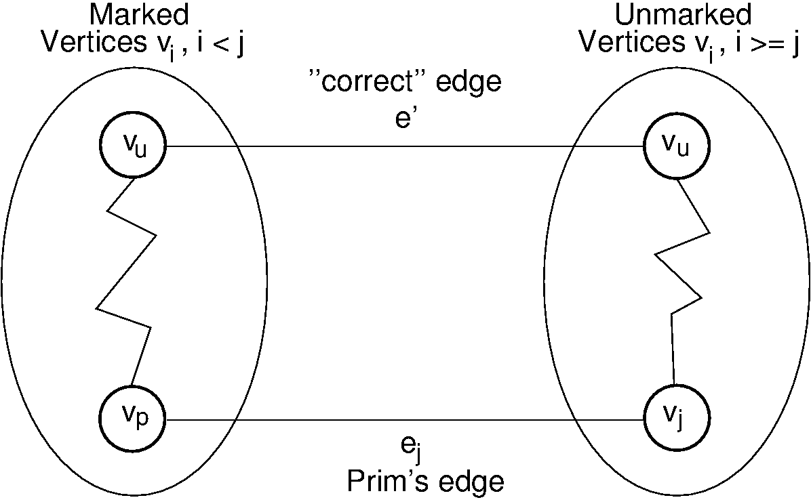

*Figure 11.6.2: Prim’s MCST algorithm proof.
The left oval contains that portion of the graph where Prim’s MCST
and the “true” MCST $\mathbf{T}$ agree.
The right oval contains the rest of the graph.
The two portions of the graph are connected by (at least) edges
$e_j$ (selected by Prim’s algorithm to be in the MCST) and
$e'$ (the “correct” edge to be placed in the MCST).
Note that the path from $v_w$ to $v_j$ cannot
include any marked vertex $v_i, i \leq j$, because to do so
would form a cycle.*


<a id="kruskal-s-algorithm"></a>
# 11.7. Kruskal’s Algorithm

<a id="id1"></a>
## 11.7.1. Kruskal’s Algorithm

Our next MCST algorithm is commonly referred to as
[Kruskal’s algorithm](Glossary.md#term-kruskal-s-algorithm).
Kruskal’s algorithm is also a simple, greedy algorithm.
First partition the set of vertices into $|\mathbf{V}|$
[disjoint sets](UnionFind.md#unionfind),
each consisting of one vertex.
Then process the edges in order of weight.
An edge is added to the MCST, and two disjoint sets combined,
if the edge connects two vertices in different disjoint sets.
This process is repeated until only one disjoint set remains.

The edges can be processed in order of weight by using a
min-heap.
This is generally faster than sorting the edges first, because in
practice we need only visit a small fraction of the edges before
completing the MCST.
This is an example of finding only a
[few smallest elements](Heapsort.md#heapsort) in a list.

The only tricky part to this algorithm is determining if two vertices
belong to the same equivalence class.
Fortunately, the ideal algorithm is available for the purpose —
the [UNION/FIND](UnionFind.md#unionfind).
Here is an implementation for Kruskal’s algorithm.
Class `KruskalElem` is used to store the edges on the min-heap.

```java
// Kruskal's MST algorithm
void Kruskal(Graph G) {
  ParPtrTree A = new ParPtrTree(G.nodeCount()); // Equivalence array
  KVPair[] E = new KVPair[G.edgeCount()];       // Minheap array
  int edgecnt = 0; // Count of edges

  for (int i=0; i<G.nodeCount(); i++) {         // Put edges in the array
    int[] nList = G.neighbors(i);
    for (int w=0; w<nList.length; w++)
      E[edgecnt++] = new KVPair(G.weight(i, nList[w]), new int[]{i,nList[w]});
  }
  MinHeap H = new MinHeap(E, edgecnt, edgecnt);
  int numMST = G.nodeCount();                   // Initially n disjoint classes
  for (int i=0; numMST>1; i++) {        // Combine equivalence classes
    KVPair temp = H.removemin();        // Next cheapest edge
    if (temp == null) return;           // Must have disconnected vertices
    int v = ((int[])temp.value())[0];
    int u = ((int[])temp.value())[1];
    if (A.differ(v, u)) {               // If in different classes
      A.UNION(v, u);                    // Combine equiv classes
      AddEdgetoMST(v, u);               // Add this edge to MST
      numMST--;                         // One less MST
    }
  }
}
```

Kruskal’s algorithm is dominated by the time required to
process the edges.
The `differ` and `UNION` functions are nearly
constant in time if path compression and weighted union is used.
Thus, the total cost of the algorithm is
$\Theta(|\mathbf{E}| \log |\mathbf{E}|)$ in the worst case,
when nearly all edges must be processed before all the edges of the
spanning tree are found and the algorithm can stop.
More often the edges of the spanning tree are the shorter ones,and
only about $|\mathbf{V}|$ edges must be processed.
If so, the cost is often close to
$\Theta(|\mathbf{V}| \log |\mathbf{E}|)$ in the average case.


<a id="all-pairs-shortest-paths"></a>
# 11.8. All-Pairs Shortest Paths

We next consider the problem of finding the shortest distance
between all pairs of vertices in the graph, called
the [all-pairs shortest paths problem](Glossary.md#term-all-pairs-shortest-paths-problem).
To be precise, for every $u, v \in \mathbf{V}$,
calculate $d(u, v)$.

One solution is to run [Dijkstra’s algorithm](Glossary.md#term-dijkstra-s-algorithm)
for finding the [shortest path](Glossary.md#term-single-source-shortest-paths-problem)
$|\mathbf{V}|$ times, each
time computing the shortest path from a different start vertex.
If $\mathbf{G}$ is sparse
(that is, $|\mathbf{E}| = \Theta(|\mathbf{V}|)$)
then this is a good solution, because the total cost will be
$\Theta(|\mathbf{V}|^2 + |\mathbf{V}||\mathbf{E}| \log
|\mathbf{V}|) = \Theta(|\mathbf{V}|^2 \log |\mathbf{V}|)$
for the version of Dijkstra’s algorithm based on priority queues.
For a dense graph, the priority queue version of Dijkstra’s algorithm
yields a cost of $\Theta(|\mathbf{V}|^3 \log |\mathbf{V}|)$,
but the version using `MinVertex` yields a cost
of $\Theta(|\mathbf{V}|^3)$.

Another solution that limits processing time to
$\Theta(|\mathbf{V}|^3)$
regardless of the number of edges is known as Floyd’s algorithm.
It is an example of dynamic programming.
The chief problem with solving this problem is organizing the search
process so that we do not repeatedly solve the same subproblems.
We will do this organization through the use of the $k$-path.
Define a [k-path](Glossary.md#term-k-path) from vertex $v$ to vertex
$u$ to be any path whose intermediate vertices (aside from
$v$ and $u$) all have indices less than $k$.
A 0-path is defined to be a direct edge from $v$ to $u$.
Figure [11.8.1](Floyd.md#floydexamp) illustrates the concept of
$k$-paths.


*Figure 11.8.1: An example of $k$-paths in Floyd’s algorithm.
Path 1, 3 is a 0-path by definition.
Path 3, 0, 2 is not a 0-path, but it is a 1-path (as well as a
2-path, a 3-path, and a 4-path) because the largest intermediate
vertex is 0.
Path 1, 3, 2 is a 4-path, but not a 3-path because the intermediate
vertex is 3.
All paths in this graph are 4-paths.*

Define ${\rm D}_k(v, u)$ to be the length of the shortest
$k$-path from vertex $v$ to vertex $u$.
Assume that we already know the shortest $k$-path from $v$
to $u$.
The shortest $(k+1)$-path either goes through vertex $k$
or it does not.
If it does go through $k$, then the best path is
the best $k$-path from $v$ to $k$ followed by the
best $k$-path from $k$ to $u$.
Otherwise, we should keep the best $k$-path seen before.
Floyd’s algorithm simply checks all of the possibilities in a triple
loop.
Here is the implementation for Floyd’s algorithm.
At the end of the algorithm, array `D` stores the all-pairs shortest
distances.

```java
/** Compute all-pairs shortest paths */
static void Floyd(Graph G, int[][] D) {
  for (int i=0; i<G.n(); i++) // Initialize D with weights
    for (int j=0; j<G.n(); j++)
      if (G.weight(i, j) != 0) D[i][j] = G.weight(i, j);
  for (int k=0; k<G.n(); k++) // Compute all k paths
    for (int i=0; i<G.n(); i++)
      for (int j=0; j<G.n(); j++)
        if ((D[i][k] != Integer.MAX_VALUE) &&
            (D[k][j] != Integer.MAX_VALUE) &&
            (D[i][j] > (D[i][k] + D[k][j])))
          D[i][j] = D[i][k] + D[k][j];
}
```

Clearly this algorithm requires $\Theta(|\mathbf{V}|^3)$ running
time, and it is the best choice for dense graphs because it is
(relatively) fast and easy to implement.


---

# Chapter 12   Sorting


<a id="chapter-introduction-sorting"></a>
# 12.1. Chapter Introduction: Sorting

We sort many things in our everyday lives:
A handful of cards when playing Bridge;
bills and other piles of paper; jars of spices; and so on.
And we have many intuitive strategies that we can use to do the
sorting, depending on how many objects we have to sort and how hard
they are to move around.
Sorting is also one of the most frequently performed computing tasks.
We might sort the records in a database so that we can search the
collection efficiently.
We might sort customer records by zip code so that when we print an
advertisement we can then mail them more cheaply.
We might use sorting to help an algorithm to solve some other
problem.
For example, [Kruskal’s algorithm](Glossary.md#term-kruskal-s-algorithm) to find a
[minimal-cost spanning tree](MCST.md#mcst)
must sort the edges of a graph by their lengths before it can process
them.

Because sorting is so important, naturally it has been studied
intensively and many algorithms have been devised.
Some of these algorithms are straightforward adaptations of schemes we
use in everyday life.
For example, a natural way to sort your cards in a bridge hand is to
go from left to right, and place each card in turn in its correct
position relative to the other cards that you have already sorted.
This is the idea behind
[Insertion Sort](InsertionSort.md#insertionsort).
Other sorting algorithms are totally alien to how humans do things,
having been invented to sort thousands or even millions of records
stored on the computer.
For example, no normal person would use
[Quicksort](Quicksort.md#quicksort)
to order a pile of bills by date, even though Quicksort is the
standard sorting algorithm of choice for most software libraries.
After years of study, there are still unsolved problems related to
sorting.
New algorithms are still being developed and refined for
special-purpose applications.

Along with introducing this central problem in computer science,
studying sorting algorithms helps us to understand
issues in algorithm design and analysis.
For example, the sorting algorithms in this chapter show multiple
approaches to using [divide and conquer](Glossary.md#term-divide-and-conquer).
In particular, there are multiple ways to do the dividing.
[Mergesort](Mergesort.md#mergesort) divides a list in half.
[Quicksort](Quicksort.md#quicksort) divides a list into big
values and small values.
[Radix Sort](RadixSort.md#radixsort) divides the problem by
working on one digit of the key at a time.
Sorting algorithms can also illustrate a wide variety of
algorithm analysis techniques.
Quicksort illustrates that it is possible for an algorithm to have an
[average case](Glossary.md#term-average-case) whose growth rate is significantly smaller than
its [worst case](Glossary.md#term-worst-case).
It is possible to speed up one sorting algorithm
(such as [Shellsort](Shellsort.md#shellsort) or Quicksort)
by taking advantage of the [best case](Glossary.md#term-best-case) behavior of another
algorithm (Insertion Sort).
Special case behavior by some sorting algorithms makes them a
good solution for special niche applications
([Heapsort](Heapsort.md#heapsort)).
Sorting provides an example of an important technique for
analyzing the lower bound for a problem.
[External Sorting](Glossary.md#term-external-sort) refers to the
process of sorting large files stored on disk.

This chapter covers several standard algorithms appropriate
for sorting a collection of records that fit into the computer’s
main memory.
It begins with a discussion of three simple, but relatively slow,
algorithms that require $\Theta(n^2)$
time in the average and worst cases to sort $n$ records.
Several algorithms with considerably better performance are then
presented, some with $\Theta(n \log n)$ worst-case running
time.
The final sorting method presented requires only
$\Theta(n)$ worst-case time under special conditions
(but it cannot run that fast in the general case).
The chapter concludes with a proof that sorting in general
requires $\Omega(n \log n)$ time in the worst case.


<a id="sorting-terminology-and-notation"></a>
# 12.2. Sorting Terminology and Notation

<a id="id1"></a>
## 12.2.1. Sorting Terminology and Notation

Given a set of records $r_1$, $r_2$, …, $r_n$
with associated key values $k_1$, $k_2$, …, $k_n$,
the [Sorting Problem](Glossary.md#term-sorting-problem) is to
arrange the records into any order $s$ such that records
$r_{s_1}$, $r_{s_2}$, …, $r_{s_n}$
have keys obeying the property
$k_{s_1} \leq k_{s_2} \leq ... \leq k_{s_n}$.
In other words, the sorting problem is to arrange a set of records so
that the values of their key fields are in non-decreasing order.

As defined, the Sorting Problem allows input with two or more
records that have the same key value.
Certain applications require that input not contain
duplicate key values.
Typically, sorting algorithms can handle duplicate key values unless
noted otherwise.

When duplicate key values are allowed, there might be an implicit
ordering to the duplicates, typically based on their order of
occurrence within the input.
It might be desirable to maintain this initial ordering among
duplicates.
A sorting algorithm is said to be [stable](Glossary.md#term-stable) if it does not
change the relative ordering of records with identical key values.
Many, but not all, of the sorting algorithms presented in this chapter
are stable, or can be made stable with minor changes.

When comparing two sorting algorithms, the simplest approach would be to
program both and measure their running times.
This is an example of
[empirical comparison](SortingEmpirical.md#sortingempirical).
However, doing fair empirical comparisons can be tricky because
the running time for many sorting algorithms depends on specifics of
the input values.
The number of records, the size of the keys and the records,
the allowable range of the key values, and the amount
by which the input records are “out of order” can all greatly affect
the relative running times for sorting algorithms.

When analyzing sorting algorithms, it is traditional to measure the
cost by counting the number of comparisons made between keys.
This measure is usually closely related to the actual running time for
the algorithm and has the advantage of being machine and data-type
independent.
However, in some cases records might be so large that their physical
movement might take a significant fraction of the total running time.
If so, it might be appropriate to measure the cost by counting the
number of swap operations performed by the algorithm.
In most applications we can assume that all records and keys are of
fixed length, and that a single comparison or a single swap operation
requires a constant amount of time regardless of which keys are
involved.
However, some special situations “change the rules” for comparing
sorting algorithms.
For example, an application with records or keys having widely
varying length (such as sorting a sequence of variable length strings)
cannot expect all comparisons to cost roughly the same.
Not only do such situations require special measures for analysis,
they also will usually benefit from a special-purpose sorting
technique.

Other applications require that a small number of records be
sorted, but that the sort be performed frequently.
An example would be an application that repeatedly sorts groups of
five numbers.
In such cases, the constants in the runtime equations that usually
get ignored in asymptotic analysis now become crucial.
Note that recursive sorting algorithms end up sorting lots of small
lists as well.

Finally, some situations require that a sorting algorithm use as
little memory as possible.
We will call attention to sorting algorithms that require significant
extra memory beyond the input array.


<a id="insertion-sort"></a>
# 12.3. Insertion Sort

<a id="id1"></a>
## 12.3.1. Insertion Sort

What would you do if you have a stack of phone bills from the past
two years and you want to order by date?
A fairly natural way to handle this is to look at the first two
bills and put them in order.
Then take the third bill and put it into the right position with
respect to the first two, and so on.
As you take each bill, you would add it to the sorted pile that you
have already made.
This simple approach is the inspiration for
our first sorting algorithm, called [Insertion Sort](Glossary.md#term-insertion-sort).

Insertion Sort iterates through a list of records.
For each iteration, the current record is inserted in turn at the
correct position within a sorted list composed of those records
already processed.
Here is an implementation.
The input is an array named `A` that stores $n$ records.

```java
static <T extends Comparable<T>> void inssort(T[] A) {
  for (int i=1; i<A.length; i++) // Insert i'th record
    for (int j=i; (j>0) && (A[j].compareTo(A[j-1]) < 0); j--)
      swap(A, j, j-1);
}
```

(Note that to make the explanation for these sorting algorithms as
simple as possible, our visualizations will show the array as though
it stored simple integers rather than more complex records.
But you should realize that in practice, there is rarely any point
to sorting an array of simple integers.
Nearly always we want to sort more complex records that each have a
[key](Glossary.md#term-key) value.
In such cases we must [have a way](Comparison.md#comparison) to
associate a key value with a record.
The sorting algorithms will simply assume that the records are
[comparable](Glossary.md#term-comparable).)

Here we see the first few iterations of Insertion Sort.

This continues on with each record in turn.
Call the current record $x$.
Insertion Sort will move it to the left so
long as its value is less than that of the record immediately
preceding it.
As soon as a key value less than or equal to $x$ is
encountered, `inssort` is done with that record because all
records to its left in the array must have smaller keys.

<a id="insertion-sort-analysis"></a>
## 12.3.2. Insertion Sort Analysis

While the best case is significantly faster than the average and worst
cases, the average and worst cases are usually more reliable
indicators of the “typical” running time.
However, there are situations where we can expect the input to be in
sorted or nearly sorted order.
One example is when an already sorted list is slightly disordered by a
small number of additions to the list;
restoring sorted order using Insertion Sort might be a good idea if we
know that the disordering is slight.
And even when the input is not perfectly sorted, Insertion Sort’s cost
goes up in proportion to the number of inversions.
So a “nearly sorted” list will always be cheap to sort with Insertion
Sort.
Examples of algorithms that take advantage of Insertion Sort’s
near-best-case running time are
[Shellsort](Shellsort.md#shellsort)
and [Quicksort](Quicksort.md#quicksort).

Counting comparisons or swaps yields similar results.
Each time through the inner `for` loop yields both a
comparison and a swap, except the last (i.e., the comparison that
fails the inner `for` loop’s test), which has no swap.
Thus, the number of swaps for the entire sort operation is
$n-1$ less than the number of comparisons.
This is 0 in the best case, and $\Theta(n^2)$ in the
average and worst cases.

Later we will see algorithms whose growth rate is much
better than $\Theta(n^2)$.
Thus for larger arrays, Insertion Sort will not be so good a
performer as other algorithms.
So Insertion Sort is not the best sorting algorithm to use in most
situations.
But there are special situations where it is ideal.
We already know that Insertion Sort works great when the input is
sorted or nearly so.
Another good time to use Insertion Sort is when the array is very
small, since Insertion Sort is so simple.
The algorithms that have better asymptotic growth rates tend to be
more complicated, which leads to larger constant factors in their
running time.
That means they typically need fewer comparisons for larger arrays,
but they cost more per comparison.
This observation might not seem that helpful, since even an algorithm
with high cost per comparison will be fast on small input sizes.
But there are times when we might need to do many, many sorts on very
small arrays.
You should spend some time right now trying to think of a situation
where you will need to sort many small arrays.
Actually, it happens a lot.

See [Computational Fairy Tales: Why Tailors Use Insertion Sort](http://computationaltales.blogspot.com/2011/04/why-tailors-use-insertion-sort.html) for a discussion on how the relative costs of search and insert can
affect what is the best sort algorithm to use.


<a id="bubble-sort"></a>
# 12.4. Bubble Sort

<a id="id1"></a>
## 12.4.1. Bubble Sort

Our next sorting algorithm is called [Bubble Sort](Glossary.md#term-bubble-sort).
Bubble Sort is often taught to novice programmers in
introductory computer science courses.
This is unfortunate, because Bubble Sort has no redeeming features
whatsoever.
It is rather slow, even compared to the other $\Theta(n^2)$
sorts that are commonly known.
It is not particularly intutitive –
nobody is going to come naturally to Bubble Sort as a way to sort
their Bridge hand or their pile of bills like they might with
[Insertion Sort](InsertionSort.md#insertionsort) or
[Selection Sort](SelectionSort.md#selectionsort).
However, Bubble Sort can viewed as a close relative of
Selection Sort.

Like Insertion Sort, Bubble Sort consists of a simple double `for`
loop.
The inner `for` loop moves through the record array from left to
right, comparing adjacent keys.
If a record’s key value is greater than the key of its right
neighbor, then the two records are swapped.
Once the record with the largest key value is encountered, this
process will cause it to “bubble” up to the right of the array
(which is where Bubble Sort gets its name).
The second pass through the array repeats this process.
However, because we know that the record with the largest value
already reached the right of the array on the first pass, there is no
need to compare the rightmost two records on the second pass.
Likewise, each succeeding pass through the array compares adjacent
records, looking at one less record toward the end than did the
preceding pass.
Here is an implementation.

```java
static <T extends Comparable<T>> void bubblesort(T[] A) {
  for (int i=0; i<A.length-1; i++) // Insert i'th record
    for (int j=1; j<A.length-i; j++)
      if (A[j-1].compareTo(A[j]) > 0)
        swap(A, j-1, j);
}
```

Now we continue with the second pass. However, since the largest
record has “bubbled” to the very right, we will not need to look at
it again.

Bubble Sort continues in this way until the entire array is sorted.

The following visualization shows the complete Bubble Sort.
You can input your own data if you like.

Now try for yourself to see if you understand how Bubble Sort works.

<a id="bubble-sort-analysis"></a>
## 12.4.2. Bubble Sort Analysis

The following visualization illustrates the running time analysis of
Bubble Sort.

Thus, Bubble Sort’s running time is roughly the same
in the best, average, and worst cases.

The number of swaps required depends on how often a
record’s value is less than that of the record immediately preceding
it in the array.
We can expect this to occur for about half the comparisons in the
average case, leading to $\Theta(n^2)$ for the
expected number of swaps.
The actual number of swaps performed by Bubble Sort will be identical
to that performed by Insertion Sort.

Here are some review questions to check your understanding of
Bubble Sort.


<a id="selection-sort"></a>
# 12.5. Selection Sort

<a id="id1"></a>
## 12.5.1. Selection Sort

Consider again the problem of sorting a pile of phone bills for the
past year.
Another intuitive approach might be to look through the pile until you
find the bill for January, and pull that out.
Then look through the remaining pile until you find the bill for
February, and add that behind January.
Proceed through the ever-shrinking pile of bills to select the next
one in order until you are done.
This is the inspiration for
our last $\Theta(n^2)$ sort,
called [Selection Sort](Glossary.md#term-selection-sort).
The $i$’th pass of Selection Sort “selects” the $i$’th
smallest key in the array, placing that record at the start of the array.
In other words, Selection Sort first finds the smallest key in an
unsorted list, then the next smallest, and so on.
Its unique feature is that there are few record swaps.
To find the next-smallest key value requires searching through
the entire unsorted portion of the array, but only one swap is
required to put the record into place.
Thus, the total number of swaps required will be $n-1$
(we get the last record in place “for free”).

Here is an implementation for Selection Sort.

```java
static <T extends Comparable<T>> void selsort(T[] A) {
  for (int i=0; i<A.length-1; i++) {         // Select i'th smallest record
    int smallindex = i;                      // Current smallest index
    for (int j=i+1; j<A.length; j++)         // Find the min value
      if (A[j].compareTo(A[smallindex]) < 0) // Found something smaller
        smallindex = j;                      // Remember smaller index
    swap(A, i, bigindex);                    // Put it into place
  }
}
```

Consider the example of the following array.

Now we continue with the second pass.
However, since the smallest record is already at the beginning,
we will not need to look at it again.

Selection Sort continues in this way until the entire array is sorted.

The following visualization puts it all together.

Now try for yourself to see if you understand how Selection Sort works.

<a id="selection-sort-analysis"></a>
## 12.5.2. Selection Sort Analysis

Any algorithm can be written in slightly different ways.
For example, we could have written Selection Sort to find the largest
record, the next largest, and so on. Such a version of selection sort
would essentially be a Bubble Sort, except that rather than repeatedly
swapping adjacent values to get the next largest record into place, we
instead remember the position of the record to be selected and do one
swap at the end.

This visualization analyzes the number of comparisons and swaps required
by Selection Sort.

There is another approach to keeping the cost of swapping records low,
and it can be used by any sorting algorithm even when the records are
large.
This is to have each element of the array store a pointer to a record
rather than store the record itself.
In this implementation, a swap operation need only exchange the
pointer values.
The large records do not need to move.
This technique is illustrated by the following visualization.
Additional space is needed to store the pointers, but the
return is a faster swap operation.

Here are some review questions to check how well you understand
Selection Sort.


<a id="the-cost-of-exchange-sorting"></a>
# 12.6. The Cost of Exchange Sorting

<a id="id1"></a>
## 12.6.1. The Cost of Exchange Sorting

Here is a summary for the cost of Insertion Sort,
Bubble Sort, and Selection Sort in terms of their required number of
comparisons and swaps in the best, average, and worst cases.
The running time for each of these sorts is
$\Theta(n^2)$ in the average and worst cases.

<a id="equation-exchangesort-0"></a>
$$
\begin{aligned}\begin{array}{rccc}
&\textbf{Insertion}&\textbf{Bubble}&\textbf{Selection}\\
\textbf{Comparisons:}&&&\\
\textrm{Best Case}&\Theta(n)&\Theta(n^2)&\Theta(n^2)\\
\textrm{Average Case}&\Theta(n^2)&\Theta(n^2)&\Theta(n^2)\\
\textrm{Worst Case}&\Theta(n^2)&\Theta(n^2)&\Theta(n^2)\\\\
\textbf{Swaps:}&&&\\
\textrm{Best Case}&0&0&\Theta(n)\\
\textrm{Average Case}&\Theta(n^2)&\Theta(n^2)&\Theta(n)\\
\textrm{Worst Case}&\Theta(n^2)&\Theta(n^2)&\Theta(n)\\\end{array}\end{aligned}
$$

The remaining sorting algorithms presented in this tutorial are
significantly better than these three under typical conditions.
But before continuing on, it is instructive to investigate what makes
these three sorts so slow.
The crucial bottleneck is that only *adjacent* records are compared.
Thus, comparisons and moves (for Insertion and Bubble Sort) are by
single steps.
Swapping adjacent records is called an [exchange](Glossary.md#term-exchange).
Thus, these sorts are sometimes referred to as an
[exchange sort](Glossary.md#term-exchange-sort).
The cost of any exchange sort can be at best the total number of
steps that the records in the array must move to reach their
“correct” location.
Recall that this is at least the number of
inversions for the record, where an inversion occurs when a
record with key value greater than the current record’s key value
appears before it.

<a id="analysis"></a>
## 12.6.2. Analysis


<a id="optimizing-sort-algorithms-with-code-tuning"></a>
# 12.7. Optimizing Sort Algorithms with Code Tuning

<a id="code-tuning-for-simple-sorting-algorithms"></a>
## 12.7.1. Code Tuning for Simple Sorting Algorithms

Since sorting is such an important application,
it is natural for programmers to want
to optimize their sorting code to run faster.
Of course all quadratic sorts (Insertion Sort, Bubble Sort and
Selection Sort) are relatively slow.
Each has (as the name “quadratic suggests)
$\Theta(n^2)$ worst case running time.
The best way to speed them up is to find a better sorting algorithm.
Nonetheless, there have been many suggestions given over the years
about how to speed up one or another of these particular algorithms.
There are useful lessons to be learned about code tuning by
seeing which of these ideas actually turn out to give better
performance.
It is also interesting to see the relative performance of the three
algorithms, as well as how various programming languages compare.

We start by trying to speed up Insertion Sort.
Recall that Insertion Sort repeatedly moves an element toward the
beginning of the sorted part of the list until it encounters a key
with lesser value.
In the original code, this is done with a series of swap operations.
There is a better alternative than continuously swapping the
record to the left until a smaller value is found.
This is to move the current record to a temporary
variable, and then shift all of the records with greater value one
step to the right.
Since swap requires three assignments per element and shifting
requires only one assignment per element,
we can hope that this will yield a big improvement.
Of course, the amount of improvement that we actually get will depend
on how much movement there is among the records.
If the list is already nearly sorted, then there will be few swaps
anyway.
Here is an implementation for Insertion Sort using this optimization.

```java
// Instead of swapping, "shift" the values down the array
static void inssortshift(int[] A) {
  for (int i=1; i<A.length; i++) { // Insert i'th record
    int j;
    int temp = A[i];
    for (j=i; (j>0) && (temp < A[j-1]); j--)
      A[j] = A[j-1];
    A[j] = temp;
  }
}
```

Now, you can test whether you understand how this works.

**Table 12.7.1**

Empirical comparison of proposed optimizations to quadratic sort
implementations.
Each sorting algorithm is run on a random integer
array with 10,000 items. Times are in milliseconds.
The arrays being sorted use the Comparable interface in
languages that support this.

<a id="equation-sortopt-0"></a>
$$
\begin{aligned}\begin{array}{l|rrrr}
\hline
\textbf{Sort} & \textbf{Java}& \textbf{Processing} & \textbf{JavaScript}&
\textbf{Python}\\
\hline
\textbf{Insertion Sort}&&&&\\
\textrm{Standard}    &  60 &  26 & 118 & 11,220\\
\textrm{Shifting}    &  41 &  18 &  77 &  5,100\\
\hline
\textbf{Bubble Sort}&&&&\\
\textrm{Standard}    & 202 & 149 & 303 & 12,700\\
\textrm{Check Swaps} & 230 & 152 & 327 & 13,275\\
\hline
\textbf{Selection Sort}&&&&\\
\textrm{Standard}    & 104 &  65 & 158 &  4,000\\
\textrm{Check Swaps} & 104 &  65 & 155 &  4,050\\
\hline&&&&\end{array}\end{aligned}
$$

Table [12.7.1](SortOpt.md#optimizetable) shows the relative costs for
a number of optimizations in four programming languages: Java,
JavaScipt, Processing, and Python.

The programming language that you use can have a big influence on the
runtime for a program.
Perhaps the greatest distinction is whether your language is compiled
or not.
Java, C++, and Processing are normally compiled, while JavaScript and
Python are normally interpreted.
This can make a huge difference in whether a given code change will
actually speed the program up or not.
In the case of the “shift” vs “swap” choice, shifting always turns out
to be a big improvement.
This is more true for the interpreted languages JavaScript and
Python than for Java and Processing, but still an improvement
either way.
But the biggest effect that we see is that Python takes
over 100 times as long to execute the same program as Java.

Some languages have peculiarities that it pays to be aware of.
It turns out that there is a big difference in JavaScript between
using `i < n` or `i != n` to test termination of a loop.

Turning to Bubble Sort, the first thing we should notice from this
table is that it is far slower on random input than Insertion Sort.
Let’s consider a possible improvement that is sometimes suggested
for Bubble Sort.
That is to check during each iteration of the outer loop to see if any
swaps took place during that iteration, and quit if not
(since we know the list is ordered at this point).
We can improve on this idea even more by recognizing that if the last
swap done affects the values at positions $i$ and $i+1$,
no swaps could happen to values at positions greater than $i$.
Thus, we never need to check higher-positioned values again, which
could save many iterations even if there are a few swaps lower down.
Here is code to implement this approach.

```java
static <T extends Comparable<T>> void bubblecheckswap(T[] A) {
  int n = A.length - 1;
  while (n > 0) {
    int newn = 0;
    for (int i = 0; i < n; i++) {
      /* if this pair is out of order */
      if (A[i].compareTo(A[i+1]) > 0) {
        swap(A, i, i+1);
        newn = i;
      }
    }
    n = newn;
  }
}
```

The problem with this idea is that a considerable amount of effort
(relatively speaking) is required to track the position for the last
swap within the inner loop.
This tracking process has a cost, and that cost is worthwhile only if
the amount of work it saves is greater than the amout of work that it
causes.
Unfortunately, as the table shows, in the average case it just is not
worth the time.
Modifying the code simply by removing the tracking steps (and so not
getting either the cost of tracking or the benefit of avoiding some of
the key comparisons) is faster in the average case.
Of course, whether this is always true will depend on how much it
costs to extract the record keys and compare them, which depends on
the details of the record type and the sort implementation.
In our test implementation we are sorting integer values and so the
cost to compare records is lower than it would be if we had to get a
field out of a more complex object.

It is also true that tracking the last swap position can substantially
improve the best case cost.
In fact, tracking the last swap position makes the best case cost of
Bubble Sort to be only $\Theta(n)$.
But going out of one’s way to artificially improve the best case has
dubious value if doing so imposes additional cost on nearly all other
inputs.
Note that we could nominally convert *any* sorting algorithm to
have a best-case cost of $\Theta(n)$ by simply adding code at
the beginning that checks if the list is already sorted.
It should be obvious that this is a waste of time, even though it has
the (small) possibility of winning big.
Unlike Insertion Sort whose best case cost is naturally
$\Theta(n)$ and whose time increases in proportion to how “out
of order” the list is,
the number of iterations avoided by swap checking in Bubble Sort
is sensitive to the detailed placements of the out-of-order records.
In fact, if we took a sorted list and moved the smallest value to the
end, then there would be no benefit from swap checking whatsoever.

Finally, let’s consider Selection Sort.
The table shows foremost that Selection Sort can be viewed as a far
better optimization to Bubble Sort than tracking the last swap
position.
That is, tracking the position of the largest element and performing
one swap to put it into place is a far better optimization to Bubble
Sort than tracking the position of the last swap seen.
The table also shows that Selection Sort is faster in the average case
than Insertion Sort when implemented in Python.
Evidently, the cost to swap is high for Python.

Our original Selection Sort implementation is written to make a call
to `swap` even if the current record is already in its correct
location.
For example, if the record with the largest value is already in the
rightmost array position, then `selsort` will still call `swap`
with the two position parameters being the same.
The net effect is that the work done by `swap` will not change
anything in the array, and this is a waste of time.
Thus, the total number of swaps done by Selection Sort is always
$n-1$ in the best, average and worst cases.
It might seem like a good idea to test if the positions are the same
before calling `swap`, especially since Selection Sort’s claim to
fame is its low number of swaps.
Actually, we can’t expect this to ever make much difference since we
are talking about $\Theta(n)$ actions within $\Theta(n^2)$
total steps, an inconsequential fraction.
The other consideration is whether this is could typically be expected
to save time even when just considering the time needed to do the
swaps.
Doing the check to see if a swap is necessary also takes some time.
It is only worthwhile to test if the time required by the test is more
than made up for by the work saved when the unnecessary swap was
avoided.
For randomly ordered input, it is probably more expensive to test
this condition before every swap than to just do the swap.
If the input records are already sorted, then all of the swaps are
unnecessary and it would be (trivially) faster to test.
But in the average case, few swaps will be saved this way and the
“optimization” might actually slow down the program (but only
slightly).

For all of these sorting algorithms, the `swap` function call might
be a key part of the cost since it is called so many times.
A simple way to speed things up is to replace this function call with
the code that the function would perform.
Depending on the language, compiler, and operating system, one might
expect to save between 5 and 10 percent of the total time by doing so.

Another important consideration is the type of data object being
used.
For Processing and Java, we use a simple Integer wrapper object that
supports the Comparable interface.
This means that some dereferencing of the key value from an object is
required, which is a typical expectation in a realistic application of
a sorting function.
However, if we were to sort a simple array of `int` values, the cost
for all sorting algorithms will be less than half that shown.
If we use a the more complicated `KVPair` objects, the costs will
more than double over those shown in the table.


<a id="index-1"></a>
# 12.8. Shellsort

<a id="id2"></a>
## 12.8.1. Shellsort

Shellsort was named for its inventor, D.L. Shell, who first published
it in 1959.
It is also sometimes called the [diminishing increment sort](Glossary.md#term-diminishing-increment-sort).
When properly implemented, [Shellsort](Glossary.md#term-shellsort) will give
substantially better performance than any of the $\theta(n^2)$
sorts like Insertion Sort or Selection Sort.
But it is also a bit more complicated than those simple
$\theta(n^2)$ sorts.
Unlike Insertion Sort and Selection Sort, there is no real-life
intuition to inspire Shellsort – nobody will use Shellsort to
sort their Bridge hand or organize their bills.
The key idea behind Shellsort is to exploit the best-case performance
of Insertion Sort.
Recall that when a list is sorted or nearly sorted, Insertion Sort
runs in linear time.
So Shellsort’s strategy is to quickly make the list “mostly sorted”,
so that a final Insertion Sort can finish the job.

Shellsort does what most good sorts do:
Break the input into pieces, sort the pieces, then recombine them.
But Shellsort does this in an unusual way, breaking its input
into “virtual” sublists that are often not contiguous.
Each such sublist is sorted using an Insertion Sort.
Another group of sublists is then chosen and sorted, and so on.

Shellsort works by performing its Insertion Sorts on carefully
selected sublists, first on small sublists and then on increasingly
large sublists.
So at each stage, any Insertion Sort is either working on a small list
(and so is fast) or is working on a nearly sorted list (and again is
fast).

Shellsort breaks the list into disjoint sublists, where a sublist
is defined by an “increment”, $I$.
Each record in a given sublist is $I$ positions apart.
For example, if the increment were 4, then each record in the sublist
would be 4 positions apart.

One possible implementation for Shellsort is to use increments that
are all powers of two.
We start by picking as $I$ the largest power of two less than
$n$.
This will generate $I$ sublists of 2 records each.
If there were 16 records in the array indexed from 0
to 15, there would initially be 8 sublists of 2 records each,
with each record in the sublist being 8 positions apart.
The first sublist would be the records in positions 0 and 8.
The second is in positions 1 and 9, and so on.

Actually, the increment size does not need to start at exactly
$n/2$.
In the following example, we will use an array of 12 records
(since 16 records makes the example a bit long).
We will still begin with an increment size of 8.
As you click through the following slideshow, you will see each of the
sublists of length 2.
If we reach a point where the remaining sublists have only one
record (as will be the case for each of the sublists beginning with
records 4 through 7), then we can skip processing them.

Shellsort will sort each of these sublists of length 2 using Insertion
Sort.
As you click through the next slideshow, you will first see the current
sublist highlighted in yellow.
Then a pair of records to be compared will be shown in blue.
They are swapped if necessary to put them in sort order.
(Of course, since these first sublists are each of length 2 when
the two items are being compared you won’t see anything yellow anymore!)

At the end of the first pass, the resulting array is “a little better
sorted”.

The second pass of Shellsort looks at fewer, bigger sublists.
In our example, the second pass will have an increment of size 4,
resulting in $n/4$ sublists.
Since the array in our example has $n=12$ records, we have
4 sublists that each have $12/4 = 3$ records.
Thus, the second pass would have as its first
sublist the 3 records in positions 0, 4, and 8.
The second sublist would have records in positions 1, 5, and 9,
and so on.

As you click through the slides, you will see the sublists for
increment size 4.

Each sublist of 3 records would also be sorted using an Insertion
Sort, as shown next.

At the end of processing sublists with increment 4, the array is
“even more sorted”.

The third pass will be made on sublists with increment 2.
The effect is that we process 2 lists, one consisting of the odd
positions and the other consisting of the even positions.
As usual, we sort the sublists using Insertion Sort.

At this point, we are getting close to sorted.

Shellsort’s final pass will always use an increment of 1,
which means a “regular” Insertion Sort of all records.
But the list is far closer to sorted than it was at the start,
so this final call to Insertion Sort runs far faster than if we had
run Insertion Sort on the original array.

Finally, the array is sorted.

Here is a code implementation for Shellsort.

```cpp
void shellsort(Comparable* A[], int n) {
  for (int i = n/2; i > 2; i /= 2)  //For each increment
    for (int j = 0; j < i; j++)  //Sort each sublist
      inssort2(A, j, i, n);
    inssort2(A, 0, 1, n);
}

// Modified Insertion Sort for varying increments
void inssort2(Comparable* A[], int start, int incr, int n) {
  for (int i = start+incr; i < n; i += incr)
    for (int j = i; ((j >= incr) && (*A[j] < *A[j-incr])); j -= incr) 
      swap(A, j, j-incr);
}
```

Now, test your understanding of the sublist concept.

<a id="putting-it-together"></a>
## 12.8.2. Putting It Together

There is a lot of flexibility to picking the increment series.
It does not need to start with the greatest power of less than
$n$ and cut in half each time.
In fact that is not even a good choice for the increment series.
We will come back to this later.
For now, just realize that so long as each increment is smaller than the
last, and the last increment is 1, Shellsort will work.

At this point try running Shellsort on an array of your chosen size,
with either random values or values that you select.
You can also set the increment series.
Use this visualization to make sure that you understand how Shellsort
works.

Next, let’s review what makes for a legal increment series.

<a id="shellsort-practice-exercise"></a>
## 12.8.3. Shellsort Practice Exercise

Now test yourself to see how well you understand Shellsort.
Can you reproduce its behavior?

<a id="optimizing-shellsort"></a>
## 12.8.4. Optimizing Shellsort

Some choices for the series of increments will make Shellsort
run more efficiently than others.
In particular, the choice of increments described above
$(2^k, 2^{k-1}, \ldots, 4, 2, 1)$ turns out to be relatively inefficient.
You should notice for example that all records in a given 8 increment
sublist are also part of some 4 increment sublist, which are all in turn
records of the same 2 increment sublist.
So there is no “crossover” between sublists as the increments
reduce.
A better choice is the following series based on “$3n+1$”:
(…, 121, 40, 13, 4, 1).
Another approach is to make sure that the various increments are
relatively prime.
The series (…, 11, 7, 3, 1) would be an example.
In this case, there is a lot of “crossover” between the lists at the
various increment sizes.

Now you are ready to try out some different increment series to see
how they affect the cost of Shellsort.

A theoretical analysis of Shellsort is difficult, so we must accept
without proof that the average-case performance of Shellsort
(for a reasonable increment series)
is $\Theta(n\sqrt{n}) = \Theta(n^{1.5})$.
Thus, Shellsort is substantially better than Insertion Sort,
or any of the other $\theta(n^2)$ sorts presented earlier.
In fact, Shellsort is not so much worse than the
asymptotically better sorts to be presented later,
whenever $n$ is of medium size (though it tends to be a little
slower than these other algorithms if they are well implemented).
Shellsort illustrates how we can sometimes exploit the special properties
of an algorithm (in this case Insertion Sort) even if in general that
algorithm is unacceptably slow.

<a id="shellsort-summary-questions"></a>
## 12.8.5. Shellsort Summary Questions

Here are some review questions to check that you understand Shellsort.

If you want to know more about Shellsort, you can find a lot of
details about its analysis along with ideas on how to pick a good
increment series in [KnuthV3].


<a id="mergesort-concepts"></a>
# 12.9. Mergesort Concepts

<a id="id1"></a>
## 12.9.1. Mergesort Concepts

A natural approach to problem solving is divide and conquer.
To use divide and conquer when sorting, we might consider breaking the
list to be sorted into pieces, process the pieces, and then put them
back together somehow.
A simple way to do this would be to split the list in half, sort
the halves, and then merge the sorted halves together.
This is the idea behind [Mergesort](Glossary.md#term-mergesort).

Mergesort is one of the simplest sorting algorithms conceptually,
and has good performance both in the asymptotic
sense and in empirical running time.
Unfortunately, even though it is based on a simple concept,
it is relatively difficult to implement in practice.
Here is a pseudocode sketch of Mergesort:

```
List mergesort(List inlist) {
  if (inlist.length() <= 1) return inlist;;
  List L1 = half of the items from inlist;
  List L2 = other half of the items from inlist;
  return merge(mergesort(L1), mergesort(L2));
}
```

Here is a visualization that illustrates how Mergesort works.

The hardest step to understand about Mergesort is the merge function.
The merge function starts by examining the first record of each
sublist and picks the smaller value as the smallest record overall.
This smaller value is removed from its sublist and placed into the
output list.
Merging continues in this way, comparing the front
records of the sublists and continually appending the smaller to the
output list until no more input records remain.

Here is pseudocode for merge on lists:

```
List merge(List L1, List L2) {
  List answer = new List();
  while (L1 != NULL || L2 != NULL) {
    if (L1 == NULL) { // Done L1
      answer.append(L2);
      L2 = NULL;
    }
    else if (L2 == NULL) { // Done L2
      answer.append(L1);
      L1 = NULL;
    }
    else if (L1.value() <= L2.value()) {
      answer.append(L1.value());
      L1 = L1.next();
    }
    else {
      answer.append(L2.value());
      L2 = L2.next();
    }
  }
  return answer;
}
```

Here is a visualization for the merge operation.

Here is a mergesort warmup exercise to practice merging.

<a id="mergesort-practice-exercise"></a>
## 12.9.2. Mergesort Practice Exercise

Now here is a full proficiency exercise to put it all together.

This visualization provides a running time analysis for Merge Sort.


<a id="implementing-mergesort"></a>
# 12.10. Implementing Mergesort

<a id="id1"></a>
## 12.10.1. Implementing Mergesort

Implementing Mergesort presents a number of technical difficulties.
The first decision is how to represent the lists.
Mergesort lends itself well to sorting a singly linked list because
merging does not require random access to the list elements.
Thus, Mergesort is the method of choice when the input is in the form
of a linked list.
Implementing `merge` for linked lists is straightforward,
because we need only remove items from the front of the input lists
and append items to the output list.
Breaking the input list into two equal halves presents some
difficulty.
Ideally we would just break the lists into front and back halves.
However, even if we know the length of the list in advance, it would
still be necessary to traverse halfway down the linked list to reach
the beginning of the second half.
A simpler method, which does not rely on knowing the length of the
list in advance, assigns elements of the input list alternating
between the two sublists.
The first element is assigned to the first sublist, the
second element to the second sublist, the third to first sublist, the
fourth to the second sublist, and so on.
This requires one complete pass through the input list to build the
sublists.

When the input to Mergesort is an array, splitting input into two
subarrays is easy if we know the array bounds.
Merging is also easy if we merge the subarrays into a second array.
Note that this approach requires twice the amount of space as any of
the sorting methods presented so far, which is a serious disadvantage
for Mergesort.
It is possible to merge the subarrays without using a second array,
but this is extremely difficult to do efficiently and is
not really practical.
Merging the two subarrays into a second array, while
simple to implement, presents another difficulty.
The merge process ends with the sorted list in the auxiliary array.
Consider how the recursive nature of Mergesort breaks
the original array into subarrays.
Mergesort is recursively called until subarrays of size 1 have been
created, requiring $\log n$ levels of recursion.
These subarrays are merged into subarrays of size 2, which are in
turn merged into subarrays of size 4, and so on.
We need to avoid having each merge operation
require a new array.
With some difficulty, an algorithm can be
devised that alternates between two arrays.  A much simpler approach
is to copy the sorted sublists to the auxiliary array first, and then
merge them back to the original array.

Here is a complete implementation for mergesort following this
approach.
The input records are in array `A`.
Array `temp` is used as a place to temporarily copy records during
the merge process.
Parameters `left` and `right` define the left and right
indices, respectively, for the subarray being sorted.
The initial call to `mergesort` would be
`mergesort(array, temparray, 0, n-1)`.

```cpp
void mergesort(Comparable* A[], Comparable* temp[], int left, int right) {
  if (left == right) return; // List has one record
  int mid = (left + right)/2; // Select midpoint
  mergesort(A, temp, left, mid); // Mergesort first half
  mergesort(A, temp, (mid+1), right); // Mergesort second half
  for (int i = left; i <= right; i++)  // Copy subarray to temp
    *temp[i] = *A[i];
  // Do the merge operation back to A
  int i1 = left;
  int i2 = mid + 1;
  for (int curr = left; curr <= right; curr++) {
    if (i1 == mid+1)   // Left sublist exhausted
      *A[curr] = *temp[i2++];
    else if (i2 > right)   // Right sublist exhausted 
      *A[curr] = *temp[i1++];
    else if (*temp[i1] <= *temp[i2])    // Get smaller value
      *A[curr] = *temp[i1++]; 
    else
      *A[curr] = *temp[i2++]; 
  }   
}
```

Here is a visualization for the merge step.

An optimized Mergesort implementation is shown below.
It reverses the order of the second subarray during the initial copy.
Now the current positions of the two subarrays work inwards from the
ends, allowing the end of each subarray to act as a sentinel for the
other.
Unlike the previous implementation, no test is needed to check for
when one of the two subarrays becomes empty.
This version also has a second optimization:
It uses Insertion Sort to sort small subarrays whenever the size of
the array is smaller than a value defined by `THRESHOLD`.

```cpp
void mergesortOpt(Comparable* A[], Comparable* temp[], int left, int right) {
  int i, j, k, mid = (left+right)/2;// Select the midpoint
  if (left == right) return;          // List has one record
  if ((mid-left) >= THRESHOLD) mergesortOpt(A, temp, left, mid);
  else inssort(A, left, mid);
  if ((right-mid) > THRESHOLD) mergesortOpt(A, temp, mid+1, right);
  else inssort(A, mid+1, right);
  // Do the merge operation.  First, copy 2 halves to temp.
  for (i=left; i<=mid; i++) *temp[i] = *A[i];
  for (j=right; j>mid; j--) *temp[i++] = *A[j];
  // Merge sublists back to array
  for (i=left,j=right,k=left; k<=right; k++)
    if (*temp[i] <= *temp[j]) *A[k] = *temp[i++];
    else *A[k] = *temp[j--];
}
```

Here is a visualization for the optimized merge step.


<a id="index-0"></a>
# 12.11. Quicksort

<a id="introduction"></a>
## 12.11.1. Introduction

While Mergesort uses the most obvious form of divide and conquer
(split the list in half then sort the halves), this is not the only way
that we can break down the sorting problem.
We saw that doing the merge step for Mergesort when using an array
implementation is not so easy.
So perhaps a different divide and conquer strategy might turn out to
be more efficient?

[Quicksort](Glossary.md#term-quicksort) is aptly named because, when properly
implemented, it is the fastest known general-purpose in-memory sorting
algorithm in the average case.
It does not require the extra array needed by Mergesort, so it is
space efficient as well.
Quicksort is widely used, and is typically the algorithm implemented
in a library sort routine such as the UNIX `qsort`
function.
Interestingly, Quicksort is hampered by exceedingly poor worst-case
performance, thus making it inappropriate for certain applications.

Before we get to Quicksort, consider for a moment the practicality
of using a Binary Search Tree for sorting.
You could insert all of the values to be sorted into the BST
one by one, then traverse the completed tree using an inorder traversal.
The output would form a sorted list.
This approach has a number of drawbacks, including the extra space
required by BST pointers and the amount of time required to insert
nodes into the tree.
However, this method introduces some interesting ideas.
First, the root of the BST (i.e., the first node inserted) splits the
list into two sublists:
The left subtree contains those values in the
list less than the root value while the right subtree contains those
values in the list greater than or equal to the root value.
Thus, the BST implicitly implements a “divide and conquer” approach
to sorting the left and right subtrees.
Quicksort implements this same concept in a much more efficient way.

Quicksort first selects a value called the [pivot](Glossary.md#term-pivot).
(This is conceptually like the root node’s value in the BST.)
Assume that the input array contains $k$ records with key values
less than the pivot.
The records are then rearranged in such a way that the $k$
values less than the pivot are placed in the first, or leftmost,
$k$ positions in the array, and the values greater than or equal
to the pivot are placed in the last, or rightmost, $n-k$
positions.
This is called a [partition](Glossary.md#term-partition) of the array.
The values placed in a given partition need not (and typically will
not) be sorted with respect to each other.
All that is required is that all values end up in the correct
partition.
The pivot value itself is placed in position $k$.
Quicksort then proceeds to sort the resulting subarrays now on either
side of the pivot, one of size $k$ and the other of size
$n-k-1$.
How are these values sorted?
Because Quicksort is such a good algorithm, using Quicksort on
the subarrays would be appropriate.

Unlike some of the sorts that we have seen earlier in this chapter,
Quicksort might not seem very “natural” in that it is not an
approach that a person is likely to use to sort real objects.
But it should not be too surprising that a really efficient sort for
huge numbers of abstract objects on a computer would be rather
different from our experiences with sorting a relatively few physical
objects.

Here is an implementation for Quicksort.
Parameters `i` and `j` define the left and right
indices, respectively, for the subarray being sorted.
The initial call to `quicksort` would be
`quicksort(array, 0, n-1)`.

```cpp
void quicksort(Comparable* A[], int i, int j) {
  int pivotindex = findpivot(i, j);
  swap(A, pivotindex, j); // Stick pivot at end
  // k will be the first position in the right subarray
  int k = partition(A, i, j-1,A[j]);
  swap(A, k, j);                       // Put pivot in place
  if ((k-i) > 1) quicksort(A, i, k-1); // Sort left partition
  if ((j-k) > 1) quicksort(A, k+1, j); // Sort right partition
}
```

Function `partition` will move records to the
appropriate partition and then return `k`, the first
position in the right partition.
Note that the pivot value is initially placed at the end of the array
(position `j`).
Thus, `partition` must not affect the value of array position `j`.
After partitioning, the pivot value is placed in position `k`,
which is its correct position in the final, sorted array.
By doing so, we guarantee that at least one value (the pivot) will not
be processed in the recursive calls to `qsort`.
Even if a bad pivot is selected, yielding a completely empty
partition to one side of the pivot, the larger partition will contain
at most $n-1$ records.

Selecting a pivot can be done in many ways.
The simplest is to use the first key.
However, if the input is sorted or reverse sorted, this will produce a
poor partitioning with all values to one side of the pivot.
It is better to pick a value at random, thereby reducing the chance of
a bad input order affecting the sort.
Unfortunately, using a random number generator is relatively
expensive, and we can do nearly as well by selecting the middle
position in the array.
Here is a simple `findpivot` function.

```cpp
int findpivot(int i, int j)
  { return (i+j)/2; }
```

<a id="partition"></a>
## 12.11.2. Partition

We now turn to function `partition`.
If we knew in advance how many keys are less than the pivot,
`partition` could simply copy records with key values less
than the pivot to the low end of the array, and records with larger
keys to the high end.
Because we do not know in advance how many keys are less than
the pivot,
we use a clever algorithm that moves indices inwards from the
ends of the subarray, swapping values as necessary until the two
indices meet.
Here is an implementation for the partition step.

```cpp
int partition(Comparable* A[], int left, int right, Comparable* pivot) {
  while (left <= right) { // Move bounds inward until they meet
    while (*A[left] < *pivot) left++;
    while ((right >= left)  && (*A[right] >= *pivot)) right--;
    if (right > left) swap(A, left, right);  // Swap out-of-place values
   }
  return left;           // Return first position in right partition
}
```

Note the check that `right >= left` in the second inner
`while` loop.
This ensures that `right` does not run off the low end of the
partition in the case where the pivot is the least value in that
partition.
Function `partition` returns the first index of the right
partition (the place where `left` ends at) so that the subarray
bound for the recursive calls to `qsort` can be determined.

And here is a visualization illustrating the running time analysis of the partition function

<a id="putting-it-together"></a>
## 12.11.3. Putting It Together

Here is a visualization for the entire Quicksort algorithm.
This visualization shows you how the logical decomposition caused by
the partitioning process works.
In the visualization, the separate sub-partitions are separated out to
match the recursion tree.
In reality, there is only a single array involved (as you will see in
the proficiency exercise that follows the visualization).

Here is a complete proficiency exercise to see how well you understand
Quicksort.

<a id="quicksort-analysis"></a>
## 12.11.4. Quicksort Analysis

This visualization explains the worst-case running time of Quick Sort

This is terrible, no better than Bubble Sort.
When will this worst case occur?
Only when each pivot yields a bad partitioning of the array.
If the pivot values are selected at random, then this is extremely
unlikely to happen.
When selecting the middle position of the current subarray, it is
still unlikely to happen.
It does not take many good partitionings for Quicksort to
work fairly well.

This visualization explains the best-case running time of Quick Sort

Quicksort’s average-case behavior falls somewhere
between the extremes of worst and best case.
Average-case analysis considers the cost for all possible arrangements
of input, summing the costs and dividing by the number of cases.
We make one reasonable simplifying assumption:
At each partition step, the pivot is
equally likely to end in any position in the (sorted) array.
In other words, the pivot is equally likely to break an array into
partitions of sizes 0 and $n-1$, or 1 and $n-2$, and so
on.

Given this assumption, the average-case cost is computed from the
following equation:

<a id="equation-quicksort-0"></a>
$$
{\bf T}(n) = cn + \frac{1}{n}\sum_{k=0}^{n-1}[{\bf T}(k) +
{\bf T}(n - 1 - k)],
\quad {\bf T}(0) = {\bf T}(1) = c.
$$

This visualization will help you to understand how this recurrence
relation was formed.

This is an unusual situation that the average case cost and the worst
case cost have asymptotically different growth rates.
Consider what “average case” actually means.
We compute an average cost for inputs of size $n$ by summing up
for every possible input of size $n$ the product of the running
time cost of that input times the probability that that input will
occur.
To simplify things, we assumed that every permutation is equally
likely to occur.
Thus, finding the average means summing up the cost for every
permutation and dividing by the number of permuations
(which is $n!$).
We know that some of these $n!$ inputs cost $O(n^2)$.
But the sum of all the permutation costs has to be
$(n!)(O(n \log n))$.
Given the extremely high cost of the worst inputs, there must be
very few of them.
In fact, there cannot be a constant fraction of the inputs with cost
$O(n^2)$.
If even, say, 1% of the inputs have cost $O(n^2)$, this would
lead to an average cost of $O(n^2)$.
Thus, as $n$ grows, the fraction of inputs with high cost must
be going toward a limit of zero.
We can conclude that Quicksort will run fast if
we can avoid those very few bad input permutations.
This is why picking a good pivot is so important.

The running time for Quicksort can be improved (by a constant factor),
and much study has gone into optimizing this algorithm.
Since Quicksort’s worst case behavior arises when the pivot does a
poor job of splitting the array into equal size subarrays,
improving `findpivot` seems like a good place to start.
If we are willing to do more work searching for a better pivot, the
effects of a bad pivot can be decreased or even eliminated.
Hopefully this will save more time than was added by the additional
work needed to find the pivot.
One widely-used choice is to use the “median of three” algorithm,
which uses as a pivot the middle of three randomly selected values.
Using a random number generator to choose the positions is relatively
expensive, so a common compromise is to look at the first, middle, and
last positions of the current subarray.
However, our simple `findpivot` function that takes the
middle value as its pivot has the virtue of making it highly unlikely
to get a bad input by chance, and it is quite cheap to implement.
This is in sharp contrast to selecting the first or last record as
the pivot, which would yield bad performance for many permutations
that are nearly sorted or nearly reverse sorted.

A significant improvement can be gained by recognizing that
Quicksort is relatively slow when $n$ is small.
This might not seem to be relevant if most of the time we sort
large arrays, nor should it matter how long Quicksort takes in the
rare instance when a small array is sorted because it will be fast
anyway.
But you should notice that Quicksort itself sorts many, many small
arrays!
This happens as a natural by-product of the divide and conquer
approach.

A simple improvement might then be to replace Quicksort with a faster
sort for small numbers, say Insertion Sort or Selection Sort.
However, there is an even better—and still simpler—optimization.
When Quicksort partitions are below a certain size, do nothing!
The values within that partition will be out of order.
However, we do know that all values in the array to the left of the
partition are smaller than all values in the partition.
All values in the array to the right of the partition are greater than
all values in the partition.
Thus, even if Quicksort only gets the values to
“nearly” the right locations, the array will be close to sorted.
This is an ideal situation in which to take advantage of the best-case
performance of Insertion Sort.
The final step is a single call to Insertion Sort to process the
entire array, putting the records into final sorted order.
Empirical testing shows that the subarrays should be left unordered
whenever they get down to nine or fewer records.

The last speedup to be considered reduces the cost of making
recursive calls.
Quicksort is inherently recursive, because each Quicksort operation
must sort two sublists.
Thus, there is no simple way to turn Quicksort into an iterative
algorithm.
However, Quicksort can be implemented using a stack
to imitate recursion, as the amount of information that must
be stored is small.
We need not store copies of a subarray, only the subarray bounds.
Furthermore, the stack depth can be kept small if care is taken on
the order in which Quicksort’s recursive calls are executed.
We can also place the code for `findpivot` and
`partition` inline to eliminate the remaining function
calls.
Note however that by not processing sublists of size nine or
less as suggested above, about three quarters of the function calls
will already have been eliminated.
Thus, eliminating the remaining function calls will yield only a
modest speedup.


<a id="index-0"></a>
# 12.12. Heapsort

<a id="id2"></a>
## 12.12.1. Heapsort

Our discussion of Quicksort began by considering the practicality of
using a BST for sorting.
The BST requires more space than the other sorting methods and will
be slower than Quicksort or Mergesort due to the relative expense of
inserting values into the tree.
There is also the possibility that the BST might be unbalanced,
leading to a $\Theta(n^2)$ worst-case running time.
Subtree balance in the BST is closely related to Quicksort’s partition
step.
Quicksort’s pivot serves roughly the same purpose as the BST root
value in that the left partition (subtree) stores values less than
the pivot (root) value, while the right partition (subtree) stores
values greater than or equal to the pivot (root).

A good sorting algorithm can be devised based on a tree structure more
suited to the purpose.
In particular, we would like the tree to be balanced, space efficient,
and fast.
The algorithm should take advantage of the fact that sorting is a
special-purpose application in that all of the values to be stored are
available at the start.
This means that we do not necessarily need to insert one value at a
time into the tree structure.

[Heapsort](Glossary.md#term-heapsort) is based on the
[heap](Heaps.md#heaps) data structure.
Heapsort has all of the advantages just listed.
The complete binary tree is balanced, its array representation is
space efficient, and we can load all values into the tree at once,
taking advantage of the efficient `buildheap` function.
The asymptotic performance of Heapsort when all of the records have
unique key values is $\Theta(n \log n)$ in the best, average,
and worst cases.
It is not as fast as Quicksort in the average case (by a constant
factor), but Heapsort has special properties that will make it
particularly useful for
[external sorting](Glossary.md#term-external-sort) algorithms,
used when sorting data sets too large to fit in main memory.

A complete implementation is as follows.

```cpp
void heapsort(Comparable* A[], int n) {
  std::cout << "Getting started with array:" << std::endl;
  for (int j = 0; j<n; j++)
    std::cout << *A[j] << " ";
  std::cout << std::endl;
  MaxHeap H(A,n,n);
  std::cout << "Now, ready to unpack the heap" << std::endl;
  for (int i = 0; i < n; i++)
     H.removemax();
}
```

Here is a warmup practice exercise for Heapsort.

<a id="heapsort-proficiency-practice"></a>
## 12.12.2. Heapsort Proficiency Practice

Now test yourself to see how well you understand Heapsort.
Can you reproduce its behavior?

<a id="heapsort-analysis"></a>
## 12.12.3. Heapsort Analysis

This visualization presents the running time analysis of Heap Sort

While typically slower than Quicksort by a constant factor
(because unloading the heap using `removemax` is somewhat slower
than Quicksort’s series of partitions), Heapsort
has one special advantage over the other sorts studied so far.
Building the heap is relatively cheap, requiring
$\Theta(n)$ time.
Removing the maximum-valued record from the heap requires
$\Theta(\log n)$ time.
Thus, if we wish to find the $k$ records with the largest
key values in an array, we can do so in time
$\Theta(n + k \log n)$.
If $k$ is small, this is a substantial improvement over the time
required to find the $k$ largest-valued records using one of the
other sorting methods described earlier (many of which would require
sorting all of the array first).
One situation where we are able to take advantage of this concept is
in the implementation of
[Kruskal’s algorithm](MCST.md#mcst) for
[minimal-cost spanning trees](Glossary.md#term-minimal-cost-spanning-tree).
That algorithm requires that edges be visited in ascending
order (so, use a min-heap), but this process stops as soon as the MST
is complete.
Thus, only a relatively small fraction of the edges need be sorted.


<a id="index-0"></a>
# 12.13. Binsort

<a id="id2"></a>
## 12.13.1. Binsort

Imagine that for the past year, as you paid your various bills, you
then simply piled all the paperwork into a corner somewhere.
Now the year has ended and you have decided that it is time to sort
all of these papers by what the bill was for (phone, electricity,
rent, etc.) and date.
A pretty natural approach is to make some space on the floor and, as
you go through the pile of papers, put the phone bills into one pile,
the electric bills into another pile, and so on.
Once this initial assignment of bills to piles is done (in one pass),
you can then sort each pile by date relatively quickly, because each
pile is fairly small.
This is the basic idea behind a [Binsort](Glossary.md#term-binsort).

Let’s start with an especially easy situation.
Consider the following code fragment to sort a permutation of the
numbers 0 through $n-1$.

```java
  for (i=0; i<A.length; i++)
    B[A[i]] = A[i];
```

Here the key value is used to determine the
position for a record in the final sorted array.
This is the most basic example of a [Binsort](Glossary.md#term-binsort),
where key values are used to assign records to bins.
This algorithm is extremely efficient,
always taking $\Theta(n)$ time
regardless of the initial ordering of the keys.
This is far better than the performance of any sorting
algorithm that we have seen so far.
The problem is that this algorithm has limited use because it
works only for a permutation of the numbers from 0 to $n-1$.

We can extend this simple version of the Binsort algorithm to be more
useful.
Because Binsort must perform direct computation on the key value (as
opposed to just asking which of two records comes first as our
previous sorting algorithms did),
we will assume that the records use an integer key type.

The simplest extension is to allow for duplicate values among the
keys.
This can be done by turning array slots into arbitrary-length bins by
turning array `B` into an array of linked lists.
In this way, all records with key value $i$ can be placed in bin
`B[i]`.
A second extension allows for a key range greater than $n$.
For example, a set of $n$ records might have keys in the range 1
to $2n$.
The only requirement is that each possible key value have a
corresponding bin in `B`.
We assume that we know that the range of possible keys is between
0 and `MaxKeyValue`.
Here is the extended Binsort algorithm.

```java
void binsort(Integer[] A) {
  List[] B = new LinkedList[MaxKeyValue+1];
  Object item;
  for (int i=0; i<=MaxKeyValue; i++)
    B[i] = new LinkedList();
  for (int i=0; i<A.length; i++) B[A[i]].append(new Integer(A[i]));
  int pos = 0;
  for (int i=0; i<=MaxKeyValue; i++)
    for (B[i].moveToStart(); (item = B[i].getValue()) != null; B[i].next())
      A[pos++] = (Integer)item;
}
```

This version of Binsort can sort any collection of records whose key
values fall in the range from 0 to `MaxKeyValue`.

The total work required is simply that needed to place each record
into the appropriate bin and then take all of the records out of the
bins.
Thus, we need to process each record twice, for $\Theta(n)$
work.

Does that cost analysis really make sense?
Actually, that last statement is **wrong**,
because it neglects a crucial observation.
Taking all of the records out of the bins requires Binsort to look at
every bin to see if it contains a record.
Thus, the algorithm must process `MaxKeyValue` bins,
regardless of how many of them actually hold records.
If `MaxKeyValue`
is small compared to $n$, then this is not a great expense.
Suppose that `MaxKeyValue` $= n^2$.
In this case, the total amount of work done will be
$\Theta(n + n^2) = \Theta(n^2)$.
This results in a poor sorting algorithm.
And the algorithm becomes even worse as the disparity between
$n$ and `MaxKeyValue` increases.
In addition, a large key range requires an unacceptably large array
`B`.
Thus, even the extended Binsort is useful only for a limited key
range.

A further generalization to Binsort would yield a [bucket sort](Glossary.md#term-bucket-sort).
Here, each bin (now called a bucket) is associated with not just one
key, but rather a range of key values.
A bucket sort assigns records to buckets and then relies on some
other sorting technique to sort the records within each bucket.
The hope is that the relatively inexpensive bucketing process will put
only a small number of records into each bucket, and that a
“cleanup sort” to each bucket will then be relatively cheap.
This is similar in spirit to the Radix Sort, which extends the
concept of the Binsort in a practical way.


<a id="radix-sort"></a>
# 12.14. Radix Sort

<a id="id1"></a>
## 12.14.1. Radix Sort

The major problem with Binsort is that it does not work so well for a
large key range.
Fortunately, there is a way to keep the number of bins small and the
related processing relatively cheap while still using the idea of
binning records that have similar key values.
Consider a sequence of records with keys in the range 0 to 99.
If we have ten bins available, we can first assign records to bins by
taking their key value modulo 10.
Thus, every key will be assigned to the
bin matching its rightmost decimal digit.
We can then take these records from the bins **in order**,
and reassign them to the bins
on the basis of their leftmost (10’s place) digit.
We will define values in the range 0 to 9 to have a leftmost digit of
0.
In other words, assign the $i$’th record from array `A` to
a bin using the formula `A[i]/10`.
If we now gather the values from
the bins **in order**, the result is a sorted list.
We can see this process in the following visualization.

In this example, we have $r=10$ bins and key values in
the range 0 to $r^2-1$.
The total computation is $\Theta(n)$, because we look at each
record and each bin a constant number of times.
This is a great improvement over the simple Binsort where the number
of bins must be as large as the key range.
Note that the example uses $r = 10$ so as
to make the bin computations easy to visualize:
Records were placed into bins based on the value of first the
rightmost and then the leftmost decimal digits.
Any number of bins would have worked if we interpret the key values in
terms of the corresponding base.
This is an example of a [Radix Sort](Glossary.md#term-radix-sort), so called because the
bin computations are based on the [radix](Glossary.md#term-radix) or the
[base](Glossary.md#term-base) of the key values.
This sorting algorithm can be extended to any number of
keys in any key range.
We simply assign records to bins based on the
keys’ digit values working from the rightmost digit to the leftmost.
If there are $k$ digits, then this requires that we assign keys to
bins $k$ times.

Here is a practice exercise for placing keys into bins.

<a id="array-based-radix-sort"></a>
## 12.14.2. Array-based Radix Sort

As with Mergesort, an efficient implementation of Radix Sort is
somewhat difficult to achieve.
In particular, we would prefer to sort an array of values and avoid
processing linked lists.
If we knew how  many values would be in each bin, then an auxiliary
array of size $r$ can be used to define these lengths and guide
us to were each one starts in the output array.
For example, if during the first pass the 0 bin will receive three
records and the 1 bin will receive five records, then we could simply
reserve the first three array positions for the 0 bin and the next
five array positions for the 1 bin.
Exactly this approach is taken by the following implementation.
At the end of each pass, the records are copied back to the original
array.

```cpp
static void radixsort(int A[], int k, int r, int n) {
  int B[n];
  int count[r];
  int i, j, rtok;
  
  for (i = 0, rtok = 1; i < k; i++, rtok *= r) {  // For k digits
    for (j = 0; j < r; j++) count[j] = 0;  // Initialize count
    
    // Count the number of records for each bin on this pass
    for (j = 0; j < n; j++) count[(A[j]/rtok)%r]++;
    
    // count[j] will be index in B for last slot of bin j.
    // First, reduce count[0] because indexing starts at 0, not 1
    count[0] = count[0] - 1;
    for (j = 1; j < r; j++) count[j] = count[j-1] + count[j];
    
    // Put records into bins, working from bottom of bin
    // Since bins fill from bottom, j counts downwards
    for (j  = n-1; j >= 0; j--) {
      B[count[(A[j]/rtok)%r]] = A[j];
      count[(A[j]/rtok)%r] = count[(A[j]/rtok)%r] - 1;
    }
    for (j = 0; j < n; j++) A[j] = B[j];  // Copy B back
  }
}
```

The first inner `for` loop initializes array `count`.
The second loop counts the number of records to be assigned to each
bin.
The third loop sets the values in `count` to their proper
indices within array `B`.
Note that the index stored in `count[j]`
is the *last* index for bin `j`; bins are filled
from high index to low index.
The fourth loop assigns the records to the bins (within
array `B`).
The final loop simply copies the records back to
array `A` to be ready for the next pass.
Variable `rtoi` stores $r^i$ for use in bin computation
on the $i$’th iteration.

<a id="radix-sort-analysis"></a>
### 12.14.2.1. Radix Sort Analysis

**Is it really a reasonable assumption to treat** $k$ **as a
constant?**
Or is there some relationship between $k$ and $n$?
If the key range is limited and duplicate key values are common,
there might be no relationship between $k$ and $n$.
To make this distinction more clear, use $N$ to denote the
number of distinct key values used by the $n$ records.
Thus, $N \leq n$.
Because it takes a minimum of $\log_r N$ base $r$ digits
to represent $N$ distinct key values, we know that
$k \geq \log_r N$.

Now, consider the situation in which no keys are duplicated.
If there are $n$ unique keys then $n = N$.
It would require $n$ distinct values to represent them.
So now it takes a minimum of $\log_r n$ base $r$ digits to
represent the $n$ distinct key values.
This means that $k \geq \log_r n$.
Because it requires *at least* $\log n$ digits
to distinguish between the $n$ distinct keys
(within a constant factor—meaning, the number of digits is
$\Omega(\log n)$),
$k$ is in $\Omega(\log n)$.
**This means that Radix Sort requires**
$\Omega(n \log n)$
**time to process** $n$ **distinct key values.**

Of course the key range could be much bigger
$\log_r n$ bits is merely the best case possible for $n$
distinct values.
Thus, the $\log_r n$ estimate for $k$ could be overly
optimistic.
The bottom line of this analysis is that, for the general case of
$n$ distinct key values, Radix Sort is at best a
$\Omega(n \log n)$ sorting algorithm.

Radix Sort’s running time can be much improved (by a constant factor)
if we make base $r$ be as large as possible.
This is simplest if we think about integer key values.
Set $r = 2^i$ for some $i$.
In other words, the value of $r$ is related to the
number of bits of the key processed on each pass.
Each time the number of bits is doubled, the number of passes is cut
in half.
When processing an integer key value, setting $r = 256$ allows
the key to be processed one byte at a time.
Processing a 32-bit integer key requires only four passes.
It is not unreasonable on most computers to use
$r = 2^{16} = 64\text{K}$, resulting in only two passes for a
32-bit key.
Of course, this requires a `count` array of size 64K.
Performance will be good
only if the number of records is about 64K or greater.
In other words, the number of records must be large compared to the
key size for Radix Sort to be efficient.
In many sorting applications, Radix Sort can be tuned in this way to
give better performance.

Radix Sort depends on the ability to make a fixed number of multiway
choices based on a digit value, as well as random access to the bins.
Thus, Radix Sort might be difficult to implement for certain key
types.
For example, if the keys are real numbers or arbitrary length strings,
then some care will be necessary in implementation.
In particular, Radix Sort will need to be careful about deciding when
the “last digit” has been found to distinguish among real numbers,
or the last character in variable length strings.
Implementing the concept of Radix Sort with the
[alphabet trie](Glossary.md#term-alphabet-trie) data structure is most
appropriate for these situations.


<a id="an-empirical-comparison-of-sorting-algorithms"></a>
# 12.15. An Empirical Comparison of Sorting Algorithms

<a id="id1"></a>
## 12.15.1. An Empirical Comparison of Sorting Algorithms

Which sorting algorithm is fastest?  Asymptotic complexity analysis
lets us distinguish between $\Theta(n^2)$ and
$\Theta(n \log n)$ algorithms, but it does not help distinguish
between algorithms with the same asymptotic complexity.
Nor does asymptotic analysis say anything about which algorithm is
best for sorting small lists.
For answers to these questions, we can turn to empirical testing.

**Table 12.15.1**

Empirical comparison of sorting algorithms run on a 3.4 GHz Intel
Pentium 4 CPU running Linux.
All times shown are milliseconds.

<a id="equation-sortingempirical-0"></a>
$$
\begin{aligned}\begin{array}{l|rrrrrrrr}
\hline
\textbf{Sort} & \textbf{10}& \textbf{100} & \textbf{1K}&
\textbf{10K} & \textbf{100K}& \textbf{1M}& \textbf{Up} & \textbf{Down}\\
\hline
\textrm{Insertion} & .00023 & .007 & 0.66 &  64.98 &  7381.0 &  674420 & 0.04 & 129.05\\
\textrm{Bubble}    & .00035 & .020 & 2.25 & 277.94 & 27691.0 & 2820680 &  70.64 & 108.69\\
\textrm{Selection} & .00039 & .012 & 0.69 &  72.47 &  7356.0 &  780000 &  69.76 &  69.58\\
\textrm{Shell}     & .00034 & .008 & 0.14 &   1.99 &    30.2 &     554 &   0.44 &   0.79\\
\textrm{Shell/O}   & .00034 & .008 & 0.12 &   1.91 &    29.0 &     530 &   0.36 &   0.64\\
\textrm{Merge}     & .00050 & .010 & 0.12 &   1.61 &    19.3 &     219 &   0.83 &   0.79\\
\textrm{Merge/O}   & .00024 & .007 & 0.10 &   1.31 &    17.2 &     197 &   0.47 &   0.66\\
\textrm{Quick}     & .00048 & .008 & 0.11 &   1.37 &    15.7 &     162 &   0.37 &   0.40\\
\textrm{Quick/O}   & .00031 & .006 & 0.09 &   1.14 &    13.6 &     143 &   0.32 &   0.36\\
\textrm{Heap}      & .00050 & .011 & 0.16 &   2.08 &    26.7 &     391 &   1.57 &   1.56\\
\textrm{Heap/O}    & .00033 & .007 & 0.11 &   1.61 &    20.8 &     334 &   1.01 &   1.04\\
\textrm{Radix/4}   & .00838 & .081 & 0.79 &   7.99 &    79.9 &     808 &   7.97 &   7.97\\
\textrm{Radix/8}   & .00799 & .044 & 0.40 &   3.99 &    40.0 &     404 &   4.00 &   3.99\\
\hline&&&&&&&&\end{array}\end{aligned}
$$

Table [12.15.1](SortingEmpirical.md#sortcomptable) shows timing results for
actual implementations of the sorting algorithms presented in this
chapter.
The algorithms compared include
[Insertion Sort](InsertionSort.md#insertionsort),
[Bubble Sort](BubbleSort.md#bubblesort),
[Selection Sort](SelectionSort.md#selectionsort),
[Shellsort](Shellsort.md#shellsort),
[Quicksort](Quicksort.md#quicksort),
[Mergesort](Mergesort.md#mergesort),
[Heapsort](Heapsort.md#heapsort),
[Radix Sort](RadixSort.md#radixsort).

Shellsort compares times for both the basic version and a version with
increments based on division by three.
Mergesort compares both the basic array-based implementation and an
optimized version (which includes calls to Insertion Sort for lists of
length below nine).
For Quicksort, two versions are compared: the basic implementation
and an optimized version that does not partition sublists below length
nine (with Insertion Sort performed at the end).
The first Heapsort version uses a standard class definition with
methods to implement access functions like “parent”.
The second version removes all the method definitions and operates
directly on the array using inlined code for all access functions.

Except for the rightmost columns,
the input to each algorithm is a random array of integers.
This affects the timing for some of the sorting algorithms.
For example, Selection Sort is not being used to best advantage
because the record size is small, so it does not get the best possible
showing.
The Radix Sort implementation certainly takes advantage of this
key range in that it does not look at more digits than necessary.
On the other hand, it was not optimized to use bit shifting instead of
division, even though the bases used would permit this.

The various sorting algorithms are shown for lists of sizes
10, 100, 1000, 10,000, 100,000, and 1,000,000.
The final two columns of each table show the performance for the
algorithms on inputs of size 10,000 where the numbers are in
ascending (sorted) and descending (reverse sorted) order,
respectively.
These columns demonstrate best-case performance for some
algorithms and worst-case performance for others.
They also show that for some algorithms, the order of input
has little effect.

These figures show a number of interesting results.
As expected, the $O(n^2)$ sorts are quite poor performers for
large arrays.
Insertion Sort is by far the best of this group, unless the array is
already reverse sorted.
Shellsort is clearly superior to any of these $O(n^2)$ sorts for
lists of even 100 records.
Optimized Quicksort is clearly the best overall algorithm for all but
lists of 10 records.
Even for small arrays, optimized Quicksort performs well because
it does one partition step before calling Insertion Sort.
Compared to the other $O(n \log n)$ sorts, unoptimized Heapsort
is quite slow due to the overhead of the class structure.
When all of this is stripped away and the algorithm is implemented to
manipulate an array directly, it is still somewhat slower than
mergesort.
In general, optimizing the various algorithms makes a
noticeable improvement for larger array sizes.

Overall, Radix Sort is a surprisingly poor performer.
If the code had been tuned to use bit shifting of the key value, it
would likely improve substantially;
but this would seriously limit the range of record types that the
sort could support.

Here are a few multiple choice questions that ask you to
compare the sorting algorithms that we learned about in this chapter.


<a id="lower-bounds-for-sorting"></a>
# 12.16. Lower Bounds for Sorting

<a id="id1"></a>
## 12.16.1. Lower Bounds for Sorting

By now you have seen many analyses for algorithms.
These analyses generally define the upper and lower bounds for
algorithms in their worst and average cases.
For many of the algorithms presented so far, analysis has been easy.
This module considers a more difficult task: An analysis for
the cost of a *problem* as opposed to an *algorithm*.
The upper bound for a problem can be defined as the asymptotic cost of
the fastest known algorithm.
The lower bound defines the best possible cost for *any*
algorithm that solves the problem, including algorithms not yet
invented.
Once the upper and lower bounds for the problem meet, we know that no
future algorithm can possibly be (asymptotically) more efficient.

A simple estimate for a problem’s lower bound can be obtained by
measuring the size of the input that must be read and the output
that must be written.
Certainly no algorithm can be more efficient than the problem’s
I/O time.
From this we see that the sorting problem cannot be solved by
*any* algorithm in less than $\Omega(n)$ time because it
takes at least $n$ steps to read and write the $n$ values
to be sorted.
Alternatively, any sorting algorithm must at least look at every input
value to recognize whether the input values are in sorted order.
So, based on our current knowledge of sorting algorithms and the
size of the input, we know that the *problem* of sorting is
bounded by $\Omega(n)$ and $O(n \log n)$.

Computer scientists have spent much time devising efficient
general-purpose sorting algorithms, but no one has ever found one
that is faster than $O(n \log n)$ in the worst or average
cases.
Should we keep searching for a faster sorting algorithm?
Or can we prove that there is no faster sorting algorithm by finding
a tighter lower bound?

This section presents one of the most important and most useful
proofs in computer science:
No sorting algorithm based on key comparisons can possibly be
faster than $\Omega(n \log n)$ in the worst case.
This proof is important for three reasons.
First, knowing that widely used sorting algorithms are asymptotically
optimal is reassuring.
In particular, it means that you need not bang your head against
the wall searching for an $O(n)$ sorting algorithm.
(Or at least not one that is in any way based on key comparisons.
But it is hard to imagine how to sort without any comparisons.
Even Radix Sort is does comparisons, though in quite a different way.)
Second, this proof is one of the few non-trivial lower-bounds proofs
that we have for any problem; that is, this proof provides one of the
relatively few instances where our lower bound is tighter than simply
measuring the size of the input and output.
As such, it provides a useful model for proving lower bounds on other
problems.
Finally, knowing a lower bound for sorting gives us a lower
bound in turn for other problems whose solution could be made to work
as the basis for a sorting algorithm.
The process of deriving asymptotic bounds for one problem from the
asymptotic bounds of another is called a
[reduction](Glossary.md#term-reduction).

Except for the Radix Sort and Binsort, all of the sorting algorithms
we have studied make decisions based on the direct comparison of two
key values.
For example, Insertion Sort sequentially compares the value to be
inserted into the sorted list until a comparison against the next
value in the list fails.
In contrast, Radix Sort has no direct comparison of key values.
All decisions are based on the value of specific digits in the key
value,
so it is possible to take approaches to sorting that do not involve
direct key comparisons.
Of course, Radix Sort in the end does not provide a more efficient
sorting algorithm than comparison-based sorting.
Thus, empirical evidence suggests that comparison-based sorting is a
good approach.

(Actually, the truth is stronger than this statement implies.
In reality, Radix Sort relies on comparisons as well and so can be
modeled by the technique used in this section.
The result is an $\Omega(n \log n)$ bound in the general case
even for algorithms that look like Radix Sort.)

The proof that any comparison sort requires $\Omega(n \log n)$
comparisons in the worst case is structured as follows.
First, comparison-based decisions can be modeled as the
branches in a tree.
This means that any sorting algorithm based on comparisons between
records can be viewed as a binary tree whose nodes correspond to the
comparisons, and whose branches correspond to the possible outcomes.
Next, the minimum number of leaves in the resulting tree is
shown to be the factorial of $n$.
Finally, the minimum depth of a tree with $n!$ leaves is shown
to be in $\Omega(n \log n)$.

Before presenting the proof of an $\Omega(n \log n)$ lower bound
for sorting, we first must define the concept of a
[decision tree](Glossary.md#term-decision-tree).
A decision tree is a binary tree that can model the processing for any
algorithm that makes binary decisions.
Each (binary) decision is represented by a branch in the tree.
For the purpose of modeling sorting algorithms, we count all
comparisons of key values as decisions.
If two keys are compared and the first is less than the second, then
this is modeled as a left branch in the decision tree.
In the case where the first value is greater than the second, the
algorithm takes the right branch.

Here is a Visualization that illustrates decision trees and the
sorting lower bound proof.

Any sorting algorithm requiring $\Omega(n \log n)$ comparisons
in the worst case requires $\Omega(n \log n)$ running time in
the worst case.
Because any sorting algorithm requires $\Omega(n \log n)$ running
time,
the problem of sorting also requires $\Omega(n \log n)$ time.
We already know of sorting algorithms with $O(n \log n)$ running
time, so we can conclude that the problem of sorting requires
$\Theta(n \log n)$ time.
As a corollary, we know that no comparison-based sorting algorithm can
improve on existing $\Theta(n \log n)$ time sorting algorithms by
more than a constant factor.

Here are some review questions to check that you understand
this proof.


<a id="sorting-summary-exercises"></a>
# 12.17. Sorting Summary Exercises

<a id="id1"></a>
## 12.17.1. Sorting Summary Exercises

Here is a complete set of review questions, taken from all of the
questions in the modules of this chapter.


---

# Chapter 13   Searching


<a id="chapter-introduction-search"></a>
# 13.1. Chapter Introduction: Search

Organizing and retrieving information is at the heart of most computer
applications, and searching is surely the most frequently performed
of all computing tasks.
Search can be viewed abstractly as a process to determine if
an element with a particular value is a member of a particular set.
The more common view of searching is an attempt to
find the record within a collection of records that has
a particular key value, or those records in a collection whose key
values meet some criterion such as falling within a range of
values.

We can define searching formally as follows.
Suppose that we have a collection **L** of $n$ records of the
form

<a id="equation-searchintro-0"></a>
$$
(k_1, I_1), (k_2, I_2), ..., (k_n, I_n)
$$

where $I_j$ is information associated with key $k_j$
from record $j$ for $1 \leq j \leq n$.
Given a particular key value $K$,
the [search problem](Glossary.md#term-search-problem) is to locate a record
$(k_j, I_j)$ in **L** such that $k_j = K$
(if one exists).
[Searching](Glossary.md#term-searching) is a systematic method for
locating the record (or records) with key value $k_j = K$.

A [successful search](Glossary.md#term-successful-search) is one in which a record with key
$k_j = K$ is found.
An [unsuccessful search](Glossary.md#term-unsuccessful-search) is one in which no record with
$k_j = K$ is found (and no such record exists).

An [exact-match query](Glossary.md#term-exact-match-query) is a search for the record whose key
value matches a specified key value.
A [range query](Glossary.md#term-range-query) is a search for all records whose key value
falls within a specified range of key values.

We can categorize search algorithms into three general
approaches:

1. Sequential and list methods.
1. Direct access by key value (hashing).
1. Tree indexing methods.

Any of these approaches are potentially suitable for implementing the
[Dictionary](Dictionary.md#dictionary) ADT.
However, each has different performance characteristics that make it
the method of choice in particular circumstances.

The current chapter considers methods for searching data stored in
lists.
List in this context means any list implementation including a
linked list or an array.
Most of these methods are appropriate for sequences
(i.e., duplicate key values are allowed), although there are special
techniques applicable to [sets](Glossary.md#term-set).
The techniques from the first three sections of this chapter are most
appropriate for searching a collection of records stored in RAM.
Chapter [Hashing](HashIntro.md) introduces hashing, a technique for
organizing data in an array such that the location of each record
within the array is a function of its key value.
Hashing is appropriate when records are stored either in RAM or on
disk.

Chapter [Indexing](IndexIntro.md) discusses tree-based methods for organizing
information on disk, including a commonly used file structure called
the B-tree.
Nearly all programs that must organize large collections of records
stored on disk use some variant of either hashing or the B-tree.
Hashing is practical for only certain access applications
(exact-match queries) and is generally appropriate only when duplicate
key values are not allowed.
B-trees are the method of choice for dynamic disk-based
applications anytime hashing is not appropriate.


<a id="searching-in-an-array"></a>
# 13.2. Searching in an Array

<a id="id1"></a>
## 13.2.1. Searching in an Array

<a id="sequential-search"></a>
### 13.2.1.1. Sequential Search

If you want to find the position in an unsorted array of $n$
integers that stores a particular value, you cannot really do better
than simply looking through the array from the beginning and move
toward the end until you find what you are looking for.
This algorithm is called [sequential search](Glossary.md#term-sequential-search).
If you do find it, we call this a [successful search](Glossary.md#term-successful-search).
If the value is not in the array, eventually you will reach the end.
We will call this an [unsuccessful search](Glossary.md#term-unsuccessful-search).
Here is a simple implementation for sequential search.

```java
// Return the position of an element in array A with value K.
// If K is not in A, return A.length.
static int sequential(int[] A, int K) {
  for (int i=0; i<A.length; i++) // For each element
    if (A[i] == K)               // if we found it
       return i;                 //   return this position
  return A.length;               // Otherwise, return the array length
}
```

It is natural to ask how long a program or algorithm will take to
run.
But we do not really care exactly how long a particular program will
run on a particular computer.
We just want some sort of estimate that will let us compare one
approach to solving a problem with another.
This is the basic idea of [algorithm analysis](Glossary.md#term-algorithm-analysis).
In the case of sequential search, it is easy to see that if the value
is in position $i$ of the array, then sequential search will
look at $i$ values to find it.
If the value is not in the array at all, then we must look at
$n$ values if the array holds $n$ values.
This would be called the [worst case](Glossary.md#term-worst-case) for sequential search.
Since the amount of work is proportional to $n$,
we say that the worst case for sequential search has
[linear cost](Glossary.md#term-linear-growth-rate).
For this reason, the sequential search algorithm is sometimes
called [linear search](Glossary.md#term-linear-search).

<a id="binary-search"></a>
### 13.2.1.2. Binary Search

Sequential search is the best that we can do when trying to find a
value in an unsorted array. [^1]
But if the array is sorted in increasing order by value, then we can
do much better.
We use a process called [binary search](Glossary.md#term-binary-search).

Binary search begins by examining the value in the middle
position of the array; call this position $mid$ and the
corresponding value $k_{mid}$.
If $k_{mid} = K$, then processing can stop immediately.
This is unlikely to be the case, however.
Fortunately, knowing the middle value provides useful information
that can help guide the search process.
In particular, if $k_{mid} > K$, then you know that the value
$K$ cannot appear in the array at any position greater
than $mid$.
Thus, you can eliminate future search in the upper half of the array.
Conversely, if $k_{mid} < K$, then you know that you can
ignore all positions in the array less than $mid$.
Either way, half of the positions are eliminated from further
consideration.
Binary search next looks at the middle position in that part of the
array where value $K$ may exist.
The value at this position again allows us to eliminate half
of the remaining positions from consideration.
This process repeats until either the desired value is found, or
there are no positions remaining in the array that might contain the
value $K$.
Here is an illustration of the binary search method.

With the right math techniques, it is not too hard to show that the
cost of binary search on an array of $n$ values is at most
$\log n$.
This is because we are repeatedly splitting the size of the subarray
that we must look at in half.
We stop (in the worst case) when we reach a subarray of size 1.
And we can only cut the value of $n$ in half $\log n$
times before we reach 1. [^2]

[^1]: It seems to be really “obvious” that sequential search is the
best that you can do on an unsorted array.
But writing a convincing proof that no algorithm could ever be
discovered that is better is surprisingly difficult.
This is an example of a
[lower bounds proof](Glossary.md#term-lower-bounds-proof) to find the cost for the best
possible [algorithm](Glossary.md#term-algorithm) to solve the [problem](Glossary.md#term-problem) of
search in an unsorted array.
[^2]: It is possible to
[prove](SortedSearch.md#sortedsearch)
that binary search is the most efficient algorithm possible in
the worst case when searching in a sorted array.
This is even more difficult than proving that sequential search
is the most efficient algorithm possible on an unsorted array.


<a id="analyzing-search-in-unsorted-lists"></a>
# 13.3. Analyzing Search in Unsorted Lists

<a id="id1"></a>
## 13.3.1. Analyzing Search in Unsorted Lists

You already know the simplest form of search:
the sequential search algorithm.
Sequential search on an unsorted list requires $\Theta(n)$ time
in the worst case.

How many comparisons does linear search do on average?
A major consideration is whether $K$ is in list **L** at
all.
We can simplify our analysis by ignoring everything about the input
except the position of $K$ if it is found in **L**.
Thus, we have $n+1$ distinct possible events:
That $K$ is in one of positions 0 to $n-1$ in **L**
(each position having its own probability), or that it is not in
$L$ at all.
We can express the probability that $K$ is not in **L** as

<a id="equation-unsortedsearch-0"></a>
$$
\mathbf{P}(K \notin \mathbf{L}) =
1 - \sum_{i=1}^n \mathbf{P}(K = \mathbf{L}[i])
$$

where $\mathbf{P}(x)$ is the probability of event
$x$.

Let $p_i$ be the probability that $K$ is in position
$i$ of **L** (indexed from 0 to $n-1$.
For any position $i$ in the list, we must look at $i+1$
records to reach it.
So we say that the cost when $K$ is in position $i$ is
$i+1$.
When $K$ is not in **L**, sequential search will require
$n$ comparisons.
Let $p_n$ be the probability that $K$ is not in **L**.
Then the average cost $\mathbf{T}(n)$ will be

<a id="equation-unsortedsearch-1"></a>
$$
\mathbf{T}(n) = n p_n + \sum_{i=0}^{n-1} (i+1) p_i.
$$

What happens to the equation if we assume all the $p_i$ ‘s
are equal (except $p_n$)?

<a id="equation-unsortedsearch-2"></a>
$$
\begin{aligned}\mathbf{T}(n) &=  p_n n + \sum_{i=0}^{n-1} (i+1) p\\
&=  p_n n + p\sum_{i=1}^n i\\
&=  p_n n + p\frac{n(n+1)}{2}\\
&=  p_n n + \frac{1 - p_n}{n}\frac{n(n+1)}{2}\\
&=  \frac{n + 1 + p_n(n-1)}{2}\end{aligned}
$$

Depending on the value of $p_n$,
$\frac{n+1}{2} \leq \mathbf{T}(n) \leq n$.

<a id="lower-bounds-proofs"></a>
### 13.3.1.1. Lower Bounds Proofs

Given an (unsorted) list **L** of $n$ elements and
a search key $K$, we seek to identify one element in **L**
which has key value $k$, if any exists.
For the rest of this discussion, we will assume that the key values
for the elements in **L** are unique, that the set of all possible
keys is totally ordered (that is, the operations
$<$, $=$, and $>$ are defined for all pairs of key
values),
and that comparison is our only way to find the relative ordering of
two keys.
Our goal is to solve the problem using the minimum number of
comparisons.

Given this definition for searching, we can easily come up with the
standard sequential search algorithm, and we can also see that the
lower bound for this problem is “obviously” $n$ comparisons.
(Keep in mind that the key $K$ might not actually appear in the
list.)
However, lower bounds proofs are a bit slippery, and it is instructive
to see how they can go wrong.

**Theorem 13.3.1**

The lower bound for the problem of searching in an unsorted list is
$n$ comparisons.

Here is our first attempt at proving the theorem.

**Proof 1**

We will try a proof by contradiction.
Assume an algorithm $A$ exists that requires only $n-1$
(or less) comparisons of $K$ with elements of **L**.
Because there are $n$ elements of **L**, $A$ must have
avoided comparing $K$ with **L** [$n$].
We can feed the algorithm an input with $K$ in position
$n$.
Such an input is legal in our model, so the algorithm is
incorrect.

Is this proof correct? Hopefully it is reasonably obvious to you that
not all algorithms must search through the list in a specific order,
so not all algorithms have to look at position **L** [$n$] last.

OK, so we can try to dress up the proof by making the process a bit more
flexible.

**Proof 2**

We will try a proof by contradiction.
Assume an algorithm $A$ exists that requires only $n-1$
(or less) comparisons of $K$ with elements of **L**.
Because there are $n$ elements of **L**, $A$ must have
avoided comparing $K$ with **L** [$i$] for some value
$i$.
We can feed the algorithm an input with $K$ in position
$i$.
Such an input is legal in our model, so the algorithm is
incorrect.

Is this proof correct? Still, no.
First of all, any given algorithm need not necessarily consistently
skip any given position $i$ in its $n-1$ searches.
For example, it is not necessary that all algorithms search the list
from left to right.
It is not even necessary that all algorithms search the same
$n-1$ positions first each time through the list.
Perhaps it picks them at random.

Again, we can try to dress up the proof as follows.

**Proof 3**

On any given run of the algorithm,
if $n-1$ elements are compared against $K$, then
*some* element position (call it position $i$) gets skipped.
It is possible that $K$ is in position $i$ at that
time, and will not be found.
Therefore, $n$ comparisons are required.

Unfortunately, there is another error that needs to be fixed.
It is not true that all algorithms for solving the problem must work
by comparing elements of **L** against $K$.
An algorithm might make useful progress by comparing elements of
**L** against each other.
For example, if we compare two elements of **L**, then compare the
greater against $K$ and find that this element is less than
$K$, we know that the other element is also less than
$K$.
It seems intuitively obvious that such comparisons won’t actually lead
to a faster algorithm, but how do we know for sure?
We somehow need to generalize the proof to account for this approach.

We will now present a useful abstraction for expressing the state of
knowledge for the value relationships among a set of objects.
A [total order](Glossary.md#term-total-order) defines relationships within a
collection of objects such that for every pair of objects, one is
greater than the other.
A [partially ordered set](Glossary.md#term-partially-ordered-set) or [poset](Glossary.md#term-poset) is a set on which
only a partial order is defined.
That is, there can be pairs of elements for which we cannot decide
which is “greater”.
For our purpose here, the partial order is the state of our current
knowledge about the objects,
such that zero or more of the order relations between pairs of
elements are known.
We can represent this knowledge by drawing directed acyclic graphs
(DAGs) showing the known relationships, as illustrated by
the following slideshow.

**Proof 4**

Initially, we know nothing about the relative order of the
elements in **L**, or their relationship to $K$.
So initially, we can view the $n$ elements in **L** as being
in $n$ separate partial orders.
Any comparison between two elements in **L** can affect the
structure of the partial orders.

Now, every comparison between elements in **L** can at best combine
two of the partial orders together.
Any comparison between $K$ and an element, say $A$, in
**L** can at best eliminate the partial order that contains
$A$.
Thus, if we spend $m$ comparisons comparing elements in **L**
we have at least $n-m$ partial orders.
Every such partial order needs at least one comparison against
$K$ to make sure that $K$ is not somewhere in that
partial order.
Thus, any algorithm must make at least $n$ comparisons in the
worst case.


<a id="search-in-sorted-arrays"></a>
# 13.4. Search in Sorted Arrays

<a id="analysis"></a>
## 13.4.1. Analysis

For large collections of records that are searched repeatedly,
sequential search is unacceptably slow.
One way to reduce search time is to preprocess the records by
sorting them.
Given a sorted array,
an obvious improvement over simple linear search is to test if the
current element in **L** is greater than $K$.
If it is, then we know that $K$ cannot appear later in the
array, and we can quit the search early.
But this still does not improve the worst-case cost of the algorithm.

<a id="jump-search"></a>
### 13.4.1.1. Jump Search

We can also observe that if we look first at position 1 in sorted
array **L** and find that *K* is bigger, then we rule out
position 0 as well as position 1.
Because more is often better, what if we look at position 2 in
**L** and find that $K$ is bigger yet?
This rules out positions 0, 1, and 2 with one comparison.
What if we carry this to the extreme and look first at the last
position in **L** and find that $K$ is bigger?
Then we know in one comparison that $K$ is not in **L**.
This is useful to know, but what is wrong with the conclusion
that we should always start by looking at the last position?
The problem is that, while we learn a lot sometimes (in one comparison
we might learn that $K$ is not in the list), usually we learn
only a little bit (that the last element is not $K$).

The question then becomes: What is the right amount to jump?
This leads us to an algorithm known as [Jump Search](Glossary.md#term-jump-search).
For some value $j$, we check every $j$ ‘th element in
**L**, that is, we check elements $\mathbf{L}[j]$,
$\mathbf{L}[2j]$, and so on.
So long as $K$ is greater than the values we are checking, we
continue on.
But when we reach a value in **L** greater than $K$, we do a
linear search on the piece of length $j-1$ that we know brackets
$K$ if it is in the list.

If we define $m$ such that $mj \leq n < (m+1)j$,
then the total cost of this algorithm is at most $m + j - 1$
3-way comparisons.
(They are 3-way because at each comparison of $K$ with some
$\mathbf{L}[i]$ we need to know if $K$ is less than,
equal to, or greater than $\mathbf{L}[i]$.)
Therefore, the cost to run the algorithm on $n$ items with a
jump of size $j$ is

<a id="equation-sortedsearch-0"></a>
$$
\mathbf{T}(n, j) = m + j - 1 =
\left\lfloor \frac{n}{j} \right\rfloor + j - 1.
$$

What is the best value that we can pick for $j$?
We want to minimize the cost:

<a id="equation-sortedsearch-1"></a>
$$
\min_{1 \leq j \leq n} \left\{\left\lfloor\frac{n}{j}\right\rfloor +
j - 1\right\}
$$

Take the derivative and solve for $f'(j) = 0$ to find the
minimum, which is $j = \sqrt{n}$.
In this case, the worst case cost will be
roughly $2\sqrt{n}$.

This example invokes a basic principle of algorithm design.
We want to balance the work done while selecting a sublist with the
work done while searching a sublist.
In general, it is a good strategy to make subproblems of equal effort.
This is an example of a
[divide and conquer](Glossary.md#term-divide-and-conquer) algorithm.

What if we extend this idea to three levels?
We would first make jumps of some size $j$ to find a sublist of
size $j-1$ whose end values bracket value $K$.
We would then work through this sublist by making jumps of some
smaller size, say $j_1$.
Finally, once we find a bracketed sublist of size $j_1 - 1$, we
would do sequential search to complete the process.

This probably sounds convoluted to do two levels of jumping to be
followed by a sequential search.
While it might make sense to do a two-level algorithm (that is, jump
search jumps to find a sublist and then does sequential search on the
sublist),
it almost never seems to make sense to do a three-level algorithm.
Instead, when we go beyond two levels, we nearly always generalize by
using recursion.
This leads us to the most commonly used search algorithm for sorted
arrays, the [binary search](AnalProgram.md#analprogram).

<a id="binary-search"></a>
### 13.4.1.2. Binary Search

You are probably pretty familiar with Binary Search already.
So that we have a concrete example to discuss, here is an
implementation.

Of couse you know that Binary Search is far better than Sequential
Why would that be?
Because we have additional information to work with that we do not
have when the list is unsorted.
You probably already “know” that the standard binary search algorithm
has a worst case cost of $O(\log n)$.
Let’s do the math to make sure that it really is in
$O(\log n$, and see how to handle the nasty details of modeling
the **exact** behavior of a recursive algorithm.
After that, we can deal with proving that Binary Search is indeed
optimal (at least in the worst case) for solving the problem of search
in a sorted list.

If we are willing to be casual about our analysis, we can reason
that we look at one element (for a cost of one), and then repeat the
process on half of the array.
This would give us a recurrence that looks like
$f(n) = 1 + f(n/2)$.
But if we want to be more precise, then we need to think carefully
about what is going on in the worst case.
First, we should notice that we are doing a little more than cutting
the array in half.
We never look again at a particular position that we test.
For example, if the input size is nine, then we actually look at
position 4 (since $(9-0)/2 = 4$ when rounded down), and we then
either continue to consider four positions to the left
(positions 0 to 3) or four positions to the right (positions 5 to 8).
But what if there are ten element?
Then we actually look at position 5 (since $(10-0)/2 = 5$).
We will then either need to continue dealing with five positions to
the left (positions 0 to 4), or four positions to the right.
Which means that in the worst case, we are looking at a little less
than half when the array size is odd, or exactly half when the array
size is even.
To capture this, we can use the floor function, to get an exact worst
case model as follows:

<a id="equation-sortedsearch-2"></a>
$$
\begin{aligned}f(n) = \left\{
\begin{array}{ll}
1 & n=1\\
f(\lfloor n/2 \rfloor) + 1 & n > 1\end{array}
\right.\end{aligned}
$$

Since $n/2 \geq \lfloor n/2 \rfloor$,
and since $f(n)$ is assumed to be
non-decreasing (since adding more elements won’t decrease the work)
we can estimate the upper bound with the simplification
$f(n) = f(n/2) + 1$.

This recurrence is fairly easy to solve via expansion:

<a id="equation-sortedsearch-3"></a>
$$
\begin{aligned}
f(n) &=  f(n/2) + 1\\
&=  \{f(n/4) + 1\} + 1\\
&=  \{\{f(n/8) + 1\} + 1\} + 1
\end{aligned}
$$

Then, collapse to

<a id="equation-sortedsearch-4"></a>
$$
f(n) = f(n/2^i) + i = f(1) + \log n = \log n + 1
$$

Now, we can prove that this is correct with induction.

By the IH, $f(n/2) = \log(n/2) + 1$.

<a id="equation-sortedsearch-5"></a>
$$
\begin{aligned}
f(n/2) + 1 &=  (\log(n/2) + 1) + 1\\
&=  (\log n - 1 + 1) + 1\\
&=  \log n + 1 = f(n).
\end{aligned}
$$

How do we calculate the average cost for Binary Search?
This requires some modeling, because we need to know things about the
probabilities of the various inputs.
We will estimate given these assumptions:

1. $X$ is in **L**.
1. $X$ is equally likely to be in any position.
1. $n = 2^k - 1$ for some non-negative integer $k$.

What is the cost?

- There is one chance to hit in one probe.
- There are two chances to hit in two probes.
- There are $2^{i-1}$ chances to hit in $i$ probes.
- $i \leq k$.

What is the resulting equation?

<a id="equation-sortedsearch-6"></a>
$$
\frac{1\times 1 + 2\times 2 + 3 \times 4 + ... + \log n 2^{\log n-1}}{n}
= \frac{1}{n}\sum_{i=1}^{\log n}i 2^{i-1}
$$

Note that $2^{\log n-1} = n/2$.

To solve the summation:

<a id="equation-sortedsearch-7"></a>
$$
\begin{aligned}
\sum_{i=1}^k i2^{i-1} &=  \sum_{i=0}^{k-1}(i+1)2^i
= \sum_{i=0}^{k-1} i 2^i + \sum_{i=0}^{k-1} 2^i\\
&=  2 \sum_{i=0}^{k-1} i 2^{i-1} + 2^k - 1\\
&=  2 \sum_{i=1}^{k} i 2^{i-1} - k 2^k + 2^k - 1
\end{aligned}
$$

Note that in the above series of equations, we change variables:
$i \rightarrow i+1$.

Now what?  Subtract from the original!

<a id="equation-sortedsearch-8"></a>
$$
\sum_{i=1}^{k} i 2^{i-1} = k 2^k - 2^k + 1 = (k - 1)2^k + 1.
$$

Note that

<a id="equation-sortedsearch-9"></a>
$$
\sum_{i=1}^k i 2^{i-1} = 2 \sum_{i=1}^k i 2^{i-1} - k 2^k + 2^k -1
$$

So,

<a id="equation-sortedsearch-10"></a>
$$
\begin{aligned}
\sum_{i=1}^k i 2^{i-1} &=  k2^k - 2^k +1\\
&=  (k-1)2^k +1
\end{aligned}
$$

Now we come back to solving the original equation.
Since we have a closed-form solution for the summation in hand, we can
restate the equation with the appropriate variable substitutions.

<a id="equation-sortedsearch-11"></a>
$$
\begin{aligned}
\frac{1}{n}\sum_{i=1}^{\log n}i 2^{i-1} &= 
\frac{(\log n - 1)2^{\log n} + 1}{n}\\
&=  \frac{n (\log n -1) + 1}{n}\\
&\approx  \log n - 1
\end{aligned}
$$

So the average cost is only about one or two comparisons less than the
worst cost.

If we want to relax the assumption that $n = 2^k - 1$, we get
this as the exact cost:

<a id="equation-sortedsearch-12"></a>
$$
\begin{aligned}f(n) = \left\{
\begin{array}{ll}
0 & n=0\\
1 & n=1\\
\frac{\lceil \frac{n}{2} \rceil - 1}{n}f(\lceil \frac{n}{2}
\rceil - 1) +
\frac{1}{n} 0\ +&\\
\frac{\lfloor \frac{n}{2} \rfloor}{n}f(\lfloor \frac{n}{2} \rfloor) + 1&
n > 1\end{array}
\right.\end{aligned}
$$

Identify each of the components of this equation as follows:

- Left side: $X < L[i]$
- $L(i) == X$ has no additional cost, with chance $1/n$
- Right side: $X > L[i]$

<a id="lower-bounds-proof"></a>
### 13.4.1.3. Lower Bounds Proof

So, $O(\log n)$ time for Binary Search seems pretty good.
Can we do better than this?
We can prove that this is the best possible algorithm in the worst
case for searching in a sorted list by using a proof similar to that
used to show the lower bound on sorting.

We use the decision tree to model our algorithm.
Unlike when searching an unsorted list, comparisons between elements
of **L** tell us nothing new about their relative order (since **L**
is already sorted), so we consider only comparisons between $K$
and an element in **L**.
At the root of the decision tree, our knowledge rules out no positions
in **L**, so all are potential candidates.
As we take branches in the decision tree based on the result of
comparing $K$ to an element in **L**, we gradually rule out
potential candidates.
Eventually we reach a leaf node in the tree representing the single
position in **L** that can contain $K$.
There must be at least $n+1$ nodes in the tree because we have
$n+1$ distinct positions that $K$ can be in (any position
in **L**, plus not in **L** at all).
Some path in the tree must be at least $\log n$ levels deep, and
the deepest node in the tree represents the worst case for that
algorithm.
Thus, any algorithm on a sorted array requires at least
$\Omega(\log n)$ comparisons in the worst case.

We can modify this proof to find the average cost lower bound.
Again, we model algorithms using decision trees.
Except now we are interested not in the depth of the deepest node (the
worst case) and therefore the tree with the least-deepest node.
Instead, we are interested in knowing what the minimum possible is for
the “average depth” of the leaf nodes.
Define the [total path length](Glossary.md#term-total-path-length) as the sum of the levels for each
node.
The cost of an outcome is the level of the corresponding node plus 1.
The average cost of the algorithm is the average cost of the outcomes
(total path length / $n$).
What is the tree with the least average depth?
This is equivalent to the tree that corresponds to binary search.
Thus, binary search is optimal in the average case.

While binary search is indeed an optimal algorithm for a sorted list
in the worst and average cases when searching a sorted array, there
are a number of circumstances that might lead us to select another
algorithm instead.
One possibility is that we know something about the distribution of
the data in the array.
If each position in **L** is equally likely to hold $K$
(equivalently, the data are
well distributed along the full key range), then an
[interpolation search](#sortedsearch)
is $\Theta(\log \log n)$ in the average case.
If the data are not sorted, then using binary search requires us to
pay the cost of sorting the list in advance, which is only worthwhile
if many (at least $O(\log n)$ searches will be performed on the
list.
Binary search also requires that the list (even if sorted) be
implemented using an array or some other structure that supports
random access to all elements with equal cost.
Finally, if we know all search requests in advance, we might prefer to
sort the list by frequency and do linear search in extreme search
distributions, or use a
[self-organizing list](SelfOrg.md#selforg).

<a id="interpolation-and-quadratic-binary-search"></a>
### 13.4.1.4. Interpolation and Quadratic Binary Search

If we know nothing about the distribution of key values,
then we have just proved that binary search is the best
algorithm available for searching a sorted array.
However, sometimes we do know something about the expected
key distribution.
Consider the typical behavior of a person looking up a word in
a large dictionary.
Most people certainly do not use sequential search!
Typically, people use a modified form of binary search, at least until
they get close to the word that they are looking for.
The search generally does not start at the middle of the dictionary.
People looking for a word starting with ‘S’
generally assume that entries beginning with ‘S’ start about three
quarters  of the way through the dictionary.
Thus, they will first open the dictionary about three quarters of
the way through and then make a decision based on what is found as to
where to look next.
In other words, people typically use some knowledge about the
expected distribution of key values to “compute” where to look next.
This form of “computed” binary search is called a
[dictionary search](Glossary.md#term-dictionary-search) or [interpolation search](Glossary.md#term-interpolation-search).
In a dictionary search, we search **L** at a position $p$ that
is appropriate to the value of $K$ as follows.

<a id="equation-sortedsearch-13"></a>
$$
p = \frac{K - \mathbf{L}[1]}{\mathbf{L}[n] - \mathbf{L}[1]}
$$

This equation is computing the position of $K$ as a fraction of
the distance between the smallest and largest key values.
This will next be translated into that position which is the same
fraction of the way through the array,
and this position is checked first.
As with binary search, the value of the key found eliminates
all records either above or below that position.
The actual value of the key found can then be used to
compute a new position within the remaining range of the array.
The next check is made based on the new computation.
This proceeds until either the desired record is found, or the array
is narrowed until no records are left.

A variation on dictionary search is known as
$Quadratic Binary Search$ (QBS),
and we will analyze this in detail because its analysis is easier than
that of the general dictionary search.
QBS will first compute (p) and then examine
$\mathbf{L}[\lceil pn\rceil]$.
If $K < \mathbf{L}[\lceil pn\rceil]$ then QBS will sequentially
probe to the left by steps of size $\sqrt{n}$, that is, we step
through

<a id="equation-sortedsearch-14"></a>
$$
\mathbf{L}[\lceil pn - i\sqrt{n}\rceil], i = 1, 2, 3, ...
$$

until we reach a value less than or equal to $K$.
Similarly for $K > \mathbf{L}[\lceil pn\rceil]$
we will step to the right by $\sqrt{n}$ until we reach a value
in **L** that is greater than $K$.
We are now within $\sqrt{n}$ positions of $K$.
Assume (for now) that it takes a constant number of comparisons to
bracket $K$ within a sublist of size $\sqrt{n}$.
We then take this sublist and repeat the process recursively.
That is, at the next level we compute an interpolation to start
somewhere in the subarray.
We then step to the left or right (as appropriate) by steps of size
$\sqrt{\sqrt{n}}$.

What is the cost for QBS?
Note that $\sqrt{c^n} =c^{n/2}$, and we will be repeatedly
taking square roots of the current sublist size until we find the item
that we are looking for.
Because $n = 2^{\log n}$ and we can cut $\log n$ in half
only $\log \log n$ times, the cost is $\Theta(\log \log n)$
*if* the number of probes on jump search is constant.

Say that the number of comparisons needed is $i$, in which case
the cost is $i$ (since we have to do $i$ comparisons).
If $\mathbf{P}_i$ is the probability of needing exactly $i$
probes, then

<a id="equation-sortedsearch-15"></a>
$$
\begin{aligned}\sum_{i=1}^{\sqrt{n}} i \mathbf{P}(\text{need exactly $i$ probes})\\
= 1 \mathbf{P}_1 + 2 \mathbf{P}_2 + 3 \mathbf{P}_3 + \cdots +
  \sqrt{n} \mathbf{P}_{\sqrt{n}}\end{aligned}
$$

We now show that this is the same as

<a id="equation-sortedsearch-16"></a>
$$
\sum_{i=1}^{\sqrt{n}} \mathbf{P}(\text{need at least $i$ probes})
$$

<a id="equation-sortedsearch-17"></a>
$$
\begin{aligned}&=  1 + (1-\mathbf{P}_1) + (1-\mathbf{P}_1-\mathbf{P}_2) +
    \cdots + \mathbf{P}_{\sqrt{n}}\\
&=  (\mathbf{P}_1 + ... + \mathbf{P}_{\sqrt{n}}) +
 (\mathbf{P}_2 + ... + \mathbf{P}_{\sqrt{n}}) +\\
& \qquad    (\mathbf{P}_3 + ... + \mathbf{P}_{\sqrt{n}}) + \cdots\\
&=  1 \mathbf{P}_1 + 2 \mathbf{P}_2 + 3 \mathbf{P}_3 + \cdots +
    \sqrt{n} \mathbf{P}_{\sqrt{n}}\end{aligned}
$$

We require at least two probes to set the bounds, so the cost is

<a id="equation-sortedsearch-18"></a>
$$
2 + \sum_{i=3}^{\sqrt{n}} \mathbf{P}(\text{need at least \(i\) probes}).
$$

We now make take advantage of a useful fact known as Chebyshev’s
Inequality.
Chebyshev’s inequality states that
$\mathbf{P}(\text{need exactly}\ i\ \text{probes})$,
or $\mathbf{P}_i$, is

<a id="equation-sortedsearch-19"></a>
$$
\mathbf{P}_i \leq \frac{p(1 - p)n}{(i - 2)^2 n} \leq
\frac{1}{4(i-2)^2}
$$

because $p(1-p) \leq 1/4$ for any probability $p$.
This assumes uniformly distributed data.
Thus, the expected number of probes is

<a id="equation-sortedsearch-20"></a>
$$
\begin{aligned}2 + \sum_{i=3}^{\sqrt{n}} \frac{1}{4(i-2)^2}
< 2 + \frac{1}{4}\sum_{i=1}^\infty \frac{1}{i^2} =
2 + \frac{1}{4}\frac{\pi}{6} \approx 2.4112\end{aligned}
$$

Is QBS better than binary search?
Theoretically yes, because $O(\log \log n)$ grows slower than
$O(\log n)$.
However, we have a situation here which illustrates the limits to the
model of asymptotic complexity in some practical situations.
Yes, $c_1 \log n$ does grow faster than $c_2 \log \log n$.
In fact, it is exponentially faster!
But even so, for practical input sizes, the absolute cost difference
is fairly small.
Thus, the constant factors might play a role.
First we compare $\log \log n$ to $\log n$.

<a id="equation-sortedsearch-21"></a>
$$
\begin{aligned}\begin{array}{llll}
&&&{\rm Factor}\\
n  &\log n&\log \log n&{\rm Difference}\\
\hline
16 &4    &2        &2\\
256&8    &3        &2.7\\
2^{16}&16   &4        &4\\
2^{32}&32  &5      &6.4\\\end{array}\end{aligned}
$$

It is not always practical to reduce an algorithm’s growth rate.
There is a “practicality window” for every problem, in that we have
a practical limit to how big an input we wish to solve for.
If our problem size never grows too big, it might not matter if we can
reduce the cost by an extra log factor, because the constant factors
in the two algorithms might differ by more than the log of the log of
the input size.

For our two algorithms, let us look further and check the actual
number of comparisons used.
For binary search, we need about $\log n-1$ total comparisons.
Quadratic binary search requires about $2.4 \log \log n$
comparisons.
If we incorporate this observation into our table, we get a different
picture about the relative differences.

<a id="equation-sortedsearch-22"></a>
$$
\begin{aligned}\begin{array}{llll}
&&&{\rm Factor}\\
n  &\log n -1&2.4 \log \log n&{\rm Difference}\\
\hline
16&3&4.8&{\rm worse}\\
256&7&7.2&\approx {\rm same}\\
64K&15&9.6&1.6\\
2^{32}&31&12&2.6\end{array}\end{aligned}
$$

But we still are not done.
This is only a count of raw comparisons.
Binary search is inherently much simpler than QBS,
because binary search only needs to calculate the midpoint position of
the array before each comparison, while quadratic binary search must
calculate an interpolation point which is more expensive.
So the constant factors for QBS are even higher.

Not only are the constant factors worse on average, but QBS
is far more dependent than binary search on good data
distribution to perform well.
For example, imagine that you are searching a telephone directory for
the name “Young”.
Normally you would look near the back of the book.
If you found a name beginning with ‘Z’, you might look just a little
ways toward the front.
If the next name you find also begins with ‘Z’ you would look a
little further toward the front.
If this particular telephone directory were unusual in that half of
the entries begin with ‘Z’, then you would need to move toward
the front many times, each time eliminating relatively few records
from the search.
In the extreme, the performance of interpolation search might not be
much better than sequential search if the distribution of key values
is badly calculated.

While it turns out that QBS is not a practical algorithm,
this is not a typical situation.
Fortunately, algorithm growth rates are usually well behaved, so that
asymptotic algorithm analysis nearly always gives us a practical
indication for which of two algorithms is better.


<a id="self-organizing-lists"></a>
# 13.5. Self-Organizing Lists

<a id="introduction"></a>
## 13.5.1. Introduction

While ordering of lists is most commonly done by [key](Glossary.md#term-key) value,
this is not the only viable option.
Another approach to organizing lists to speed search is to order the
records by expected frequency of access.
While the benefits might not be as great as when sorted by key
value, the cost to organize (at least approximately) by frequency of
access can be much cheaper,
and thus can speed up [sequential search](Glossary.md#term-sequential-search) in some situations.

Assume that we know, for each key $k_i$, the probability
$p_i$ that the record with key $k_i$ will be requested.
Assume also that list $\mathbf{L}$ is ordered so that the most
frequently requested record is first, then the next most frequently
requested record, and so on.
Search in the list will be done sequentially, beginning with the
first position.
Over the course of many searches, the expected number of comparisons
required for one search is

<a id="equation-selforg-0"></a>
$$
\overline{C}_n = 1 p_0 + 2 p_1 + ... + n p_{n-1}.
$$

In other words, the cost to access the record in
$\mathbf{L}[0]$ is 1 (because one key value is looked at), and the
probability of this occurring is $p_0$.
The cost to access the record in $\mathbf{L}[1]$ is 2 (because
we must look at the first and the second records’ key values),
with probability $p_1$, and so on.
For $n$ records, assuming that all searches are
for records that actually exist, the probabilities $p_0$ through
$p_{n-1}$ must sum to one.

Certain probability distributions give easily computed results.

**Example 13.5.1**

Calculate the expected cost to search a list
when each record has equal chance of being accessed (the classic
sequential search through an unsorted list).
Setting $p_i = 1/n$ yields

<a id="equation-selforg-1"></a>
$$
\overline{C}_n = \sum_{i=1}^n i/n = (n+1)/2.
$$

This result matches our expectation that half the records will be
accessed on average by normal sequential search.
If the records truly have equal access probabilities, then ordering
records by frequency yields no benefit.
In the [more general case](SortedSearch.md#sortedsearch),
we must consider the probability (labeled $p_n$) that
the search key does not match that for any record in the array.
In that case, the general formula gives us

<a id="equation-selforg-2"></a>
$$
(1-p_n) \frac{n+1}{2} + p_n n =
\frac{n + 1 - p_n n - p_n + 2 p_n n}{2} =
\frac{n + 1 + p_n (n - 1)}{2}.
$$

Thus, $\frac{n+1}{2} \leq \overline{C}_n \leq n$,
depending on the value of $p_0$.

A geometric probability distribution can yield quite different
results.

**Example 13.5.2**

Calculate the expected cost for searching a list ordered by
frequency when the probabilities are defined as

<a id="equation-selforg-3"></a>
$$
\begin{aligned}p_i = \left\{ \begin{array}{ll}
  1/2^i & \text{if \(0 \leq i \leq n-2\)}\\
  1/2^n & \text{if \(i = n-1\).}\end{array} \right.\end{aligned}
$$

Then,

<a id="equation-selforg-4"></a>
$$
\overline{C}_n \approx \sum_{i=0}^{n-1} (i+1)/2^{i+1} =
   \sum_{i=1}^n (i/2^i) \approx 2.
$$

For this example, the expected number of accesses is a constant.
This is because the probability for accessing the first record is
high (one half), the second is much lower (one quarter) but still
much higher than for the third record, and so on.
This shows that for some probability distributions, ordering the
list by frequency can yield an efficient search technique.

In many search applications, real access patterns follow a rule of
thumb called the [80/20 rule](Glossary.md#term-80-20-rule).
The 80/20 rule says that 80% of the record accesses are to 20%
of the records.
The values of 80 and 20 are only estimates; every data access pattern
has its own values.
However, behavior of this nature occurs surprisingly often in practice
(which explains the success of [caching](Glossary.md#term-caching) techniques widely
used by web browsers for speeding access to web pages,
and the use of a
[buffer pool](Glossary.md#term-buffer-pool) to speed access
to data stored in slower memory such as a [disk drive](Glossary.md#term-disk-drive)).
When the 80/20 rule applies, we can expect considerable improvements
to search performance from a list ordered by frequency of access over
standard sequential search in an unordered list.

**Example 13.5.3**

The 80/20 rule is an example of a
[Zipf distribution](Glossary.md#term-zipf-distribution).
Naturally occurring distributions often follow a Zipf distribution.
Examples include the observed frequency for the use of words in a
natural language such as English, and the size of the population for
cities (i.e., view the relative proportions for the populations as
equivalent to the “frequency of use”).
Zipf distributions are related to the
[Harmonic Series](Summations.md#summations).
Define the Zipf frequency for item $i$ in the distribution for
$n$ records as $1/(i {\cal H}_n)$.
The expected cost for the series whose members follow this Zipf
distribution will be

<a id="equation-selforg-5"></a>
$$
\overline{C}_n = \sum_{i=1}^n i/i {\cal H}_n = n/{\cal H}_n \approx
n/\log_e n.
$$

When a frequency distribution follows the 80/20 rule, the
average search looks at about 10-15% of the records in a list
ordered by frequency.

This is potentially a useful observation that typical “real-life”
distributions of record accesses, if the records were ordered by
frequency, would require that we visit on average only 10-15% of the
list when doing sequential search.
This means that if we had an application that used sequential search,
and we wanted to make it go a bit faster (by a constant amount), we
could do so without a major rewrite to the system to implement
something like a search tree.
But that is only true if there is an easy way to (at least
approximately) order the records by frequency.

In most applications, we have no means of knowing in advance the
frequencies of access for the data records.
To complicate matters further, certain records might be accessed
frequently for a brief period of time, and then rarely thereafter.
Thus, the probability of access for records might change over time (in
most database systems, this is to be expected).
[Self-organizing lists](Glossary.md#term-self-organizing-list) seek to solve
both of these problems.

Self-organizing lists modify the order of records within the
list based on the actual pattern of record access.
Self-organizing lists use a heuristic for
deciding how to reorder the list.
These heuristics are similar to the rules for managing
[buffer pools](Glossary.md#term-buffer-pool).
In fact, a buffer pool is a form of self-organizing list.
Ordering the buffer pool by expected frequency of access is a good
strategy, because typically we must search the contents of the buffers
to determine if the desired information is already in main memory.
When ordered by frequency of access, the buffer at the end of the
list will be the one most appropriate for reuse when a new page
of information must be read.

<a id="frequency-count"></a>
### 13.5.1.1. Frequency Count

There are three traditional heuristics for managing self-organizing
lists.

The most obvious way to keep a list ordered by frequency would be to
store a count of accesses to each record and always maintain records
in this order.
This method will be referred to as [frequency count](Glossary.md#term-frequency-count) or just
“count”.
Count is similar to the [least frequently used](Glossary.md#term-least-frequently-used) buffer
replacement strategy.
Whenever a record is accessed, it might move toward the front of
the list if its number of accesses becomes greater than a record
preceding it.
Thus, count will store the records in the order of frequency
that has actually occurred so far.
Besides requiring space for the access counts, count does not
react well to changing frequency of access over time.
Once a record has been accessed a large number of times under the
frequency count system, it will
remain near the front of the list regardless of further access
history.

<a id="move-to-front"></a>
## 13.5.2. Move to Front

Bring a record to the front of the list when it is
found, pushing all the other records back one position.
This is analogous to the [least recently used](Glossary.md#term-least-recently-used)
buffer replacement strategy and is called
[move-to-front](Glossary.md#term-move-to-front).
This heuristic is easy to implement if the records are stored using
a linked list.
When records are stored in an array, bringing a record forward from
near the end of the array will result in a
large number of records (slightly) changing position.
Move-to-front’s cost is bounded in the sense that it requires at
most twice the number of accesses required by the
[optimal static ordering](Glossary.md#term-optimal-static-ordering) for $n$ records when at least
$n$ searches are performed.
In other words, if we had known the series of (at least $n$)
searches in advance and had stored the records in order of frequency
so as to minimize the total cost for these accesses, this cost would
be at least half the cost required by the move-to-front heuristic.
(This can be proved using
[amortized analysis](AmortAnal.md#amortanal).)
Finally, move-to-front responds well to local changes in frequency
of access, in that if a record is frequently accessed for a brief
period of time it will be near the front of the list during that
period of access.
Move-to-front does poorly when the records are processed in
sequential order, especially if that sequential order is then
repeated multiple times.

<a id="transpose"></a>
## 13.5.3. Transpose

Swap any record found with the record immediately
preceding it in the list.
This heuristic is called [transpose](Glossary.md#term-transpose).
Transpose is good for list implementations based on either linked
lists or arrays.
Frequently used records will, over time, move to the front of the
list.
Records that were once frequently accessed but are no longer used
will slowly drift toward the back.
Thus, it appears to have good properties with respect to changing
frequency of access.
Unfortunately, there are some pathological sequences of access that
can make transpose perform poorly.
Consider the case where the last record of the list
(call it $X$) is accessed.
This record is then swapped with the next-to-last record
(call it $Y$), making $Y$ the last record.
If $Y$ is now accessed, it swaps with $X$.
A repeated series of accesses alternating between $X$
and $Y$ will continually search to the end of the list,
because neither record will ever make progress toward the front.
However, such pathological cases are unusual in practice.
A variation on transpose would be to move the accessed record
forward in the list by some fixed number of steps.

<a id="an-example"></a>
### 13.5.3.1. An Example

While self-organizing lists do not generally perform as well
as search trees or a sorted list, both of which require
$O(\log n)$ search time, there are many situations in which
self-organizing lists prove a valuable tool.
Obviously they have an advantage over sorted lists in that they need
not be sorted.
This means that the cost to insert a new record is low, which could
more than make up for the higher search cost when insertions are
frequent.
Self-organizing lists are simpler to implement than search trees and
are likely to be more efficient for small lists.
Nor do they require additional space.
Finally, in the case of an application where sequential
search is “almost” fast enough, changing an
unsorted list to a self-organizing list might speed the
application enough at a minor cost in additional code.

As an example of applying self-organizing lists, consider an
algorithm for compressing and transmitting messages. [^1]
The list is self-organized by the move-to-front rule.
Transmission is in the form of words and numbers, by the following
rules:

1. If the word has been seen before, transmit the current position of
the word in the list.
Move the word to the front of the list.
1. If the word is seen for the first time, transmit the word.
Place the word at the front of the list.

Both the sender and the receiver keep track of the position of words
in the list in the same way (using the move-to-front rule), so
they agree on the meaning of the numbers that encode repeated
occurrences of words.
Consider the following example message to be transmitted
(for simplicity, ignore case in letters).

`The car on the left hit the car I left`

The first three words have not been seen before, so they must be sent
as full words.
The fourth word is the second appearance of “the” which at this
point is the third word in the list.
Thus, we only need to transmit the position value “3”.
The next two words have not yet been seen, so must be sent as full
words.
The seventh word is the third appearance of “the”, which
coincidentally is again in the third position.
The eighth word is the second appearance of “car”, which is now in the
fifth position of the list.
“I” is a new word, and the last word “left” is now in the fifth
position.
Thus the entire transmission would be

`The car on 3 left hit 3 5 I 5`

This approach to compression is similar in spirit to
Ziv-Lempel coding, which is a class of coding algorithms commonly used
in file compression utilities.
Ziv-Lempel coding replaces repeated occurrences of strings with a
pointer to the location in the file of the first occurrence of the
string.
The codes are stored in a self-organizing list in order to speed
up the time required to search for a string that has previously been
seen.

[^1]: The compression algorithm and the example used both come from
the following paper:
J.L. Bentley, D.D. Sleator, R.E. Tarjan, and V.K. Wei,
“A Locally Adaptive Data Compression Scheme”,
*Communications of the ACM 29*, 4(April 1986), 320-330.


---

# Chapter 14   Additional Topics


<a id="dynamic-programming"></a>
# 14.1. Dynamic Programming

<a id="id1"></a>
## 14.1.1. Dynamic Programming

Dynamic programming is an algorithm design technique that can improve
the efficiency of any inherently recursive algorithm that repeatedly
re-solves the same subproblems.
Using dynamic programming requires two steps:

1. You find a recursive solution to a problem where subproblems are
redundantly solved many times.
1. Optimize the recursive algorithm to eliminate re-solving
subproblems.
The resulting algorithm may be recursive or iterative.
The iterative form is commonly referred to by the term dynamic
programming.

We will see first how to remove redundancy with a
simple, non-optimization problem.
We then go to an optimization problem, which will be efficiently
solved by dynamic programming.

<a id="computing-fibonacci-numbers"></a>
### 14.1.1.1. Computing Fibonacci Numbers

Consider the recursive function for computing the $n$’th
Fibonacci number.

```java
/** Recursively generate and return the n'th Fibonacci
    number */
static long fibr(int n) {
  // fibr(91) is the largest value that fits in a long
  if ((n <= 0) || (n > 91)) return -1;
  if ((n == 1) || (n == 2)) return 1;     // Base case
  return fibr(n-1) + fibr(n-2);      // Recursive call
}
```

The cost of this algorithm (in terms of function calls) is the size of
the $n$’th Fibonacci number itself, which our analysis of
Module [summation](Summations.md#summations) showed to be exponential
(approximately $1.62^n$ ).
Why is this so expensive?
Primarily because two recursive calls are made by the
function, and the work that they do is largely redundant.
That is, each of the two calls is recomputing most of the series, as
is each sub-call, and so on.
Thus, the smaller values of the function are being recomputed a huge
number of times.
If we could eliminate this redundancy, the cost would be greatly
reduced.
The approach that we will use can also improve any algorithm that
spends most of its time recomputing common subproblems.

The upper half of the following figure shows the recursion tree
obtained for n=8, and it has 67 nodes.
However, the lower half of the figure shows that the number of
unique subproblems is only n+1=9.
The latter graphical representation is called a dependency graph, and
was obtained from the recursion tree by joining different occurrences
of the same recursive call, preserving their corresponding arcs.

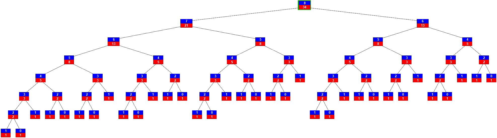

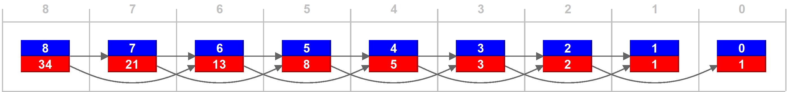

Note that the dependency graph was laid out on in a one dimensional
table of size 9, corresponding to the unique subproblems invoked by
the algorithm.
This table can simply store the value of each subproblem.
In this way, redundant calls can be avoided because the value of a
subproblem which was previously computed can be read from its
corresponding cell in the table without the need to recompute it
again.

The table can be used to derive two alternative, but efficient,
algorithms.
One way to accomplish this goal is to keep a table of values, and
first check the table to see if the computation can be avoided.
This technique is called memoization.
Here is a straightforward example of doing so.
Note that it mirrors the original version of the Fibonacci recursive
algorithm.

```java
int fibrt(int n) {
  // Assume Values has at least n slots, and all
  // slots are initialized to 0
  if ((n <= 0) || (n > 91)) return -1;
  if (n <= 2) return 1;             // Base case
  if (Values[n] == 0)
    Values[n] = fibrt(n-1) + fibrt(n-2);
  return Values[n];
}
```

This version of the algorithm will not compute a value more than once,
so its cost should be linear.

A second technique is called tabulation.
The dependency graph must be analyzed to infer an alternative
computation order for the subproblems.
The only restriction is that a subproblem can only be
computed when the subproblems it depends on have been computed.
In addition, the value of each subproblem must be stored in the table.
In the case of computing a value in the Fibonacci series,
we reverse the order to calculate the series from the starting point,
and implement this  by a simple loop.
Unfortunately, since it does not have any similarity to the original
recursive algorithm, there is no mechanical way to get from the
orginal recursive form to the dynamic programming form.

An additional optimization can be made.
Of course, we didn’t actually need to use a table storing all of the
values, since future computations do not need access to all prior
subproblems.
Instead, we could build the value by working from 0 and 1 up to
$n$ rather than backwards from $n$ down to 0 and 1.
Going up from the bottom we only need to store the previous two values
of the function, as is done by our iterative version.

```java
/** Iteratively generate and return the n'th Fibonacci
    number */
static long fibi(int n) {
  // fibr(91) is the largest value that fits in a long
  if ((n <= 0) || (n > 91)) return -1;
  long curr, prev, past;
  if ((n == 1) || (n == 2)) return 1;
  curr = prev = 1;     // curr holds current Fib value
  for (int i=3; i<=n; i++) { // Compute next value
    past = prev;             // past holds fibi(i-2)
    prev = curr;             // prev holds fibi(i-1)
    curr = past + prev;      // curr now holds fibi(i)
  }
  return curr;
}
```

Recomputing of subproblems comes up in many algorithms.
It is not so common that we can store only a few prior results as we
did for `fibi`.
Thus, there are many times where storing a complete table of
subresults will be useful.

The approach shown above to designing an algorithm that works by
storing a table of results for subproblems is called
[dynamic programming](Glossary.md#term-dynamic-programming) when it is applied to optimization
algorithms.
The name is somewhat arcane, because it doesn’t bear much obvious
similarity to the process that is taking place when storing subproblems
in a table.
However, it comes originally from the field of dynamic control
systems, which got its start before what we think of as computer
programming.
The act of storing precomputed values in a table for later reuse is
referred to as “programming” in that field.
Dynamic programming algorithms are usually implemented with the
tabulation technique described above.
Thus, `fibi` better represents the most common form of dynamic
programming than does `fibrt`, even though it doesn’t use the
complete table.

<a id="the-knapsack-problem"></a>
### 14.1.1.2. The Knapsack Problem

We will next consider a problem that appears with many variations in a
variety of commercial settings.
Many businesses need to package items with the greatest efficiency.
One way to describe this basic idea is in terms of packing items into
a knapsack, and so we will refer to this as the
[Knapsack Problem](Glossary.md#term-knapsack-problem).
We will first define a particular formulation of the knapsack problem,
and then we will discuss an algorithm to solve it based on dynamic
programming.
There are many other versions for the problem

Assume that we have a knapsack with a certain amount of space that we
will define using integer value $K$.
We also have $n$ items each with a certain size such that
that item $i$ has integer size $k_i$.
The problem is to find a subset of the $n$ items whose sizes
exactly sum to $K$, if one exists.
For example, if our knapsack has capacity $K = 5$ and the two
items are of size $k_1 = 2$ and $k_2 = 4$,
then no such subset exists.
But if we add a third item of size $k_3 = 1$,
then we can fill the knapsack exactly with the second and third
items.
We can define the problem more formally as:
Find $S \subset \{1, 2, ..., n\}$ such that

<a id="equation-dynamicprogramming-0"></a>
$$
\sum_{i \in S} k_i = K.
$$

**Example 14.1.1**

Assume that we are given a knapsack of size $K = 163$ and
10 items of sizes 4, 9, 15, 19, 27, 44, 54, 68, 73, 101.
Can we find a subset of the items that exactly fills the knapsack?
You should take a few minutes and try to do this before reading on
and looking at the answer.

One solution to the problem is: 19, 27, 44, 73.

**Example 14.1.2**

Having solved the previous example for knapsack of size 163, how
hard is it now to solve for a knapsack of size 164?
Try it.

Unfortunately, knowing the answer for 163 is of almost no use at
all when solving for 164.
One solution is: 9, 54, 101.

If you tried solving these examples, you probably found yourself doing
a lot of trial-and-error and a lot of backtracking.
To come up with an algorithm, we want an organized way to go through
the possible subsets.
Is there a way to make the problem smaller, so that we can apply
divide and conquer?
We essentially have two parts to the input: The knapsack size
$K$ and the $n$ items.
It probably will not do us much good to try and break the knapsack
into pieces and solve the sub-pieces (since we already saw that
knowing the answer for a knapsack of size 163 did nothing to help us
solve the problem for a knapsack of size 164).

So, what can we say about solving the problem with or without the
$n$’th item?
This seems to lead to a way to break down the problem.
If the $n$’th item is not needed for a solution (that is, if we
can solve the problem with the first $n-1$ items) then we can
also solve the problem when the $n$’th item is available
(we just ignore it).
On the other hand, if we do include the $n$’th item as a member
of the solution subset, then we now would need to solve the problem
with the first $n-1$ items and a knapsack of size
$K - k_n$ (since the $n$’th
item is taking up $k_n$ space in the knapsack).

To organize this process, we can define the problem in terms of
two parameters: the knapsack size $K$ and the number of items
$n$.
Denote a given instance of the problem as $P(n, K)$.
Now we can say that $P(n, K)$ has a solution if and only if
there exists a solution for either $P(n-1, K)$ or
$P(n-1, K-k_n)$.
That is, we can solve $P(n, K)$ only if we can solve one of the
sub problems where we use or do not use the $n$ th item.
Of course, the ordering of the items is arbitrary.
We just need to give them some order to keep things straight.

Continuing this idea, to solve any subproblem of size $n-1$,
we need only to solve two subproblems of size $n-2$.
And so on, until we are down to only one item that either fills the
knapsack or not.
This naturally leads to a cost expressed by the recurrence relation
$\mathbf{T}(n) = 2\mathbf{T}(n-1) + c = \Theta(2^n)$.
That can be pretty expensive!

But… we should quickly realize that there are only $n(K+1)$
subproblems to solve!
Clearly, there is the possibility that many subproblems are being
solved repeatedly.
This is a natural opportunity to apply dynamic programming.
If we draw the recursion tree of this naive recursive algorithm and
derive its corresponding dependency graph, we notice that all the
recursive calls can be laid out on
an array of size $n \times K+1$ to contain the
solutions for all subproblems
$P(i, k), 1 \leq i \leq n, 0 \leq k \leq K$.

As mentioned above, there are two approaches to actually solving the
problem.
One is memoization, that is, to start with our problem of size
$P(n, K)$ and make recursive calls to solve the subproblems,
each time checking the array
to see if a subproblem has been solved, and filling in the
corresponding cell in the array whenever we get a new subproblem
solution.
The other is tabulation.
Conceiveably we could adopt one of several computation orders,
although the most “natural” is to start filling the array for row 1
(which indicates a successful solution only for a knapsack of size
$k_1$).
We then fill in the succeeding rows
from $i=2$ to $n$, left to right, as follows.

**if** $P(n-1, K)$ has a solution,  
**then** $P(n, K)$ has a solution
**else if** $P(n-1, K-k_n)$ has a solution

**then** $P(n, K)$ has a solution
**else** $P(n, K)$ has no solution.

In other words, a new slot in the array gets its solution by looking
at most at two slots in the preceding row.
Since filling each slot in the array takes constant time, the total
cost of the algorithm is $\Theta(nK)$.

**Example 14.1.3**

Solve the Knapsack Problem for $K = 10$ and five items with
sizes 9, 2, 7, 4, 1.
We do this by building the following array.

<a id="equation-dynamicprogramming-1"></a>
$$
\begin{aligned}\begin{array}{l|ccccccccccc}
&0&1&2&3&4&5&6&7&8&9&10\\
\hline
k_1\!=\!9&O&-&-&-&-&-&-&-&-&I&-\\
k_2\!=\!2&O&-&I&-&-&-&-&-&-&O&-\\
k_3\!=\!7&O&-&O&-&-&-&-&I&-&I/O&-\\
k_4\!=\!4&O&-&O&-&I&-&I&O&-&O&-\\
k_5\!=\!1&O&I&O&I&O&I&O&I/O&I&O&I\end{array}\end{aligned}
$$

Key:  
-:  No solution for $P(i, k)$.
O: Solution(s) for $P(i, k)$ with $i$ omitted.
I: Solution(s) for $P(i, k)$ with $i$ included.
I/O: Solutions for $P(i, k)$ with $i$ included AND omitted.

For example, $P(3, 9)$ stores value I/O.
It contains O because $P(2, 9)$ has a solution.
It contains I because $P(2,2) = P(2, 9-7)$ has a solution.
Since $P(5, 10)$ is marked with an I, it has a solution.
We can determine what that solution actually is by recognizing that
it includes the 5th item (of size 1), which then leads us to look at
the solution for $P(4, 9)$.
This in turn has a solution that omits the 4th item,
leading us to $P(3, 9)$.
At this point, we can either use the third item or not.
We can find a solution by taking one branch.
We can find all solutions by following all branches when there is a
choice.

Note that the table is first filled with the values of the
different subproblems, and later we inferred the sequence of
decisions that allows computing an optimal solution from the values
stored in the table.
This last phase of the algorithm precludes the possibility of
actually reducing the size of the table.
Otherwise, the table for the knapsack problem could have been
reduced to a one dimensional array.


<a id="the-sparse-matrix"></a>
# 14.2. The Sparse Matrix

Sometimes we need to represent a large, two-dimensional matrix
where many of the elements have a value of zero.
A difficult situation arises when the vast majority of values stored
in an $n \times m$ matrix are zero, but
there is no restriction on which positions are zero and which are
non-zero.
This is known as a [sparse matrix](Glossary.md#term-sparse-matrix).

One approach to representing a sparse matrix is to concatenate
(or otherwise combine) the row and column coordinates into a single
value and use this as a key in a hash table.
Thus, if we want to know the value of a particular position in the
matrix, we search the hash table for the appropriate key.
If a value for this position is not found, it is assumed to be zero.
This is an ideal approach when all queries to the
matrix are in terms of access by specified position.
However, if we wish to find the first non-zero element in a given row,
or the next non-zero element below the current one in a given column,
or recover all of the non-zero values in a given column,
then the hash table requires us to check sequentially through the
entire table.

Another approach is to implement the matrix as an
orthogonal list.
Consider the following sparse matrix:

<a id="equation-sparse-0"></a>
$$
\begin{aligned}\begin{array}{rrrrrrr}
10&23&0 &0 &0&0&19\\
45&5 &0 &93&0&0&0\\
0 &0 &0 &0 &0&0&0\\
0 &0 &0 &0 &0&0&0\\
40&0 &0 &0 &0&0&0\\
0 &0 &0 &0 &0&0&0\\
0 &0 &0 &0 &0&0&0\\
0 &32&0 &12&0&0&7\\\end{array}\end{aligned}
$$

The corresponding orthogonal array is shown in the Figure.
Here we have a list of row headers, each of which contains a pointer
to a list of matrix records.
A second list of column headers also contains pointers to matrix records.
Each non-zero matrix element stores pointers to its non-zero
neighbors in the row, both following and preceding it.
Each non-zero element also stores pointers to its non-zero neighbors
following and preceding it in the column.
Thus, each non-zero element stores its own value, its position within
the matrix, and four pointers.
Non-zero elements are found by traversing a row or column list.
Note that the first non-zero element in a given row could be in any
column;
likewise, the neighboring non-zero element in any row or column list
could be at any (higher) row or column in the array.

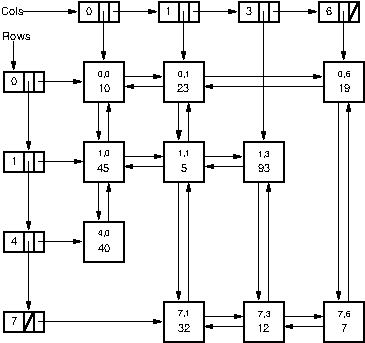

*Figure 14.2.1: A representative orthogonal list sparse matrix
representation. Depending on the needs of the application, a given
cell might store references as part of a singly linked or doubly
linked list, and the cell might store row/column positions for the
cell or might store references back to the row/column headers.*

What exactly should be stored in the various (non-zero) cells of the
sparse matrix depends on the application.
In some cases, knowing the row/column locations for individual cells
is important.
For example, if we want to normal math operations on matricies, such
as add two matricies that are stored using the sparse matrix
representation, then it is an important part of each cell comparison
to know were exactly we are in the array any natural traversal of the
arrays.
Thus, each non-zero element would store its row and column
position explicitly.
To find if a particular position in the matrix contains a non-zero
element, we traverse the appropriate row or column list.
For example, when looking for the element at Row 7 and Column 1,
we can traverse the list either for Row 7 or for Column 1.
When traversing a row or column list, if we come to an element with
the correct position, then its value is non-zero.
If we encounter an element with a higher position,
then the element we are looking for is not in the sparse matrix.
In this case, the element’s value is zero.
For example, when traversing the list for Row 7 in the matrix of
the figure, we first reach the element at Row 7 and Column 1.
If this is what we are looking for, then the search can stop.
If we are looking for the element at Row 7 and Column 2, then the
search proceeds along the Row 7 list to next reach the element at
Column 3.
At this point we know that no element at Row 7 and Column 2 is stored
in the sparse matrix.

In some applications, a given row or column represents a vector of
information about some object.
For example, consider if we want to store a database about reviewer
ratings of movies.
If there are a lot of movies and a lot of reviewers in the database,
then no reviewer will have reviewed a signficant fraction of the
movies, and no movie will have been reviewed by a significant fraction
of reviewers.
So a sparse matrix representation might be ideal, where each column
stores the ratings information for a given reviewer,
and each row stores the ratings information for a given movie.
This allows operations like finding all reviews by a given reviewer
However, *which* column a given movie is in is arbitrary.
In this case, each (non-zero) cell of the sparse matrix might need to
store a reference to its row and column headers (which might provide
further information about the record, such as movie and review
information), but the cells probably do not need to store meaningless
row/column numbers.

Insertion and deletion can be performed by working in a similar way to
insert or delete elements within the appropriate row and column lists.

Each non-zero element stored in the sparse matrix representation
takes much more space than an element stored in a simple
$n \times n$ matrix.
When is the sparse matrix more space efficient than the standard
representation?
To calculate this, we need to determine how much space the standard
matrix requires, and how much the sparse matrix requires.
The size of the sparse matrix depends on the number of non-zero
elements (we will refer to this value as NNZ), while the size
of the standard matrix representation does not vary.
We need to know the (relative) sizes of a pointer and a data value.
For simplicity, our calculation will ignore the space taken up by the
row and column header (which is not much affected by the number of
elements in the sparse array).

As an example, assume that a data value, a row or
column index, and a pointer each require four bytes.
An $n \times m$ matrix requires $4nm$ bytes.
The sparse matrix requires 28~bytes per non-zero element
(four pointers, two array indices, and one data value).
If we set $X$ to be the percentage of non-zero elements,
we can solve for the value of $X$ below which the sparse matrix
representation is more space efficient.
Using the equation $28X = 4mn$ and solving for $X$,
we find that the sparse matrix using this implementation is more space
efficient when $X < 1/7$, that is,
when less than about 14% of the elements are non-zero.
Different values for the relative sizes of data values, pointers, or
matrix indices can lead to a different break-even point
for the two implementations.

The time required to process a sparse matrix should ideally depend on
NNZ.
When searching for an element, the cost is the number of elements
preceding the desired element on its row or column list.
The cost for operations such as adding two matrices should be
$\Theta(n + m)$ in the worst case when the one matrix stores
$n$ non-zero elements and the other stores $m$ non-zero
elements.

Another representation for sparse matrices is sometimes called the
Yale representation.
Matlab uses a similar representation, with a primary difference being
that the Matlab representation uses column-major
order.
(Scientific packages tend to prefer
column-oriented representations for matrices since this the dominant
access need for the operations to be performed.)
The Matlab representation stores the sparse matrix using three lists.
The first is simply all of the non-zero element values, in
column-major order.
The second list stores the start position within the first list for
each column.
The third list stores the row positions for each of the
corresponding non-zero values.
In the Yale representation, the matrix of the figure above would
appear as:

<a id="equation-sparse-1"></a>
$$
\begin{aligned}\begin{array}{ll}
Values:& 10\ 45\ 40\ 23\ 5\ 32\ 93\ 12\ 19\ 7\\
Column starts:& 0\ 3\ 5\ 5\ 7\ 7\ 7\ 7\\
Row positions:& 0\ 1\ 4\ 0\ 1\ 7\ 1\ 7\ 0\ 7\\\end{array}\end{aligned}
$$

If the matrix has $c$ columns,
then the total space required will be proportional to
$c + 2 NNZ$.
This is good in terms of space.
It allows fairly quick access to any column, and allows for easy
processing of the non-zero values along a column.
However, it does not do a good job of providing access to the values
along a row, and is terrible when values need to be added or
removed from the representation.
Fortunately, when doing computations such as adding or multiplying two
sparse matrices, the processing of the input matrices and construction
of the output matrix can be done reasonably efficiently.


<a id="finding-the-maximum-value"></a>
# 14.3. Finding the Maximum Value

<a id="id1"></a>
## 14.3.1. Finding the Maximum Value

How can we find the $i$ th largest value in a sorted list?
Obviously we just go to the $i$ th position.
But what if we have an unsorted list?
Can we do better than to sort it?
If we are looking for the minimum or maximum value, certainly we can
do better than sorting the list.
Is this true for the second biggest value?
For the median value?
In later sections we will examine those questions.
For this section, we will continue our examination of lower bounds
proofs by reconsidering the simple problem of finding the maximum
value in an unsorted list.

Here is a simple algorithm for finding the largest value.

```java
// Return position of largest value in integer array A
static int largest(int[] A) {
  int currlarge = 0;             // Position of largest element seen
  for (int i=1; i<A.length; i++) // For each element
    if (A[currlarge] < A[i])     //   if A[i] is larger
       currlarge = i;            //     remember its position
  return currlarge;              // Return largest position
}
```

Obviously this algorithm requires $n$ comparisons.
Is this optimal?
It should be intuitively obvious that it is, but let us try to prove
it.
(Before reading further you might try writing down your own proof.)

**Proof 1**

The winner must compare against all other elements, so there must be
$n-1$ comparisons.

This proof is clearly wrong, because the winner does not need to
explicitly compare against all other elements to be recognized.
For example, a standard single-elimination playoff sports tournament
requires only $n-1$ comparisons, and the winner does not play
every opponent.
So let’s try again.

**Proof 2**

Only the winner does not lose.
There are $n-1$ losers.
A single comparison generates (at most) one (new) loser.
Therefore, there must be $n-1$ comparisons.

This proof is sound.
However, it will be useful later to abstract this by introducing the
concept of [posets](Glossary.md#term-poset).
We can view the maximum-finding problem as starting with a poset where
there are no known relationships, so every member of the collection is
in its own separate DAG of one element.

**Proof 2a**

To find the largest value, we start with a poset of $n$ DAGs
each with a single element, and we must build a poset having all
elements in one DAG such that there is one maximum value
(and by implication, $n-1$ losers).
We wish to connect the elements of the poset into a single DAG with
the minimum number of links.
This requires at least $n-1$ links.
A comparison provides at most one new link.
Thus, a minimum of $n-1$ comparisons must be made.

What is the average cost of `largest`?
Because it always does the same number of comparisons,
clearly it must cost $n-1$ comparisons.
We can also consider the number of assignments that `largest`
must do.
Function `largest` might do an assignment on any iteration of the
`for` loop.

Because this event does happen, or does not happen,
if we are given no information about distribution we could guess that
an assignment is made after each comparison with a probability of one
half.
But this is clearly wrong.
In fact, `largest` does an assignment on the $i$ th iteration
if and only if `A` [$i$] is the biggest of the the first
$i$ elements.
Assuming all permutations are equally likely, the probability of this
being true is $1/i$.
Thus, the average number of assignments done is

<a id="equation-boundmax-0"></a>
$$
1 + \sum_{i=2}^n \frac{1}{i} = \sum_{i=1}^n \frac{1}{i}
$$

which is the Harmonic Series ${\cal H}_n$.

<a id="equation-boundmax-1"></a>
$$
{\cal H}_n = \Theta(\log n).
$$

More exactly, ${\cal H}_n$ is close to $\log_e n$.

How “reliable” is this average?
That is, how much will a given run of the program deviate from the
mean cost?
According to Cebysev’s Inequality, an observation will fall
within two standard deviations of the mean at least 75% of the time.
For `Largest`, the variance is

<a id="equation-boundmax-2"></a>
$$
{\cal H}_n - \frac{\pi^2}{6} = \log_e n - \frac{\pi^2}{6}.
$$

The standard deviation is thus about $\sqrt{\log_e n}$.
So, 75% of the observations are between
$\log_e n - 2\sqrt{\log_e n}$
and $\log_e n + 2\sqrt{\log_e n}$.
Is this a narrow spread or a wide spread?
Compared to the mean value, this spread is pretty wide, meaning
that the number of assignments varies widely from run to run of the
program.


<a id="adversarial-lower-bounds-proofs"></a>
# 14.4. Adversarial Lower Bounds Proofs

Our next problem will be finding the second largest in a
collection of objects.
Consider what happens in a standard single-elimination tournament.
Even if we assume that the “best” team wins in every game,
is the second best the one that loses in the finals?
Not necessarily.
We might expect that the second best must lose to the best,
but they might meet at any time.

Let us go through our standard “algorithm for finding algorithms” by
first proposing an algorithm, then a lower bound, and seeing if they
match.
Unlike our analysis for most problems, this time we are going to count
the exact number of comparisons involved and attempt to minimize this
count.
A simple algorithm for finding the second largest is to first find the
maximum (in $n-1$ comparisons), discard it, and then find the
maximum of the remaining elements (in $n-2$ comparisons) for a total
cost of $2n-3$ comparisons.
Is this optimal?
That seems doubtful, but let us now proceed to the step of attempting
to prove a lower bound.

**Theorem 14.4.1**

The lower bound for finding the second largest value is $2n-3$.

**Proof**

Any element that loses to anything other than the maximum cannot be
second.
So, the only candidates for second place are those that lost to the
maximum.
Function `largest` might compare the maximum element  to
$n-1$ others.
Thus, we might need $n-2$ additional comparisons to find the
second largest.

This proof is wrong.
It exhibits the [necessary fallacy](Glossary.md#term-necessary-fallacy):
“Our algorithm does something, therefore all algorithms solving
the problem must do the same.”

This leaves us with our best lower bounds argument at the moment
being that finding the second largest must cost at least as much as
finding the largest, or $n-1$.
Let us take another try at finding a better algorithm by adopting a
strategy of divide and conquer.
What if we break the list into halves, and run *largest* on each
half?
We can then compare the two winners (we have now used a total of
$n-1$ comparisons), and remove the winner from its half.
Another call to `largest` on the winner’s half yields its second
best.
A final comparison against the winner of the other half gives us the
true second place winner.
The total cost is $\lceil 3n/2\rceil - 2$.
Is this optimal?
What if we break the list into four pieces?
The best would be $\lceil 5n/4\rceil$.
What if we break the list into eight pieces?
Then the cost would be about $\lceil 9n/8\rceil$.
Notice that as we break the list into more parts,
comparisons among the winners of the parts becomes a larger concern.

Looking at this another way, the only candidates for second place
are losers to the eventual winner, and our goal is to have as few of
these as possible.
So we need to keep track of the set of elements that have lost
in direct comparison to the (eventual) winner.
We also observe that we learn the most from a comparison when both
competitors are known to be larger than the same number of other
values.
So we would like to arrange our comparisons to be against
“equally strong” competitors.
We can do all of this with a defit{binomial tree}.
A binomial tree of height $m$ has $2^m$ nodes.
Either it is a single node (if $m=0$), or else it is
two height $m-1$ binomial trees with one tree’s root becoming
a child of the other.
Let’s see how a binomial tree with eight nodes would be constructed.

The resulting algorithm is simple in principle:
Build the binomial tree for all $n$ elements, and then compare
the $\lceil \log n\rceil$ children of the root to find second
place.
We could store the binomial tree as an explicit tree structure, and
easily build it in time linear on the number of comparisons as each
comparison requires one link be added.
Because the shape of a binomial tree is heavily constrained,
we can also store the binomial tree implicitly in an array, much as we
do for a heap.
Assume that two trees, each with $2^k$ nodes, are in the array.
The first tree is in positions 1 to :math`2^k`.
The second tree is in positions $2^k+1$ to $2^{k+1}$.
The root of each subtree is in the final array position for that
subtree.

To join two trees, we simply
compare the roots of the subtrees.
If necessary, swap the subtrees so that tree with the the larger root
element becomes the second subtree.
This trades space (we only need space for the data values, no node
pointers) for time (in the worst case, all of the data swapping might
cost $O(n \log n)$, though this does not affect the number of
comparisons required).
Note that for some applications, this is an important observation that
the array’s data swapping requires no comparisons.
If a comparison is simply a check between two integers, then of course
moving half the values within the array is too expensive.
But if a comparison requires that a competition be held between two
sports teams, then the cost of a little bit (or even a lot) of book
keeping becomes irrelevent.

Because the binomial tree’s root has $\log n$ children,
and building the tree requires $n-1$ comparisons,
the number of comparisons required by this algorithm is
$n + \lceil \log n \rceil - 2$.
This is clearly better than our previous algorithm.
Is it optimal?

We now go back to trying to improve the lower bounds proof.
To do this, we introduce the concept of an [adversary](Glossary.md#term-adversary).
The adversary’s job is to make an algorithm’s cost as high as
possible.
Imagine that the adversary keeps a list of all possible inputs.
We view the algorithm as asking the adversary for information about
the algorithm’s input.
The adversary may never lie, in that its answer must be consistent
with the previous answers.
But it is permitted to “rearrange” the input as it sees fit in order
to drive the total cost for the algorithm as high as possible.
In particular, when the algorithm asks a question, the adversary
must answer in a way that is consistent with at least one remaining
input.
The adversary then crosses out all remaining inputs inconsistent with
that answer.
Keep in mind that there is not really an entity within the computer
program that is the adversary, and we don’t actually modify the
program.
The adversary operates merely as an analysis device, to help us reason
about the program.

As an example of the adversary concept, consider the standard game of
Hangman.
Player A picks a word and tells player B how many
letters the word has.
Player B guesses various letters.
If B guesses a letter in the word, then A will indicate
which position(s) in the word have the letter.
Player B is permitted to make only so many guesses of letters
not in the word before losing.

In the Hangman game example, the adversary is imagined to hold a
dictionary of words of some selected length.
Each time the player guesses a letter, the adversary consults the
dictionary and decides if more words will be eliminated by accepting
the letter (and indicating which positions it holds) or saying that
its not in the word.
The adversary can make any decision it chooses, so long as at least
one word in the dictionary is consistent with all of the decisions.
In this way, the adversary can hope to make the player guess as many
letters as possible.

Before explaining how the adversary plays a role in our lower bounds
proof, first observe that at least $n-1$ values must lose at
least once.
This requires at least $n-1$ compares.
In addition, at least $k-1$ values must lose to the second
largest value.
That is, $k$ direct losers to the winner must be compared.
There must be at least $n + k - 2$ comparisons.
The question is: How low can we make $k$?

Call the **strength** of element `A[i]` the number of
elements that `A[i]` is (known to be) bigger than.
If `A[i]` has strength $a$, and `A[j]` has
strength $b$, then the winner has strength $a + b + 1$.
The algorithm gets to know the (current) strengths for each element,
and it gets to pick which two elements are compared next.
The adversary gets to decide who wins any given comparison.
What strategy by the adversary would cause the algorithm to learn the
least from any given comparison?
It should minimize the rate at which any element improves it strength.
It can do this by making the element with the greater strength win at
every comparison.
This is a “fair” use of an adversary in that it represents the
results of providing a worst-case input for that given algorithm.

To minimize the effects of worst-case behavior, the algorithm’s best
strategy is to maximize the minimum improvement in strength by
balancing the strengths of any two competitors.
From the algorithm’s point of view, the best outcome is that an
element doubles in strength.
This happens whenever $a = b$, where $a$ and $b$ are
the strengths of the two elements being compared.
All strengths begin at zero, so the winner must make at least
$k$ comparisons when $2^{k-1} < n \leq 2^k$.
Thus, there must be at least $n + \lceil \log n\rceil - 2$
comparisons.
So our algorithm is optimal.


<a id="state-space-lower-bounds-proofs"></a>
# 14.5. State Space Lower Bounds Proofs

We now consider the problem of finding both the minimum and the
maximum from an (unsorted) list of values.
This might be useful if we want to know the range of a collection of
values to be plotted, for the purpose of drawing the plot’s scales.
Of course we could find them independently in $2n-2$
comparisons.
A slight modification is to find the maximum in $n-1$
comparisons, remove it from the list, and then find the minimum in
$n-2$ further comparisons for a total of $2n-3$
comparisons.
Can we do better than this?

Before continuing, think a moment about how this problem of finding
the minimum and the maximum compares to the problem of the last
section, that of finding the second biggest value
(and by implication, the maximum).
Which of these two problems do you think is harder?
It is probably not at all obvious to you that one problem is harder or
easier than the other.
There is intuition that argues for either case.
On the one hand intuition might argue that the process of finding the
maximum should tell you something about the second biggest value, more
than that process should tell you about the minimum value.
On the other hand, any given comparison tells you something about
which of two can be a candidate for maximum value, and which can be a
candidate for minimum value, thus making progress in both directions.

We will start by considering a simple divide-and-conquer approach to
finding the minimum and maximum.
Split the list into two parts and find the minimum and
maximum elements in each part.
Then compare the two minimums and maximums to each other with a
further two comparisons to get the final result.
The algorithm is as follows:

```java
// Return the minimum and maximum values in A between positions l and r
void MinMax(int A[], int l, int r, int Out[]) {
  if (l == r) {        // n=1
    Out[0] = A[r];
    Out[1] = A[r];
  }
  else if (l+1 == r) { // n=2
    Out[0] = Math.min(A[l], A[r]);
    Out[1] = Math.max(A[l], A[r]);
  }
  else {               // n>2
    int[] Out1 = new int[2];
    int[] Out2 = new int[2];
    int mid = (l + r)/2;
    MinMax(A, l, mid, Out1);
    MinMax(A, mid+1, r, Out2);
    Out[0] = Math.min(Out1[0], Out2[0]);
    Out[1] = Math.max(Out1[1], Out2[1]);
  }
}
```

The cost of this algorithm can be modeled by the following recurrence.

<a id="equation-boundstate-0"></a>
$$
\begin{aligned}\mathbf{T}(n) = \left\{\begin{array}{ll}
             0       & n = 1\\
             1       & n = 2\\
             {\bf T}(\lfloor n/2 \rfloor) + {\bf T}(\lceil n/2
             \rceil) + 2    & n > 2\end{array}
     \right.\end{aligned}
$$

This is a rather interesting recurrence, and its
solution ranges between $3n/2 - 2$
(when $n = 2^i$ or $n=2^1 \pm 1$)
and $5n/3 - 2$ (when $n = 3 \times 2^i$).
We can infer from this behavior that how we divide the list affects
the performance of the algorithm.
For example, what if we have six items in the list?
If we break the list into two sublists of three elements, the cost
would be 8.
If we break the list into a sublist of size two and another of size
four, then the cost would only be 7.

With divide and conquer, the best algorithm is the one that minimizes
the work, not necessarily the one that balances the input sizes.
One lesson to learn from this example is that it can be important to
pay attention to what happens for small sizes of $n$, because
any division of the list will eventually produce many small lists.

We can model all possible divide-and-conquer strategies for this
problem with the following recurrence.

<a id="equation-boundstate-1"></a>
$$
\begin{aligned}\mathbf{T}(n) = \left\{
\begin{array}{ll}
0&n=1\\
1&n=2\\
\min_{1\leq k\leq n-1} \{{\bf T}(k) + {\bf T}(n-k)\} + 2&n>2\end{array}\right.\end{aligned}
$$

That is, we want to find a way to break up the list that will minimize
the total work.
If we examine various ways of breaking up small lists, we will
eventually recognize that breaking the list into a sublist of size 2
and a sublist of size (n-2) will always produce results as good as
any other division.
This strategy yields the following recurrence.

<a id="equation-boundstate-2"></a>
$$
\begin{aligned}\mathbf{T}(n) = \left\{
\begin{array}{ll}
0&n=1\\
1&n=2\\
{\bf T}(n-2) + 3&n>2\end{array}\right.\end{aligned}
$$

This recurrence (and the corresponding algorithm) yields
$\mathbf{T}(n) = \lceil 3n/2 \rceil - 2$ comparisons.
Is this optimal?
We now introduce yet another tool to our collection of lower bounds
proof techniques: The state space proof.

We will model our algorithm by defining a [state](Glossary.md#term-state) that the
algorithm must be in at any given instant.
We can then define the start state, the end state, and the
transitions between states that any algorithm can support.
From this, we will reason about the minimum number of states that the
algorithm must go through to get from the start to the end, to reach
a state space lower bound.

At any given instant, we can track the following four categories of
elements:

- Untested: Elements that have not been tested.
- Winners: Elements that have won at least once, and never lost.
- Losers: Elements that have lost at least once, and never won.
- Middle: Elements that have both won and lost at least once.

We define the current state to be a vector of four values,
$(U, W, L, M)$ for untested, winners, losers, and middles,
respectively.
For a set of $n$ elements, the initial state of the algorithm is
$(n, 0, 0, 0)$ and the end state is $(0, 1, 1, n-2)$.
Thus, every run for any algorithm must go from
state $(n, 0, 0, 0)$ to state $(0, 1, 1, n-2)$.
We also observe that once an element is identified to be a middle,
it can then be ignored because it can neither be the minimum nor the
maximum.

Given that there are four types of elements, there are 10 types of
comparison.
Comparing with a middle cannot be more efficient than other
comparisons, so we should ignore those, leaving six comparisons of
interest.
We can enumerate the effects of each comparison type as follows.
If we are in state $(i, j, k, l)$ and we have a comparison, then
the state changes are as follows.

<a id="equation-boundstate-3"></a>
$$
\begin{aligned}\begin{array}{lllll}
U:U&(i-2,&j+1,&k+1,&l)\\
W:W&(i,&j-1,&k,&l+1)\\
L:L&(i,&j,&k-1,&l+1)\\
L:U&(i-1,&j+1,&k,&l)\\
\quad or&(i-1,&j,&k,&l+1)\\
W:U&(i-1,&j,&k+1,&l)\\
\quad or&(i-1,&j,&k,&l+1)\\
W:L&(i,&j,&k,&l)\\
\quad or&(i,&j-1,&k-1,&l+2)\end{array}\end{aligned}
$$

Now, let us consider what an adversary will do for the various
comparisons.
The adversary will make sure that each comparison does the least
possible amount of work in taking the algorithm toward the goal
state.
For example, comparing a winner to a loser is of no value because the
worst case result is always to learn nothing new (the winner remains a
winner and the loser remains a loser).
Thus, only the following five transitions are of interest:

<a id="equation-boundstate-4"></a>
$$
\begin{aligned}\begin{array}{lllll}
U:U&(i-2,&j+1,&k+1,&l)\\
L:U&(i-1,&j+1,&k,&l)\\
W:U&(i-1,&j,&k+1,&l)\\
\hline
W:W&(i,&j-1,&k,&l+1)\\
L:L&(i,&j,&k-1,&l+1)\end{array}\end{aligned}
$$

Only the last two transition types increase the number of middles,
so there must be $n-2$ of these.
The number of untested elements  must go to 0, and the first
transition is the most efficient way to do this.
Thus, $\lceil n/2 \rceil$ of these are required.
Our conclusion is that the minimum possible number of transitions
(comparisons) is $n + \lceil n/2 \rceil - 2$.
Thus, our algorithm is optimal.


<a id="finding-the-i-th-best-element"></a>
# 14.6. Finding the $i$ th Best Element

We now tackle the problem of finding the $i$ th best element in
a list.
One solution is to sort the list and simply look
in the $i$ th position.
However, this process provides considerably more information than we
need to solve the problem.
The minimum amount of information that we actually need to know can be
visualized as shown in Figure [14.6.1](BoundiBest.md#medposet).
That is, all we need to know is the $i-1$ items less than our
desired value, and the $n-i$ items greater.
We do not care about the relative order within the upper and lower
groups.
So can we find the required information faster than by first sorting?
Looking at the lower bound, can we tighten that beyond the
trivial lower bound of $n$ comparisons?
We will focus on the specific question of finding the median element
(i.e., the element with rank $n/2$), because the resulting
algorithm can easily be modified to find the $i$ th largest
value for any $i$.


*Figure 14.6.1: The poset that represents the minimum information necessary to
determine the $i$ th element in a list.
We need to know which element has $i-1$ values less and
$n-i$ values more, but we do not need to know the
relationships among the elements with values less or greater than
the $i$ th element.*

Looking at the Quicksort algorithm might give us some insight into
solving the median problem.
Recall that Quicksort works by selecting a pivot value, partitioning
the array into those elements less than the pivot and those greater
than the pivot, and moving the pivot to its proper location in the
array.
If the pivot is in position $i$, then we are done.
If not, we can solve the subproblem recursively by only considering
one of the sublists.
That is, if the pivot ends up in position $k > i$, then we
simply solve by finding the $i$ th best element in the left
partition.
If the pivot is at position $k < i$, then we wish to find the
$i-k$ th element in the right partition.

What is the worst case cost of this algorithm?
As with Quicksort, we get bad performance if the pivot is the first or
last element in the array.
This would lead to possibly $O(n^2)$ performance.
However, if the pivot were to always cut the array in half, then our
cost would be modeled by the recurrence
$\mathbf{T}(n) = \mathbf{T}(n/2) + n = 2n$ or $O(n)$
cost.

Finding the average cost requires us to use a recurrence with full
history, similar to the one we used to model the cost of Quicksort.
If we do this, we will find that $\mathbf{T}n$ is in
$O(n)$ in the average case.

Is it possible to modify our algorithm to get worst-case linear time?
To do this, we need to pick a pivot that is guaranteed to discard a
fixed fraction of the elements.
We cannot just choose a pivot at random, because doing so will not meet
this guarantee.
The ideal situation would be if we could pick the median value for the
pivot each time.
But that is essentially the same problem that we are trying to solve
to begin with.

Notice, however, that if we choose any constant $c$,
and then if we pick the median from a sample of size $n/c$,
then we can guarantee that we will discard at least $n/2c$
elements.
Actually, we can do better than this by selecting small subsets of a
constant size (so we can find the median of each in constant time),
and then taking the median of these medians.
Figure [14.6.2](BoundiBest.md#median) illustrates this idea.

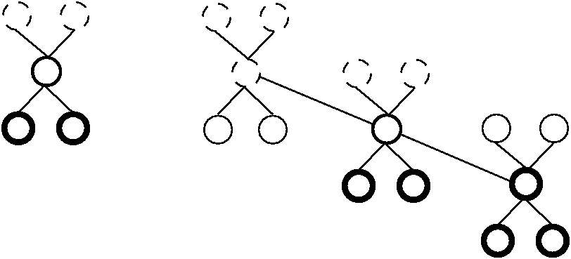

*Figure 14.6.2: A method for finding a pivot for partitioning a list that
guarantees at least a fixed fraction of the list will be in each
partition.
We divide the list into groups of five elements, and find the
median for each group.
We then recursively find the median of these $n/5$ medians.
The median of five elements is guaranteed to have at least two in
each partition.
The median of three medians from a collection of 15 elements is
guaranteed to have at least five elements in each partition.*

This observation leads directly to the following algorithm.

- Choose the $n/5$ medians for groups of five elements from the
list. Choosing the median of five items can be done in constant time.
- Recursively, select $M$, the median of the $n/5$
medians-of-fives.
- Partition the list into those elements larger and smaller than
$M$.

While selecting the median in this way is guaranteed to eliminate a
fraction of the elements
(leaving at most $\lceil (7n - 5)/10\rceil$ elements left),
we still need to be sure that our recursion yields a linear-time
algorithm.
We model the algorithm by the following recurrence.

<a id="equation-boundibest-0"></a>
$$
{\bf T}(n) \leq {\bf T}(\lceil n/5 \rceil) +
{\bf T}(\lceil (7n - 5)/10\rceil) + 6\lceil n/5 \rceil + n - 1.
$$

The $\mathbf{T}(\lceil n/5 \rceil)$ term comes from computing
the median of the medians-of-fives,
the $6\lceil n/5 \rceil$ term comes from the cost to calculate
the median-of-fives (exactly six comparisons for each group of five
element),
and the $\mathbf{T}(\lceil (7n - 5)/10\rceil)$ term comes from
the recursive call of the remaining (up to) 70% of the elements that
might be left.

We will prove that this recurrence is linear using the process of
[constructive induction](Glossary.md#term-constructive-induction).
We assume that it is linear for some constant $r$, and then show
that $\textbf{T}(n) \leq rn$ for all $n$ greater than some
bound.

<a id="equation-boundibest-1"></a>
$$
\begin{aligned}
\mathbf{T}(n) &\leq  {\bf T}(\lceil \frac{n}{5} \rceil) +
        \mathbf{T}(\lceil \frac{7n - 5}{10}\rceil) +
        6\lceil \frac{n}{5} \rceil + n - 1\\
&\leq r(\frac{n}{5} + 1) + r(\frac{7n-5}{10} + 1) + 6(\frac{n}{5} + 1) + n - 1\\
&\leq (\frac{r}{5} + \frac{7r}{10} + \frac{11}{5})n + \frac{3r}{2} + 5\\
&\leq \frac{9r + 22}{10}n + \frac{3r + 10}{2}.
\end{aligned}
$$

This is true for $r \geq 23$ and $n \geq 380$.
This provides a base case that allows us to use induction to prove
that $\forall n \geq 380, \mathbf{T}(n) \leq 23n$.

In reality, this algorithm is not practical
because its constant factor costs are so high.
So much work is being done to guarantee linear time performance that
it is more efficient on average to rely on chance to select the pivot,
perhaps by picking it at random or picking the middle value out of the
current subarray.


<a id="optimal-sorting"></a>
# 14.7. Optimal Sorting

What if we would like to find the sorting algorithm
with the absolute fewest possible comparisons?
It might well be that the result will not be practical for a
general-purpose use.
But consider this analogy to sports tournaments.
In sports, a “comparison” between two teams or individuals means
doing a competition between the two.
This is fairly expensive (at least compared to some minor book keeping
in a computer), and it might be worth trading a fair amount
of book keeping to cut down on the number of games that need to be
played.
What if we want to figure out how to hold a tournament that will give
us the exact ordering for all teams in the fewest number of total
games?
Of course, we are assuming that the results of each game will be
“accurate” in that we assume not only that the outcome of A
playing B would always be the same (at least over the time
period of the tournament), but that transitivity in
the results also holds.
In practice these are unrealistic assumptions, but such assumptions
are implicitly part of many tournament organizations.
Like most tournament organizers, we can simply accept these
assumptions and come up with an algorithm for playing the games that
gives us some rank ordering based on the results we obtain.

Recall Insertion Sort, where we put
element $i$ into a sorted sublist of the first $i-1$
elements.
What if we modify the standard Insertion Sort algorithm to use binary
search to locate where the $i$ th element goes in the sorted
sublist?
This algorithm is called [binary insert sort](Glossary.md#term-binary-insert-sort).
As a general-purpose sorting algorithm, this is not practical because
we then have to (on average) move about $i/2$ elements to make
room for the newly inserted element in the sorted sublist.
But if we count *only* comparisons, binary insert sort is pretty
good.
And we can use some ideas from binary insert sort to get closer to an
algorithm that uses the absolute minimum number of comparisons needed
to sort.

Consider what happens when we run binary insert sort on five elements.
How many comparisons do we need to do?
We can insert the second element with one comparison, the third with
two comparisons,
and the fourth with 2 comparisons.
When we insert the fifth element into the sorted list of four
elements, we need to do three comparisons in the worst case.
Notice exactly what happens when we attempt to do this insertion.
We compare the fifth element against the second.
If the fifth is bigger, we have to compare it against the third, and
if it is bigger we have to compare it against the fourth.
In general, when is binary search most efficient?
When we have $2^i - 1$ elements in the list.
It is least efficient when we have $2^i$ elements in the list.
So, we can do a bit better if we arrange our insertions to avoid
inserting an element into a list of size $2^i$ if possible.

Figure [14.7.1](SortingOptimal.md#bininsert) illustrates a different organization
for the comparisons that we might do.
First we compare the first and second element, and the third and
fourth elements.
The two winners are then compared, yielding a binomial tree.
We can view this as a (sorted) chain of three elements, with element
$A$ hanging off from the root.
If we then insert element $B$ into the sorted chain of three
elements, we will end up with one of the two posets shown on the right
side of Figure [14.7.1](SortingOptimal.md#bininsert), at a cost of 2 comparisons.
We can then merge $A$ into the chain, for a cost of two
comparisons (because we already know that it is smaller then either one
or two elements, we are actually merging it into a list of two or
three elements).
Thus, the total number of comparisons needed to sort the five elements
is at most seven instead of eight.

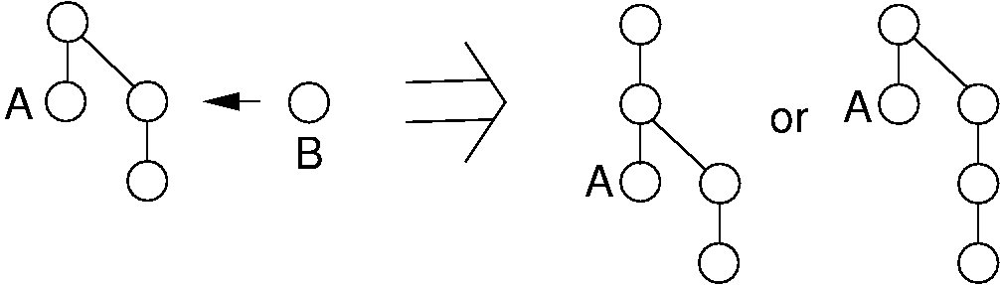

*Figure 14.7.1: Organizing comparisons for sorting five elements.
First we order two pairs of elements, and then compare the two
winners to form a binomial tree of four elements.
The original loser to the root is labeled $A$, and the
remaining three elements form a sorted chain.
We then insert element $B$ into the sorted chain.
Finally, we put $A$ into the resulting chain
to yield a final sorted list.*

If we have ten elements to sort, we can first make five pairs of
elements (using five compares) and then sort the five winners
using the algorithm just described (using seven more compares).
Now all we need to do is to deal with the original losers.
We can generalize this process for any number of elements as:

- Pair up all the nodes with $\lfloor \frac{n}{2} \rfloor$
comparisons.
- Recursively sort the winners.
- Fold in the losers.

We use binary insert to place the losers.
However, we are free to choose the best ordering for inserting,
keeping in mind the fact that binary search has the same cost for
$2^i$ through $2^{i+1} -1$ items.
For example, binary search requires three comparisons in the worst
case for lists of size 4, 5, 6, or 7.
So we pick the order of inserts to optimize the binary searches, which
means picking an order that avoids growing a sublist size such that it
crosses the boundary on list size to require an additional comparison.
This sort is called [merge insert sort](Glossary.md#term-merge-insert-sort), and also known as the
[Ford and Johnson sort](Glossary.md#term-ford-and-johnson-sort).

For ten elements, given the poset shown in
Figure [14.7.2](SortingOptimal.md#binmerge10) we
fold in the last four elements (labeled 1 to 4) in the order Element 3,
Element 4, Element 1, and finally Element 2.
Element 3 will be inserted into a list of size three, costing two
comparisons.
Depending on where Element 3 then ends up in the list, Element 4 will
now be inserted into a list of size 2 or 3, costing two comparisons in
either case.
Depending on where Elements 3 and 4 are in the list, Element 1 will
now be inserted into a list of size 5, 6, or 7, all of which requires
three comparisons to place in sort order.
Finally, Element 2 will be inserted into a list of size 5, 6, or 7.

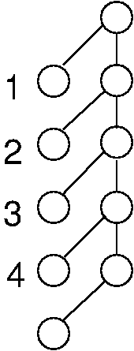

*Figure 14.7.2: Merge insert sort for ten elements.
First five pairs of elements are compared.
The five winners are then sorted.
This leaves the elements labeled 1-4 to be sorted into the chain made
by the remaining six elements.*

Merge insert sort is pretty good, but is it optimal?
We know from the
[sorting lower bound proof](SortingLowerBound.md#sortinglowerbound)
that no sorting algorithm can be faster than $\Omega(n \log n)$.
To be precise, the [information theoretic lower bound](Glossary.md#term-information-theoretic-lower-bound) for
sorting can be proved to be $\lceil \log n!\rceil$.
That is, we can prove a lower bound of exactly
$\lceil \log n!\rceil$ comparisons.
Merge insert sort gives us a number of comparisons equal to this
information theoretic lower bound for all values up to
$n = 12$.
At $n = 12$, merge insert sort requires 30 comparisons while the
information theoretic lower bound is only 29 comparisons.
However, for such a small number of elements, it is possible to do an
exhaustive study of every possible arrangement of comparisons.
It turns out that there is in fact no possible arrangement of
comparisons that makes the lower bound less than 30 comparisons when
$n=12$.
Thus, the information theoretic lower bound is an underestimate in this
case, because 30 really is the best that can be done.

Call the optimal worst cost for $n$ elements $S(n)$.
We know that $S(n+1) \leq S(n) + \lceil \log (n+1)\rceil$
because we could sort $n$ elements and use binary insert for the
last one.
For all $n$ and $m$,
$S(n+m) \leq S(n) + S(m) + M(m, n)$ where
$M(m, n)$ is the best time to merge two sorted lists.
For $n = 47$, it turns out that we can do better by splitting the
list into pieces of size 5 and 42, and then merging.
Thus, merge sort is not quite optimal.
But it is extremely good, and nearly optimal for smallish numbers of
elements.


---

# Chapter 15   Appendix


<a id="id1"></a>
# 15.1. Glossary

<a id="term-2-3-tree"></a>
#### 2-3 tree

A specialized form of the [B-tree](#term-45) where each internal
node has either 2 children or 3 children.
Key values are ordered to maintain the
[binary search tree property](#term-binary-search-tree-property).
The 2-3 tree is always height balanced, and its insert, search,
and remove operations all have $\Theta(\log n)$ cost.

<a id="term-80-20-rule"></a>
#### 80/20 rule

Given a typical application where there is a collection of
records and a series of search operations for records,
the 80/20 rule is an empirical observation that
80% of the record accessess typically go to 20% of the records.
The exact values varies between data collections, and is related
to the concept of [locality of reference](#term-locality-of-reference).

<a id="term-abstract-data-type"></a>
#### abstract data type

Abbreviated [ADT](#term-adt). The specification of a [data type](#term-data-type)
within some language, independent of an implementation.
The [interface](#term-interface) for the ADT is defined in terms of a [type](#term-type)
and a set of operations on that type.
The behavior of each operation is determined by its inputs and
outputs.
An ADT does not specify *how* the data type is implemented.
These implementation details are hidden from the user of the ADT
and protected from outside access, a concept referred to as
[encapsulation](#term-encapsulation).

<a id="term-accept"></a>
#### accept

When a [finite automata](#term-finite-automata) executes on a string and
terminates in an [accepting state](#term-accepting-state), it is said to accept
the string.
The finite automata is said to accept the language that consists
of all strings for which the finite automata completes execution
in an accepting state.

<a id="term-accepting-state"></a>
#### accepting state

Part of the definition of a [finite automata](#term-finite-automata) is to
designate some [states](#term-state) as accepting states.
If the finite automata executes on an input string and completes
the computation in an accepting state, then the machine is said
to [accept](#term-accept) the string.

<a id="term-activation-record"></a>
#### activation record

The entity that is stored on the [runtime stack](#term-runtime-stack) during
program execution.
It stores any active [local variable](#term-local-variable) and the return
address from which a new subroutine is being called, so that
this information can be recovered when the subroutine
terminates.

<a id="term-acyclic-graph"></a>
#### acyclic graph

In [graph](#term-graph) terminology, a graph that contains no
[cycles](#term-cycle).

<a id="term-address"></a>
#### address

A location in memory.

<a id="term-adjacency-list"></a>
#### adjacency list

An implementation for a [graph](#term-graph) that uses an (array-based)
[list](#term-list) to represent the [vertices](#term-vertex) of the
graph, and each vertex is in turn represented by a
(linked) list of the vertices that are
[neighbors](#term-neighbor).

<a id="term-adjacency-matrix"></a>
#### adjacency matrix

An implementation for a [graph](#term-graph) that uses a 2-dimensional
[array](#term-array) where each row and each column corresponds to a
[vertex](#term-vertex) in the [graph](#term-graph). A given row and column in
the matrix corresponds to an edge from the [vertex](#term-vertex)
corresponding to the row to the vertex corresponding to the
column.

<a id="term-adjacent"></a>
#### adjacent

Two [nodes](#term-node) of a [tree](#term-tree) or two
[vertices](#term-vertex) of a [graph](#term-graph) are said to be
adjacent if they have an [edge](#term-edge) connecting them.
If the edge is directed from $a$ to $b$,
then we say that $a$ is adjacent to $b$,
and $b$ is adjacent from $a$.

<a id="term-adt"></a>
#### ADT

Abbreviation for [abstract data type](#term-abstract-data-type).

<a id="term-adversary"></a>
#### adversary

A fictional construct introduced for use in an
[adversary argument](#term-adversary-argument).

<a id="term-adversary-argument"></a>
#### adversary argument

A type of [lower bounds proof](#term-lower-bounds-proof) for a problem where a
(fictional) “adversary” is assumed to control access to an
algorithm’s input, and which yields information about that input
in such a way
that will drive the cost for any proposed algorithm to solve the
problem as high as possible.
So long as the adversary never gives an answer that conflicts
with any previous answer, it is permitted to do whatever
necessary to make the algorithm require as much cost as
possible.

<a id="term-aggregate-type"></a>
#### aggregate type

A [data type](#term-data-type) whose [members](#term-member) have subparts.
For example, a typical database record.
Another term for this is [composite type](#term-composite-type).

<a id="term-algorithm"></a>
#### algorithm

A method or a process followed to solve a [problem](#term-problem).

<a id="term-algorithm-analysis"></a>
#### algorithm analysis

A less formal version of the term
[asymptotic algorithm analysis](#term-asymptotic-algorithm-analysis), generally used as a
synonym for [asymptotic analysis](#term-asymptotic-analysis).

<a id="term-alias"></a>
#### alias

Another name for something. In programming, this usually refers
to two [references](#term-reference) that refer to the same
object.

<a id="term-all-pairs-shortest-paths-problem"></a>
#### all-pairs shortest paths problem

Given a [graph](#term-graph) with [weights](#term-weight) or
distances on the [edges](#term-edge),
find the shortest paths between every pair of
vertices in the graph.
One approach to solving this problem is
[Floyd’s algorithm](#term-floyd-s-algorithm), which uses the
[dynamic programming](#term-dynamic-programming) algorithmic technique.

<a id="term-allocated"></a>
#### allocatedallocation

Reserving memory for an object in the Heap memory.

<a id="term-alphabet"></a>
#### alphabet

The characters or symbols that strings in a given language may
be composed of.

<a id="term-alphabet-trie"></a>
#### alphabet trie

A [trie](#term-trie) data structure for storing variable-length
strings.
Level $i$ of the tree corresponds to the letter in
position $i$ of the string.
The root will have potential branches on each intial letter of
string.
Thus, all strings starting with “a” will be stored in the “a”
branch of the tree.
At the second level, such strings will be separated by branching
on the second letter.

<a id="term-amortized-analysis"></a>
#### amortized analysis

An [algorithm analysis](#term-algorithm-analysis) techique that looks at the total
cost for a series of operations and amortizes this total cost
over the full series.
This is as opposed to considering every individual operation to
independently have the [worst case](#term-worst-case) cost, which might lead
to an overestimate for the total cost of the series.

<a id="term-amortized-cost"></a>
#### amortized cost

The total cost for a series of operations to be used in an
[amortized analysis](#term-amortized-analysis).

<a id="term-ancestor"></a>
#### ancestor

In a tree, for a given node $A$, any node on a
[path](#term-path) from $A$ up to the root is an ancestor of
$A$.

<a id="term-antisymmetric"></a>
#### antisymmetric

In set notation, relation $R$ is antisymmetric if whenever
$aRb$ and $bRa$, then $a = b$, for all
$a, b \in \mathbf{S}$.

<a id="term-approximation-algorithm"></a>
#### approximation algorithm

An algorthm for an [optimization problem](#term-optimization-problem) that finds a
good, but not necessarily cheapest, solution.

<a id="term-arm"></a>
#### arm

In the context of an [I/O head](#term-i-o-head), this attaches the sensor
on the I/O head to the [boom](#term-boom).

<a id="term-array"></a>
#### array

A [data type](#term-data-type) that is used to store elements in consecutive memory
locations and refers to them by an index.

<a id="term-array-based-list"></a>
#### array-based list

An implementation for the [list](#term-list) ADT that uses an [array](#term-array) to
store the list elements. Typical implementations fix the array
size at creation of the list, and the [overhead](#term-overhead)
is the number of array positions that are presently unused.

<a id="term-array-based-queue"></a>
#### array-based queue

Analogous to an [array-based list](#term-array-based-list), this uses an [array](#term-array) to
store the elements when implementing the [queue](#term-queue) ADT.

<a id="term-array-based-stack"></a>
#### array-based stack

Analogous to an [array-based list](#term-array-based-list), this uses an [array](#term-array) to
store the elements when implementing the [stack](#term-stack) ADT.

<a id="term-ascii-character-coding"></a>
#### ASCII character coding

American Standard Code for Information Interchange.
A commonly used method for encoding characters using a binary code.
Standard ASCII uses an 8-bit code to represent upper and lower
case letters, digits, some punctuation, and some number of
non-printing characters (such as carrage return).
Now largely replaced by UTF-8 encoding.

<a id="term-assembly-code"></a>
#### assembly code

A form of  [intermediate code](#term-intermediate-code) created by a [compiler](#term-compiler) that
is easy to convert into the final form that the computer can
execute.
An assembly language is typically a direct mapping of one or a
few instructions that the CPU can execute into a mnemonic form
that is relatively easy for a human to read.

<a id="term-asymptotic-algorithm-analysis"></a>
#### asymptotic algorithm analysis

A more formal term for [asymptotic analysis](#term-asymptotic-analysis).

<a id="term-asymptotic-analysis"></a>
#### asymptotic analysis

A method for estimating the efficiency of an algorithm or
computer program by identifying its [growth rate](#term-growth-rate).
Asymptotic analysis also gives a way to
define the inherent difficulty of a [problem](#term-problem).
We frequently use the term [algorithm analysis](#term-algorithm-analysis) to mean
the same thing.

<a id="term-attribute"></a>
#### attribute

In [object-oriented programming](#term-object-oriented-programming-paradigm),
a synonym for [data members](#term-data-member).

<a id="term-automata"></a>
#### automata

Synonym for [finite state machine](#term-finite-state-machine).

<a id="term-automatic-variable"></a>
#### automatic variable

A synonym for [local variable](#term-local-variable).
When program flow enters and leaves the variable’s scope,
automatic variables will be allocated and de-allocated
automatically.

<a id="term-average-case"></a>
#### average case

In [algorithm analysis](#term-algorithm-analysis), the average of the costs for all
[problem instances](#term-problem-instance) of a given input
size $n$. If not all problem
instances have equal probability of occurring, then average case
must be calculated using a weighted average.

<a id="term-average-seek-time"></a>
#### average seek time

Expected (average) time to perform a [seek](#term-seek) operation on a
[disk drive](#term-disk-drive), assuming that the seek is between two
randomly selected tracks.
This is one of two metrics commonly provided by disk drive
vendors for disk drive performance, with the other being
[track-to-track seek time](#term-track-to-track-seek-time).

<a id="term-avl-tree"></a>
#### AVL Tree

A variant implementation for the [BST](#term-bst), which differs from
the standard BST in that it uses modified insert and remove
methods in order to keep the tree
[balanced](#term-balanced-tree).
Similar to a [Splay Tree](#term-splay-tree) in that it uses the concept of
[rotations](#term-rotation) in the insert and remove operations.

<a id="term-44"></a>
#### B$^*$-tree

A variant on the [B$^+$-tree](#term-b-tree).
The $\mathrm{B}^*$ tree is identical to the $\mathrm{B}^+$
tree, except for the rules used to split and merge nodes.
Instead of splitting a node in half when it overflows, the
$\mathrm{B}^*$ tree
gives some records to its neighboring sibling, if possible.
If the sibling is also full, then these two nodes split into three.
Similarly, when a node underflows, it is combined with its two
siblings, and the total reduced to two nodes.
Thus, the nodes are always at least two thirds full.

<a id="term-b-tree"></a>
#### B$^+$-tree

The most commonly implemented form of [B-tree](#term-45).
A B$^+$-tree does not store data at the
[internal nodes](#term-internal-node), but
instead only stores [search key](#term-search-key) values as direction
finders for the purpose of searching through the tree.
Only the [leaf nodes](#term-leaf-node) store a
[reference](#term-reference) to the actual data records.

<a id="term-45"></a>
#### B-tree

A method for [indexing](#term-indexing) a large collection of records.
A B-tree is a [balanced tree](#term-balanced-tree) that typically has high
branching factor (commonly as much as 100
[children](#term-child) per [internal node](#term-internal-node)),
causing the tree to be very shallow.
When stored on disk, the node size is selected to be same as the
desired unit of I/O (so some multiple of the disk [sector](#term-sector)
size).
This makes it easy to gain access to the record associated with
a given [search key](#term-search-key) stored in the tree with few
[disk accesses](#term-disk-access).
The most commonly implemented variant of the B-tree is the
[B$^+$-tree](#term-b-tree).

<a id="term-backing-storage"></a>
#### backing storage

In the context of a [caching](#term-caching) system or
[buffer pool](#term-buffer-pool), backing storage is the relatively large but
slower source of data that needs to be cached.
For example, in a [virtual memory](#term-virtual-memory), the disk drive would
be the backing storage.
In the context of a web browser, the Internet might be
considered the backing storage.

<a id="term-backtracking"></a>
#### backtracking

A [heuristic](#term-heuristic) for brute-force search of a solution space.
It is essentially a [depth-first search](#term-depth-first-search) of the solution
space.
This can be improved using a [branch-and-bounds algorithm](#term-branch-and-bounds-algorithm).

<a id="term-bag"></a>
#### bag

In set notation, a bag is a collection of elements with no order
(like a set), but which allows for duplicate-valued elements
(unlike a set).

<a id="term-balanced-tree"></a>
#### balanced tree

A [tree](#term-tree) where the [subtrees](#term-subtree) meet some
criteria for being balanced.
Two possibilities are that the tree is
[height balanced](#term-height-balanced), or that the tree has a roughly equal
number of [nodes](#term-node) in each subtree.

<a id="term-base"></a>
#### base

Synonym for [radix](#term-radix).

<a id="term-base-case"></a>
#### base case

In [recursion](#term-recursion) or [proof by induction](#term-proof-by-induction), the base case
is the termination condition.
This is a simple input or value that can be solved (or proved in
the case of induction) without resorting to a recursive call
(or the [induction hypothesis](#term-induction-hypothesis)).

<a id="term-base-class"></a>
#### base class

In [object-oriented programming](#term-object-oriented-programming-paradigm),
a class from which another class [inherits](#term-inherit).
The class that inherits is called a [subclass](#term-subclass).

<a id="term-base-type"></a>
#### base type

The [data type](#term-data-type) for the elements in a set.
For example, the set might consist of the integer values 3, 5,
and 7.
In this example, the base type is integers.

<a id="term-basic-operation"></a>
#### basic operation

Examples of basic operations include inserting a data
item into the data structure, deleting a [data item](#term-data-item) from the
data structure, and finding a specified [data item](#term-data-item).

<a id="term-best-case"></a>
#### best case

In algorithm analysis, the [problem instance](#term-problem-instance) from among
all problem instances for a given input size $n$ that has
least cost. Note that the best case is **not** when $n$ is
small, since we are referring to the best from a class of inputs
(i.e, we want the best of those inputs of size $n$).

<a id="term-best-fit"></a>
#### best fit

In a [memory manager](#term-memory-manager), best fit is a [heuristic](#term-heuristic)
for deciding which [free block](#term-free-block) to use when allocating
memory from a [memory pool](#term-memory-pool).
Best fit will always allocate from the smallest
[free block](#term-free-block) that is large enough to service the memory
request.
The rationale is that this will be the method that best
preserves large blocks needed for unusually large requests.
The disadvantage is that it tends to
cause [external fragmentation](#term-external-fragmentation) in the form of small,
unuseable memory blocks.

<a id="term-bfs"></a>
#### BFS

Abbreviation for [breadth-first search](#term-breadth-first-search).

<a id="term-big-oh-notation"></a>
#### big-Oh notation

In [algorithm analysis](#term-algorithm-analysis), a shorthand notation for
describing the [upper bound](#term-upper-bound) for an [algorithm](#term-algorithm) or
[problem](#term-problem).

<a id="term-binary-insert-sort"></a>
#### binary insert sort

A variation on [insertion sort](#term-insertion-sort) where the position of the
value being inserted is located by binary search, and then put
into place. In normal usage this is not an improvement on
standard insertion sort because of the expense of moving many
items in the [array](#term-array). But it is directly useful if the cost of
comparison is high compared to that of moving an element, or
is theoretically useful if we only care to count the cost of
comparisons.

<a id="term-binary-search"></a>
#### binary search

A standard [recursive](#term-recursion) algorithm for finding
the [record](#term-record) with a given [search key](#term-search-key) value within
a sorted list.
It runs in $O(\log n)$ time.
At each step, look at the middle of the current sublist, and throw
away the half of the records whose keys are either too small or
too large.

<a id="term-binary-search-tree"></a>
#### binary search tree

A binary tree that imposes the following constraint on its node
values: The [search key](#term-search-key) value for any node $A$ must
be greater than the (key) values for all nodes in the left
[subtree](#term-subtree) of $A$, and less than the key values for
all nodes in the right subtree of $A$.
Some convention must be adopted if
multiple nodes with the same key value are permitted,
typically these are required to be in the right subtree.

<a id="term-binary-search-tree-property"></a>
#### binary search tree property

The defining relationship between the [key](#term-key) values for
[nodes](#term-node) in a [BST](#term-bst).
All nodes stored in the left subtree of a node whose key value
is $K$ have key values less than or equal to $K$.
All nodes stored in the right subtree of a node whose key value
is $K$ have key values greater than $K$.

<a id="term-binary-tree"></a>
#### binary tree

A finite set of nodes which is either empty, or else has a root
node together two binary trees, called the left and right
[subtrees](#term-subtree), which are [disjoint](#term-disjoint) from each
other and from the [root](#term-root).

<a id="term-binary-trie"></a>
#### binary trie

A [binary tree](#term-binary-tree) whose structure is that of a [trie](#term-trie).
Generally this is an implementation for a [search tree](#term-search-tree).
This means that the [search key](#term-search-key) values are thought of a
binary digits, with the digit in the position corresponding to
this a node’s [level](#term-level) in the tree indicating a left branch
if it is “0”, or a right branch if it is “1”.
Examples include the [Huffman coding tree](#term-huffman-coding-tree) and the
[Bintree](#term-bintree).

<a id="term-binning"></a>
#### binning

In [hashing](#term-hashing), binning is a type of [hash function](#term-hash-function).
Say we are given keys in the range 0 to 999, and have a hash
table of size 10.
In this case, a possible hash function might simply divide the
key value by 100.
Thus, all keys in the range 0 to 99 would hash to slot 0, keys
100 to 199 would hash to slot 1, and so on.
In other words, this hash function “bins” the first 100 keys to
the first slot, the next 100 keys to the second slot, and so
on.
This approach tends to make the hash function dependent on the
distribution of the high-order bits of the keys.

<a id="term-binsort"></a>
#### Binsort

A sort that works by taking each record and placing it into a
bin based on its value. The bins are then gathered up in order
to sort the list. It is generally not practical in this form,
but it is the conceptual underpinning of the [radix sort](#term-radix-sort).

<a id="term-bintree"></a>
#### bintree

A [spatial data structure](#term-spatial-data-structure) in the form of binary
[trie](#term-trie), typically used to store point data in two or more
dimensions.
Similar to a [PR quadtree](#term-pr-quadtree) except that at each level, it
splits one dimension in half.
Since many leaf nodes of the PR quadtree will contain no data
points, implementation often makes use of the [flyweight](#term-flyweight)
[design pattern](#term-design-pattern).

<a id="term-bitmap"></a>
#### bitmapbit vector

An [array](#term-array) that stores a single bit at each position.
Typically these bits represent
[Boolean variables](#term-boolean-variable) associated with
a collection of objects, such that the $i$ th bit is the
Boolean value for the $i$ th object.

<a id="term-block"></a>
#### block

A unit of storage, usually referring to storage on a
[disk drive](#term-disk-drive) or other [peripheral storage](#term-peripheral-storage) device.
A block is the basic unit of I/O for that device.

<a id="term-boolean-expression"></a>
#### Boolean expression

A Boolean expression is comprised of
[Boolean variables](#term-boolean-variable)
combined using the operators AND ($\cdot$), OR
($+$), and NOT (to negate Boolean variable $x$ we
write $\overline{x}$).

<a id="term-boolean-variable"></a>
#### Boolean variable

A variable that takes on one of the two values `True` and
`False`.

<a id="term-boom"></a>
#### boom

In the context of an [I/O head](#term-i-o-head), is the central structure
to which all of the I/O heads are attached.
Thus, the all move together during a [seek](#term-seek) operation.

<a id="term-bounding-box"></a>
#### bounding box

A box (usually aligned to the coordinate axes of the reference
system) that contains a (potentially complex) object. In
graphics and computational geometry, complex objects might be
associated with a bounding box for use by algorithms that search
for objects in a particular location. The idea is that if the
bounding box is not within the area of interest, then neither is
the object. Checking the bounding box is cheaper than checking
the object, but it does require some time. So if enough objects
are not outside the area of interest, this approach will not
save time. But if most objects are outside of the area of
interest, then checking bounding boxes first can save a lot of
time.

<a id="term-branch-and-bounds-algorithm"></a>
#### branch-and-bounds algorithm

A variation on [backtracking](#term-backtracking) that applies
to [optimization problems](#term-optimization-problem).
We traverse the [solution tree](#term-solution-tree) as with backtracking.
Proceeding deeper in the solution tree generally requires
additional cost.
We remember the best-cost solution found so far.
If the cost of the current branch in the tree exceeds the best
tour cost found so far, then we know to stop pursuing this
branch of the tree.
At this point we can immediately back up and take another branch.

<a id="term-breadth-first-search"></a>
#### breadth-first search

A [graph](#term-graph) [traversal](#term-traversal) algorithm.
As the name implies, all immediate [neighbors](#term-neighbor)
for a [node](#term-node) are [visited](#term-visit) before any
more-distant nodes are visited.
BFS is driven by a [queue](#term-queue).
A start vertex is placed on the queue.
Then, until the queue is empty, a node is taken off the
queue, visited, and and then any [unvisited](#term-unvisited) neighbors are
placed onto the queue.

<a id="term-break-even-point"></a>
#### break-even point

The point at which two costs become even when measured as the
function of some variable.
In particular, used to compare the space requirements of two
implementations.
For example, when comparing the space requirements of an
[array-based list](#term-array-based-list) implementation versus a
[linked list](#term-linked-list) implementation, the key issue is how full
the list is compared to its capacity limit (for the array-based
list).
The point where the two representations would have the same
space cost is the break-even point.
As the list becomes more full beyond this point, the array-based
list implementation becomes more space efficent, while as the
list becomes less full below this point, the linked list
implementation becomes more space efficient.

<a id="term-bst"></a>
#### BST

Abbreviation for [binary search tree](#term-binary-search-tree).

<a id="term-bubble-sort"></a>
#### bubble sort

A simple sort that requires $Theta(n^2)$ time in
[best](#term-best-case), [average](#term-average-case),
and [worst](#term-worst-case) cases.
Even an optimized version will normally run slower than
[insertion sort](#term-insertion-sort), so it has little to recommend it.

<a id="term-bucket"></a>
#### bucket

In [bucket hashing](#term-bucket-hashing), a bucket is a sequence of
[slots](#term-slot) in the [hash table](#term-hash-table) that are grouped
together.

<a id="term-bucket-hashing"></a>
#### bucket hashing

A method of [hashing](#term-hashing) where multiple [slots](#term-slot)
of the [hash table](#term-hash-table) are grouped together to form a
[bucket](#term-bucket).
The [hash function](#term-hash-function) then either hashes to some bucket, or
else it hashes to a [home slot](#term-home-slot) in the normal way, but
this home slot is part of some bucket.
[Collision resolution](#term-collision-resolution) is handled
first by attempting to find a free position within the same
bucket as the home slot.
If the bucket if full, then the record is placed in an
[overflow bucket](#term-overflow-bucket).

<a id="term-bucket-sort"></a>
#### bucket sort

A variation on the [Binsort](#term-binsort), where each bin is associated
with a range of [key](#term-key) values.
This will require some method of
sorting the records placed into each bin.

<a id="term-buddy-method"></a>
#### buddy method

In a [memory manager](#term-memory-manager), an alternative to using a
[free block list](#term-free-block-list) and a [sequential fit](#term-sequential-fit) method to
seach for a suitable free block to service a
[memory request](#term-memory-request).
Instead, the memory pool is broken down as needed into smaller
chunks by splitting it in half repeatedly until the smallest
power of 2 that is as big or bigger than the size of the memory
request is reached.
The name comes from the fact that the binary representation for
the start of the block positions only differ by one bit for
adjacent blocks of the same size.
These are referred to as “buddies” and will be merged together
if both are free.

<a id="term-buffer"></a>
#### buffer

A block of memory, most often in [primary storage](#term-primary-storage).
The size of a buffer is typically one or a multiple of the basic
unit of I/O that is read or written on each access to
[secondary storage](#term-secondary-storage) such as a [disk drive](#term-disk-drive).

<a id="term-buffer-passing"></a>
#### buffer passing

An approach to implementing the [ADT](#term-adt) for a
[buffer pool](#term-buffer-pool), where a pointer to a [buffer](#term-buffer) is
passed between the client and the buffer pool.
This is in contrast to a [message passing](#term-message-passing) approach,
it is most likely to be used for long messages or when the
message size is always the same as the buffer size, such as when
implementing a [B-tree](#term-45).

<a id="term-buffer-pool"></a>
#### buffer pool

A collection of one or more [buffers](#term-buffer).
The buffer pool is an example of a [cache](#term-caching).
It is stored in [primary storage](#term-primary-storage), and holds data that is
expected to be used in the near future.
When a data value is requested, the buffer pool is searched
first.
If the value is found in the buffer pool, then
[secondary storage](#term-secondary-storage) need not be accessed.
If the value is not found in the buffer pool, then it must be
fetched from secondary storage.
A number of traditional [heuristics](#term-heuristic)
have been developed for deciding which data to [flush](#term-259)
from the buffer pool when new data must be stored,
such as [least recently used](#term-least-recently-used).

<a id="term-buffering"></a>
#### buffering

A synonym for [caching](#term-caching).
More specifically, it refers to an arrangement where all
accesses to data (such as on a
[peripheral storage](#term-peripheral-storage) device) must
be done in multiples of some minimum unit of storage.
On a [disk drive](#term-disk-drive), this basic or smallest unit of I/O is a
[sector](#term-sector).
It is called “buffering” because the block of data returned by
such an access is stored in a [buffer](#term-buffer).

<a id="term-caching"></a>
#### caching

The concept of keeping selected data in [main memory](#term-main-memory).
The goal is to have in main memory the data values that are
most likely to be used in the near future.
An example of a caching technique is the use of a
[buffer pool](#term-buffer-pool).

<a id="term-call-stack"></a>
#### call stack

Known also as execution stack. A stack that stores the function
call sequence and the return address for each function.

<a id="term-cartesian-product"></a>
#### Cartesian product

For sets, this is another name for the [set product](#term-set-product).

<a id="term-ceiling"></a>
#### ceiling

Written $\lceil x \rceil$, for real value $x$ the
ceiling is the least integer $\geq x$.

<a id="term-child"></a>
#### child

In a tree, the set of [nodes](#term-node) directly pointed to
by a node $R$ are the [children](#term-child) of $R$.

<a id="term-circular-first-fit"></a>
#### circular first fit

In a [memory manager](#term-memory-manager), circular first fit is a
[heuristic](#term-heuristic) for deciding which [free block](#term-free-block) to use
when allocating memory from a [memory pool](#term-memory-pool).
Circular first fit is a minor modification on [first fit](#term-first-fit)
memory allocation, where the last free block allocated from is
remembered, and search for the next suitable free block picks up
from there.
Like first fit, it has the advantage that it is typically not
necessary to look at all free blocks on the free block list to
find a suitable free block.
And it has the advantage over first fit that it spreads out
memory allocations evenly across the [free block list](#term-free-block-list).
This might help to minimize [external fragmentation](#term-external-fragmentation).

<a id="term-circular-list"></a>
#### circular list

A [list](#term-list) ADT implementation variant where the last element
of the list provides access to the first element of the list.

<a id="term-class"></a>
#### class

In the [object-oriented programming paradigm](#term-object-oriented-programming-paradigm)
an ADT and its implementation together make up a class.
An instantiation of a class within a program is termed an
[object](#term-object).

<a id="term-class-hierarchy"></a>
#### class hierarchy

In [object-oriented programming](#term-object-oriented-programming-paradigm),
a set of classes and their interrelationships.
One of the classes is the [base class](#term-base-class), and the others are
[subclasses](#term-subclass) that [inherit](#term-inherit) either
directly or indirectly from the base class.

<a id="term-clause"></a>
#### clause

In a [Boolean expression](#term-boolean-expression), a clause is one or more
[literals](#term-literal) OR’ed together.

<a id="term-client"></a>
#### client

The user of a service.
For example, the object or part of the program that calls a
[memory manager](#term-memory-manager) class is the client of that memory
manager.
Likewise the class or code that calls a [buffer pool](#term-buffer-pool).

<a id="term-clique"></a>
#### clique

In [graph](#term-graph) terminology, a clique is a [subgraph](#term-subgraph),
defined as any [subset](#term-subset) $U$ of the graph’s
[vertices](#term-vertex) such that every vertex in $U$
has an [edge](#term-edge) to every other vertex in $U$.
The size of the clique is the number of vertices in the clique.

<a id="term-closed"></a>
#### closed

A set is closed over a (binary) operation if,
whenever the operation is applied to two members of the set, the
result is a member of the set.

<a id="term-closed-hash-system"></a>
#### closed hash system

A [hash system](#term-hash-system) where all records are stored in slots of
the [hash table](#term-hash-table).
This is in contrast to an [open hash system](#term-open-hash-system).

<a id="term-closed-form-solution"></a>
#### closed-form solution

An algebraic equation with the same value as a [summation](#term-summation)
or [recurrence relation](#term-recurrence-relation).
The process of replacing the summation or
recurrence with its closed-form solution is known as solving the
summation or recurrence.

<a id="term-cluster"></a>
#### cluster

In [file processing](#term-file-processing), a collection of physically adjacent
[sectors](#term-sector) that define the smallest allowed
allocation unit of space to a disk file.
The idea of requiring space to be allocated in multiples of
sectors is that this will reduce the number of
[extents](#term-extent) required to store the file, which
reduces the expected number of [seek](#term-seek) operations reuquired
to process a series of [disk accesses](#term-disk-access) to
the file.
The disadvantage of large cluster size is that it increases
[internal fragmentation](#term-internal-fragmentation) since any space not actually
used by the file in the last cluster is wasted.

<a id="term-code-generation"></a>
#### code generation

A phase in a [compiler](#term-compiler) that transforms
[intermediate code](#term-intermediate-code) into the final executable form of the
code.
More generally, this can refer to the process of turning a parse
tree (that determines the correctness of the structure of the
program) into actual instructions that the computer can execute.

<a id="term-code-optimization"></a>
#### code optimization

A phase in a [compiler](#term-compiler) that makes changes in the code
(typically [assembly code](#term-assembly-code)) with the goal of replacing
it with a version of the code that will run faster while
performing the same computation.

<a id="term-cohesion"></a>
#### cohesion

In [object-oriented programming](#term-object-oriented-programming-paradigm),
a term that refers to the degree to which a class has a single
well-defined role or responsibility.

<a id="term-collatz-sequence"></a>
#### Collatz sequence

For a given integer value $n$, the sequence of numbers
that derives from performing the following computatin on $n$:

```
while (n > 1)
  if (ODD(n))
    n = 3 * n + 1;
  else
    n = n / 2;
```

This is famous because, while it terminates for any value of
$n$ that you try, it has never been proven to be a fact
that this always terminates.

<a id="term-collision"></a>
#### collision

In a [hash system](#term-hash-system), this refers to the case where two
search [keys](#term-key) are mapped by the
[hash function](#term-hash-function) to the same
slot in the [hash table](#term-hash-table).
This can happen on insertion or search when another record has
already been hashed to that slot.
In this case, a [closed hash system](#term-closed-hash-system) will require a
process known as [collision resolution](#term-collision-resolution) to find the
location of the desired record.

<a id="term-collision-resolution"></a>
#### collision resolution

The outcome of a [collision resolution policy](#term-collision-resolution-policy).

<a id="term-collision-resolution-policy"></a>
#### collision resolution policy

In [hashing](#term-hashing), the process of resolving a
[collision](#term-collision).
Specifically in a [closed hash system](#term-closed-hash-system), this is the
process of finding the proper position in a [hash table](#term-hash-table)
that contains the
desired record if the [hash function](#term-hash-function) did not return the
correct position for that record due to a [collision](#term-collision) with
another record.

<a id="term-comparable"></a>
#### comparable

The concept that two objects can be compared to determine if they
are equal or not, or to determine which one is greater than the
other.
In set notation, elements $x$ and $y$ of a set are
comparable under a given relation $R$ if either
$xRy$ or $yRx$.
To be reliably compared for a greater/lesser relationship,
the values being compared must belong to a [total order](#term-total-order).
In programming, the property of a data type such that two
elements of the type can be compared to determine if they the
same (a weaker version), or which of the two is larger (a
stronger version).
`Comparable` is also the name of an [interface](#term-interface) in Java that
asserts a comparable relationship between objects with a class,
and `.compareTo()` is the `Comparable` interface method that
implements the actual comparison between two objects of the class.

<a id="term-comparator"></a>
#### comparator

A function given as a parameter to a method of a library
(or alternatively, a parameter for a C++ template or a Java
generic).
The comparator function concept provides a generic way
encapulates the process of performing a comparison between two
objects of a specific type.
For example, if we want to write a generic sorting routine, that
can handle any record type, we can require that the user of the
sorting routine pass in a comparator function
to define how records in the collection are to be compared.

<a id="term-comparison"></a>
#### comparison

The act of comparing two [keys](#term-key) or
[records](#term-record).
For many [data types](#term-data-type), a comparison has
constant time cost.
The number of comparisons required is often used as a
[measure of cost](#term-measure-of-cost) for sorting and searching algorithms.

<a id="term-compile-time-polymorphism"></a>
#### compile-time polymorphism

A form of [polymorphism](#term-polymorphism) known as Overloading.
Overloaded methods have the same names, but different signatures
as a method available elsewhere in the class.
Compare to [run-time polymorphism](#term-run-time-polymorphism).

<a id="term-compiler"></a>
#### compiler

A computer program that reads computer programs and converts
them into a form that can be directly excecuted by some form of
computer.
The major phases in a compiler include [lexical analysis](#term-lexical-analysis),
[syntax analysis](#term-syntax-analysis), [intermediate code generation](#term-intermediate-code-generation),
[code optimization](#term-code-optimization), and [code generation](#term-code-generation).
More broadly, a compiler can be viewed as [parsing](#term-parser) the program to verify that it is syntactically
correct, and then doing [code generation](#term-code-generation) to convert the
hig-level program into something that the computer can execute.

<a id="term-complete-binary-tree"></a>
#### complete binary tree

A binary tree where the nodes are filled in row by row, with the
bottom row filled in left to right.
Due to this requirement, there is only one tree of $n$
nodes for any value of $n$.
Since storing the records in an [array](#term-array) in row order leads to a
simple mapping from a node’s position in the array to its
[parent](#term-parent), [siblings](#term-sibling), and
[children](#term-child), the array representation is most
commonly used to implement the complete binary tree.
The [heap](#term-heap) data structure is a complete binary tree with
partial ordering constraints on the node values.

<a id="term-complete-graph"></a>
#### complete graph

A [graph](#term-graph) where every [vertex](#term-vertex) connects to every
other vertex.

<a id="term-complex-number"></a>
#### complex number

In mathematics, an imaginary number, that is, a number with a
real component and an imaginary component.

<a id="term-composite-design-pattern"></a>
#### Composite design pattern

Given a class hierarchy representing a set of objects, and a
container for a collection of objects, the composite
[design pattern](#term-design-pattern) addresses the relationship between the
object hierarchy and a bunch of behaviors on the objects.
In the composite design, each object is required to implement
the collection of behaviors.
This is in contrast to the procedural approach where a behavior
(such as a tree [traversal](#term-traversal)) is implemented as a
method on  the object collection (such as a [tree](#term-tree)).
Procedural tree traversal requires that the tree have a method
that understands what to do when it encounters any of the object
types ([internal](#term-internal-node) or
[leaf nodes](#term-leaf-node)) that the tree might contain.
The composite approach would have the tree call the “traversal”
method on its root node, which then knows how to perform the
“traversal” behavior.
This might in turn require invoking the traversal method of
other objects (in this case, the children of the root).

<a id="term-composite-type"></a>
#### composite type

A type whose [members](#term-member) have subparts.
For example, a typical database record.
Another term for this is [aggregate type](#term-aggregate-type).

<a id="term-composition"></a>
#### composition

Relationships between classes based on usage rather than
[inheritance](#term-inherit), i.e. a **HAS-A** relationship.
For example, some code in class ‘A’ has a [reference](#term-reference) to some
other class ‘B’.

<a id="term-computability"></a>
#### computability

A branch of computer science that deals with the theory of
solving problems through computation.
More specificially, it deals with the limits to what problems
(functions) are computable.
An example of a famous problem that cannot in principle be
solved by a computer is the [halting problem](#term-halting-problem).

<a id="term-computation"></a>
#### computation

In a [finite automata](#term-finite-automata), a computation is a sequence of
[configurations](#term-configuration) for some
length $n \geq 0$.
In general, it is a series of operations that the machine
performs.

<a id="term-computational-complexity-theory"></a>
#### computational complexity theory

A branch of the theory of computation in theoretical computer
science and mathematics that focuses on classifying
computational problems according to their inherent difficulty,
and relating those classes to each other.
An example is the study of [NP-Complete](#term-np-complete) problems.

<a id="term-configuration"></a>
#### configuration

For a [finite automata](#term-finite-automata), a complete specification for the
current condition of the machine on some input string.
This includes the current [state](#term-state) that the machine is in,
and the current condition of the string, including which
character is about to be processed.

<a id="term-conjunctive-normal-form"></a>
#### Conjunctive Normal FormCNF

A [Boolean expression](#term-boolean-expression) written as a series of
[clauses](#term-clause) that are AND’ed together.

<a id="term-connected-component"></a>
#### connected component

In an [undirected graph](#term-undirected-graph), a [subset](#term-subset) of the
[nodes](#term-node) such that each node in the subset can be
reached from any other node in that subset.

<a id="term-connected-graph"></a>
#### connected graph

An [undirected graph](#term-undirected-graph) is a connected graph if there is at
least one path from any [vertex](#term-vertex) to any other.

<a id="term-constant-running-time"></a>
#### constant running time

The cost of a function whose running time is not related to its
input size.
In Theta notation, this is traditionally written as
$\Theta(1)$.

<a id="term-constructive-induction"></a>
#### constructive induction

A process for finding the
[closed form](#term-closed-form-solution) for a
[recurrence relation](#term-recurrence-relation),
that involves substituting in a guess for the closed form to
replace the recursive part(s) of the recurrence.
Depending on the goal (typically either to show that the
hypothesized growth rate is right, or to find the precise
constants), one then manipulates the resulting non-recursive
equation.

<a id="term-container"></a>
#### containercontainer class

A [data structure](#term-data-structure) that stores a collection of
[records](#term-record).
Typical examples are [arrays](#term-array),
[search trees](#term-search-tree), and
[hash tables](#term-hash-table).

<a id="term-context-free-grammar"></a>
#### context-free grammar

A [grammar](#term-grammar) comprised only of productions of the form
$A \rightarrow x$ where $A$ is a
[non-terminal](#term-non-terminal) and $x$ is a series of one or more
[terminals](#term-terminal) and non-terminals.
That is, the given non-terminal $A$ can be replaced at any
time.

<a id="term-context-free-language"></a>
#### context-free language

The set of [languages](#term-language) that can be defined by
[context-sensitive grammars](#term-context-sensitive-grammar).

<a id="term-context-sensitive-grammar"></a>
#### context-sensitive grammar

A [grammar](#term-grammar) comprised only of productions of the form
$xAy \rightarrow xvy$ where $A$ is a
[non-terminal](#term-non-terminal) and $x$ and $y$ are each a
series of one or more
[terminals](#term-terminal) and non-terminals.
That is, the given non-terminal $A$ can be replaced only
when it is within the proper context.

<a id="term-cost"></a>
#### cost

The amount of resources that the solution consumes.

<a id="term-cost-model"></a>
#### cost model

In [algorithm analysis](#term-algorithm-analysis), a definition for the cost of each
[basic operation](#term-basic-operation) performed by the algorithm,
along with a definition for the size of the input.
Having these definitions allows us to calculate the [cost](#term-cost)
to run the algorithm on a given input, and from there determine
the [growth rate](#term-growth-rate) of the algorithm.
A cost model would be considered “good” if it yields predictions
that conform to our understanding of reality.

<a id="term-countably-infinite"></a>
#### countably infinitecountable

A [set](#term-set) is countably infinite if it contains a finite
number of elements, or (for a set with an infinite number of
elements) if there exists a one-to-one mapping from
the set to the set of integers.

<a id="term-cpu"></a>
#### CPU

Acronym for Central Processing Unit, the primary processing
device for a computer.

<a id="term-current-position"></a>
#### current position

A property of some list ADTs, where there is maintained a
“current position” state that can be referred to later.

<a id="term-cycle"></a>
#### cycle

In [graph](#term-graph) terminology,
a [cycle](#term-cycle) is a [path](#term-path) of length three or more that
connects some [vertex](#term-vertex) $v_1$ to itself.

<a id="term-cylinder"></a>
#### cylinder

A [disk drive](#term-disk-drive) normally consists of a stack of
[platters](#term-platter).
While this might not be so true today, traditionally all of the
[I/O heads](#term-i-o-head) moved together during a
[seek](#term-seek) operation.
Thus, when a given I/O head is positioned over a particular
[track](#term-track) on a platter, the other I/O heads are also
positioned over the corresponding track on their platters.
That collection of tracks is called a cylinder.
A given cylinder represents all of the data that can be read
from all of the platters without doing another seek operation.

<a id="term-cylinder-index"></a>
#### cylinder index

In the [ISAM](#term-isam) system, a simple [linear index](#term-linear-index) that
stores the lowest key value stored in each [cylinder](#term-cylinder).

<a id="term-cylinder-overflow"></a>
#### cylinder overflow

In the [ISAM](#term-isam) system, this is space reserved for storing
any records that can not fit in their respective
[cylinder](#term-cylinder).

<a id="term-dag"></a>
#### DAG

Abbreviation for [directed acyclic graph](#term-directed-acyclic-graph).

<a id="term-data-field"></a>
#### data field

In [object-oriented programming](#term-object-oriented-programming-paradigm),
a synonym for [data member](#term-data-member).

<a id="term-data-item"></a>
#### data item

A piece of information or a record whose value is drawn from a type.

<a id="term-data-member"></a>
#### data member

The variables that together define the space required by a data
item are referred to as data members.
Some of the commonly used synonyms include [data field](#term-data-field),
[attribute](#term-attribute), and [instance variable](#term-instance-variable).

<a id="term-data-structure"></a>
#### data structure

The implementation for an [ADT](#term-adt).

<a id="term-data-type"></a>
#### data type

A type together with a collection of operations to manipulate
the type.

<a id="term-deallocated"></a>
#### deallocateddeallocation

Free the memory allocated to an unused object.

<a id="term-decision-problem"></a>
#### decision problem

A problem whose output is either “YES” or “NO”.

<a id="term-decision-tree"></a>
#### decision tree

A theoretical construct for modeling the behavior of algorithms.
Each point at which the algorithm makes a decision (such as an
if statement) is modeled by a branch in the tree that represents
the algorithms behavior.
Decision trees can be used in
[lower bounds proofs](#term-lower-bounds-proof),
such as the proof that sorting requires
$\Omega(n \log n)$ comparisons in the [worst case](#term-worst-case).

<a id="term-deep-copy"></a>
#### deep copy

Copying the actual content of a [pointee](#term-pointee).

<a id="term-degree"></a>
#### degree

In [graph](#term-graph) terminology, the degree for a [vertex](#term-vertex) is
its number of [neighbors](#term-neighbor).
In a [directed graph](#term-directed-graph), the [in degree](#term-in-degree) is the number
of edges directed into the vertex, and the [out degree](#term-out-degree) is
the number of edges directed out of the vertex.
In [tree](#term-tree) terminology, the degree for a [node](#term-node) is
its number of [children](#term-child).

<a id="term-delegation-mental-model-for-recursion"></a>
#### delegation mental model for recursion

A way of thinking about the process of [recursion](#term-recursion).
The recursive function “delegates” most of the work when it
makes the recursive call.
The advantage of the delegation mental model for recursion is
that you don’t need to think about how the delegated task is
performed.
It just gets done.

<a id="term-dense-graph"></a>
#### dense graph

A [graph](#term-graph) where the actual number of [edges](#term-edge)
is a large fraction of the possible number of edges.
Generally, this is interpreted to mean that the [degree](#term-degree)
for any [vertex](#term-vertex) in the graph is relatively high.

<a id="term-depth"></a>
#### depth

The depth of a node $M$ in a tree is the length
of the path from the root of the tree to $M$.

<a id="term-depth-first-search"></a>
#### depth-first search

A [graph](#term-graph) [traversal](#term-traversal) algorithm.
Whenever a $v$ is [visited](#term-visit) during the
traversal, DFS will [recursively](#term-recursion) visit all of
$v$ ‘s [unvisited](#term-unvisited) [neighbors](#term-neighbor).

<a id="term-depth-first-search-tree"></a>
#### depth-first search tree

A [tree](#term-tree) that can be defined by the operation of a
[depth-first search](#term-depth-first-search) (DFS) on a [graph](#term-graph).
This tree would consist of the [nodes](#term-node) of the graph
and a subset of the [edges](#term-edge) of the graph that was
followed during the DFS.

<a id="term-dequeue"></a>
#### dequeue

A specialized term used to indicate removing an element from a queue.

<a id="term-dereference"></a>
#### dereference

Accessing the value of the [pointee](#term-pointee) for some
[reference](#term-reference) variable.
Commonly, this happens in a language like Java when using the
“dot” operator to access some field of an object.

<a id="term-derivation"></a>
#### derivation

In formal languages, the process of executing a series of
[production rules](#term-production-rule) from a [grammar](#term-grammar).
A typical example of a derivation would be the series of
productions executed to go from the [start symbol](#term-start-symbol) to a
given string.

<a id="term-descendant"></a>
#### descendant

In a tree, the set of all nodes that have a node $A$ as an
[ancestor](#term-ancestor) are the descendants of $A$.
In other words, all of the nodes that can be reached from
$A$ by progressing downwards in tree.
Another way to say it is: The
[children](#term-child) of $A$, their children, and so
on.

<a id="term-deserialization"></a>
#### deserialization

The process of returning a [serialized](#term-serialization)
representation for a data structure back to its original
in-memory form.

<a id="term-design-pattern"></a>
#### design pattern

An abstraction for describing the design of programs,
that is, the interactions of objects and classes.
Experienced software designers learn and reuse patterns
for combining software components, and design patterns allow
this design knowledge to be passed on to new programmers more quickly.

<a id="term-deterministic"></a>
#### deterministic

Any [finite automata](#term-finite-automata) in which, for every pair of
[state](#term-state) and symbol, there is only a single transition.
This means that whenever the machine is in a given state and
sees a given symbol, only a single thing can happen.
This is in contrast to a [non-deterministic](#term-non-deterministic) finite
automata, which has at least one state with multiple transitions
on at least one symbol.

<a id="term-deterministic-algorithm"></a>
#### deterministic algorithm

An algorithm that does not involve any element of randomness,
and so its behavior on a given input will always be the same.
This is in contrast to a [randomized algorithm](#term-randomized-algorithm).

<a id="term-deterministic-finite-automata"></a>
#### Deterministic Finite AutomataDeterministic Finite AcceptorDFA

An [automata](#term-automata) or abstract machine that can process an
input string (shown on a tape) from left to right.
There is a control unit (with [states](#term-state)),
behavior defined for what to do when in a given state and with a
given symbol on the current square of the tape.
All that we can “do” is change state before going to the next
letter to the right.

<a id="term-dfs"></a>
#### DFS

Abbreviation for [depth-first search](#term-depth-first-search).

<a id="term-diagonalization-argument"></a>
#### diagonalization argument

A proof technique for proving that a set is
[uncountably infinite](#term-uncountably-infinite).
The approach is to show that, no matter what order the elements
of the set are put in, a new element of the set can be
constructed that is not in that ordering.
This is done by changing the $i$ th value or position of
the element to be different from that of the $i$ th
element in the proposed ordering.

<a id="term-dictionary"></a>
#### dictionary

An abstract data type or [interface](#term-interface) for a data structure or
software subsystem that supports insertion, search, and deletion
of records.

<a id="term-dictionary-search"></a>
#### dictionary search

A close relative of an [interpolation search](#term-interpolation-search).
In a classical (paper) dictionary of words in a natural
language, there are markings for where in the dictionary the
words with a given letter start.
So in typical usage of such a dictionary, words are found by
opening the dictionary to some appropriate place within the
pages that contain words starting with that letter.

<a id="term-digraph"></a>
#### digraph

Abbreviation for [directed graph](#term-directed-graph).

<a id="term-dijkstra-s-algorithm"></a>
#### Dijkstra’s algorithm

An algorithm to solve the
[single-source shortest paths problem](#term-single-source-shortest-paths-problem) in a [graph](#term-graph).
This is a [greedy algorithm](#term-greedy-algorithm).
It is nearly identical to [Prim’s algorithm](#term-prim-s-algorithm) for finding a
[minimal-cost spanning tree](#term-minimal-cost-spanning-tree), with the only difference
being the calculation done to update the best-known distance.

<a id="term-diminishing-increment-sort"></a>
#### diminishing increment sort

Another name for [Shellsort](#term-shellsort).

<a id="term-direct-access"></a>
#### direct access

A storage device, such as a disk drive, that has some ability to
move to a desired data location more-or-less directly.
This is in contrast to a [sequential access](#term-sequential-access) storage
device such as a tape drive.

<a id="term-direct-proof"></a>
#### direct proof

In general, a direct proof is just a “logical explanation”.
A direct proof is sometimes referred to as an argument by deduction.
This is simply an argument in terms of logic.
Often written in English with words such as “if … then”,
it could also be written with logic notation such as
$P \Rightarrow Q$.

<a id="term-directed-acyclic-graph"></a>
#### directed acyclic graph

A [graph](#term-graph) with no cycles.
Abbreviated as [DAG](#term-dag).
Note that a DAG is not necessarily a [tree](#term-tree) since a given
[node](#term-node) might have multiple [parents](#term-parent).

<a id="term-directed-edge"></a>
#### directed edge

An [edge](#term-edge) that goes from [vertex](#term-vertex) to another.
In contrast, an [undirected edge](#term-undirected-edge) simply links to vertices
without a direction.

<a id="term-directed-graph"></a>
#### directed graph

A [graph](#term-graph) whose [edges](#term-edge) each are directed
from one of its defining [vertices](#term-vertex) to the
other.

<a id="term-dirty-bit"></a>
#### dirty bit

Within a [buffer pool](#term-buffer-pool), a piece of information associated
with each [buffer](#term-buffer) that indicates whether the contents of
the buffer have changed since being read in from
[backing storage](#term-backing-storage).
When the buffer is [flushed](#term-259) from the buffer pool,
the buffer’s contents must be written to the backing storage if
the dirty bit is set (that is, if the contents have changed).
This means that a relatively expensive write operation is
required.
In contrast, if the dirty bit is not set, then it is unnecessary
to write the contents to backing storage, thus saving time over
not keeping track of whether the contents have changed or not.

<a id="term-discrete-fourier-transform"></a>
#### Discrete Fourier TransformDFT

Let $a = [a_0, a_1, ..., a_{n-1}]^T$ be a vector that
stores the coefficients for a polynomial being evaluated.
We can then do the calculations to evaluate the polynomial at
the $n$ th $roots of unity <nth roots of unit>$
by multiplying the $A_{z}$
matrix by the coefficient vector.
The resulting vector $F_{z}$ is called the
Discrete Fourier Transform (or DFT) for the polynomial.

<a id="term-discriminator"></a>
#### discriminator

A part of a [multi-dimensional search key](#term-multi-dimensional-search-key).
Certain tree data structures such as the [bintree](#term-bintree) and the
[kd tree](#term-kd-tree) operate by making branching decisions at nodes
of the tree based on a single attribute of the multi-dimensional
key, with the attribute determined by the level of the node in
the tree.
For example, in 2 dimensions, nodes at the odd levels in the
tree might branch based on the $x$ value of a coordinate,
while at the even levels the tree would branch based on the
$y$ value of the coordinate.
Thus, the $x$ coordinate is the discriminator for the odd
levels, while the $y$ coordinate is the discriminator for
the even levels.

<a id="term-disjoint"></a>
#### disjoint

Two parts of a [data structure](#term-data-structure) or two
collections with no objects in common are disjoint.
This term is often used in conjunction with a data structure
that has [nodes](#term-node) (such as a [tree](#term-tree)).
Also used in the context of [sets](#term-set), where two
[subsets](#term-subset) are disjoint if they share no elements.

<a id="term-disjoint-sets"></a>
#### disjoint sets

A collection of [sets](#term-set), any pair of which share no
elements in common.
A collection of disjoint sets partitions some objects
such that every object is in exactly one of the disjoint sets.

<a id="term-disk-access"></a>
#### disk access

The act of reading data from a disk drive (or other form of
[peripheral storage](#term-peripheral-storage)).
The number of times data must be read from (or written to) a
disk is often a good measure of cost for an algorithm that
involves disk I/O, since this is usually the dominant cost.

<a id="term-disk-controller"></a>
#### disk controller

The control mechanism for a [disk drive](#term-disk-drive).
Responsible for the action of reading or writing a [sector](#term-sector)
of data.

<a id="term-disk-drive"></a>
#### disk drive

An example of [peripheral storage](#term-peripheral-storage) or
[secondary storage](#term-secondary-storage).
Data access times are typically measured in thousandths of a
second (milliseconds), which
is roughly a million times slower than access times for
[RAM](#term-ram), which is an example of a [primary storage](#term-primary-storage)
device.
Reads from and writes to a disk drive are always done in terms
of some minimum size, which is typically called a
[block](#term-block).
The block size is 512 bytes on most disk drives.
Disk drives and RAM are typical parts of a computer’s
[memory hierarchy](#term-memory-hierarchy).

<a id="term-disk-i-o"></a>
#### disk I/O

Refers to the act of reading data from or writing data to a
[disk drive](#term-disk-drive).
All disk reads and writes are done in units of a [sector](#term-sector)
or [block](#term-block).

<a id="term-disk-based-space-time-tradeoff"></a>
#### disk-based space/time tradeoff

In contrast to the standard [space/time tradeoff](#term-space-time-tradeoff), this
principle states that the smaller you can make your disk storage
requirements, the faster your program will run.
This is because the time to read information from disk is
enormous compared to computation time, so almost any amount of
additional computation needed to unpack the data is going to be
less than the disk-reading time saved by reducing the storage
requirements.

<a id="term-distance"></a>
#### distance

In [graph](#term-graph) representations, a synonym for [weight](#term-weight).

<a id="term-divide-and-conquer"></a>
#### divide and conquer

A technique for designing algorithms where a solution is found
by breaking the problem into smaller (similar) subproblems,
solving the subproblems, then combining the subproblem solutions
to form the solution to the original problem.
This process is often implemented using [recursion](#term-recursion).

<a id="term-divide-and-conquer-recurrences"></a>
#### divide-and-conquer recurrences

A common form of [recurrence relation](#term-recurrence-relation)
that have the form

<a id="equation-glossary-0"></a>
$$
{\bf T}(n) = a{\bf T}(n/b) + cn^k; \quad {\bf T}(1) = c
$$

where $a$, $b$, $c$, and $k$ are constants.
In general, this recurrence describes a problem of size $n$
divided into $a$ subproblems of size $n/b$,
while $cn^k$ is the amount of work necessary to combine the
partial solutions.

<a id="term-divide-and-guess"></a>
#### divide-and-guess

A technique for finding a [closed-form solution](#term-closed-form-solution) to a
[summation](#term-summation) or [recurrence relation](#term-recurrence-relation).

<a id="term-domain"></a>
#### domain

The set of possible inputs to a function.

<a id="term-double-buffering"></a>
#### double buffering

The idea of using multiple [buffers](#term-buffer) to allow the
[CPU](#term-cpu) to operate in parallel with a
[peripheral storage](#term-peripheral-storage) device.
Once the first buffer’s worth of data has been read in, the CPU
can process this while the next block of data is being
read from the peripheral storage.
For this idea to work, the next block of data to be processed
must be known or predicted with reasonable accuracy.

<a id="term-double-hashing"></a>
#### double hashing

A [collision resolution](#term-collision-resolution) method. A second hash
function is used to generate a value $c$ on the key.
That value is then used by this key as the step size in
[linear probing by steps](#term-linear-probing-by-steps).
Since different keys use different step sizes (as generated by
the second hash function), this process avoids the clustering
caused by standard linear probing by steps.

<a id="term-double-rotation"></a>
#### double rotation

A type of [rebalancing operation](#term-rebalancing-operation) used by the
[Splay Tree](#term-splay-tree) and [AVL Tree](#term-avl-tree).

<a id="term-doubly-linked-list"></a>
#### doubly linked list

A [linked list](#term-linked-list) implementation variant where each list
node contains access pointers to both the previous element and
the next element on the list.

<a id="term-dsa"></a>
#### DSA

Abbreviation for Data Structures and Algorithms.

<a id="term-dynamic"></a>
#### dynamic

Something that is changes (in contrast to [static](#term-static)).
In computer programming, dynamic normally refers to something
that happens at run time.
For example, run-time analysis is analysis of the program’s
behavior, as opposed to its (static) text or structure
Dynamic binding or dynamic memory allocation occurs at run time.

<a id="term-dynamic-allocation"></a>
#### dynamic allocation

The act of creating an object from [free store](#term-free-store).
In C++, Java, and JavaScript, this is done using the `new`
operator.

<a id="term-dynamic-array"></a>
#### dynamic array

Arrays, once allocated, are of fixed size. A dynamic array puts
an [interface](#term-interface) around the array so as to appear to allow the array
to grow and shrink in size as necessary. Typically this is done
by allocating a new copy, copying the contents of the old array,
and then returning the old array to [free store](#term-free-store).
If done correctly, the [amortized cost](#term-amortized-cost) for dynamically
resizing the array can be made constant.
In some programming languages such as Java, the term
[vector](#term-vector) is used as a synonym for dynamic array.

<a id="term-dynamic-memory-allocation"></a>
#### dynamic memory allocation

A programming technique where linked objects in a data structure
are created from [free store](#term-free-store) as needed. When no longer
needed, the object is either returned to [free store](#term-free-store) or
left as [garbage](#term-garbage), depending on the programming language.

<a id="term-dynamic-programming"></a>
#### dynamic programming

An approach to designing algorithms that works by storing a table
of results for subproblems.
A typical cause for excessive cost in
[recursive](#term-recursion)
algorithms is that different branches of the recursion might
solve the same subproblem.
Dynamic programming uses a table to store information about
which subproblems have already been solved, and uses the stored
information to immediately give the answer for any repeated
attempts to solve that subproblem.

<a id="term-edge"></a>
#### edge

The connection that links two [nodes](#term-node) in a
[tree](#term-tree), [linked list](#term-linked-list), or [graph](#term-graph).

<a id="term-edit-distance"></a>
#### edit distance

Given strings $S$ and $T$, the edit distance is
a measure for the number of editing steps required to convert
$S$ into $T$.

<a id="term-efficient"></a>
#### efficient

A solution is said to be efficient
if it solves the problem within the required
[resource constraints](#term-resource-constraints).
A solution is sometimes said to be
efficient if it requires fewer resources than known
alternatives, regardless of whether it meets any particular
requirements.

<a id="term-element"></a>
#### element

One value or member in a set.

<a id="term-empirical-comparison"></a>
#### empirical comparison

An approach to comparing to things by actually seeing how they
perform.
Most typically, we are referring to the comparison of two
programs by running each on a suite of test data and measuring
the actual running times.
Empirical comparison is subject to many possible complications,
including unfair selection of test data, and inaccuracies in the
time measurements due to variations in the computing environment
between various executions of the programs.

<a id="term-empty"></a>
#### empty

For a [container](#term-container) class, the state of containing no
[elements](#term-element).

<a id="term-encapsulation"></a>
#### encapsulation

In programming, the concept of hiding implementation details
from the user of an ADT, and protecting
[data members](#term-data-member) of an
object from outside access.

<a id="term-enqueue"></a>
#### enqueue

A specialized term used to indicate inserting an element onto a queue.

<a id="term-entry-sequenced-file"></a>
#### entry-sequenced file

A file that stores records in the order that they were added to
the file.

<a id="term-enumeration"></a>
#### enumeration

The process by which a [traversal](#term-traversal) lists every object in
the [container](#term-container) exactly once.
Thus, a traversal that prints the [nodes](#term-node) is said
to enumerate the nodes.
An enumeration can also refer to the actual listing that is
produced by the traversal
(as well as the process that created that listing).

<a id="term-equidistribution-property"></a>
#### equidistribution property

In random number theory, this means that a given series of
random numbers cannot be described more briefly than simply
listing it out.

<a id="term-equivalence-class"></a>
#### equivalence class

An [equivalence relation](#term-equivalence-relation) can be used to partition a set
into equivalence classes.

<a id="term-equivalence-relation"></a>
#### equivalence relation

Relation $R$ is an equivalence relation on set
$\mathbf{S}$ if it is [reflexive](#term-reflexive),
[symmetric](#term-symmetric), and [transitive](#term-transitive).

<a id="term-estimation"></a>
#### estimation

As a technical skill, this is the process of generating a rough
estimate in order to evaluate the feasibility of a proposed
solution.
This is sometimes known as “back of the napkin” or
“back of the envelope” calculation.
The estimation process can be formalized as (1) determine the
major parameters that affect the problem, (2) derive an equation
that relates the parameters to the problem, then (3) select
values for the parameters and apply the equation to yield an
estimated solution.

<a id="term-evaluation"></a>
#### evaluation

The act of finding the value for a polynomial at a given point.

<a id="term-exact-match-query"></a>
#### exact-match query

Records are accessed by unique identifier.

<a id="term-exceptions"></a>
#### exceptions

Exceptions are techniques used to predict possible runtime
errors and handle them properly.

<a id="term-exchange"></a>
#### exchange

A swap of adjacent records in an [array](#term-array).

<a id="term-exchange-sort"></a>
#### exchange sort

A sort that relies solely on exchanges (swaps of adjacent
records) to reorder the list.
[Insertion Sort](#term-insertion-sort) and
[Bubble Sort](#term-bubble-sort) are examples of exchange sorts.
All exchange sorts require
$\Theta(n^2)$ time in the [worst case](#term-worst-case).

<a id="term-expanding-the-recurrence"></a>
#### expanding the recurrence

A technique for solving a [recurrence relation](#term-recurrence-relation).
The idea is to replace the recursive part of the recurrence with
a copy of recurrence.

<a id="term-exponential-growth-rate"></a>
#### exponential growth rate

A [growth rate](#term-growth-rate) function where $n$ (the input size)
appears in the exponent. For example, $2^n$.

<a id="term-expression-tree"></a>
#### expression tree

A [tree](#term-tree) structure meant to represent a mathematical expression.
[Internal nodes](#term-internal-node) of the expression tree
are operators in the expression, with the subtrees being the
sub-expressions that are its operand.
All [leaf nodes](#term-leaf-node) are operands.

<a id="term-extent"></a>
#### extent

A physically contiguous block of [sectors](#term-sector) on a
[disk drive](#term-disk-drive) that are all part of a given disk file.
The fewer extents needed to store the data for a disk file,
generally the fewer [seek](#term-seek) operations that will be
required to process a series of [disk access](#term-disk-access) operations
on that file.

<a id="term-external-fragmentation"></a>
#### external fragmentation

A condition that arises when a series of
[memory requests](#term-memory-request)
result in lots of small [free blocks](#term-free-block), no one
of which is useful for servicing typical requests.

<a id="term-external-sort"></a>
#### external sort

A sorting algorithm that is applied to data stored in
[peripheral storage](#term-peripheral-storage) such as on a [disk drive](#term-disk-drive).
This is in contrast to an [internal sort](#term-internal-sort) that works on
data stored in [main memory](#term-main-memory).

<a id="term-factorial"></a>
#### factorial

The factorial function is defined as $f(n) = n f(n-1)$ for
$n > 0$.

<a id="term-failure-policy"></a>
#### failure policy

In a [memory manager](#term-memory-manager), a failure policy is the response
that takes place when there is no way to satisfy a
[memory request](#term-memory-request) from the current
[free blocks](#term-free-block) in the [memory pool](#term-memory-pool).
Possibilities include rejecting the request, expanding the
memory pool, collecting [garbage](#term-garbage), and reorganizing the
memory pool (to collect together free space).

<a id="term-family-of-languages"></a>
#### family of languages

Given some class or type of [finite automata](#term-finite-automata)
(for example, the [deterministic finite automata](#term-deterministic-finite-automata)),
the set of languages accepted by that class of finite automata
is called a family.
For example, the [regular languages](#term-regular-language) is
a family defined by the DFAs.

<a id="term-fifo"></a>
#### FIFO

Abbreviation for “first-in, first-out”.
This is the access paradigm for a [queue](#term-queue),
and an old terminology for the queue is “FIFO list”.

<a id="term-file-allocation-table"></a>
#### file allocation table

A legacy file system architecture orginially developed for DOS
and then used in Windows.
It is still in use in many small-scale peripheral devices such
as USB memory sticks and digital camera memory.

<a id="term-file-manager"></a>
#### file manager

A part of the [operating system](#term-operating-system)
responsible for taking requests for data from a
[logical file](#term-logical-file) and mapping those requests to the
physical location of the data on disk.

<a id="term-file-processing"></a>
#### file processing

The domain with Computer Science that deals with processing data
stored on a [disk drive](#term-disk-drive) (in a file), or more broadly,
dealing with data stored on any [peripheral storage](#term-peripheral-storage)
device.
Two fundamental properties make dealing with data on a
peripheral device different from dealing with data in main
memory:
(1) Reading/writing data on a peripheral storage device is far
slower than reading/writing data to main memory (for example, a
typical disk drive is about a million times slower than
[RAM](#term-ram)).
(2) All I/O to a peripheral device is typically in terms of a
[block](#term-block) of data (for example, nearly all disk drives do
all I/O in terms of blocks of 512 bytes).

<a id="term-file-structure"></a>
#### file structure

The organization of data on [peripheral storage](#term-peripheral-storage),
such as a [disk drive](#term-disk-drive) or DVD drive.

<a id="term-final-state"></a>
#### final state

A required element of any [acceptor](#term-finite-state-acceptor).
When computation on a string ends in a final state, then the
machine accepts the string.
Otherwise the machine rejects the string.

<a id="term-find"></a>
#### FIND

One half of the [UNION/FIND](#term-union-find) algorithm for managing
[disjoint sets](#term-disjoint-sets).
It is the process of moving upwards in a
tree to find the tree’s root.

<a id="term-finite-state-acceptor"></a>
#### Finite State Acceptor

A simple type of [finite state automata](#term-finite-state-automata), an acceptor’s
only ability is to accept or reject a string.
So, a finite state acceptor does not have the ability to modify
the input tape.
If computation on the string ends in a [final state](#term-final-state),
then the the string is accepted, otherwise it is rejected.

<a id="term-finite-state-machine"></a>
#### Finite State MachineFSMFinite State AutomataFSAFinite Automata

Any abstract state machine, generally represented as a graph
where the nodes are the [states](#term-state), and the edges
represent transitions between nodes that take place when the
machine is in that node (state) and sees an appropriate input.
See, as an example, [Deterministic Finite Automata](#term-deterministic-finite-automata).

<a id="term-first-fit"></a>
#### first fit

In a [memory manager](#term-memory-manager), first fit is a [heuristic](#term-heuristic)
for deciding which [free block](#term-free-block) to use when allocating
memory from a [memory pool](#term-memory-pool).
First fit will always allocate the first [free block](#term-free-block) on
the [free block list](#term-free-block-list) that is large enough to service the
memory request.
The advantage of this approach is that it is typically not
necessary to look at all free blocks on the free block list to
find a suitable free block.
The disadvantage is that it is not “intelligently” selecting
what might be a better choice of free block.

<a id="term-fixed-length-coding"></a>
#### fixed-length coding

Given a collection of objects, a fixed-length coding scheme
assigns a code to each object in the collection using codes that
are all of the same length.
Standard ASCII and Unicode representations for characters are
both examples of fixed-length coding schemes.
This is in contrast to [variable-length coding](#term-variable-length-coding).

<a id="term-floor"></a>
#### floor

Written $\lfloor x \rfloor$, for real value $x$ the
floor is the greatest integer $\leq x$.

<a id="term-floyd-s-algorithm"></a>
#### Floyd’s algorithm

An algorithm to solve the
[all-pairs shortest paths problem](#term-all-pairs-shortest-paths-problem).
It uses the [dynamic programming](#term-dynamic-programming) algorithmic technique,
and runs in $\Theta(n^3)$ time.
As with any [dynamic programming](#term-dynamic-programming) algorithm,
the key issue is to avoid duplicating work by using proper
bookkeeping on the algorithm’s progress through the solution space.
The basic idea is to first find all the direct edge costs, then
improving those costs by allowing paths through [vertex](#term-vertex)
0, then the cheapest paths involving paths going through
vertices 0 and 1, and so on.

<a id="term-flush"></a>
#### flush

The act of removing data from a [cache](#term-caching), most
typically because other data considered of higher future value
must replace it in the cache.
If the data being flushed has been modified since it was first
read in from [secondary storage](#term-secondary-storage) (and the changes are
meant to be saved), then it must be written back to that
secondary storage.

<a id="term-259"></a>
#### flush

The the context of a [buffer pool](#term-buffer-pool), the process of
removing the contents stored in a [buffer](#term-buffer)
when that buffer is required in order to store new data.
If the buffer’s contents have been changed since having been
read in from [backing storage](#term-backing-storage) (this fact would
normally be tracked by using a [dirty bit](#term-dirty-bit)),
then they must be copied back to the backing storage before the
buffer can be reused.

<a id="term-flyweight"></a>
#### flyweight

A [design pattern](#term-design-pattern) that is meant to solve the following
problem:
You have an application with many objects.
Some of these objects are identical in the information that
they contain, and the role that they play.
But they must be reached from various places, and conceptually they
really are distinct objects.
Because there is so much duplication of the same information,
we want to reduce memory cost by sharing that space.
For example, in document layout,
the letter “C” might be represented by an object that
describes that character’s strokes and bounding box.
However, we do not want to create a separate “C” object everywhere
in the document that a “C” appears.
The solution is to allocate a single copy of the shared representation
for “C” objects.
Then, every place in the document that needs a “C” in a given font,
size, and typeface will reference this single copy.
The various instances of [references](#term-reference) to a
specific form of “C” are called flyweights.
Flyweights can also be used to implement the empty leaf nodes
of the [bintree](#term-bintree) and [PR quadtree](#term-pr-quadtree).

<a id="term-folding-method"></a>
#### folding method

In [hashing](#term-hashing), an approach to implementing a
[hash function](#term-hash-function).
Most typically used when the key is a string, the folding method
breaks the string into pieces (perhaps each letter is a piece,
or a small series of letters is a piece), converts the letter(s)
to an integer value (typically by using its underlying encoding
value), and summing up the pieces.

<a id="term-ford-and-johnson-sort"></a>
#### Ford and Johnson sort

A sorting algorithm that is close to the theoretical minimum
number of key comparisons necessary to sort.
Generally not considered practical in practice due to the fact
that it is not efficient in terms of the number of records that
need to be moved.
It consists of first sorting pairs of nodes into winners and
losers (of the pairs comparisons), then (recursively)
sorting the winners of the pairs, and then finally carefully
selecting the order in which the losers are added to the chain
of sorted items.

<a id="term-forest"></a>
#### forest

A collection of one or more [trees](#term-tree).

<a id="term-free-block"></a>
#### free block

A block of unused space in a [memory pool](#term-memory-pool).

<a id="term-free-block-list"></a>
#### free block list

In a [memory manager](#term-memory-manager), the list that stores the necessary
information about the current [free blocks](#term-free-block).
Generally, this is done with some sort of [linked list](#term-linked-list),
where each node of the linked list indicates the start position
and length of the free block in the [memory pool](#term-memory-pool).

<a id="term-free-store"></a>
#### free store

Space available to a program during runtime to be used for
[dynamic allocation](#term-dynamic-allocation) of objects.
The free store is distinct from the [runtime stack](#term-runtime-stack).
The free store is sometimes referred to as the [heap](#term-heap),
which can be confusing because [heap](#term-heap) more often refers to
a specific data structure. Most programming languages provide
functions to allocate (and maybe to deallocate) objects from the
free store, such as `new` in C++ and Java.

<a id="term-free-tree"></a>
#### free tree

A connected, [undirected graph](#term-undirected-graph) with no simple cycles.
An equivalent definition is that a free tree is connected and
has $|\mathbf{V}| - 1$ edges.

<a id="term-freelist"></a>
#### freelist

A simple and faster alternative to using [free store](#term-free-store) when
the objects being dynamically allocated are all of the same size
(and thus are interchangeable).
Typically implemented as a [linked stack](#term-linked-stack), released
objects are put on the front of the freelist.
When a request is made to allocate an object, the freelist is
checked first and it provides the object if possible.
If the freelist is empty, then a new object is allocated from
[free store](#term-free-store).

<a id="term-frequency-count"></a>
#### frequency count

A [heuristic](#term-heuristic) used to maintain a
[self-organizing list](#term-self-organizing-list).
Under this heuristic, a count is maintained for every record.
When a record access is made, its count is increased.
If this makes its count greater than that of another record in
the list, it moves up toward the front of the list accordingly
so as to keep the list sorted by frequency.
Analogous to the [least frequently used](#term-least-frequently-used) heuristic for
maintaining a [buffer pool](#term-buffer-pool).

<a id="term-full-binary-tree-theorem"></a>
#### full binary tree theorem

This theorem states that
the number of leaves in a non-empty full binary tree is one
more than the number of internal nodes.
Equivalently, then number of null pointers in a standard
[pointer-based implementation for binary tree nodes](#term-pointer-based-implementation-for-binary-tree-nodes)
is one more than the number of nodes in the binary tree.

<a id="term-full-tree"></a>
#### full tree

A [binary tree](#term-binary-tree) is full if every [node](#term-node) is either a
[leaf node](#term-leaf-node) or else it is an [internal node](#term-internal-node) with
two non-empty [children](#term-child).

<a id="term-function"></a>
#### function

In mathematics, a matching between inputs (the [domain](#term-domain))
and outputs (the [range](#term-range)).
In programming, a subroutine that takes input parameters and
uses them to compute and return a value.
In this case, it is usually considered bad practice for a
function to change any global variables
(doing so is called a side effect).

<a id="term-garbage"></a>
#### garbage

In [memory management](#term-memory-manager),
any memory that was previously (dynamically)
allocated by the program during runtime, but which is no longer
accessible since all pointers to the memory have been deleted or
overwritten.
In some languages, garbage can be recovered by
[garbage collection](#term-garbage-collection).
In languages such as C and C++ that do not support garbage
collection, so creating garbage is considered a
[memory leak](#term-memory-leak).

<a id="term-garbage-collection"></a>
#### garbage collection

Languages with garbage collection such
Java, JavaScript, Lisp, and Scheme will periodically reclaim
[garbage](#term-garbage) and return it to [free store](#term-free-store).

<a id="term-general-tree"></a>
#### general tree

A tree in which any given node can have any number of
[children](#term-child).
This is in contrast to, for example, a [binary tree](#term-binary-tree) where
each node has a fixed number of children (some of which might be
`null`).
General tree nodes tend to be harder to implement for this reason.

<a id="term-grammar"></a>
#### grammar

A formal definition for what strings make up a [language](#term-language),
in terms of a set of [production rules](#term-production-rule).

<a id="term-graph"></a>
#### graph

A [graph](#term-graph) $\mathbf{G} = (\mathbf{V}, \mathbf{E})$
consists of a set of [vertices](#term-vertex)
$\mathbf{V}$ and a set of [edges](#term-edge)
$\mathbf{E}$, such that each edge in $\mathbf{E}$ is
a connection between a pair of vertices in $\mathbf{V}$.

<a id="term-greedy-algorithm"></a>
#### greedy algorithm

An algorithm that makes locally optimal choices at each step.

<a id="term-growth-rate"></a>
#### growth rate

In [algorithm analysis](#term-algorithm-analysis), the rate at which the cost
of the [algorithm](#term-algorithm) grows as the size of its input grows.

<a id="term-guess-and-test"></a>
#### guess-and-test

A technique used when trying to determine the
[closed-form solution](#term-closed-form-solution) for a
[summation](#term-summation) or [recurrence relation](#term-recurrence-relation).
Given a hypothesis for the closed-form solution,
if it is correct, then it is often relatively easy to prove that
using [induction](#term-proof-by-induction).

<a id="term-guided-traversal"></a>
#### guided traversal

A [tree traversal](#term-tree-traversal) that does not need to visit every node
in the tree.
An example would be a [range query](#term-range-query) in a [BST](#term-bst).

<a id="term-halt-state"></a>
#### halt state

In a [finite automata](#term-finite-automata), a designated [state](#term-state) which
causes the machine to immediately halt when it is entered.

<a id="term-halted-configuration"></a>
#### halted configuration

A halted configuration occurs in a [Turing machine](#term-turing-machine) when
the machine transitions into the [halt state](#term-halt-state).

<a id="term-halting-problem"></a>
#### halting problem

The halting problem is to answer this question:
Given a computer program $P$ and an
input $I$, will program $P$ halt when executed on
input $I$?
This problem has been proved impossible to solve in the general
case.
Thus, it is an example of an [unsolveable problem](#term-unsolveable-problem).

<a id="term-handle"></a>
#### handle

When using a [memory manager](#term-memory-manager) to store data, the
[client](#term-client) will pass data to be stored
(the [message](#term-message)) to the memory manager, and the memory
manager will return to the client a handle.
The handle encodes the necessary information that the memory
manager can later use to recover and return the message to the
client.
This is typically the location and length of the message within
the [memory pool](#term-memory-pool).

<a id="term-hanging-configuration"></a>
#### hanging configuration

A hanging configuration occurs in a [Turing machine](#term-turing-machine) when
the I/O head moves to the left from the left-most square of the
tape, or when the machine goes into an infinite loop.

<a id="term-hard-algorithm"></a>
#### hard algorithm

“Hard” is traditionally defined in relation to running time, and
a “hard” algorithm is defined to be an algorithm with exponential
running time.

<a id="term-hard-problem"></a>
#### hard problem

“Hard” is traditionally defined in relation to running time, and
a “hard” problem is defined to be one whose best known algorithm
requires exponential running time.

<a id="term-harmonic-series"></a>
#### harmonic series

The sum of reciprocals from 1 to $n$ is called the
Harmonic Series, and is written ${\cal H}_n$.
This sum has a value between $\log_e n$ and
$\log_e n + 1$.

<a id="term-hash-function"></a>
#### hash function

In a [hash system](#term-hash-system), the function that converts a
[key](#term-key) value to a position in the [hash table](#term-hash-table).
The hope is that this position in the hash table contains the
record that matches the key value.

<a id="term-hash-system"></a>
#### hash system

The implementation for search based on hash lookup in a
[hash table](#term-hash-table).
The [search key](#term-search-key) is processed by a
[hash function](#term-hash-function), which returns a position in a
[hash table](#term-hash-table), which hopefully is the correct position in
which to find the record corresponding to the search key.

<a id="term-hash-table"></a>
#### hash table

The data structure (usually an [array](#term-array)) that stores data
records for lookup using [hashing](#term-hashing).

<a id="term-hashing"></a>
#### hashing

A search method that uses a [hash function](#term-hash-function) to convert a
[search key](#term-search-key) value into a position within a
[hash table](#term-hash-table).
In a properly implemented [hash system](#term-hash-system), that position in
the table will have high probability of containing the record
that matches the key value.
Sometimes, the hash function will return an position that does
not store the desired key, due to a process called
[collision](#term-collision).
In that case, the desired record is found through a process
known as [collision resolution](#term-collision-resolution).

<a id="term-head"></a>
#### head

The beginning of a [list](#term-list).

<a id="term-header-node"></a>
#### header node

Commonly used in implementations for a [linked list](#term-linked-list) or
related structure, this [node](#term-node) preceeds the first element
of the list.
Its purpose is to simplify the code implementation by
reducing the number of special cases that must be programmed
for.

<a id="term-heap"></a>
#### heap

This term has two different meanings.
Uncommonly, it is a synonym for [free store](#term-free-store).
Most often it is used to refer to a particular data structure.
This data structure is a [complete binary tree](#term-complete-binary-tree) with the
requirement that every [node](#term-node) has a value greater than its
[children](#term-child) (called a [max heap](#term-max-heap)), or else
the requirement that every node has a value less than its
children (called a [min heap](#term-min-heap)).
Since it is a complete binary tree, a heap is nearly always
implemented using an [array](#term-array) rather than an explicit tree
structure.
To add a new value to a heap, or to remove the extreme value
(the max value in a max-heap or min value in a min-heap) and
update the heap,
takes $\Theta(\log n)$ time in the [worst case](#term-worst-case).
However, if given all of the values in an unordered array,
the values can be re-arranged to form a heap in only
$\Theta(n)$ time.
Due to its space and time efficiency, the heap is a
popular choice for implementing a [priority queue](#term-priority-queue).

<a id="term-heapsort"></a>
#### heapsort

A sorting algorithm that costs $\Theta(n \log n)$ time in
the :term`best &lt;best case&gt;`, [average](#term-average-case),
and [worst](#term-worst-case) cases.
It tends to be slower than [Mergesort](#term-mergesort) and
[Quicksort](#term-quicksort).
It works by building a [max heap](#term-max-heap), and
then repeatedly removing the item with maximum [key](#term-key) value
(moving it to the end of the heap) until all elements have been
removed (and replaced at their proper location in the array).

<a id="term-height"></a>
#### height

The height of a tree is one more than the [depth](#term-depth) of the
deepest [node](#term-node) in the tree.

<a id="term-height-balanced"></a>
#### height balanced

The condition the [depths](#term-depth) of each [subtree](#term-subtree)
in a tree are roughly the same.

<a id="term-heuristic"></a>
#### heuristic

A way to solve a problem that is not guarenteed to be optimal.
While it might not be guarenteed to be optimal, it is generally
expected (by the agent employing the heuristic) to provide a
reasonably efficient solution.

<a id="term-heuristic-algorithm"></a>
#### heuristic algorithm

A type of [approximation algorithm](#term-approximation-algorithm), that uses a
[heuristic](#term-heuristic) to find a good, but not necessarily cheapest,
solution to an [optimization problem](#term-optimization-problem).

<a id="term-home-position"></a>
#### home position

In [hashing](#term-hashing), a synonym for [home slot](#term-home-slot).

<a id="term-home-slot"></a>
#### home slot

In [hashing](#term-hashing), this is the [slot](#term-slot) in the
[hash table](#term-hash-table) determined for a given key by the
[hash function](#term-hash-function).

<a id="term-homogeneity"></a>
#### homogeneity

In a [container](#term-container) class, this is the property that all
objects stored in the ncontainer are of the same class.
For example, if you have a list intended to store Payroll
records, is it possible for the programmer to insert an integer
onto the list instead?

<a id="term-huffman-codes"></a>
#### Huffman codes

The codes given to a collection of letters (or other symbols)
through the process of Huffman coding.
Huffman coding uses a [Huffman coding tree](#term-huffman-coding-tree) to generate
the codes.
The codes can be of variable length, such that the letters which
are expected to appear most frequently are shorter.
Huffman coding is optimal whenever the true frequencies are
known, and the frequency of a letter is independent of the
context of that letter in the message.

<a id="term-huffman-coding-tree"></a>
#### Huffman coding tree

A Huffman coding tree is a [full binary tree](#term-full-tree)
that is used to represent letters (or other symbols)
efficiently.
Each letter is associated with a node in the tree, and is then
given a [Huffman code](#term-huffman-codes) based on the
position of the associated node.
A Huffman coding tree is an example of a binary [trie](#term-trie).

<a id="term-huffman-tree"></a>
#### Huffman tree

Shorter form of the term [Huffman coding tree](#term-huffman-coding-tree).

<a id="term-i-o-head"></a>
#### I/O head

On a [disk drive](#term-disk-drive) (or similar device), the part of the
machinery that actually reads data from the disk.

<a id="term-image-space-decomposition"></a>
#### image-space decomposition

A from of [key-space decomposition](#term-key-space-decomposition) where the
[key space](#term-key-space) splitting points is predetermined (typically
by splitting in half).
For example, a [Huffman coding tree](#term-huffman-coding-tree) splits the letters
being coded into those with codes that start with 0 on the left
side, and those with codes that start with 1 on the right side.
This regular decomposition of the key space is the basis for a
[trie](#term-trie) data structure.
An image-space decomposition is in opposition to an
[object-space decomposition](#term-object-space-decomposition).

<a id="term-in-degree"></a>
#### in degree

In [graph](#term-graph) terminology, the in degree for a [vertex](#term-vertex) is
the number of edges directed into the vertex.

<a id="term-incident"></a>
#### incident

In [graph](#term-graph) terminology,
an edge connecting two vertices is said to be incident with
those vertices.
The two vertices are said to be [adjacent](#term-adjacent).

<a id="term-index-file"></a>
#### index file

A file whose records consist of
[key-value pairs](#term-key-value-pair) where the
pointers are referencing the complete records stored in another
file.

<a id="term-indexing"></a>
#### indexing

The process of associating a [search key](#term-search-key) with the
location of a corresponding data record.
The two defining points to the concept of an index is the
association of a key with a record, and the fact that the index
does not actually store the record itself but rather it stores a
[reference](#term-reference) to the record.
In this way, a collection of records can be supported by
multiple indices, typically a separate index for each key field
in the record.

<a id="term-induction-hypothesis"></a>
#### induction hypothesis

The key assumption used in a [proof by induction](#term-proof-by-induction),
that the theorem to be proved holds for smaller instances of the
theorem.
The induction hypothesis is equivalent to the
[recursive](#term-recursion)
call in a recursive function.

<a id="term-induction-step"></a>
#### induction step

Part of a [proof by induction](#term-proof-by-induction).
In its simplest form, this is a proof of the implication that if
the theorem holds for $n-1$, then it holds for $n$.
As an alternative, see [strong induction](#term-strong-induction).

<a id="term-induction-variable"></a>
#### induction variable

The variable used to parameterize the theorem being proved by
induction.
For example, if we seek to prove that the sum of the integers
from 1 to $n$ is $n(n+1)/2$, then $n$ is the induction
variable.
An induction variable must be an integer.

<a id="term-information-theoretic-lower-bound"></a>
#### information theoretic lower bound

A [lower bound](#term-lower-bound) on the amount of resources needed to solve
a [problem](#term-problem) based on the number of bits of information
needed to uniquely specify the answer.
Sometimes referred to as a “Shannon theoretic lower bound” due
to Shannon’s work on information theory and entropy.
An example is that sorting has a lower bound of
$\Omega(\log_2 n!)$ because there are $n!$ possible
orderings for $n$ values.
This observation alone does not make the lower bound tight,
because it is possible that no algorithm could actually reach
the information theory lower limit.

<a id="term-inherit"></a>
#### inherit

In [object-oriented programming](#term-object-oriented-programming-paradigm),
the process by which a [subclass](#term-subclass) gains
[data members](#term-data-member) and [methods](#term-method)
from a [base class](#term-base-class).

<a id="term-initial-state"></a>
#### initial state

A synonym for [start state](#term-start-state).

<a id="term-inode"></a>
#### inode

Short for “index node”.
In UNIX-style file systems, specific disk [sectors](#term-sector)
that hold indexing information to define the layout of the file
system.

<a id="term-inorder-traversal"></a>
#### inorder traversal

In a [binary tree](#term-binary-tree), a [traversal](#term-traversal) that first
[recursively](#term-recursion) [visits](#term-visit) the left
[child](#term-child), then visits the [root](#term-root),
an then recursively visits the right child.
In a [binary search tree](#term-binary-search-tree), this traversal will
[enumerate](#term-enumeration) the nodes in sorted order.

<a id="term-insertion-sort"></a>
#### Insertion Sort

A sorting algorithm with $\Theta(n^2)$
:term`average &lt;average case&gt;` and [worst case](#term-worst-case) cost,
and $Theta(n)$ [best case](#term-best-case) cost.
This best case cost makes it useful when we have reason to
expect the input to be nearly sorted.

<a id="term-instance-variable"></a>
#### instance variable

In [object-oriented programming](#term-object-oriented-programming-paradigm),
a synonym for [data member](#term-data-member).

<a id="term-integer-function"></a>
#### integer function

Any function whose input is an integer and whose output is an
integer. It can be proved by
[diagonalization](#term-diagonalization-argument) that the
set of integer functions is [uncountably infinite](#term-uncountably-infinite).

<a id="term-inter-sector-gap"></a>
#### inter-sector gap

On a disk drive, a physical gap in the data that occurs between
the [sectors](#term-sector).
This allows the [I/O head](#term-i-o-head) detect the end of the sector.

<a id="term-interface"></a>
#### interface

An interface is a class-like structure that only contains method
signatures and fields. An interface does not contain an implementation
of the methods or any [data members](#term-data-member).

<a id="term-intermediate-code"></a>
#### intermediate code

A step in a typical [compiler](#term-compiler) is to transform the
original high-level language into a form on which it is easier
to do other stages of the process.
For example, some compilers will transform the original
high-level source code into [assembly code](#term-assembly-code) on which it
can do [code optimization](#term-code-optimization), before translating it into its final
executable form.

<a id="term-intermediate-code-generation"></a>
#### intermediate code generation

A phase in a [compiler](#term-compiler), that walks through a
[parse tree](#term-parse-tree) to produce simple [assembly code](#term-assembly-code).

<a id="term-internal-fragmentation"></a>
#### internal fragmentation

A condition that occurs when more than $m$ bytes
are allocated to service a [memory request](#term-memory-request) for $m$
bytes, wasting free storage.
This is often done to simplify
[memory management](#term-memory-manager).

<a id="term-internal-node"></a>
#### internal node

In a tree, any node that has at least one non-empty
[child](#term-child) is an  internal node.

<a id="term-internal-sort"></a>
#### internal sort

A sorting algorithm that is applied to data stored in
[main memory](#term-main-memory).
This is in contrast to an [external sort](#term-external-sort) that is meant to
work on data stored in
[peripheral storage](#term-peripheral-storage) such as on a [disk drive](#term-disk-drive).

<a id="term-interpolation"></a>
#### interpolation

The act of finding the coefficients of a polynomial, given the
values at some points.
A polynomal of degree $n-1$ requires $n$ points to
interpolate the coefficients.

<a id="term-interpolation-search"></a>
#### interpolation search

Given a sorted array, and knowing the first and last [key](#term-key)
values stored in some subarray known to contain
[search key](#term-search-key) $K$, interpolation search will compute
the expected location of $K$ in the subarray as a fraction
of the distance between the known key values.
So it will next check that computed location, thus narrowing the
search for the next iteration.
Given reasonable key value distribution, the [average
case](#term-average-case) for interpolation search will be
$\Theta(\log \log n)$, or better than the expected cost of
[binary search](#term-binary-search).
Nonetheless, binary search is expected to be faster in nearly
all practical situations due to the small difference between the
two costs, combined with the higher constant factors required to
implement interpolation search as compared to binary search.

<a id="term-interpreter"></a>
#### interpreter

In contrast to a [compiler](#term-compiler) that translates a high-level
program into something that can be repeatedly executed to
perform a computation, an interpreter directly performs
computation on the high-level langauge.
This tends to make the computation much slower than if it were
performed on the directly executable version produced by a
compiler.

<a id="term-inversion"></a>
#### inversion

A measure of how disordered a series of values is. For each
element $X$ in the series, count one inversion for each
element to left of $X$ that is greater than the value of
$X$ (and so must ultimately be moved to the right of
$X$ during a sorting process).

<a id="term-inverted-file"></a>
#### inverted file

Synonym for [inverted list](#term-inverted-list) when the inverted list is
stored in a disk file.

<a id="term-inverted-list"></a>
#### inverted list

An [index](#term-indexing) which links
[secondary keys](#term-secondary-key) to either the associated
[primary key](#term-primary-key) or the actual record in the database.

<a id="term-irreflexive"></a>
#### irreflexive

In set notation, binary relation $R$ on set $S$ is
irreflexive if $aRa$ is never in the relation for
any $a \in \mathbf{S}$.

<a id="term-isam"></a>
#### ISAM

Indexed Sequential Access Method: an obsolete method for
indexing data for (at the time) fast retrieval. More generally,
the term is used also to generically refer to an
[index](#term-indexing) that supports both sequential and
[keyed](#term-key) access to data records.
Today, that would nearly always be implemented using a
[B-Tree](#term-45).

<a id="term-iterator"></a>
#### iterator

In a [container](#term-container) such as a List, a separate class that
indicates position within the container, with support for
[traversing](#term-traversal) through all
[elements](#term-element) in the container.

<a id="term-job"></a>
#### job

Common name for processes or tasks to be run by an operating
system.
They typically need to be processed in order of
importance, and so are kept organized by a
[priority queue](#term-priority-queue).
Another common use for this term is for a collection of tasks to
be ordered by a [topological sort](#term-topological-sort).

<a id="term-jump-search"></a>
#### jump search

An algorithm for searching a sorted list, that falls between
[sequential search](#term-sequential-search) and [binary search](#term-binary-search) in both
computational cost and conceptual complexity.
The idea is to keep jumping by some fixed number of positions
until a value is found that is bigger than [search key](#term-search-key)
$K$, then do a sequential search over the subarray that is
now known to contain the search key.
The optimal number of steps to jump will be $\sqrt{n}$ for
an array of size $n$, and the [worst case](#term-worst-case) cost will
be $\Theta(\sqrt{n})$.

<a id="term-k-ary-tree"></a>
#### K-ary tree

A type of [full tree](#term-full-tree) where every internal node has
exactly $K$ [children](#term-child).

<a id="term-k-path"></a>
#### k-path

In [Floyd’s algorithm](#term-floyd-s-algorithm), a k-path is a path between two
vertices $i$ and $j$ that can only go through
vertices with an index value less than or equal to $k$.

<a id="term-kd-tree"></a>
#### kd tree

A [spatial data structure](#term-spatial-data-structure) that uses a binary tree to
store a collection of data records based on their (point)
location in space.
It uses the concept of a [discriminator](#term-discriminator) at each level to
decide which single component of the
[multi-dimensional search key](#term-multi-dimensional-search-key) to branch on at that level.
It uses a [key-space decomposition](#term-key-space-decomposition), meaning that all data
records in the left subtree of a node have a value on the
corresponding discriminator that is less than that of the node,
while all data records in the right subtree have a greater
value.
The [bintree](#term-bintree) is the [image-space decomposition](#term-image-space-decomposition)
analog of the kd tree.

<a id="term-key"></a>
#### key

A field or part of a larger record used to represent that record
for the purpose of searching or comparing.
Another term for [search key](#term-search-key).

<a id="term-key-sort"></a>
#### key sort

Any sorting operation applied to a collection of
[key-value pairs](#term-key-value-pair) where the value in this
case is a [reference](#term-reference) to a complete record (that is, a
pointer to the record in memory or a position for a record on
disk).
This is in contrast to a sorting operation that works directly
on a collection of records.
The intention is that the collection of key-value pairs is far
smaller than the collection of records themselves.
As such, this might allow for an [internal sort](#term-internal-sort) when
sorting the records directly would require an [external
sort](#term-external-sort).
The collection of key-value pairs can also act as an
[index](#term-indexing).

<a id="term-key-space"></a>
#### key space

The range of values that a [key](#term-key) value may take on.

<a id="term-key-space-decomposition"></a>
#### key-space decomposition

The idea that the range for a [search key](#term-search-key) will be split
into pieces.
There are two general approaches to this:
[object-space decomposition](#term-object-space-decomposition) and
[image-space decomposition](#term-image-space-decomposition).

<a id="term-key-value-pair"></a>
#### key-value pair

A standard solution for solving the problem of how to relate a
[key](#term-key) value to a record (or how to find the key for a
given record) within the context of a particular
[index](#term-indexing).
The idea is to simply store as records in the index pairs of
keys and records.
Specifically, the index will typically store a copy of the key
along with a [reference](#term-reference) to the record.
The other standard solution to this problem is to pass a
[comparator](#term-comparator) function to the index.

<a id="term-knapsack-problem"></a>
#### knapsack problem

While there are many variations of this problem, here is a
typical version: Given knapsack of a fixed size, and a
collection of objects of various sizes, is there a subset of the
objects that exactly fits into the knapsack?
This problem is known to be [NP-complete](#term-np-complete), but can be
solved for problem instances in practical time relatively
quickly using [dynamic programming](#term-dynamic-programming).
Thus, it is considered to have
[pseudo-polynomial](#term-pseudo-polynomial) cost.
An [optimization problem](#term-optimization-problem) version is to find the subset
that can fit with the greatest amount of items, either in terms of
their total size, or in terms of the sum of values associated
with each item.

<a id="term-kruskal-s-algorithm"></a>
#### Kruskal’s algorithm

An algorithm for computing the [MCST](#term-mcst) of a
[graph](#term-graph).
During processing, it makes use of the [UNION/FIND](#term-union-find)
process to efficiently determine of two vertices are within the
same [subgraph](#term-subgraph).

<a id="term-labeled-graph"></a>
#### labeled graph

A [graph](#term-graph) with labels associated with the
[nodes](#term-node).

<a id="term-language"></a>
#### language

A set of strings.

<a id="term-las-vegas-algorithms"></a>
#### Las Vegas algorithms

A form of [randomized algorithm](#term-randomized-algorithm).
We always find the maximum value, and “usually” we find it fast.
Such algorithms have a guaranteed result, but do not guarantee fast
running time.

<a id="term-leaf-node"></a>
#### leaf node

In a [binary tree](#term-binary-tree), leaf node is any node that has two
empty [children](#term-child).
(Note that a binary tree is defined so that every
node has two children, and that is why the leaf node has to have
two empty children, rather than no children.)
In a general tree, any node is a leaf node if it has no children.

<a id="term-least-frequently-used"></a>
#### least frequently used

Abbreviated [LFU](#term-lfu), it is a [heuristic](#term-heuristic) that can be
used to decide which [buffer](#term-buffer) in a [buffer pool](#term-buffer-pool)
to [flush](#term-259) when data in the buffer pool must be
replaced by new data being read into a
[cache](#term-caching).
However, [least recently used](#term-least-recently-used) is more popular than LFU.
Analogous to the [frequency count](#term-frequency-count) heuristic for
maintaining a [self-organizing list](#term-self-organizing-list).

<a id="term-least-recently-used"></a>
#### least recently used

Abbreviated [LRU](#term-lru), it is a popular [heuristic](#term-heuristic) to
use for deciding which [buffer](#term-buffer) in a [buffer pool](#term-buffer-pool)
to [flush](#term-259) when data in the buffer pool must be
replaced by new data being read into a [cache](#term-caching).
Analogous to the [move-to-front](#term-move-to-front) heuristic for
maintaining a [self-organizing list](#term-self-organizing-list).

<a id="term-left-recursive"></a>
#### left recursive

In automata theory, a [production](#term-production) is left recursive
if it is of the form $A \rightarrow Ax$,
$A \in V, x \in (V \cup T)^*$ where $V$ is the set
of [non-terminals](#term-non-terminal) and $T$ is the set
of [terminals](#term-terminal) in the [grammar](#term-grammar).

<a id="term-length"></a>
#### length

In a [list](#term-list), the number of elements. In a string, the
number of characters.

<a id="term-level"></a>
#### level

In a tree, all nodes of [depth](#term-depth) $d$ are at
level $d$ in the tree.
The root is the only node at level 0, and its depth is 0.

<a id="term-lexical-analysis"></a>
#### lexical analysis

A phase of a [compiler](#term-compiler) or [interpreter](#term-interpreter) responsible
for reading in characters of the program or language and grouping
them into [tokens](#term-token).

<a id="term-lexical-scoping"></a>
#### lexical scoping

Within programming languages, the convention of allowing access
to a variable only within the block of code in which the
variable is defined.
A synonym for [static scoping](#term-static-scoping).

<a id="term-lfu"></a>
#### LFU

Abbreviation for [least frequently used](#term-least-frequently-used).

<a id="term-lifetime"></a>
#### lifetime

For a variable, lifetime is the amount of time it will exist
before it is destroyed.

<a id="term-lifo"></a>
#### LIFO

Abbreviation for “Last-In, First-Out”.
This is the access paradigm for a [stack](#term-stack),
and an old terminolgy for the stack is “LIFO list”.

<a id="term-linear-congruential-method"></a>
#### linear congruential method

In random number theory, a process for computing the next number
in a [pseudo-random](#term-pseudo-random) sequence.
Starting from a [seed](#term-seed), the next term $r(i)$ in the
series is calculated from term $r(i-1)$ by the equation

<a id="equation-glossary-1"></a>
$$
r(i) = (r(i-1)\times b) \bmod t
$$

where $b$ and $t$ are constants.
These constants must be well chosen for the resulting series of
numbers to have desireable properties as a random number sequence.

<a id="term-linear-growth-rate"></a>
#### linear growth rate

For input size $n$, a growth rate of $cn$ (for
$c$ any positive constant).
In other words, the cost of
the associated function is linear on the input size.

<a id="term-linear-index"></a>
#### linear index

A form of [indexing](#term-indexing) that stores
[key-value pairs](#term-key-value-pair) in a sorted array.
Typically this is used for an index to a large collection of
records stored on disk, where the linear index itself might be
on disk or in [main memory](#term-main-memory).
It allows for efficient search (including for
[range queries](#term-range-query)), but it is not good for
inserting and deleting entries in the array.
Therefore, it is an ideal indexing structure when the system
needs to do range queries but the collection of records never
changes once the linear index has been created.

<a id="term-linear-order"></a>
#### linear order

Another term for [total order](#term-total-order).

<a id="term-linear-probing"></a>
#### linear probing

In [hashing](#term-hashing), this is the simplest
[collision resolution](#term-collision-resolution) method.
Term $i$ of the [probe sequence](#term-probe-sequence) is simply
$i$, meaning that collision resolution works by moving
sequentially through the hash table from the [home slot](#term-home-slot).
While simple, it is also inefficient, since it quickly leads to
certain free [slots](#term-slot) in the hash table having
higher probability of being selected during insertion or
search.

<a id="term-linear-probing-by-steps"></a>
#### linear probing by steps

In [hashing](#term-hashing), this [collision resolution](#term-collision-resolution) method is
a variation on simple [linear probing](#term-linear-probing).
Some constant $c$ is defined such that
term $i$ of the [probe sequence](#term-probe-sequence) is
$ci$.
This  means that collision resolution works by moving
sequentially through the hash table from the [home slot](#term-home-slot)
in steps of size $c$.
While not much improvement on linear probing, it forms the basis
of another collision resolution method called
[double hashing](#term-double-hashing), where each key uses a value for
$c$ defined by a second [hash function](#term-hash-function).

<a id="term-linear-search"></a>
#### linear search

Another name for [sequential search](#term-sequential-search).

<a id="term-link-node"></a>
#### link node

A widely used supporting object that forms the basic
building block for a [linked list](#term-linked-list) and similar
[data structures](#term-data-structure).
A link node contains one or more fields that store data, and a
[pointer](#term-pointer) or [reference](#term-reference) to another link node.

<a id="term-linked-list"></a>
#### linked list

An implementation for the list ADT that uses
[dynamic allocation](#term-dynamic-allocation)
of [link nodes](#term-link-node) to store the list elements.
Common variants are the [singly linked list](#term-singly-linked-list),
[doubly linked list](#term-doubly-linked-list) and [circular list](#term-circular-list).
The [overhead](#term-overhead) required is the pointers in each link node.

<a id="term-linked-stack"></a>
#### linked stack

Analogous to a [linked list](#term-linked-list), this uses
[dynamic allocation](#term-dynamic-allocation) of nodes to
store the elements when implementing the stack ADT.

<a id="term-list"></a>
#### list

A finite, ordered sequence of [data items](#term-data-item) known as
[elements](#term-element).
This is close to the mathematical concept of a [sequence](#term-sequence).
Note that “ordered” in this definition means that the list
elements have position.
It does not refer to the relationship
between [key](#term-key) values for the list elements (that is,
“ordered” does not mean “sorted”).

<a id="term-literal"></a>
#### literal

In a [Boolean expression](#term-boolean-expression), a [literal](#term-literal) is a
[Boolean variable](#term-boolean-variable) or its negation.
In the context of compilers, it is any constant value.
Similar to a [terminal](#term-terminal).

<a id="term-load-factor"></a>
#### load factor

In [hashing](#term-hashing) this is the fraction of the [hash
table](#term-hash-table) [slots](#term-slot) that contain a record.
Hash systems usually try to keep the load factor below 50%.

<a id="term-local-storage"></a>
#### local storage

local storage.

<a id="term-local-variable"></a>
#### local variablelocal variables

A variable declared within a function or method.
It exists only from the time when the function is called to when
the function exits.
When a function is suspended (due to calling another function),
the function’s local variables are stored in an
[activation record](#term-activation-record) on the [runtime stack](#term-runtime-stack).

<a id="term-locality-of-reference"></a>
#### locality of reference

The concept that accesses within a collection of records is not
evenly distributed.
This can express itself as some small fraction of the records
receiving the bulk of the accesses ([80/20 rule](#term-80-20-rule)).
Alternatively, it can express itself as an increased probability
that the next or future accesses will come close to the most
recent access.
This is the fundamental property for success of [caching](#term-caching).

<a id="term-logarithm"></a>
#### logarithm

The *logarithm* of base $b$ for value $y$ is the power
to which $b$ is raised to get $y$.

<a id="term-logical-file"></a>
#### logical file

In [file processing](#term-file-processing), the programmer’s view of a
[random access](#term-random-access) file stored on [disk](#term-disk-drive)
as a contiguous series of bytes, with those bytes possibly
combining to form data records.
This is in contrast to the [physical file](#term-physical-file).

<a id="term-logical-form"></a>
#### logical form

The definition for a data type in terms of an ADT. Contrast to
the [physical form](#term-physical-form) for the data type.

<a id="term-lookup-table"></a>
#### lookup table

A table of pre-calculated values, used to speed up processing
time when the values are going to be viewed many times. The
costs to this approach are the space required for the table and
the time required to compute the table. This is an example of a
[space/time tradeoff](#term-space-time-tradeoff).

<a id="term-lower-bound"></a>
#### lower bound

In [algorithm analysis](#term-algorithm-analysis), a [growth rate](#term-growth-rate) that is
always less than or equal to the that of the
[algorithm](#term-algorithm) in question.
In practice, this is the fastest-growing function that we know
grows no faster than all but a constant number of inputs.
It could be a gross under-estimate of the truth.
Since the lower bound for the algorithm can be very different
for different situations (such as the [best case](#term-best-case) or
[worst case](#term-worst-case)), we typically have to specify which
situation we are referring to.

<a id="term-lower-bounds-proof"></a>
#### lower bounds proof

A proof regarding the lower bound, with this term most typically
referring to the lower bound for any possible algorithm to solve
a given [problem](#term-problem).
Many problems have a simple lower bound based on the concept
that the minimum amount of processing is related to looking at
all of the problem’s input.
However, some problems have a higher lower bound than that.
For example, the lower bound for the problem of sorting
($\Omega(n \log n)$) is greater than the input size to
sorting ($n$).
Proving such “non-trivial” lower bounds for problems is
notoriously difficult.

<a id="term-lru"></a>
#### LRU

Abbreviation for [least recently used](#term-least-recently-used).

<a id="term-main-memory"></a>
#### main memory

A synonym for [primary storage](#term-primary-storage).
In a computer, typically this will be [RAM](#term-ram).

<a id="term-map"></a>
#### map

A [data structure](#term-data-structure) that relates a [key](#term-key) to a
[record](#term-record).

<a id="term-mapping"></a>
#### mapping

A [function](#term-function) that maps every element of a given
[set](#term-set) to a unique element of another set; a
correspondence.

<a id="term-mark-array"></a>
#### mark array

It is typical in [graph](#term-graph) algorithms that there is a need
to track which nodes have been visited at some point in the
algorithm.
An [array](#term-array) of bits or values called the [mark array](#term-mark-array) is
often maintained for this purpose.

<a id="term-mark-sweep-algorithm"></a>
#### mark/sweep algorithm

An algorithm for [garbage collection](#term-garbage-collection).
All accessible variables, and any space that is reachable by a
chain of pointers from any accessible variable, is “marked”.
Then a sequential sweep of all memory in the pool is made.
Any unmarked memory locations are assumed to not be needed by
the program and can be considered as free to be reused.

<a id="term-master-theorem"></a>
#### master theorem

A theorem that makes it easy to solve
[divide-and-conquer recurrences](#term-divide-and-conquer-recurrences).

<a id="term-matching"></a>
#### matching

In graph theory, a pairing (or match) of various nodes in a graph.

<a id="term-matching-problem"></a>
#### matching problem

Any problem that involves finding a [matching](#term-matching) in a graph
with some desired property.
For example, a well-known [NP-complete](#term-np-complete) problem is to find
a [maximum match](#term-maximum-match) for an undirected graph.

<a id="term-max-heap"></a>
#### max heap

A [heap](#term-heap) where every [node](#term-node) has a [key](#term-key) value
greater than its [children](#term-child).
As a consequence, the node with maximum key value is
at the [root](#term-root).

<a id="term-maximal-match"></a>
#### maximal match

In a graph, any [matching](#term-matching) that leaves no pair of
unmatched vertices that are connected.
A maximal matching is not necessarily a
[maximum match](#term-maximum-match).
In other words, there might be a larger matching than the
maximal matching that was found.

<a id="term-maximum-lower-bound"></a>
#### maximum lower bound

The [lower bound](#term-lower-bound) for the [problem](#term-problem) of finding the
maximum value in an unsorted list is $\Omega(n)$.

<a id="term-maximum-match"></a>
#### maximum match

In a graph, the largest possible [matching](#term-matching).

<a id="term-mcst"></a>
#### MCSTMST

Abbreviation for [minimal-cost spanning tree](#term-minimal-cost-spanning-tree).

<a id="term-measure-of-cost"></a>
#### measure of cost

When comparing two things, such as two algorithms, some event or
unit must be used as the basic unit of comparison.
It might be number of milliseconds needed or machine instructions
expended by a program, but it is usually desirable to have a way
to do comparison between two algorithms without writing a
program.
Thus, some other measure of cost might be used as a basis for
comparison between the algorithms.
For example, when comparing two sorting algorthms it is
traditional to use as a measure of cost the number of
[comparisons](#term-comparison) made between the key values of
record pairs.

<a id="term-member"></a>
#### member

In set notation, this is a synonym for [element](#term-element).
In abstract design, a [data item](#term-data-item) is a member of a [type](#term-type).
In an object-oriented language,
[data members](#term-data-member) are data fields in an
object.

<a id="term-member-function"></a>
#### member function

Each operation associated with the ADT is implemented by a
member function or [method](#term-method).

<a id="term-memory-allocation"></a>
#### memory allocation

In a [memory manager](#term-memory-manager), the act of honoring a request for
memory.

<a id="term-memory-deallocation"></a>
#### memory deallocation

In a [memory manager](#term-memory-manager), the act of freeing a block of
memory, which should create or add to a [free block](#term-free-block).

<a id="term-memory-hierarchy"></a>
#### memory hierarchy

The concept that a computer system stores data in a range of
storage types that range from fast but expensive
([primary storage](#term-primary-storage)) to slow but cheap
([secondary storage](#term-secondary-storage)).
When there is too much data to store in [primary storage](#term-primary-storage),
the goal is to have the data that is needed soon or
most often in the primary storage as much as possible,
by using [caching](#term-caching) techniques.

<a id="term-memory-leak"></a>
#### memory leak

In programming, the act of creating [garbage](#term-garbage).
In languages such as C and C++ that do not support
[garbage collection](#term-garbage-collection), repeated memory leaks will evenually
cause the program to terminate.

<a id="term-memory-manager"></a>
#### memory manager

Functionality for managing a [memory pool](#term-memory-pool).
Typically, the memory pool is viewed as an [array](#term-array) of bytes by the
memory manager.
The [client](#term-client) of the memory manager will request a
collection of (adjacent) bytes of some size, and release the
bytes for reuse when the space is no longer needed.
The memory manager should not know anything about the
interpretation of the data that is being stored by the client
into the memory pool.
Depending on the precise implementation, the client might pass
in the data to be stored, in which case the memory manager will
deal with the actual copy of the data into the memory pool.
The memory manager will return to the client a [handle](#term-handle)
that can later be used by the client to retrieve the data.

<a id="term-memory-pool"></a>
#### memory pool

Memory (usually in [RAM](#term-ram) but possibly on disk or
[peripheral storage](#term-peripheral-storage) device) that is logically viewed as
an array of memory positions.
A memory pool is usually managed by a [memory manager](#term-memory-manager).

<a id="term-memory-request"></a>
#### memory request

In a [memory manager](#term-memory-manager), a request from some [client](#term-client)
to the memory manager to reserve a block of memory and store
some bytes there.

<a id="term-merge-insert-sort"></a>
#### merge insert sort

A synonym for the [Ford and Johnson sort](#term-ford-and-johnson-sort).

<a id="term-mergesort"></a>
#### Mergesort

A sorting algorithm that requires $\Theta(n \log n)$ in
the [best](#term-best-case), [average](#term-average-case),
and [worst](#term-worst-case) cases.
Conceptually it is simple:
Split the list in half, sort the halves, then merge them
together.
It is a bit complicated to implement efficiently on an [array](#term-array).

<a id="term-message"></a>
#### message

In a [memory manager](#term-memory-manager) implementation
(particularly a memory manager implemented with a
[message passing](#term-message-passing) style of
[interface](#term-interface)), the message is the data that the [client](#term-client) of
the memory manager wishes to have stored in the
[memory pool](#term-memory-pool).
The memory manager will reply to the client by returning a
[handle](#term-handle) that defines the location and size of the message
as stored in the memory pool.
The client can later recover the message by passing the handle
back to the memory manager.

<a id="term-message-passing"></a>
#### message passing

A common approach to implementing the [ADT](#term-adt) for a
[memory manager](#term-memory-manager) or [buffer pool](#term-buffer-pool), where the
contents of a [message](#term-message) to be stored is explicitly
passed between the client and the memory manager.
This is in contrast to a [buffer passing](#term-buffer-passing) approach.

<a id="term-metaphor"></a>
#### metaphor

Humans deal with complexity by assigning a label to an assembly of
objects or concepts and then manipulating the label in place of the
assembly. Cognitive psychologists call such a label a
metaphor.

<a id="term-method"></a>
#### method

In the [object-oriented programming paradigm](#term-object-oriented-programming-paradigm),
a method is an operation on a [class](#term-class).
A synonym for [member function](#term-member-function).

<a id="term-mid-square-method"></a>
#### mid-square method

In [hashing](#term-hashing), an approach to implementing a
[hash function](#term-hash-function).
The key value is squared, and some number of bits from the
middle of the resulting value are extracted as the hash code.
Some care must be taken to extract bits that tend to actually be
in the middle of the resulting value, which requires some
understanding of the typical key values.
When done correctly, this has the advantage of having the hash
code be affected by all bits of the key

<a id="term-min-heap"></a>
#### min heap

A [heap](#term-heap) where every [node](#term-node) has a [key](#term-key) value
less than its [children](#term-child).
As a consequence, the node with minimum key value is
at the [root](#term-root).

<a id="term-minimal-cost-spanning-tree"></a>
#### minimal-cost spanning tree

Abbreviated as MCST, or sometimes as MST.
Derived from a [weighted graph](#term-weighted-graph), the MCST is the
[subset](#term-subset) of the graph’s [edges](#term-edge) that
maintains the connectivitiy of the graph while having lowest
total cost (as defined by the sum of the
[weights](#term-weight) of the edges in the MCST).
The result is referred to as a [tree](#term-tree) because it would
never have a [cycle](#term-cycle) (since an edge could be removed from
the cycle and still preserve connectivity).
Two algorithms to solve this problem are
[Prim’s algorithm](#term-prim-s-algorithm) and [Kruskal’s algorithm](#term-kruskal-s-algorithm).

<a id="term-minimum-external-path-weight"></a>
#### minimum external path weight

Given a collection of objects, each associated with a
[leaf node](#term-leaf-node) in a tree, the binary tree with minimum
external path weight is the one with the minimum sum of
[weighted path lengths](#term-weighted-path-length) for the
given set of leaves.
This concept is used to create a [Huffman coding tree](#term-huffman-coding-tree),
where a letter with high weight should have low depth, so that
it will count the least against the total path length.
As a result, another letter might be pushed deeper in the tree
if it has less weight.

<a id="term-mod"></a>
#### mod

Abbreviation for the [modulus](#term-modulus) function.

<a id="term-model"></a>
#### model

A simplification of reality that preserves only the essential
elements.
With a model, we can more easily focus on and reason about these
essentials.
In [algorithm analysis](#term-algorithm-analysis), we are especially concerned with
the [cost model](#term-cost-model) for measuring the cost of an algorithm.

<a id="term-modulus"></a>
#### modulus

The modulus function returns the
remainder of an integer division.
Sometimes written $n \bmod m$ in mathematical expressions,
the syntax in many programming languages is `n % m`.

<a id="term-monte-carlo-algorithms"></a>
#### Monte Carlo algorithms

A form of [randomized algorithm](#term-randomized-algorithm).
We find the maximum value fast, or we don’t get an answer at all
(but fast).
While such algorithms have good running time, their result is not
guaranteed.

<a id="term-move-to-front"></a>
#### move-to-front

A [heuristic](#term-heuristic) used to maintain a
[self-organizing list](#term-self-organizing-list).
Under this heuristic, whenever a record is accessed it is moved
to the front of the list.
Analogous to the [least recently used](#term-least-recently-used) heuristic for
maintaining a [buffer pool](#term-buffer-pool).

<a id="term-multi-dimensional-search-key"></a>
#### multi-dimensional search key

A search key containing multiple parts, that works in
conjunction with a [multi-dimensional search structure](#term-multi-dimensional-search-structure).
Most typically, a [spatial](#term-spatial) search key representing a
position in multi-dimensional (2 or 3 dimensions) space.
But a multi-dimensional key could be used to organize data within
non-spatial dimensions, such as temperature and time.

<a id="term-multi-dimensional-search-structure"></a>
#### multi-dimensional search structure

A data structure used to support efficient search on a
[multi-dimensional search key](#term-multi-dimensional-search-key).
The main concept here is that a multi-dimensional search
structure works more efficiently by considering the multiple
parts of the search key as a whole, rather than making
independent searches on each one-dimensional component of the
key.
A primary example is a [spatial data structure](#term-spatial-data-structure) that can
efficiently represent and search for records in
multi-dimensional space.

<a id="term-multilist"></a>
#### multilist

A list that may contain sublists.
This term is sometimes used as a synonym to the term
[bag](#term-bag).

<a id="term-natural-numbers"></a>
#### natural numbers

Zero and the positive integers.

<a id="term-necessary-fallacy"></a>
#### necessary fallacy

A common mistake in a
[lower bounds proof](#term-lower-bounds-proof) for a problem, where the proof makes
an inappropriate assumption that any algorithm must operate in
some manner (typically in the way that some known algorithm
behaves).

<a id="term-neighbor"></a>
#### neighbor

In a [graph](#term-graph), a [node](#term-node) $w$ is said to be a
neighbor of [node](#term-node) $v$ if there is an [edge](#term-edge)
from $v$ to $w$.

<a id="term-node"></a>
#### node

The objects that make up a linked structure such as a linked
list or binary tree.
Typically, nodes are allocated using
[dynamic memory allocation](#term-dynamic-memory-allocation).
In [graph](#term-graph) terminology, the nodes are more commonly called
[vertices](#term-vertex).

<a id="term-non-deterministic"></a>
#### non-deterministic

In a [finite automata](#term-finite-automata), at least one [state](#term-state) has
multiple transitions on at least one symbol.
This means that it is not [deterministic](#term-deterministic) about what
transition to take in that situation.
A non-deterministic machine is said to [accept](#term-accept) a string
if it completes execution on the string in an
[accepting state](#term-accepting-state) under at least one choice of
non-deterministic transitions.
Generally, non-determinism can be simulated with a deterministic
machine by alternating between the execution that would take
place under each of the branching choices.

<a id="term-non-deterministic-algorithm"></a>
#### non-deterministic algorithm

An algorithm that may operate using a
[non-deterministic choice](#term-non-deterministic-choice) operation.

<a id="term-non-deterministic-choice"></a>
#### non-deterministic choice

An operation that captures the concept of nondeterminism.
A nondeterministic choice can be viewed as either
“correctly guessing” between a set of choices, or implementing
each of the choices in parallel.
In the parallel view, the nondeterminism was successful if at
least one of the choices leads to a correct answer.

<a id="term-non-deterministic-polynomial-time-algorithm"></a>
#### non-deterministic polynomial time algorithm

An algorithm that runs in polynomial time, and which may
(or might not) use [non-deterministic choice](#term-non-deterministic-choice).

<a id="term-non-strict-partial-order"></a>
#### non-strict partial order

In set notation, a relation that is [reflexive](#term-reflexive),
[antisymmetric](#term-antisymmetric), and [transitive](#term-transitive).

<a id="term-non-terminal"></a>
#### non-terminal

In contrast to a [terminal](#term-terminal), a non-terminal is an abstract
state in a [production rule](#term-production-rule). Begining with the
[start symbol](#term-start-symbol), all non-terminals must be converted into
terminals in order to complete a :term`derivation`.

<a id="term-np"></a>
#### NP

An abbreviation for
[non-deterministic polynomial](#term-non-deterministic-polynomial-time-algorithm).

<a id="term-np-complete"></a>
#### NP-Complete

A class of problems that are related to each other in this way:
If ever one such problem is proved to be solvable in
polynomial time, or proved to require exponential time,
then all other NP-Complete problems will cost likewise.
Since so many real-world problems have been proved to be
NP-Complete, it would be extremely useful to determine if they
have polynomial or exponential cost. But so far, nobody has
been able to determine the truth of the situation.
A more technical definition is that a problem is NP-Complete if
it is in NP and is NP-hard.

<a id="term-np-completeness-proof"></a>
#### NP-Completeness proof

A type of [reduction](#term-reduction) used to demonstrate that a
particular [problem](#term-problem) is [NP-complete](#term-np-complete).
Specifically, an NP-Completeness proof must first show that the
problem is in class [NP](#term-np), and then show (by using a
reduction to another NP-Complete problem) that the problem is
[NP-hard](#term-np-hard).

<a id="term-np-hard"></a>
#### NP-hard

A problem that is “as hard as” any other problem in [NP](#term-np).
That is, Problem X is NP-hard if any algorithm in NP can be
[reduced](#term-reduction)


<a id="id1"></a>
# 15.2. Bibliography

- **[Ahern05]**: Dennis Ahern et al.,
*CMMI Distilled: a practical introduction to integrated process improvement*,
2005. ISBN: 0-321-18613-3.

- **[Bacon]**: Francis Bacon,
*Novum Organum*,
Google eBook, Clarendon Press, 1878.

- **[Beck99]**: Kent Beck. *Extreme Programming Explained: Embrace Change*. 1999.

- **[Bloch]**: Joshua Bloch,
*Effective Java*,
Second Edition, Addison-Wesley, 2008.

- **[Boehm03]**: Barry Boehm and Richard Turner,
*Balancing Agility and Discipline: A Guide for the Perplexed*,
2003. ISBN: 0-321-18612-5.

- **[Booch]**: Grady Booch,
*Object-Oriented Design With Applications*,
Benjamin/Cummings, Menlo Park, California, 1991.

- **[Brooks95]**: Frederick P. Brooks,
*The Mythical Man-Month: Essays on Software Engineering*,
Second Edition, Addison-Wesley, 1995.

- **[Cockburn04]**: Alistair Cockburn,
*Crystal Clear: A Human-Powered Methodology for Small Teams*,
2004. ISBN: 0-201-69947-8

- **[GalilItaliano91]**: Zvi Galil and Giuseppe F. Italiano,
“Data Structures and Algorithms for Disjoint Set Union Problems”,
*Computing Surveys 23*, 3(September 1991), 319-344.

- **[Gauss65]**: Carl F. Gauss, Arthur A. Clarke (translator)
*Disquisitiones Arithmeticae*,
Yale University Press, 1965.

- **[KnuthV3]**: Donald E. Knuth,
*The Art of Computer Programming Volume 3: Sorting and Searching*,
Second Edition, Addison-Wesley, Reading, MA, 1998.

- **[Lafore]**: Robert Lafore,
*Data Structures &amp; Algorithms in Java*,
Second Edition, Sams Publishing, 2003.

- **[Sierra]**: Kathy Sierra and Bert Bates,
*OCA/OCP Java 7 SE Programmer I &amp; II Study Guide (Exams 1Z0-803 &amp; 1Z0-804)*,
McGraw-Hill Education, 2015.

- **[Tarjan75]**: Robert E. Tarjan,
“On the efficiency of a good but not linear set merging algorithm”,
*Journal of the ACM 22*, 2(April 1975), 215-225.


<a id="spotlight-carl-friedrich-gauss"></a>
# 15.3. Spotlight: Carl Friedrich Gauss

He lives everywhere in mathematics.

—E.T. Bell, *Men of Mathematics*

**Portrait of Carl Gauss [^1]**


*Figure 15.3.1: Oil painting of mathematician and philosopher Carl Friedrich Gauss by G. Biermann (1824-1908)*

Carl Friedrich Gauss is considered by many the greatest mathematician who ever lived.
He was born in Brunswick, Germany on April 30, 1777.
Gauss was a child prodigy, who was reported as able to perform long computations in
his head. At age 10 he studied algebra and analysis.
He made his first fundamental discoveries while still a teenager.
Among these was the [least squares](http://en.wikipedia.org/wiki/Least_squares)
method for handling statistical data and a proof
that a regular 17-sided polygon can be constructed with only a straightedge and a compass.
This was the first result of its kind since discoveries by the Greeks 2,000 years earlier.

He completed his monumental book on number theory, *Disquisitiones Arithmeticae*
in 1798 at the age of 21 [Gauss65].
It summarized previous work in a systematic way and introducing many fundamental ideas of his own.

In 1801, the same year *Disquisitiones Arithmeticae* was published, the asteroid Ceres was observed by
astronomers.  Unfortunately, they could only make observations across 3 degrees of the sky
before it was obscured by the sun.
Several months later, when Ceres should have reappeared, Piazzi could not locate it:
the mathematical tools of the time were not able to extrapolate a position from such a scant
amount of data—three degrees represent less than 1% of the total orbit.
In what seemed a superhuman feat at the time, Gauss used the available data to calculate
the orbit of Ceres.
As part of his work, he showed that experimental data varies within a bell-shaped curve,
now called the [Gaussian distribution](http://en.wikipedia.org/wiki/Normal_distribution).
This achievement established his reputation as a genius before the age of 25.

Gauss also developed tables of logarithms now known as
[Gaussian logarithms](http://en.wikipedia.org/wiki/Logarithmic_number_system).

Gaussian logarithms are designed to facilitate finding the common logarithm of a
sum or difference of two numbers whose common logarithms are known.
The object of a table of Gaussian logarithms, sometimes known as Addition and Subtraction Logarithms,
is to give $\log (a \pm b)$ by single entry when $\log a$ and $\log b$ are known.

When Gauss died, many unpublished notes and manuscripts were found in his desk.
When his complete *Collected Works* were finally published later,
it had taken a group of scientists nearly seventy years to review and edit his writings.

Today Gauss’s name occurs in many places in mathematics and science:

- The normal probability distribution as also called the Gaussian curve or distribution
- Gauss’s Laws for
[Gravity](http://en.wikipedia.org/wiki/Gauss's_law_for_gravity)
and
[Electrostatics](http://hyperphysics.phy-astr.gsu.edu/hbase/electric/gaulaw.html)
- The hypergeometric series, a.k.a the Gaussian series
- Gaussian equations in spherical trigonometry
- Gaussian curvature in differential geometry
- Gaussian optics and Gaussian beams describing electromagnetic radiation

Gauss died in Göttingen, at the age of 78 on February 23, 1855.
In Brunswick, there is a statue of him.
Its base is, appropriately, a 17 pointed star.

[^1]: Gottlieb Biermann, *Portrait of Carl Friedrich Gauss*
By Gottlieb Biermann A. Wittmann (photo) [Public domain], via Wikimedia Commons


<a id="spotlight-francis-bacon"></a>
# 15.4. Spotlight: Francis Bacon

**Portrait of Francis Bacon [^1]**


*Figure 15.4.1: Sr. Francis Bacon Lord Keeper, and afterwards Lord Chancellor of England, 1617*

Sir Francis Bacon (1561 – 1626), was an English
philosopher, statesman, scientist, jurist, orator, essayist, and author.
He is considered one of the fathers of modern science and of the scientific method.

His scientific method was put forward in his book *Nova Organum*
(New Method), and was designed to replace the methods put forward
in Aristotle’s original works on logic from around 350 BCE.
This New Method strongly influenced the development of the scientific method
in modern science [Bacon].

His method distinguishes itself from the approach set down by Aristotle
and his disciples, which had been followed by scientists for nearly 2,000 years.
The Aristotelian approach favored exploring scientific problems through
the application of logic, discussion, and rhetoric.
In contrast, Bacon proposed an approach based on inductive reasoning
supported by evidence.

Bacon also listed what he called the ‘idols of the mind’.
He described four types of *false images*—things which obstructed the path of correct scientific reasoning.

The tendency to perceive more order and regularity in systems
than truly exists, and is due to people following their
preconceived ideas about things.
Personal weaknesses in reasoning due to particular personalities,
likes and dislikes.
Confusions in the use of language and taking some words in
science to have a different meaning than their common usage.
Following of academic dogma and not asking questions about the world.

[^1]: Frans Pourbus the younger, *Portrait of Francis Bacon*
[Public domain], via Wikimedia Commons.
File URL: [https://upload.wikimedia.org/wikipedia/commons/a/a7/Pourbus_Francis_Bacon.jpg](https://upload.wikimedia.org/wikipedia/commons/a/a7/Pourbus_Francis_Bacon.jpg)


<a id="index-0"></a>
# Gradebook

Loading data...

Toggle view (Chapter/Assignment)

---

 Click on the links below to view more specific information.  

Expand All / Collapse All
Show 0-point exercises

